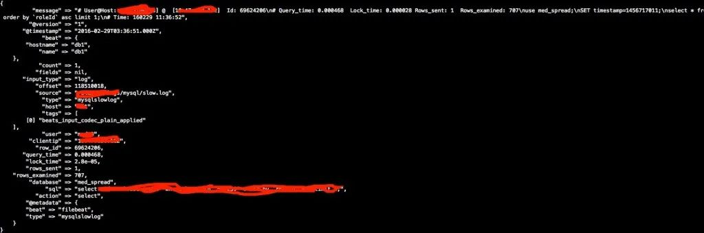
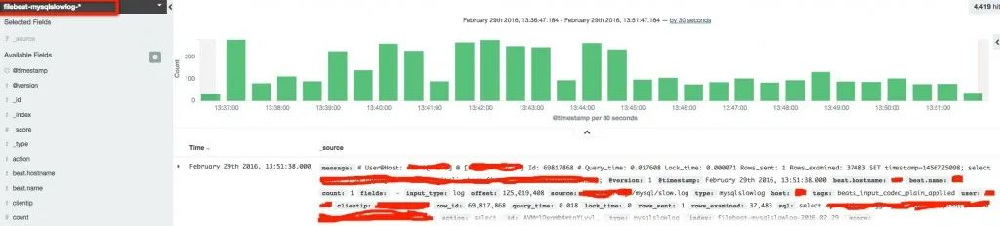

## ELK logstash 处理MySQL慢查询日志 

 

在生产环境下，logstash 经常会遇到处理多种格式的日志，不同的日志格式，解析方法不同。下面来说说logstash处理多行日志的例子，对MySQL慢查询日志进行分析，这个经常遇到过，网络上疑问也很多。

MySQL慢查询日志格式如下：

-  
-  
-  
-  
-  

User@Host: ttlsa[ttlsa] @ [10.4.10.12] Id: 69641319# Query_time: 0.000148 Lock_time: 0.000023 Rows_sent: 0 Rows_examined: 202SET timestamp=1456717595;select `Id`, `Url` from `File` where `Id` in ('201319', '201300');# Time: 160229 11:46:37

**1、filebeat配置‍：
** 

我这里是使用filebeat 1.1.1版本的，之前版本没有multiline配置项，具体方法看后面那种。

filebeat: prospectors:  -   paths:    - /www.ttlsa.com/logs/mysql/slow.log   document_type: mysqlslowlog   input_type: log   multiline:    negate: true    match: after registry_file: /var/lib/filebeat/registryoutput: logstash:  hosts: ["10.6.66.14:5046"]shipper:logging: files:logstash配置

‍

### **2、logstash配置**

#### **input段配置**

\# vi /etc/logstash/conf.d/01-beats-input.conf input { beats {  port => 5046  host => "10.6.66.14" }}

#### **filter 段配置**

 

\# vi /etc/logstash/conf.d/16-mysqlslowlog.log filter { if [type] == "mysqlslowlog" { grok {  match => { "message" => "(?m)^#\s+User@Host:\s+%{USER:user}\[[^\]]+\]\s+@\s+(?:(?<clienthost>\S*) )?\[(?:%{IPV4:clientip})?\]\s+Id:\s+%{NUMBER:row_id:int}\n#\s+Query_time:\s+%{NUMBER:query_time:float}\s+Lock_time:\s+%{NUMBER:lock_time:float}\s+Rows_sent:\s+%{NUMBER:rows_sent:int}\s+Rows_examined:\s+%{NUMBER:rows_examined:int}\n\s*(?:use %{DATA:database};\s*\n)?SET\s+timestamp=%{NUMBER:timestamp};\n\s*(?<sql>(?<action>\w+)\b.*;)\s*(?:\n#\s+Time)?.*$" } }  date {   match => [ "timestamp", "UNIX", "YYYY-MM-dd HH:mm:ss"]   remove_field => [ "timestamp" ]  } }}

关键之重是grok正则的配置。

**output段配置
** 

\# vi /etc/logstash/conf.d/30-beats-output.conf output {  if "_grokparsefailure" in [tags] {   file { path => "/var/log/logstash/grokparsefailure-%{[type]}-%{+YYYY.MM.dd}.log" }  }
  if [@metadata][type] in [ "mysqlslowlog" ] {  elasticsearch {   hosts => ["10.6.66.14:9200"]   sniffing => true   manage_template => false   template_overwrite => true   index => "[%{[@metadata\][beat]}-%{[type]}-%{+YYYY.MM.dd](mailto:%{[@metadata][beat]}-%{[type]}-%{+YYYY.MM.dd)}"   document_type => "%{[@metadata][type]}"  } }}

标准输出结果截图

elasticsearch结果截图

![Configure an index pattern  In order 忆 use Kibana you must configure at t one index pattern. Index patterns are used to identify the Elasticsearch inde  0 Index contains time-based events  0 Use event times to create index names [DEPRECATED]  Index name or pattern  ex names using 到 as a wildcard. Example: 《 st h-•  filebeat-mysqlslowlog-•  Do not expand index pattern when searching (Not recommended)  default, searches against any time-based index pattern that contains a wildcard will automatically 10 q  Searching against the index pattern logstash-• will actually query elasticsearch for the ec 禱 matching indices (e.g.  Time-field name 0 refresh fields  @timestamp  @ttlsa ℃ om  ](clip_image002-1598940548120.jpg)

如果是使用filebeat1.1.1之前的版本，配置如下：

#### *1. filebeat配置*

filebeat: prospectors:  -   paths:    - /www.ttlsa.com/logs/mysql/slow.log   document_type: mysqlslowlog   input_type: log registry_file: /var/lib/filebeat/registryoutput: logstash:  hosts: ["10.6.66.14:5046"]shipper:logging: files:

\2. logstash input段配

input { beats {  port => 5046  host => "10.6.66.14"  codec => multiline {   pattern => "^# User@Host:"   negate => true   what => previous  } }}

其它配置不变。

来源：http://www.ttlsa.com/elk/elk-logstash-process-mysql-slowlog/

