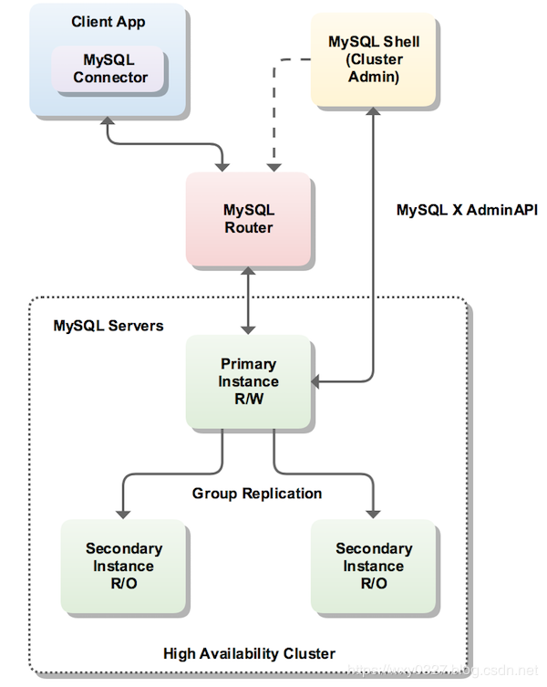
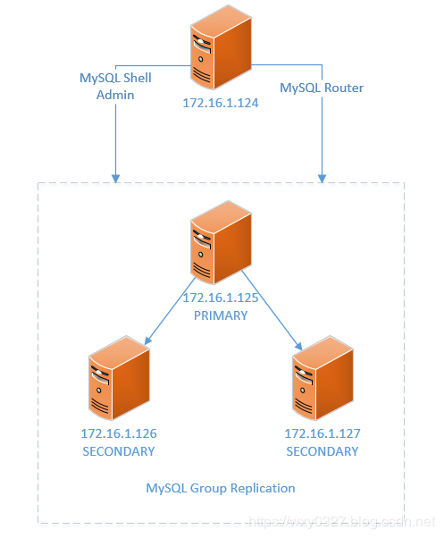

**目录**

[一、InnoDB Cluster简介](https://blog.csdn.net/wzy0623/article/details/100779450#一、InnoDB Cluster简介)

[1. 整体架构](https://blog.csdn.net/wzy0623/article/details/100779450#1. 整体架构)

[2. MySQL Shell](https://blog.csdn.net/wzy0623/article/details/100779450#2. MySQL Shell)

[3. MySQL Router](https://blog.csdn.net/wzy0623/article/details/100779450#3. MySQL Router)

[4. MySQL服务器集群](https://blog.csdn.net/wzy0623/article/details/100779450#4. MySQL服务器集群)

[二、创建InnoDB Cluster](https://blog.csdn.net/wzy0623/article/details/100779450#二、创建InnoDB Cluster)

[1. 检查实例配置](https://blog.csdn.net/wzy0623/article/details/100779450#1. 检查实例配置)

[2. 配置实例](https://blog.csdn.net/wzy0623/article/details/100779450#2. 配置实例)

[3. 创建集群](https://blog.csdn.net/wzy0623/article/details/100779450#3. 创建集群)

[4. 向集群添加实例](https://blog.csdn.net/wzy0623/article/details/100779450#4. 向集群添加实例)

[5. 查看集群状态](https://blog.csdn.net/wzy0623/article/details/100779450#5. 查看集群状态)

[6. 基于已有组复制的集群创建](https://blog.csdn.net/wzy0623/article/details/100779450#6. 基于已有组复制的集群创建)

[7. 配置MySQL Router](https://blog.csdn.net/wzy0623/article/details/100779450#7. 配置MySQL Router)

[8. 客户端连接测试](https://blog.csdn.net/wzy0623/article/details/100779450#8. 客户端连接测试)

[三、使用MySQL Shell管理InnoDB Cluster](https://blog.csdn.net/wzy0623/article/details/100779450#三、使用MySQL Shell管理InnoDB Cluster)

[1. 配置实例的自动重新加入](https://blog.csdn.net/wzy0623/article/details/100779450#1. 配置实例的自动重新加入)

[2. 从InnoDB Cluster中删除实例](https://blog.csdn.net/wzy0623/article/details/100779450#2. 从InnoDB Cluster中删除实例)

[3. 重启群集](https://blog.csdn.net/wzy0623/article/details/100779450#3. 重启群集)

[4. 解散InnoDB Cluster](https://blog.csdn.net/wzy0623/article/details/100779450#4. 解散InnoDB Cluster)

[5. 配置新主选举权重](https://blog.csdn.net/wzy0623/article/details/100779450#5. 配置新主选举权重)

[6. 配置故障转移一致性](https://blog.csdn.net/wzy0623/article/details/100779450#6. 配置故障转移一致性)

[7. 更改组复制拓扑](https://blog.csdn.net/wzy0623/article/details/100779450#7. 更改组复制拓扑)

[8. 设置InnoDB Cluster的选项](https://blog.csdn.net/wzy0623/article/details/100779450#8. 设置InnoDB Cluster的选项)

------

​     MySQL作为当今最流行的关系数据库系统，在其高可用特性上也在不断进行着尝试和改进。最初的MySQL版本只提供一种简单的主从异步复制，满足最基本的数据同步。为了提高复制性能，从单线程到组提交再到多线程复制，基本解决了复制延迟问题。为了解决从库与主库的一致性读问题，新增了半同步复制，而为了提供自动故障转移功能，又提供了组复制功能。要做到真正的高可用，失败切换必须对应用透明，于是在组复制的基础上，又发展出了InnoDB Cluster。本文说明InnoDB Cluster的相关概念、安装部署及管理维护。需要指出的一点是，在InnoDB  Cluster出现前，实现MySQL数据库的高可用性，除了原生的复制功能，通常还需要借助第三方中间件，如Keepalived、MHA等等。

# 一、InnoDB Cluster简介

## 1. 整体架构

​    InnoDB Cluster主要由MySQL Shell、MySQL Router和MySQL服务器集群组成，三者协同工作，共同为MySQL提供完整的高可用性解决方案。图1所示为InnoDB Cluster的整体架构。

图1 InnoDB Cluster架构

 

​    InnoDB Cluster以组复制为基础，集群中的每个MySQL服务器实例都是组复制的成员，提供了在InnoDB  Cluster内复制数据的机制，并且具有内置的故障转移功能。MySQL Shell在InnoDB  Cluster中充当控制台角色，使用它包含的AdminAPI，可以使安装、配置、管理、维护多个MySQL组复制实例的工作更加轻松。通过AdminAPI的几条交互指令就可自动完成组复制配置。MySQL  Router可以根据集群部署信息自动生成配置，将客户端应用程序透明地连接到MySQL服务器实例。如果服务器实例意外故障，群集将自动重新配置。在默认的单主模式下，InnoDB Cluster  具有单个读写主服务器实例。多个辅助服务器实例是主服务器实例的副本。如果主服务器出现故障，则辅助服务器将自动升级为主服务器。MySQL  Router可以检测到这种情况并将客户端应用程序自动转发到新的主服务器。

## 2. MySQL Shell

​    MySQL Shell是MySQL  Server的高级客户端和代码编辑器。除了和mysql命令行客户端程序一样，使用常规的SQL功能外，MySQL  Shell还提供了JavaScript和Python的脚本功能，并包含多个API，其中的AdminAPI用于操作InnoDB Cluster。

（1）主要功能
     MySQL Shell中提供了以下主要功能：

- MySQL Shell支持JavaScript、Python和SQL三种语言，缺省为JavaScript，用\js、\py、\sql进行语言切换。根据当前活动的语言，任何输入的代码都将作为其中一种语言进行处理。

- 提供交互式代码执行模式。

- 除了代码的交互式执行之外，MySQL Shell还可以从不同的源获取代码并对其进行处理，例如用mysqlsh执行一个名为code.js的文件： 

  ```
  mysqlsh --file code.js
  ```

   

- MySQL  Shell包含以下用JavaScript和Python实现的API，可以使用它们来开发与MySQL交互的代码。例如，当MySQL  Shell使用X协议连接到MySQL服务器时，X  DevAPI可以将MySQL用作文档数据库，提供与MongoDB类似的功能；使用AdminAPI能够管理InnoDB Cluster。

- 可以使用JavaScript或Python创建对象，对MySQL Shell基本功能进行扩展。

- MySQL Shell可以以表格、Tab分割、垂直或JSON格式输出返回结果。

- MySQL Shell包含许多以JavaScript和Python模式存在的内置全局对象：cluster代表InnoDB  Cluster；dba使用AdminAPI提供对InnoDB  Cluster管理功能的访问；session表示全局会话；db代表缺省数据库；shell提供对MySQL  Shell函数的访问；util提供MySQL ShellMySQL Shell实用程序。

（2）安装
     MySQL Shell可谓是“开箱即用”，只要根据操作系统平台选择下载安装包，然后将安装包解压即可直接使用，不需要任何其它额外安装过程。例如，要在Linux 64位平台上运行MySQL Shell，可从https://dev.mysql.com/downloads/shell/下载mysql-shell-8.0.17-linux-glibc2.12-x86-64bit.tar.gz文件，然后执行下面的命令：

```
tar -zxvf mysql-shell-8.0.17-linux-glibc2.12-x86-64bit.tar.gz
```

​     生成的mysql-shell-8.0.17-linux-glibc2.12-x86-64bit目录下有bin、lib、share三个子目录，分别存储可执行文件、库文件和文档。只要执行bin目录下的mysqlsh文件即可运行MySQL Shell：

```
[mysql@hdp1~]$~/mysql-shell-8.0.17-linux-glibc2.12-x86-64bit/bin/mysqlsh 


MySQL Shell 8.0.17


 


Copyright (c) 2016, 2019, Oracle and/or its affiliates. All rights reserved.


Oracle is a registered trademark of Oracle Corporation and/or its affiliates.


Other names may be trademarks of their respective owners.


 


Type '\help' or '\?' for help; '\quit' to exit.


 MySQL  JS > 
```

​    MySQL Shell包含的AdminAPI，可通过dba全局变量及其相关方法访问。dba变量的方法能够部署、配置和管理InnoDB Cluster。执行\? dba指令或dba.help()函数可以查看dba相关的所有方法：

```
 MySQL  JS > \? dba


NAME


      dba - Global variable for InnoDB cluster management.


 


DESCRIPTION


      The global variable dba is used to access the AdminAPI functionality and


      perform DBA operations. It is used for managing MySQL InnoDB clusters.


 


PROPERTIES


      verbose


            Enables verbose mode on the dba operations.


 


FUNCTIONS


      checkInstanceConfiguration(instance[, options])


            Validates an instance for MySQL InnoDB Cluster usage.


 


      ...


 


      For more help on a specific function use: dba.help('<functionName>')


 


      e.g. dba.help('deploySandboxInstance')


 MySQL  JS >
```

​    使用常规格式object.help('methodname')可以获得特定方法的联机帮助，例如：

```
 MySQL  JS > dba.help('getCluster')


NAME


      getCluster - Retrieves a cluster from the Metadata Store.


 


SYNTAX


      dba.getCluster([name][, options])


 


WHERE


      name: Parameter to specify the name of the cluster to be returned.


      options: Dictionary with additional options.


 


RETURNS


       The cluster object identified by the given name or the default cluster.


 


DESCRIPTION


      If name is not specified or is null, the default cluster will be


      returned.


 


      If name is specified, and no cluster with the indicated name is found, an


      error will be raised.


 


      The options dictionary accepts the connectToPrimary option, which


      defaults to true and indicates the shell to automatically connect to the


      primary member of the cluster.


 


EXCEPTIONS


      MetadataError in the following scenarios:


 


      - If the Metadata is inaccessible.


      - If the Metadata update operation failed.


 


      ArgumentError in the following scenarios:


 


      - If the Cluster name is empty.


      - If the Cluster name is invalid.


      - If the Cluster does not exist.


 


      RuntimeError in the following scenarios:


 


      - If the current connection cannot be used for Group Replication.


 MySQL  JS >
```

## 3. MySQL Router

​    在InnoDB Cluster架构中，MySQL  Router起到对应用程序透明路由的作用。当用--bootstrap选项引导路由时，会根据InnoDB  Cluster元数据自动生成或更新配置文件。这项功能专为结合InnoDB Cluster而设计，简化了对MySQL  Router配置的维护工作。关于MySQL Router的功能、安装、配置、启动等说明，参见“[MySQL Router 8 详解](https://wxy0327.blog.csdn.net/article/details/100518636)”。

## 4. MySQL服务器集群

​    这部分指组复制中的多个MySQL实例，是InnoDB Cluster得以实现的核心。关于组复制的概念原理、安装配置，参见以下系列文章：

- [MySQL 8 复制（七）——组复制基本原理](https://wxy0327.blog.csdn.net/article/details/95195028)
- [MySQL 8 复制（八）——组复制安装部署](https://wxy0327.blog.csdn.net/article/details/95619837)
- [MySQL 8 复制（九）——组复制联机配置](https://wxy0327.blog.csdn.net/article/details/96482662)
- [MySQL 8 复制（十）——组复制性能与限制](https://wxy0327.blog.csdn.net/article/details/97782304)

# 二、创建InnoDB Cluster

​    使用四台虚拟机搭建InnoDB Cluster，部署如图2所示：

图2 InnoDB Cluster部署

 

​    主机信息如下表所示。

| **主机名** | **IP:****端口**   | **角色或组件**            |
| ---------- | ----------------- | ------------------------- |
| hdp1       | 172.16.1.124      | MySQL Shell、MySQL Router |
| hdp2       | 172.16.1.125:3306 | 组复制成员PRIMARY         |
| hdp3       | 172.16.1.126:3306 | 组复制成员SECONDARY       |
| hdp4       | 172.16.1.127:3306 | 组复制成员SECONDARY       |

​    硬件配置为，每台主机CPU4核、内存8G、硬盘100G。软件版本如下：

- 操作系统：CentOS Linux release 7.2.1511 (Core) 64位
- MySQL Server：8.0.16（mysql-8.0.16-linux-glibc2.12-x86_64.tar.xz） 
- MySQL Shell：8.0.17（mysql-shell-8.0.17-linux-glibc2.12-x86-64bit.tar.gz）
- MySQL Router：8.0.17（mysql-router-8.0.17-linux-glibc2.12-x86_64.tar.xz）

​    MySQL Server、MySQL Shell、MySQL Router都已经安装好。MySQL Server和MySQL Router的安装分别参见“[https://wxy0327.blog.csdn.net/article/details/90081518#%E4%B8%89%E3%80%81%E5%AE%89%E8%A3%85mysql-8.0.16](https://wxy0327.blog.csdn.net/article/details/90081518#三、安装mysql-8.0.16)”和“[https://wxy0327.blog.csdn.net/article/details/100518636#1.%20%E5%AE%89%E8%A3%85](https://wxy0327.blog.csdn.net/article/details/100518636#1. 安装)”。

​    下面使用MySQL Shell创建InnoDB Cluster，并配置MySQL Router为应用客户端提供对InnoDB Cluster实例的透明连接。在创建InnoDB Cluster之前，要确保使用的服务器实例满足以下要求：

- InnoDB Cluster使用组复制，因此服务器实例必须满足组复制的要求。 

- 组复制仅支持InnoDB存储引擎。其它如MyISAM表不能由组复制写入。

- 必须在InnoDB Cluster中的所有实例上启用性能模式（Performance Schema ）。

- MySQL Shell用于配置InnoDB Cluster脚本需要访问Python 2.7版。在Linux上，必须将Python作为shell环境的一部分。下面的操作系统命令检查是否正确配置了Python： 

  ```
  $ /usr/bin/env python
  ```

   

- 如果Python解释器启动，则无需进一步操作。否则可能需要在/usr/bin/python和Python二进制文件之间创建一个软链接。

- 所有实例必须具有唯一的server_id。

## 1. 检查实例配置

​    AdminAPI提供dba.checkInstanceConfiguration()方法以验证实例是否满足组复制要求，该方法不会更改实例上的任何配置，也不会检查实例上的任何数据。下面是检查172.16.1.125:3306的命令和输出：

```
[mysql@hdp1~]$mysqlsh 


MySQL Shell 8.0.17


 


Copyright (c) 2016, 2019, Oracle and/or its affiliates. All rights reserved.


Oracle is a registered trademark of Oracle Corporation and/or its affiliates.


Other names may be trademarks of their respective owners.


 


Type '\help' or '\?' for help; '\quit' to exit.


 MySQL  JS > dba.checkInstanceConfiguration('wxy@172.16.1.125:3306')


Please provide the password for 'wxy@172.16.1.125:3306': ******


Save password for 'wxy@172.16.1.125:3306'? [Y]es/[N]o/Ne[v]er (default No): 


Validating MySQL instance at 172.16.1.125:3306 for use in an InnoDB cluster...


 


This instance reports its own address as hdp2:3306


Clients and other cluster members will communicate with it through this address by default. If this is not correct, the report_host MySQL system variable should be changed.


 


Checking whether existing tables comply with Group Replication requirements...


No incompatible tables detected


 


Checking instance configuration...


 


NOTE: Some configuration options need to be fixed:


+--------------------------+---------------+----------------+--------------------------------------------------+


| Variable                 | Current Value | Required Value | Note                                             |


+--------------------------+---------------+----------------+--------------------------------------------------+


| binlog_checksum          | CRC32         | NONE           | Update the server variable                       |


| enforce_gtid_consistency | OFF           | ON             | Update read-only variable and restart the server |


| gtid_mode                | OFF           | ON             | Update read-only variable and restart the server |


| server_id                | 1             | <unique ID>    | Update read-only variable and restart the server |


+--------------------------+---------------+----------------+--------------------------------------------------+


 


Some variables need to be changed, but cannot be done dynamically on the server.


NOTE: Please use the dba.configureInstance() command to repair these issues.


 


{


    "config_errors": [


        {


            "action": "server_update", 


            "current": "CRC32", 


            "option": "binlog_checksum", 


            "required": "NONE"


        }, 


        {


            "action": "server_update+restart", 


            "current": "OFF", 


            "option": "enforce_gtid_consistency", 


            "required": "ON"


        }, 


        {


            "action": "server_update+restart", 


            "current": "OFF", 


            "option": "gtid_mode", 


            "required": "ON"


        }, 


        {


            "action": "server_update+restart", 


            "current": "1", 


            "option": "server_id", 


            "required": "<unique ID>"


        }


    ], 


    "status": "error"


}


 MySQL  JS >
```

​     在表格中列出了四个检查项：binlog_checksum、enforce_gtid_consistency、gtid_mode、server_id的当前值和所需值，及其修改它们要采取的措施。同时指出，使用dba.configureInstance()来修复这些问题。

​    对集群中的每个服务器实例重复此过程：

```
dba.checkInstanceConfiguration('wxy@172.16.1.126:3306')


dba.checkInstanceConfiguration('wxy@172.16.1.127:3306')
```

​    运行dba.checkInstanceConfiguration()之后生成的报告提供了有关所需的任何配置更改的信息，要正确配置这些属性后，才能继续创建集群。

## 2. 配置实例

​    AdminAPI提供了dba.configureInstance()函数，用于检查实例是否针对InnoDB Cluster 进行了适当配置，并在发现任何与InnoDB  Cluster不兼容的设置时配置实例。如果实例不需要更改配置，dba.configureInstance()命令输出确认实例已准备好使用InnoDB Cluster。根据MySQL  Shell连接到实例的方式以及在实例上运行的MySQL版本，能够通过将这些更改自动保存到远程实例的配置文件（缺省为MySQL实例数据目录下的mysqld-auto.cnf文件）来持久化更改，或者手动更改实例的配置文件。无论进行配置更改的方式如何，必须重新启动实例以确保服务器检测到配置更改。下面是配置172.16.1.125:3306的命令和输出：

```
 MySQL  JS > dba.configureInstance('wxy@172.16.1.125:3306')


Please provide the password for 'wxy@172.16.1.125:3306': ******


Save password for 'wxy@172.16.1.125:3306'? [Y]es/[N]o/Ne[v]er (default No): 


Configuring MySQL instance at 172.16.1.125:3306 for use in an InnoDB cluster...


 


This instance reports its own address as hdp2:3306


Clients and other cluster members will communicate with it through this address by default. If this is not correct, the report_host MySQL system variable should be changed.


 


NOTE: Some configuration options need to be fixed:


+--------------------------+---------------+----------------+--------------------------------------------------+


| Variable                 | Current Value | Required Value | Note                                             |


+--------------------------+---------------+----------------+--------------------------------------------------+


| binlog_checksum          | CRC32         | NONE           | Update the server variable                       |


| enforce_gtid_consistency | OFF           | ON             | Update read-only variable and restart the server |


| gtid_mode                | OFF           | ON             | Update read-only variable and restart the server |


| server_id                | 1             | <unique ID>    | Update read-only variable and restart the server |


+--------------------------+---------------+----------------+--------------------------------------------------+


 


Some variables need to be changed, but cannot be done dynamically on the server.


Do you want to perform the required configuration changes? [y/n]: y


Do you want to restart the instance after configuring it? [y/n]: y


Configuring instance...


The instance '172.16.1.125:3306' was configured for InnoDB cluster usage.


Restarting MySQL...


NOTE: MySQL server at 172.16.1.125:3306 was restarted.


 MySQL  JS >
```

​    一旦针对实例发出dba.configureInstance()，该命令首先检查实例的当前设置是否适合InnoDB  Cluster使用，并将在一个报告中显示InnoDB  Cluster所需的设置。这步与dba.checkInstanceConfiguration的作用类似。

​    当针对MySQL  Shell当前运行的本地MySQL实例发出dba.configureInstance()时，它会尝试自动配置实例。对远程实例发出dba.configureInstance()时，如果实例支持自动保持配置更改，则可以选择执行此操作。满足以下要求的实例会自动支持持久配置更改：

- 该实例正在运行MySQL 8.0.11或更高版本。
- persisted_globals_load设置为ON（缺省值）。

​    如果远程实例不支持持久化更改以配置InnoDB群集使用，则必须在本地配置实例。

​     对于动态服务器变量，在dba.configureInstance()后不需要重新启动实例，但对只读服务器变量，需要重启实例。此信息显示在发出dba.configureInstance()之后生成的报告中。如果实例支持RESTART语句，则MySQL Shell可以关闭然后启动实例。这可确保mysqld检测到对实例配置文件所做的更改。

​    执行dba.configureInstance()后再次检查实例配置的输出如下：

```
 MySQL  JS > dba.checkInstanceConfiguration('wxy@172.16.1.125:3306')


Please provide the password for 'wxy@172.16.1.125:3306': ******


Save password for 'wxy@172.16.1.125:3306'? [Y]es/[N]o/Ne[v]er (default No): 


Validating MySQL instance at 172.16.1.125:3306 for use in an InnoDB cluster...


 


This instance reports its own address as hdp2:3306


Clients and other cluster members will communicate with it through this address by default. If this is not correct, the report_host MySQL system variable should be changed.


 


Checking whether existing tables comply with Group Replication requirements...


No incompatible tables detected


 


Checking instance configuration...


Instance configuration is compatible with InnoDB cluster


 


The instance '172.16.1.125:3306' is valid for InnoDB cluster usage.


 


{


    "status": "ok"


}


 MySQL  JS >
```

​    对集群中的每个服务器实例重复配置过程：

```
dba.configureInstance('wxy@172.16.1.126:3306')


dba.configureInstance('wxy@172.16.1.127:3306')
```

## 3. 创建集群

​    准备好实例后，使用dba.createCluster()函数创建集群，参数为自定义的集群名称。在创建集群之前，MySQL  Shell必须连接到一个实例，并将该实例用作群集的种子实例。种子实例将被复制到添加到群集的其它实例，从而使它们成为种子实例的副本。当发出dba.createCluster(name)时，MySQL  Shell会创建与连接到的服务器实例的会话。下面是以172.16.1.125:3306作为种子实例创建名为testCluster集群的命令及输出：

```
 MySQL  JS > \connect wxy@172.16.1.125:3306


Creating a session to 'wxy@172.16.1.125:3306'


Please provide the password for 'wxy@172.16.1.125:3306': ******


Save password for 'wxy@172.16.1.125:3306'? [Y]es/[N]o/Ne[v]er (default No): 


Fetching schema names for autocompletion... Press ^C to stop.


Your MySQL connection id is 616


Server version: 8.0.16 MySQL Community Server - GPL


No default schema selected; type \use <schema> to set one.


 MySQL  172.16.1.125:3306 ssl  JS > dba.createCluster('testCluster')


A new InnoDB cluster will be created on instance '172.16.1.125:3306'.


 


Validating instance at 172.16.1.125:3306...


 


This instance reports its own address as hdp2:3306


 


Instance configuration is suitable.


Creating InnoDB cluster 'testCluster' on '172.16.1.125:3306'...


 


Adding Seed Instance...


Cluster successfully created. Use Cluster.addInstance() to add MySQL instances.


At least 3 instances are needed for the cluster to be able to withstand up to


one server failure.


 


<Cluster:testCluster>


 MySQL  172.16.1.125:3306 ssl  JS >
```

​    dba.createCluster函数返回一个Cluster对象。千万注意，一旦服务器实例属于一个集群，只使用MySQL  Shell和AdminAPI来管理它们。尝试在实例添加到群集后手动更改组复制的配置不受支持。同样，不支持修改对InnoDB  Cluster至关重要的服务器变量，例如在使用AdminAPI配置实例后的server_uuid。

​    要能够容忍一个实例的失败，集群至少包含三个MySQL实例，添加更多实例会增加对实例失败的容忍度。下面添加另外两个实例。

## 4. 向集群添加实例

​    使用Cluster.addInstance(instance)函数向集群添加更多实例，其中instance是已配置实例的连接信息。下面是将172.16.1.126:3306实例添加到集群的命令及输出：

```
 MySQL  172.16.1.125:3306 ssl  JS > var cluster = dba.getCluster()


 MySQL  172.16.1.125:3306 ssl  JS > cluster.addInstance('wxy@172.16.1.126:3306')


Please provide the password for 'wxy@172.16.1.126:3306': ******


Save password for 'wxy@172.16.1.126:3306'? [Y]es/[N]o/Ne[v]er (default No): 


 


NOTE: The target instance '172.16.1.126:3306' has not been pre-provisioned (GTID set


is empty). The Shell is unable to decide whether incremental distributed state


recovery can correctly provision it.


The safest and most convenient way to provision a new instance is through


automatic clone provisioning, which will completely overwrite the state of


'172.16.1.126:3306' with a physical snapshot from an existing cluster member.


To use this method by default, set the 'recoveryMethod' option to 'clone'.


 


The incremental distributed state recovery may be safely used if you are sure


all updates ever executed in the cluster were done with GTIDs enabled, there


are no purged transactions and the new instance contains the same GTID set as


the cluster or a subset of it. To use this method by default, set the


'recoveryMethod' option to 'incremental'.


 


 


Please select a recovery method [I]ncremental recovery/[A]bort (default Incremental recovery): 


Validating instance at 172.16.1.126:3306...


 


This instance reports its own address as hdp3:3306


 


Instance configuration is suitable.


A new instance will be added to the InnoDB cluster. Depending on the amount of


data on the cluster this might take from a few seconds to several hours.


 


Adding instance to the cluster...


 


Monitoring recovery process of the new cluster member. Press ^C to stop monitoring and let it continue in background.


Incremental distributed state recovery is now in progress.


 


* Waiting for distributed recovery to finish...


NOTE: '172.16.1.126:3306' is being recovered from 'hdp2:3306'


* Distributed recovery has finished


 


The instance '172.16.1.126:3306' was successfully added to the cluster.


 


 MySQL  172.16.1.125:3306 ssl  JS >
```

​     首先调用dba.getCluster()函数获取集群对象，并赋予一个变量。如果未指定群集名称，则返回默认群集。缺省情况下使用dba.getCluster()时，MySQL  Shell会尝试连接到群集的主实例。设置connectToPrimary选项以配置此行为。如果connectToPrimary为true且活动的全局MySQL  Shell会话不是主实例，则会查询主节点的集群，并且集群对象将连接到该集群。如果connectToPrimary为false，则集群对象使用活动会话，就是与MySQL Shell当前全局会话相同的实例。

​    要在获取群集时强制连接到辅助节点，请建立与群集的辅助成员的连接，并通过发出以下命令来使用connectToPrimary选项：

```
mysql-js> shell.connect(secondary_member)


mysql-js> var cluster1 = dba.getCluster(testCluster, {connectToPrimary:false})
```

​    注意辅助实例的super_read_only = ON，因此无法对其进行更改。

​    如果使用的是MySQL  8.0.17或更高版本，可以选择实例如何恢复与群集同步所需的事务，可选方式有克隆和增量两种，缺省为增量。只有当加入实例恢复了先前由集群处理的所有事务时，它才能作为在线实例加入并开始处理事务。同样在8.0.17及更高版本中，可以使用waitRecovery选项控制Cluster.addInstance()的行为方式，让恢复操作在后台进行或监视MySQL Shell中的不同级别的进度。

​     如果要在一个已经包含大量数据（几十G会数百G）的集群中添加实例，推荐的方法是使用xtrabackup复制一个主节点副本，然后添加该副本实例时使用增量恢复。这样做有两个明显的优点，一是可以在对主节点影响最小的情况下联机执行，二是减少实例恢复所需时间。如何使用xtrabackup进行联机复制可以参考“[https://wxy0327.blog.csdn.net/article/details/95619837#5.%20%E5%90%91%E7%BB%84%E4%B8%AD%E6%B7%BB%E5%8A%A0%E5%AE%9E%E4%BE%8B](https://wxy0327.blog.csdn.net/article/details/95619837#5. 向组中添加实例)”。

​    以同样的方法添加第三个实例：

```
cluster.addInstance('wxy@172.16.1.127:3306')
```

## 5. 查看集群状态

​    集群对象提供status()方法，可以检查集群状态。在检查InnoDB  Cluster的状态之前，需要通过连接到集群中的任何实例来获取对InnoDB  Cluster对象的引用。但如果要更改群集的配置，则必须连接到可读写实例。status()从所连接的服务器实例的集群视图检索集群的状态，并输出状态报告。所连接实例的状态直接影响状态报告中提供的信息，因此应确保连接实例的状态为ONLINE。下面是连接172.16.1.125:3306获取集群状态及输出：

```
 MySQL  172.16.1.125:3306 ssl  JS > cluster.status()


{


    "clusterName": "testCluster", 


    "defaultReplicaSet": {


        "name": "default", 


        "primary": "hdp2:3306", 


        "ssl": "REQUIRED", 


        "status": "OK", 


        "statusText": "Cluster is ONLINE and can tolerate up to ONE failure.", 


        "topology": {


            "hdp2:3306": {


                "address": "hdp2:3306", 


                "mode": "R/W", 


                "readReplicas": {}, 


                "role": "HA", 


                "status": "ONLINE", 


                "version": "8.0.16"


            }, 


            "hdp3:3306": {


                "address": "hdp3:3306", 


                "mode": "R/O", 


                "readReplicas": {}, 


                "role": "HA", 


                "status": "ONLINE", 


                "version": "8.0.16"


            }, 


            "hdp4:3306": {


                "address": "hdp4:3306", 


                "mode": "R/O", 


                "readReplicas": {}, 


                "role": "HA", 


                "status": "ONLINE", 


                "version": "8.0.16"


            }


        }, 


        "topologyMode": "Single-Primary"


    }, 


    "groupInformationSourceMember": "hdp2:3306"


}


 MySQL  172.16.1.125:3306 ssl  JS >
```

​    Cluster.status()的输出提供以下信息：

- clusterName：在dba.createCluster期间分配给此集群的名称。
- defaultReplicaSet：属于InnoDB Cluster并包含数据集的服务器实例。
- primary：仅在群集以单主模式运行时显示。显示当前主实例的地址。如果未显示此字段，则群集将以多主模式运行。
- ssl：群集是否使用安全连接。显示REQUIRED或DISABLED的值，缺省为REQUIRED，具体取决于在createCluster()或addInstance()期间如何配置memberSslMode选项。此参数返回的值对应于实例上的group_replication_ssl_mode服务器变量的值。
- status：集群状态，反映了此群集可提供的高可用性。实例状态为以下之一：ONLINE，实例在线并参与群集；OFFLINE，实例已失去与其它实例的连接；RECOVERING，实例尝试通过在成为ONLINE成员之前检索所需的事务来尝试与集群同步；UNREACHABLE，实例已丢失与群集的通信；ERROR，实例在恢复阶段或应用事务时遇到错误。实例进入ERROR状态后，super_read_only选项设置为ON，要退出ERROR状态，必须手动设置super_read_only = OFF。MISSING，实例的状态，它是已配置群集的一部分，但当前不可用。MISSING状态特定于InnoDB  Cluster，它不是Group Replication生成的状态。MySQL  Shell使用此状态来指示在元数据中注册但在实时群集视图中找不到的实例。
- topology：已添加到集群的实例。
- 实例的主机名。
- role：此实例在集群中提供的功能，目前只有HA。
- mode：服务器是读写（“R/W”）还是只读（“R/O”）。从版本8.0.17开始，从实例中super_read_only变量的当前状态以及群集是否具有仲裁派生的。在之前版本中，mode的值来自实例是作为主实例还是辅助实例。通常，如果实例是主要的，则模式为“R/W”，如果为辅助实例，则模式为“R/O”。无论super_read_only变量的状态如何，群集中没有可见仲裁的任何实例都标记为“R/O”。
- groupInformationSourceMember：用于获取有关集群的信息的内部连接，显示为类似URI的连接字符串，通常为最初用于创建集群的连接。

​    要显示有关群集的更多信息，可使用扩展选项。如Cluster.status({'extended'：value})提供附加信息，value值控制输出信息：

- 0：默认值，禁用附加信息。
- 1：包括有关组复制报告的组复制协议版本，组名称，集群成员UUID，集群成员角色和状态以及受防护系统变量列表的信息。
- 2：包括有关连接和应用程序处理的事务的信息。

## 6. 基于已有组复制的集群创建

​    如果在已经配置好的组复制上创建InnoDB  Cluster，并且希望使用它来创建集群，可将adoptFromGR选项传递给dba.createCluster()函数。创建的InnoDB  Cluster会匹配复制组是以单主数据库还是多主数据库运行。    要采用现有的组复制组，使用MySQL  Shell连接到组成员。以下示例采用单主组复制，172.16.1.125:3306为主实例，172.16.1.126:3306和172.16.1.127:3306为两个辅助实例。这里连接到172.16.1.125:3306创建集群。

```
mysqlsh --uri wxy@172.16.1.125:3306


 MySQL  172.16.1.125:3306 ssl  JS > var cluster = dba.createCluster('testCluster', {adoptFromGR: true});


A new InnoDB cluster will be created based on the existing replication group on instance '172.16.1.125:3306'.


 


Creating InnoDB cluster 'testCluster' on '172.16.1.125:3306'...


 


Adding Seed Instance...


Adding Instance 'hdp3:3306'...


Adding Instance 'hdp4:3306'...


Adding Instance 'hdp2:3306'...


Resetting distributed recovery credentials across the cluster...


Cluster successfully created based on existing replication group.


 MySQL  172.16.1.125:3306 ssl  JS >
```

新群集与组复制的模式匹配。如果组复制以单主模式运行，则会创建单主群集。如果组复制以多主模式运行，则会创建多主集群。

## 7. 配置MySQL Router

​    MySQL Router可以使用--bootstrap选项基于InnoDB  Cluster的元数据进行自我配置。这会自动配置MySQL Router以将连接路由到群集的服务器实例。客户端应用程序连接到MySQL  Router提供的端口，无需了解InnoDB Cluster拓扑。如果发生意外故障，InnoDB Cluster会自动调整，MySQL  Router会检测到更改。这消除了客户端应用程序处理故障转移的需求。MySQL不建议手动配置MySQL Router以重定向到InnoDB  Cluster的端口，而是建议始终使用--bootstrap选项，因为这可确保MySQL Router从InnoDB  Cluster的元数据中获取其配置。使用生产部署时，建议将MySQL Router部署于客户端应用程序所在的每台计算机上。

​    MySQL Router使用包含的元数据缓存插件来检索InnoDB Cluster的元数据，该元数据由构成InnoDB  Cluster的服务器实例地址列表及其在集群中的角色组成。MySQL Router从它所连接的实例中检索InnoDB  Cluster元数据，例如172.16.1.125:3306：

```
[mysql@hdp1~]$mysqlrouter --bootstrap wxy@172.16.1.125:3306


Please enter MySQL password for wxy: 


# Reconfiguring system MySQL Router instance...


 


WARNING: router_id 1 not found in metadata


- Checking for old Router accounts


  - No prior Router accounts found


- Creating mysql account mysql_router1_c13bmjjayuwr@'%' for cluster management


- Storing account in keyring


- Adjusting permissions of generated files


- Creating configuration /home/mysql/mysql-router-8.0.17-linux-glibc2.12-x86_64/mysqlrouter.conf


 


# MySQL Router configured for the InnoDB cluster 'testCluster'


 


After this MySQL Router has been started with the generated configuration


 


    $ /etc/init.d/mysqlrouter restart


or


    $ systemctl start mysqlrouter


or


    $ mysqlrouter -c /home/mysql/mysql-router-8.0.17-linux-glibc2.12-x86_64/mysqlrouter.conf


 


the cluster 'testCluster' can be reached by connecting to:


 


## MySQL Classic protocol


 


- Read/Write Connections: localhost:6446


- Read/Only Connections:  localhost:6447


 


## MySQL X protocol


 


- Read/Write Connections: localhost:64460


- Read/Only Connections:  localhost:64470


 


 


Existing configuration backed up to '/home/mysql/mysql-router-8.0.17-linux-glibc2.12-x86_64/mysqlrouter.conf.bak'


 


Existing dynamic state backed up to '/home/mysql/mysql-router-8.0.17-linux-glibc2.12-x86_64/var/lib/mysqlrouter/state.json.bak'


[mysql@hdp1~]$
```

​    基于检索到的InnoDB Cluster元数据，MySQL  Router自动配置mysqlrouter.conf文件，包括带有bootstrap_server_addresses的metadata_cache部分，其中包含集群中所有服务器实例的地址。下面是引导时自动生成的/home/mysql/mysql-router-8.0.17-linux-glibc2.12-x86_64/mysqlrouter.conf文件的内容：

```
# File automatically generated during MySQL Router bootstrap


[DEFAULT]


name=system


keyring_path=/home/mysql/mysql-router-8.0.17-linux-glibc2.12-x86_64/var/lib/mysqlrouter/keyring


master_key_path=/home/mysql/mysql-router-8.0.17-linux-glibc2.12-x86_64/mysqlrouter.key


connect_timeout=15


read_timeout=30


dynamic_state=/home/mysql/mysql-router-8.0.17-linux-glibc2.12-x86_64/var/lib/mysqlrouter/state.json


 


[logger]


level = INFO


 


[metadata_cache:testCluster]


router_id=1


user=mysql_router1_c13bmjjayuwr


metadata_cluster=testCluster


ttl=0.5


use_gr_notifications=0


 


[routing:testCluster_default_rw]


bind_address=0.0.0.0


bind_port=6446


destinations=metadata-cache://testCluster/default?role=PRIMARY


routing_strategy=first-available


protocol=classic


 


[routing:testCluster_default_ro]


bind_address=0.0.0.0


bind_port=6447


destinations=metadata-cache://testCluster/default?role=SECONDARY


routing_strategy=round-robin-with-fallback


protocol=classic


 


[routing:testCluster_default_x_rw]


bind_address=0.0.0.0


bind_port=64460


destinations=metadata-cache://testCluster/default?role=PRIMARY


routing_strategy=first-available


protocol=x


 


[routing:testCluster_default_x_ro]


bind_address=0.0.0.0


bind_port=64470


destinations=metadata-cache://testCluster/default?role=SECONDARY


routing_strategy=round-robin-with-fallback


protocol=x
```

​    通过在引导MySQL  Router之后添加另一个服务器实例来更改群集的拓扑时，需要根据更新的元数据更新bootstrap_server_addresses。可以使用--bootstrap选项重新引导MySQL Router并重启MySQL Router达到此目的。

​    生成的MySQL Router配置会创建用于连接到群集的TCP端口，包括使用经典MySQL协议和X协议与群集通信的端口，缺省值如下：

- 6446：用于经典MySQL协议读写会话，MySQL Router将传入连接重定向到主服务器实例。
- 6447：对于经典MySQL协议只读会话，MySQL Router将传入连接重定向到其中一个辅助服务器实例。
- 64460：用于X协议读写会话，MySQL Router将传入连接重定向到主服务器实例。
- 64470：用于X协议只读会话，MySQL Router将传入连接重定向到其中一个辅助服务器实例。

​    传入连接的重定向方式取决于所使用的群集类型。使用单主群集时，默认情况下，MySQL  Router会发布X协议和经典协议端口，客户端连接到这些端口（如6446或64460）以进行读写会话，并重定向到群集的单个主节点。使用多主群集时，读写会话将以循环方式重定向到其中一个主实例。例如，到端口6446的第一个连接将被重定向到主实例1，到端口6446的第二个连接将被重定向到主实例2，依此类推。对于传入的只读连接，MySQL Router以循环方式将连接重定向到其中一个辅助实例。路由策略由routing_strategy选项控制，参见“[https://wxy0327.blog.csdn.net/article/details/100518636#2.%20%E5%90%AF%E5%8A%A8](https://wxy0327.blog.csdn.net/article/details/100518636#2. 启动)”。

​    使用--bootstrap选项进行引导后，执行下面的命令后台启动MySQL Router：

```
[mysql@hdp1~]$mysqlrouter &
```

## 8. 客户端连接测试

​    现在，可以将MySQL客户端（如mysql或MySQL Shell）连接到其中一个传入的MySQL  Router端口，并查看客户端如何透明地连接到其中一个InnoDB  Cluster实例。测试脚本文件router_connect_test.sh的内容如下：

```
mysql -uwxy -123456 -P6446 --protocol=TCP -N -r -B -e"select @@hostname"


mysql -uwxy -123456 -P6446 --protocol=TCP -N -r -B -e"select @@hostname"


mysql -uwxy -123456 -P6447 --protocol=TCP -N -r -B -e"select @@hostname"


mysql -uwxy -123456 -P6447 --protocol=TCP -N -r -B -e"select @@hostname"


mysql -uwxy -123456 -P6447 --protocol=TCP -N -r -B -e"select @@hostname"


mysqlsh --sql -uwxy -123456 -P64460 -e"select @@hostname"


mysqlsh --sql -uwxy -123456 -P64460 -e"select @@hostname"


mysqlsh --sql -uwxy -123456 -P64470 -e"select @@hostname"


mysqlsh --sql -uwxy -123456 -P64470 -e"select @@hostname"


mysqlsh --sql -uwxy -123456 -P64470 -e"select @@hostname"
```

​    执行测试脚本并将结果输出导文件：

```
[mysql@hdp1~]$./router_connect_test.sh > result.txt
```

​    查看测试结果：

```
[mysql@hdp1~]$cat result.txt


hdp2


hdp2


hdp3


hdp4


hdp3


@@hostname


hdp2


@@hostname


hdp2


@@hostname


hdp4


@@hostname


hdp3


@@hostname


hdp4


[mysql@hdp1~]$
```

\9. 测试高可用性
     要测试高可用性是否有效，可以通过终止实例来模拟意外停止。群集检测到实例离开群集并重新配置自身，重新配置的确切方式取决于使用的是单主群集还是多主群集，以及实例在群集中的角色。在单主模式下：

- 如果当前主节点离开集群，则其中一个辅助实例被选为新主节点，其中实例由最低server_uuid区分优先级。MySQL Router将读写连接重定向到新选择的主节点。
- 如果当前辅助节点离开群集，MySQL Router将停止将只读连接重定向到该实例。

（1）停止172.16.1.125:3306实例，测试客户端连接

```
# 在hdp2上执行


mysqladmin -uroot -p123456 shutdown


# 在hdp1上执行


router_connect_test.sh > result.txt


cat result.txt
```

​    测试结果如下：

```
hdp3


hdp3


hdp4


hdp4


hdp4


@@hostname


hdp3


@@hostname


hdp3


@@hostname


hdp4


@@hostname


hdp4


@@hostname


hdp4
```

​    停止hdp2后，选举的新主节点为hdp3，集群变为了一主一从，客户端访问正常。

（2）重新启动172.16.1.125:3306实例，测试客户端连接

```
# 在hdp2上执行


mysqld_safe &


# 在hdp1上执行


router_connect_test.sh > result.txt


cat result.txt
```

​    测试结果如下：

```
hdp3


hdp3


hdp2


hdp4


hdp2


@@hostname


hdp3


@@hostname


hdp3


@@hostname


hdp2


@@hostname


hdp4


@@hostname


hdp2
```

​    启动hdp2后，它自动变为辅助节点，集群又成了一主两从，客户端访问正常。

（3）停止172.16.1.127:3306实例，测试客户端连接

```
# 在hdp4上执行


mysqladmin -uroot -p123456 shutdown 


# 在hdp1上执行


router_connect_test.sh > result.txt


cat result.txt
```

​    测试结果如下：

```
hdp3


hdp3


hdp2


hdp2


hdp2


@@hostname


hdp3


@@hostname


hdp3


@@hostname


hdp2


@@hostname


hdp2


@@hostname


hdp2
```

​    停止hdp4后，集群变为了一主一从，客户端访问正常。

（4）重新启动172.16.1.127:3306实例，测试客户端连接

```
# 在hdp4上执行


mysqld_safe &


# 在hdp1上执行


router_connect_test.sh > result.txt


cat result.txt
```

​    测试结果如下：

```
hdp3


hdp3


hdp2


hdp4


hdp2


@@hostname


hdp3


@@hostname


hdp3


@@hostname


hdp2


@@hostname


hdp4


@@hostname


hdp2
```

​    启动hdp4后，集群又成为了一主两从，客户端访问正常。

# 三、使用MySQL Shell管理InnoDB Cluster

​    本节介绍如何使用MySQL Shell处理常见的InnoDB Cluster管理任务，大部分配置本质上是使用MySQL Shell提供的方法和选项配置组复制相关的系统变量。

## 1. 配置实例的自动重新加入

​    运行MySQL 8.0.16及更高版本的实例支持组复制自动重新加入功能，可以将实例配置为在被驱逐后自动重新加入群集。  AdminAPI提供了autoRejoinTries选项，用于配置在驱逐后重新加入群集的尝试次数。默认情况下，实例不会自动重新加入群集。可以使用以下命令在集群级别或单个实例上配置autoRejoinTries选项：

- dba.createCluster()
- Cluster.addInstance()
- Cluster.setOption()
- Cluster.setInstanceOption()

​    autoRejoinTries选项对应group_replication_autorejoin_tries系统变量，例如将重连尝试次数由缺省的0改为10：

```
[mysql@hdp1~]$mysql -uwxy -p123456 -P6446 --protocol=TCP -N -r -B -e"select @@group_replication_autorejoin_tries"


Warning: Using a password on the command line interface can be insecure.


0


[mysql@hdp1~]$mysqlsh --uri wxy@172.16.1.126:3306 -p123456 -e "var cluster = dba.getCluster(); cluster.setOption('autoRejoinTries',10)"


WARNING: Using a password on the command line interface can be insecure.


WARNING: Each cluster member will only proceed according to its exitStateAction if auto-rejoin fails (i.e. all retry attempts are exhausted).


 


Setting the value of 'autoRejoinTries' to '10' in all ReplicaSet members ...


 


Successfully set the value of 'autoRejoinTries' to '10' in the 'default' ReplicaSet.


[mysql@hdp1~]$mysql -uwxy -p123456 -P6446 --protocol=TCP -N -r -B -e"select @@group_replication_autorejoin_tries"


Warning: Using a password on the command line interface can be insecure.


10


[mysql@hdp1~]$
```

​    autoRejoinTries选项接受介于0和2016之间的正整数值，默认值为0，即不尝试自动重新加入。自动重连适用于网络不稳定的场景。

​    运行MySQL  8.0.12及更高版本的实例具有group_replication_exit_state_action变量，可以使用AdminAPI  exitStateAction选项配置该变量。这可以控制在意外离开集群时实例执行的操作。默认情况下，exitStateAction选项为READ_ONLY，这意味着离开集群的实例意外地变为只读。如果exiStateAction是ABORT_SERVER，那么在意外离开集群的情况下，实例会关闭MySQL，并且必须先重新启动它才能重新加入集群。

```
[mysql@hdp1~]$mysql -uwxy -p123456 -P6446 --protocol=TCP -N -r -B -e"select @@group_replication_exit_state_action"


Warning: Using a password on the command line interface can be insecure.


READ_ONLY


[mysql@hdp1~]$mysqlsh --uri wxy@172.16.1.126:3306 -p123456 -e "var cluster = dba.getCluster(); cluster.setOption('exitStateAction','ABORT_SERVER')"


WARNING: Using a password on the command line interface can be insecure.


Setting the value of 'exitStateAction' to 'ABORT_SERVER' in all ReplicaSet members ...


 


Successfully set the value of 'exitStateAction' to 'ABORT_SERVER' in the 'default' ReplicaSet.


[mysql@hdp1~]$mysql -uwxy -p123456 -P6446 --protocol=TCP -N -r -B -e"select @@group_replication_exit_state_action"


Warning: Using a password on the command line interface can be insecure.


ABORT_SERVER


[mysql@hdp1~]$
```

​    需要注意的是，在使用自动重新加入功能时，exitStateAction选项配置的操作仅在所有尝试重新加入群集失败的情况下发生。

## 2. 从InnoDB Cluster中删除实例

​    可以使用Cluster.removeInstance(instance)方法随时从群集中删除实例：

```
 MySQL  172.16.1.126:3306 ssl  JS > var cluster = dba.getCluster();


 MySQL  172.16.1.126:3306 ssl  JS > cluster.removeInstance('wxy@172.16.1.126:3306');


The instance will be removed from the InnoDB cluster. Depending on the instance


being the Seed or not, the Metadata session might become invalid. If so, please


start a new session to the Metadata Storage R/W instance.


 


Instance '172.16.1.126:3306' is attempting to leave the cluster...


 


The instance '172.16.1.126:3306' was successfully removed from the cluster.


 


 MySQL  172.16.1.126:3306 ssl  JS >
```

​    cluster.removeInstance()操作可确保从ONLINE的所有集群成员和实例本身的元数据中删除实例。

​    当要删除的实例具有仍需要应用的事务时，AdminAPI会等待MySQL Shell  dba.gtidWaitTimeout选项为要应用的事务（GTID）配置的秒数。 MySQL Shell  dba.gtidWaitTimeout选项的默认值为60秒：

```
 MySQL  172.16.1.126:3306 ssl  JS > \option dba.gtidWaitTimeout


60


 MySQL  172.16.1.126:3306 ssl  JS >
```

​    更改默认值的信息：

```
 MySQL  172.16.1.126:3306 ssl  JS > shell.options['dba.gtidWaitTimeout']=120


120


 MySQL  172.16.1.126:3306 ssl  JS > \option dba.gtidWaitTimeout


120


 MySQL  172.16.1.126:3306 ssl  JS >
```

​     如果在等待应用事务并且force选项为false（缺省）时达到dba.gtidWaitTimeout定义的超时值，则会发出错误并中止删除操作。如果在等待应用事务并且force选项设置为true时达到dba.gtidWaitTimeout定义的超时值，则操作将继续而不会出现错误，并从群集中删除该实例。从群集中删除实例时忽略错误可能导致实例与群集不同步，从而阻止其稍后重新加入群集。只有当不再使用实例时在开启强制选项，在所有其它情况下，应该始终尝试恢复实例，并仅状态为ONLINE时将其删除。

## 3. 重启群集

​    可以使用dba.rebootClusterFromCompleteOutage()重启整个集群。此操作采用MySQL  Shell当前连接的实例并使用其元数据来恢复群集。如果群集的实例已完全停止，则必须启动实例，然后才能启动群集。     在生产部署的情况下，必须在MySQL  Shell之外启动实例。实例启动后，需要连接到中断之前应用了最多事务的实例。如果不确定是哪个实例，可连接到任何实例并按照dba.rebootClusterFromCompleteOutage()中的交互消息进行操作，该消息检测连接的实例是否应用了最多事务。

```
 MySQL  JS > dba.rebootClusterFromCompleteOutage();


Dba.rebootClusterFromCompleteOutage: An open session is required to perform this operation. (RuntimeError)


 MySQL  JS > \connect wxy@172.16.1.125:3306


Creating a session to 'wxy@172.16.1.125:3306'


Please provide the password for 'wxy@172.16.1.125:3306': ******


Save password for 'wxy@172.16.1.125:3306'? [Y]es/[N]o/Ne[v]er (default No): 


Fetching schema names for autocompletion... Press ^C to stop.


Your MySQL connection id is 165


Server version: 8.0.16 MySQL Community Server - GPL


No default schema selected; type \use <schema> to set one.


 MySQL  172.16.1.125:3306 ssl  JS > dba.rebootClusterFromCompleteOutage();


Reconfiguring the default cluster from complete outage...


 


The instance 'hdp4:3306' was part of the cluster configuration.


Would you like to rejoin it to the cluster? [y/N]: y


 


The instance 'hdp3:3306' was part of the cluster configuration.


Would you like to rejoin it to the cluster? [y/N]: y


 


The safest and most convenient way to provision a new instance is through


automatic clone provisioning, which will completely overwrite the state of


'172.16.1.125:3306' with a physical snapshot from an existing cluster member.


To use this method by default, set the 'recoveryMethod' option to 'clone'.


 


The incremental distributed state recovery may be safely used if you are sure


all updates ever executed in the cluster were done with GTIDs enabled, there


are no purged transactions and the new instance contains the same GTID set as


the cluster or a subset of it. To use this method by default, set the


'recoveryMethod' option to 'incremental'.


 


Incremental distributed state recovery was selected because it seems to be safely usable.


 


The cluster was successfully rebooted.


 


<Cluster:testCluster>


 MySQL  172.16.1.125:3306 ssl  JS >
```

​    dba.rebootClusterFromCompleteOutage()操作遵循以下步骤以确保正确重新配置集群：

- 检查在MySQL Shell当前连接的实例上找到的InnoDB  Cluster元数据，以查看它是否包含最多事务。如果不是则操作中止。在这种情况下，将MySQL  Shell连接到错误消息中建议的实例，并从该实例发出dba.rebootClusterFromCompleteOutage()。
- 如果实例包含包含最多事务，则会根据实例的元数据恢复群集。
- 交互模式下会运行一个向导，检查当前可以访问哪个群集实例，并询问是否要将任何已发现的实例重新加入重新引导的群集。
- 交互模式下向导还会检测当前无法访问的实例，并询问是否要从重新引导的群集中删除此类实例。

​    要手动检测哪个实例具有最多事务，请检查每个实例上的gtid_executed变量：

```
show variables like 'gtid_executed';
```

​     如果此过程失败，并且群集元数据已严重损坏，则可能需要删除元数据并从头开始再次创建群集。可以使用dba.dropMetadataSchema()删除集群元数据。dba.dropMetadataSchema方法应仅用作无法还原群集时的最后手段，并且删除的元数据是不可恢复的。

## 4. 解散InnoDB Cluster

​    解散InnoDB  Cluster需要连接到状态为ONLINE的读写实例，例如单主集群中的主实例，并使用Cluster.dissolve()命令。这将删除与群集关联的所有元数据和配置，并禁用实例上的组复制，但不会删除在实例之间复制的任何数据。要再次创建集群，使用dba.createCluster()。

```
 MySQL  JS > \connect wxy@172.16.1.125:3306


Creating a session to 'wxy@172.16.1.125:3306'


Please provide the password for 'wxy@172.16.1.125:3306': ******


Save password for 'wxy@172.16.1.125:3306'? [Y]es/[N]o/Ne[v]er (default No): 


Fetching schema names for autocompletion... Press ^C to stop.


Your MySQL connection id is 2830


Server version: 8.0.16 MySQL Community Server - GPL


No default schema selected; type \use <schema> to set one.


 MySQL  172.16.1.125:3306 ssl  JS > var cluster = dba.getCluster()


 MySQL  172.16.1.125:3306 ssl  JS > cluster.dissolve()


The cluster still has the following registered ReplicaSets:


{


    "clusterName": "testCluster", 


    "defaultReplicaSet": {


        "name": "default", 


        "topology": [


            {


                "address": "hdp2:3306", 


                "label": "hdp2:3306", 


                "role": "HA", 


                "version": "8.0.16"


            }, 


            {


                "address": "hdp4:3306", 


                "label": "hdp4:3306", 


                "role": "HA", 


                "version": "8.0.16"


            }, 


            {


                "address": "hdp3:3306", 


                "label": "hdp3:3306", 


                "role": "HA", 


                "version": "8.0.16"


            }


        ], 


        "topologyMode": "Single-Primary"


    }


}


WARNING: You are about to dissolve the whole cluster and lose the high availability features provided by it. This operation cannot be reverted. All members will be removed from their ReplicaSet and replication will be stopped, internal recovery user accounts and the cluster metadata will be dropped. User data will be maintained intact in all instances.


 


Are you sure you want to dissolve the cluster? [y/N]: y


 


Instance 'hdp4:3306' is attempting to leave the cluster...


Instance 'hdp3:3306' is attempting to leave the cluster...


Instance 'hdp2:3306' is attempting to leave the cluster...


 


The cluster was successfully dissolved.


Replication was disabled but user data was left intact.


 


 MySQL  172.16.1.125:3306 ssl  JS >
```

​     dba.gtidWaitTimeout选项配置Cluster.dissolve()操作在从群集中删除目标实例之前等待群集事务的时间，但仅限于目标实例为ONLINE。如果在等待要删除的任何实例上应用集群事务超时，则会发出错误（除非使用force:true）。

## 5. 配置新主选举权重

​     可以通过在dba.createCluster()或Cluster.addInstance()方法中指定memberWeight影响新主节点的选举结果。memberWeight选项的值域为0到100之间的整数，缺省值为50。该值是故障转移时自动选举主节点的百分比权重，对应group_replication_member_weight系统变量。具有较高memberWeight值的实例更有可能在单主群集中被选为主节点。如果多个实例具有相同的memberWeight值，则根据服务器UUID的字典正序，选择第一个实例作为主节点。

​    例如将wxy@172.16.1.127:3306配置为故障转移到的首选实例：

```
dba.createCluster('testCluster', {memberWeight:35})


var mycluster = dba.getCluster()


mycluster.addInstance('wxy@172.16.1.126:3306', {memberWeight:25})


mycluster.addInstance('wxy@172.16.1.127:3306', {memberWeight:50})
```

## 6. 配置故障转移一致性

​     dba.createCluster()的consistency选项用于指定单主模式下故障转移一致性。该选项配置种子实例的group_replication_consistency系统变量：consistency = 0对应EVENTUAL；consistency =  1对应BEFORE_ON_PRIMARY_FAILOVER。该选项仅对单主模式起作用，多主模式下允许使用但选项无效。仅当目标MySQL服务器版本为8.0.14或更高版本时才支持一致性选项，并且添加集群的实例具有相同的group_replication_consistency值。

​    关于组复制中数据一致性的概念，参见“[https://wxy0327.blog.csdn.net/article/details/96482662#%E4%BA%8C%E3%80%81%E4%BF%9D%E8%AF%81%E6%95%B0%E6%8D%AE%E4%B8%80%E8%87%B4%E6%80%A7](https://wxy0327.blog.csdn.net/article/details/96482662#二、保证数据一致性)”。

## 7. 更改组复制拓扑

​    InnoDB  Cluster默认以单主模式运行，其中集群具有一个接受读写（R/W）的主服务器，集群中的所有其余实例仅接受只读（R/O）  。将群集配置为在多主模式时，群集中的所有实例都是主节点，这意味着它们同时接受读取和写入查询（R/W）。如果群集的所有实例都运行MySQL服务器版本8.0.15或更高版本，则可以在群集联机时更改群集的拓扑。     Cluster.setPrimaryInstance()函数指定一个新的主节点：

```
 MySQL  172.16.1.125:3306 ssl  JS > cluster.setPrimaryInstance('172.16.1.126:3306')


Setting instance '172.16.1.126:3306' as the primary instance of cluster 'testCluster'...


 


Instance 'hdp2:3306' was switched from PRIMARY to SECONDARY.


Instance 'hdp4:3306' remains SECONDARY.


Instance 'hdp3:3306' was switched from SECONDARY to PRIMARY.


 


WARNING: The cluster internal session is not the primary member anymore. For cluster management operations please obtain a fresh cluster handle using <Dba>.getCluster().


 


The instance '172.16.1.126:3306' was successfully elected as primary.


 MySQL  172.16.1.125:3306 ssl  JS >
```

​    Cluster.switchToMultiPrimaryMode()切换到多主模式：

```
 MySQL  172.16.1.125:3306 ssl  JS > cluster.switchToMultiPrimaryMode()


Switching cluster 'testCluster' to Multi-Primary mode...


 


Instance 'hdp2:3306' was switched from SECONDARY to PRIMARY.


Instance 'hdp4:3306' was switched from SECONDARY to PRIMARY.


Instance 'hdp3:3306' remains PRIMARY.


 


The cluster successfully switched to Multi-Primary mode.


 MySQL  172.16.1.125:3306 ssl  JS > 
```

​    Cluster.switchToSinglePrimaryMode()切换到单主模式：

```
 MySQL  172.16.1.125:3306 ssl  JS > cluster.switchToSinglePrimaryMode('172.16.1.125:3306')


Switching cluster 'testCluster' to Single-Primary mode...


 


Instance 'hdp2:3306' remains PRIMARY.


Instance 'hdp4:3306' was switched from PRIMARY to SECONDARY.


Instance 'hdp3:3306' was switched from PRIMARY to SECONDARY.


 


WARNING: Existing connections that expected a R/W connection must be disconnected, i.e. instances that became SECONDARY.


 


The cluster successfully switched to Single-Primary mode.


 MySQL  172.16.1.125:3306 ssl  JS >
```

## 8. 设置InnoDB Cluster的选项

​    可以联机查看或修改集群设置。Cluster.options检查群集的当前设置：

```
 MySQL  172.16.1.125:3306 ssl  JS > cluster.options({all:true})


{


    "clusterName": "testCluster", 


    "defaultReplicaSet": {


        "globalOptions": [


            {


                "option": "groupName", 


                "value": "c8e80b07-d532-11e9-a1cc-005056a57a4e", 


                "variable": "group_replication_group_name"


            }, 


            


            ...


            


        }


    }


}


 MySQL  172.16.1.125:3306 ssl  JS >
```

​    Cluster.setOption(option, value)用于全局更改所有群集实例的设置或群集全局设置：

```
 MySQL  172.16.1.125:3306 ssl  JS > cluster.setOption('clusterName','procCluster')


Setting the value of 'clusterName' to 'procCluster' in the Cluster ...


 


Successfully set the value of 'clusterName' to 'procCluster' in the Cluster: 'testCluster'.


 MySQL  172.16.1.125:3306 ssl  JS >
```

​    Cluster.setInstanceOption(instance, option, value)用于更改各个集群实例的设置：

```
 MySQL  172.16.1.125:3306 ssl  JS > cluster.setInstanceOption('172.16.1.125:3306', 'exitStateAction', 'READ_ONLY')


Setting the value of 'exitStateAction' to 'READ_ONLY' in the instance: '172.16.1.125:3306' ...


 


Successfully set the value of 'exitStateAction' to 'READ_ONLY' in the 'default' ReplicaSet member: '172.16.1.125:3306'.


 MySQL  172.16.1.125:3306 ssl  JS >
```

 