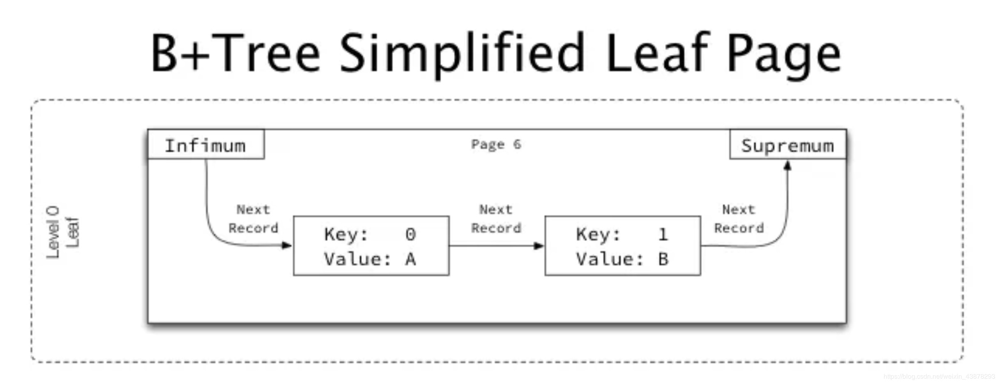
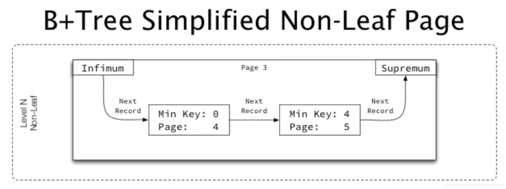
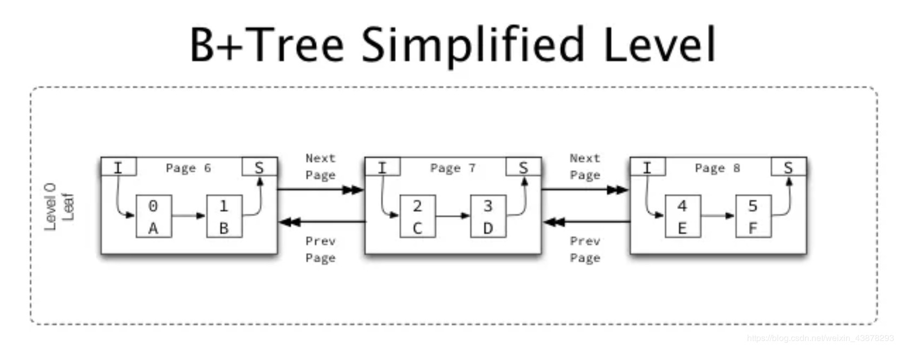
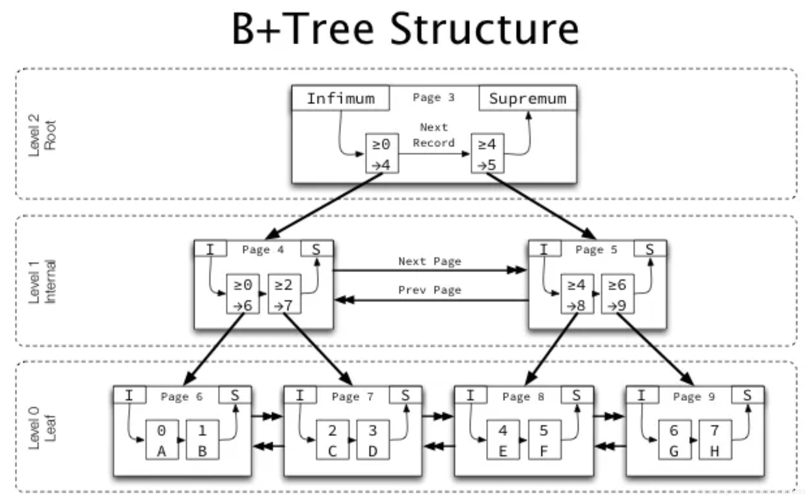

已剪辑自: https://blog.csdn.net/weixin_43878293/article/details/103563374

索引数据结构及数据组织方式

**1、数据存储单元**

磁盘：扇区 512字节
 文件系统：块 4KB
 InnoDB：页 16KB

**2、InnoDB索引数据结构**

**1）B-Tree**

在看B+Tree之前，我们先看看B-Tree

B-Tree是一种为外查找（磁盘类外存储设备，数据量太大不能全放在内存里）而设计的平衡多叉树。那为什么用B树而不用其他的如二叉树、平衡二叉树呢？

原因在于当存储关键字个数确定后，用B树进行存储所需要的最大树高相对于二叉树、平衡二叉树要小。这能够减小IO次数，从而提高检索效率。换句话说，使用B树能够确保，访问到任意数据的IO请求的最大次数是确定的。

**2）B+Tree**

所谓的B+Tree和B-Tree的区别仅仅在于，B-Tree的所有节点均用于存储键或者值。而B+Tree只有叶子节点才用于存储数据，而非叶子节点用于存储键。

B+Tree是对B-Tree的一种优化。因为当非叶子节点存储的值占位太多时，便会增加树的高度。树高的增加带来的是IO的增加。

**3、数据组织方式**

InnoDB 存储引擎以页（默认为16KB）为基本单位存储

**-索引与数据**

1）非叶节点页用于存储键和键所在页的指针（键为孩子页的最小键，指针内容为孩子页的页码）。

2）叶节点（数据页）用于存储数据记录。

**-页节点及记录间关系**

1）不管是叶节点和非叶节点，其每个记录均包含指向页内下一个记录的指针，存储着下一记录在页内的偏移。

2）由页 Infimum 开始，并按主键升序的方式连接所有记录，终止于页 Supremum ，连接成一个链表。

Infimum和Supremum分别指页内有序键集合的下、上边界。分别称为最大下限（小于所有可能的键值）和最小上限（大于所有可能的键值）。

作用：作为一个范围屏障，使得“get-pre”和“get-next”操作不会越界。

3）每个page在其Header（Fil header）中都包含两个指针，一个指向上一页，一个指向下一页，于是同一level的page以升序方式连接在一起形成链表。

**4、Tips**

**树的大小：**
 **树可以小到仅仅只有一个根页，也可以是高达成百上千万页组成的多层树。**

**页的级别：**
 **InnoDB****为每个页分配一个级别****level****，作为叶节点的****page****其****level****为****0****，级别从叶节点往根节点依次递增。**

**查找过程：**
 **首先从根页开始通过二分法查找索引结构定位所查询主键所在页地址，然后到该页中再通过二分法查找数据记录所在位置。**

**根页位置：**
 **在表空间文件中的****Page number=3****的位置，根页位置的指针永久存放于****InnoDB****的数据字典中，用于访问表数据时使用。根页在索引创建的时候即建立起来，不会被删除和移动到其它位置。**

**树高度：**
 **数据库的****B+Tree****高度通常为****2~3****（主键比较合理的情况），少数会到****4****（主键太大）。主键过大往往导致非叶****page****不够容纳足够多的索引键值，又因为必须在非叶****page****中存储索引键信息，导致的结果便是非叶****page****的急剧增加，于是树高度只能增加，随之带来性能的下降。**

**5、图**

注：图片来源于参考中的链接

1）下图为作为叶节点page的简化图
 

 2）下图为作为非叶节点page的简化图
 

 3）下图为处于同一level的不同page关系的简化图
 

 4）下图为一个InnoDB B+Tree的一个完整简化图
 

 **6****、参考**

https://blog.jcole.us/2013/01/10/btree-index-structures-in-innodb/