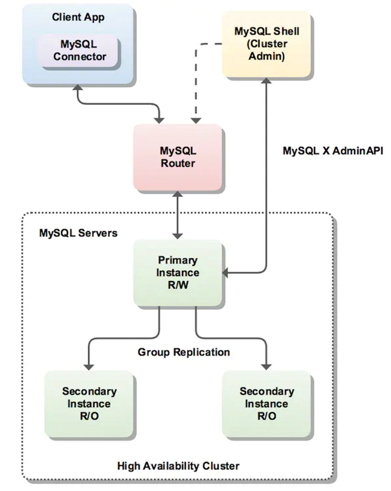

已剪辑自: https://www.jianshu.com/p/b2209567053a

# 1. 简介

MySQL InnoDB cluster提供一整套高可用方案，[MySQL Shell](https://links.jianshu.com/go?to=https%3A%2F%2Fdev.mysql.com%2Fdoc%2Frefman%2F5.7%2Fen%2Fmysql-shell.html) 对管理人员提供管理接口，可以很方便的对集群进行配置和管理（只少三个节点组成的MGR集群）。[MySQL Router](https://links.jianshu.com/go?to=https%3A%2F%2Fdev.mysql.com%2Fdoc%2Fmysql-router%2F2.1%2Fen%2F) 可以根据部署的集群状况自动的初始化，是客户端连接实例。如果有节点down机，集群会自动更新配置。集群包含单点写入和多点写入两种模式。在单主模式下，如果主节点down掉，从节点自动替换上来，MySQL Router会自动探测，并将客户端连接到新节点。架构如下：

image.png

通过 MySQL Shell 可以通过配置参数和函数来配置部署InnoDB cluster。demo

 \# 创建一个InnoDB Cluster
 
 mysql-js> dba.createCluster()
 
 
 
 \#获取函数的帮助信息
 
 mysql-js> dba.help('getCluster')
 
 
 
 Retrieves a cluster from the Metadata Store.
 
 
 
 SYNTAX
 
  <Dba>.getCluster([name])
 
 
 
 WHERE
 
  name: Parameter to specify the name of the cluster to be returned.
 

# 2. 搭建InnoDB Cluster

### 2.1 部署脚本

InnoDB Cluster 支持两种部署脚本：

- Sandbox deployment: 可以通过次方式很快捷的在单机上部署多实例的InnoDB cluster（一般不用于线上环境）
- Production deployment：线上使用时，需要在部署机器上进行配置，部署实例

### 2.2 InnoDB Cluster Requirements

- 因为基于MGR，所以要满足MGR配置要求
- MySQL Shell 配置server需要python2.7

### 2.3 Methods of Installing

根据官方文档 [https://dev.mysql.com/doc/refman/5.7/en/mysql-innodb-cluster-methods-installing-.html](https://links.jianshu.com/go?to=https%3A%2F%2Fdev.mysql.com%2Fdoc%2Frefman%2F5.7%2Fen%2Fmysql-innodb-cluster-methods-installing-.html) 安装所需软件

##### 2.3.1 Sandbox Deployment of InnoDB Cluster

##### 2.3.2 Production Deployment of InnoDB Cluster

###### *2.3.2.1 User Privileges*

管理账号必须有对InnoDB cluster metadata tables 的读写权限（SUPER, GRANT OPTION, CREATE, DROP and so on）。

 GRANT ALL PRIVILEGES ON mysql_innodb_cluster_metadata.* TO your_user@'%' WITH GRANT OPTION;
 
 GRANT RELOAD, SHUTDOWN, PROCESS, FILE, SUPER, REPLICATION SLAVE, REPLICATION CLIENT, \
 
 CREATE USER ON *.* TO your_user@'%' WITH GRANT OPTION;
 
 GRANT SELECT ON *.* TO your_user@'%' WITH GRANT OPTION;
 
 
 
 \# 这个授权在执行dba.configureLocalInstance()时说权限不够，我直接把所有权限都给了就哦了

如果是只读操作的话（如监控等）：

GRANT SELECT ON mysql_innodb_cluster_metadata.* TO your_user@'%';
 
 GRANT SELECT ON performance_schema.global_status TO your_user@'%';
 
 GRANT SELECT ON performance_schema.replication_applier_configuration TO your_user@'%';
 
 GRANT SELECT ON performance_schema.replication_applier_status TO your_user@'%';
 
 GRANT SELECT ON performance_schema.replication_applier_status_by_coordinator TO your_user@'%';
 
 GRANT SELECT ON performance_schema.replication_applier_status_by_worker TO your_user@'%';
 
 GRANT SELECT ON performance_schema.replication_connection_configuration TO your_user@'%';
 
 GRANT SELECT ON performance_schema.replication_connection_status TO your_user@'%';
 
 GRANT SELECT ON performance_schema.replication_group_member_stats TO your_user@'%';
 
 GRANT SELECT ON performance_schema.replication_group_members TO your_user@'%';

###### *2.3.2.2 Configuring Hostname*

InnoDB Cluster 的server分布在不同机器上，因此各个机器需要有不通的hostname，可以通过配置host ip的映射等方法配置

2.3.2.3 Verbose Logging

线上集群可以配置MySQL Shell的日志

\# 通过 --log-level 设置日志等级，推荐设置DEBUG3
 
 shell>mysqlsh --log-level=DEBUG3
 
 
 \#通过如下设置可以控制MySQL Shell操作的日志输出多少
 
 \# 0 or OFF is the default. 输出最少
 
 \# 1 or ON adds verbose output from each call to the AdminAPI.
 
 \# 2 adds debug output to the verbose output providing full information about what each call to AdminAPI executes.
 
 mysql-js> dba.verbose=2

2.3.2.4 Checking Instance Configuration

通过dba.checkInstanceConfiguration() 检查每个实例是否配置正确

 \#不能是新建好的MGR集群，而是要单个节点
 
 mysql-js> dba.checkInstanceConfiguration('ic@ic-1:3306')
 
 
 
 Please provide the password for 'ic@ic-1:3306':
 
 Validating instance...
 
 
 
 The instance 'ic-1:3306' is not valid for Cluster usage.
 
 
 
 The following issues were encountered:
 
 
 
 \- Some configuration options need to be fixed.
 
 
 
 +----------------------------------+---------------+----------------+--------------------------------------------------+
 | Variable             | Current Value | Required Value | Note                       |
 
 +----------------------------------+---------------+----------------+--------------------------------------------------+
 
 | binlog_checksum         | CRC32     | NONE      | Update the server variable or restart the server |
 
 | enforce_gtid_consistency     | OFF      | ON       | Restart the server                |
 
 | gtid_mode            | OFF      | ON       | Restart the server                |
 
 | log_bin             | 0       | 1       | Restart the server                |
 
 | log_slave_updates        | 0       | ON       | Restart the server                |
 
 | master_info_repository      | FILE     | TABLE     | Restart the server                |
 
 | relay_log_info_repository    | FILE     | TABLE     | Restart the server                |
 
 | transaction_write_set_extraction | OFF      | XXHASH64    | Restart the server                |
 
 +----------------------------------+---------------+----------------+--------------------------------------------------+
 
 ​
 
 ​
 
 Please fix these issues , restart the server and try again.
 
 ​
 
 {
 
 "config_errors": [
 
 {
 
 "action": "server_update",
 
 "current": "CRC32",
 
 "option": "binlog_checksum",
 
 "required": "NONE"
 
 },
 
 {
 
 "action": "restart",
 
 "current": "OFF",
 
 "option": "enforce_gtid_consistency",
 
 "required": "ON"
 
 },
 
 {
 
 "action": "restart",
 
 "current": "OFF",
 
 "option": "gtid_mode",
 
 "required": "ON"
 
 },
 
 {
 
 "action": "restart",
 
 "current": "0",
 
 "option": "log_bin",
 
 "required": "1"
 
 },
 
 {
 
 "action": "restart",
 
 "current": "0",
 
 "option": "log_slave_updates",
 
 "required": "ON"
 
 },
 
 {
 
 "action": "restart",
 
 "current": "FILE",
 
 "option": "master_info_repository",
 
 "required": "TABLE"
 
 },
 
 {
 
 "action": "restart",
 
 "current": "FILE",
 
 "option": "relay_log_info_repository",
 
 "required": "TABLE"
 
 },
 
 {
 
 "action": "restart",
 
 "current": "OFF",
 
 "option": "transaction_write_set_extraction",
 
 "required": "XXHASH64"
 
 }
 
 ],
 
 "errors": [],
 
 "restart_required": true,
 
 "status": "error"
 
 }
 
 mysql-js>

2.3.2.5 Configuring the Instance

AdminAPI provides the dba.configureLocalInstance() 方法可以探测到对应实例的配置文件并修改，此外可能还需要重启实例让参数生效，如下

 mysql-js> dba.configureLocalInstance('root@localhost:3306')
 
 ​
 
 Please provide the password for 'root@localhost:3306':
 
 ​
 
 Please specify the path to the MySQL configuration file: /etc/mysql/mysql.conf.d/mysqld.cnf
 
 Validating instance...
 
 ​
 
 The configuration has been updated but it is required to restart the server.
 
 {
 
 "config_errors": [
 
 {
 
 "action": "restart",
 
 "current": "OFF",
 
 "option": "enforce_gtid_consistency",
 
 "required": "ON"
 
 },
 
 {
 
 "action": "restart",
 
 "current": "OFF",
 
 "option": "gtid_mode",
 
 "required": "ON"
 
 },
 
 {
 
 "action": "restart",
 
 "current": "0",
 
 "option": "log_bin",
 
 "required": "1"
 
 },
 
 {
 
 "action": "restart",
 
 "current": "0",
 
 "option": "log_slave_updates",
 
 "required": "ON"
 
 },
 
 {
 
 "action": "restart",
 
 "current": "FILE",
 
 "option": "master_info_repository",
 
 "required": "TABLE"
 
 },
 
 {
 
 "action": "restart",
 
 "current": "FILE",
 
 "option": "relay_log_info_repository",
 
 "required": "TABLE"
 
 },
 
 {
 
 "action": "restart",
 
 "current": "OFF",
 
 "option": "transaction_write_set_extraction",
 
 "required": "XXHASH64"
 
 }
 
 ],
 
 "errors": [],
 
 "restart_required": true,
 
 "status": "error"
 
 }
 
 mysql-js>
 
 \# 需要注意如果设置 super_read_only=ON， you might need to confirm that AdminAPI can set super_read_only=OFF. 
 
 ​
 
 \# dba.configureLocalInstance() 可以配置用户信息，可以方便的使用不同用户
 
 mysql-js> dba.configureLocalInstance('ic@ic-1:3306', \ 
 
 {clusterAdmin: 'icadmin@ic-1%',clusterAdminPassword: 'secret'});

2.3.2.6 Creating the Cluster

安装准备好实例后，通过调用dba.createCluster() 来创建cluster，运行MySQL Shell的机器实例会作为seed实例，seed实例会被copy到其他要加入cluster的实例

shell> mysqlsh --uri ic@ic-1:3306
 
 ​
 
 Creating a Session to 'ic@ic-1:3306'
 
 Enter password: *********
 
 Classic Session successfully established. No default schema selected.
 
 ​
 
 \# 创建cluster,创建时报错START group_replication (RuntimeError)，是因为公司的把mysql.session用户删除了，加上或者upgrade下就行了
 
 mysql-js> var cluster = dba.createCluster('prodCluster')
 
 ​
 
 A new InnoDB cluster will be created on instance 'ic@ic-1:3306'.
 
 ​
 
 Creating InnoDB cluster 'prodCluster' on 'ic@ic-1:3306'...
 
 Adding Seed Instance...
 
 ​
 
 Cluster successfully created. Use Cluster.addInstance() to add MySQL instances.
 
 At least 3 instances are needed for the cluster to be able to withstand up to
 
 one server failure.
 
 ​
 
 \# 添加节点
 
 \# 一个节点加入组后，就不推荐手动修改参数，建议都通过mysql shell修改
 
 mysql-js> cluster.addInstance('ic@ic-2:3306');
 
 ​
 
 \#节点加入cluster后，新增节点的InnoDB cluster metadata 只是创建，但是没有修改信息，
 
 \#需要通过mysql shell连接每个实例调用dba.configureLocalInstance()，这个操作对于节点脱离cluster后重新加入很重要
 
 shell> mysqlsh
 
 \# 建立对实例的连接，初始化每个实例
 
 \# 每次cluster有变更，例如实例数变化都需要更新每个实例的cluster metadata 
 
 mysql-js> dba.configureLocalInstance('ic@ic-2:3306')
 
 

### 2.4 Adopting a Group Replication Deployment

如果现有MGR集群想要搭建InnoDB Cluster的话，可以通过dba.createCluster() 添加adoptFromGR参数，搭建的Cluster基于MGR是否为单写，因此使用adoptFromGR的同时无法使用multiPrimary选项。现有的MGR可能包含 [MyISAM](https://links.jianshu.com/go?to=https%3A%2F%2Fdev.mysql.com%2Fdoc%2Frefman%2F5.7%2Fen%2Fmyisam-storage-engine.html) 表

要注意修改为Innodb。

 mysql-js> var cluster = dba.createCluster('RCDBTestCluster', {adoptFromGR: true});
 
 A new InnoDB cluster will be created on instance '[kai.sun@l-rcdb1.uc.cn2:3315](mailto:kai.sun@l-rcdb1.uc.cn2:3315)'.
 
 ​
 
 Creating InnoDB cluster 'RCDBTestCluster' on '[kai.sun@l-rcdb1.uc.cn2:3315](mailto:kai.sun@l-rcdb1.uc.cn2:3315)'...
 
 Adding Seed Instance...
 
 ​
 
 Cluster successfully created. Use Cluster.addInstance() to add MySQL instances.
 
 At least 3 instances are needed for the cluster to be able to withstand up to
 
 one server failure.
 
 ​
 
 \# 原来MGR为多主，则新建Cluster为多主
 
 mysql-js> cluster.status();
 
 {
 
 "clusterName": "RCDBTestCluster",
 
 "defaultReplicaSet": {
 
 "name": "default",
 
 "status": "OK",
 
 "statusText": "Cluster is ONLINE and can tolerate up to 2 failures.",
 
 "topology": {
 
 "l-collectdb3.dba.cn8:3320": {
 
 "address": "l-collectdb3.dba.cn8:3320",
 
 "mode": "R/W",
 
 "readReplicas": {},
 
 "role": "HA",
 
 "status": "ONLINE"
 
 },
 
 "l-rcdb1.uc.cn2:3315": {
 
 "address": "l-rcdb1.uc.cn2:3315",
 
 "mode": "R/W",
 
 "readReplicas": {},
 
 "role": "HA",
 
 "status": "ONLINE"
 
 },
 
 "l-rcdb2.uc.cn2:3315": {
 
 "address": "l-rcdb2.uc.cn2:3315",
 
 "mode": "R/W",
 
 "readReplicas": {},
 
 "role": "HA",
 
 "status": "ONLINE"
 
 },
 
 "l-rcdb3.uc.cn2:3315": {
 
 "address": "l-rcdb3.uc.cn2:3315",
 
 "mode": "R/W",
 
 "readReplicas": {},
 
 "role": "HA",
 
 "status": "ONLINE"
 
 },
 
 "l-rcdb4.uc.cn2:3315": {
 
 "address": "l-rcdb4.uc.cn2:3315",
 
 "mode": "R/W",
 
 "readReplicas": {},
 
 "role": "HA",
 
 "status": "ONLINE"
 
 }
 
 }
 
 }
 
 }
 
 mysql-js>

### 2.5 Using MySQL Router with InnoDB Cluster

MySQL Router可以方便的提供高可用。推荐每个业务机器上都安装一个router，也可以在在一个应用连接的公共机器上部署router。使用[--bootstrap](https://dev.mysql.com/doc/mysql-router/2.1/en/mysqlrouter.html#option_mysqlrouter_bootstrap)指定数据库地址，router通过metadata获取cluster集群信息，维护集群实例列表和读写状态

\# --user 为运行命令用户
 
 bash-3.2# mysqlrouter --bootstrap [kai.sun@l-kai.sun1.dba.dev.cn0:3320](mailto:kai.sun@l-kai.sun1.dba.dev.cn0:3320) --user=root
 
 Please enter MySQL password for kai.sun:
 
 WARNING: The MySQL server does not have SSL configured and metadata used by the router may be transmitted unencrypted.
 
 ​
 
 Bootstrapping system MySQL Router instance...
 
 MySQL Router has now been configured for the InnoDB cluster 'SunKaiCluster'.
 
 ​
 
 The following connection information can be used to connect to the cluster.
 
 ​
 
 Classic MySQL protocol connections to cluster 'SunKaiCluster':
 
 \- Read/Write Connections: localhost:6446
 
 \- Read/Only Connections: localhost:6447
 
 ​
 
 X protocol connections to cluster 'SunKaiCluster':
 
 \- Read/Write Connections: localhost:64460
 
 \- Read/Only Connections: localhost:64470
 
 bash-3.2#
 
 ​
 
 ​
 
 \# 运行后会生成文件mysqlrouter.conf(一般在mysql-router安装路径下)，保存所有节点信息
 
 \# 如果cluster新增节点的话，可以手动更新下mysqlrouter.conf中的 bootstrap_server_addresses，或者再次执行下 --bootstrap 
 
 \# 默认6446，6447 用于 Classic MySQL protocol 64460，64470 用于X protocol，也可以通过 --conf-base-port 参数设置
 
 \# 这只是生成配置文件，还需要启动mysqlrouter才能生效
 

mysql router会创建一个TCP端口用来连接cluster，此端口可以用于传统的MySQL协议或者X Protocol （必须是在实例安装配置好 X Plugin 的前提下，sandbox deployment会自动配置好）

 \#启动mysqlrouter,默认设置启动机器时自动启动router
 
 shell> mysqlrouter &
 
 \# 然后就可以连接了
 
 mysqlsh --uri kai.sun@localhost:6446
 
 mysql -h127.0.0.1 -ukai.sun -p*** -P 6446
 
 \# 也可以在远程连接，ip用运行mysqlrouter的ip即可
 
 mysqlsh mysqlsh --uri [kai.sun@10.86.43.238:6447](mailto:kai.sun@10.86.43.238:6447)

### 2.6 Testing High Availability

2.6.1 单主模式时

如果当前写节点挂掉，会从读节点中选择一个节点作为新的写节点（优选选择server_uuid值小的节点）。MySQL Router直接将读写连接转发到新选择的写节点。（If a current secondary leaves the cluster, MySQL Router stops redirecting read-only connections to the instance.）

failover测试

每隔500ms插入一条数据，kill原主节点，数据中断6s左右

 | 122 | 1600121 | 2018-02-09 10:18:23 |
 
 | 123 | 1600122 | 2018-02-09 10:18:23 |
 
 | 124 | 1600123 | 2018-02-09 10:18:24 |
 
 | 125 | 1600144 | 2018-02-09 10:18:25 |
 
 | 126 | 1600145 | 2018-02-09 10:18:31 |
 
 | 127 | 1600146 | 2018-02-09 10:18:32 |
 
 | 128 | 1600147 | 2018-02-09 10:18:32 |
 
 mysql-js> cluster.status()
 
 {
 
 "clusterName": "SunKaiCluster",
 
 "defaultReplicaSet": {
 
 "name": "default",
 
 "primary": "l-kai.sun2.dba.dev.cn0:3320",
 
 "status": "OK_NO_TOLERANCE",
 
 "statusText": "Cluster is NOT tolerant to any failures. 1 member is not active",
 
 "topology": {
 
 "l-kai.sun1.dba.dev.cn0:3320": {
 
 "address": "l-kai.sun1.dba.dev.cn0:3320",
 
 "mode": "R/O",
 
 "readReplicas": {},
 
 "role": "HA",
 
 "status": "(MISSING)"
 
 },
 
 "l-kai.sun2.dba.dev.cn0:3320": {
 
 "address": "l-kai.sun2.dba.dev.cn0:3320",
 
 "mode": "R/W",
 
 "readReplicas": {},
 
 "role": "HA",
 
 "status": "ONLINE"
 
 },
 
 "l-kai.sun3.dba.dev.cn0:3320": {
 
 "address": "l-kai.sun3.dba.dev.cn0:3320",
 
 "mode": "R/O",
 
 "readReplicas": {},
 
 "role": "HA",
 
 "status": "ONLINE"
 
 }
 
 }
 
 }
 
 }
 
 \# 测试时发现读写操作都转发到同一个节点
 
 \# 再次正常stop掉当前写节点后（如果kill的话就会脑裂，无法写入）
 
 | 294 | 1600313 | 2018-02-22 15:28:16 |
 
 | 295 | 1600314 | 2018-02-22 15:28:16 |
 
 | 296 | 1600316 | 2018-02-22 15:28:17 |
 
 | 297 | 1600317 | 2018-02-22 15:28:21 |
 
 | 298 | 1600318 | 2018-02-22 15:28:22 |
 
 | 299 | 1600319 | 2018-02-22 15:28:23 |
 
 中断大概4s
 
 读写转移到最后一个节点
 
 ​
 
 ​
 
 \# 无法直接START GROUP_REPLICATION;加入group，只能通过shell添加
 
 mysql-js> [cluster.addInstance('kai.sun@l-kai.sun1.dba.dev.cn0:3320](mailto:cluster.addInstance('kai.sun@l-kai.sun1.dba.dev.cn0:3320)')
 
 A new instance will be added to the InnoDB cluster. Depending on the amount of
 
 data on the cluster this might take from a few seconds to several hours.
 
 ​
 
 Please provide the password for '[kai.sun@l-kai.sun1.dba.dev.cn0:3320](mailto:kai.sun@l-kai.sun1.dba.dev.cn0:3320)':
 
 Adding instance to the cluster ...
 
 ​
 
 The instance '[kai.sun@l-kai.sun1.dba.dev.cn0:3320](mailto:kai.sun@l-kai.sun1.dba.dev.cn0:3320)' was successfully added to the cluster.
 
 ​
 
 mysql-js> cluster.status()
 
 {
 
 "clusterName": "SunKaiCluster",
 
 "defaultReplicaSet": {
 
 "name": "default",
 
 "primary": "l-kai.sun2.dba.dev.cn0:3320",
 
 "status": "OK",
 
 "statusText": "Cluster is ONLINE and can tolerate up to ONE failure.",
 
 "topology": {
 
 "l-kai.sun1.dba.dev.cn0:3320": {
 
 "address": "l-kai.sun1.dba.dev.cn0:3320",
 
 "mode": "R/O",
 
 "readReplicas": {},
 
 "role": "HA",
 
 "status": "ONLINE"
 
 },
 
 "l-kai.sun2.dba.dev.cn0:3320": {
 
 "address": "l-kai.sun2.dba.dev.cn0:3320",
 
 "mode": "R/W",
 
 "readReplicas": {},
 
 "role": "HA",
 
 "status": "ONLINE"
 
 },
 
 "l-kai.sun3.dba.dev.cn0:3320": {
 
 "address": "l-kai.sun3.dba.dev.cn0:3320",
 
 "mode": "R/O",
 
 "readReplicas": {},
 
 "role": "HA",
 
 "status": "ONLINE"
 
 }
 
 }
 
 }
 
 }
 
 ​
 
 ​
 
 \# 节点重新加入恢复后，高可用恢复（kill写节点会自动切换）

2.6.2 多主模式时

如果当前的读写节点离开cluster，MySQL Router会将读写连接转发到其他节点

 \# failover 直接kill实例
 
 | 226 | 1600032 | 2018-02-22 18:05:24 |
 
 | 232 | 1600034 | 2018-02-22 18:05:24 |
 
 \# 影响写入0.5s左右
 
 | 239 | 1600035 | 2018-02-22 18:05:25 |
 
 | 246 | 1600036 | 2018-02-22 18:05:26 |
 
 | 253 | 1600037 | 2018-02-22 18:05:26 |
 
 \# switch over

## 3 Working with InnoDB Cluster

3.1 Checking the InnoDB Cluster Status

 mysql-js> var cluster = dba.getCluster()
 
 mysql-js> cluster.status()
 
 {
 
 "clusterName": "testCluster", 
 
 "defaultReplicaSet": {
 
 "name": "default", 
 
 "primary": "localhost:3320", 
 
 "ssl": "REQUIRED",
 
 "status": "OK", 
 
 "statusText": "Cluster is ONLINE and can tolerate up to ONE failure.", 
 
 "topology": {
 
 "localhost:3310": {
 
 "address": "localhost:3310", 
 
 "mode": "R/O", 
 
 "readReplicas": {}, 
 
 "role": "HA", 
 
 "status": "ONLINE"
 
 }, 
 
 "localhost:3320": {
 
 "address": "localhost:3320", 
 
 "mode": "R/W", 
 
 "readReplicas": {}, 
 
 "role": "HA", 
 
 "status": "ONLINE"
 
 }, 
 
 "localhost:3330": {
 
 "address": "localhost:3330", 
 
 "mode": "R/O", 
 
 "readReplicas": {}, 
 
 "role": "HA", 
 
 "status": "ONLINE"
 
 }
 
 }
 
 }
 
 }
 
 ​
 
 defaultReplicaSet：属于cluster的实例
 
 primary：在单主模式下，显示主节点，多主模式下则不显示此项
 
 ssl：是否启用安全连接。可能为：REQUIRED or DISABLED,基于 createCluster() or addInstance()时设置的memberSslMode选项，返回的就是 group_replication_ssl_mode 值
 
 status：实例的状态信息，为下面的一种
 
 ONLINE: The instance is online and participating in the cluster.
 
 ​
 
 OFFLINE: The instance has lost connection to the other instances.
 
 ​
 
 RECOVERING: The instance is attempting to synchronize with the cluster by retrieving             transactions it needs before it can become an ONLINE member.
 
 ​
 
 UNREACHABLE: The instance has lost communication with the cluster.
 
 ​
 
 ERROR: The instance has encountered an error during the recovery phase or while applying a       transaction. （实例处于这种状态时会自动 super_read_only 置为on，恢复后需要手工执行            super_read_only=OFF）
 
 (MISSING): The state of an instance which is part of the configured cluster, but is           currently unavailable.（这个不是MGR的状态，时InnoDB cluster标记在metadata里有信息，但是连接       不到的实例）
 
 ​
 
 topology: The instances which have been added to the cluster.
 
 ​
 
 role: what function this instance provides in the cluster. Currently only HA, for high        availability.
 
 mode：whether the server is read-write ("R/W") or read-only ("R/O").

## 3.2 Describing the Structure of the InnoDB Cluster

 \# 查看cluster信息
 
 mysql-js> cluster.describe();
 
 {
 
 "clusterName": "test",
 
 "adminType": "local",
 
 "defaultReplicaSet": {
 
 "name": "default",
 
 "instances": [
 
 {
 
 "name": "localhost:3310",
 
 "host": "localhost:3310",
 
 "role": "HA"
 
 },
 
 {
 
 "name": "localhost:3320",
 
 "host": "localhost:3320",
 
 "role": "HA"
 
 },
 
 {
 
 "name": "localhost:3330",
 
 "host": "localhost:3330",
 
 "role": "HA"
 
 }
 
 ]
 
 }
 
 }

3.3 Super Read-only and Instances

无论何时 Group Replication stops， [super_read_only](https://dev.mysql.com/doc/refman/5.7/en/server-system-variables.html#sysvar_super_read_only) 都会被设置为on，防止有写入数据（但是测试过程中，cluster.removeInstance() 后发现没有置为on，并且router依然会将写连接继续到此节点，但是如果断开后重新连接不会将新连接分配到离开cluster的节点），但是如果通过 AdminAPI commands做下面的操作可能会导致<meta content="text/html; charset=utf-8" http-equiv="Content-Type">[super_read_only](https://links.jianshu.com/go?to=https%3A%2F%2Fdev.mysql.com%2Fdoc%2Frefman%2F5.7%2Fen%2Fserver-system-variables.html%23sysvar_super_read_only)置为off

dba.configureLocalInstance()
 
 ​
 
 dba.createCluster()
 
 ​
 
 dba.rebootClusterFromCompleteOutage()
 
 
 dba.dropMetadataSchema()

## 3.4 Managing Sandbox Instances

sandbox在运行是可以直接通过如下调用更改状态

 dba.stopSandboxInstance(instance).
 
 dba.startSandboxInstance(instance). 
 
 dba.killSandboxInstance(instance). 
 
 dba.deleteSandboxInstance(instance)

### 3.5 Removing Instances from the InnoDB Cluster

cluster.removeInstance('root@localhost:3310')可以将实例从cluster中清除

### 3.6 Customizing InnoDB clusters

我们创建一个cluster或者增加实例时，group name，local address， seed instance等是自动初始化设置的，我们也可以通过在dba.createCluster() and cluster.addInstance()添加参数设置信息设置。如通过 [group_replication_group_name](https://links.jianshu.com/go?to=https%3A%2F%2Fdev.mysql.com%2Fdoc%2Frefman%2F5.7%2Fen%2Fgroup-replication-options.html%23sysvar_group_replication_group_name) 设置group name（必须符合uuid格式），通过[group_replication_local_address](https://links.jianshu.com/go?to=https%3A%2F%2Fdev.mysql.com%2Fdoc%2Frefman%2F5.7%2Fen%2Fgroup-replication-options.html%23sysvar_group_replication_local_address)（值为 host:port ）设置address（这些地址必须确保cluster内的实例都能正常通信），通过设置 groupSeeds 来选择seed（用来给新增节点提供数据，格式为 host1:port1,host2:port2，会初始化 [group_replication_group_seeds](https://links.jianshu.com/go?to=https%3A%2F%2Fdev.mysql.com%2Fdoc%2Frefman%2F5.7%2Fen%2Fgroup-replication-options.html%23sysvar_group_replication_group_seeds) 系统变量）

### 3.7 Rejoining a Cluster(待测试)

通过 cluster.rejoinInstance()可以让因为连接中断等原因脱离cluster的实例重新加入cluster。如果实例的初始化信息没有持久化（加入后没有调用 dba.configureLocalInstance() ），但是曾经加入过cluster，重启实例后没加入cluster，就可以调用 cluster.rejoinInstance()，然后通过 dba.configureLocalInstance()持久化。

## 注意

- mysql router是通过保存在配置文件的信息将连接映射到不通数据库，如果新增（或减少）节点的话，mysqlrouter不会自动探测到，因此不会映射到新增节点，为了用到新增节点需要重新bootstrap mysqlrouter(先bootstrap，后重启)
- mysqlsh如果想做的操作会修改metadata，则必须连接的是读写节点

### 3.8 Restoring a Cluster from Quorum Loss

当一个或多个实例同时挂掉，导致cluster剩余实例数不到一半以上的节点时，因为无法达到法定节点数，无法选择新的主节点，为了快速恢复服务，可以使用cluster.forceQuorumUsingPartitionOf 来手动指定新的主节点

\# cluster当前有两个节点online，可以提供服务
 
 mysql-js> cluster.status()
 
 {
 
 "clusterName": "NewDevCluster",
 
 "defaultReplicaSet": {
 
 "name": "default",
 
 "status": "OK_NO_TOLERANCE",
 
 "statusText": "Cluster is NOT tolerant to any failures. 1 member is not active",
 
 "topology": {
 
 "l-kai.sun1.dba.dev.cn0:3320": {
 
 "address": "l-kai.sun1.dba.dev.cn0:3320",
 
 "mode": "R/W",
 
 "readReplicas": {},
 
 "role": "HA",
 
 "status": "(MISSING)"
 
 },
 
 "l-kai.sun2.dba.dev.cn0:3320": {
 
 "address": "l-kai.sun2.dba.dev.cn0:3320",
 
 "mode": "R/W",
 
 "readReplicas": {},
 
 "role": "HA",
 
 "status": "ONLINE"
 
 },
 
 "l-kai.sun3.dba.dev.cn0:3320": {
 
 "address": "l-kai.sun3.dba.dev.cn0:3320",
 
 "mode": "R/W",
 
 "readReplicas": {},
 
 "role": "HA",
 
 "status": "ONLINE"
 
 }
 
 }
 
 }
 
 }
 
 ​
 
 \# kill掉其中一个节点，statusText中提示无法提供服务
 
 mysql-js> cluster.status()
 
 {
 
 "clusterName": "NewDevCluster",
 
 "defaultReplicaSet": {
 
 "name": "default",
 
 "status": "NO_QUORUM",
 
 "statusText": "Cluster has no quorum as visible from 'l-kai.sun3.dba.dev.cn0:3320' and cannot process write transactions. 2 members are not active",
 
 "topology": {
 
 "l-kai.sun1.dba.dev.cn0:3320": {
 
 "address": "l-kai.sun1.dba.dev.cn0:3320",
 
 "mode": "R/W",
 
 "readReplicas": {},
 
 "role": "HA",
 
 "status": "(MISSING)"
 
 },
 
 "l-kai.sun2.dba.dev.cn0:3320": {
 
 "address": "l-kai.sun2.dba.dev.cn0:3320",
 
 "mode": "R/W",
 
 "readReplicas": {},
 
 "role": "HA",
 
 "status": "UNREACHABLE"
 
 },
 
 "l-kai.sun3.dba.dev.cn0:3320": {
 
 "address": "l-kai.sun3.dba.dev.cn0:3320",
 
 "mode": "R/W",
 
 "readReplicas": {},
 
 "role": "HA",
 
 "status": "ONLINE"
 
 }
 
 }
 
 }
 
 }
 
 \# 登陆 l-kai.sun3.dba.dev.cn0:3320
 
 发现read_only,super_read_only都为off，但是写入时会一直阻塞
 
 ​
 
 \# 强制上线kai.sun3，貌似这个必须使用root用户名，因此要有对应ip root的账号
 
 mysql-js> cluster.forceQuorumUsingPartitionOf("l-kai.sun3.dba.dev.cn0:3320")
 
 Restoring replicaset 'default' from loss of quorum, by using the partition composed of [l-kai.sun3.dba.dev.cn0:3320]
 
 ​
 
 Please provide the password for '[root@l-kai.sun3.dba.dev.cn0:3320](mailto:root@l-kai.sun3.dba.dev.cn0:3320)':
 
 Restoring the InnoDB cluster ...
 
 ​
 
 The InnoDB cluster was successfully restored using the partition from the instance '[root@l-kai.sun3.dba.dev.cn0:3320](mailto:root@l-kai.sun3.dba.dev.cn0:3320)'.
 
 ​
 
 WARNING: To avoid a split-brain scenario, ensure that all other members of the replicaset are removed or joined back to the group that was restored.
 
 ​
 
 \# 上线后，插入数据成功
 
 mysql-js> cluster.status()
 
 {
 
 "clusterName": "SKCluster",
 
 "defaultReplicaSet": {
 
 "name": "default",
 
 "primary": "l-kai.sun3.dba.dev.cn0:3320",
 
 "status": "OK_NO_TOLERANCE",
 
 "statusText": "Cluster is NOT tolerant to any failures. 2 members are not active",
 
 "topology": {
 
 "l-kai.sun1.dba.dev.cn0:3320": {
 
 "address": "l-kai.sun1.dba.dev.cn0:3320",
 
 "mode": "R/O",
 
 "readReplicas": {},
 
 "role": "HA",
 
 "status": "(MISSING)"
 
 },
 
 "l-kai.sun2.dba.dev.cn0:3320": {
 
 "address": "l-kai.sun2.dba.dev.cn0:3320",
 
 "mode": "R/O",
 
 "readReplicas": {},
 
 "role": "HA",
 
 "status": "(MISSING)"
 
 },
 
 "l-kai.sun3.dba.dev.cn0:3320": {
 
 "address": "l-kai.sun3.dba.dev.cn0:3320",
 
 "mode": "R/W",
 
 "readReplicas": {},
 
 "role": "HA",
 
 "status": "ONLINE"
 
 }
 
 }
 
 }
 
 }
 
 \# 启动kai.sun1,kai.sun2后自动加入cluster

### 3.9 Rebooting a Cluster from a Major Outage

如果cluster发生中断，可以通过dba.rebootClusterFromCompleteOutage()来重新启动cluster，运行时要确保实例是启动了的。

\# 测试时直接连接kai.sun1没执行成功，连接kai.sun3执行成功，但是kai.sun1未能成功添加
 
 mysql-js> var cluster = dba.rebootClusterFromCompleteOutage();
 
 Reconfiguring the default cluster from complete outage...
 
 ​
 
 The instance 'l-kai.sun1.dba.dev.cn0:3320' was part of the cluster configuration.
 
 Would you like to rejoin it to the cluster? [y|N]: y
 
 ​
 
 The instance 'l-kai.sun2.dba.dev.cn0:3320' was part of the cluster configuration.
 
 Would you like to rejoin it to the cluster? [y|N]: y
 
 ​
 
 ​
 
 The cluster was successfully rebooted.
 
 ​
 
 mysql-js> cluster.status()
 
 {
 
 "clusterName": "NewDevCluster",
 
 "defaultReplicaSet": {
 
 "name": "default",
 
 "status": "OK_NO_TOLERANCE",
 
 "statusText": "Cluster is NOT tolerant to any failures. 1 member is not active",
 
 "topology": {
 
 "l-kai.sun1.dba.dev.cn0:3320": {
 
 "address": "l-kai.sun1.dba.dev.cn0:3320",
 
 "mode": "R/W",
 
 "readReplicas": {},
 
 "role": "HA",
 
 "status": "(MISSING)"
 
 },
 
 "l-kai.sun2.dba.dev.cn0:3320": {
 
 "address": "l-kai.sun2.dba.dev.cn0:3320",
 
 "mode": "R/W",
 
 "readReplicas": {},
 
 "role": "HA",
 
 "status": "ONLINE"
 
 },
 
 "l-kai.sun3.dba.dev.cn0:3320": {
 
 "address": "l-kai.sun3.dba.dev.cn0:3320",
 
 "mode": "R/W",
 
 "readReplicas": {},
 
 "role": "HA",
 
 "status": "ONLINE"
 
 }
 
 }
 
 }
 
 }
 
 ​
 
 ​
 
 \# 手动添加kai.sun1成功
 
 mysql-js> [cluster.addInstance('kai.sun:***@l-kai.sun1.dba.dev.cn0:3320](mailto:cluster.addInstance('kai.sun:***@l-kai.sun1.dba.dev.cn0:3320)')
 
 A new instance will be added to the InnoDB cluster. Depending on the amount of
 
 data on the cluster this might take from a few seconds to several hours.
 
 ​
 
 Adding instance to the cluster ...
 
 ​
 
 The instance '[kai.sun@l-kai.sun1.dba.dev.cn0:3320](mailto:kai.sun@l-kai.sun1.dba.dev.cn0:3320)' was successfully added to the cluster.
 
 ​
 
 mysql-js> cluster.status()
 
 {
 
 "clusterName": "NewDevCluster",
 
 "defaultReplicaSet": {
 
 "name": "default",
 
 "status": "OK",
 
 "statusText": "Cluster is ONLINE and can tolerate up to ONE failure.",
 
 "topology": {
 
 "l-kai.sun1.dba.dev.cn0:3320": {
 
 "address": "l-kai.sun1.dba.dev.cn0:3320",
 
 "mode": "R/W",
 
 "readReplicas": {},
 
 "role": "HA",
 
 "status": "ONLINE"
 
 },
 
 "l-kai.sun2.dba.dev.cn0:3320": {
 
 "address": "l-kai.sun2.dba.dev.cn0:3320",
 
 "mode": "R/W",
 
 "readReplicas": {},
 
 "role": "HA",
 
 "status": "ONLINE"
 
 },
 
 "l-kai.sun3.dba.dev.cn0:3320": {
 
 "address": "l-kai.sun3.dba.dev.cn0:3320",
 
 "mode": "R/W",
 
 "readReplicas": {},
 
 "role": "HA",
 
 "status": "ONLINE"
 
 }
 
 }
 
 }
 
 }

### 3.10 Rescanning a Cluster

如果不是通过AdminAPI修改实例的配置信息，需要重新扫描更新cluster的metadata，例如手动添加一个节点到MGR，那么cluster的metadata是没有修改过的，此时最好调用下cluster.rescan() 更新metadata

\# kill 掉rcdb3
 
 mysql-js> cluster.status()
 
 {
 
 "clusterName": "SKPRODCLuster",
 
 "defaultReplicaSet": {
 
 "name": "default",
 
 "primary": "l-rcdb1.uc.cn2:3315",
 
 "status": "OK_NO_TOLERANCE",
 
 "statusText": "Cluster is NOT tolerant to any failures. 1 member is not active",
 
 "topology": {
 
 "l-rcdb1.uc.cn2:3315": {
 
 "address": "l-rcdb1.uc.cn2:3315",
 
 "mode": "R/W",
 
 "readReplicas": {},
 
 "role": "HA",
 
 "status": "ONLINE"
 
 },
 
 "l-rcdb2.uc.cn2:3315": {
 
 "address": "l-rcdb2.uc.cn2:3315",
 
 "mode": "R/O",
 
 "readReplicas": {},
 
 "role": "HA",
 
 "status": "ONLINE"
 
 },
 
 "l-rcdb3.uc.cn2:3315": {
 
 "address": "l-rcdb3.uc.cn2:3315",
 
 "mode": "R/O",
 
 "readReplicas": {},
 
 "role": "HA",
 
 "status": "(MISSING)"
 
 }
 
 }
 
 }
 
 }
 
 ​
 
 \# rescan
 
 mysql-js> cluster.rescan()
 
 Rescanning the cluster...
 
 ​
 
 Result of the rescanning operation:
 
 {
 
 "defaultReplicaSet": {
 
 "name": "default",
 
 "newlyDiscoveredInstances": [],
 
 "unavailableInstances": [
 
 {
 
 "host": "l-rcdb3.uc.cn2:3315",
 
 "label": "l-rcdb3.uc.cn2:3315",
 
 "member_id": "e528e5d8-dfff-11e7-8645-1402ec8bceec"
 
 }
 
 ]
 
 }
 
 }
 
 ​
 
 The instance 'l-rcdb3.uc.cn2:3315' is no longer part of the HA setup. It is either offline or left the HA group.
 
 You can try to add it to the cluster again with the cluster.rejoinInstance('l-rcdb3.uc.cn2:3315') command or you can remove it from the cluster configuration.
 
 Would you like to remove it from the cluster metadata? [Y|n]: y
 
 Removing instance from the cluster metadata...
 
 ​
 
 The instance 'l-rcdb3.uc.cn2:3315' was successfully removed from the cluster metadata.
 
 ​
 
 mysql-js> cluster.status()
 
 {
 
 "clusterName": "SKPRODCLuster",
 
 "defaultReplicaSet": {
 
 "name": "default",
 
 "primary": "l-rcdb1.uc.cn2:3315",
 
 "status": "OK_NO_TOLERANCE",
 
 "statusText": "Cluster is NOT tolerant to any failures.",
 
 "topology": {
 
 "l-rcdb1.uc.cn2:3315": {
 
 "address": "l-rcdb1.uc.cn2:3315",
 
 "mode": "R/W",
 
 "readReplicas": {},
 
 "role": "HA",
 
 "status": "ONLINE"
 
 },
 
 "l-rcdb2.uc.cn2:3315": {
 
 "address": "l-rcdb2.uc.cn2:3315",
 
 "mode": "R/O",
 
 "readReplicas": {},
 
 "role": "HA",
 
 "status": "ONLINE"
 
 }
 
 }
 
 }
 
 }

### 3.11 Checking Instance State

cluster.checkInstanceState() 可以用来检测存在的实例是否可以加入cluster，主要检测gtid是否有冲突或者有cluster不包含的gtid

 mysql-js> [cluster.checkInstanceState('kai.sun:***@l-collectdb3.dba.cn8:3320](mailto:cluster.checkInstanceState('kai.sun:***@l-collectdb3.dba.cn8:3320)')
 
 Analyzing the instance replication state...
 
 ​
 
 The instance 'l-collectdb3.dba.cn8:3320' is valid for the cluster.
 
 The instance is fully recoverable.
 
 ​
 
 {
 
 "reason": "recoverable",
 
 "state": "ok"
 
 }
 
 ​
 
 \# 可能的值有四种
 
 OK new: the instance has not executed any GTID transactions, therefore it cannot conflict with the GTIDs executed by the cluster
 
 ​
 
 OK recoverable: the instance has executed GTIDs which do not conflict with the executed GTIDs of the cluster seed instances
 
 ​
 
 ERROR diverged: the instance has executed GTIDs which diverge with the executed GTIDs of the cluster seed instances
 
 ​
 
 ERROR lost_transactions: the instance has more executed GTIDs than the executed GTIDs of the cluster seed instances
 
 ​
 
 如果返回ok的话就可以直接加入cluster

### 3.12 Dissolving an InnoDB Cluster

要解除cluster需要连接一个读写节点，调用Cluster.dissolve()，会清理掉所有的metadata和配置数据，关闭MGR，不会清理数据

 mysql-js> session
 
 <ClassicSession:root@localhost:3310>
 
 mysql-js> cluster.dissolve({force:true})
 
 The cluster was successfully dissolved.
 
 Replication was disabled but user data was left intact.

### 3.13 Securing your Cluster

创建cluster的时候可以设置启用安全连接（SSL 要把对应机器加入ipWhitelist）

在调用dba.createCluster() 通过memberSslMode来设置是否打开ssl，允许的值如下

 Setting createCluster({memberSslMode:'DISABLED'}) ensures SSL encryption is disabled for the seed instance in the cluster.
 
 ​
 
 Setting createCluster({memberSslMode:'REQUIRED'}) then SSL encryption is enabled for the seed instance in the cluster. If it cannot be enabled an error is raised.
 
 ​
 
 Setting createCluster({memberSslMode:'AUTO'}) (the default) then SSL encryption is automatically enabled if the server instance supports it, or disabled if the server does not support it.

在调用 cluster.addInstance() and `cluster.rejoinInstance()时，SSL encryption 是否打开取决于seed实例，也可以通过memberSslMode参数来控制

 Setting memberSslMode:'DISABLED' ensures SSL encryption is disabled for the instance in the cluster.
 
 ​
 
 Setting memberSslMode:'REQUIRED' forces SSL encryption to be enabled for the instance in the cluster.
 
 ​
 
 Setting memberSslMode:'AUTO' (the default) then SSL encryption is automatically enabled or disabled based on the setting used by the seed instance (other members of the cluster) and the available SSL support provided by the instance itself.

注意memberSslMode不能和adoptFromGR（基于一个现有的MGR构建 cluster，是否启用ssl取决于现有mgr是否启用）同时使用，而且如果新加入的实例设置如果不一致的话，无法加入cluster

deploySandboxInstance()会默认打开 SSL encryption ，但是如果无法打开的话也不会报错 ，通过ignoreSslError选项设置为false（默认true）来确保必须打开ssl，否则会报错

3.14 Creating a Whitelist of Servers

调用 createCluster(), addInstance(), and rejoinInstance() 方法时，可以手动指定一个cluster的server列表，作为whitelist，只有在whitelist的server才能连接到cluster，默认是private network addresses 都可以连接，通过ipWhitelist来设置 [group_replication_ip_whitelist](https://dev.mysql.com/doc/refman/5.7/en/group-replication-options.html#sysvar_group_replication_ip_whitelist),从5.7.21开始，可以使用hostname进行配置（From MySQL 5.7.21, the whitelist can also include host names, which are resolved only when a connection request is made by another server.建议最好使用ip，因为用hostname容易有安全隐患）

mysql-js> cluster.addInstance("ic@ic-3:3306", {ipWhitelist: "203.0.113.0/24, 198.51.100.110"})

### 3.15 Using MySQL Shell to Execute a Script

可以直接使用mysql shell执行写好的脚本文件，例

\# 文件名之后的选项将作为脚本的参数传递给脚本
 
 shell> mysqlsh -f setup-innodb-cluster.js

## 4. Known Limitations

- The formatting of results     which contain multi-byte characters sometimes do not have correctly     aligned columns. Similarly, non-standard character sets are being     corrupted in results. 字符格式可能会有问题
- AdminAPI does not support     Unix socket connections. MySQL Shell currently does not prevent you from     attempting to use socket connections to a cluster, and attempting to use a     socket connection to a cluster can cause unexpected results. <meta     content="text/html; charset=utf-8"     http-equiv="Content-Type">AdminAPI 目前不支持Unix socket连接，使用socket连接可能导致异常
- The MySQL Shell help     describes an invalid URI

\#This is invalid because the @ symbol can not be present if no user information is provided.
 
 USER[:PASS]@::SOCKET[/DB].
 

- If a session type is not     specified when creating the global session, MySQL Shell provides automatic     protocol detection which attempts to first create a NodeSession and if     that fails it tries to create a ClassicSession. With an InnoDB cluster     that consists of three server instances, where there is one read-write     port and two read-only ports, this can cause MySQL Shell to only connect     to one of the read-only instances. Therefore it is recommended to always     specify the session type when creating the global session.
- 当加入的节点不是通过dba.deploySandboxInstance() 部署的实例时，则mysql shell无法持久化修改实例配置文件已经配置的参数这可能会导致如下问题：
- cluster配置的参数没有保存到配置文件中，实例重启后无法rejoin到cluster
- 实例可能无法加入cluster。Although the instance can be     verified with dba.checkInstanceConfiguration(), and MySQL Shell makes the     required configuration changes in order to make the instance ready for     cluster usage, those changes are not persisted in the configuration file     and so are lost once a restart happens.

如果是第二中情况，千万不能使用dba.rebootClusterFromCompleteOutage() ，因为都没有持久化cluster的配置，执行后会导致丢失mysql shell修改的配置，导致cluster无法对外提供服务

为了避免可能出现的问题，强烈推荐在加入一个节点前先调用下 dba.configureLocalInstance() 持久化配置

- Using MySQL server instances     configured with the validate_password plugin and password policy set to STRONG causes InnoDB clustercreateCluster() and MySQL Router bootstrap     operations to fail. This is because the internal user required for access     to the server instance can not be validated.
- The MySQL Router --bootstrap command line option does not     accept IPv6 addresses
- The commercial version of     MySQL Router does not have the correct setting for AppArmor. A work around     is to edit the AppArmor profile configuration file /etc/apparmor.d/usr.sbin.mysqlrouter and modify the line     containing /usr/sbin/mysqld to use the path to MySQL     Router, for example /usr/sbin/mysqlrouter.
- Using the adoptFromGR option with the dba.createCluster() function to create a cluster     based on an existing deployment of Group Replication fails with an error     that the instance is already part of a replication group. This happens in     MySQL Shell's default wizard mode only. A workaround is to disable wizard     mode by launching [**mysqlsh**](https://links.jianshu.com/go?to=https%3A%2F%2Fdev.mysql.com%2Fdoc%2Frefman%2F5.7%2Fen%2Fmysqlsh.html) **with the** [--no-wizard](https://links.jianshu.com/go?to=https%3A%2F%2Fdev.mysql.com%2Fdoc%2Frefman%2F5.7%2Fen%2Fmysqlsh.html%23option_mysqlsh_no-wizard) command option.
- The use of the [--defaults-extra-file](https://links.jianshu.com/go?to=https%3A%2F%2Fdev.mysql.com%2Fdoc%2Frefman%2F5.7%2Fen%2Fserver-options.html%23option_mysqld_defaults-extra-file) option to specify an option     file is not supported by InnoDB cluster server instances