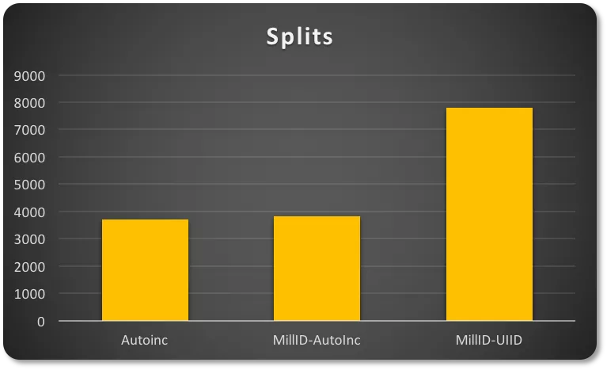

##                                                              Innodb页合并和页分裂                

​                                                                                                                                                                                    孟维克（译）                                                                                                                                                                                          [                         知数堂                      ](javascript:void(0);)                                                              *7月2日*                

​                                    


> 作者：Marco Tusa 、 Sri Sakthivel
> 译者：孟维克，知数堂优秀校友
> 原文链接：
>
> - https://www.percona.com/blog/2017/04/10/innodb-page-merging-and-page-splitting/
> - https://www.percona.com/blog/2020/06/24/mysql-table-fragmentation-beware-of-bulk-insert-with-failure-or-rollback/

**
*****\*InnoDB页合并和页分裂\****

如果您遇到全球少数的MySQL顾问之一，请他审核您的SQL语句和表结构设计，我相信他会告诉您一些有关好的主键设计的重要性。特别是对InnoDB，我相信他已经想您解释了索引合并和页分裂。这两个概念与性能密切相关，在设计任意索引（不仅仅是主键）时都应该考虑这方面因素。

对您来说，这听起来可能有点胡言乱语，也许您是对的。这不是一件容易的事情，尤其是在讨论内部原理时。这不是您经常要处理的事情，而且通常您根本不想处理它。

但有时这是必要的。如果是这样，这篇文章就是为您准备的。

在这篇文章中，我想解释一些InnoDB幕后操作中最不清楚的部分：索引页创建、页合并和页分裂。

在InnoDB中，所有的数据就是一个索引。您可能也听过，对吧？但这到底是什么意思呢？

### 表&文件

假设您已经安装了MySQL，5.7最新版本，您在windmills schema中有一个名为wmills的表。在数据目录中（通常是`/var/lib/mysql/`）您会看到它包含有：

```
data/
  windmills/
      wmills.ibd
      wmills.frm
```

这是因为参数`innodb_file_per_table`从MySQL5.6开始已经设置为1。这样设置，schema中每个表都是一个文件（如果是分区表，则有多个文件）。

这里重要的是名为`wmills.ibd`的文件。这个文件被分为N个段。每个段都与一个索引相关联。

尽管文件不会因删除数据而收缩，段本身会增长或收缩，下一级为区。一个区仅存在一个段中，并且固定尺寸为1MB（在默认页大小的情况下）。页是区的下一级，默认大小为16KB。

因此，一个区最多可包含64页。一个页可以包含2到N行。一个页可以容纳的行数与行大小有关，这是表结构设计时定义的。InnoDB中有一个规则，至少要在一个页中容纳两行。因此，行大小限制为8000字节。

如图所示：


InnoDB使用B+树。

### 根节点，分支节点和叶子节点

每个页（叶子节点）包含由主键组织的2～N行。树有专门的页管理不同的子树。这些被称为内部节点（INodes）。


enter image description here


这个图片仅是示例，并不能说明下面的实际输出。

细节如下：

```
ROOT NODE #3: 4 records, 68 bytes
 NODE POINTER RECORD ≥ (id=2) → #197
 INTERNAL NODE #197: 464 records, 7888 bytes
 NODE POINTER RECORD ≥ (id=2) → #5
 LEAF NODE #5: 57 records, 7524 bytes
 RECORD: (id=2) → (uuid="884e471c-0e82-11e7-8bf6-08002734ed50", millid=139, kwatts_s=1956, date="2017-05-01", location="For beauty's pattern to succeeding men.Yet do thy", active=1, time="2017-03-21 22:05:45", strrecordtype="Wit")
```

表结构如下：

```
CREATE TABLE `wmills` (
  `id` bigint(11) NOT NULL AUTO_INCREMENT,
  `uuid` char(36) COLLATE utf8_bin NOT NULL,
  `millid` smallint(6) NOT NULL,
  `kwatts_s` int(11) NOT NULL,
  `date` date NOT NULL,
  `location` varchar(50) COLLATE utf8_bin DEFAULT NULL,
  `active` tinyint(2) NOT NULL DEFAULT '1',
  `time` timestamp NOT NULL DEFAULT CURRENT_TIMESTAMP ON UPDATE CURRENT_TIMESTAMP,
  `strrecordtype` char(3) COLLATE utf8_bin NOT NULL,
  PRIMARY KEY (`id`),
  KEY `IDX_millid` (`millid`)
) ENGINE=InnoDB;
```

所有类型的B+树都有一个称为根节点的入口点。我们已经在第3页找到了它。根页包含了索引ID、INodes数量等信息。INode页包含关于页本身、值的范围等信息。最后，我们有叶节点，这是我们可以找到数据的地方。在本例中，我们可以看到叶节点5有57条记录，总共7524字节。这行下面是一条记录，您可以看到行数据。

这里的概念是，当您在表和行中组织数据时，InnoDB在分支节点、页和记录中组织数据。记住InnoDB不能以单行基础上工作是非常重要的。InnoDB总是在页上操作。一旦页被加载，它就会扫描页以寻找所请求的行/记录。

现在都清楚了么？让我们继续。

### 页内部

页可以是空，也可以是被填充满（100%）。行记录由主键组织。例如，如果您的表使用自增值，您将有序列ID=1，2，3，4等。


enter image description here

页还有另一个重要属性：`MERGE_THRESHOLD`。这个参数的默认值是页的50%，它在InnoDB页合并活动中起着非常重要的作用：


在插入数据时，如果插入的记录可以容纳在该页内，则按顺序填充该页。

当页已经满时，下一条记录将插入到下一页：


enter image description here

鉴于B+树的特点，该结构不仅可以自上而下沿着子树查找，还可以水平跨叶节点查找。这是因为每个叶节点页都有一个指向包含序列中下一个记录的页的指针。

例如，第5页指向下一页第6页。第6页指向前一页（第5页），并指向下一页（第7页）。

链表的这种机制允许快速、有序的扫描（例如，范围扫描）。如之前所述，这是在插入基于自增主键的表发生的情况。但是如果我开始删除值时会发生什么呢？

### 页合并

当您删除一条记录时，不会实际删除该记录，而是将记录标记为已删除，并且该记录使用的空间可回收。


enter image description here

当一个页删除足够多的数据，达到合并阈值（默认是页大小的50%），InnoDB开始找相邻的页（之前和之后的）查看它们是否有机会合并两个页，优化空间使用率。


enter image description here

在这个例子中，第6页占用空间不足一半。第5页删除了很多记录，也使用了不足50%。从InnoDB的角度看，它们是可以合并的：


合并操作的结果是：第5页包含了之前的数据和第6页的数据。第6页变成了空页，可用于新数据。


enter image description here

当我们更新一条记录，新记录的大小使页面低于阈值时，也会发生相同的过程。

规则是：如果在相邻页有更新和删除操作，将产生合并。如果合并成功，在`INFORMATION_SCHEMA.INNODB_METRICS`表中的`index_page_merge_successful`指标将会增加。

### 页分裂

如上所述，一个页最多可以填充100%。发生这种情况时，下一页将获取新记录。

但是如果我们遇到以下情况呢？


第10页没有足够的空间容纳新的记录（或者更新的记录）。遵循下一页的逻辑，这个记录应该在第11页上。然而：


enter image description here

第11页也已满，数据不能乱序插入。那该怎么办呢？

还记得我们说过的链表吗？此时第10页之前的页为第9页，之后的页为第11页。

InnoDB将做的是（简化版）：

1. 创建一个新页。
2. 确定原始页（第10页）可以在哪里拆分（在记录级别）
3. 移动记录
4. 重新定义页之间关系


enter image description here

新的第12页被创建：


enter image description here

第11页保持原样。改变的是页之间的关系：

- 第10页之前的页为第9页，之后的页为第12页
- 第12页之前的页为第10页，之后的页是第11页
- 第11页之前的页为第12页，之后的页为第13页

B+树的路径仍然遵循逻辑组织，因此仍然可以看到一致性。但是，页面的物理位置是无序的，在大多数情况下是在不同的程度的。

通常，我们可以说：页分裂发生在插入或者更新，并导致页错位（在许多情况下，程度不同）。

InnoDB在`INFORMATION_SCHEMA.INNODB_METRICS`表中记录了页分裂的次数。查看`index_page_splits`和`index_page_reorg_attempts/successful`指标。

一旦分裂的页创建，将其回收的唯一方法是将创建的页降至合并阈值下。当这发生时，InnoDB通过合并操作将数据从分裂页迁移走。

另外一个组织数据的方法是`OPTIMIZE TABlE`。这是一个代价比较大和长的过程，但通常是处理太多页比较稀疏的唯一方法。

另一个需要记住的是，在合并和分裂时，InnoDB在索引树上需要加一个X的闩。在繁忙的系统上，这很容易成为一个问题。这会导致索引闩争用。如果没有合并和分裂（也就是写入），只有一个单独的页，在InnoDB中被称为“乐观”更新，此时的闩为共享闩。合并和分裂被称为“悲观”更新，此时的闩为排他闩。

### 主键

一个好的主键不仅对检索数据很重要，而且在写入时正确将数据分布在区内（对于分裂和合并操作也很重要）。

第一个案例中，我有一个简单的自增主键。第二个案例中，我的主键基于ID（1-200）和一个自增值。在第三个案例中，我使用相同的ID（1-200），但与UUID关联。

当插入时，InnoDB必须添加页。这是一个页分裂操作：




enter image description here


根据我使用的主键的类型，行为会有很大的不同。

前两种情况将有更“紧凑”的数据分布。这意味着它们还有更好的空间利用率，而UUID的半随机特性将导致显著的“稀疏”页分布（会有更多的页和相关的页分裂）。

在页合并时，尝试合并的次数因主键的不同而更加不同。


enter image description here

在插入-更新-删除操作中，自动递增的页合并尝试更少，成功率比其他两种类型低9.45%。具有UUID的主键有更多的合并尝试，但同时也有高达22.34%的成功率，因为“稀疏”分布留下了许多部分为空的页。

### 总结

MySQL/InnoDB经常执行这些操作，您对它们的了解非常有限。但是它们也会对您造成很大的影响，特别是在使用SAS和SSD的情况下（顺便说一下，这两种存储存在不同的问题）。

不幸的是，我们也很少能在服务端使用参数来优化它。但好消息是在表结构设计时可以做很多事情。

使用适当的主键，设计辅助索引，记住不应滥用它们。在您知道插入/删除/更新次数很多的表上添加适当的维护窗口。

还有重要一点需要记住。在InnoDB中，您不能有碎片记录，否则在页级别上，您会有一个噩梦。忽略维护表将导致IO层、内存和InnoDB buffer pool更多的负载。

必须定期重建一些表。可以使用分区或者外部工具（pt-osc）。不要让表变得很大并充满碎片。

浪费磁盘空间？需要加载三个页而不是一个页来检索所需的记录集？每次搜索都会导致更多的读？

这是您的错；马虎是没有借口的！

## 当心批量插入失败或者回滚时带来的MySQL表碎片

通常，DBA都了解使用DELETE语句会产生表碎片。在大多数情况下，当执行大量的删除时，DBA总会重新构建表以回收磁盘空间。**但是，您是否认为只有删除才会导致表碎片？（答案：并不是）**。

在这篇博文中，我将解释插入如何会带来碎片。

在讨论这个主题之前，我们需要了解MySQL，有两种碎片：

- 在表中的InnoDB页完全空闲引起的碎片。
- InnoDB页未填充满（页中还有一些空闲空间）引起的碎片。

主要有三种由插入引起的碎片场景：

- 插入，然后回滚
- 插入语句失败
- 页分裂引起的碎片

### 测试环境

我创建了自己的测试环境来测试这些案例。

- DB：Percona版分支
- Table：frag，ins_frag，frag_page_spl
- 表大小：2G

### 场景1：插入后回滚

首先，我创建了一个新表**"ins_flag"**。然后我开启一个事务（使用BEGIN）,如下所示开始拷贝**"frag"**表中数据到**"ins_flag"**中。

```
mysql> create table ins_frag like frag;
Query OK, 0 rows affected (0.01 sec)

mysql> begin;
Query OK, 0 rows affected (0.00 sec)

mysql> insert into ins_frag select * from frag;
Query OK, 47521280 rows affected (3 min 7.45 sec)
Records: 47521280  Duplicates: 0  Warnings: 0

#Linux shell
sakthi-3.2# ls -lrth
total 8261632
-rw-r-----  1 _mysql  _mysql   2.0G Jun 17 02:43 frag.ibd
-rw-r-----  1 _mysql  _mysql   2.0G Jun 17 03:00 ins_frag.ibd
```

如上所示，您可以看到已经执行了插入，但是我还没有提交或者回滚插入操作。您注意到2张表都已经占用2G磁盘空间。

**现在我将回滚插入操作。**

```
mysql> select count(*) from ins_frag;
+----------+
| count(*) |
+----------+
| 47521280 |
+----------+
1 row in set (1.87 sec)

mysql> rollback;
Query OK, 0 rows affected (5 min 45.21 sec)

mysql> select count(*) from ins_frag;
+----------+
| count(*) |
+----------+
|        0 |
+----------+
1 row in set (0.00 sec)


#Linux shell
sakthi-3.2# ls -lrth
total 8261632
-rw-r-----  1 _mysql  _mysql   2.0G Jun 17 02:43 frag.ibd
-rw-r-----  1 _mysql  _mysql   2.0G Jun 17 03:09 ins_frag.ibd
```

当插入回滚后，**"ins_frag"**表仍然占有相同的2GB的磁盘空间。让我们在MySQL客户端看看碎片空间。

```
mysql> SELECT
-> table_schema as 'DATABASE',
-> table_name as 'TABLE',
-> CONCAT(ROUND(( data_length + index_length ) / ( 1024 * 1024 * 1024 ), 2), 'G') 'TOTAL',
-> CONCAT(ROUND(data_free / ( 1024 * 1024 * 1024 ), 2), 'G') 'DATAFREE'
-> FROM information_schema.TABLES
-> where table_schema='percona' and table_name='ins_frag';
+----------+----------+-------+----------+
| DATABASE | TABLE.   | TOTAL | DATAFREE |
+----------+----------+-------+----------+
| percona  | ins_frag | 0.00G | 1.96G    |
+----------+----------+-------+----------+
1 row in set (0.01 sec)
```

这清楚的显示了插入之后回滚会产生碎片。我们需要重建表来回收磁盘空间。

```
mysql> alter table ins_frag engine=innodb;
Query OK, 0 rows affected (2.63 sec)
Records: 0  Duplicates: 0  Warnings: 0

#Linux shell

sakthi-3.2# ls -lrth
total 4131040
-rw-r-----  1 _mysql  _mysql   2.0G Jun 17 02:43 frag.ibd
-rw-r-----  1 _mysql  _mysql   112K Jun 17 03:11 ins_frag.ibd
```

### 场景2:插入语句失败

为了测试这个场景，我启用了2个MySQL客户端会话（会话1和会话2）。

在会话1中，我将在事务中执行相同的插入语句。但是这次我会在会话2中中断并杀掉这个插入语句。

#### 会话1

```
#Linux shell

sakthi-3.2# ls -lrth
total 4131040
-rw-r-----  1 _mysql  _mysql   2.0G Jun 17 02:43 frag.ibd
-rw-r-----  1 _mysql  _mysql   112K Jun 17 04:02 ins_frag.ibd

#MySQL shell

mysql> begin;
Query OK, 0 rows affected (0.00 sec)

mysql> insert into ins_frag select * from frag;   #is running
```

#### 会话2

```
mysql> pager grep -i insert ; show processlist;
PAGER set to 'grep -i insert'
| 33 | root            | localhost | percona | Query   |    14 | executing              | insert into ins_frag select * from frag |
4 rows in set (0.00 sec)

mysql> kill 33;
Query OK, 0 rows affected (0.00 sec)
```

插入中断并失败了。

**在会话1查看：**

```
mysql> insert into ins_frag select * from frag;
ERROR 2013 (HY000): Lost connection to MySQL server during query

#Linux shell

sakthi-3.2# ls -lrth
total 4591616
-rw-r-----  1 _mysql  _mysql   2.0G Jun 17 02:43 frag.ibd
-rw-r-----  1 _mysql  _mysql   212M Jun 17 04:21 ins_frag.ibd

#MySQL shell

mysql> select count(*) from ins_frag;
+----------+
| count(*) |
+----------+
|        0 |
+----------+
1 row in set (0.10 sec)
```

插入并未完成，表中无数据。但是仍然，这个表的ibd文件已经涨到212M。通过MySQL客户端查看表空间碎片。

```
mysql> SELECT
-> table_schema as 'DATABASE',
-> table_name as 'TABLE',
-> CONCAT(ROUND(( data_length + index_length ) / ( 1024 * 1024 ), 2), 'M') 'TOTAL',
-> CONCAT(ROUND(data_free / ( 1024 * 1024 ), 2), 'M') 'DATAFREE'
-> FROM information_schema.TABLES
-> where table_schema='percona' and table_name='ins_frag';
+----------+----------+---------+----------+
| DATABASE | TABLE    | TOTAL   | DATAFREE |
+----------+----------+---------+----------+
| percona  | ins_frag | 0.03M   | 210.56M  |
+----------+----------+---------+----------+
1 row in set (0.01 sec)
```

表中有碎片，需要重建表回收这些空间。

```
mysql> alter table ins_frag engine='innodb';
Query OK, 0 rows affected (0.03 sec)
Records: 0  Duplicates: 0  Warnings: 0

#Linux shell

sakthi-3.2# ls -lrth
total 4131040
-rw-r-----  1 _mysql  _mysql   2.0G Jun 17 02:43 frag.ibd
-rw-r-----  1 _mysql  _mysql   112K Jun 17 04:32 ins_frag.ibd
```

### 场景3:页分裂引起的碎片

我们知道，InnoDB记录存储在InnoDB页中。默认情况下，每个页大小是16K，但是您可以选择更改页大小。

如果InnoDB页没有足够的空间容纳新的记录或索引条目，它将被分成2页，每页约占50%。这意味着，即使对表只有插入，没有回滚和删除，最终也可能只有平均75%的页利用率——因此这种页内部损失为25%。

当按排序建立索引，它们会有更多的拥塞，如果表很多插入到索引中随机位置，就会导致页分裂。

参阅Marco Tusa写的博客InnoDB Page Merging and Page Splitting，详细介绍了页分裂和InnoDB 页结构/操作。

为了实验，我创建了一个具有排序索引的表（降序）

```
mysql> show create table frag_page_spl\G
*************************** 1. row ***************************
Table: frag_page_spl
Create Table: CREATE TABLE `frag_page_spl` (
`id` int NOT NULL AUTO_INCREMENT,
`name` varchar(16) DEFAULT NULL,
`messages` varchar(600) DEFAULT NULL,
PRIMARY KEY (`id`),
KEY `idx_spl` (`messages` DESC)
) ENGINE=InnoDB DEFAULT CHARSET=utf8mb4 COLLATE=utf8mb4_0900_ai_ci
1 row in set (0.07 sec)
```

我们可以通过表`INFORMATION_SCHEMA.INNODB_METRICS`监控页分裂情况。对此，您需要启用InnoDB monitor。

```
mysql> SET GLOBAL innodb_monitor_enable=all;
Query OK, 0 rows affected (0.09 sec)
```

我写了一个6个并发随机插入的脚本。脚本执行结束后：

```
mysql> select name,count,type,status,comment from information_schema.innodb_metrics where name like '%index_page_spl%'\G
*************************** 1. row ***************************
name: index_page_splits
count: 52186
type: counter
status: enabled
comment: Number of index page splits
1 row in set (0.05 sec)

mysql> SELECT
-> table_schema as 'DATABASE',
-> table_name as 'TABLE',
-> CONCAT(ROUND(( data_length + index_length ) / ( 1024 * 1024 ), 2), 'M') 'TOTAL',
-> CONCAT(ROUND(data_free / ( 1024 * 1024 ), 2), 'M') 'DATAFREE'
-> FROM information_schema.TABLES
-> where table_schema='percona' and table_name='frag_page_spl';
+----------+---------------+----------+----------+
| DATABASE | TABLE.        | TOTAL    | DATAFREE |
+----------+---------------+----------+----------+
| percona  | frag_page_spl | 2667.55M | 127.92M  |
+----------+---------------+----------+----------+
1 row in set (0.00 sec)
```

从指标上看，我们看到页分裂次数在增加。输出显示有**52186次页分裂**，产生了**127.92MB**的碎片。

一旦发生页分裂，唯一的方法是将创建的页降至合并阈值之下。当这种情况发生时，InnoDB通过合并操作将数据从分裂的页中移出。对表和特定的索引合并阈值是可配置的。

另一种重新组织数据的方法是`OPTIMIZE TABLE`。这是一个非常重和漫长的过程，但通常这是解决过多页比较稀疏的唯一方法。

### 总结

- 前面两种情况很少见。因为大多数应用程序都不会设计在表中写入大量数据。
- 在执行批量插入时（INSERT INTO SELECT * FROM, 加载mysqldump的数据, INSERT with huge data等）需要注意这些问题。
- 碎片占用的磁盘空间始终是可重用的。


全文完。