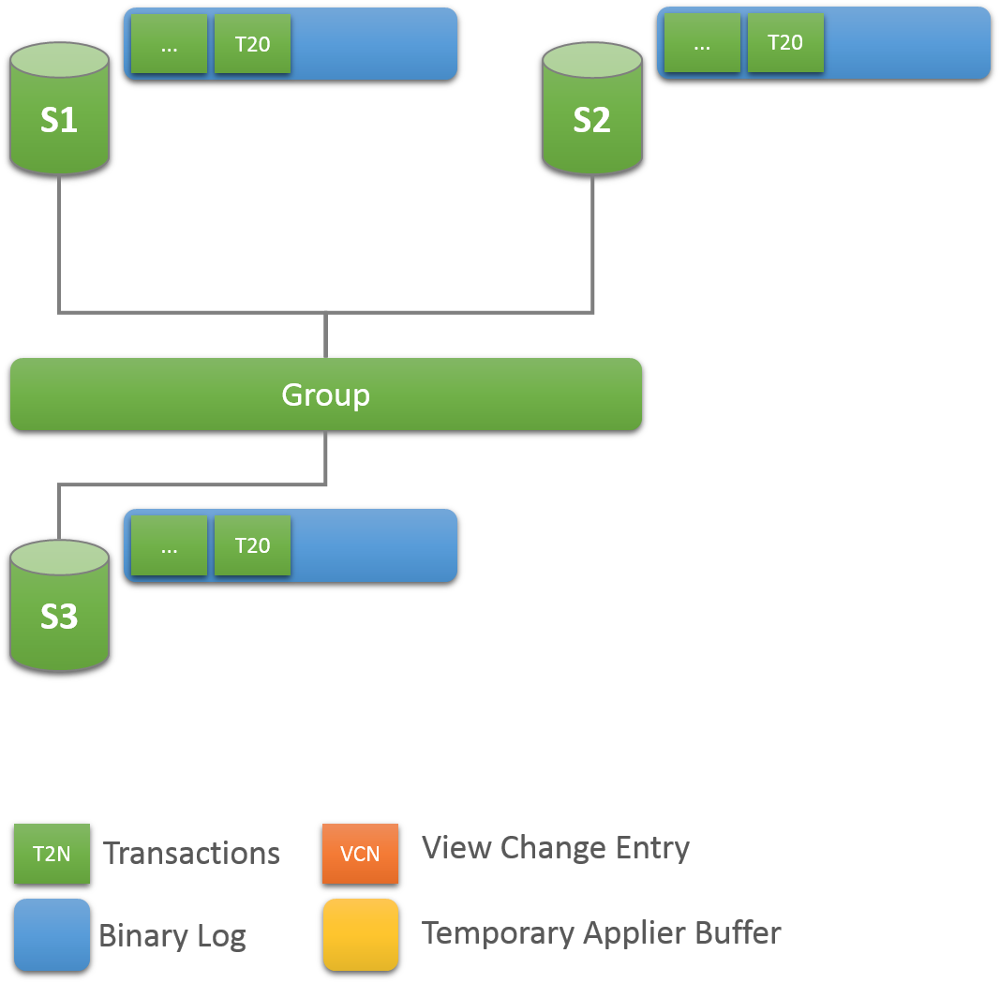
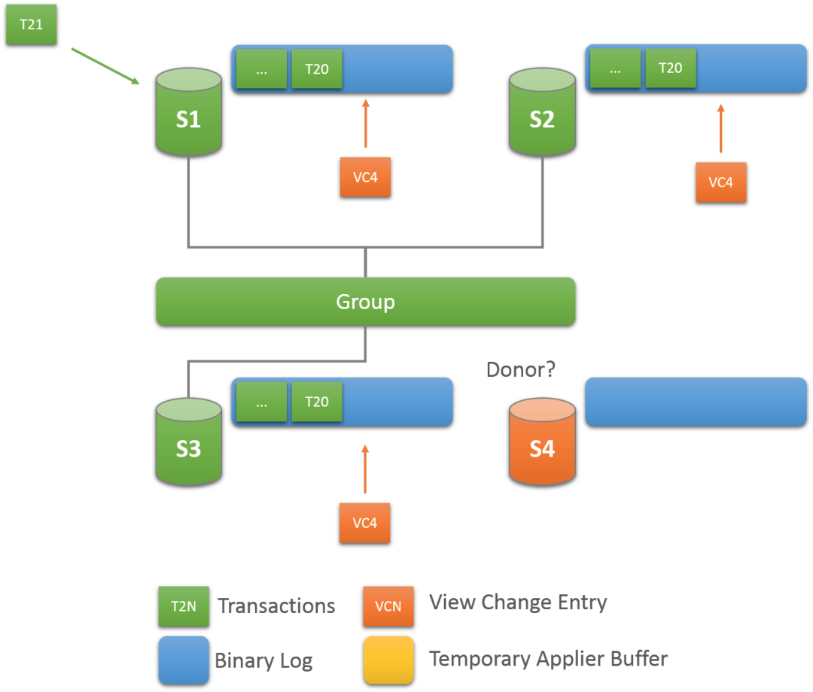
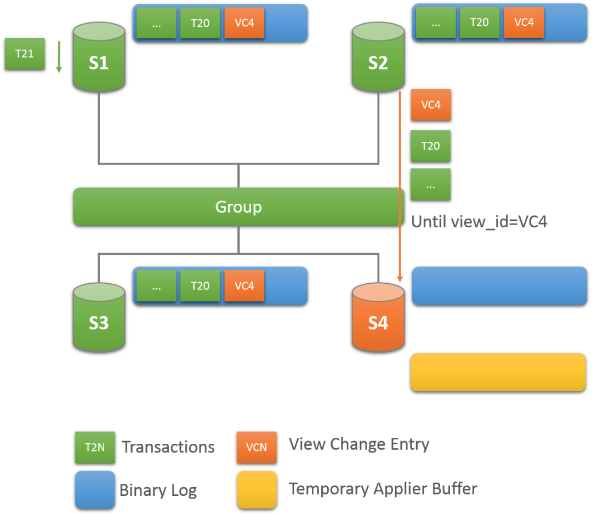
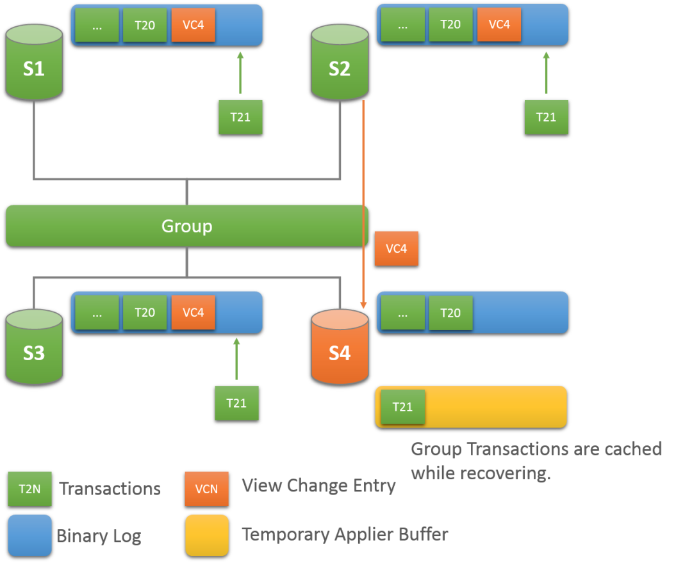
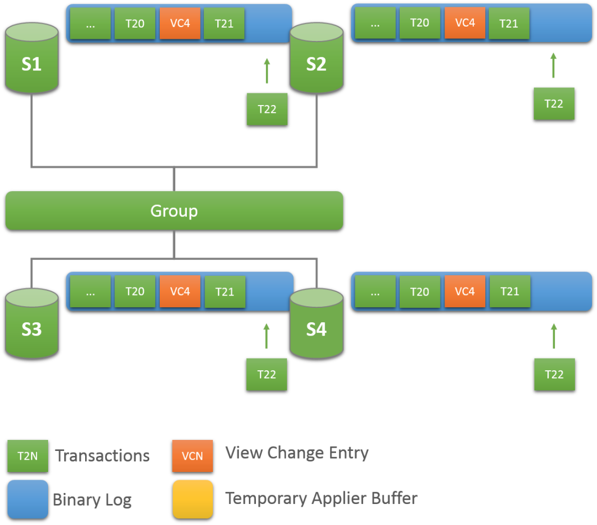

## 组复制常规操作-分布式恢复 | 全方位认识 MySQL 8.0 Group Replication 

 

 

 

 

## 每当一个Server新加入或重新加入一个复制组时，对于新加入的Server，它必须要追平组中的最新数据，对于重新加入的Server，它必须要追平它脱离组之后的最新数据。这个追平最新数据的过程称为分布式恢复。  

## 申请加入组的Server首先检查其组复制通道group_replication_applier对应的中继日志，查看它已经从组中接收到了但尚未应用的任何事务。如果是重新加入组的Server，那么它可能在脱离组时存在着未应用完成的事务，在这种情况下，它将第一步应用这些事务，如果是新加入组的Server则不存在这种情况，所以在这一步没有任何东西需要应用。

## 之后，申请加组的Server会与组中的现有成员建立连接进行状态传输。申请加入组的Server会从组中现有成员中（提供状态传输的组成员称为donor节点，接收状态传输的Server称为joiner节点）传输在其加入组之前或者在其脱离组之后组中的所有事务数据。然后，申请加入组的Server将应用在状态传输过程中组内新事务写入的数据。当这个过程完成时，就表示申请加入组的Server已经赶上了组中其余成员中的数据，此时，新加入组的Server就会转换为ONLINE状态，并开始正常地参与组中的各项工作。

## 在分布式恢复期间，组复制使用如下方法的组合进行状态传输：

- 使用克隆插件功能进行远程克隆操作，该功能在MySQL 8.0.17中引入。要启用此状态传输方法，所有成员（包括已经在组中的成员和待加入Server）必须使用该版本，且必须在所有成员中都加载克隆插件。加载克隆插件之后，组复制会自动配置所需的克隆插件设置并管理远程克隆操作（注意，该操作针对于还尚未加入组的Server有效，已经加入组中的成员不能使用克隆功能来传输数据，另外，克隆插件的安装要求和安装、克隆操作步骤，详见链接：https://dev.mysql.com/doc/refman/8.0/en/clone-plugin.html ）
- 从donor节点的二进制日志中复制事务数据并将其应用于joiner节点。此方法使用一个名为group_replication_recovery的标准异步复制通道，该通道是建立在donor节点与joiner节点之间建立的。

## 在joiner节点上执行START GROUP_REPLICATION语句后，组复制将自动选择这些方法的最佳组合进行状态传输。为此，组复制会检查组中哪些现有成员适合作为donor节点，joiner节点需要从donor节点获取多少事务，以及joiner节点所需的事务在组中的所有成员的二进制日志中是否存在。如果joiner节点与donor节点之间的事务差距很大，或者joiner节点所需的某些事务在组中的所有成员的二进制日志中都不存在，则组复制将通过远程克隆操作执行分布式恢复。如果joiner节点与donor节点之间的事务差距不大，或者没有安装克隆插件，则组复制直接使用donor节点的二进制日志进行状态传输。

- 在远程克隆操作期间，joiner节点中的现有数据将被删除，并替换为donor节点的数据副本。当远程克隆操作完成且joiner节点完成重新启动时，将继续使用来自donor节点的二进制日志执行状态传输，以获取在执行远程克隆操作期间组中新产生的事务数据。
- 在从donor节点的二进制日志进行状态传输期间，joiner节点会从来自donor节点的二进制日志中复制并应用所需的事务，直到将joiner节点记录到二进制日志为止（当joiner节点成功加入组时，二进制日志中会记录视图更改事件）。在此过程中，joiner节点会缓冲组中的新事务。当完成从二进制日志的状态传输时，joiner节点会应用这些缓冲事务。

## 当joiner节点追赶上组中的最新数据时，它将声明已经处于ONLINE状态，并可以作为正常成员参与组中的各项工作，至此，分布式恢复完成。

## PS：如果joiner节点与donor节点之间的事务差距很大，或者joiner节点所需的某些事务在组中的所有成员的二进制日志中都不存在时，如果也未配置克隆功能，则，joiner节点将加入组失败。

## **4.3.1. 克隆用于分布式恢复**

## MySQL 8.0.17版本中引入了克隆插件。如果希望在组复制中使用远程克隆的方式进行分布式恢复，则必须对组中的现有成员和joiner节点进行预先设置。如果不进行相应的设置，则组复制只能使用二进制日志进行状态传输。

## 要使用克隆功能，必须对组中的至少一个现有成员和joiner节点进行预先设置，以支持远程克隆操作。即，至少需要在donor节点和joiner节点上安装克隆插件，创建一个具有BACKUP_ADMIN权限的复制用户用于分布式恢复，并将系统变量group_replication_clone_threshold设置为适当量级的数值（默认情况下为GTID序列允许的最大值，表示正常情况下，始终优先使用基于二进制日志的状态传输，除非joiner节点所请求的事务在组中任意成员中都不存在，这个时候，如果设置好了克隆功能，则无论该系统变量的值设置为多少，都会触发通过克隆的方式进行分布式恢复，例如：全新初始化的Server申请加入组时。如果不希望使用克隆功能，则不要对其进行安装与配置）。为了确保donor节点的最大可用性，建议在组中所有的现有成员和joiner节点中都设置好克隆功能，以便后续有Server加入组时能够使用远程克隆操作来快速追赶组中的最新数据。

## 请注意，远程克隆操作在从donor节点执行传输数据之前会删除掉joiner节点中用户创建的数据和表空间。如果中途远程克隆操作意外终止，则该joiner节点中的用户数据可能已经被清空或者只剩下残留数据，无法重新启动实例。这个时候，可以通过重试远程克隆操作来修复此问题（这里主要针对远程克隆时使用DATA DIRECTORY子选项指定了一个数据保存路径的情况，指定路径时，数据会保存在指定的目录下，即克隆之后的数据与操作克隆的实例没有关联，需要手动启动实例并指定datadir到保存克隆数据的目录进行启动），当然，MGR插件可以自动执行远程克隆的重试操作（需要保证克隆操作不指定DATA DIRECTORY子选项，在这种情况下，远程克隆数据会覆盖掉操作远程克隆的Server数据，完成远程克隆操之后，操作远程克隆的Server会基于克隆数据自动重新启动）。另外，克隆插件虽然与组复制配合使用对组复制的管理维护来说更加自动化，但是，克隆插件不要求必须在组中运行（但MGR插件必须要安装）。

## **4.3.1.1. 克隆的前提条件**

## 关于组复制中使用克隆功能，需要注意以下要点和区别：

- donor节点(即，捐献者，指的是组中的现有成员)和joiner节点（即，接受者，指的是申请加入组的Server。也可以称为recipient节点）都必须安装并激活克隆插件。
- donor节点和joiner节点必须在相同的操作系统平台上运行，并且必须有相同的MySQL Server版本（必须是MySQL 8.0.17及其以上版本才能支持克隆插件）。
- 如果分布式恢复启用了SSL     (group_replication_recovery_use_ssl=ON)，则组复制会将此设置应用于远程克隆操作。组复制会自动配置克隆功能相关的SSL系统变量(clone_ssl_ca、clone_ssl_cert、clone_ssl_key)，以匹配组复制分布式恢复相关的SSL系统变量(group_replication_recovery_ssl_ca、group_replication_recovery_ssl_cert、group_replication_recovery_ssl_key)的设置。
- 不需要在joiner节点中为系统变量clone_valid_donor_list指定有效的donor节点列表。组复制会从现有的组成员中选择一个成员作为donor节点，然后自动配置该系统变量的值。注意，远程克隆操作使用MySQL     Server的SQL协议主机地址（IP）和端口，而不是组成员之间的组通讯地址和端口。
- 克隆插件具有许多系统变量（MySQL 8.0.17版本中为11个），可以用于管理远程克隆操作的网络负载和性能影响。但组复制并不负责管理与配置这些系统变量，因此，如果需要控制克隆插件的网络负载与克隆性能，需要手工查看克隆插件相关的状态变量，并使用克隆插件的系统变量进行相应的设置。注意，当使用远程克隆操作进行分布式恢复时，克隆插件的系统变量clone_enable_compression仅适用于远程克隆操作，不会影响组复制的压缩设置。
- 远程克隆操作在joiner节点上执行，组复制使用内部mysql.session用户，该用户为内置用户，已经具有了CLONE_ADMIN权限，不需要对其进行设置。
- 在donor节点上作为远程克隆操作的克隆用户，组复制会使用在配置组复制通道时配置的用于分布式恢复的复制用户。因此，必须在组中所有支持克隆功能的组成员上为该复制用户授予BACKUP_ADMIN权限。如果有joiner节点，也要为此Server的复制用户授予该权限，因为在该新Server加入组之后，也可能作为其他joiner节点的donor节点。要将此权限授予现有成员上的复制用户，可以使用如下语句执行（在执行赋权操作时，对于组内成员，可以在任意一个可读写的成员中执行即可，对于joiner节点，可以无需单独授予，如果要单独授予该权限，则需要保证不与组内的数据冲突，可以在授予该权限时使用sql_log_bin=0的方式临时关闭二进制日志记录功）:

GRANT BACKUP_ADMIN ON *.* TO rpl_user@'%';
 

###### **4.3.1.2. 克隆触发阈值**

###### *当组成员设置了支持克隆时，会通过系统变量**group_replication_clone_threshold**指定的阈值（该阈值表示若干个事务）来判断在分布式恢复过程中是否需要使用远程克隆操作。**如果donor节点的事务与joiner节点之间的事务差距大于此数字（组复制会根据组中的现有成员的系统变量gtid_execution中的GTID SET计算出它们之间的事务数量的差距是否超出了阈值），则在技术上可行的情况下，将使用远程克隆操作将donor节点的状态传输到joiner节点，无需事先手动将组的数据传输到joiner节点主机中，还可以让延迟非常大的组成员能够快速追赶上来。*

###### *系统变量**group_replication_clone_threshold**的默认设置非常高（**GTID**中事务的最大允许序列号），因此只要可以从二进制日志传输状态，组复制就不会使用克隆功能传输状态。**要想让组复制在何时的时候使用远程克隆操作进行状态传输，可以根据具体情况对系统变量group_replication_clone_threshold设置合适的值。但是要注意，在组中有成员正在使用远程克隆操作进行状态传输的过程中，不要对系统变量group_replication_clone_threshold设置过低的阈值。因为，如果在进行远程克隆操作时组中存在着大量超过阈值的新的事务请求，则joiner节点在重新启动数据库进程后将再次触发远程克隆操作，并无限循环远程克隆操作。要避免这种情况，需要将该阈值设置为高于组内的最高并发事务请求数。*

###### *当无法从**donor**节点的二进制日志进行状态传输时，组复制会尝试执行远程克隆操作。**此时会忽略系统变量group_replication_clone_threshold的阈值设置，例如，joiner节点所需的事务在任何现有组成员的二进制日志中都不可用（找不到）。组复制基于现有组成员的系统变量gtid_purged的GTID SET来进行比对。当任何现有组成员的二进制日志文件中都没有joiner节点所需的事务时，组复制会尝试执行远程克隆操作进行状态传输，且这种情况下无法通过系统变量group_replication_clone_threshold的阈值设置来停用克隆操作，因为在这种情况下，克隆是将组的状态传输到joiner节点的一个可行的替代方法。*

###### **4.3.1.3. 克隆操作**

###### *当为组成员以及待加入组的成员都设置好了克隆功能时，组复制会接管远程克隆操**作。远程克隆操作过程可能需要一些时间才能完成，具体取决于数据的大小。有关克隆操作过程的监控信息，详情可留意后续克隆插件系列文章。*

\# performance_schema.clone_progress表中记录了整个克隆操作的每一个阶段及其对应的阶段信息，每一个阶段会生成一行记录（注意，该表中只记录一次克隆操作的过程信息，下一次执行克隆操作时，上一次的信息会被覆盖）
 admin@localhost : performance_schema:37: > select * from clone_progress;
 +------+-----------+-----------+----------------------------+----------------------------+---------+------------+------------+------------+------------+---------------+
 | ID | STAGE | STATE | BEGIN_TIME | END_TIME | THREADS | ESTIMATE | DATA | NETWORK | DATA_SPEED | NETWORK_SPEED |
 +------+-----------+-----------+----------------------------+----------------------------+---------+------------+------------+------------+------------+---------------+
 | 1 | DROP DATA | Completed | 2019-10-08 16:46:58.757964 | 2019-10-08 16:46:59.128436 | 1 | 0 | 0 | 0 | 0 | 0 |
 | 1 | FILE COPY | Completed | 2019-10-08 16:46:59.128766 | 2019-10-08 16:47:16.857536 | 8 | 8429731840 | 8429731840 | 8430190882 | 0 | 0 |
 | 1 | PAGE COPY | Completed | 2019-10-08 16:47:16.857737 | 2019-10-08 16:47:17.159531 | 8 | 0 | 0 | 785 | 0 | 0 |
 | 1 | REDO COPY | Completed | 2019-10-08 16:47:17.159748 | 2019-10-08 16:47:17.460516 | 8 | 2560 | 2560 | 3717 | 0 | 0 |
 | 1 | FILE SYNC | Completed | 2019-10-08 16:47:17.460788 | 2019-10-08 16:47:20.926184 | 8 | 0 | 0 | 0 | 0 | 0 |
 | 1 | RESTART | Completed | 2019-10-08 16:47:20.926184 | 2019-10-08 16:47:28.623732 | 0 | 0 | 0 | 0 | 0 | 0 |
 | 1 | RECOVERY | Completed | 2019-10-08 16:47:28.623732 | 2019-10-08 16:47:34.898453 | 0 | 0 | 0 | 0 | 0 | 0 |
 +------+-----------+-----------+----------------------------+----------------------------+---------+------------+------------+------------+------------+---------------+
 7 rows in set (0.00 sec)
 \# performance_schema.clone_status表中记录了克隆操作的一些元数据信息，例如，donor节点地址信息，对应数据的二进制日志位置信息和GTID信息（注意，该表中只记录一次克隆操作的信息，下一次执行克隆操作时，该表中的信息会被覆盖）
 admin@localhost : performance_schema:38: > select * from clone_status\G
 *************************** 1. row ***************************
 ID: 1
 PID: 0
 STATE: Completed
 BEGIN_TIME: 2019-10-08 16:46:58.758
 END_TIME: 2019-10-08 16:47:34.898
 SOURCE: 10.10.30.162:3306
 DESTINATION: LOCAL INSTANCE
 ERROR_NO: 0
 ERROR_MESSAGE:
 BINLOG_FILE: mysql-bin.000022
 BINLOG_POSITION: 222104704
 GTID_EXECUTED: 320675e6-de7b-11e9-b3a9-5254002a54f2:1-4,
 aaaaaaaa-aaaa-aaaa-aaaa-aaaaaaaaaaaa:1-2771494
 1 row in set (0.01 sec)

注意：当完成状态传输后，组复制将重新启动joiner节点的数据库进程以完成该过程。如果在joiner节点上设置了group_replication_start_on_boot=OFF，则在数据库进程重新启动完成之后必须再次手动执行START GROUP_REPLICATION语句启动组复制。如果在配置文件中设置了group_replication_start_on_boot=ON和启动组复制所需的其他设置，或者使用了SET PERSIST语句将group_replication_start_on_boot=ON和启动组复制所需的其他设置进行了持久化，则在数据库进程重启之后不需要进行干预，组复制会继续自动执行成员加入组并使其达到ONLINE状态的流程。

远程克隆操作会将donor节点的datadir下的各种数据文件克隆到joiner节点中（表中可能包含了一些配置信息及其用户数据等）。但保存在配置文件（如组复制本地地址配置等）中的组复制成员设置不会被克隆，也不会在joiner节点上做任何更改。即，组复制相关的配置需要自行配置好，不能跟组中的现有成员冲突，远程克隆操作只负责克隆数据文件，不会克隆配置信息（当然，如果某些配置信息保存在表里，对于克隆操作来说，也会被当做数据进行克隆）。

donor节点中用于组复制专用通道group_replication_recovery的用户凭证（复制用户和密码），在克隆操作完成之后，会被新成员使用，所以，该用户和密码及其权限必须在新成员中也有效。因此，所有组成员才能够使用相同的复制用户和密码通过远程克隆操作接收状态传输进行分布式恢复。但是，组复制会保留与使用SSL相关的组复制通道设置，这些设置对单个成员来说可以是惟一的（即，每个组成员使用不同的复制用户和密码）。如果使用了PRIVILEGE_CHECKS_USER帐户来帮助保护复制应用线程（从MySQL 8.0.18开始，可以创建一个具有特定权限的用户账号，然后将其指定为PRIVILEGE_CHECKS_USER帐户，这样可以防止将未经授权或意外将具有特权的账号用于组复制通道），则在克隆操作完成之后新加入成员不会使用该用户帐户作为组复制通道的用户。此时必须为组复制通道手工指定合适的复制用户。

- 关于PRIVILEGE_CHECKS_USER帐户的详细信息，详见链接：https://dev.mysql.com/doc/refman/8.0/en/replication-privilege-checks.html

**4.3.2. 配置分布式恢复**分布式恢复的复制用户

- 分布式恢复需要具有正确权限（replication     slave权限）的复制用户，以便组复制可以在成员之间建立直接相连的复制通道。如果该复制用户还同充当远程克隆操作中的克隆用户，则在donor节点中该复制用户还必须具有远程克隆相关的正确权限（BACKUP_ADMIN权限）。有关设置此复制用户的说明，请参见     2.1.3节“用户凭证”。

手动状态传输

- 基于二进制日志进行状态传输是组复制执行分布式恢复的基本机制，如果复制组中的donor节点和joiner节点未设置克隆功能支持，那么基于二进制日志进行状态传输就是惟一可用的分布式恢复方法。由于基础二进制日志的状态传输是基于典型的异步复制的数据同步类型，因此，如果joiner节点中没有任何组的数据、或者与组中的数据差距太大（例如，数据取自很久之前的备份），则整个分布式恢复的过程可能需要很长时间，如果在组中任何成员中都找不到joiner节点所需的数据，则会导致joiner节点加入组失败。因此，在这种情况下，建议先手动从组中获取一份最新的数据快照，使用该快照数据先恢复到joiner节点中，基于该快照数据加入组可以最小化分布式恢复所花费的时间，并减少对donor节点的影响。

连接尝试次数

- 对于基于二进制日志的状态传输，组复制限制了joiner节点从可用的donor节点池（即，可作为donor节点的组成员列表）尝试获取donor节点的尝试次数。如果达到重试限制次数之后仍然没有成功与donor节点建立连接，则分布式恢复过程将报错终止。注意，该限制次数指的joiner节点可以重试连接donor节点的总次数。例如，如果组中有2个组成员可作为donor候选节点，且重试连接次数限制为4，则每个donor候选节点都可以被重试连接2次。
- 默认的连接重试限制是10。可以使用系统变量group_replication_recovery_retry_count进行设置，如下：

\# 下面的语句将尝试重新连接donor节点的最大次数限制为5:
 mysql> SET GLOBAL group_replication_recovery_retry_count= 5;
 \# 注意：对于远程克隆操作，此重试次数不适用。在开始尝试基于二进制日志的状态传输之前，组复制仅对每一个合适的donor候选节点做一次克隆操作连接尝试
 

连接尝试的时间间隔

- 对于基于二进制日志的状态传输，系统变量group_replication_recovery_reconnect_interval定义了分布式恢复过程中重新连接donor节点的时间间隔。注意，如果最大重试次数设置为4，且组内有2个donor候选节点，则，会先连续2次分别尝试连接这两个donor候选节点（不会使用系统变量group_replication_recovery_reconnect_interval设置的间隔时间，因为这两个donor候选节点之间并没有相互的强关联影响因素，所以没有必要在占满这两个donor候选节点之前就执行重试等待）。一旦joiner节点尝试与所有的donor候选节点都执行了连接尝试之后（假设这里2个donor候选节点都在同时做连接尝试），那么，比起donor候选节点数量来讲，多余的重试连接次数（4-2=2次）就会按照系统变量group_replication_recovery_reconnect_interval配置的时间间隔（单位秒）对分布式恢复程序进行休眠。
- 默认的连接重试间隔是60秒，可以使用如下语句进行动态修改。

\# 以下语句将分布式恢复中donor节点的连接重试间隔设置为120秒
 mysql> SET GLOBAL group_replication_recovery_reconnect_interval= 120;
 \# 对于远程克隆操作，此间隔时间不适用。开始尝试基于二进制日志的状态传输之前，组复制仅对每一个合适的donor候选节点做一次克隆操作连接尝试
 

标记joiner节点在线

- 当分布式恢复成功完成了从donor节点到joiner节点之间的状态传输时，joiner节点在组中就可以被标记为online状态并准备参与到组内的各项工作中。默认情况下，此操作是在joiner节点接收并应用完成了所有缺失的事务之后执行的。但，可以允许joiner节点在接收并验证完成所有缺失事务之后，应用它们之前，将joiner节点标记为online状态。可以在joiner节点中将系统变量group_replication_recovery_complete_at设置为TRANSACTIONS_CERTIFIED值来实现。

分布式恢复使用SSL身份验证

- 您可以选择将SSL用于组成员之间的分布式恢复连接。用于分布式恢复的SSL与用于普通组通信的SSL是分开配置的，后者由MySQL     Server的SSL相关的系统变量和系统变量group_replication_ssl_mode共同设置。对于分布式恢复连接的SSL配置，使用专用的分布式恢复相关的SSL系统变量来配置相关的证书和密码。
- 默认情况下，分布式恢复连接不使用SSL。要启用此功能，可以通过系统变量group_replication_recovery_use_ssl=ON进行设置，并配置组复制的分布式恢复相关的SSL系统变量，并创建一个启用了SSL的专用用户，详情可参考"5.2.     组复制安全套接字层(SSL)支持"。
- 当为分布式恢复配置使用SSL时，组复制会将此设置应用于远程克隆操作，以及基于二进制日志的状态传输。组复制会自动配置克隆操作相关的SSL系统变量(即，clone_ssl_ca、clone_ssl_cert、clone_ssl_key等系统变量)，以匹配相应的分布式恢复系统变量值（即，group_replication_recovery_ssl_ca、group_replication_recovery_ssl_cert和group_replication_recovery_ssl_key等系统变量）。
- 如果没有为分布式恢复配置使用SSL（即，group_replication_recovery_use_ssl=OFF），且组复制的复制用户是使用的caching_sha2_password插件（caching_sha2_password是MySQL     8.0中默认使用的身份认证插件）或sha256_password插件进行身份认证的，则会将RSA密钥对用于密码交换。在这种情况下，需要使用系统变量group_replication_recovery_public_key_path来指定RSA公钥文件，或使用系统变量group_replication_recovery_get_public_key设置秘钥文件从主要节点中获取，否则，分布式恢复操作将发生报错终止。

分布式恢复压缩

- 从MySQL     8.0.18开始，基于二进制日志的状态传输支持压缩功能。当网络带宽有限，且发送方（donor节点）需要向接收方（joiner节点）传输大量事务时，压缩功能有利于提高分布式恢复的效率。通过系统变量group_replication_recovery_compression_algorithm配置允许的压缩算法，通过系统变量group_replication_recovery_zstd_compression_level设置zstd压缩级别。
- 注意，这些压缩设置不适用于远程克隆操作。当使用远程克隆操作进行分布式恢复时，如果需要使用压缩功能，可以使用克隆插件的系统变量clone_enable_compression进行设置。

**4.3.3. 分布式恢复的容错能力**

组复制有许多内置的容错措施，以确保在分布式恢复过程中出现任何问题时能够进行容错。分布式恢复的donor节点是从组的当前视图中的在线成员列表中随机选择的一个合适的组成员。随机选择donor节点就意味着当多个Server同时申请加入组时，组中的同一个成员很可能不会被同时多次选中。从MySQL 8.0.17开始，对于基于二进制日志的状态传输，同时申请加入组的所有Server只选择同一个donor节点来提供状态传输，这个donor节点运行的MySQL Server的补丁版本要求比申joiner节点的Server版本低或相同（可以将donor节点类比为主库，joiner节点类比为从库，为了保证兼容性，主库的版本不能高于从库的版本）。但对于更早的版本，组中所有的在线成员都可以成为donor节点。对于基于远程克隆操作的状态传输，joiner节点只选择与自身运行相同Server版本的组成员作为donor节点（因为克隆操作是拷贝数据文件，不同版本之间可能存在着一些文件格式兼容性问题，要处理这些问题可能需要做升级与降级处理，而克隆不做这些处理）。注意，joiner节点在克隆操作结束之后重新启动数据库进程时，它将重新选择一个新的donor节点建立连接并执行基于二进制日志的状态传输，这个新的donor节点可能与用于远程克隆操作的原始donor节点不是同一个组成员。在以下情况下，组复制检测到分布式恢复过程中的错误时，会自动切换到一个新的donor节点，并重试状态传输操作：

- 连接错误：在连接到候选donor节点时存在身份验证问题或其他问题。
- 复制错误：基于二进制日志的状态传输的复制线程（接收线程或应用线程）之一出现错误。因为这种状态传输方法使用了现有的MySQL主从复制基础架构，所以一些临时错误可能会在接收线程或应用程序线程中引起错误。
- 远程克隆操作错误：远程克隆操作失败或在执行完成之前意外停止。
- donor节点脱离组：在执行状态传输过程中，donor节点意外脱离组，或者在donor节点上停止组复制。

在上述情况下，donor节点发生错误之后，joiner节点将尝试重新选择donor节点。通过选择新的donor节点就可能避免之前joiner节点中发生的错误，从而保证能够继续执行分布式恢复。如果安装了克隆插件，则组复制在这种情况下将首先尝试使用支持克隆功能的合适的在线donor候选节点执行远程克隆操作。如果所有支持克隆的候选donor节点尝试远程克隆都失败了，则组复制会接着继续依次尝试所有合适的候选donor节点进行基于二进制日志的状态传输（如果可能的话）。

- 注意：对于远程克隆操作，在开始执从donor节点接收数据之前，会先删除joiner节点上的原始数据文件。所以，一旦远程克隆操作启动之后但未执行完成就被终止，则joiner节点上可能只剩下部分原始数据文件，或者原始数据文件完全被清空。此时，可以通过重试克隆操作来修复这种情况（组复制会自动执行该修复操作）。

在以下情况下，无法完成分布式恢复过程，joiner节点会执行退出组的操作：

- 事务被清理：joiner节点所需的事务，在组中现有的任何在线成员的二进制日志中都无法找到，且也无法执行远程克隆操作（例如，因为克隆插件没有安装,或者所有支持克隆操作的所有候选donor节点尝试连接都失败了）。此时，joiner节点无法获取组中的数据，无法加入组。
- 事务冲突：joiner节点已经包含了组中不存在的一些事务。如果执行远程克隆操作，这些组中不存在的事务将被删除（对于joiner节点来说，意味着这些事务数据丢失），因为joiner节点上的数据目录将被删除。如果使用基于二进制日志的状态传输，则joiner节点中多余的事务可能会与组内的事务发生冲突，所以，joiner节点可能无法加入组。
- 已达到连接重试限制：joiner节点已耗尽了重试连接donor节点的限制次数。可以使用系统变量group_replication_recovery_retry_count来指定限制次数，关于该系统变量的配置，详情可参见"4.3.2.     配置分布式恢复"。
- 没有更多的donor节点：joiner节点向每个在线的且支持克隆操作的组成员之间尝试执行远程克隆操作的状态传输都失败之后，再向每个在线的且合适的组成员尝试执行基于二进制日志的状态传输也都失败时，joiner节点无法加入组。
- joiner节点脱离组：在执行状态传输过程中，joiner节点意外脱离组，或者在joiner节点上停止组复制，则joiner节点加入组过程终止。

在上述几种情况中，除了最后一种之外，其他几种joiner节点退出组时，它将继续执行系统变量group_replication_exit_state_action指定的操作。**4.3.4. 分布式恢复的工作原理**当组复制的分布式恢复过程基于二进制日志执行状态传输时，为了使joiner节点与donor节点在特定时间点上保持同步，joiner节点和donor节点使用了GTID机制。但是，GTID机制只提供了一种识别joiner节点缺失了哪些事务的方法。它并不能标记joiner节点必须要追赶上组中某个特定的时间点之后才能算作成功加入组（即，joiner节点在不断执行状态传输的过程中，通过GTID是无法知道在什么时间点算成功加入了组），它也不能传递认证信息（这是二进制日志中的View_change_log_event事件的工作，该事件用于标记二进制日志流中的视图变更，且还包含附加的元数据信息，为joiner节点提供缺失的事务数据与证书相关的数据）。下面将配合一些示意图来详细介绍基于二进制日志的状态传输的步骤。视图和视图变更相关的概念。

- view：view（视图）对应于组中活跃成员的当前配置，换句话说，它是在特定的时间点所有组成员达成一致状态的配置。
- view     changes：View     Changes     指的是引起组配置发生变化的事件，当视图发生变更时（例如，有Server新加入组或有组成员脱离组时），视图将发生变更。任何组成员资格的变更都会导致在相同的逻辑时间点上向所有组成员发送视图变更消息。
- View     Identifier：View Identifier（视图标识符）可以唯一标识一个视图。它是在视图发生变更时生成的。当发生View     Changes时，就会生成这样一个唯一标识来表示这个新的View。
- 在组通信层，View     changes 产生的view ids作为joiner节点与donor节点之间同步数据的临界点。View change 事件对应到binary     log里面是一个新binary log     event的实现，即“View_change_log_event”（视图变更日志事件），在这个事件里面携带了view     id。它用于记录视图标识符，以便能够划分组成员资格发生变更之前和之后传输的事务边界。
- 视图标识符本身由两部分构成：随机生成的整数数字部分和单调递增的整数数字（例如：view_id=15692965051216743:3）。随机生成的部分是在创建组时生成的，在组中至少有一个成员开始，该随机部分无论组中后续有多少个成员加入或脱离组（只要至少有一个成员）都会保持不变。当每次发生视图变更时，单调递增的整数部分就会递增。通过使用这两个不同的部分，视图标识符就可以唯一标识由于Server加入组或组成员脱离组而导致的组成员资格变更，还可以标记在完全关闭组时所有成员退出组的情况，这将确保二进制日志中的数据标记保持惟一，以便在完全关闭组后不会重用相同的标识符，以防止将来的分布式恢复出现问题。

1） 从一个稳定的组开始。

- 所有成员都在线并正在持续处理来自组中的事务。有些成员可能存在复制延迟，但最终它们会达到一致的状态。组充当一个分布式的数据库副本。下图表示一个稳定的组。

2）新Server申请加入组，视图发生变更。

- 每当有新Server申请加入组并因此执行视图变更时，每个在线的成员都会将视图变更日志事件排队等待执行。之所以要排队，因为在视图变更之前，每个成员中可能还有一些属于旧视图的事务还在队列中未应用完成，将视图变更日志时间排在这些属于旧视图的事务之后可以确保正确标记什么时候发生了视图变更。
- 同时，新加入组的Server从视图声明的在线成员列表中选择一个合适的donor节点。如下图所示，Server     S4申请加入组时生成视图4（VC4），在线的所有组成员将视图变更日志事件写入二进制日志中（如果有成员存在应用延迟，则会先将View_change_log_event事件缓存在队列里排队，在该事件之前的事务属于旧视图，在该事件之后的事务属于新视图）。

3）使用状态传输追赶组中的最新数据。

- 如果组中的成员和joiner节点都设置好了克隆插件（详情可参考     "4.3.1.     克隆用于分布式恢复"），如果joiner节点与组之间的事务差异量超过了系统变量group_replication_clone_threshold设置的阈值，组复制就会通过远程克隆操作执行分布式恢复；如果joiner节点在组中的任何组成员的二进制日志文件中都找不到所需的事务，组复制也会通过远程克隆操作执行分布式恢复。在远程克隆操作期间，joiner节点上的现有数据将会被全部删除，并替换为donor节点的数据副本。当远程克隆操作完成且joiner节点完成数据库实例的重启操作之后，将从donor节点执行基于二进制日志的状态传输，以获取在远程克隆操作期间该组中新应用的事务；如果joiner节点与组之间的事务差异不大，或者没有安装克隆插件，则组复制直接从donor节点执行基于二进制日志进行状态传输。
- 对于从donor节点执行基于二进制日志的状态传输，会在joiner节点（这里为Server     S4）和donor节点之间建立一个异步复制机制的专用通道，然后开始状态传输。与donor节点的这种交互将一直持续，直到Server     S4中的applier线程处理视图变更日志事件（这里为VC4）为止，该事件对应于Server     S4进入该组时触发的视图变更。这个时候，组内的所有成员读取到VC4时，通过VC4都能够清楚地知道在这之前的事务属于old     view，在这之后的事务属于new view。如下图。

由于视图标识符（VC4）在同一逻辑时间会传输给组中的所有成员，所以Server S4知道应该在哪个视图标识符（VC4）处停止复制（注意，这里说的停止复制指的是停止在Server S4与donor节点之间建立的专用的异步复制通道）。这避免了复杂的GTID SET计算，因为视图标识符（VC4）清楚地标记（界定）了哪些数据属于哪个组视图。
 4）使用缓存来追赶组的最新数据。

- 当Server     S4从donor节点复制数据的过程中，它也同时缓存来自组的新执行的事务。最终，当Server     S4停止与donor节点之间的异步复制连接之后，它将应用那些被缓存的事务（这是实现Server     S4加入组的过程中，在该阶段不阻塞写业务的关键特性）。如下图。

5）追赶数据完成
 

- 当joiner节点（Server     S4）使用预期的视图标识符识别了视图变更日志事件（VC4）时，它与donor节点之间的连接将终止，并开始应用自身缓存中的增量事务。VC4     除了在二进制日志中充当新旧视图的分隔标记之外，它还扮演另一个角色。当Server     S4成员进入组时，它传递所有服务器感知到的认证信息，即，就是最后一次视图变更。如果没有VC4，Server     S4将没有所需的信息来验证（检测冲突）后续的事务。
- 追赶的持续时间是不确定的，因为它取决于工作负载和整个过程中组内新进入的事务速率。因为，这个过程是完全在线的，Server     S4在追赶组数据的过程中不会阻塞组中的任何其他成员写入新的数据。因此，当Server     S4在执行此阶段过程中，后续新写入组的事务可能堆积，堆积的事务多少取决于它的工作负载。
- 当Server     S4应用完成缓存中的事务（缓存队列为空）且其存储的数据与组中其他成员达到一致时，其公共状态将更改为ONLINE。如下图 

 **| 作者简介**

### **罗小波·数据库技术专家**

《千金良方——MySQL性能优化金字塔法则》作者之一。熟悉MySQL体系结构，擅长数据库的整体调优，喜好专研开源技术，并热衷于开源技术的推广，在线上线下做过多次公开的数据库专题分享，发表过近100篇数据库相关的研究文章。

 