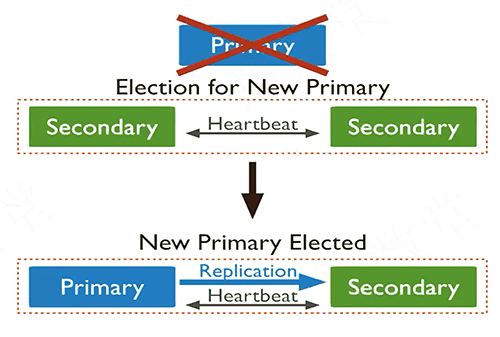

[TOC]

# 1.MongoDB发展概要及版本主要特性

## NoSQL

- NoSQL就是要解决这些当前RDBMS遇到的瓶颈
  - 高可用问题：RDBMS无法实现自动高可用，借助第三方工具但增加风险点。
  - 读写性能瓶颈： 互联网的告诉发展对高并发读写具有强需求，单机无法满足。
  - 海量数据存储： 大数据时代海量数据存储对RDBMS显得力不从心。
  - 需求变更频繁： DDL变更表结构对RDBMS来说性能影响较大。
  - 弹性扩容问题： RDBMS无法方便的根据业务发展进行优雅的扩展。

- 主流NoSQL数据库：
  - MongoDB
  - Cassandra
  - CouchDB
  - Redis
  - Neo4j
  - Hbase

- MongoDB号称NoSQL中最像RDBMS的数据库系统
- percona MongoDB支持hot-back及内存引擎，比较靠谱。

## MongoDB相关术语

| 术语              | 含义                                                 |
| ----------------- | ---------------------------------------------------- |
| replicateSet      | 副本集，指可自动高可用的简单集群                     |
| mongos            | 独立出现时专指mongos集群，也叫分片集群、分布式集群   |
| shard             | 分片，在mongos集群中才有的说法。本质也是一个副本集。 |
| mongos节点        | 专指mongos或分片集群中的路由节点                     |
| chunk             | 指mongos或分片集群中的逻辑存储单元                   |
| balance           | 主要负责mongos集群shard间的数据均衡                  |
| orphaned document | 孤立文档，指shard间数据迁移后，源端尚未删除的文档。  |
|                   |                                                      |

## MongoDB主要版本特性

- 3.0 开始wiredtiger引擎的引入，使锁从库级别降低到行级别（文档级别），自带压缩特性。
- 3.2 开始wiredtiger作为默认引擎，复制协议引入了raft协议，自动高可用切换更加稳定高效。mongos集群中config server 变为副本集模式，支持自动高可用切换。

- 3.4 对于mongos增加集群节点感知功能，节点之间能相互感知对方角色。
- 3.6 逻辑会话，从库一致性读，可重试写等……

- 4.0 引入多文档事务

- 4.2 预计引入分布式事务

## MongoDB版本选择

| 版本 | 关键特性                                                     | 建议     |
| ---- | ------------------------------------------------------------ | -------- |
| 2.x  | index、writeConcern、readPreference                          | 升级     |
| 3.0  | Pluggable Storage Engine、 Wiredtiger、improved mmapv1       | 升级     |
| 3.2  | Raft协议、文档校验、部分索引、inMemory、$lookup              | 建议升级 |
| 3.4  | 并行复制、sharding迁移改进、collation、\$facet、\$graghLookup | 建议使用 |
| 3.6  | 安全、并行性能、$lookup增强、Online维护（在线oplog维护、添加认证） | 建议使用 |
| 4.0  | 多文档事务                                                   | --       |
|      |                                                              |          |

## MongoDB主要特性

- 丰富的索引
- 多文档事务
- 高性能
- 文档化
- 高可用（自动高可用）
- 强压缩
- 分布式
- 一致性

### 丰富的索引类型

- 类型支持

  - 单列、多列索引
  - 多key索引
  - hash索引
  - 地理索引
  - 文本索引

  > 支持对数组建立索引噢

- 索引属性

  - 唯一索引
  - 过期索引
  - 部分索引
  - 稀疏索引

### 文档化

> 底层存储BSON(Binary Serialized Document Notation)，BSON相对于JSON效率高一些，BSON直接用数据类型修改，而不是字符串。
>
> - 数据具有类型，无需都按照字符串处理，数据修改效率高
>
> - 元素头部存储元素长度，可以快速seek，遍历扫描速度快
>
> - 文档模型为field:value (k:v)，value可以是子文档类型进行嵌套文档。

### 高可用

primary故障后自动选举、切换

### 强压缩

- snappy模式略低于Zlib模式，但是压缩比都相当的理想

### 分布式

> | A            | B                        |
> | ------------ | ------------------------ |
> | shard A      | 集群A                    |
> | shard B      | 集群B                    |
> | Collection 1 | 已切分的数据集合（“表”） |
> | Collection 2 | 未切分的数据集合（“表”） |

### 可协调一致性，以及多文档事务

- MongoDB提供Write Concern 及 Read Concern，方便自主选择读写一致性强度
- MongoDB 4.0 提供多文档事务，支持为强一致性业务数据需求听过更可靠的保障

## MongoDB劣势

- 不支持分布式事务。在shard集合写数据一致性上需要加强。

- 对内存使用几乎没有限制，可能导致实例发生OOM

  > 高并发写入时可能出现OOM

- mongos分片集群备份与恢复目前没有相对可靠的工具

- 统计分析类聚合框架(aggregation)使用相对复杂，易出错