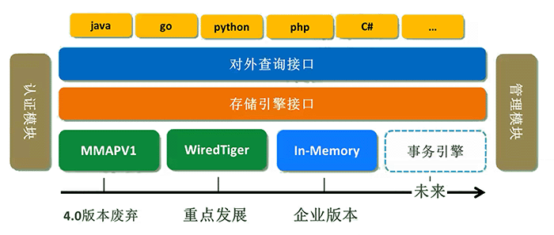
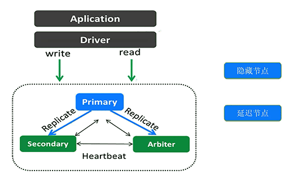
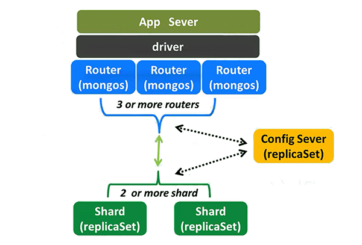

## MongoDB体系结构及架构介绍

- 体系结构

  MongoDB还提供了企业级的加密存储引擎。目前也有第三方存储引擎，如RocksDB。

  

- MongoDB架构使用

  - 单节点：实际上不建议用单点。（可以用副本集）

  - 主从复制：主从复制也不太建议，因为不支持自动高可用。

  - 副本集架构：一主多从副本集架构，推荐。支持自动高可用。

    

  - 分片集群架构

    - 分片集群架构较复杂。
    - mongos通常建议3个，config server 存储集群元数据
    - shard，分片。就是副本集结构，可以是一主多从。

    