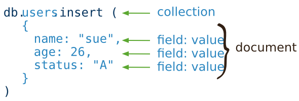
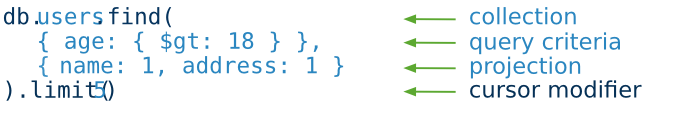
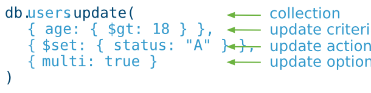
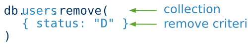

# CRUD操作

[TOC]

## 创建操作

创建或插入操作即向 [*集合 collection*](https://mongoing.com/docs/core/databases-and-collections.html#collections) 添加新的 [*文档 documents*](https://mongoing.com/docs/core/document.html#bson-document-format)。如果插入时集合不存在，插入操作会创建该集合。

MongoDB中提供了以下方法来插入文档到一个集合：

- [`db.collection.insert()`](https://mongoing.com/docs/reference/method/db.collection.insert.html#db.collection.insert)
- [`db.collection.insertOne()`](https://mongoing.com/docs/reference/method/db.collection.insertOne.html#db.collection.insertOne) *New in version 3.2*
- [`db.collection.insertMany()`](https://mongoing.com/docs/reference/method/db.collection.insertMany.html#db.collection.insertMany) *New in version 3.2*

在MongoDB中，插入操作作用于单个 *集合collection* 。MongoDB中所有的写操作在单个 [*集合 document*](https://mongoing.com/docs/core/document.html) 的层级上是 [*原子性*](https://mongoing.com/docs/core/write-operations-atomicity.html)。



示例请查看 [*插入文档*](https://mongoing.com/docs/tutorial/insert-documents.html)。

> ```
> 9999:PRIMARY> use kk
> switched to db kk
> 9999:PRIMARY> db.kk.in
> db.kk.initializeOrderedBulkOp(    db.kk.insert(                     db.kk.insertOne(
> db.kk.initializeUnorderedBulkOp(  db.kk.insertMany(
> 9999:PRIMARY> db.kk.insert({name:['a','b','c','d','e','f','g','h']})
> WriteResult({ "nInserted" : 1 })
> 9999:PRIMARY> db.kk.find()
> { "_id" : ObjectId("5fb76e6b83f5a79e4ae49bc4"), "name" : [ "a", "b", "c", "d", "e", "f", "g", "h" ] }
> 9999:PRIMARY> db.kk.insert({age:[1,2,3,4,5,6,7,8,9,0]})
> WriteResult({ "nInserted" : 1 })
> 9999:PRIMARY> db.kk.find()
> { "_id" : ObjectId("5fb76e6b83f5a79e4ae49bc4"), "name" : [ "a", "b", "c", "d", "e", "f", "g", "h" ] }
> { "_id" : ObjectId("5fb76e8683f5a79e4ae49bc5"), "age" : [ 1, 2, 3, 4, 5, 6, 7, 8, 9, 0 ] }
> 9999:PRIMARY> db.kk.insert({QQ:{wx:['111','bbb','ccc','1sc']}})
> WriteResult({ "nInserted" : 1 })
> 9999:PRIMARY> db.kk.find()
> { "_id" : ObjectId("5fb76e6b83f5a79e4ae49bc4"), "name" : [ "a", "b", "c", "d", "e", "f", "g", "h" ] }
> { "_id" : ObjectId("5fb76e8683f5a79e4ae49bc5"), "age" : [ 1, 2, 3, 4, 5, 6, 7, 8, 9, 0 ] }
> { "_id" : ObjectId("5fb76eb483f5a79e4ae49bc6"), "QQ" : { "wx" : [ "111", "bbb", "ccc", "1sc" ] } }
> 
> ```


## 读操作

读操作获取 [*集合 collection*](https://mongoing.com/docs/core/databases-and-collections.html#collections) 中的 [*文档 documents*](https://mongoing.com/docs/core/document.html#bson-document-format) ;例如查询一个集合中的文档。MongoDB提供了如下方法从集合中读取文档:

- [`db.collection.find()`](https://mongoing.com/docs/reference/method/db.collection.find.html#db.collection.find)

你可以指定 [*条件或者过滤器*](https://mongoing.com/docs/tutorial/query-documents.html#read-operations-query-argument) 找到指定的文档.



示例请查看 [*查询文档*](https://mongoing.com/docs/tutorial/query-documents.html).

> 查询
>
> ```
> db.<dbname>.find()
> db.<dbname>.find({key1:value},{key2:value}).skip(<n>).limit(<n>)
> # skip()
> # limit()
> ```
>
> ```
> 9999:PRIMARY> db.kk.find().skip(1)
> { "_id" : ObjectId("5fb76e8683f5a79e4ae49bc5"), "age" : [ 1, 2, 3, 4, 5, 6, 7, 8, 9, 0 ] }
> { "_id" : ObjectId("5fb76eb483f5a79e4ae49bc6"), "QQ" : { "wx" : [ "111", "bbb", "ccc", "1sc" ] } }
> 9999:PRIMARY> db.kk.find().skip(3)
> 9999:PRIMARY> db.kk.find().skip(2)
> { "_id" : ObjectId("5fb76eb483f5a79e4ae49bc6"), "QQ" : { "wx" : [ "111", "bbb", "ccc", "1sc" ] } }
> 9999:PRIMARY> db.kk.find().skip()
> { "_id" : ObjectId("5fb76e6b83f5a79e4ae49bc4"), "name" : [ "a", "b", "c", "d", "e", "f", "g", "h" ] }
> { "_id" : ObjectId("5fb76e8683f5a79e4ae49bc5"), "age" : [ 1, 2, 3, 4, 5, 6, 7, 8, 9, 0 ] }
> { "_id" : ObjectId("5fb76eb483f5a79e4ae49bc6"), "QQ" : { "wx" : [ "111", "bbb", "ccc", "1sc" ] } }
> 9999:PRIMARY> db.kk.find().skip().limit(1)
> { "_id" : ObjectId("5fb76e6b83f5a79e4ae49bc4"), "name" : [ "a", "b", "c", "d", "e", "f", "g", "h" ] }
> 
> ```
>
> - find()不加参数是全表查询
>
>   - 但是默认的，不会一次迭代全部数据，默认一次迭代20条数据
>
>   ```
>   9999:PRIMARY> db.kk.find().count()
>   33
>   9999:PRIMARY> db.kk.find()
>   ...
>   { "_id" : ObjectId("5fb76f9c83f5a79e4ae49bd6"), "line19" : "" }
>   { "_id" : ObjectId("5fb76f9c83f5a79e4ae49bd7"), "line20" : "" }
>   Type "it" for more
>   9999:PRIMARY> it
>   { "_id" : ObjectId("5fb76f9c83f5a79e4ae49bd8"), "line21" : "" }
>   ...
>   { "_id" : ObjectId("5fb7704783f5a79e4ae49beb"), "line40" : "" }
>   Type "it" for more
>   9999:PRIMARY> it
>   { "_id" : ObjectId("5fb7704783f5a79e4ae49bec"), "line41" : "" }
>   ...
>   ...
>   ```


## 更新操作

更新操作修改 [*集合 collection*](https://mongoing.com/docs/core/databases-and-collections.html#collections) 中已经存在的 [*文档 documents*](https://mongoing.com/docs/core/document.html#bson-document-format)。MongoDB提供了以下方法去更新集合中的文档:

- [`db.collection.update()`](https://mongoing.com/docs/reference/method/db.collection.update.html#db.collection.update)
- [`db.collection.updateOne()`](https://mongoing.com/docs/reference/method/db.collection.updateOne.html#db.collection.updateOne) *New in version 3.2*
- method:db.collection.updateMany() *New in version 3.2*
- [`db.collection.replaceOne()`](https://mongoing.com/docs/reference/method/db.collection.replaceOne.html#db.collection.replaceOne) *New in version 3.2*

在MongoDB中,更新操作作用于单个集合。MongoDB中所有的写操作在单个 [*文档 document*](https://mongoing.com/docs/core/document.html) 层级上是 [*原子性的*](https://mongoing.com/docs/core/write-operations-atomicity.html).

你可以指定条件或过滤器来找到要更新的文档。这些 [*过滤器*](https://mongoing.com/docs/core/document.html#document-query-filter) 的使用与读操作一样的语法。



示例请查看 [*更新文档*](https://mongoing.com/docs/tutorial/update-documents.html).


## 删除操作

删除是从一个集合中删除文档的操作。MongoDB提供下列方法从集合删除文档。

- db.collection.remove()
- db.collection.deleteOne()
- db.collection.deleteMany()

在MongoDB中。删除作作用于单个集合。MongoDB中所有的写操作在单个 [*文档 document*](https://mongoing.com/docs/core/document.html) 层级上是 [*原子性的*](https://mongoing.com/docs/core/write-operations-atomicity.html)。

你可以指定条件或过滤器来找到要删除的文档。这些 [*过滤器*](https://mongoing.com/docs/core/document.html#document-query-filter) 的使用与读操作一样的语法。



示例请查看 [*删除文档*](https://mongoing.com/docs/tutorial/remove-documents.html)。


> - 删除
>
>   ```
>   9999:PRIMARY> db.kk.insert({wx:"123"})
>   WriteResult({ "nInserted" : 1 })
>   9999:PRIMARY> db.kk.find().skip(49)
>   { "_id" : ObjectId("5fb7704783f5a79e4ae49bf5"), "line50" : "" }
>   { "_id" : ObjectId("5fb7704783f5a79e4ae49bf6"), "line51" : "" }
>   { "_id" : ObjectId("5fb7704783f5a79e4ae49bf7"), "line52" : "" }
>   { "_id" : ObjectId("5fb7704883f5a79e4ae49bf8"), "line53" : "" }
>   { "_id" : ObjectId("5fb771a183f5a79e4ae49bfa"), "wx" : "123" }
>   
>   # 删除条件数据类型不匹配时，删不掉要删掉的东西
>   9999:PRIMARY> db.kk.deleteOne({wx:123})  
>   { "acknowledged" : true, "deletedCount" : 0 }
>   9999:PRIMARY> db.kk.find().skip(49)
>   { "_id" : ObjectId("5fb7704783f5a79e4ae49bf5"), "line50" : "" }
>   { "_id" : ObjectId("5fb7704783f5a79e4ae49bf6"), "line51" : "" }
>   { "_id" : ObjectId("5fb7704783f5a79e4ae49bf7"), "line52" : "" }
>   { "_id" : ObjectId("5fb7704883f5a79e4ae49bf8"), "line53" : "" }
>   { "_id" : ObjectId("5fb771a183f5a79e4ae49bfa"), "wx" : "123" }
>   
>   9999:PRIMARY> db.kk.deleteOne({wx:"123"})
>   { "acknowledged" : true, "deletedCount" : 1 }
>   9999:PRIMARY> db.kk.find().skip(49)
>   { "_id" : ObjectId("5fb7704783f5a79e4ae49bf5"), "line50" : "" }
>   { "_id" : ObjectId("5fb7704783f5a79e4ae49bf6"), "line51" : "" }
>   { "_id" : ObjectId("5fb7704783f5a79e4ae49bf7"), "line52" : "" }
>   { "_id" : ObjectId("5fb7704883f5a79e4ae49bf8"), "line53" : "" }
>   
>   
>   9999:PRIMARY> db.kk.deleteOne({line53:""})
>   { "acknowledged" : true, "deletedCount" : 1 }
>   9999:PRIMARY> db.kk.find().skip(49)
>   { "_id" : ObjectId("5fb7704783f5a79e4ae49bf5"), "line50" : "" }
>   { "_id" : ObjectId("5fb7704783f5a79e4ae49bf6"), "line51" : "" }
>   { "_id" : ObjectId("5fb7704783f5a79e4ae49bf7"), "line52" : "" }
>   { "_id" : ObjectId("5fb771a183f5a79e4ae49bfa"), "wx" : "123" }
>   
>   
>   9999:PRIMARY> db.kk.count()
>   78
>   9999:PRIMARY> db.kk.deleteMany({line53:""})
>   { "acknowledged" : true, "deletedCount" : 24 }
>   
>   
>   9999:PRIMARY> db.kk.count()
>   79
>   9999:PRIMARY> db.kk.deleteOne({line53:""})
>   { "acknowledged" : true, "deletedCount" : 1 }
>   
>   ```
>
>   


## 批量写入

MongoDB提供批量写操作的能力。细节请参考：[*Bulk Write Operations*](https://mongoing.com/docs/core/bulk-write-operations.html)。


# 库、集合的创建&删除

- 创建库及集合（插入便创建collection，创建了collection便创建了dbs）

  ```
  use test
  db.createCollection("person")
  ```

  或

  ```
  use test
  db.person.insert({name:"kk"})
  ```

- 删除库、集合

  ```
  use test
  db.dropDatabase()
  #
  use test
  db.test.drop()
  ```

- 创建固定大小、固定文档数的集合

  ```
  db.createCollection("<collection_name>",{"capped":true,size:1024,max:100})
  ```

  

- 创建视图(view)

  ```
  db.createView(
  "<view_name>",
  "<source_collection_name>",
  [ { $project:{"name":"<$name>"} } ]
  )
  ```

  

