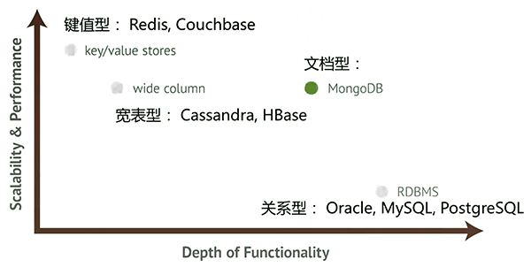
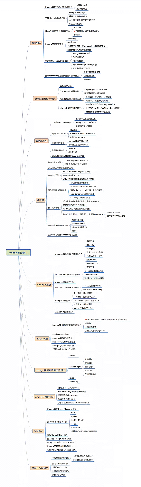

可能能达到初中级MongoDB DBA。

- 性能层面弱于KV型NoSQL
- 功能复杂层面弱于RDBMS
- 是最像rdbms的NoSQL

# 快速入门法则

- 学学js基础语法，可以找 javascript菜鸟教程 和 MongoDB权威指南

  > MongoDB CLI 是js引擎实现的。

- 可以多看看MongoDB中文社区、官方文档

# 学习环境

CentOS 6.x | 1~8C | 4~8G | 50G+ , 数据根目录 /data1

MongoDB 3.4\ MongoDB 3.6(binary)， 可以同时装两个版本

Python 3.6 及pymongo驱动

# 大纲

1. MongoDB 基础知识
2. 使用规范及设计模式
3. 数据库安全相关
4. MongoDB副本集
5. Mongos集群
6. 备份与恢复
7. Mongo存储引擎原理与调优
8. GridFS与聚合框架
9. MongoDB查询优化
10. 故障分析与调试

