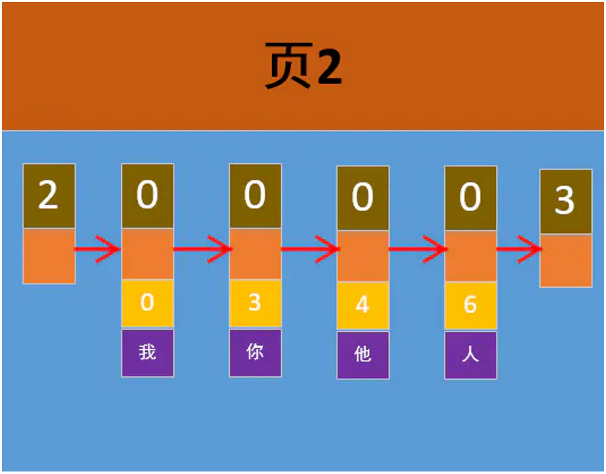
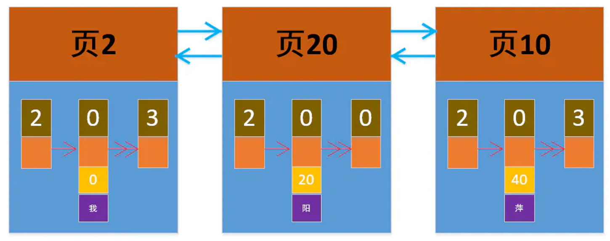
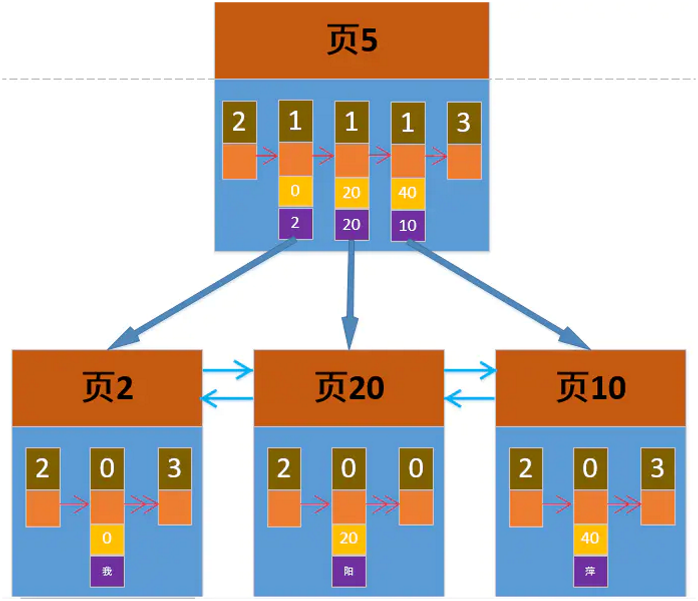
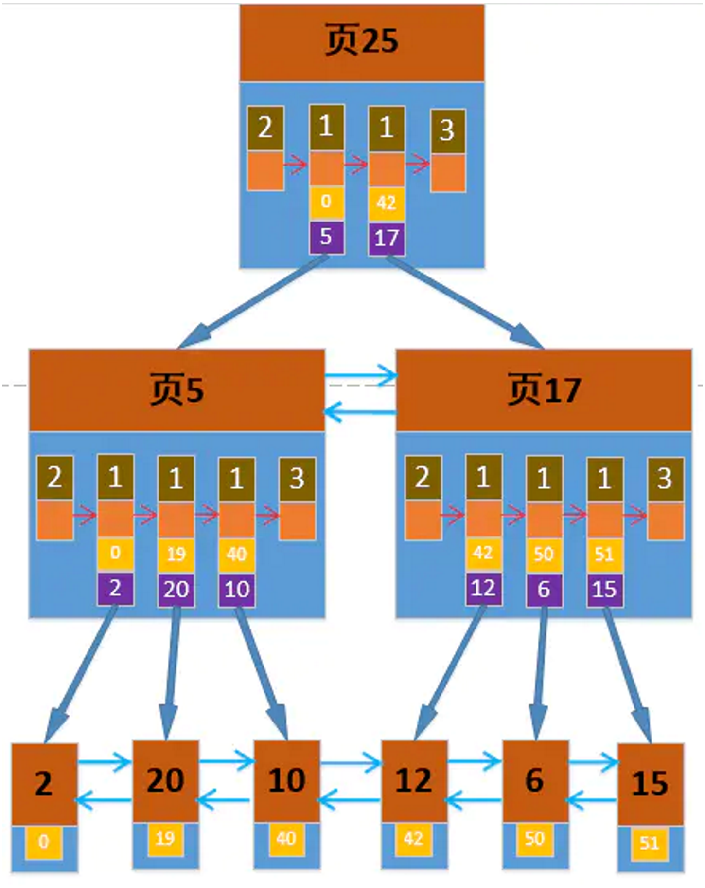

已剪辑自: https://www.jianshu.com/p/c4d4497154db

# 前言

最近在学MySQL，决定记录一下，能写多少写多少，不定时更新，加油。

# 正文

分几个部分来吧，大致如下：

- 字符集与比较规则
- 行格式与数据页
- InnoDB索引
- 访问方法与连接
- explain 与 子查询优化
- redo 与 undo 日志
- MVCC 与 锁

本文为第三部分 InnoDB索引

查询一条记录分两步：

- 定位到记录所在页
- 定位到记录的页内位置

前面我们说到记录页会根据File Header中的FIL_PAGE_PREV与FIL_PAGE_NEXT 组成一个双向链表，而每页内的所有正式记录会根据Record Header中的next_record属性组成一个单链表。
 基于这种页内布局，页内查询通过分组与二分定槽的方式实现了第二步，那么有个很明显的问题，第一步中怎么定位到记录在哪个页面呢？

页内是二分查找，lgN的时间复杂度令人羡慕，那么页面之间的搜索是不是也可以使用呢？
 索引就出现了

 

 

在说索引之前，我们需要明确几个概念

- 所有的数据页组成了一个双向链表，这个双向链表从头结点到尾结点，是按主键排序的。这意味着如果主键不是自增，那么很有可能需要页分裂操作。
- 每个数据页（16KB）能放的记录是有限的
- 数据页页号的分配是随机的

#### *索引的实现*

- 数据页中有个属性Page Directory，存着每组最大记录的偏移地址，才能实现页内二分。那么在页面之间要想这么玩，也需要一个页目录 
- 那么这个页目录存哪呢？答案是存在页面中，页目录需要实现两点：

 

1. 记录页号与主键值的对应关系（至于为什么是主键后面我们再说）
2. 页内记录按主键排序，按主键排序才能二分查找啊啊啊~~

画几个图看看

单个数据页

1. 最上面的是页号，图中是2号页面
2. 下面记录的第一个值是记录头Record Header中的Record Type 
3. 中间下面的 0、3、4、6是主键值，表示按主键排序
4. 记录之间的箭头表示了单链表
5. 图中只画了四条真正记录，实际可以存很多条

当我们数据很多的时候就会有很多页，可能长这个样子(精简版)

多个数据页

1. 页内记录只留了一条，这里约定：展示的是主键最小的那条
2. 页面之间的双向箭头表示这些数据页之间组成的双向链表

现在我们要加个页目录，看看长什么样子

 

页目录

1. 页目录也是一种数据页，也有记录数量限制哦
2. 目录项的记录类型为1
3. 记录了页号与对应页内的最小主键值
4. 按主键值大小排序

那么如果一个目录项最多放三条目录，而有六页数据怎么办？
 加个目录项？
 对，加。
 可是这样一来，就有两个目录项了，又会碰到之前的问题，这两个目录项如何定位到哪个呢？要知道现实应用中，数据上亿都是轻轻松松的，那目录项就会很多，通过遍历目录项来查询显然不可取。
 那么往上面再套一层吧，类似这样：

 

多级目录项

- 最下面一层只记录了最小主键值
- 目录项都是完整的
- 应该不用解释了吧

上面这个东西，像不像一颗树，就叫它B+树吧，最下面一层是叶子节点，其他的都是非叶子节点。
 啥？你说不像？

 

 

- 上面这些页目录所在页 大名目录项，小名索引
             

 

这里注意一下，前面我们说页面有很多类型，这个目录项与数据页是同一种类型，故也称索引页(0x45BF)

#### *InnoDB**索引类型之聚簇索引*

- InnoDB索引的底层实现是B+树，即每个索引都是一颗树
- 其数据都存放在叶子结点中，索引存在非叶子结点中
- 我们将这种索引即数据，数据即索引的索引称为聚簇索引
- 聚簇索引在我们建表时由MySQL自动创建

#### *InnoDB**索引类型之二级索引*

##### 很明显，索引不止一个聚簇索引，比如我们可以手动为某列或某些列添加索引，这种由我们手动创建的索引就称为二级索引。

- 二级索引也是一颗B+树
- 叶子节点包含索引列与主键的映射关系
- 非叶子节点包含索引列、主键列和页号。

我们知道聚簇索引的非叶子节点中只有主键列与页号，为什么二级索引的非叶子节点也要主键列? 只通过索引列不就可以定位到哪个页面了吗?原因在于二级索引不是唯一的，Unique修饰的列也有多个null的情况。可以想一想，如果不加主键列，是否还能维护二级索引的唯一排序方式？比如插入两条二级索引列一致的记录时，二级索引如何确定目录项插入位置。

关于索引额外提几点

- 性能方能，假设数据页只能存100条记录,目录项只能存放1000条记录,当B+树达到三层时，其可以存放100 * 1000 * 1000, 轻轻松松就达到了亿级存储，而实际情况肯定不止存这么点，性能杠杠的~
- 二级索引的叶子节点存储的是索引列与主键值，根据查询条件找到主键值后需要去聚簇索引中回表获取完整记录
- 聚簇索引根节点万年不挪窝

暂时就这么多吧，想起来再补，碎觉~