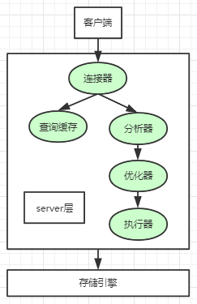
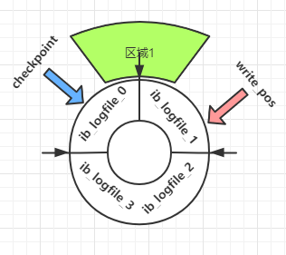
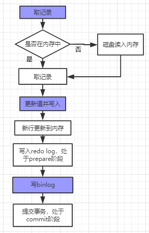

**MySQL Update语句是怎么执行的？
**

//


  最近在极客时间看丁奇大佬的《MySQL45讲》，真心觉得讲的不错，把其中获得的一些MySQL方向的经验整理整理分享给大家，有兴趣同学可以购买相关课程进行学习。

  今天分享的内容是update的执行流程。


01

**redo log和binlog**


话不多说，把昨天的神图先搬过来镇楼(自己画的)。



  昨天，我们利用这张图，了解了一个select语句的执行过程，讲解了连接器、查询缓存、分析器、优化器、执行器等模块的作用，今天我们来看一条update语句是怎么执行的。

  其实，update语句的执行过程和select语句差不多，但是在update语句执行的过程中，MySQL新增加了两个重要的日志模块，他们分别是**redo log**(重做日志)和**binlog**（二进制日志、也可以称之为归档日志）。

关于redo log，之前我们在文章中也有讲过，欢迎翻看：

*《[Mysql中的Redo Log解析(一)](http://mp.weixin.qq.com/s?__biz=MzUyNjkzNjQwMQ==&mid=2247485213&idx=1&sn=ac804a11d6740324cf5d83dd882517b4&chksm=fa067723cd71fe3511b5114816e6a4dae38aca2071300093f84ab7a34bf2f21668fd1e0416f6&scene=21#wechat_redirect)》*

*《[Mysql中的Redo Log解析(二)](http://mp.weixin.qq.com/s?__biz=MzUyNjkzNjQwMQ==&mid=2247485217&idx=1&sn=e803371eec28b59a73461aab26aed8d2&chksm=fa06771fcd71fe094bfbe11ee07ca3033495eb60fe7500f81f3037fa6715c86b5ed0adfcf650&scene=21#wechat_redirect)》*

*《[MySQL中的Redo Log(三)](http://mp.weixin.qq.com/s?__biz=MzUyNjkzNjQwMQ==&mid=2247485684&idx=1&sn=35e82717e3420c2dfe43f674c439a9f0&chksm=fa0678cacd71f1dcf23b00950b67eaceb39e3d3b1fd96c3ac4b858b28b56c0c208c88ecfe762&scene=21#wechat_redirect)》*

 我们知道，Innodb存储引擎中，内存和磁盘是通过数据页进行交换的，而内存的处理速度远远超过磁盘处理速度，当我们update操作的时候，需要访问数据页，如果每次访问数据页的时候，都和磁盘进行交互，那么无疑是非常耗时的。**redo log的出现就是为了解决这个问题**，**redo log既存在于内存中，又存在于磁盘中**，当我们update一条记录的时候，Innodb会先把记录写在redo log中，然后告诉客户端更新完毕了，但其实redo log并没有落在磁盘上，落磁盘的动作是由MySQL在空闲时候处理的，这样能够最大程度上保证MySQL的性能。

 磁盘上的redo log通常都是一组文件，可以通过参数 innodb_log_files_in_group来控制，默认值是2，也就是组里面有2个ib_logfile文件，如下：

```
mysql> show variables like "%_in_group%";
+-----------------------------------------+-------+
| Variable_name                           | Value |
+-----------------------------------------+-------+
| innodb_log_files_in_group               | 2     |
+-----------------------------------------+-------+
1 rows in set, 1 warning (0.00 sec)
```

我们假设redo log的组里面有4个文件，那么，redo log的示意图应该是下面这样：



不难发现，我们这4个redo log文件首尾相连，组成了日志文件组，在实际使用过程中，磁盘上的redo log文件，也是循环利用的，当我们写满ib_logfile3的时候，redo log就又从ib_logfile0的开头开始写了。

图中，

**write_pos是当前redo log写的位置；**

**checkpoint是redo log擦除的位置；**

**"区域1"部分，也就是checkpoint和write_pos中间的部分，它是写满redo log的部分；**

**"区域1"以外的部分，也就是write_pos和checkpoint之间的部分，它是redo log日志文件空余的部分。**

**当write_pos追上checkpoint的时候，就说明整个redo log被写满了，此时需要将checkpoint推进一下，保证有可用空间，推进的过程，其实就是提交事务。可以通俗理解为：**

**write_pos向前移动：正在刷盘**

**checkpoint向前移动：事务提交**


redo日志的内容大概就这么多，这里需要记住一句话：

有了redo log，InnoDB就可以保证即使数据库发生异常重启，之前提交的记录都不会丢失，这个能力称为crash-safe

接下来我们来看binlog，binlog记录的是MySQL数据库对于数据记录的增删改操作，这里，强调一下redo log和binlog的三点不同之处：

1、redo log是innodb存储引擎层面特有的，binlog是Server层面的，任何引擎都能用！！！

2、redo log是物理日志，记录的是在这个页面上做了什么修改,例如把比特位从0改为1；binlog是逻辑日志，记录的是对某个字段的变更，例如给字段id加1。

3、redo log是循环写的，空间固定；binlog是追加写的，写满之后会切换到下一个，不会覆盖


02

update操作究竟做了什么？


  当我们执行一个update的SQL时，MySQL会干如下几件事情：

a、执行器查找指定记录，如果记录所在的数据页在内存中，就直接返回给执行器；否则，需要先从磁盘读入内存，然后再返回。

b、执行器拿到Innodb存储引擎接口给的数据，执行update操作，得到新的数据，然后调用Innodb存储引擎的接口写入数据。

c、innodb存储引擎将这行新数据更新到内存中，同时将这个更新操作记录到redo log里面，此时redo log处于prepare状态。然后告知执行器执行完成了，随时可以提交事务。

d、执行器生成update操作的binlog，并把binlog写入磁盘。

e、执行器调用引擎的提交事务接口，引擎把刚刚写入的redo log改成提交（commit）状态，更新完成。

在这个过程中，MySQL server端的执行器和innodb存储引擎频繁进行交互，画成流程图就是：


其中，涂蓝色的是在Server层面执行的，白色框代表在Innodb层面执行的。

这里，我们注意最后3个步骤，其中，redo log的写入分为2个步骤，第一个步骤时prepare阶段，第二个步骤时commit，这就是我们常说的redo log"两阶段提交".



03

两阶段提交是如何保证数据一致的？


  我们知道，redo log结合binlog，**可以保证在实例宕机或者误操作的情况下恢复出来的数据一致，也可以让我们将数据库恢复到历史的"任意一秒"。**本质上，这个能力也是基于"两阶段提交"的。那么，接下来的过程，就是如何保证redo log恢复出来的结果和binlog恢复出来的结果一致了。

  先来看看如果不用"两阶段提交"的方法，会发生什么问题。在没有"两阶段提交"的情况下，如果我们要将id=0改为id=1，那么MySQL只有两种情况，先写binlog 再写redo，或者先写redo再写binlog，分别来看：

1、先写binlog再写redo，binlog完成之后，服务器crash了，binlog中id=1了，但是由于redo log没有写，在服务器恢复的时候，恢复出来的值是0，但是我们用binlog恢复出来的值将会变成1，二者产生了不一致的现象；

2、先写redo log，再写binlog，假设redo log写完之后MySQL崩溃重启，仍然能够把数据恢复回来，所以恢复后这一行c的值是1，但是由于没有写入binlog， 那么使用binlog恢复出来的值就是0，和实际结果不符。

  一般情况下，当我们出现误操作时，大概率会使用全量备份+binlog的方式恢复数据，而如果此时使用binlog恢复出来的数据有误，那无疑会对业务产生影响。


有了"两阶段提交"，我们把整个过程拆分为三个部分：

1、prepare阶段 

2、 写binlog 

3 、commit

当实例宕机后，恢复的过程如下：

情况1：当在2之前崩溃时
重启恢复：后发现没有commit，回滚。

备份恢复：没有binlog 。
重启恢复和备份恢复一致
情况2：当在3之前崩溃
重启恢复：虽没有commit，但满足prepare和binlog完整，所以重启后会自动commit。

备份恢复：有binlog.

重启恢复和备份恢复一致