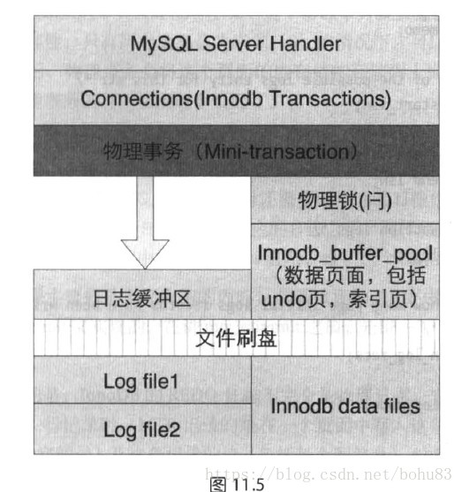

## 一 序

​    本文根据《MYSQL运维内参》第11章INNODB日志管理机制整理，本篇书上侧重于原理说明日志的生成、格式、工作原理、刷盘机制等。限于篇幅，崩溃恢复的需要单独整理。InnoDB 有两块非常重要的日志，一个是undo log，另外一个是redo  log，前者用来保证事务的原子性以及InnoDB的MVCC，后者用来保证事务的持久性。解释下redolog与事务持久性：redo  log用来数据异常恢复和数据库重启时页数据同步恢复，redo log是建立在在mini  transaction基础上。数据库在执行事务时，通过minitransaction产生redo log来保证事务的持久性。

   和大多数关系型数据库一样，InnoDB记录了对数据文件的物理更改，并保证总是日志先行，也就是所谓的WAL(log write ahead)，即在持久化数据文件前，保证之前的redo日志已经写到磁盘。

   LSN(log sequence number) 用于记录日志序号，它是一个不断递增的 unsigned long long  类型整数。在 InnoDB 的日志系统中，LSN  无处不在，它既用于表示修改脏页时的日志序号，也用于记录checkpoint，通过LSN，可以具体的定位到其在redo  log文件中的位置。LSN在引擎中定义的是一个dulint_t类型值。源码在innobase/include/log0log.h

```
/* Type used for all log sequence number storage and arithmetics */


typedef	ib_uint64_t		lsn_t;
```

 LSN的含义是储存引擎向重做日志系统写入的日志量（字节数），这个日志量包括写入的日志字节 + LOG_BLOCK_HDR_SIZE +  LOG_BLOCK_TRL_SIZE;代码参见函数log_write_low（源码在innobase/log/log0log.cc）。在调用日志写入函数LSN就一直随着写入的日志长度增加，它是一个集物理意义与逻辑意义与一体的。    

   为了管理脏页，在 Buffer Pool 的每个instance上都维持了一个flush list，flush list 上的 page 按照修改这些 page 的LSN号进行排序。因此定期做redo checkpoint点时，选择的 LSN 总是所有 bp  instance 的 flush list 上最老的那个page（拥有最小的LSN）。由于采用WAL的策略，每次事务提交时需要持久化 redo  log 才能保证事务不丢。而延迟刷脏页则起到了合并多次修改的效果，避免频繁写数据文件造成的性能问题。
     innodb在5.6设计了3个层模块，即redo log buffer（redo log的日志内存缓冲区）、group  files( redo log文件组)和archive files( 归档日志文件)。由于 InnoDB  日志组的特性已经被废弃（redo日志写多份），归档日志(archive log)特性也在5.7被彻底移除，所以不做展开。

好吧，虽然上面都是常识，但是对于初次接触的还是要理解下。因为百度出来的文章不一定是基于那个版本。

## 二 InnoDB 日志文件

  InnoDB的redo  log可以通过参数innodb_log_files_in_group配置成多个文件，另外一个参数innodb_log_file_size表示每个文件的大小。因此总的redo log大小为innodb_log_files_in_group * innodb_log_file_size。
   Redo log文件以ib_logfile[number]命名，日志目录可以通过参数innodb_log_group_home_dir控制。Redo log 以顺序的方式写入文件文件，写满时则回溯到第一个文件，进行覆盖写


   在InnoDB内部，逻辑上ib_logfile被当成了一个文件，对应同一个space id。由于是使用512字节block对齐写入文件，可以很方便的根据全局维护的LSN号计算出要写入到哪一个文件以及对应的偏移量。
     Redo log文件是循环写入的，在覆盖写之前，总是要保证对应的脏页已经刷到了磁盘。在非常大的负载下，Redo  log可能产生的速度非常快，导致频繁的刷脏操作，进而导致性能下降，通常在未做checkpoint的日志超过文件总大小的76%之后，InnoDB  认为这可能是个不安全的点，会强制的preflush脏页，导致大量用户线程stall住。

  除了redo log文件外，InnoDB还有其他的日志文件，例如为了保证truncate操作而产生的中间日志文件，包括  truncate innodb 表以及truncate undo log  tablespace，都会产生一个中间文件，来标识这些操作是成功还是失败，如果truncate没有完成，则需要在 crash recovery  时进行重做。

### Log Block

  innodb在日志系统里面定义了log block的概念，其实log block就是一个512字节的数据块，这个数据块包括块头、日志信息和块的checksum.其结构如下：


​    如果每个页中产生的重做日志数量大于512字节，那么需要分割多个重做日志块进行存储，此外，由于重做日志快的大小和磁盘扇区大小一样，都是512字节，因此重做日志的写入可以保证原子性，重做日志快除了日志本身之外，还由日志块头(log block header)及日志块尾(log block  tailer)两部分组成。重做日志头一共占用12字节，重做日志尾占用4字节。故每个重做日志块实际可以存储的大小为496字节(512-12-4)。

   Block no  的最高位是描述block是否flush磁盘的标识位.通过lsn可以blockno,具体的计算过程是lsn是多少个512的整数倍，也就是no =  lsn / 512 +  1;为什么要加1呢，因为所处no的块算成clac_lsn一定会小于传入的lsn.所以要+1。其实就是block的数组索引值。 

  LOG_BLOCK_HDR_DATA_LEN  2个字节，表示当前页面存储日志的长度，通常是满的0X200，因为日志在相连的块上市连续存储的，中间不会有空闲空间，如果不满表示日志已经扫描完成（crash recovery的工作 ）。

 LOG_BLOCK_FIRST_REC_GROUP 占用2个字节，表示log  block中第一个日志所在的偏移量。如果该值的大小和LOG_BLOCK_HDR_DATA_LEN相同，则表示当前log  block不包含新的日志。如事务T1的重做日志1占用762字节，事务T2的重做日志占用100字节，。由于每个log  block实际只能保存492字节，因此其在log buffer的情况应该如图所示


LOG_BLOCK_CHECKPOINT_NO 占用4字节，表示该log block最后被写入时的检查点第4字节的值。

源码在innobase/include/log0log.h

```
/* Offsets of a log block header */


#define	LOG_BLOCK_HDR_NO	0	/* block number which must be > 0 and


					is allowed to wrap around at 2G; the


					highest bit is set to 1 if this is the


					first log block in a log flush write


					segment */


#define LOG_BLOCK_FLUSH_BIT_MASK 0x80000000UL


					/* mask used to get the highest bit in


					the preceding field */


#define	LOG_BLOCK_HDR_DATA_LEN	4	/* number of bytes of log written to


					this block */


#define	LOG_BLOCK_FIRST_REC_GROUP 6	/* offset of the first start of an


					mtr log record group in this log block,


					0 if none; if the value is the same


					as LOG_BLOCK_HDR_DATA_LEN, it means


					that the first rec group has not yet


					been catenated to this log block, but


					if it will, it will start at this


					offset; an archive recovery can


					start parsing the log records starting


					from this offset in this log block,


					if value not 0 */


#define LOG_BLOCK_CHECKPOINT_NO	8	/* 4 lower bytes of the value of


					log_sys->next_checkpoint_no when the


					log block was last written to: if the


					block has not yet been written full,


					this value is only updated before a


					log buffer flush */


#define LOG_BLOCK_HDR_SIZE	12	/* size of the log block header in


					bytes */


 


/* Offsets of a log block trailer from the end of the block */


#define	LOG_BLOCK_CHECKSUM	4	/* 4 byte checksum of the log block


					contents; in InnoDB versions


					< 3.23.52 this did not contain the


					checksum but the same value as


					.._HDR_NO */


#define	LOG_BLOCK_TRL_SIZE	4	/* trailer size in bytes */
```

### checkpoint


    checkpoint是日志的检查点，其作用就是在数据库异常后，redo  log是从这个点的信息获取到LSN,并对检查点以后的日志和PAGE做重做恢复。那么检查点是怎么生成的呢？当日志缓冲区写入的日志LSN距离上一次生成检查点的LSN达到一定差距的时候，就会开始创建检查点，创建检查点首先会将内存中的表的脏数据写入到硬盘，让后再将redo log  buffer中小于本次检查点的LSN的日志也写入硬盘。在log_group_t中的checkpoint_buf，以下是它对应字段的解释:

 LOG_CHECKPOINT_NO       checkpoint序号，

 LOG_CHECKPOINT_LSN      本次checkpoint起始的LSN

 LOG_CHECKPOINT_OFFSET     本次checkpoint相对group file的起始偏移量

 LOG_CHECKPOINT_LOG_BUF_SIZE  redo log buffer的大小，默认2M

 LOG_CHECKPOINT_ARCHIVED_LSN  当前日志归档的LSN

 LOG_CHECKPOINT_GROUP_ARRAY  每个log group归档时的文件序号和偏移量,是一个数组

​    关于checkpoint的作用：因为日志文件不是无限大的。前面也提到过写入日志是循环的，如果日志头尾相遇日志就不完整了。所以引入了checkpoint机制。检查点的保证数据库完整的主体思想，是想让日志失效，因为日志的作用就是让buffer pool的page尽量少的刷磁盘，尽可能长的把页面缓存起来，提高访问速度。buffer  pool的page是最新的，只是不一定写入磁盘中。如果日志文件不够用了，只需要将buffer  pool的部分page写入磁盘，其对应的日志就无效了。因为日志作用就是保证page没有刷入时但数据库挂了的情况下保证数据库的完整性的。

## 三 MTR

​    Innodb存储引擎中的一个很重要的用来保证持久性的机制就是mini事务，在源码中用mtr（Mini-transaction）来表示，本书把它称做“物理事务”，这样叫是相对逻辑事务而言的，对于逻辑事务，做熟悉数据库的人都很清楚，它是数据库区别于文件系统的最重要特性之一，它具有四个特性ACID，用来保证数据库的完整性——要么都做修改，要么什么都没有做。物理事务从名字来看，是物理的，因为在innodb存储引擎中，只要是涉及到文件修改，文件读取等物理操作的，都离不开这个物理事务，可以说物理事务是内存与文件之间的一个桥梁。



   前面已经介绍过innodb的页面缓冲区系统，已经知道在访问一个文件页面的时候，系统都会将要访问的页面载入到页面缓冲区中，然后才可以访问这个页面，此时可以读取或者更新这个页面，在再次将更新写入到文件中之前，这个页面都会处理缓冲区中。在这个过程中，有一个机制一直扮演着很重要的角色，那就是物理事务。

### 3.1 结构


   物理事务既然被称为事务，那它同样有事务的开始与提交，在innodb中，物理事务的开始其实就是对物理事务的结构体mtr_t的初始化，其中包括下面一些成员：源码在/innobase/include/mtr0mtr.h

```cpp
/** Mini-transaction handle and buffer */


struct mtr_t {


 


	/** State variables of the mtr */


	struct Impl {


 


		/** memo stack for locks etc. */


		mtr_buf_t	m_memo;


 


		/** mini-transaction log */


		mtr_buf_t	m_log;


 


		/** true if mtr has made at least one buffer pool page dirty */


		bool		m_made_dirty;


 


		/** true if inside ibuf changes */


		bool		m_inside_ibuf;


 


		/** true if the mini-transaction modified buffer pool pages */


		bool		m_modifications;


 


		/** Count of how many page initial log records have been


		written to the mtr log */


		ib_uint32_t	m_n_log_recs;


 


		/** specifies which operations should be logged; default


		value MTR_LOG_ALL */


		mtr_log_t	m_log_mode;


#ifdef UNIV_DEBUG


		/** Persistent user tablespace associated with the


		mini-transaction, or 0 (TRX_SYS_SPACE) if none yet */


		ulint		m_user_space_id;


#endif /* UNIV_DEBUG */


		/** User tablespace that is being modified by the


		mini-transaction */


		fil_space_t*	m_user_space;


		/** Undo tablespace that is being modified by the


		mini-transaction */


		fil_space_t*	m_undo_space;


		/** System tablespace if it is being modified by the


		mini-transaction */


		fil_space_t*	m_sys_space;


 


		/** State of the transaction */


		mtr_state_t	m_state;


 


		/** Flush Observer */


		FlushObserver*	m_flush_observer;


 


#ifdef UNIV_DEBUG


		/** For checking corruption. */


		ulint		m_magic_n;


#endif /* UNIV_DEBUG */


 


		/** Owning mini-transaction */


		mtr_t*		m_mtr;


	};
```

| 变量名                    | 描述                                                         |
| ------------------------- | ------------------------------------------------------------ |
| mtr_buf_t m_memo          | 用于存储该mtr持有的锁类型                                    |
| mtr_buf_t m_log           | 存储redo log记录                                             |
| bool m_made_dirty         | 是否产生了至少一个脏页                                       |
| bool m_inside_ibuf        | 是否在操作change buffer                                      |
| bool m_modifications      | 是否修改了buffer pool page                                   |
| ib_uint32_t m_n_log_recs  | 该mtr log记录个数                                            |
| mtr_log_t m_log_mode      | Mtr的工作模式，包括四种：  MTR_LOG_ALL：默认模式，记录所有会修改磁盘数据的操作；MTR_LOG_NONE：不记录redo，脏页也不放到flush  list上；MTR_LOG_NO_REDO：不记录redo，但脏页放到flush  list上；MTR_LOG_SHORT_INSERTS：插入记录操作REDO，在将记录从一个page拷贝到另外一个新建的page时用到，此时忽略写索引信息到redo log中。（参阅函数page_cur_insert_rec_write_log） |
| fil_space_t* m_user_space | 当前mtr修改的用户表空间                                      |
| fil_space_t* m_undo_space | 当前mtr修改的undo表空间                                      |
| fil_space_t* m_sys_space  | 当前mtr修改的系统表空间                                      |
| mtr_state_t m_state       | 包含四种状态: MTR_STATE_INIT、MTR_STATE_COMMITTING、 MTR_STATE_COMMITTED |

在修改或读一个数据文件中的数据时，一般是通过mtr来控制对对应page或者索引树的加锁，在5.7中，有以下几种锁类型（`mtr_memo_type_t`）：

| 变量名               | 描述                                                         |
| -------------------- | ------------------------------------------------------------ |
| MTR_MEMO_PAGE_S_FIX  | 用于PAGE上的S锁                                              |
| MTR_MEMO_PAGE_X_FIX  | 用于PAGE上的X锁                                              |
| MTR_MEMO_PAGE_SX_FIX | 用于PAGE上的SX锁，以上锁通过mtr_memo_push 保存到mtr中        |
| MTR_MEMO_BUF_FIX     | PAGE上未加读写锁，仅做buf fix                                |
| MTR_MEMO_S_LOCK      | S锁，通常用于索引锁                                          |
| MTR_MEMO_X_LOCK      | X锁，通常用于索引锁                                          |
| MTR_MEMO_SX_LOCK     | SX锁，通常用于索引锁，以上3个锁，通过mtr_s/x/sx_lock加锁，通过mtr_memo_release释放锁 |

注意：mysql5.7 与5.6不太一样。另外书上这篇是侧重原理，代码讲的比较少。感兴趣可以自己去看，只罗列下函数的入口。

### 3.2 原理

首先在系统将一个页面载入到缓冲区的时候，需要新开始一个（mtr_start）或者一个已经开始的物理事务，载入时需要指定页面的获取方式，比如是用来读取的还是用来修改的，这样会影响物理事务对这个页面的上锁情况，如果用来修改，则上X锁，否则上S锁（当然还可以指定不上锁）。在确定了获取方式、这个页面的表空间ID及页面号之后，就可以通过函数buf_page_get来获取指定页面了，当找到相应页面后，物理事务就要对它上指定的锁，此时需要对这个页面的上锁情况进行检查，一个页面的上锁情况是在结构体buf_block_struct中的lock中体现的，此时如果这个页面还没有上锁，则这个物理事务直接对其上锁，否则还需要考虑两个锁的兼容性，只有两个锁都是共享锁（S）的情况下才是可以上锁成功的，否则需要等待。当上锁成功后，物理事务会将这个页面的内存结构存储到上面提到的memo动态数组中。然后这个物理事务就可以访问这个页面了。

物理事务对页面的访问包括两种操作，一种是读，另一种是写，读就是简单读取其指定页面内偏移及长度的数据；写则是指定从某一偏移开始写入指定长度的新数据，同时如果这个物理事务是写日志的（MTR_LOG_ALL），此时还需要对刚才的写操作记下日志，这里的日志就逻辑事务中提到的REDO日志。写下相应的日志之后，同样将其存储到上面的log动态数组中，同时要将上面结构体中的n_log_recs自增，维护这个物理事务的日志计数值。

物理事务的读写过程主要就是上面介绍的内容，其最重要的是它的提交过程。物理事务的提交是通过mtr_commit来实现的，物理事务的提交主要是将所有这个物理事务产生的日志写入到innodb的日志系统的日志缓冲区中，然后等待srv_master_thread线程定时将日志系统的日志缓冲区中的日志数据刷到日志文件中，这一部分会单独在其它章节点讲述。

上面已经讲过，物理事务和逻辑事务一样，也是可以保证数据库操作的完整性的，一般说来，一个操作必须要在一个物理事务中完成，也就是指要么这个操作已经完成，要么什么也没有做，否则有可能造成数据不完整的问题，因为在数据库系统做REDO操作时是以一个物理事务为单位做的，如果一个物理事务的日志是不完整的，则它对应的所有日志都不会重做。那么如何辨别一个物理事务是否完整呢？这个问题是在物理事务提交时用了个很巧妙的方法保证了，在提交前，如果发现这个物理事务有日志，则在日志最后再写一些特殊的日志，这些特殊的日志就是一个物理事务结束的标志，那么提交时一起将这些特殊的日志写入，在重做时如果当前这一批日志信息最后面存在这个标志，则说明这些日志是完整的，否则就是不完整的，则不会重做。

物理事务提交时还有一项很重要的工作就是处理上面结构体中动态数组memo中的内容，现在都已经知道这个数组中存储的是这个物理事务所有访问过的页面，并且都已经上了锁，那么在它提交时，如果发现这些页面中有已经被修改过的，则这些页面就成为了脏页，这些脏页需要被加入到innodb的buffer缓冲区中的更新链表中（讲BUFFER时已经讲过），当然如果已经在更新链中，则直接跳过（不能重复加入），svr_master_thread线程会定时检查这个链表，将一定数目的脏页刷到磁盘中，加入之后还需要将这个页面上的锁释放掉，表示这个页面已经处理完成；如果页面没有被修改，或者只是用来读取数据的，则只需要直接将其共享锁（S锁）释放掉即可。

上面的内容就是物理事务的一个完整的讲述，因为它是比较底层的一个模块，牵扯的东西比较多，这里重点讲述了物理事务的意义、操作原理、与BUFFER系统的关联、日志的产生等内容。

### 3.3 源码实例

   mtr log生成
 InnoDB的redo log都是通过mtr产生的，先写到mtr的cache中，然后再提交到公共buffer中，本小节以INSERT一条记录对page产生的修改为例，阐述一个mtr的典型生命周期。

入口函数在row_ins_clust_index_entry_low，innobase/row/row0ins.cc

```cpp
row_ins_clust_index_entry_low(


/*==========================*/


	ulint		flags,	/*!< in: undo logging and locking flags */


	ulint		mode,	/*!< in: BTR_MODIFY_LEAF or BTR_MODIFY_TREE,


				depending on whether we wish optimistic or


				pessimistic descent down the index tree */


	dict_index_t*	index,	/*!< in: clustered index */


	ulint		n_uniq,	/*!< in: 0 or index->n_uniq */


	dtuple_t*	entry,	/*!< in/out: index entry to insert */


	ulint		n_ext,	/*!< in: number of externally stored columns */


	que_thr_t*	thr,	/*!< in: query thread */


	bool		dup_chk_only)


				/*!< in: if true, just do duplicate check


				and return. don't execute actual insert. */


{


	btr_pcur_t	pcur;


	btr_cur_t*	cursor;


	dberr_t		err		= DB_SUCCESS;


	big_rec_t*	big_rec		= NULL;


	mtr_t		mtr;


	mem_heap_t*	offsets_heap	= NULL;


	ulint           offsets_[REC_OFFS_NORMAL_SIZE];


	ulint*          offsets         = offsets_;


	rec_offs_init(offsets_);


 


	DBUG_ENTER("row_ins_clust_index_entry_low");


 


	ut_ad(dict_index_is_clust(index));


	ut_ad(!dict_index_is_unique(index)


	      || n_uniq == dict_index_get_n_unique(index));


	ut_ad(!n_uniq || n_uniq == dict_index_get_n_unique(index));


	ut_ad(!thr_get_trx(thr)->in_rollback);


 


	mtr_start(&mtr);


	mtr.set_named_space(index->space);
```

mtr_start(&mtr);
 mtr.set_named_space(index->space);
 就是开启mtr。
 mtr_start主要包括：

- 初始化mtr的各个状态变量
- 默认模式为MTR_LOG_ALL，表示记录所有的数据变更
- mtr状态设置为ACTIVE状态（MTR_STATE_ACTIVE）
- 为锁管理对象和日志管理对象初始化内存（mtr_buf_t）,初始化对象链表

插入数据
 在插入数据过程中，包含大量的redo写cache逻辑，例如更新二级索引页的max trx id、写undo  log产生的redo(嵌套另外一个mtr)、修改数据页产生的日志。这里我们只讨论修改数据页产生的日志，进入函数page_cur_insert_rec_write_log:

源码在innobase/page/page0cur.cc

```cpp
/***********************************************************//**


Writes the log record of a record insert on a page. */


static


void


page_cur_insert_rec_write_log(


/*==========================*/


	rec_t*		insert_rec,	/*!< in: inserted physical record */


	ulint		rec_size,	/*!< in: insert_rec size */


	rec_t*		cursor_rec,	/*!< in: record the


					cursor is pointing to */


	dict_index_t*	index,		/*!< in: record descriptor */


	mtr_t*		mtr)		/*!< in: mini-transaction handle */


{


	ulint	cur_rec_size;


	ulint	extra_size;


	ulint	cur_extra_size;


	const byte* ins_ptr;


	const byte* log_end;


	ulint	i;


 


	/* Avoid REDO logging to save on costly IO because


	temporary tables are not recovered during crash recovery. */


	if (dict_table_is_temporary(index->table)) {


		byte*	log_ptr = mlog_open(mtr, 0);


		if (log_ptr == NULL) {


			return;


		}


		mlog_close(mtr, log_ptr);


		log_ptr = NULL;


	}


 


	ut_a(rec_size < UNIV_PAGE_SIZE);


	ut_ad(mtr->is_named_space(index->space));


	ut_ad(page_align(insert_rec) == page_align(cursor_rec));


	ut_ad(!page_rec_is_comp(insert_rec)


	      == !dict_table_is_comp(index->table));


 


	{


		mem_heap_t*	heap		= NULL;


		ulint		cur_offs_[REC_OFFS_NORMAL_SIZE];


		ulint		ins_offs_[REC_OFFS_NORMAL_SIZE];


 


		ulint*		cur_offs;


		ulint*		ins_offs;


 


		rec_offs_init(cur_offs_);


		rec_offs_init(ins_offs_);


 


		cur_offs = rec_get_offsets(cursor_rec, index, cur_offs_,


					   ULINT_UNDEFINED, &heap);


		ins_offs = rec_get_offsets(insert_rec, index, ins_offs_,


					   ULINT_UNDEFINED, &heap);


 


		extra_size = rec_offs_extra_size(ins_offs);


		cur_extra_size = rec_offs_extra_size(cur_offs);


		ut_ad(rec_size == rec_offs_size(ins_offs));


		cur_rec_size = rec_offs_size(cur_offs);


 


		if (UNIV_LIKELY_NULL(heap)) {


			mem_heap_free(heap);


		}


	}


 


	ins_ptr = insert_rec - extra_size;


 


	i = 0;


 


	if (cur_extra_size == extra_size) {


		ulint		min_rec_size = ut_min(cur_rec_size, rec_size);


 


		const byte*	cur_ptr = cursor_rec - cur_extra_size;


 


		/* Find out the first byte in insert_rec which differs from


		cursor_rec; skip the bytes in the record info */


 


		do {


			if (*ins_ptr == *cur_ptr) {


				i++;


				ins_ptr++;


				cur_ptr++;


			} else if ((i < extra_size)


				   && (i >= extra_size


				       - page_rec_get_base_extra_size


				       (insert_rec))) {


				i = extra_size;


				ins_ptr = insert_rec;


				cur_ptr = cursor_rec;


			} else {


				break;


			}


		} while (i < min_rec_size);


	}


 


	byte*	log_ptr;


 


	if (mtr_get_log_mode(mtr) != MTR_LOG_SHORT_INSERTS) {


 


		if (page_rec_is_comp(insert_rec)) {


			log_ptr = mlog_open_and_write_index(


				mtr, insert_rec, index, MLOG_COMP_REC_INSERT,


				2 + 5 + 1 + 5 + 5 + MLOG_BUF_MARGIN);


			if (UNIV_UNLIKELY(!log_ptr)) {


				/* Logging in mtr is switched off


				during crash recovery: in that case


				mlog_open returns NULL */


				return;


			}


		} else {


			log_ptr = mlog_open(mtr, 11


					    + 2 + 5 + 1 + 5 + 5


					    + MLOG_BUF_MARGIN);


			if (UNIV_UNLIKELY(!log_ptr)) {


				/* Logging in mtr is switched off


				during crash recovery: in that case


				mlog_open returns NULL */


				return;


			}


 


			log_ptr = mlog_write_initial_log_record_fast(


				insert_rec, MLOG_REC_INSERT, log_ptr, mtr);


		}


 


		log_end = &log_ptr[2 + 5 + 1 + 5 + 5 + MLOG_BUF_MARGIN];


		/* Write the cursor rec offset as a 2-byte ulint */


		mach_write_to_2(log_ptr, page_offset(cursor_rec));


		log_ptr += 2;


	} else {


		log_ptr = mlog_open(mtr, 5 + 1 + 5 + 5 + MLOG_BUF_MARGIN);


		if (!log_ptr) {


			/* Logging in mtr is switched off during crash


			recovery: in that case mlog_open returns NULL */


			return;


		}


		log_end = &log_ptr[5 + 1 + 5 + 5 + MLOG_BUF_MARGIN];


	}


 


	if (page_rec_is_comp(insert_rec)) {


		if (UNIV_UNLIKELY


		    (rec_get_info_and_status_bits(insert_rec, TRUE)


		     != rec_get_info_and_status_bits(cursor_rec, TRUE))) {


 


			goto need_extra_info;


		}


	} else {


		if (UNIV_UNLIKELY


		    (rec_get_info_and_status_bits(insert_rec, FALSE)


		     != rec_get_info_and_status_bits(cursor_rec, FALSE))) {


 


			goto need_extra_info;


		}


	}


 


	if (extra_size != cur_extra_size || rec_size != cur_rec_size) {


need_extra_info:


		/* Write the record end segment length


		and the extra info storage flag */


		log_ptr += mach_write_compressed(log_ptr,


						 2 * (rec_size - i) + 1);


 


		/* Write the info bits */


		mach_write_to_1(log_ptr,


				rec_get_info_and_status_bits(


					insert_rec,


					page_rec_is_comp(insert_rec)));


		log_ptr++;


 


		/* Write the record origin offset */


		log_ptr += mach_write_compressed(log_ptr, extra_size);


 


		/* Write the mismatch index */


		log_ptr += mach_write_compressed(log_ptr, i);


 


		ut_a(i < UNIV_PAGE_SIZE);


		ut_a(extra_size < UNIV_PAGE_SIZE);


	} else {


		/* Write the record end segment length


		and the extra info storage flag */


		log_ptr += mach_write_compressed(log_ptr, 2 * (rec_size - i));


	}


 


	/* Write to the log the inserted index record end segment which


	differs from the cursor record */


 


	rec_size -= i;


 


	if (log_ptr + rec_size <= log_end) {


		memcpy(log_ptr, ins_ptr, rec_size);


		mlog_close(mtr, log_ptr + rec_size);


	} else {


		mlog_close(mtr, log_ptr);


		ut_a(rec_size < UNIV_PAGE_SIZE);


		mlog_catenate_string(mtr, ins_ptr, rec_size);


	}


}
```

关键函数： mlog_open_and_write_index 记录索引相关信息
 mach_write_to_2(log_ptr, page_offset(cursor_rec));  写入记录在page上的偏移量，占两个字节
 mach_write_compressed 处理rec_size 、extra_size；
 memcpy(log_ptr, ins_ptr, rec_size); 将插入的记录拷贝到redo文件
 mlog_close(mtr, log_ptr + rec_size); 关闭mlog

通过上述流程，我们写入了一个类型为MLOG_COMP_REC_INSERT的日志记录。由于特定类型的记录都基于约定的格式，在崩溃恢复时也可以基于这样的约定解析出日志。

更多的redo log记录类型参见enum mlog_id_t  源码在innobase/include/mtr0types.h
 在这个过程中产生的redo log都记录在mtr.m_impl.m_log中，只有显式提交mtr时，才会写到公共buffer中。

**提交mtr log**
 当提交一个mini transaction时，需要将对数据的更改记录提交到公共buffer中，并将对应的脏页加到flush list上。
 入口函数为mtr_t::commit()，当修改产生脏页或者日志记录时，调用mtr_t::Command::execute 源码在innobase/mtr/mtr0mtr.cc

```cpp
/** Write the redo log record, add dirty pages to the flush list and release


the resources. */


void


mtr_t::Command::execute()


{


	ut_ad(m_impl->m_log_mode != MTR_LOG_NONE);


 


	if (const ulint len = prepare_write()) {


		finish_write(len);


	}


 


	if (m_impl->m_made_dirty) {


		log_flush_order_mutex_enter();


	}


 


	/* It is now safe to release the log mutex because the


	flush_order mutex will ensure that we are the first one


	to insert into the flush list. */


	log_mutex_exit();


 


	m_impl->m_mtr->m_commit_lsn = m_end_lsn;


 


	release_blocks();


 


	if (m_impl->m_made_dirty) {


		log_flush_order_mutex_exit();


	}


 


	release_latches();


 


	release_resources();


}
```

##  

## 四 Redo 写盘操作

有几种场景可能会触发redo log写文件：

1. Redo log buffer空间不足时
2. 事务提交
3. 后台线程
4. 做checkpoint
5. 实例shutdown时
6. binlog切换时

我们所熟悉的参数`innodb_flush_log_at_trx_commit` 作用于事务提交时，这也是最常见的场景：

- 当设置该值为1时，每次事务提交都要做一次fsync，这是最安全的配置，即使宕机也不会丢失事务；
- 当设置为2时，则在事务提交时只做write操作，只保证写到系统的page cache，因此实例crash不会丢失事务，但宕机则可能丢失事务；
- 当设置为0时，事务提交不会触发redo写操作，而是留给后台线程每秒一次的刷盘操作，因此实例crash将最多丢失1秒钟内的事务。

下图表示了不同配置值的持久化程度：


显然对性能的影响是随着持久化程度的增加而增加的。通常我们建议在日常场景将该值设置为1，但在系统高峰期临时修改成2以应对大负载。
 由于各个事务可以交叉的将事务日志拷贝到log buffer中，因而一次事务提交触发的写redo到文件，可能隐式的帮别的线程“顺便”也写了redo log，从而达到group commit的效果。
 写redo log的入口函数为log_write_up_to，源码在innobase/log/log0log.cc

淘宝的说mysql 5.7版本相对5.6 优化了可读性，同时消除一次多余的获取`log_sys->mutex。没去看过源码。`

**log write ahead**
 上面已经介绍过，InnoDB以512字节一个block的方式对齐写入ib_logfile文件，但现代文件系统一般以4096字节为一个block单位。如果即将写入的日志文件块不在OS Cache时，就需要将对应的4096字节的block读入内存，修改其中的512字节，然后再把该block写回磁盘。
 为了解决这个问题，MySQL  5.7引入了一个新参数：innodb_log_write_ahead_size。当当前写入文件的偏移量不能整除该值时，则补0，多写一部分数据。这样当写入的数据是以磁盘block size对齐时，就可以直接write磁盘，而无需read-modify-write这三步了。
 注意innodb_log_write_ahead_size的默认值为8196，你可能需要根据你的系统配置来修改该值，以获得更好的效果。

 

## 五日志格式

### log_sys对象

`log_sys`是InnoDB日志系统的中枢及核心对象，控制着日志的拷贝、写入、checkpoint等核心功能。它同时也是大写入负载场景下的热点模块，是连接InnoDB日志文件及log buffer的枢纽，对应结构体为`log_t`。 源码在innobase/include/log0log.h

```cpp
/** Redo log buffer */


struct log_t{


	char		pad1[CACHE_LINE_SIZE];


					/*!< Padding to prevent other memory


					update hotspots from residing on the


					same memory cache line */


	lsn_t		lsn;		/*!< log sequence number */


	ulint		buf_free;	/*!< first free offset within the log


					buffer in use */


#ifndef UNIV_HOTBACKUP


	char		pad2[CACHE_LINE_SIZE];/*!< Padding */


	LogSysMutex	mutex;		/*!< mutex protecting the log */


	LogSysMutex	write_mutex;	/*!< mutex protecting writing to log


					file and accessing to log_group_t */


	char		pad3[CACHE_LINE_SIZE];/*!< Padding */


	FlushOrderMutex	log_flush_order_mutex;/*!< mutex to serialize access to


					the flush list when we are putting


					dirty blocks in the list. The idea


					behind this mutex is to be able


					to release log_sys->mutex during


					mtr_commit and still ensure that


					insertions in the flush_list happen


					in the LSN order. */


#endif /* !UNIV_HOTBACKUP */


	byte*		buf_ptr;	/*!< unaligned log buffer, which should


					be of double of buf_size */


	byte*		buf;		/*!< log buffer currently in use;


					this could point to either the first


					half of the aligned(buf_ptr) or the


					second half in turns, so that log


					write/flush to disk don't block


					concurrent mtrs which will write


					log to this buffer */


	bool		first_in_use;	/*!< true if buf points to the first


					half of the aligned(buf_ptr), false


					if the second half */


	ulint		buf_size;	/*!< log buffer size of each in bytes */


	ulint		max_buf_free;	/*!< recommended maximum value of


					buf_free for the buffer in use, after


					which the buffer is flushed */


	bool		check_flush_or_checkpoint;


					/*!< this is set when there may


					be need to flush the log buffer, or


					preflush buffer pool pages, or make


					a checkpoint; this MUST be TRUE when


					lsn - last_checkpoint_lsn >


					max_checkpoint_age; this flag is


					peeked at by log_free_check(), which


					does not reserve the log mutex */


	UT_LIST_BASE_NODE_T(log_group_t)


			log_groups;	/*!< log groups */


 


#ifndef UNIV_HOTBACKUP


	/** The fields involved in the log buffer flush @{ */


 


	ulint		buf_next_to_write;/*!< first offset in the log buffer


					where the byte content may not exist


					written to file, e.g., the start


					offset of a log record catenated


					later; this is advanced when a flush


					operation is completed to all the log


					groups */


	volatile bool	is_extending;	/*!< this is set to true during extend


					the log buffer size */


	lsn_t		write_lsn;	/*!< last written lsn */


	lsn_t		current_flush_lsn;/*!< end lsn for the current running


					write + flush operation */


	lsn_t		flushed_to_disk_lsn;


					/*!< how far we have written the log


					AND flushed to disk */


	ulint		n_pending_flushes;/*!< number of currently


					pending flushes; incrementing is


					protected by the log mutex;


					may be decremented between


					resetting and setting flush_event */


	os_event_t	flush_event;	/*!< this event is in the reset state


					when a flush is running; a thread


					should wait for this without


					owning the log mutex, but NOTE that


					to set this event, the


					thread MUST own the log mutex! */


	ulint		n_log_ios;	/*!< number of log i/os initiated thus


					far */


	ulint		n_log_ios_old;	/*!< number of log i/o's at the


					previous printout */


	time_t		last_printout_time;/*!< when log_print was last time


					called */


	/* @} */


 


	/** Fields involved in checkpoints @{ */


	lsn_t		log_group_capacity; /*!< capacity of the log group; if


					the checkpoint age exceeds this, it is


					a serious error because it is possible


					we will then overwrite log and spoil


					crash recovery */


	lsn_t		max_modified_age_async;


					/*!< when this recommended


					value for lsn -


					buf_pool_get_oldest_modification()


					is exceeded, we start an


					asynchronous preflush of pool pages */


	lsn_t		max_modified_age_sync;


					/*!< when this recommended


					value for lsn -


					buf_pool_get_oldest_modification()


					is exceeded, we start a


					synchronous preflush of pool pages */


	lsn_t		max_checkpoint_age_async;


					/*!< when this checkpoint age


					is exceeded we start an


					asynchronous writing of a new


					checkpoint */


	lsn_t		max_checkpoint_age;


					/*!< this is the maximum allowed value


					for lsn - last_checkpoint_lsn when a


					new query step is started */


	ib_uint64_t	next_checkpoint_no;


					/*!< next checkpoint number */


	lsn_t		last_checkpoint_lsn;


					/*!< latest checkpoint lsn */


	lsn_t		next_checkpoint_lsn;


					/*!< next checkpoint lsn */


	mtr_buf_t*	append_on_checkpoint;


					/*!< extra redo log records to write


					during a checkpoint, or NULL if none.


					The pointer is protected by


					log_sys->mutex, and the data must


					remain constant as long as this


					pointer is not NULL. */


	ulint		n_pending_checkpoint_writes;


					/*!< number of currently pending


					checkpoint writes */


	rw_lock_t	checkpoint_lock;/*!< this latch is x-locked when a


					checkpoint write is running; a thread


					should wait for this without owning


					the log mutex */


#endif /* !UNIV_HOTBACKUP */


	byte*		checkpoint_buf_ptr;/* unaligned checkpoint header */


	byte*		checkpoint_buf;	/*!< checkpoint header is read to this


					buffer */


	/* @} */


};
```

其中与 redo log 文件相关的成员变量包括：

| 变量名                         | 描述                                                         |
| ------------------------------ | ------------------------------------------------------------ |
| log_groups                     | 日志组，当前版本仅支持一组日志，对应类型为 `log_group_t` ，包含了当前日志组的文件个数、每个文件的大小、space id等信息 |
| lsn_t log_group_capacity       | 表示当前日志文件的总容量，值为:(Redo log文件总大小 - redo 文件个数 * LOG_FILE_HDR_SIZE) * 0.9，LOG_FILE_HDR_SIZE 为 4*512 字节 |
| lsn_t max_modified_age_async   | 异步 preflush dirty page 点                                  |
| lsn_t max_modified_age_sync    | 同步 preflush dirty page 点                                  |
| lsn_t max_checkpoint_age_async | 异步 checkpoint 点                                           |
| lsn_t max_checkpoint_age       | 同步 checkpoint 点                                           |

上述几个sync/async点的计算方式可以参阅函数`log_calc_max_ages`，以如下实例配置为例：

```
innodb_log_files_in_group=4


innodb_log_file_size=4G


总文件大小: 17179869184
```

各个成员变量值及占总文件大小的比例：

```
log_sys->log_group_capacity = 15461874893 (90%)


 


log_sys->max_modified_age_async = 12175607164 (71%)


 


log_sys->max_modified_age_sync = 13045293390 (76%)


 


log_sys->max_checkpoint_age_async = 13480136503 (78%)


 


log_sys->max_checkpoint_age = 13914979615 (81%)
```

通常的：

当当前未刷脏的最老lsn和当前lsn的距离超过`max_modified_age_async`（71%）时，且开启了选项`innodb_adaptive_flushing`时，page cleaner线程会去尝试做更多的dirty page flush工作，避免脏页堆积。 当当前未刷脏的最老lsn和当前Lsn的距离超过`max_modified_age_sync`(76%)时，用户线程需要去做同步刷脏，这是一个性能下降的临界点，会极大的影响整体吞吐量和响应时间。 当上次checkpoint的lsn和当前lsn超过`max_checkpoint_age`(81%)，用户线程需要同步地做一次checkpoint，需要等待checkpoint写入完成。 当上次checkpoint的lsn和当前lsn的距离超过`max_checkpoint_age_async`（78%）但小于`max_checkpoint_age`（81%）时，用户线程做一次异步checkpoint（后台异步线程执行CHECKPOINT信息写入操作），无需等待checkpoint完成。

`log_group_t`结构体主要成员如下表所示：

| 变量名                  | 描述                                                         |
| ----------------------- | ------------------------------------------------------------ |
| ulint n_files           | Ib_logfile的文件个数                                         |
| lsn_t file_size         | 文件大小                                                     |
| ulint space_id          | Redo log 的space id, 固定大小，值为SRV_LOG_SPACE_FIRST_ID    |
| ulint state             | LOG_GROUP_OK 或者 LOG_GROUP_CORRUPTED                        |
| lsn_t lsn               | 该group内写到的lsn                                           |
| lsn_t lsn_offset        | 上述lsn对应的文件偏移量                                      |
| byte** file_header_bufs | Buffer区域，用于设定日志文件头信息，并写入ib  logfile。当切换到新的ib_logfile时，更新该文件的起始lsn，写入头部。 头部信息还包含： LOG_GROUP_ID,  LOG_FILE_START_LSN（当前文件起始lsn）、LOG_FILE_WAS_CREATED_BY_HOT_BACKUP(函数log_group_file_header_flush) |
| lsn_t scanned_lsn       | 用于崩溃恢复时辅助记录扫描到的lsn号                          |
| byte* checkpoint_buf    | Checkpoint缓冲区，用于向日志文件写入checkpoint信息（下文详细描述） |

与redo log 内存缓冲区相关的成员变量包括：

| 变量名                     | 描述                                                         |
| -------------------------- | ------------------------------------------------------------ |
| ulint buf_free             | Log buffer中当前空闲可写的位置                               |
| byte* buf                  | Log buffer起始位置指针                                       |
| ulint buf_size             | Log buffer 大小，受参数innodb_log_buffer_size控制，但可能会自动extend |
| ulint max_buf_free         | 值为log_sys->buf_size / LOG_BUF_FLUSH_RATIO -  LOG_BUF_FLUSH_MARGIN, 其中： LOG_BUF_FLUSH_RATIO=2, LOG_BUF_FLUSH_MARGIN=(4 * 512 + 4* page_size)  ,page_size默认为16k,当buf_free超过该值时，可能触发用户线程去写redo；在事务拷redo  到buffer后，也会判断该值，如果超过buf_free，设置log_sys->check_flush_or_checkpoint为true |
| ulint buf_next_to_write    | Log buffer偏移量，下次写入redo文件的起始位置，即本次写入的结束位置 |
| volatile bool is_extending | Log buffer是否正在进行扩展 （防止过大的redo log entry无法写入buffer）, 实际上，当写入的redo  log长度超过buf_size/2时，就会去调用函数log_buffer_extend,一旦扩展Buffer，就不会在缩减回去了！ |
| ulint write_end_offset     | 本次写入的结束位置偏移量(从逻辑来看有点多余，直接用log_sys->buf_free就行了) |

和Checkpoint检查点相关的成员变量：

| 变量名                            | 描述                                                         |
| --------------------------------- | ------------------------------------------------------------ |
| ib_uint64_t next_checkpoint_no    | 每完成一次checkpoint递增该值                                 |
| lsn_t last_checkpoint_lsn         | 最近一次checkpoint时的lsn，每完成一次checkpoint，将next_checkpoint_lsn的值赋给last_checkpoint_lsn |
| lsn_t next_checkpoint_lsn         | 下次checkpoint的lsn（本次发起的checkpoint的lsn）             |
| mtr_buf_t* append_on_checkpoint   | 5.7新增，在做DDL时（例如增删列），会先将包含MLOG_FILE_RENAME2日志记录的buf挂到这个变量上。  在DDL完成后，再清理掉。(log_append_on_checkpoint),主要是防止DDL期间crash产生的数据词典不一致。  该变量在如下commit加上： a5ecc38f44abb66aa2024c70e37d1f4aa4c8ace9 |
| ulint n_pending_checkpoint_writes | 大于0时，表示有一个checkpoint写入操作正在进行。用户发起checkpoint时，递增该值。后台线程完成checkpoint写入后，递减该值(log_io_complete) |
| rw_lock_t checkpoint_lock         | checkpoint锁，每次写checkpoint信息时需要加x锁。由异步io线程释放该x锁 |
| byte* checkpoint_buf              | Checkpoint信息缓冲区，每次checkpoint前，先写该buf，再将buf刷到磁盘 |

其他状态变量

| 变量名                         | 描述                                                         |
| ------------------------------ | ------------------------------------------------------------ |
| bool check_flush_or_checkpoint | 当该变量被设置时，用户线程可能需要去检查释放要刷log buffer、或是做preflush、checkpoint等以防止Redo 空间不足 |
| lsn_t write_lsn                | 最近一次完成写入到文件的LSN                                  |
| lsn_t current_flush_lsn        | 当前正在fsync到的LSN                                         |
| lsn_t flushed_to_disk_lsn      | 最近一次完成fsync到文件的LSN                                 |
| ulint n_pending_flushes        | 表示pending的redo fsync，这个值最大为1                       |
| os_event_t flush_event         | 若当前有正在进行的fsync，并且本次请求也是fsync操作，则需要等待上次fsync操作完成 |

log_sys与日志文件和日志缓冲区的关系可用下图来表示：


总结：

这块知识点较多，还得结合bufferpoll，page，插入记录等综合来理解。

http://mysql.taobao.org/monthly/2015/05/01/