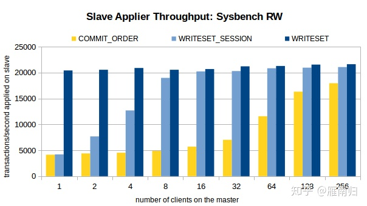

MySQL 8.0  可以说是MySQL发展历史上里程碑式的一个版本，包括了多个重大更新，目前 Generally Available  版本已经已经发布，正式版本即将发布，在此将介绍8.0版本中引入的一个重要的新特性————基于 WriteSet  的并行复制方案，此方案号称是彻底解决困扰MySQL运维人员多年的复制延迟问题。

说到并行复制，这里简单的回顾一下各个版本的MySQL复制的演进，以帮助理解8.0版本中对并行复制MTS的优化。

 

## MySQL 主从复制模型

 

一切都要从MySQL的主从复制模型开始说起，下图是最经典的MySQL主从复制模型架构图

MySQL 复制模型

 

MySQL的主从架构依赖于 MySQL Binlog 功能，  Master节点上产生Binlog并将Binlog写入到Binlog文件中。Slave节点上启动两个线程：一个IO线程，从MySQL上捞取Binlog日志并写入到本地的RelayLog日志；另一个SQL线程，不断的从RelayLog日志中读取日志，并解析执行。这样通过在主机和从机上增加几个文件的顺序读写操作，就可以保证所有在主机上执行过的SQL语句都在从机上一摸一样的执行过一遍。而复制延迟，指的就是一个事务在Master执行完成以后，要多久以后才能在Slave上执行完成。

由于对Binlog文件以及RelayLog文件的读写均为顺序操作，在生产环境中，Slave上的IO线程对Binlog文件的Dump操作是很少产生延迟的。 实际上，从MySQL 5.5 开始，MySQL官方提供了半同步复制插件，每个事务的Binlog需要保证传输到Slave写入 RelayLog  后才能提交，这种架构在主从之间提供了数据完整性，保证了主机在发生故障后从机可以拥有完整的数据副本。因此，复制延迟通常发生在SQL线程执行的过程中。从架构图上可以看到，最早的主从复制模型中，只有一个线程负责执行 Relaylog，也就是说所有在主机上的操作，在从机上是串行回放的。  这就带来一个问题，如果主上写入压力比较大，那么从上的回放速度很有可能会一直跟不上主。（除此之外，MySQL的架构决定了Binlog只有在Commit阶段才会写入Binlog文件并Dump给从机，这也导致主从事务必然有执行延迟，这个问题在大事务中体现的特别明显，不过这个问题就不在本文的讨论范围内了）

既然主从延迟的问题是单线程回放RelayLog太慢，那么减少主从延迟的方案自然就是提高从机上回放RelayLog 的并行度。

 

## 5.6中的并行复制————Schema级别的并行复制

 

MySQL官方在5.6中引入了一个比较简单并行复制方案，其架构如下：（图片来自姜承尧老师的博客）


 

红色框部分为并行回放的关键，5.6中若开启并行回放的功能，便会启动多个WorkThread ，而原来负责回放的SQLThread会转变成Coordinator角色，负责判断事务能否并行执行并分发给WorkThread。

如果事务分别属于不同的Schema，并且不是DDL语句且没有跨Schema操作，那么就可以并行回放，否则需要等所有Worker线程执行完成后再执行当前日志中的内容。

这种并行回放是Schema级别的并行，如果实例上有多个Schema将会因此收益，而如果实例上只有一个Schema，那么事务将无法并行回放，而且还会因多了分发的操作导致效率略微下降。而在实际应用中，单库多表才是更常见的情况。

 

## 5.7中的并行复制————基于Group Commit 的并行复制

 

虽然5.6中的并行复制在大多数应用场景中对回放速度的提升不大，但是该架构却成为了后来MySQL并行复制的基础——既在Slave上并行回放RelayLog，SQL线程负责判断能否并行回放，并分配给Work线程回放。

5.6 中引入Group  Commit技术，这是为了解决事务提交的时候需要fsync导致并发性不够而引入的。简单来说，就是由于事务提交时必须将Binlog写入到磁盘上而调用fsync，这是一个代价比较高的操作，事务并发提交的情况下，每个事务各自获取日志锁并进行fsync会导致事务实际上以串行的方式写入Binlog文件，这样就大大降低了事务提交的并发程度。5.6中采用的Group Commit技术将事务的提交阶段分成了 Flush, Sync, Commit  三个阶段，每个阶段维护一个队列，并且由该队列中第一个线程负责执行该步骤，这样实际上就达到了一次可以将一批事务的Binlog  fsync到磁盘的目的，这样的一批同时提交的事务称为同一个Group的事务。

Group Commit  虽然是属于并行提交的技术，但是却意外的解决了从机上事务并行回放的一个难题————既如何判断哪些事务可以并行回放。如果一批事务是同时Commit的，那么这些事务必然不会互斥的持有锁，也不会有执行上的相互依赖，因此这些事务必然可以并行的回放。

因此MySQL 5.7 中引入了新的并行回放类型， 由参数 `slave_parallel_type`决定，默认值`DATABASE`将会采用5.6版本中的SCHEMA级别的并行回放，设置为 `LOGICAL_LOCK` 则会采用基于GroupCommit的并行回放，同一个Group内的事务将会在Slave上并行回放。

为了标记事务所属的组，MySQL 5.7 版本在产生 Binlog 日志时会有两个特殊的值记录在Binlog Event中， `last_committed` 和 `sequence_number` , 其中 last_committed 指的是该事务提交时，上一个事务提交的编号，sequence_number 是事务提交的序列号，在一个Binlog文件内单调递增。如果两个事务的 `last_committed` 值一致，这两个事务就是在一个组内提交的。

 

```
root@localhost:~# mysqlbinlog mysql-bin.0000006 | grep last_committed
#150520 14:23:11 server id 88 end_log_pos 259 CRC32 0x4ead9ad6 GTID last_committed=0 sequence_number=1
#150520 14:23:11 server id 88 end_log_pos 1483 CRC32 0xdf94bc85 GTID last_committed=0 sequence_number=2
#150520 14:23:11 server id 88 end_log_pos 2708 CRC32 0x0914697b GTID last_committed=0 sequence_number=3
#150520 14:23:11 server id 88 end_log_pos 3934 CRC32 0xd9cb4a43 GTID last_committed=0 sequence_number=4
#150520 14:23:11 server id 88 end_log_pos 5159 CRC32 0x06a6f531 GTID last_committed=0 sequence_number=5
#150520 14:23:11 server id 88 end_log_pos 6386 CRC32 0xd6cae930 GTID last_committed=0 sequence_number=6
#150520 14:23:11 server id 88 end_log_pos 7610 CRC32 0xa1ea531c GTID last_committed=6 sequence_number=7
#150520 14:23:11 server id 88 end_log_pos 8834 CRC32 0x96864e6b GTID last_committed=6 sequence_number=8
#150520 14:23:11 server id 88 end_log_pos 10057 CRC32 0x2de1ae55 GTID last_committed=6 sequence_number=9
#150520 14:23:11 server id 88 end_log_pos 11280 CRC32 0x5eb13091 GTID last_committed=6 sequence_number=10
#150520 14:23:11 server id 88 end_log_pos 12504 CRC32 0x16721011 GTID last_committed=6 sequence_number=11
#150520 14:23:11 server id 88 end_log_pos 13727 CRC32 0xe2210ab6 GTID last_committed=6 sequence_number=12
#150520 14:23:11 server id 88 end_log_pos 14952 CRC32 0xf41181d3 GTID last_committed=12 sequence_number=13
```

 

 

如上 binlog 文件中， sequence_number 1-6 的事务 last_committed 都是0 ，因此属于同一个组，可以在slave上并行回放， 7-12的last_committed 都是6，也属于同一个组，因此可以并行回放。

5.7 中引入的基于Logical_Lock极大的提高了在主机并发压力比较大的情况下，从机上的回放速度。基本上做到了主机上如何提交的，在从机上如何回放。

 

## MySQL MGR 中的 WriteSet

 

在5.7中基于逻辑时钟 Logical_Clock 的并行复制任然有不尽人意的地方，必须是在主上并行提交的事务才能在从上并行回放，如果主上并发压力不大，那么就无法享受到并行复制带来的好处。5.7 中引入了 `binlog_group_commit_sync_delay` 和 `binlog_group_commit_sync_no_delay_count` 两个参数，通过让Binlog在执行 fsync 前等待一小会来提高Master上组提交的比率。但是无论如何，从上并行回放的速度还是取决于主上并行提交的情况。

MySQL 8.0中引入了一种新的机制来判断事务能否并行回放，通过检测事务在运行过程中是否存在写冲突来决定从机上的回放顺序，这使得从机上的并发程度不再依赖于主机。

事实上，该机制在 MySQL 5.7.20  版本中就已经悄悄的应用了。5.7.20版本引入了一个重要的特性： Group  Replication，通过Paxso协议在多个MySQL节点间分发binlog，使得一个事务必须在集群内大多数节点(N/2+1)上提交成功才能提交。为了支持多主写入，MySQL MRG 在Binlog分发节点完成后，通过一个 Certify 阶段来决定Binlog中的事务是否写入RelayLog  中。这个过程中，Certify 阶段采用的就是WriteSet的方式验证事务之间是否存在冲突，同时，在写入RelayLog  时会将没有冲突的事务的 last_committed 值设置为相同的值。

比如在5.7.20中，进行如下操作：

 

```
> -- create a group replication cluster.
> STOP GROUP_REPLICATION; START GROUP_REPLICATION;
Query OK, 0 rows affected (9.10 sec)

> -- All the next commands on the primary member of the group:
> CREATE DATABASE test_ws_mgr ;
Query OK, 1 row affected (0.01 sec)

> CREATE TABLE  test_ws_mgr.test ( id int primary key auto_increment, str varchar(64) not null );
Query OK, 1 row affected (0.01 sec)

> INSERT INTO test_ws_mgr.test(`str`) VALUES ("a");
Query OK, 1 row affected (0.01 sec)

> INSERT INTO test_ws_mgr.test(`str`) VALUES ("b");
Query OK, 1 row affected (0.01 sec)

> INSERT INTO test_ws_mgr.test(`str`) VALUES ("c");
Query OK, 1 row affected (0.01 sec)
```

 

 

以上代码在一个MGR 集群中创建了一个数据库和一个INNODB表，并插入了三条记录。这个时候，如何查询Primary 节点上的Binlog，可能会得到如下结果

 

```
# mysqlbinlog mysql-bin.N | grep last_ |  sed -e 's/server id.*last/[...] last/' -e 's/.rbr_only.*/ [...]/'
#180106 19:31:59 [...] last_committed=0 sequence_number=1 [...] -- CREATE DB
#180106 19:32:02 [...] last_committed=1 sequence_number=2 [...] -- CREATE TB
#180106 19:32:05 [...] last_committed=2 sequence_number=3 [...] -- INSERT a
#180106 19:32:08 [...] last_committed=3 sequence_number=4 [...] -- INSERT b
#180106 19:32:11 [...] last_committed=4 sequence_number=5 [...] -- INSERT c
```

 

 

可以看到，由于是在一个Session中，这些操作按着串行的顺序有着不同的 last_committed , 正常情况下，这些BinlogEvent应该在从机上同样以串行的方式回放。我们看一下在MGR集群中的relaylog 情况。

 

```
# mysqlbinlog mysql-relay.N | grep -e last_  |  sed -e 's/server id.*last/[...] last/' -e 's/.rbr_only.*/ [...]/'
#180106 19:31:36 [...] last_committed=0 sequence_number=0 [...]
#180106 19:31:36 [...] last_committed=1 sequence_number=2 [...] -- CREATE DB
#180106 19:31:36 [...] last_committed=2 sequence_number=3 [...] -- CREATE TB
#180106 19:31:36 [...] last_committed=3 sequence_number=4 [...] -- INSERT a
#180106 19:31:36 [...] last_committed=3 sequence_number=5 [...] -- INSERT b
#180106 19:31:36 [...] last_committed=3 sequence_number=6 [...] -- INSERT c
```

 

 

有趣的是，在 Secondary 节点的 RelayLog 中, 这些事务有着相同的 last_committed 值，也就是说这些事务在MGR集群中，回放的时候可以以并行的方式回放。

MGR中，使用的正是 WriteSet 技术检测不同事务之间是否存在写冲突，并重规划了事务的并行回放，这一技术在8.0中被移到了Binlog生成阶段，并采用到了主从复制的架构中。

 

## MySQL 8.0 中的并行复制

 

说了这么多，终于讲到 MySQL 8.0 ， 通过以上描述，读者应该对 MySQL  8.0 中并行复制的优化的原理有了一个大致的轮廓。通过基于 WriteSet 的冲突检测，在主机上产生 Binlog  的时候，不再基于组提交，而是基于事务本身的更新冲突来确定并行关系。

 

## 相关的 MySQL 参数

 

MySQL 8.0 中引入参数 `binlog_transaction_depandency_tracking` 用于控制如何决定事务的依赖关系。该值有三个选项：默认的 `COMMIT_ORDERE` 表示继续使用5.7中的基于组提交的方式决定事务的依赖关系；`WRITESET` 表示使用写集合来决定事务的依赖关系；还有一个选项 `WRITESET_SESSION` 表示使用 WriteSet 来决定事务的依赖关系，但是同一个Session内的事务不会有相同的 last_committed 值。

在代码实现上，MySQL采用一个 `vector<uint64>` 的变量存储已经提交的事务的HASH值，所有已经提交的事务的所修改的 主键和非空的 UniqueKey 的值经过HASH后与该vector中的值对比，以判断当前提交的事务是否与已经提交的事务更新了同一行，并以此确定依赖关系。该向量的大小由参数 `binlog_transaction_dependency_history_size` 控制，取值范围为 1-1000000 ，初始默认值为 25000。 同时有参数 `transaction_write_set_extraction` 控制检测事务依赖关系时采用的HASH算法，有三个取值 `OFF| XXHASH64 | MURMUR32`， 如果 binlog_transaction_depandency_tracking 取值为 WRITESET 或 WRITESET_SESSION, 那么该值取值不能为OFF，且不能变更。

 

## WriteSet 依赖检测条件

 

WriteSet  是通过检测两个事务是否更新了相同的记录来判断事务能否并行回放的，因此需要在运行时保存已经提交的事务信息以记录历史事务更新了哪些行。记录历史事务的参数为 binlog_transaction_dependency_history_size.  该值越大可以记录更多的已经提交的事务信息，不过需要注意的是，这个值并非指事务大小，而是指追踪的事务更新信息的数量。在开启了 WRITESET 或 WRITESET_SESSION 后，MySQL 按以下的方式标识并记录事务的更新。

- 如果事务当前更新的行有主键（Primary Key），则将 HASH(DB名，TABLE名，KEY名称，KEY_VALUE1, KEY_VALUE2,.....) 加入到当前事务的 vector write_set 中。
- 如果事务当前更新的行有非空的唯一键 （Unique Key Not NULL）， 同样将 HASH(DB名, TABLE名，KEY名, KEY_VALUE1, ....)加入到当前事务的 write_set 中。
- 如果事务更新的行有外键约束( FOREIGN KEY )且不为空，则将该 外键信息与VALUE 的HASH加到当前事务的 write_set 中
- 如果事务当前更新的表的主键是其他某个表的外键，并设置当前事务 has_related_foreign_key = true
- 如果事务更新了某一行且没有任何数据被加入到 write_set 中，则标记当前事务 has_missing_key = true

在执行冲突检测的时候，先会检查 has_related_foreign_key 和  has_missing_key ， 如果为true， 则退到 COMMIT_ORDER 模式。否则，会依照事务的 write_set  中的HASH值与已提交的事务的 write_set 进行比对，如果没有冲突，则当前事务与最后一个已提交的事务共享相同的  last_commited, 否则将从全局已提交的 write_set 中删除那个冲突的事务之前提交的所有write_set，并退化到  COMMIT_ORDER 计算last_committed 。 每次计算完事务的 last_committed 值以后，检测当前全局已提交事务的 write_set 是否已经超过了 binlog_transaction_dependency_history_size  设置的值，如果超过，则清空已提交事务的全局 write_set。

从检测条件上看，该特性依赖于 主键和唯一索引，如果事务涉及的表中没有主键且没有唯一非空索引，那么将无法从此特性中获得性能的提升。除此之外，还需要将 Binlog 格式设置为 Row 格式。

 

## 性能提升

 

MySQL High Availability 对开启了WriteSet的复制性能做了测试，这里直接将测试结果搬运过来，有兴趣的可以直接访问[原博客](http://link.zhihu.com/?target=https%3A//mysqlhighavailability.com/improving-the-parallel-applier-with-writeset-based-dependency-tracking/)

测试时通过Sysbench 先在主机上执行100W条事务，然后开启Slave的复制线程，测试环境在Xeon E5-2699-V3 16核主机上执行，以下是测试结果

 




 

 

可以看到，在客户端线程比较少的时候，WRITESET 具有最好的性能，在只有一个连接的时候 WRITESET_SESSION 和 COMMIT_ORDER 差别不大。

 

## 结论

 

从 MySQL Hight Availability 的测试中可以看到，开启了基于  WriteSet 的事务依赖后，对Slave上RelayLog回放速度提升显著。Slave上的 RelayLog 回放速度将不再依赖于  Master 上提交时的并行程度，使得Slave上可以发挥其最大的吞吐能力， 这个特性在Slave上复制停止一段时间后恢复复制时尤其有效。

这个特性使得 Slave 上可能拥有比 Master  上更大的吞吐量，同时可能在保证事务依赖关系的情况下，在 Slave 上产生 Master 上没有产生过的提交场景，事务的提交顺序可能会在  Slave 上发生改变。 虽然在5.7 的并行复制中就可能发生这种情况，不过在8.0中由于 Slave 上更高的并发能力，会使该场景更加常见。  通常情况下这不是什么大问题，不过如果在 Slave 上做基于 Binlog 的增量备份，可能就需要保证在 Slave 上与Master  上一致的提交顺序，这种情况下可以开启 `slave_preserve_commit_order` 这是一个 5.7 就引入的参数，可以保证 Slave 上并行回放的线程按 RelayLog 中写入的顺序 Commit。

 

## 参考：

 

[http://jfg-mysql.blogspot.jp/2018/01/an-update-on-write-set-parallel-replication-bug-fix-in-mysql-8-0.html](http://link.zhihu.com/?target=http%3A//jfg-mysql.blogspot.jp/2018/01/an-update-on-write-set-parallel-replication-bug-fix-in-mysql-8-0.html)

[http://jfg-mysql.blogspot.jp/2018/01/write-set-in-mysql-5-7-group-replication.html](http://link.zhihu.com/?target=http%3A//jfg-mysql.blogspot.jp/2018/01/write-set-in-mysql-5-7-group-replication.html)

[https://mysqlhighavailability.com/improving-the-parallel-applier-with-writeset-based-dependency-tracking/](http://link.zhihu.com/?target=https%3A//mysqlhighavailability.com/improving-the-parallel-applier-with-writeset-based-dependency-tracking/)