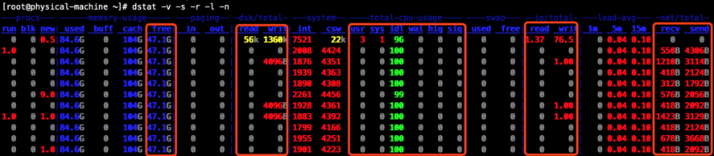

https://blog.csdn.net/woqutechteam/article/details/102319125

- MySQL 执行DDL语句 hang住了怎么办? 不要慌，先点支烟，听我娓娓道来！
- 前两天，早上7点多的时候，抓起手机忽然看到了圈内的一则DDL语句  hang住的案例，阅读到文末，发现文中留有一些疑问（当然，文章是7月份的，现在或许作者已经解决了这些疑问），于是一咕噜从床上爬起来，按照文中的复现方法操作了一遍（复现方法见文末），然后，按照自己的思路解决了该疑问，现在将整个过程整理出来分享给大家。

### 环境

- 数据库版本：MySQL 5.7.27
- 数据信息 
  - sysbench模拟2张1000W的表
- 操作系统版本：CentOS Linux release 7.3.1611 (Core)
- 服务器信息 
  - CPU：Intel(R) Xeon(R) CPU E5-4627 v2 @ 3.30GHz * 2
  - 内存：248G
  - 磁盘：1.6T LSI Flash卡
  - 网卡：万兆网卡

### 现象

- 当我们发现一个故障问题时，首先需要做的事情，就是先确认现象，也就是先要自己亲眼瞅见故障长什么样子，而不是直接上去就是一通胡乱排查。尤其是故障是别人反馈过来的时候，一定要首先确认故障现象表现及其真实性（别人反馈过来的问题，很多时候根本就不是问题，而是他自己姿势不对）。
- 在本文中，提到的故障现象是DBA侧自己执行DDL语句修改字段长度时自己发现的（当然，这里是模拟的DBA侧操作），那么，根据上述准则，我们先开启另外一个会话，查看执行DDL语句 hang住具体是什么情况？

| 1 			2 			3 			4 			5 			6 			7 			8 			9 			10 			11 | `# 使用show processlist语句查看会话状态信息，发现DDL语句的state列值为Waiting ``for` `table` `metadata lock，表示在等待MDL元数据锁。根据MySQL 5.7及其之后的版本中的online ddl特性，该语句应该立即执行完成（它只会修改元数，因为这里只是修改了字段长度，并没有修改字段的其他属性），因此，故障现象确认` 			`admin@localhost : (none) 11:48:22> show processlist;` 			`+``----+-------+-----------+--------+---------+------+---------------------------------+-----------------------------+` 			`| Id | ``User` `| Host | db | Command | ``Time` `| State | Info |` 			`+``----+-------+-----------+--------+---------+------+---------------------------------+-----------------------------+` 			`| 27 | admin | localhost | sbtest | Sleep | 123 | | ``NULL` `|` 			`| 28 | admin | localhost | sbtest | Query | 102 | Waiting ``for` `table` `metadata lock | ``alter` `table` `sbtest1 ``modify` `column` ``pad` ``varchar``(70) ``COLLATE` `utf8_bin ``NOT` `NULL` `DEFAULT` `''` `|` 			`| 29 | admin | localhost | ``NULL` `| Query | 0 | starting | show processlist |` 			`| 30 | admin | localhost | ``NULL` `| Sleep | 93 | | ``NULL` `|` 			`+``----+-------+-----------+--------+---------+------+---------------------------------+-------------------------------+` 			`4 ``rows` `in` `set` `(0.00 sec)` |
| ------------------------------------------------------------ | ------------------------------------------------------------ |
|                                                              |                                                              |

- 友情提示：确认故障现象的位置不要搞错，在什么位置发现故障问题，首先就在什么位置进行故障确认。举个反例，曾经我碰到一个同学，在一个“应用-->LVS-->分库中间件-->读写分离中间件-->数据库主从集群”的架构层级中，应用侧反馈数据库连接很慢，这位同学直接登录到数据库中去确认现象了，显然，确认故障现象时搞错了位置，在这个反例中确认故障现象的位置应该以应用侧反馈故障现象的位置为准（首先使用LVS的VIP尝试连接），逐层往下确认

### 分析

- 确认了故障现象，DDL语句hang住的原因是因为在等待MDL元数据锁，但不知道MDL元数据锁被谁持有了。接下来，就要围绕这个现象，推测可能导致该问题的一些原因了，哪些原因可能导致该问题呢？我们可以按照下面的思路进行逐个排除 
  - 服务器的主机负载过高（CPU、内存、磁盘吞吐与IOPS、网卡带宽），有没有别的程序挤占了数据库进程的资源
     	* 你也许会说，这里的现象很明显是因为在等MDL锁，跟服务器负载无关，肯定是有人加了锁没释放。但我想提醒的是，该现象真的是一个单纯的问题吗？会不会是一个链式反应导致的？等待MDL锁虽然是DDL语句被阻塞的原因，但也许它同时也是服务器高负载的现象与结果
  - 数据库进程的负载过高
     	* 数据库中的活跃会话数量及其状态
        	* 数据库的QPS/TPS
  - 存在其他会话正在执行DML语句，或执行了某些DML语句之后事务未及时提交、或者其他某个会话也同时在执行某个DDL语句修改sbtest1表的表结构信息

### 排查

- 有了思路，接下来就按照上文中提到的思路逐个进行排查
- 首先，我们查看主机负载信息，通过下图我们可以看到，主机基本处于空载状态，毫无压力



- 然后，我们查看数据库的活跃会话数量及其状态，我们可以看到数据库中并没有大量会话，也不存在正在执行的DML语句在操作表sbtest1，也不存在同时有其他会话同时使用DDL在操作相同的表，但这里无法确认是否存在未提交的事务

| 1 			2 			3 			4 			5 			6 			7 			8 			9 			10 			11 | `# 反复多执行几次show processlist语句` 			`admin@localhost : (none) 11:49:10> show processlist;` 			`+``----+-------+-----------+--------+---------+------+---------------------------------+-----------------------------------+` 			`| Id | ``User` `| Host | db | Command | ``Time` `| State | Info |` 			`+``----+-------+-----------+--------+---------+------+---------------------------------+------------------------------------+` 			`| 27 | admin | localhost | sbtest | Sleep | 149 | | ``NULL` `|` 			`| 28 | admin | localhost | sbtest | Query | 128 | Waiting ``for` `table` `metadata lock | ``alter` `table` `sbtest1 ``modify` `column` ``pad` ``varchar``(70) ``COLLATE` `utf8_bin ``NOT` `NULL` `DEFAULT` `''` `|` 			`| 29 | admin | localhost | ``NULL` `| Query | 0 | starting | show processlist |` 			`| 30 | admin | localhost | ``NULL` `| Sleep | 119 | | ``NULL` `|` 			`+``----+-------+-----------+--------+---------+------+---------------------------------+---------------------------------------+` 			`4 ``rows` `in` `set` `(0.00 sec)` |
| ------------------------------------------------------------ | ------------------------------------------------------------ |
|                                                              |                                                              |

- 通过上述步骤，已确认在负载层面并没有问题，此时，我们需要重点确认是否存在某个会话执行了某些DML语句之后事务未及时提交，如何确认这些信息呢？我们可以通过performance_schema和information_schema中的锁和事务相关的表进行查询确认
- 先查看information_schema中记录的事务信息

| 1 			2 			3 			4 			5 			6 			7 			8 			9 			10 			11 			12 			13 | `# 发现并没有事务存在...` 			`admin@localhost : sbtest 05:49:17> ``select` `* ``from` `information_schema.innodb_trx\G` 			`Empty ``set` `(0.00 sec)` 			`# 也可以顺便使用sys.innodb_lock_waits视图确认是否存在一些事务锁等待` 			`admin@localhost : performance_schema 06:27:35> ``select` `* ``from` `sys.innodb_lock_waits\G` 			`Empty ``set``, 3 warnings (0.00 sec) # 查询结果为空` 			`查看performance_schema下的MDL元数据锁记录信息 ` 			`# WTF..居然为空` 			`admin@localhost : sbtest 06:00:21> ``select` `* ``from` `performance_schema.metadata_locks;` 			`Empty ``set` `(0.00 sec)` 			`# 也可以顺便使用sys.schema_table_lock_waits视图查看表级别的锁等待` 			`admin@localhost : performance_schema 06:28:12> ``select` `* ``from` `sys.schema_table_lock_waits\G` 			`Empty ``set` `(0.00 sec) # 查询结果为空` |
| ------------------------------------------------------------ | ------------------------------------------------------------ |
|                                                              |                                                              |

- 查看performance_schema下的handle持有信息

| 1 			2 			3 			4 			5 			6 			7 			8 			9 			10 			11 			12 			13 			14 			15 			16 			17 			18 			19 			20 			21 			22 			23 			24 			25 			26 			27 			28 			29 			30 			31 | `# 发现表sbtest1的handle被thread_id=70的线程持有` 			`admin@localhost : (none) 11:49:36> ``select` `* ``from` `performance_schema.table_handles ``where` `OWNER_THREAD_ID!=0;` 			`+``-------------+---------------+-------------+--------+-----------------+----------------+---------------+---------------+` 			`| OBJECT_TYPE | OBJECT_SCHEMA | OBJECT_NAME | OBJECT_INSTANCE_BEGIN | OWNER_THREAD_ID | OWNER_EVENT_ID | INTERNAL_LOCK | EXTERNAL_LOCK |` 			`+``-------------+---------------+-------------+---------+-----------------+----------------+---------------+---------------+` 			`| ``TABLE` `| sbtest | sbtest1 | 140049018564288 | 70 | 6 | ``NULL` `| ``NULL` `|` 			`+``-------------+---------------+-------------+----------+-----------------+----------------+---------------+---------------+` 			`1 row ``in` `set` `(0.00 sec)` 			`# 通过performance_schema.threads表查看是哪个线程（thread_id是数据库内部的线程ID，我们需要看到与之对应的processlist id）` 			`admin@localhost : (none) 11:50:03> ``select` `thread_id,processlist_id,type ``from` `performance_schema.threads ``where` `processlist_id ``is` `not` `null` `and` `type=``'FOREGROUND'``;` 			`+``-----------+----------------+------------+` 			`| thread_id | processlist_id | type |` 			`+``-----------+----------------+------------+` 			`| 43 | 1 | FOREGROUND |` 			`| 69 | 27 | FOREGROUND |` 			`| 70 | 28 | FOREGROUND | # 发现processlist id为28` 			`| 71 | 29 | FOREGROUND |` 			`| 72 | 30 | FOREGROUND |` 			`+``-----------+----------------+------------+` 			`5 ``rows` `in` `set` `(0.00 sec)` 			`# 通过show processlist再次查看一下id号，额。。发现id列为28的居然就是执行DDL语句被hang住那个会话，好吧，白忙活了` 			`admin@localhost : (none) 11:50:26> show processlist;` 			`+``----+-------+-----------+--------+---------+------+---------------------------------+------------------------------------+` 			`| Id | ``User` `| Host | db | Command | ``Time` `| State | Info |` 			`+``----+-------+-----------+--------+---------+------+---------------------------------+--------------------------------------+` 			`| 27 | admin | localhost | sbtest | Sleep | 228 | | ``NULL` `|` 			`| 28 | admin | localhost | sbtest | Query | 207 | Waiting ``for` `table` `metadata lock | ``alter` `table` `sbtest1 ``modify` `column` ``pad` ``varchar``(70) ``COLLATE` `utf8_bin ``NOT` `NULL` `DEFAULT` `''` `|` 			`| 29 | admin | localhost | ``NULL` `| Query | 0 | starting | show processlist |` 			`| 30 | admin | localhost | ``NULL` `| Sleep | 198 | | ``NULL` `|` 			`+``----+-------+-----------+--------+---------+------+---------------------------------+-----------------------------------------+` 			`4 ``rows` `in` `set` `(0.00 sec)` |
| ------------------------------------------------------------ | ------------------------------------------------------------ |
|                                                              |                                                              |

- 通过show engine innodb status查看下锁与事务信息

| 1 			2 			3 			4 			5 			6 			7 			8 			9 			10 			11 			12 			13 			14 			15 			16 			17 			18 			19 			20 			21 | `# 仍然没有发现有效的锁信息` 			`admin@localhost : performance_schema 06:14:13> show engine innodb status;` 			`......` 			`------------` 			`TRANSACTIONS` 			`------------` 			`Trx id counter 11559` 			`Purge done ``for` `trx's n:o < 11557 undo n:o < 0 state: running but idle` 			`History list length 60` 			`LIST ``OF` `TRANSACTIONS ``FOR` `EACH SESSION:` 			`---TRANSACTION 421628104988048, not started` 			`0 lock struct(s), heap ``size` `1136, 0 row lock(s)` 			`---TRANSACTION 421628104987136, not started` 			`0 lock struct(s), heap ``size` `1136, 0 row lock(s)` 			`---TRANSACTION 421628104985312, not started` 			`0 lock struct(s), heap ``size` `1136, 0 row lock(s)` 			`---TRANSACTION 421628104984400, not started` 			`0 lock struct(s), heap ``size` `1136, 0 row lock(s)` 			`---TRANSACTION 421628104986224, not started` 			`0 lock struct(s), heap ``size` `1136, 0 row lock(s)` 			`......` |
| ------------------------------------------------------------ | ------------------------------------------------------------ |
|                                                              |                                                              |

- 排查到这里，视乎已经没招了，也许我们还可以用mysqladmin debug命令试试看

| 1 			2 			3 			4 | `# 执行debug命令，执行该命令之后，一些锁信息可能会被debug出来打印到错误日志中` 			`[root@physical-machine ~]# mysqladmin debug` 			`# 很遗憾，在错误日志中仍然没有发现有效的锁信息` 			`[root@physical-machine ~]# vim /data/mysqldata1/log/error.log` |
| ------------------------------------------- | ------------------------------------------------------------ |
|                                             |                                                              |

- 还有最后一招，可以使用pstack和gdb命令查看，但，生产系统不建议随随便便使用这类命令，这类命令会让整个实例级别发生一段时间的阻塞。且上述故障问题并不能说明整个数据库实例级别存在问题，也许只是发生MDL锁等待的两个会话之间的问题。so...咋办呢？要认怂吗？
- 等等，我们好像忽略了点什么，既然DDL语句在等待MDL元数据锁，为啥在performance_schema.metadata_locks表中没有记录？查看一下MDL事件采集器试试看？

| 1 			2 			3 			4 			5 			6 			7 			8 			9 			10 			11 			12 			13 			14 			15 			16 			17 | `# 喔。。发现居然MDL锁信息的采集器开关并没有打开，难怪metadata_locks表中无法记录MDL元数据锁信息` 			`admin@localhost : performance_schema 06:30:16> ``select` `* ``from` `performance_schema.setup_instruments ``where` `name` `like` `'%/mdl'``;` 			`+``----------------------------+---------+-------+` 			`| ``NAME` `| ENABLED | TIMED |` 			`+``----------------------------+---------+-------+` 			`| wait/lock/metadata/sql/mdl | ``NO` `| ``NO` `|` 			`+``----------------------------+---------+-------+` 			`1 row ``in` `set` `(0.00 sec)` 			`# 现在，我们启用mdl的采集器` 			`admin@localhost : sbtest 07:18:52> call sys.ps_setup_enable_instrument(``'sql/mdl'``);` 			`+``-----------------------+` 			`| summary |` 			`+``-----------------------+` 			`| Enabled 6 instruments |` 			`+``-----------------------+` 			`1 row ``in` `set` `(0.00 sec)` 			`Query OK, 0 ``rows` `affected (0.00 sec)` |
| ------------------------------------------------------------ | ------------------------------------------------------------ |
|                                                              |                                                              |

- 关于instruments采集器，如果事先是处于关闭状态，启用之后，需要新的请求进来才能够收集对应的事件信息，因此，如果要采集MDL锁的信息，我们得让故障现象重新复现一遍。读到这里，也许你会说，干嘛不早说？好吧，SORRY，我是故意的...
- 现在，我们终止掉DDL语句，使用文末的步骤重新操作一遍
- 然后，我们重新查询information_schema下的事务和锁信息

| 1 			2 			3 			4 			5 			6 | `# 查看information_schema.innodb_trx表，仍然没有事务信息` 			`admin@localhost : sbtest 07:17:03> ``select` `* ``from` `information_schema.innodb_trx\G` 			`Empty ``set` `(0.00 sec)` 			`# 查看事务锁等待信息，仍然为空` 			`admin@localhost : sbtest 07:17:30> ``select` `* ``from` `sys.innodb_lock_waits\G` 			`Empty ``set``, 3 warnings (0.01 sec)` |
| ------------------------------------------------------------ | ------------------------------------------------------------ |
|                                                              |                                                              |

- 查看performance_schema下的MDL元数据锁记录信息

| 1 			2 			3 			4 			5 			6 			7 			8 			9 			10 			11 			12 			13 			14 			15 			16 			17 			18 			19 			20 			21 			22 			23 			24 			25 			26 			27 			28 			29 			30 			31 			32 			33 			34 			35 			36 			37 			38 			39 			40 			41 			42 			43 			44 			45 			46 			47 			48 			49 			50 			51 			52 			53 			54 			55 			56 			57 			58 			59 			60 			61 			62 			63 			64 			65 			66 | `# 查看metadata_locks表中的MDL锁信息，咦，有信息了！不过，有点乱啊（我们这里只查询sbtest库下的sbtest1表就可以了，因为我们的操作也只涉及到这张表）` 			`admin@localhost : (none) 11:52:46> ``select` `* ``from` `performance_schema.metadata_locks ``where` `OBJECT_SCHEMA=``'sbtest'` `and` `OBJECT_NAME=``'sbtest1'``;` 			`+``-------------+---------------+-------------+-----+--------+---------------+-------------+--------+-----------------+----------------+` 			`| OBJECT_TYPE | OBJECT_SCHEMA | OBJECT_NAME | OBJECT_INSTANCE_BEGIN | LOCK_TYPE | LOCK_DURATION | LOCK_STATUS | SOURCE | OWNER_THREAD_ID | OWNER_EVENT_ID |` 			`+``-------------+---------------+-------------+-----+--------+---------------+-------------+--------+-----------------+----------------+` 			`# 从这行信息我们可以看到，表sbtest1上有一把SHARED_WRITE锁处于GRANTED状态，为thread_id=69的线程所持有。SHARED_WRITE类型的MDL锁是一把意向排他IX锁，通常在执行MDL或``select` `... ``for` `update``时产生` 			`| ``TABLE` `| sbtest | sbtest1 | 140048817276288 | SHARED_WRITE | ``TRANSACTION` `| GRANTED | | 69 | 11 |` 			`# 从这行信息我们可以看到，表sbtest1上有一把SHARED_UPGRADABLE的锁处于GRANTED状态，为thread_id=70的线程持有，从上文中的信息我们可以知道，thread_id=70的process id为28，也就是执行DDL语句被阻塞的那个会话id。SHARED_UPGRADABLE类型的MDL锁是一把共享升级锁，一般在执行online DDL语句时会产生。它的作用是在执行online ddl期间允许相同表的DML但防止DDL` 			`| ``TABLE` `| sbtest | sbtest1 | 140049018604784 | SHARED_UPGRADABLE | ``TRANSACTION` `| GRANTED | | 70 | 6 |` 			`# 从这行信息我们可以看到，表sbtest1上有一把EXCLUSIVE处于PENDING状态，为thread_id=70的线程在等待，从上文中的信息我们可以知道，thread_id=70的process id为28，也就是执行DDL语句被阻塞的那个会话id。EXCLUSIVE类型的MDL锁是一把排它X锁，用于阻止其他线程读写元数据信息，一般在执行DDL时产生` 			`| ``TABLE` `| sbtest | sbtest1 | 140049018564112 | EXCLUSIVE | ``TRANSACTION` `| PENDING | | 70 | 6 |` 			`+``-------------+---------------+-------------+-----+---------+---------------+-------------+--------+-----------------+----------------+` 			`3 ``rows` `in` `set` `(0.00 sec)` 			`# 通过上述信息我们可以得知，thread_id=70的线程需要获取的EXCLUSIVE锁与thread_id=69的线程所持有的SHARED_WRITE锁冲突了，但thread_id=69线程的process id是多少呢？查看一下performance_schema.threads表` 			`admin@localhost : (none) 11:53:47> ``select` `thread_id,processlist_id,type ``from` `performance_schema.threads ``where` `processlist_id ``is` `not` `null` `and` `type=``'FOREGROUND'``;` 			`+``-----------+----------------+------------+` 			`| thread_id | processlist_id | type |` 			`+``-----------+----------------+------------+` 			`| 43 | 1 | FOREGROUND |` 			`| 69 | 27 | FOREGROUND | # 发现thread_id=69的线程process id为27` 			`| 70 | 28 | FOREGROUND |` 			`| 71 | 29 | FOREGROUND |` 			`| 74 | 32 | FOREGROUND |` 			`+``-----------+----------------+------------+` 			`5 ``rows` `in` `set` `(0.01 sec)` 			`# 到这里，我们知道了DDL语句就是被process id为27的线程阻塞的，但，还不是很直观，查看起来比较繁琐，我们还是直接使用sys.schema_table_lock_waits视图查看表级别的锁等待试试看吧，可以发现，该视图打印的信息看起来就很清晰了（可以清晰看到谁在等待，谁持有锁），不过，怎么有两行？以哪行为准呢？` 			`admin@localhost : (none) 11:59:04> ``select` `* ``from` `sys.schema_table_lock_waits\G` 			`*************************** 1. row ***************************` 			`        ``object_schema: sbtest` 			`         ``object_name: sbtest1` 			`      ``waiting_thread_id: 70` 			`         ``waiting_pid: 28` 			`       ``waiting_account: admin@localhost` 			`      ``waiting_lock_type: EXCLUSIVE` 			`    ``waiting_lock_duration: ``TRANSACTION` 			`        ``waiting_query: ``alter` `table` `sbtest1 ``modify` `col ... E utf8_bin ``NOT` `NULL` `DEFAULT` `''` 			`     ``waiting_query_secs: 744` 			` ``waiting_query_rows_affected: 0` 			` ``waiting_query_rows_examined: 0` 			`     ``blocking_thread_id: 69` 			`        ``blocking_pid: 27` 			`      ``blocking_account: admin@localhost` 			`     ``blocking_lock_type: SHARED_WRITE` 			`   ``blocking_lock_duration: ``TRANSACTION` 			`   ``sql_kill_blocking_query: KILL QUERY 27 # 这一行表锁等待信息提示kill 掉process id为27的线程` 			`sql_kill_blocking_connection: KILL 27` 			`*************************** 2. row ***************************` 			`        ``object_schema: sbtest` 			`         ``object_name: sbtest1` 			`      ``waiting_thread_id: 70` 			`         ``waiting_pid: 28` 			`       ``waiting_account: admin@localhost` 			`      ``waiting_lock_type: EXCLUSIVE` 			`    ``waiting_lock_duration: ``TRANSACTION` 			`        ``waiting_query: ``alter` `table` `sbtest1 ``modify` `col ... E utf8_bin ``NOT` `NULL` `DEFAULT` `''` 			`     ``waiting_query_secs: 744` 			` ``waiting_query_rows_affected: 0` 			` ``waiting_query_rows_examined: 0` 			`     ``blocking_thread_id: 70` 			`        ``blocking_pid: 28` 			`      ``blocking_account: admin@localhost` 			`     ``blocking_lock_type: SHARED_UPGRADABLE` 			`   ``blocking_lock_duration: ``TRANSACTION` 			`   ``sql_kill_blocking_query: KILL QUERY 28 # 这一行表锁等待信息提示kill 掉process id为28的线程` 			`sql_kill_blocking_connection: KILL 28` 			`2 ``rows` `in` `set` `(0.01 sec)` |
| ------------------------------------------------------------ | ------------------------------------------------------------ |
|                                                              |                                                              |

- 通过上述一翻折腾，我们终于找出了谁持有了MDL锁了，不过，遗憾的是，我们无法知道持有MDL锁的线程执行了什么操作，所以我们不能草率地直接将其杀掉，作为DBA侧的人员来说，或许我们可以推测一下，与应用的INSERT报错操作或许有关系，但这里找不出任何直接的关联证据，怎么办呢？请继续往下看
- PS： 
  - 在MySQL 5.7版本中，mdl的instruments采集器是默认关闭的，如果事先没有启用该采集器，则将会排查该问题带来巨大的麻烦，所以，建议大家在MySQL 5.7中启用该采集器
     	* 启用这个采集器并不会有多大的性能损失，但是带来的便利大家都看到了
        	*  更多的时候，我们也许会碰到语句正在正常执行，但是执行时间却非常长，无法看到MySQL内部此时正在执行具体的什么操作，此时，甚至建议大家将所有的等待事件都默认启用，在很多时候可以方便地查看每个会话正在执行什么具体的操作。不过，请注意，performance_schema在MySQL  5.7版本中默认启用，与关闭performance_schema相比，启用之后有1%~5%的性能损耗；与关闭performance_schema相比，启用所有的等待事件之后有1%~15%的性能损耗。具体损耗需要看具体的语句类型
  - 在MySQL 8.0版本中，mdl的instruments采集器是默认启用的

### 解决

- 在上文中我们找到了问题的原因，大致的解决方法也找到了，但陷入了两难的境地，这个时候，我们如何抉择解决这个问题的方法呢？这里我们罗列了如下几种解决方式供参考： 
  - 方式一：杀死阻塞DDL语句的会话，但通常这不是明智之举，因为我们无法找出持有MDL锁的会话执行了什么操作，也无法判断什么原因导致没有释放MDL锁。且应用侧不知情的情况下操作，是存在一定风险的
  - 方式二：终止DDL语句，选择业务低峰期或其他时间段执行，显然，这种被动干等、且可能需要反复尝试，还不一定能解决问题的做法不是最高效的
  - 方式三：应用开发人员沟通，确认清楚INSERT语句是否必须要立即插入超长数据（另外，别忘记请应用开发人员协同排查process id为27的线程做了什么操作导致MDL锁未释放）
     	* 如果不是，则建议应用开发人员自行调整数据长度以匹配表结构定义长度，这样DDL语句暂时也不需要执行了，DBA侧直接撤销DDL操作即可。后续如果有需求，则选择在一个业务低峰期或者一个维护窗口执行即可
        	* 如果该INSERT语句必须要立即插入超长数据，则建议并指导应用开发人员处理可能存在的事务回滚相关事宜（这个时候事务并未提交，理论上回滚该事务在数据库层面不存在数据丢失的风险），然后，DBA侧再执行DDL语句修改字段定义长度
- PS：也许有的同学会对方式二提出质疑，在生产环境中，执行DDL语句，DBA侧可以任性做尝试吗？当然不能，我们在上文中提到过，这里我们模拟的DDL操作只会修改元数据，为什么只会修改元数据呢，因为我们是将varchar类型列从60个字符定义长度修改为70个字符定义长度，而这里数据库环境中的字符集为utf8。至于为什么满足这些条件之后，在MySQL 5.7及其之后的版本中的online ddl只需要修改元数据就能够完成操作，本文不做赘述，有兴趣的同学请自行研究MySQL 5.7或MySQL 8.0的online ddl特性。

### 预防

- 如果MDL锁等待现象持续时间太长没有及时发现，在高并发业务场景下是比较危险的，一旦后续持续不断有该DDL涉及的表相关的DML请求进来，则可能造成大量的锁等待，甚至迅速将数据库的连接数打满。要预防该情况的发生，需要应用侧和DBA侧都各自做好预防策略
- DBA侧可通过在执行DDL语句的会话中，会话级别设置lock_wait_timeout系统变量为一个较小的值，在超过该时间值之后，仍然无法获得所需的锁时，自动放弃DDL操作（请自行评估需求）

| 1 			2 			3 			4 | `root@localhost : sbtest 04:37:43> ``set` `lock_wait_timeout=10;` 			`Query OK, 0 ``rows` `affected (0.00 sec)` 			`root@localhost : sbtest 04:37:47> ``alter` `table` `sbtest1 ``modify` `column` ``pad` ``varchar``(70) ``COLLATE` `utf8_bin ``NOT` `NULL` `DEFAULT` `''``;` 			`ERROR 1205 (HY000): Lock wait timeout exceeded; try restarting ``transaction` |
| ------------------------------------------- | ------------------------------------------------------------ |
|                                             |                                                              |

- 应用侧对请求失败的事务，需要有相应的重试、回滚机制（以便在发生异常时及时释放事务相关的资源），以及记录每一笔请求的日志记录

### 附录-复现方法

- 1）在同一个数据库中，开启三个会话
- 2）在会话1中，开启一个显式事务，并使用INSERT语句插入一行超过字段定义长度的数据行（模拟应用侧插入数据）

| 1 			2 			3 			4 | `admin@localhost : sbtest:13: > ``begin``;` 			`Query OK, 0 ``rows` `affected (0.00 sec)` 			`admin@localhost : sbtest:17: > ``insert` `into` `sbtest1 ``values``(2,2,``'40393031789-25132409365-58213491013-66541287984-65586459874-05762316127-59922091522-12151119251-49498591378-18011532520'``,``'test-29736863337-73672352543-26439979097-89323822066-87557735686'``);` 			`ERROR 1406 (22001): Data too long ``for` `column` `'pad'` `at` `row 1` |
| ------------------------------------------- | ------------------------------------------------------------ |
|                                             |                                                              |

- 3）在会话2中，将报错字段pad的长度加长到70个字符（模拟DBA侧使用DDL语句修改列长度定义）

| 1 			2 			3 			4 			5 			6 			7 			8 			9 			10 			11 			12 			13 			14 			15 			16 			17 			18 			19 			20 			21 			22 			23 			24 			25 			26 			27 			28 			29 			30 			31 			32 			33 			34 			35 | `# 查看表结构中的字段定义长度，可以发现，报错的pad列定义长度为``varchar``类型的60个字符长度` 			`root@localhost : sbtest 04:12:03> show ``create` `table` `sbtest1;` 			`+``---------+------------------------------------------------------------------------------------------------------+` 			`| ``Table` `| ``Create` `Table` `|` 			`+``---------+-------------------------------------------------------------------------------------------------------+` 			`| sbtest1 | ``CREATE` `TABLE` ``sbtest1` (` 			` ```id` ``int``(11) ``NOT` `NULL` `AUTO_INCREMENT,` 			` ```k` ``int``(11) ``NOT` `NULL` `DEFAULT` `'0'``,` 			` ```c` ``char``(120) ``COLLATE` `utf8_bin ``NOT` `NULL` `DEFAULT` `''``,` 			` ```pad` ``varchar``(60) ``COLLATE` `utf8_bin ``NOT` `NULL` `DEFAULT` `''``, # pad字段的定义长度为60` 			` ``PRIMARY` `KEY` `(`id`),` 			` ``KEY` ``k_1` (`k`)` 			`) ENGINE=InnoDB AUTO_INCREMENT=20000001 ``DEFAULT` `CHARSET=utf8 ``COLLATE``=utf8_bin |` 			`+``---------+-------------------------------------------------------------------------------------------------------+` 			`1 row ``in` `set` `(0.01 sec)` 			`# 查看``INSERT``语句中，pad列给出数据字符串的字符长度与字节长度` 			`## ``INSERT``语句中给出的pad列值字符长度为64` 			`root@localhost : sbtest 11:01:33> ``select` `char_length(``'test-29736863337-73672352543-26439979097-89323822066-87557735686'``);` 			`+``---------------------------------------------------------------------------------+` 			`| char_length(``'test-29736863337-73672352543-26439979097-89323822066-87557735686'``) |` 			`+``---------------------------------------------------------------------------------+` 			`| 64 |` 			`+``---------------------------------------------------------------------------------+` 			`1 row ``in` `set` `(0.00 sec)` 			`## ``INSERT``语句中给出的pad列值字节长度为64` 			`root@localhost : sbtest 11:02:19> ``select` `length(``'test-29736863337-73672352543-26439979097-89323822066-87557735686'``);` 			`+``----------------------------------------------------------------------------+` 			`| length(``'test-29736863337-73672352543-26439979097-89323822066-87557735686'``) |` 			`+``----------------------------------------------------------------------------+` 			`| 64 |` 			`+``----------------------------------------------------------------------------+` 			`1 row ``in` `set` `(0.00 sec)` 			`# 使用``alter``语句修改pad列定义长度为70` 			`root@localhost : sbtest 04:12:47> ``alter` `table` `sbtest1 ``modify` `column` ``pad` ``varchar``(70) ``COLLATE` `utf8_bin ``NOT` `NULL` `DEFAULT` `''``;  ` 			`## 发生阻塞` |
| ------------------------------------------------------------ | ------------------------------------------------------------ |
|                                                              |                                                              |

- 4）在会话3中，查看数据库中的会话状态信息（模拟DBA侧排查故障问题）

| 1 			2 			3 			4 			5 			6 			7 			8 			9 			10 			11 | `# 可以看到info列的``alter``语句的state列值为Waiting ``for` `table` `metadata lock，表示在等待MDL锁` 			`admin@localhost : (none) 11:50:55> show processlist;` 			`+``----+-------+-----------+--------+---------+------+---------------------------------+--------------------------------+` 			`| Id | ``User` `| Host | db | Command | ``Time` `| State | Info |` 			`+``----+-------+-----------+--------+---------+------+---------------------------------+--------------------------------+` 			`| 27 | admin | localhost | sbtest | Sleep | 919 | | ``NULL` `|` 			`| 28 | admin | localhost | sbtest | Query | 898 | Waiting ``for` `table` `metadata lock | ``alter` `table` `sbtest1 ``modify` `column` ``pad` ``varchar``(70) ``COLLATE` `utf8_bin ``NOT` `NULL` `DEFAULT` `''` `|` 			`| 29 | admin | localhost | ``NULL` `| Query | 0 | starting | show processlist |` 			`| 32 | admin | localhost | ``NULL` `| Sleep | 154 | | ``NULL` `|` 			`+``----+-------+-----------+--------+---------+------+---------------------------------+------------------------------------+` 			`4 ``rows` `in` `set` `(0.00 sec)` |
| ------------------------------------------------------------ | ------------------------------------------------------------ |
|                                                              |                                                              |

- 5）通过上述模拟步骤，我们可以很容易地得出结论，导致DDL语句发生MDL锁等待的原因，就是因为执行INSERT语句的显式事务在报错之后，处于一个既未提交，也未回滚的状态，这个时候，需要应用自行处理这种情况，但如果在真实环境中，作为DBA侧的人员在排查这类问题时，就显得比较尴尬了。当然，如果使用的是自动提交的事务，则不存在这个问题，当执行INSERT语句失败时，事务会自动回滚。 
  - 注意：在MySQL 5.7中，超过字段定义长度的语句发生报错，是因为sql_mode参数默认值设置了严格模式，在MySQL  5.6及其之前的版本中，sql_mode参数的默认值是未设置严格模式的，这种情况下，超过字段定义长度的INSERT操作仍然能执行成功，但成功插入数据库中的数据是被截断之后的数据（超长部分被丢弃了）
- PS：MDL元数据锁的类型有很多种，根据官方手册中对performance_schema.metadata_locks表的LOCK_TYPE字段的描述可得知，一共有9种（INTENTION_EXCLUSIVE、SHARED、SHARED_HIGH_PRIO、SHARED_READ、SHARED_WRITE、SHARED_UPGRADABLE、SHARED_NO_WRITE、SHARED_NO_READ_WRITE、EXCLUSIVE），但，官方手册中并未找到每一种MDL锁的具体含义和发生的场景，关于MDL锁更详细的信息可参考如下这两个链接 
  - https://blog.csdn.net/wanbf123/article/details/80697787
  - https://blog.csdn.net/finalkof1983/article/details/88063328