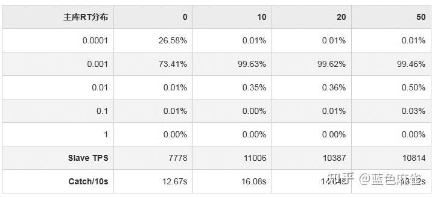

**1：[binlog_group_commit_sync_delay](https://link.zhihu.com/?target=http%3A//dev.mysql.com/doc/refman/5.7/en/replication-options-binary-log.html%23sysvar_binlog_group_commit_sync_delay)**
全局动态变量，单位微妙，默认0，范围：0～1000000（1秒）。

表示binlog提交后等待延迟多少时间再同步到磁盘，默认0，不延迟。设置延迟可以让多个事务在用一时刻提交，提高binlog组提交的并发数和效率，提高slave的吞吐量。

**2：[binlog_group_commit_sync_no_delay_count](https://link.zhihu.com/?target=http%3A//dev.mysql.com/doc/refman/5.7/en/replication-options-binary-log.html%23sysvar_binlog_group_commit_sync_no_delay_count)**
全局动态变量，单位个数，默认0，范围：0～1000000。
表示等待延迟提交的最大事务数，如果上面参数的时间没到，但事务数到了，则直接同步到磁盘。若[binlog_group_commit_sync_delay](https://link.zhihu.com/?target=https%3A//dev.mysql.com/doc/refman/5.7/en/replication-options-binary-log.html%23sysvar_binlog_group_commit_sync_delay)没有开启，则该参数也不会开启。

MySQL5.7引入了基于逻辑时钟的并行复制的概念，让保守延迟困扰的我看到了一丝曙光。开心的将典型的库（6500/s TPS）升级到5.7之后，发现在默认的参数下提升并不明显。受[Percona的关于并行复制](https://link.zhihu.com/?target=https%3A//www.percona.com/blog/2016/02/10/estimating-potential-for-mysql-5-7-parallel-replication/)这篇文章的启发，开始对参数binlog_group_commit_sync_delay调整对实际环境影响的验证。
**环境**
40核
buffer_pool_size >>data_size
数据目录使用SAS口的SSD
主库6500/s的insert、update、delete
slave_parallel_type=LOGICAL_CLOCK
备库slave_parallel_workers=10
**测试用例**
调整binlog_group_commit_sync_delay
观察**主库语句响应时间**、**备库TPS**和**延迟追回效率** 三个指标
测试结果

 