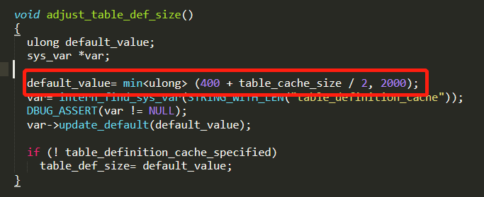
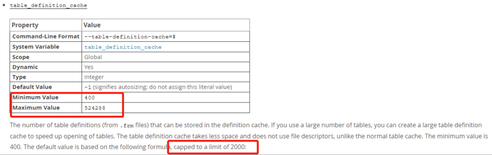
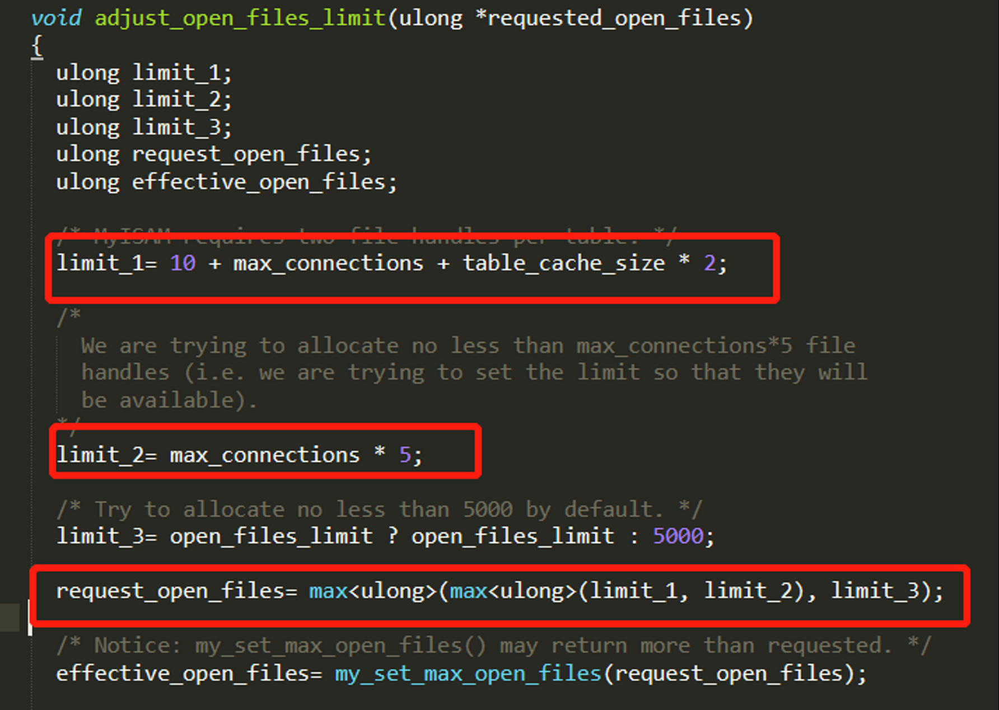
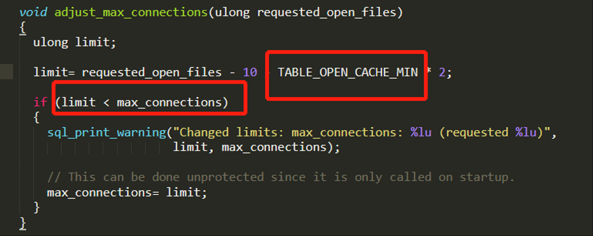
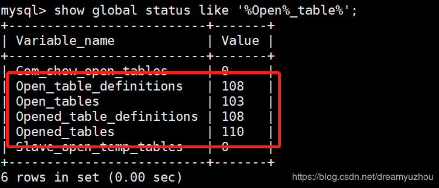

## MySQL关于Table cache设置，看这一篇就够了 

**导读：**本文整理对table_definition_cache，table_open_cache和table_open_cache_instances这几种参数的理解，希望对大家有帮助。

先看看官网怎么说:

**1. table_definition_cache**

the number of table definitions (from .frm files) that can be stored in the definition cache. If you use a large number of tables, you can create a large table definition cache to speed up opening of tables. The table definition cache takes less space and does not use file descriptors, unlike the normal table cache.

理解下来，就是控制总frm文件的数量，还是个hash表，内部维护。如果打开的表实例的数量超过了table_definition_cache设置，LRU机制将开始标记表实例以进行清除，并最终将它们从数据字典缓存中删除。
 简单通俗点frm文件有多少，就设置多少了。

 \2. table_open_cache

The number of open tables for all threads. Increasing this value increases the number of file descriptors that mysqld requires. You can check whether you need to increase the table cache by checking the Opened_tables status variable

所有线程打开的表的数量。增加这个值会增加mysqld需要的文件描述符的数量。可以通过检查Opened_tables状态变量来检查是否需要增加表缓存。

是不是可以理解为ibd/MYI/MYD 文件，打开数量了。但MySQL内部需要对表进行操作的时候，第一需要找到最上层文件的句柄信息，table_open_cache_instances是能提供的，之后对应的寻找ibd,MYI,MYD文件。官网对于这部分没有明确说明。

**3. table_open_cache_instances**

The number of open tables cache instances. To improve scalability by reducing contention among sessions, the open tables cache can be partitioned into several smaller cache instances of size table_open_cache / table_open_cache_instances . A session needs to lock only one instance to access it for DML statements. This segments cache access among instances, permitting higher performance for operations that use the cache when there are many sessions accessing tables.

打开的表缓存实例的数量。为了通过减少会话间的争用来提高可伸缩性，可以将打开的表缓存划分为几个大小为table_open_cache / table_open_cache_instances的较小缓存实例。一个会话只需要锁定一个实例就可以访问DML语句。写到这里就已经大致了解到 如下关系:

table_definition_cache > table_open_cache_instances > table_open_cache

 

**4. table相关的限制有哪些？**

MySQL是多线程，对于并发同一个文件，不同数据的情况下，会打开多个文件，会存在哪些限制呢？下面是源代码里逻辑是这样。

**1)table_definition_cache
 .frm文件其实最大值只能到2000,跟官网给得最大值没关系
** 

Max值和说明有冲突，实际确认下来就是2000。

**2）open_files_limit
** 

limit_1= 10 + max_connections + table_cache_size * 2;

limit_2= max_connections * 5;

limit_3= open_files_limit ? open_files_limit : 5000;

可以看出max_connections有关，需要借助于table open file 的信息。

 

**3）max_connections超出打开文件数量的伐值的时候，也跟table_open_cache有关
**

**4）table_cache_size 计算方式
** 

备注：TABLE_OPEN_CACHE_MIN=table_open_cache

**5. 定期查看open table 情况
** 

 通过 show global status like ‘%Open%_table%’; 确认是否调优这个参数。

 

**6.常见故障应对：**

如：在运行数据库通过 show processlist 可看到大量的 Opening tables、closing tables状态，导致应用端访问操作。

需要确认 table_open_cache=最大并发数表数量（join里可能用到2张表），时候满足当前配置。

如：但并发线程数达到1000，假设这些并发连接中有40%是访问2张表，其他都是单表，那么cache size就会达到（100040%2+100060%*1）=1400
 建议定期监控值：

Open_tables / Opened_tables >= 0.85    表的重复使用率
 Open_tables / table_open_cache <= 0.95  缓存里存在已打开的表

 

**1）5.7版本已经支持在线动态改配置信息**

set global table_definition_cache=2000;
 set global table_open_cache=3000;
 set global max_connection= 2000;

 

table_open_cache_instances参数修改需要重新启动服务。

**2）无法更改的时候，可通过flush操作，但存在问题**

MySQL closes an unused table and removes it from the table cache under the following circumstances: When the cache is full and a thread tries to open a table that is not in the cache.When the cache contains more than table_open_cache entries and a table in the cache is no longer being used by any threads.When a table-flushing operation occurs. This happens when someone issues a FLUSH TABLES statement or executes a mysqladmin flush-tables or mysqladmin refresh command.

 

这里好奇FLUSH TABLE操作，有如下隐患：
 关闭所有打开的表，强制关闭所有正在使用的表，并刷新查询缓存和准备好的语句缓存。FLUSH TABLES还会从查询缓存中删除所有查询结果，比如RESET查询缓存语句。

 

**备注：
 另外 table_definition_cache为每个表的表空间中可以同时打开的InnoDB文件的数量定义了一个软限制，这也是由innodb_open_files控制的。**

如果设置了table_definition_cache和innodb_open_files，则使用最高设置。如果两个变量都没有设置，则使用默认值更高的table_definition_cache。

**总结：
 Table缓存关于的参数table_definition_cache，table_definition_cache，table_open_cache_instances 按照实际环境和需求进行设置外，还有跟max_connections也要设置合理。有些环境里发现max_connections过大，过小设置的问题，设置过大可能会存在等待的情况
 这些参数控制不好，会给MySQL数据库系统带来性能上的瓶颈。如果把握不是很准，有个很保守的设置建议：把MySQL数据库放在生产环境中试运行一段时间，然后把参数的值调整得比Opened_tables的数值大一些，并且保证在比较高负载的极端条件下依然比Opened_tables略大。**

希望工作中，有帮助。

墨天轮原文链接：https://www.modb.pro/db/15158（复制到浏览器中打开或者点击左下角的“阅读原文”）

 

 