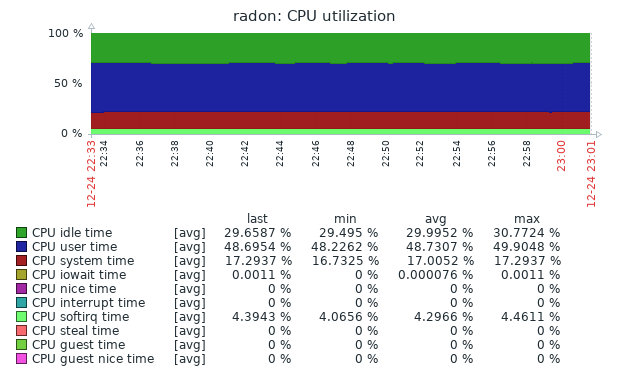

## MySQL分库分表中间件-RadonDB性能测试                

​                                                                                                                                                                                    吴炳锡                                                                                                                                                                                          [                         知数堂                      ](javascript:void(0);)                                                              *3月29日*                

​                                    

​                                                                                                

> 作者：吴炳锡  作者介绍：知数堂联合创始人及MySQL高级讲师，3306π社区联合创始人，腾讯TVP成员。

##  

本文导读：

1.  背景介绍
2.  测试目的
3.  基本环境介绍
4.  测试数据收集
5.  数据分析
6.  反思优化实战
7.  使用RadonDB的建议


本文8千字+，阅读估计用时30分钟，建议在PC端阅读。测试中的相视解析：

​                                                                                                                                                                                                                                 

 

可以关注知数堂腾讯课堂上我分享的RadonDB相关视频。


## **背景介绍**

本次测试使用Radon v1.0.8版本

```
Radon v1.0.8https://github.com/radondb/radon/releases
feature: support partition list (#491 @andyli029)feature: support time type conversion to numeric type (#455 @zhyass)feature: reshard single table to the partition table (#436 @andyli029)feature: 'set autocommit=0' auto txn begin (#298 @andyli029)feature: improve syntax used in create table and keep consistent with MySQL (#190 @hustjieke)feature: attaching one mysql as Radon’s backend (#399 @andyli029)feature: porting code radon-shift to be a base library in vendor (#440 @hustjieke)feature: More detailed and limited privilege (#470 @hustjieke)refactoring: refactoring code about planner (#480 @zhyass)
```

这里面有两个比较诱人的功能，

1. 支持原来没有分区的表(Single table)直接alter成partiton table，
2. 可以直接attch到一个后端的MySQL节点加入到Radon中，让Radon提供连接池的功能。这两个属于比较诱人的功能，让开发人员更加灵活的使用radon，这块在功能测试中讲解。这两项功能参考： [快速实现wordpress迁移到RadonDB上](https://mp.weixin.qq.com/s?__biz=MzI1NjkzNDU4OQ==&mid=2247485561&idx=1&sn=1d7b3616aa614668f9f656528d5ed1bc&scene=21#wechat_redirect)

了解一个产品，从性能测试下手是最好的方法，这里就是针对金融级MySQL解决方案RadonDB中的核心组件Radon进行一次性能测试。

### 测试目的

1. 了解Radon在常规硬件下性能指标大概情况
2. 分析性能瓶颈及应对方法
3. 理解RadonDB的最佳扩容方法
4. 了解Radon的最佳使用场景

## 基本环境介绍

特别说明：本次测试基本青云公有云环境测试。

全部节点选用：专业增强型 16核16G内存，数据库节点选用：SSD企业级 600G空间。这个级别的硬件环境基本上跑NewSQL产品都跑不起来，这个测试也是给想使用MySQL分布式（分库分表），又不想在硬件上花非常大投入的朋友一个参考。

基本环境如下：

| 机器名   | ip          | 配置情况                                |
| :------- | :---------- | :-------------------------------------- |
| radon    | 192.168.0.5 | 16核16G内存 Radon 1.0.8                 |
| mysql03  | 192.168.0.3 | 16核16G内存 600G SSD企业级 MySQL 5.7.28 |
| mysql04  | 192.168.0.4 | 16核16G内存 600G SSD企业级 MySQL 5.7.28 |
| mysql07  | 192.168.0.7 | 16核16G内存 600G SSD企业级 MySQL 5.7.28 |
| sysbench | 192.168.0.6 | 16核16G内存 600G SSD企业级              |
| zabbix   | 192.168.0.2 | 一般云主机2c4g，少量云盘即可            |

环境部署问题可以参考：[利用RadonDB实现MySQL分库分表](https://mp.weixin.qq.com/s?__biz=MzI1NjkzNDU4OQ==&mid=2247485531&idx=1&sn=12c561617ba8bfa3bdd2b4f3a48926d1&scene=21#wechat_redirect)这里为了简化环境，MySQL都是单点对外提供服务没在做高可用，本次测试也主要为了测试Radon。

Radon中添加后面存储节点

```
curl -i -H 'Content-Type: application/json' -X POST -d  \'{"name": "backend1", "address": "192.168.0.3:3306", \"user":"wubx", "password": "wubxwubx", "max-connections"\:600}' http://127.0.0.1:8080/v1/radon/backend
curl -i -H 'Content-Type: application/json' -X POST -d\'{"name": "backend2", "address": "192.168.0.4:3306", \"user":"wubx", "password": "wubxwubx",\"max-connections":600}' \http://127.0.0.1:8080/v1/radon/backend
```

这里只是为了测试Radon的性能问题，所以没有按官方的要求部署后面的MySQL Plus(xenon)，如果对于后面MySQL Plus部署有兴趣的，可以参考 [利用RadonDB实现MySQL分库分表](https://mp.weixin.qq.com/s?__biz=MzI1NjkzNDU4OQ==&mid=2247485531&idx=1&sn=12c561617ba8bfa3bdd2b4f3a48926d1&scene=21#wechat_redirect) 中Xenon的部署。

## 测试方法

本次测试利用官方标准的sysbench测试：https://github.com/akopytov/sysbench为了测试Radon的性能，对于MySQL后面的数据采用了较小的数据集：10表，每张表100万的数据集，争取数据全部在MySQL的Buffer Pool缓存命中请求。测试 。

```
sysbench /usr/local/share/sysbench/oltp_read_write.lua  \             --mysql-host=$DBIP \             --mysql-port=$DBPORT \             --mysql-user=$DBUSER \             --mysql-password=$DBPASSWD \             --mysql-db=$DBNAME \             --tables=$TBLCNT \             --table-size=$ROWS \             --report-interval=$REPORT_INTERVAL \             --threads=${thread} \             --reconnect=0 \             --db-ps-mode=disable \             --skip_trx=1 \             --auto_inc=0 \             --time=$DURING run >> ${rounddir}/sysbench_${thread}.log
```

脚本设计思路

1. 使用Sysbench的自增产生数据，避免使用MySQL内的自增。如果使用MySQL内的自增，数据生成不可能重现，对于Radon中的如果没显式对自增列声明值，会利用当前的时间戳生成一个bigint的值。
2. sysbench中是显式事务模型了，生产环境用的比较少，一般利用MySQL的自动提交进行测试。遇到 1062 Duplicate entry：https://github.com/akopytov/sysbench/issues/23  ,作者给的建议是忽略该错误。我这里处理办法，修改oltpcommon.lua中 stetdefs中 INSERT INTO  更改为：REPLACE INTO。
3. 生成一批数据压测两轮。

## 测试数据收集

### 测试模型


基于主键的增删改查

1. 

2. ```
     -- execute_point_selects:主键等值查询SELECT c FROM sbtest%u WHERE id=?-- execute_index_updatesUPDATE sbtest%u SET k=k+1 WHERE id=?--  execute_non_index_updates()UPDATE sbtest%u SET c=? WHERE id=?-- execute_delete_inserts()DELETE FROM sbtest%u WHERE id=?INSERT INTO sbtest%u (id, k, c, pad) VALUES (?, ?, ?, ?)
   ```

3. ` `

4. 主键混合全量操作

5. - 

6. ```
   含基于主键的增删改查，同时增加了--  execute_simple_ranges()  基于主键的区间查询SELECT c FROM sbtest%u WHERE id BETWEEN ? AND ?--  execute_sum_ranges() 基于主键区间的统计SELECT SUM(k) FROM sbtest%u WHERE id BETWEEN ? AND ?--  execute_order_ranges()  简单的范围查询SELECT c FROM sbtest%u WHERE id BETWEEN ? AND ? \ORDER BY c--  execute_distinct_ranges() 排序+去重范围查询SELECT DISTINCT c FROM sbtest%u WHERE id BETWEEN ? \AND ? ORDER BY c
   ```

### 对Radon进行配置调整实现8，32， 64个子表的式测试。

在8，32，64个子表的情况下，分别进行了基于主键的等值操作，基于主键的等值和区间，聚合，排序（全量）操作

#### 基于主键等值增删改查

| 连接数 | 指标    | 8 part  | 32 part | 64 part |
| :----- | :------ | :------ | :------ | :------ |
|        | TPS     | 5533.21 | 5564.28 | 5581.2  |
| 400    | QPS     | 77464.8 | 77900   | 78136.7 |
|        | Latency | 81.5    | 71.885  | 71.665  |
|        | TPS     | 5601.16 | 5618.59 | 5560.35 |
| 500    | QPS     | 78416.3 | 78660.2 | 77844.9 |
|        | Latency | 89.26   | 88.975  | 89.955  |
|        | TPS     | 5667.96 | 5685.79 | 5563.2  |
| 600    | QPS     | 79401   | 79601   | 77884.7 |
|        | Latency | 105.845 | 105.52  | 107.97  |
|        | TPS     | 5671.54 | 5701.95 | 5388.48 |
| 900    | QPS     | 79401.5 | 79953.2 | 75438.7 |
|        | Latency | 158.67  | 157.56  | 167.64  |

**数据图形展示**


**主键混合全量操作**

| 连接数 |         | 8个子表 | 32个子表 | 64个子表 |
| :----- | :------ | :------ | :------- | :------- |
|        | TPS     | 2127.1  | 971.66   | 630.715  |
| 400    | QPS     | 38288   | 17489.8  | 11352.9  |
|        | Latency | 188.04  | 411.645  | 634.155  |
|        | TPS     | 2148.6  | 984.21   | 629.205  |
| 500    | QPS     | 38675   | 17715.8  | 11325.7  |
|        | Latency | 232.7   | 507.98   | 794.58   |
|        | TPS     | 2163.2  | 993.395  | 624.35   |
| 600    | QPS     | 38938   | 17881.1  | 11238.3  |
|        | Latency | 277.34  | 603.93   | 960.92   |
|        | TPS     | 2181.7  | 1028.01  | 614.89   |
| 900    | QPS     | 39271   | 1850.1   | 11068    |
|        | Latency | 412.48  | 875.33   | 1463.45  |

**数据图形展示**


## 数据分析

### 基于主键的等值查询

从基于主键的等值操作来看Radon的性能相当可观， 在16C16G内存的机器上可以跑到将近8万的QPS，近6千TPS，每个TPS中包含5条SQL操作。大概的SQL操作：

```
-- execute_point_selects:主键等值查询SELECT c FROM sbtest%u WHERE id=?-- execute_index_updatesUPDATE sbtest%u SET k=k+1 WHERE id=?--  execute_non_index_updates()UPDATE sbtest%u SET c=? WHERE id=?-- execute_delete_inserts()DELETE FROM sbtest%u WHERE id=?INSERT INTO sbtest%u (id, k, c, pad) VALUES (?, ?, ?, ?)
```

基于400个链接压测图形对比：


从图形上看Radon在基于主键（拆分键）等值查询中性能区别不大。我们再来看一下，整体系统资源使用情况（因为这里对于内存和IO压力不大，不在展示，SSD企业级云盘性能不错）：

8分片时资源使用情况基于8个子表的主键等值操作资源使用情况（MySQL节点选择MySQL03）：


基于64个子表的主建等值操作资源使用情况（MySQL节点选择MySQL04）


从整体上看Radon的CPU使用在75%左右，网卡流量接近200M，后端MySQL的CPU使用在65%左右，网卡流程100M左右，MySQL上单节点的QPS接近4万左右和Sysbench测试最终的QPS接近。从连接数据400，500， 600， 900 四个级别的连接数压测来看，连接数据上升，性能没有太多的提升，反而响应时间延时比较明显。但可以看到MySQL没有随着Radon的连接数上升出现CPU的升高的现象。

基于该测试可以了解到：

- Radon在基于拆分键（默认按id进行hash拆分）情况下，性能表现比较好，对于资源使用上，需要较多的CPU，但不会使用太多内存。

- Radon有较好的连接池保护功能，随着连接数上升，不会把后面的MySQL压垮

- Radon本身的分库分表后，在基于分区键的等值类查询方面非常高效。

  

### 基于主键的等值区间全量查询

从基于主键的等值+区间类操作来看Radon的性能表现有点比较差， 在16C16G内存的机器上可以跑到将近4万的QPS，近2千多一点的TPS，每个TPS中包含9条SQL操作，随着分表数量增多后性能更差。大概的SQL操作：

```
-- execute_point_selects:主键等值查询SELECT c FROM sbtest%u WHERE id=?-- execute_index_updatesUPDATE sbtest%u SET k=k+1 WHERE id=?--  execute_non_index_updates()UPDATE sbtest%u SET c=? WHERE id=?-- execute_delete_inserts()DELETE FROM sbtest%u WHERE id=?REPLACE INTO sbtest%u (id, k, c, pad) VALUES (?, ?, ?, ?)
----------以下SQL在Radon中执行性能和分表数量有关---------------  execute_simple_ranges()  基于主键的区间查询    SELECT c FROM sbtest%u WHERE id BETWEEN ? AND ?--  execute_sum_ranges()  基于主键区间的统计    SELECT SUM(k) FROM sbtest%u WHERE id BETWEEN ? AND ?--  execute_order_ranges()  简单的范围查询    SELECT c FROM sbtest%u WHERE id BETWEEN ? AND ? ORDER BY c--  execute_distinct_ranges() 排序+去重范围查询    SELECT DISTINCT c FROM sbtest%u WHERE id BETWEEN ? AND ? ORDER BY c
```

从收集到数据，400个连接数对比：


从图形上看随着分片数量上升级后性能反而是下降的。为什么会这样呢？我们再来看一下系统资源使用情况，这里因为图形较多，我们这里只获取Radon机器和其中一个Backend的一些资源使用情况来做分析：

**基于8个子表的全量请求操作：**




**基于64个子表的全量请求操作：**


从资源使用上看， 随着分表数量增加后，在请求不变的情况下后端MySQL的CPU基本达到100%，后端MySQL已经达到性能瓶颈。再来对比一下Radon和MySQL上看到QPS：


| 子表数 | Radon上TPS | Radon上QPS | MySQL单个backend上的QPS |
| :----- | :--------- | :--------- | :---------------------- |
| 8      | 2127.12    | 38288.18   | 49940                   |
| 64     | 630.715    | 11352.885  | 85000（约）             |

从测试脚本中了解到该测试每个TPS相当于比原来基于主键操作的TPS多了4个SQL请求，但实质上后面对于数据库的请求，随着分表的数量增多后呈现倍增多。例如：在分8个子表的情况，每个TPS中会有4个SQL会拆分成：4X8=32个请求， ，拆分成64个子表时每个TPS中4个SQL会拆分成 4*64 = 256个请求，但这类请求中有很多无效的请求，但同样对后面MySQL节点的CPU也是有较大的压力。所有请求在主节点上进行，显的压力较大。

基于该测试可以了解到：

1. 从设计上讲Radon默认是基于Hash的拆分策略，适合在大规模数据写入场景和基于拆分键的等值查询。从实际压测上看，这块表现非常不错。
2. 基于基于hash拆分，对于区间查询和非拆分键的查询，存在请求扩大的问题，这种请求会大量的无效的查询会给后端MySQL节点带来CPU较高的问题（现有业界的中间件都在这样的问题，例如：MyCAT）
3. 后端节点不够多的情况下，不要拆分太多分表，为了应对更多的分表问题，也可以考虑对后端MySQL引入更强劲的CPU,从而获得性能提升。

## 反思优化实战

假设生产环境我们遇到Radon有性能瓶颈，我们怎么升级呢？在本次测试中使用的16C16G的机器，属于特低端硬件环境。假设对本次环境扩容提升性，进行两种方法尝试：

1. 通过升级Radon机器性能，从原来的16C16G升级到32C64G
2. 给Radon节点增加新的存储节点

### 提升Radon机器性能

这里把Radon从原来16C16G升级到32C64G内存（现在来看内存不是瓶颈），基于上面的压力模型在升级的机器上压测64个子表的情况下，分别压测基于主键的等值操作和区间类操作。

直接看数据


整体资源使用情况Radon CPU使用情况


存储节点CPU使用情况


通过数据可以观察可知：

1.  在基于主拆分键等值查询写入情况下，后面的存储节点MySQL CPU还有空闲，没有达到资源限制，通过扩容Radon获取到了不错的性能提升，本次测试大概提升了50%。
2. 在混合操作的中可以看到提升Radon也没有获到性能提升，原因是存储节点MySQL已经达成瓶颈。

### 扩展后面存储节点数量

Radon在使用32C64G的基础上，把存储节点扩展成为3个16C16G节点

直接看数据


Radon CPU使用情况


存储节点CPU使用情况


通过本次扩容后端节点对比可以看到，扩展后端节点是可以获得不错的性能提升。但通过容降低了响应时间，提高了响应能力。

1、 通过添加节点基于主键的等值操作相对于两个后端MySQL有20%左右提升

2、 对于混合操作有50%左右的提升，但根据观察Radon CPU使用超过65%（基于主键等值操作）， 混合请求时MySQL CPU也接近于100%（这个时间段Radon CPU反而降到50%左右）

从这个测试来看，如果是混合操作较多的情况下，还是需要再扩展一下后端的存储节点，全是等值类操作，可以考虑在提高Radon配置从而获取一个不错的性能。

### 总结分析

在后端节点CPU还有空闲的情况下（不要超过70%），提高Radon的配置，可以获取不错的性能提升；当后面节点CPU已经达成瓶颈，提升Radon性能可以降低响应时间，但基本没有提升性能的空间。在强劲的Radon配置后面添加存储节点，对于性能提升较大（Radon CPU使用接近于65%就可以考虑提升Radon机器的配置）。

感觉对于Radon如果支持读写分离，让从库节点支持一些读操作，对于区间类查询，估计会有2-3倍的性能提升，期待Radon放出来该功能。

## 使用RadonDB建议

通过本次压测在16C16G的机器上Radon上获得一个不错的性能指标。另外从部署上看，Radon整体架构也比较简单，而且在性能方面，还不错。整体测试后，觉得Radon适合场景

1. 订单类数据，例如：海量写少量的读取（基于订单号的等值查询）
2. 用户类数据，基于用户Id来操作的场景，少量区间的查询
3. 好友关系类数据等等
4. 海量数据小规模的OLAP（Radon限制了大量数据查询的总行数）

暂不适用场景：

1. 高并发大量区间类，聚合类，排序类，大数据量的join操作场景（如果要使用这块功能，对于Radon的内存也有较大的需求）
2. 模糊类查询数据，中文搜索引，目前Radon使用的InnoDB的中文搜索
3. 子查询开发中，估计个把月可以Release，看github issue中在1.0.9版本中释放出来。

Radon使用硬件配置MySQL服务器使用硬件，对于Radon来讲硬件资源不用太高，可以实现后期慢慢扩容也可以。