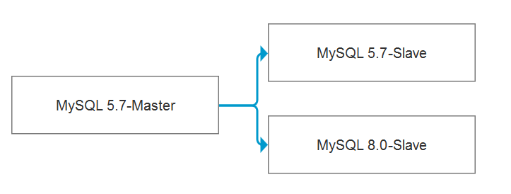
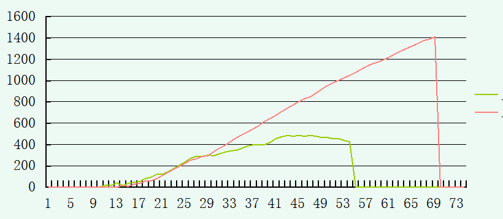

## MySQL延迟问题，无脑升级到8.0不是解决之道 

最近有一个数据库的延迟问题比较明显，大体的逻辑是有一批数据需要在缓存中校验，如果数据过期，就需要重新刷新数据，整个数据量大概有2000万，更新的数据量平均在600万左右，也就意味着基线变更数据是600万左右，需要根据数据的热度适时更新。

大体逻辑如下：

在缓存层面进行校验，查看数据的状态，

select xxxxx from test_list where uid=xxxx;

如果存在且失效，则进行更新：

update test_list set xxxx  where uid=xxxx;

如果不存在则进行数据插入：

insert into test_list values(xxxx,xxxxx);
 

最早收到相关报警，是从高可用层面报出的，提示数据库产生了较大的延迟，导致高可用检测失败。查看历史的监控数据，发现在早间的一个时间段，比如9:00~10:00，会有明显的数据延迟情况。

其实可以做一下估算，每秒的QPS大概在2000左右（加上查询部分），产生的binlog是比较集中的。

可以补充一下对于延迟问题的分析，在高峰时段，没有任何慢日志，临时开启了general log，里面的逻辑也是比较清晰简单。在这种情况下想做优化，貌似空间不大，但是每天早上会收到高可用报警真是很烦。
 

于是为了能够快速收场，看MySQL 8.0在复制方面有了新特性writeset，为了并行对比已有的COMMIT_ORDER,WRITESET模式，我在这套环境的从库上面搭建了MySQL 8.0的Slave节点。

整个部署架构是类似这样的形式。

第二天静等数据结果，实际结果让我着实有些吃惊，开启了writeset之后，红色部分就是8.0的表现，相比绿色的部分MySQL 5.7差了很多。
 

当然这块可以对新版本的复制特性进行后续的讲解，调整为默认的设置之后，依然有差距。 

这个问题的解决之道其实得跳开已有的背景和数据来看，而要从整个流程来切入，我从开发同学那里要来了相关的代码逻辑，也做了一些分析，下午的时候和开发同学进行了进一步的沟通，对于这个问题的处理结果还是颇有自信，期待明天的数据。
 