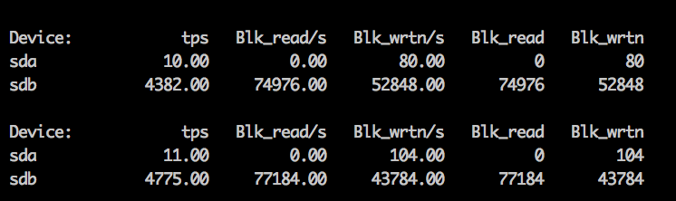
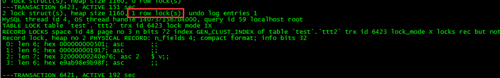
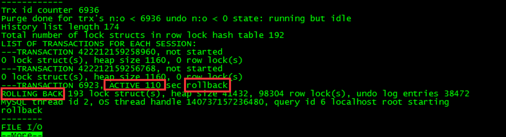
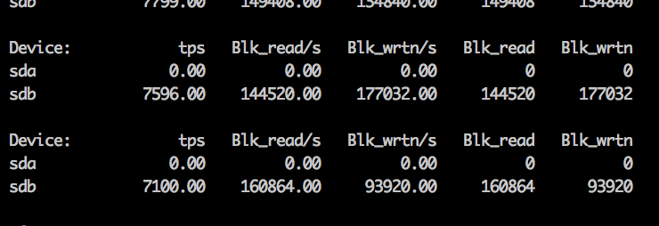

## MySQL：5.6 大事务show engine innodb status故障一例 

**导读**：

作者：高鹏（网名八怪），《深入理解MySQL主从原理32讲》系列文的作者。

 

今天遇到一个朋友的线上问题，大概意思就是说，我有一个线上的大事务大概100G左右，正在做回滚，当前看起来似乎影响了线上的业务，并且回滚很慢，是否可以减轻对线上业务的影响。并且朋友已经取消了双1设置，但是没有任何改观。版本MySQL 5.6首先我们需要知道的是，MySQL并不适合大事务，大概列举一些MySQL中大事务的影响：

- binlog文件作为一次写入，会在sync阶段消耗大量的IO，会导致全库hang主，状态大多为query     end。
- 大事务会造成导致主从延迟。
- 大事务可能导致某些需要备份挂起，原因在于flush table     with read lock，拿不到MDL GLOBAL 级别的锁，等待状态为 Waiting for global read lock。
- 大事务可能导致更大Innodb     row锁加锁范围，导致row锁等待问题。
- 回滚困难。

基于如上一些不完全的列举，我们应该在线上尽可能的避免大事务。好了我们下面来进行问题讨论。

 **一、问题**前面已经说了，我们已经取消了双1设置，所谓的双1就是 sync_binlog=1和 innodb_flush_log_at_trx_commit=1。这两个参数线上要保证为1，前者保证binlog的安全，后者保证redo的安全，它们在数据库crash recovery的时候起到了关键做用，不设置为双1可能导致数据丢失。具体的参数含义不做过多讨论。但是这里的问题是即便取消了双1，没有任何改观，因此似乎说明IO问题不是主要瓶颈呢？下面我们来看几个截图：

- **vmstat 截图**

- **iostat 截图**

- **top -Hu截图**

![6 users ， load average ． 4 ． 0 4 ． 2 7 ， 4 · 58  top 一 09 ： 5 23 up 350 days ， 13 ： 2 0 ，  0 zombie  0 stopped ，  5 running. 6623 sleeping ，  Tasks: 6623 total,  0 ． 3 s 0 ． 0 st  R 9 3  3 7 ， 7 g  90g 77 0 日  R 3 4  97 ， 7g  36 ． 2  97 ． 7g  12  17 ． 5  7 0 ： 2 4  SI · 73  1 S ： S 0  9396 S 10  17 ． S  36 ． 2  97 。 7g  9 7 · 7g  Sl ． 7g  9 、 9  1 丆 5  9 、 2  17 ． S  9 4 ： 2 9  9 7 0 g  9 ． 2  36 ． 2  SS ： 12 ．  97 ． 7g  8 、 3  36 ． 2  54 ． 21  10 ． 57  1.8%sy ，  Cpu(s) ： IS 四 u  彗 e 263513168k total.  Svap: 134217724k total.  0 ， OZn 辶 80 ． 2 id ， 1 四 Z a ， 上 0%hi.  2S165E440k used ，  S92948k used  11856728k f ree ， 2 4 74 4 4 k bu ers  133 5 24 7 76 k free, 58967064k cached  102D23 mysql  349498 mysql  423301 nysql  1302s8 nysql  ISS8S8 nysql  430014 nysql  39972S nysql  28266 nysql  1s1 《 32 nysql  430193  20  20  20  20  20  20  20  20  20  20  20  0  0  0  0  0  0  0  0  0  0  0  0 9 7 ， 7g  0 25 ． 4g  7  0 97 ， 73  Sl  S 1  3 7  97  7g  7g  7g  SI 、 7g  7g  7g  309  90q  9 Og  16g  90g  4 3g  43g  90g  90g  43g  4 3g  9 Og  90g  43g  90q  9 Og  7 70 8  7 7 0 日  7 7 0 日  8 8 3 6  90g 7708  9 3 9 6  9 3 9 6  77 0 8  7 7 0 8  9396  7708  7708 S  S  9396 S 11 · 8  7708 S 10 ． 8  7 7 S 10 、 5  S  S  S  S  S  S  S 33 ． 1  S 18 丐  S 16 四  7708 S 13 ． 4 36 ． 2  7 、  4  1  8  430112  1S6404  183306  427667  109284  1S6200  4276s3  31S68  nysql  nvsql  mysql  nysql  洫 y  mysql  y 啞 al  3 6 ．  2  3 6  36  2  3 6  2  36.  17 ．  36 · 2  mysqld  6 7 ： 10  01  mysqid  63 用 9 · 26  mysqld  51 ： 10 ． 0 9  mysqld  2 32 ： 37 ． 2 7  mysqld  3 76 3 3 用 8  71 ： 06 ． 42 mysqld  mysqld  13 39 丐 2  7 5 mysqld  nysqld  65  SO ： 4 93  mysqld  71 《 38 ． IS  mysqld  mysqld  7 ： 28  ． 3 0  mysqld  80  mysqid  mysqld  ， 53  mysqld  43 二 S7 用 9  mysqLd  ](clip_image004.jpg)

我们重点观察vmstat的r 和 b列发现，IO队列没有有什么问题 并且wa%并不大。我们观察iostat中的%util和读写数据大小来看问题不大，并且tps远没达到极限（SSD盘）。我们top -Hu 可以观察到 %us不小，并且有线程已经打满了（99.4%CPU）一个CPU核。
 因此我们可以将方向转为研究CPU瓶颈的产生，希望能够对问题有帮助，然后从提供的perf top中我们有如下发现：

好了我们将问题先锁定到lock_number_of_rows_locked这个函数上。

 二、函数`lock_number_of_rows_locked`的作用**朋友用的5.6，但是我这里以5.7.26的版本进行描述。然后下一节描述5.6和5.7算法上的关键差异。不知道大家是否注意过show engine innodb status中的这样一个标志：

这个标记就来自函数lock_number_of_rows_locked，含义为当前事务加行锁的行数。而这个函数包裹在函数lock_print_info**_**all_transactions下面，lock_print_info_all_transactions函数是打印我们通常看到show engine innodb status中事务部分的核心参数。我们来看一下简单的流程：

  PrintNotStarted print_not_started(file);//建立一个结构体，目的是做not start 事务的打印

  ut_list_map(trx_sys->mysql_trx_list, print_not_started); //这个地方打印出那些事务状态是no start的事务。mysql_trx_list是全事务。

  const trx_t*  trx;

  TrxListIterator trx_iter; //这个迭代器是trx_sys->rw_trx_list 这个链表的迭代器

  const trx_t*  prev_trx = 0;

  /* Control whether a block should be fetched from the buffer pool. */

  bool    load_block = true;

  bool    monitor = srv_print_innodb_lock_monitor && (srv_show_locks_held != 0);

  while ((trx = trx_iter.current()) != 0) { //通过迭代器进行迭代 ，显然这里不会有只读事务的信息，全部是读写事务。

   ...

​    /* If we need to print the locked record contents then we

​    need to fetch the containing block from the buffer pool. */

​    if (monitor) {

​      /* Print the locks owned by the current transaction. */

​      TrxLockIterator& lock_iter = trx_iter.lock_iter();

​      if (!lock_trx_print_locks( //打印出锁的详细信息

​          file, trx, lock_iter, load_block)) 

简单的说就是先打印哪些处于not start的事务，然后打印那些读写事务的信息，当然我们的回滚事务肯定也包含在其中了，需要注意的是只读事务show engine不会打印。对于处于回滚状态的事务我们可以在show engine中观察到如下信息：

函数trx_print_low可以看到大部分的信息，这里就不详细解释了。既然如此我们需要明白lock_number_of_rows_locked是如何计算的，下面进行讨论。
 三、函数lock**_number_of_rows_locked的算法变化**上面我们说了函数lock_number_of_rows_locked函数会打印出当前事务加行锁的行数。那么我们来看一下5.6和5.7算法的不同。

- 5.7.26

实际上只有如下一句话：

return(trx_lock->n_rec_locks);

我们可以看到这是返回了一个计数器，而这个计数器的递增就是在每行记录加锁后完成的，在函数lock_rec_set_nth_bit的末尾可以看到 ++lock->trx->lock.nreclocks ，因此这是一种预先计算的机制。因此这样的计算代价很低，也不会由于某个事务持有了大量的锁，而导致计算代价过高。

- 5.6.22

随后我翻了一下5.6.22的代码，发现完全不同如下：

  for (lock = UT_LIST_GET_FIRST(trx_lock->trx_locks); //使用for循环每个获取的锁结构

​    lock != NULL;

​    lock = UT_LIST_GET_NEXT(trx_locks, lock)) {

​    if (lock_get_type_low(lock) == LOCK_REC) { //过滤为行锁

​      ulint  n_bit;

​      ulint  n_bits = lock_rec_get_n_bits(lock);

​      for (n_bit = 0; n_bit < n_bits; n_bit++) {//开始循环每一个锁结构的每一个bit位进行统计

​        if (lock_rec_get_nth_bit(lock, n_bit)) {

​          n_records++;

​        }

​      }

​    }

  }

  return(n_records);

我们知道循环本身是一种CPU密集型的操作，这里使用了嵌套循环实现。因此如果在5.6中如果出现大事务操作了大量的行，那么获取行锁记录的个数的时候，将会出现高耗CPU的情况。
 四、原因总结和解决有了上面的分析我们很清楚了，触发的原因有如下几点：

- MySQL 5.6版本
- 有大事务的存在，大概100G左右的数据加行锁了
- 使用了show engine innodb status

这样当在统计这个大事务行锁个数的时候，就会进行大量的循环操作。从现象上看就是线程消耗了大量的CPU资源，并且处于perf top的第一位。

知道了原因就很简单了，找出为频繁使用show engine innodb status的监控工具，随后业务全部恢复正常，IO利用率也上升了如下：

当然如果能够使用更新的版本比如5.7及8.0 版本将不会出现这个问题，可以考虑使用更高版本。分析性能问题需要首先找到性能的瓶颈然后进行集中突破，比如本例中CPU资源消耗更加严重。也许解决问题就在一瞬间。
 五、其他最后通过朋友后面查询的bug如下：https://bugs.mysql.com/bug.php?id=68647 发现印风（翟卫翔）已经在多年前提出过了这个问题，并且做出了修改意见，并且这个修改意见官方采纳了，也就是上面我们分析的算法改变。经过印风（翟卫翔）的测试有bug中有如下描述：

- From perf top, function     locknumberofrowslocked may occupy more than 20% of CPU sometimes

也就是CPU消耗会高达20%。

下面是5.7.26调用栈帧：

![# 9  # 1  # 2  # 3  # 4  # 5  # 6  lock number 、 of r 、 0 到 s locked (trx lock=ex7fffedc5bdde) at /mysq1/mysq1-5.7.26/:  9x9999999991bd799f in trx_pr 、 int latched （ f ： 9x391Cad9 丿 trx=0x7fffedc5bde8, ma:  9x9999999991a3aC49 in lock tr 、 x print 彐 土 t and mvcc state (file=ex3e1cad0, t r:  9x9999999991a3b28f in lock_pr 、 int info 彐 11 tr 、 ansactions (file=0x3e1cade) at / 《  9x99999999915794b1 in srv_pr 、 intf innodb monitor 、 (file=ex301cad0, no 彐 土 t = 0, t 《  at /mysq1/mysq1-5.7.26/stor 、 age/lnnobase/sr 、 v/sr 、 v0srv ． 匚 ： 1259  9x999999999195d5C9 in innodb show status (hton=0x2e85bde, thd=0x7fffe8e00c50  stat print=0xf66cab <stat_pr 、 int(THD*, char 、 const*  Size  S 1 Z e  at /mysq1/mysq1-5.7.26/stor 、 age/innobase/handler/ha 土 nnodb ． cc ： 15893  9x999999999195df35 in innobase show status (hton=ex2e85bd0, thd=ex7fffe8000c!  stat print=0xf66cab <stat_pr 、 int(THD*, char 、 const*  Size  S 1 Z e  at /mysq1/mysq1-5.7.26/stor 、 age/innobase/handler/ha 土 nnodb ． cc ： 15397  ](clip_image009.png)

**END**

