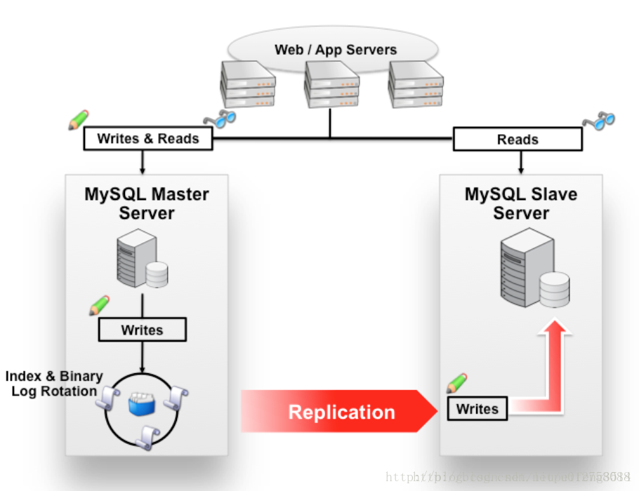
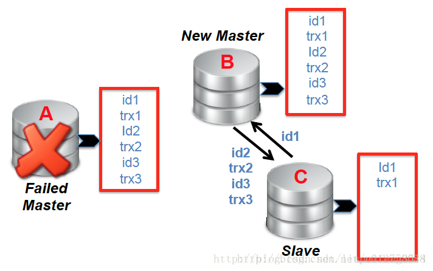
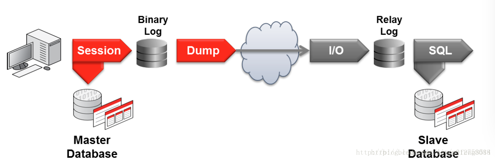
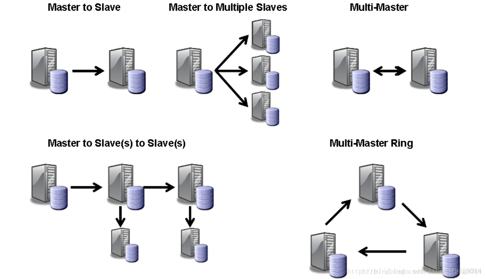
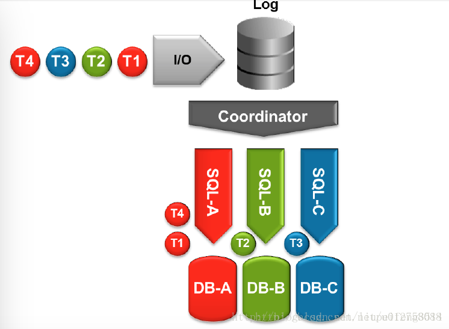

`Replication`的思想是将数据在集群的多个节点同步、备份，以提高集群数据的可用性（HA）；Mysql使用`Replication`架构来实现上述目的，同时可以提升了集群整体的并发能力。5.6版本作为一个里程碑，对`Replication`做了不少的优化调整，提高了集群数据的一致性、同步的性能以及数据自动恢复（recovery）的能力。（本文内容基于MySQL 5.6+，不过在5.7+版本仍有部分调整）

`Replication 架构通常由一个master和一个或者多个slaves构成`，master接收应用的writes操作（事务中的read、write操作均有master处理），slaves接收read操作。在master上发生的数据变更，都将会复制给slaves，从直观而言，`Replication`架构解决了：

- 数据多点备份，提高数据可用性。
- 读写分流，提高集群的并发能力（并非是负载均衡）。
- 让一些非实时的数据操作，转移到slaves上进行。

下文中提到的“变更操作”为“insert”、“update”、“delete”等，与MySQL中的“update events”、“事务操作”、“writes”同义。

#### Replication 的优点

------

- `扩展`：将负载分布在多个slaves上以提高性能，所有的writes以及事务中的read操作都将有master处理，其他reads将转发给slaves；对于“读写比”较高的应用，Replication可以通过增加slaves节点来提高并发能力；因为write只能在master上提交，因此架构扩展对提升write并发能力并不明显，对于writes密集性应用我们应该考虑其他架构。
- `数据安全`：slave可以中断自己的Replication进程，这不会打断master上的数据请求，所以可以在slave上运行backup服务，定期全量backup是保护数据的手段之一。（如果在master上执行backup，需要让master处于readonly状态，这也意味这所有的write请求需要阻塞）。
- `分析`：数据在master上创建，那么数据分析可以在slave上进行，这将不会影响master的性能。利用mysql做数据分析（或者数据分析平台的源数据），通常都是将某个slave作为数据输入端。
- `远距数据分布`：如果master的物理位置较远，你可以在临近需求的地方部署slaves，以便就近使用数据，而不需要总是访问远端的master，这在数据分析、数据备份与容灾等方面有很大帮助。

MySQL架构的演变分多个阶段，目前基于`Replication`架构模式的更高级架构设计有“MySQL Fabric”和“MySQL Cluster”。本文主要讲解基本的`Replication`模式， 如下为Replication与Fabirc、Cluster的区别，以便我们做技术选型 ：

##### 1、MySQL Fabirc

Farbic由Replication基础特性和一些扩展框架构建而成，用于管理MySQL Servers  Farms，与基本的Replication相比，它实现了2个核心的特性：HA和sharding。Fabric集群中任何时候只有一个Primary（即master），其他的实例为Secondaries（即slaves）；通过使用Replication，将数据在多个节点上备份，HA总是保持集群的数据可用性。如下特性是Replication所不具备的：

1. `故障检测和角色迁移（Failover）`：Fabric进程用于监控集群中的所有节点，如果发现primary失效，稍后他将从Secondaries中选择一个“数据最新”的节点，并提升为primary；此后其他的secondaries将从新的priamry上同步数据变更操作。Connectors（比如Connector/J客户端）发现primary故障时也会通知Fabirc，那么Fabric将通知信息作为决策的一部分来判定priamry的状态。这个特性简称为“自动Failover”，是Replication架构中必备的手段之一。
2. `数据库请求路由（Router）`：当Fabric提升一个新的primary后，它将会更新state  store（存储Replication的节点状态等），此后Connectors将会获取新的state数据并在客户端本地cache。因此，application不需要时刻关注（aware）集群中servers拓扑结构的变化，只需要根据state  cache中的server状态，将writes发送给相应的primary即可。这种特性有Connectors客户端与与Fabric共同实现，在普通的Replication架构中，客户端自动角色路由是无法完成的。如果cache中拓扑不是最新的，application的操作异常将会反馈给Fabirc，参考1）。

Fabirc支持sharding，对较大规模的数据可以非常便捷的在集群中分布而无需太多人工干预，我们可以简单的认为Fabric是Replication模式的完善，支持自动Failover。对于互联网应用，Fabric架构简单而且有效，是首选方案。

##### 2、MySQL Cluster

相对于Fabirc，`MySQL Cluster支持更大规模的数据`，其架构模式和原理也更加复杂。Cluster是一个易于扩展、实时的、ACID兼容的事务性数据库，支持“全分布式”、“多Master”架构，无单点问题；MySQL  Cluster可以部署在普通的商业机器上，多节点水平扩展、Server间数据自动sharding和负载均衡，用于服务read、write都密集的应用，可以使用SQL和NOSQL接口访问数据。`Cluster的架构思想与Hadoop非常类似`，它设计的前提是“认为每个Node都是易于出错的”、集群规模巨大、多租户，所以它提供了数据备份机制、自动迁移、自动Failover等特性，来保证可用性、健壮性。

MySQL Cluster使用了一个插件式的存储引擎，与MySQL 存储引擎（InnoDB、MySAM）架构有很大不同，我们在此不做详细介绍，只需要知道它的核心特性为：数据集并不是存储某个特定的MySQL实例上，而是被分布在多个Data Nodes中，即`一个table的数据可能被分散在多个物理节点上，任何数据都会在多个Data Nodes上冗余备份`。任何一个数据变更操作，都将在一组Data Nodes上同步（严格意义上的同步，synchronous，二阶段提交？）以保证数据的一致性。

`由此可见，Replication架构简单、易于管理；Fabric是Replicaiton模式的完善和补充，增加了自动Failover和sharding机制，以支撑更大规模的数据访问，减少人工干预；Cluster是一个全分布式架构，是面向大规模数据存储的解决方案`。

#### 一、基础

------

`Replication 模式的主要目的是将master上的数据变更复制到一个或者多个slaves上，多个节点备份以提高数据的可用性，避免单点问题`；如果只有一个mysql节点，那么当此节点的宿主机器损坏，将可能导致数据永久性丢失。Replication与Connector配合，可以实现读写分流的功能，从而提升集群整体的并发能力。
 　
 根据实际需要，我们可以指定某个（些）Databases或者tables参Replication，不过Replication的表现态仍然是集群中所有的实例上数据集一样，这与Farbic、Cluster不同，在Cluster中不同的Data Nodes上数据集或许完全不同。

Repliction模式中，在master上发生的数据变更都将被立即写入binlog，此后它们被slaves读取到本地，并应用这些数据变更操作，从而实现据“Replication”。slaves的数据同步只会消耗较少的master资源（每个slave或许有1%的额外开支），通常一个master组合几个slaves（3~5个）是比较常见的，而不会有数十个slaves，否则你应该考虑Cluster架构。

#### 二、复制模式（Replication models）

------

Replication支持两种模式：asynchronous（异步）、semi-synchronous（半同步）；“synchronous”复制只有Cluster才支持，本文不做介绍。复制模式会对数据完整性有很大影响。

##### 1、Asynchronous复制

这是Replication的默认模式，`在master上提交的updates操作执行成功且写入binlog之后，master继续处理其他的write请求，而不会等待slaves对此update信息的复制或者应用`；此后的任何时候，slaves均可以与master建立链接并复制那些尚未获取的变更日志，然后在本地应用（apply）。

异步模式，无法保证当master失效后所有的updates已经复制到了slaves上，只有重启master才能继续恢复这些数据，如果master因为宿主机器物理损坏而无法修复，那些尚未复制到slaves上的updates将永久性丢失；因此异步方式存在一定的数据丢失的风险，但它的优点就是master支持的write并发能力较强，因为master上的writes操作与slaves的复制是互为独立的。

不过这种模式，slaves总有一定的延后，这种延后在事务操作密集的应用中更加明显，不过通常这种延后时间都极其短暂的。从另一个方面来说，异步方式不要求slaves必须时刻与master建立链接，可能slaves离线、中断了Replication进程或者链接的传输延迟很高，这都不会影响master对writes请求的处理效率。比如对于“远距分布”的slaves，异步复制是比较好的选择。

此模式下，如果master失效，我们通常的做法是重启master，而不是failover到其他的slave，除非master无法恢复；因为master上会有些updates尚未复制给slaves，如果此时failover则意味着那些updates将丢失。

##### 2、Semi-synchronous

`“半同步”并不是MySQL内置的Replication模式，而且由插件实现`，即在使用此特性之前，需要在master和slaves上安装插件，且通过配置文件开启“半同步”。当slave与master建立连接时会表明其是否开启了“半同步”特性；此模式正常运作，需要master和至少一个slaves同时开启，否则仍将采用“异步”复制。

`在master上执行事务提交的线程，在事务提交后将会阻塞，直到至少一个“半同步”的slave返回确认消息（ACK）或者所有的半同步slave都等待超时`；slave将接收到事务的信息写入到本地的relay  log文件且flush到磁盘后，才会向master返回确认消息，需要注意slave并不需要此时就执行事务提交，此过程可以稍后进行。当所有的半同步slaves均在指定的时间内没有返回确认消息，即timeout，那么此后master将转换成异步复制模式，直到至少一个半同步slave完全跟进才会转换为半同步模式。在master阻塞结束后才会返回给客户端执行的状态，此期间不会处理其他的事务提交，当write请求返回时即表明此操作在master上提交成功，且在至少一个半同步slaves也复制成功或者超时，阻塞超时并不会导致事务的rollback。（对于事务性的表，比如innodb，默认是事务自动提交，当然可以关闭“autocommit”而手动提交事务，它们在Replication复制机制中并没有区别）

半同步模式需要在master和slaves上同时开启，如果仅在master上开启，或者master开启而slaves关闭，最终仍然不能使用半同步复制，而是采用异步复制。

与异步复制相比，半同步提高了数据一致性，降低了数据丢失的风险。但是它也引入了一个问题，就是master阻塞等待slaves的确认信息，在一定程度上降低了master的writes并发能力，特别是当slaves与master之间网络延迟较大时；因此我们断定，半同步slaves应该部署在与master临近的网络中，为了提高数据一致性，我们有必要将半同步作为Replication的首选模式。
 　
 `在实际的部署环境中，并不要求所有的slaves都开启半同步，我们可以将与master临近的slaves开启半同步，将那些“远距分布”的slaves使用异步`。

#### 三、日志格式（Replication Formats）

------

`Replication之所以能够工作，主要还是归结于binlog（binary log）`，所以在Replication模式下必须开启binlog功能；slave从masters上增量获取binlog信息，并在本地应用日志中的变更操作（即“重放”）。变更操作将根据选定的格式类型写入binlog文件，目前支持三种format：

1. `statement-based Replication（SBR）` ：`master将SQL statements语句写入binlog`，slave也将statements复制到本地执行；简单而言，就是在master上执行的SQL变更语句，也同样在slaves上执行。SBR模式是MySQL最早支持的类型，也是Replication默认类型。如论何种情况，DDL语句一定是SBR格式；
2. `row-based Replication（RBR）`： `master将每行数据的变更信息写入binlog`，每条binlog信息表示一行（row）数据的变更内容，对于slaves而言将会复制binlog信息，然后单条或者批量执行变更操作；
3. `mix-format Replication`：混合模式，在这种模式下，`master将根据根据存储引擎、变更操作类型等，从SBR、RBR中来选择更合适的日志格式`，默认为SBR；具体选择那种格式，这取决于变更操作发生的存储引擎、statement的类型以及特征，优先选择“数据一致性”最好的方式（RBR），然后才兼顾性能，比如statement中含有“不确定性”方法或者批量变更，那么将选择RBR方式，其他的将选择SBR以减少binlog的大小。我们建议使用mix方式。

**SBR 和 RBR 都有各自的优缺点**，对于大部分用而言，mix方式在兼顾数据完整性和性能方面是最佳的选择。

- `SBR的优点`：因为binlog中只写入了变更操作的statements，所以日志量将会很小；当使用SQL语句批量更新、删除数据时，只需要在binlog中记录statement即可，可以大大减少log文件对磁盘的使用。当然这也意味着slave复制信息量也更少，以及通过binlog恢复数据更加快速；
- `SBR的缺点` ：有些变更操作使用SBR方式会带来数据不一致的问题，一些结果具有不确定性的操作使用SBR将会引入数据不一致的问题。
  1. statement中使用了`UDF(User Defination Fuction)`，UDF的计算结果可能依赖于SQL执行的时机和系统变量，这可能在slave上执行的结果与master不同，此外如果使用了trigger，也会带来同样的问题；
  2. 对于`批量delete或者update操作`中，使用了limit限定词，但是没有使用“order  by”，这样的SQL语句执行的结果是不确定的，无论是在master还是slaves，即使在同一个节点上不同时机执行结果都有可能不一样，Replication同理，这归因于MySQL数据存储的机制。（默认排序将采用底层数据文件的实际存储顺序，innodb为primary key顺序）；
  3. statement中使用了如下函数的（举例）：`UUID()，SYSDATE()，RAND()`等，不过NOW()函数可以正确的被Replication（但在UDF或者触发器中则不行）；这些函数的特点就是它们的值依赖于本地系统，RAND()本身就是随机所以值是不确定的。如果statement中使用了上述函数，那么将会在日志中输出warning信息；
  4. 对于“`INSERT ... SELECT`”语句，SBR 将比 RBR 需要更多的行锁。如果UPDATE语句中没有使用索引而导致全表扫描的话，SBR将比RBR需要更多的行锁。（主要是为了保障数据一致性，需要同时锁定受影响的所有的行，而RBR则不必要）；
  5. 对于InnoDB，使用“`AUTO_INCREMENT`”的insert语句，将会阻塞其他“非冲突”的INSERT。（因为AUTO_INCREMENT，为了避免并发导致的数据一致性问题，只能串行，但RBR则不需要）；
  6. 对于`复杂的SQL语句`，在slaves上仍然需要评估（解析）然后才能执行，而对于RBR，SQL语句只需要直接更新相应的行数据即可；
  7. 在slave上评估、执行SQL时可能会发生错误，这种错误会随着时间的推移而不断累加，数据一致性的问题或许会不断增加。
- `RBR的优点` ：
  - 所有的变更操作，都可以被正确的Replication，这事最安全的方式；
  - 对于“INSERT … SELECT”、包含“AUTO_INCREMENT”的inserts、没有使用索引的UPDATE/DELETE，相对于SBR将需要更少的行锁。（意味着并发能力更强）；
- `RBR的缺点` ：
  1. 最大的缺点，就是RBR需要更多的日志量。任何数据变更操作都将被写入log，受影响的每行都要写入日志，日志包含此行所有列的值（即使没有值变更的列）；因此RBR的日志条数和尺寸都将会远大于SBR，特别是在批量的UPDATE/DELETE时，可能会产生巨大的log量，反而对性能带来影响，尽管这确实保障了数据一致性，确导致Replication的效率较低；
  2. 对于MyISAN存储引擎，INSERT语句将会阻塞更长的时间，因为在RBR模式下，MyISAM表不支持并发插入；
  3. 尽管是RBR模式，但是如果slave在更新非事务性表时，server被关闭，将会导致数据不一致性问题；所以在后续的版本中，我们希望master、slaves所有的表均使用InnoDB这样的事务性存储引擎，事务的有序性可以保证slave在crash之后启动，数据恢复时仍能够保证数据一致性。

由此可见，SBR和RBR各有优缺点，这是个需要权衡的事情，本人认为数据一致性是数据库的首要考虑的因素，Replication性能次之，因此在新的版本中，我们建议使用RBR方式或者mixed，通常mixed是官方推荐的。

#### 四、GTID

------

GTID全名“`Global Transaction Identifiers`”，`全局事务性ID`，每个事务都用一个ID标识，用于跟踪master和slavers上事务提交的“进度”；这也意味着在Failover时，slaves可以不需要向新的master传递自己已经执行的log的positions（binglog的offset），只需要告知新的master自己已经执行的最后一条事务的ID即可，这极大的简化了failover、日志Replication的复杂度。因为GTID完全基于事务，可以非常简单的判定master与slaves是否一致，只要slaves与master上的事务提交均按照相同的顺序提交，数据一致性是可以得到保证的，为了更加安全，我们建议使用RBR模式 + GTID。

每个GTID是全局唯一的，由master在创建事务时生成并与事务过程一并写入binlog，slaves只对GTID读取而不修改。GTID由“source_id:trasaction_id”组合而成（中间有“:”分割），其中source_id为源server的UUID（创建事务的master的UUID），transaction_id就是事务ID，是一个序列数字表示事务的顺序（long型），每个事务都有不同的transaction_id；这种组合决定GTID的全局一致性，同时我们也可以根据GTID来判定事务在哪个server上创建的。一个GTID的事务执行后，在此后遇到相同GTID的事务将会被忽略，在master上提交的事务，可以在slaves上多次重复执行（有序执行），这对数据恢复和保证数据一致性非常有帮助。

在没有GTID时，slave需要告知master，其已经复制的binlog文件的offset；当使用GTID时，那么GTID就想binlog的主键索引一样，slave只需要交付GTID即可继续进行Replication，在使用“CHANGE MASTER  TO”命令做failover时也不要指定“MASTER_LOG_FILE”/“MASTER_LOG_POS”选项，而是直接在命令中使用“MASTER_AUTO_POSITION”选项即可，这对运维操作非常便捷。

1. 事务在master上执行并提交，并将此事务操作写入binlog；
2. master将binlog增量发送给slaves，slaves将其内容保存在relay log中（同binlog，主要用于Replication）；
3. slaves从relay  log中读取尚未执行的GTID，并将其值设为“gtid_next”；slave检测并确保此GTID没有被执行过，同时也确保没有其他的线程也在读取和操作此GTID（多线程Replication时），然后再本地执行此transaction并将事务写入本地的binlog中。

基于GTID的repliction，有些特性将不能很好的支持。比如，在一个事务中更新了非事务性表（MyISAM）和事务性表（InnoDB），这将破坏事务的严格性，因为这种“混合更新”的事务在整个过程将会在binlog中产生多个GTIDs记录，对slaves复制将会带来影响，因此Replication中在开启GTID时将不支持“混合更新”。

比如上图架构图，当master失效后，我们需要将其中一个slave提升为master，默认采用“异步复制”方式，因此B和C或许都没有完全复制master上的事务，而且有可能B和C的复制进度有一些差异。我们假定，B比C更加超前，所以，B将被提升为master，此后C需要与B建立从属关系，并从B中复制、执行那些尚未接收到的事务（由GTID判定）；当然B也需要从C中复制那些自己缺失的GTIDs，当B和C数据对齐之后，B正式提升为Master。
 　
 在新的Replication协议中，当slave与master建立链接后，它将会发送自己已经执行和提交的事务GTIDs的范围（gtid_executed），master将会向slave响应slaves缺失的事务列表；如上例所示，C向B发送id1，那么B向C响应id2、id3。

#### 五、实现原理

------

在上述介绍中我们已经基本了解了Replication的原理：每个slaves与master建立链接，并从master“拉取”（pull）binlog副本并保存在本地（relay  log），不是master主动push给slaves；slaves从本地log文件中读取变更操作并执行。每个slave都是互相独立的，各自的Replication过程互不干扰，当然每个slave可以根据需要启动或者暂停Replication进程，而不会影响master与其他slaves的复制。

Replication功能有三个线程实现，其中一个在master上，另外2个在slaves上：

1. `Binlog dump线程`  ：master上创建一个线程用于向slave发送binlog内容，我们可以通过“SHOW  PROCESSLIST”指令查看到一个名为“Binlog  Dump”的线程。dump线程会对binlog文件获取一个读锁，并读取内容发送给slave，只要一个变更操作读取完毕后，锁即释放，即使内容尚未发送给slave；
2. `Slave I/O线程` ：当在slave上执行“START  SLAVE”后，将会创建一个I/O线程，它负责与master建立链接并请求需要的binlog，并保存在本地的relay  log中。在slave上执行“SHOW SLAVE STATUS”可以查看“Slave_IO_running”的状态；

master为每个slave建立一个单独的Binlog  dump线程，并同时与它们交互，每个slave持有各自的IO和SQL线程。slave使用2个单独的线程来完成Replication过程，以免它们互相影响，比如IO线程不会因为SQL线程执行较慢而拖累与master的读取速率，当slave停止了一段时间后重启，那么IO线程仍然可以快速的与master跟进，即使SQL线程已经落后太多；这种线程分离，最大的收益就是提高了slave复制的效率，避免slave与master差距太大，从而保证了数据安全。
 　
 我们可以通过“SHOW PROCESSLIST”来查看上述线程的运行状态。也可以使用“SHOW SLAVE STATUS”、“SHOW MASTER STATUS”来查看与Replication有关的更多状态信息。

在Replication期间，master只需要创建与更新binlog文件即可，不过对于slave，为了复制和failover需要创建多种文件：

1. `relay log` ：我们在上文中已经提到，slave  IO线程从master读取的binlog数据首先保存在本地的relay log中；此后SQL线程即可从relay  log中读取变更操作并在本地应用。严格意义上说，relay log的内容应该与master  binlog逐字节一致的（byte-to-byte）；
2. `master info` ：master-info  log文件保存了slave与当前master建立链接的一些配置信息和链接状态，日志中包括：master的host名称、login认证信息，以及slave读取master  binlog的位置信息。在5.6之前，信息保存在master.info文件中，5.6之后，可以通过“–master-info-repository=TABLE”启动参数（或者配置文件）将信息保存在“mysql.slave_master_info”系统表中；
3. `relay log info` ：用于记录relay  log执行点的状态信息，在5.6之前默认写入relay-log.info文件，5.6之后可以通过“–relay-log-info-repository=TABLE”将信息写入“mysql.slave_relay_log_info”系统表中；
4. `binlog` ：这个大家都很熟悉，slave上也可以开启binlog功能，比如slave是其他slave的master时。

为了避免crash对数据带来的不一致问题，强烈建议将master-info、relay-log-info采用事务性表，而且建议开启“–relay-log-recovery”。不过很遗憾的是，在5.6.5之前的版本中，slave_master_info、slave_relay_log_info表默认为MyISAM，需要手动修改为InnoDB。

relay log内容格式与binlog一样，也可以使用mysql binlog shell查看。 relay  log也是有多个文件组成，和binlog非常相似，文件名称格式类似于“host_name-relay-bin.”，此外还有一个index文件用来记录哪些relay log文件还在使用中，不能被删除（对于master而言，binlog也是如此）。SQL线程执行完一个relay  log中的变更操作后，将会自动删除此文件，因为它不再需要。关于relay log、master info文件的内容请参看链接。

#### 六、架构拓扑

------

根据Replication的机制，它可以有多种架构拓扑结构，如图所示：

1. Master-slave、Master-slaves：这是目前最常见的架构模式，一个master与一个或者多个slaves组合，实施简单而且有效，是首选方式之一，不仅实现了HA，而且还能读写分离，进而提升集群的并发能力；
2. Master-slave-slaves：多级复制模式，  部分slave不与master跟进，而是与其他slave跟进，这在某些特殊场景下非常有效！我们知道如果master有太多的slave跟进，master将会损耗一部分性能用于Replication，在上文中已经知道“半同步”的特性，那么我们可以让3~5个slaves与master跟进，并使用“半同步”复制模式，其他的slaves作为二级，与其他slave(s)跟进，采用“异步”复制模式，这样不仅缓解了master的压力，而且对数据一致性并没有负面影响；而且二级slaves可以作为“离线数据统计”、“远距数据中心”等特殊使用场景，因为它们对数据的实时性要求不要；

#### 七、优化调整

------

##### 1、多线程

在slave上使用多线程方式进行Replication过程，可以有效提高效率。

slave将多个线程根据database分割，其中一个线程为“coordinator”（协调器），从relay  log中读取变更操作，然后将不同database的操作发送给不同的worker线程，并由worker线程负责执行；可以通过“slave-parallel-workers”参数指定worker线程的个数。默认情况下slave只有一个线程，即SQL线程，此线程负责读取relay log并执行变更操作，那么在多线程模式下，一个线程专门负责读取relay  log，并将读取的变更操作根据database分发给不同的worker线程，那么多个database中的变更操作将可以并行的执行，这将极大的提高了Replication的效率。不过这也会引入一些问题，比如事务的顺序可能会与master不同，我们稍后在“【配置参数】”部分介绍。

##### 2、binlog批量提交（Group commit）

binlog数据最终要写入磁盘，磁盘写入的频率越高，性能也就越低（磁盘IO效率低）；我们可以开启binlog批量提交，而不是每个变更操作都立即写入binlog，这样可以有效的提高磁盘IO的性能。“sync_binlog”参数来控制磁盘写入的频率，默认为0，即有操作系统决定binlog文件flush的时机，“1”表示每个变更操作写入binlog后都立即flush磁盘，其他值表示多个变更操作后才flush磁盘。

##### 3、RBR优化

前文已经提到，基于RBR复制时，master将会把变更操作影响的行的所有列的值都写入binlog，这确实提高了数据的安全性，但是却增加了binlog的日志量，也增加了master与slave之间的网络传输量。我们可以通过“binlog-row-image”参数来控制binlog输出：

- `minimal`：只记录数据变更的列以及能够标定此row的列（比如主键列）；此选项通常比较合适，日志量较少，而且实用。
- `noblob`：记录所有的列（包括未变更的列），但是不包括blob和text类型的没有变更的列；简而言之，就是没有变更的大字段不会写入binlog，其他字段无论是否变更均会写入，具有“full”和“minimal”的优点。