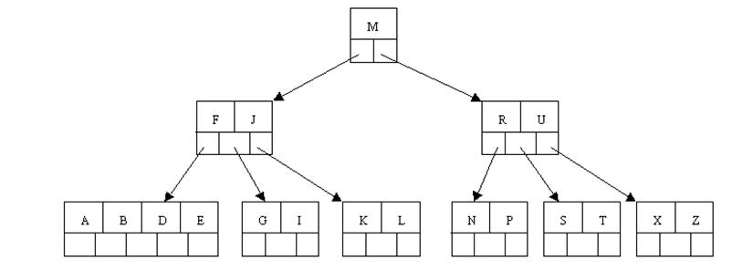

# [Mysql B-Tree, B+Tree, B*树介绍](https://www.cnblogs.com/owenma/p/8723465.html)

【摘要】

   最近在看Mysql的存储引擎中索引的优化,神马是索引,支持啥索引.全是浮云，目前Mysql的MyISAM和InnoDB都支持B-Tree索引,InnoDB还支持B+Tree索引，Memory还支持Hash.今天从最基础的学起,学习了解BTree,B-Tree和B+Tree。

【主题】

- B-Tree 介绍
- B-Tree 特性搜索插入等
- B+Tree 介绍
- B*Tree 介绍

【内容】

\1. B-Tree 介绍

   1970年，R.Bayer和E.mccreight提出了一种适用于外查找的树，它是一种平衡的多叉树，称为B树，其定义如下：

> 一棵m阶的B树满足下列条件：

- 树中每个结点至多有m个孩子；
- 除根结点和叶子结点外，其它每个结点至少有m/2个孩子；
- 若根结点不是叶子结点，则至少有2个孩子；
- 所有叶子结点(失败节点)都出现在同一层，叶子结点不包含任何关键字信息；
- 所有非终端结点中包含下列信息数据 ( n, A0 , K1 , A1 , K2 , A2 , … , Kn , An )，其中： Ki  (i=1,…,n)为关键字，且Ki < Ki+1 , Ai (i=0,…,n)为指向子树根结点的指针, n为关键字的个数
- 非叶子结点的指针：P[1], P[2], …, P[M]；其中P[1]指向关键字小于K[1]的子树，P[M]指向关键字大于K[M-1]的子树，其它P[i]指向关键字属于(K[i-1], K[i])的子树；

   在B树中，每个结点中关键字从小到大排列，并且当该结点的孩子是非叶子结点时，该k-1个关键字正好是k个孩子包含的关键字的值域的分划。因为叶子结点不包含关键字，所以可以把叶子结点看成在树里实际上并不存在外部结点，指向这些外部结点的指针为空，叶子结点的数目正好等于树中所包含的关键字总个数加1。B树中的一个包含n个关键字，n+1个指针的结点的一般形式为：  （n,P0,K1,P1,K2,P2,…,Kn,Pn）其中，Ki为关键字，K1 <K2 <… <Kn,  Pi  是指向包括Ki到Ki+1之间的关键字的子树的指针。

\2. B-Tree特性

2.1 B-Tree 特性

- 关键字集合分布在整颗树中；
- 任何一个关键字出现且只出现在一个结点中；
- 搜索有可能在非叶子结点结束；
- 其搜索性能等价于在关键字全集内做一次二分查找；
- 自动层次控制；

2.2 B-Tree搜索原理

B-树的搜索，从根结点开始，对结点内的关键字（有序）序列进行二分查找，如果命中则结束，否则进入查询关键字所属范围的儿子结点；重复，直到所对应的儿子指针为空，或已经是叶子结点；因此，B-Tree的查找过程是一个顺指针查找结点和在结点的关键字中进行查找的交叉进行的过程。

2.3 B-Tree 插入

   B-树是从空树起，逐个插入关键码而生成的。

   在B-树，每个非失败结点的关键码个数都在[ m/2 -1, m-1]之间。插入在某个叶结点开始。如果在关键码插入后结点中的关键码个数超出了上界 m-1，则结点需要“分裂”，否则可以直接插入。

   实现结点“分裂”的原则是：

   设结点 A 中已经有 m-1 个关键码，当再插入一个关键码后结点中的状态为( m, A0, K1, A1, K2, A2, ……, Km, Am)其中 Ki < Ki+1, 1 =< m

这时必须把结点 p 分裂成两个结点 p 和 q，它们包含的信息分别为：

   结点 p：( m/2 -1, A0, K1, A1, ……, Km/2 -1, Am/2 -1)

   结点 q：(m - m/2, Am/2, Km/2+1, Am/2+1, ……, Km, Am)

   位于中间的关键码 Km/2 与指向新结点 q 的指针形成一个二元组 ( Km/2, q )，插入到这两个结点的双亲结点中去。

\3. B+Tree

3.1 B+Tree定义

   B+树可以看作是B树的一种变形，在实现文件索引结构方面比B树使用得更普遍。

> 一棵 m 阶B+树可以定义如下：

- 树中每个非叶结点最多有 m 棵子树；
- 根结点 (非叶结点) 至少有 2 棵子树。除根结点外, 其它的非叶结点至少有 ém/2ù 棵子树；有 n 棵子树的非叶结点有 n-1 个关键码。
- 所有叶结点都处于同一层次上，包含了全部关键码及指向相应数据对象存放地址的指针，且叶结点本身按关键码从小到大顺序链接；
- 每个叶结点中的子树棵数 n 可以多于 m，可以少于 m，视关键码字节数及对象地址指针字节数而定。
- 若设结点可容纳最大关键码数为 m1，则指向对象的地址指针也有 m1 个。
- 结点中的子树棵数 n 应满足 n 属于[m1/2, m1]
- 若根结点同时又是叶结点，则结点格式同叶结点。
- 所有的非叶结点可以看成是索引部分，结点中关键码 Ki 与指向子树的指针 Pi 构成对子树 (即下一层索引块) 的索引项 ( Ki, Pi )，Ki 是子树中最小的关键码。
- 特别地，子树指针 P0 所指子树上所有关键码均小于 K1。结点格式同B树。
- 叶结点中存放的是对实际数据对象的索引。
- 在B+树中有两个头指针：一个指向B+树的根结点，一个指向关键码最小的叶结点。

> B+Tree与B-Tree区别

1. 非叶子结点的子树指针与关键字个数相同；
2. 非叶子结点的子树指针P[i]，指向关键字值属于[K[i], K[i+1])的子树（B-树是开区间）；
3. 为所有叶子结点增加一个链指针；
4. 所有关键字都在叶子结点出现；

> 对B+树进行两种搜索运算

- 循叶结点链顺序搜索
- 另一种是从根结点开始，进行自顶向下，直至叶结点的随机搜索。

3.2 B+Tree特性

   B+Tree的搜索与B-Tree也基本相同，区别是B+Tree只有达到叶子结点才命中（B-Tree可以在非叶子结点命中），其性能也等价于在关键字全集做一次二分查找；

> B+Tree的特性

- 所有关键字都出现在叶子结点的链表中（稠密索引），且链表中的关键字恰好是有序的；
- 不可能在非叶子结点命中；
- 非叶子结点相当于是叶子结点的索引（稀疏索引），叶子结点相当于是存储（关键字）数据的数据层；
- 更适合文件索引系统

\4. B*Tree

4.1 B*Tree

   B*Tree是B+树的变体，在B+Tree的非根和非叶子结点再增加指向兄弟的指针；

   B*树定义了非叶子结点关键字个数至少为(2/3)*M，即块的最低使用率为2/3（代替B+树的1/2）；

   B+树的分裂：当一个结点满时，分配一个新的结点，并将原结点中1/2的数据复制到新结点，最后在父结点中增加新结点的指针；B+树的分裂只影响原结点和父结点，而不会影响兄弟结点，所以它不需要指向兄弟的指针；

   B*树的分裂：当一个结点满时，如果它的下一个兄弟结点未满，那么将一部分数据移到兄弟结点中，再在原结点插入关键字，最后修改父结点中兄弟结点的关键字（因为兄弟结点的关键字范围改变了）；如果兄弟也满了，则在原结点与兄弟结点之间增加新结点，并各复制1/3的数据到新结点，最后在父结点增加新结点的指针；

   所以，B*树分配新结点的概率比B+树要低，空间使用率更高；

【结束】

> **自我总结：**
>
> - B-树：多路搜索树，每个结点存储M/2到M个关键字，非叶子结点存储指向关键字范围的子结点；所有关键字在整颗树中出现，且只出现一次，非叶子结点可以命中；
> - B+树：在B-树基础上，为叶子结点增加链表指针，所有关键字都在叶子结点中出现，非叶子结点作为叶子结点的索引；B+树总是到叶子结点才命中；
> - B*树：在B+树基础上，为非叶子结点也增加链表指针，将结点的最低利用率从1/2提高到2/3；

 

 

# B-树和B+树的应用：数据搜索和数据库索引

**1 .B-树定义**

B-树是一种平衡的多路查找树，它在文件系统中很有用。

定义：一棵m 阶的B-树，或者为空树，或为满足下列特性的m 叉树：
⑴树中每个结点至多有m 棵子树；
⑵若根结点不是叶子结点，则至少有两棵子树；

⑶除根结点之外的所有非终端结点至少有[m/2] 棵子树；
⑷所有的非终端结点中包含以下信息数据：

   （n，A0，K1，A1，K2，…，Kn，An）
其中：**Ki**（i=1,2,…,n）为关键码，且Ki<Ki+1，

​      **Ai** 为指向子树根结点的指针(i=0,1,…,n)，且指针Ai-1 所指子树中所有结点的关键码均小于Ki (i=1,2,…,n)，An 所指子树中所有结点的关键码均大于Kn.

​      n  为关键码的个数。
⑸所有的叶子结点都出现在同一层次上，并且不带信息（可以看作是外部结点或查找失败的结点，实际上这些结点不存在，指向这些结点的指针为空）。

  即所有叶节点具有相同的深度，等于树高度。

 如一棵四阶B-树，其深度为4.

​     

 

B-树的查找类似二叉排序树的查找，所不同的是B-树每个结点上是多关键码的有序表，在到达某个结点时，先在有序表中查找，若找到，则查找成功；否则，到按照对应的指针信息指向的子树中去查找，当到达叶子结点时，则说明树中没有对应的关键码。

在上图的B-树上查找关键字47的过程如下：

1）首先从更开始，根据根节点指针找到 *节点，因为 *a 节点中只有一个关键字，且给定值47 > 关键字35，则若存在必在指针A1所指的子树内。

2）顺指针找到 *c节点，该节点有两个关键字（43和 78），而43 < 47 < 78,若存在比在指针A1所指的子树中。

3）同样，顺指针找到 *g节点，在该节点找到关键字47,查找成功。

**2. 查找算法**

 

1. typedef int KeyType ; 
2. \#define m 5         /*B 树的阶，暂设为5*/ 
3. typedef struct Node{ 
4.   int keynum;       /* 结点中关键码的个数，即结点的大小*/ 
5.   struct Node *parent;  /*指向双亲结点*/  
6.   KeyType key[m+1];    /*关键码向量，0 号单元未用*/  
7.   struct Node *ptr[m+1]; /*子树指针向量*/  
8.   Record *recptr[m+1];  /*记录指针向量*/ 
9. }NodeType;         /*B 树结点类型*/ 
10.  
11. typedef struct{ 
12.   NodeType *pt;      /*指向找到的结点*/ 
13.   int i;         /*在结点中的关键码序号，结点序号区间[1…m]*/ 
14.   int tag;        /* 1:查找成功，0:查找失败*/ 
15. }Result;          /*B 树的查找结果类型*/ 
16.  
17. Result SearchBTree(NodeType *t,KeyType kx) 
18. {  
19.   /*在m 阶B 树t 上查找关键码kx，反回(pt,i,tag)。若查找成功，则特征值tag=1，*/ 
20.   /*指针pt 所指结点中第i 个关键码等于kx；否则，特征值tag=0,等于kx 的关键码记录*/ 
21.   /*应插入在指针pt 所指结点中第i 个和第i+1 个关键码之间*/ 
22.   p=t;q=NULL;found=FALSE;i=0; /*初始化，p 指向待查结点，q 指向p 的双亲*/ 
23.   while(p&&!found) 
24.   {  n=p->keynum;i=Search(p,kx);     /*在p-->key[1…keynum]中查找*/ 
25. ​    if(i>0&&p->key[i]= =kx) found=TRUE; /*找到*/ 
26. ​    else {q=p;p=p->ptr[i];} 
27.   } 
28.   if(found) return (p,i,1);        /*查找成功*/ 
29.   else return (q,i,0);          /*查找不成功，反回kx 的插入位置信息*/ 
30. } 

 

B- 树查找算法分析

从查找算法中可以看出， 在B- 树中进行查找包含两种基本操作:

​    **( 1) 在B- 树中查找结点；**

​    **( 2) 在结点中查找关键字。**

​    由于B- 树通常存储在磁盘上， 则前一查找操作是在磁盘上进行的， 而后一查找操作是在内存中进行的， 即在磁盘上找到指针p  所指结点后， 先将结点中的信息读入内存， 然后再利用顺序查找或折半查找查询等于K 的关键字。显然，  在磁盘上进行一次查找比在内存中进行一次查找的时间消耗多得多.

   因此， 在磁盘上进行查找的次数、即待查找关键字所在结点在B- 树上的层次树， 是决定B树查找效率的首要因素

​    那么，对含有n 个关键码的m 阶B-树，最坏情况下达到多深呢？可按二叉平衡树进行类似分析。首先，讨论m 阶B-数各层上的最少结点数。

​    由B树定义：B树包含n个关键字。因此有n+1个树叶都在第J+1 层。

  1）第一层为根，至少一个结点，根至少有两个孩子，因此在第二层至少有两个结点。

  2）除根和树叶外，其它结点至少有[m/2]个孩子,因此第三层至少有2*[m/2]个结点,在第四层至少有2*[m/2]2 个结点…

  3）那么在第J+1层至少有2*[m/2]J-1个结点,而J+1层的结点为叶子结点,于是叶子结点的个数n+1。有：

​     

​    也就是说在n个关键字的B树查找，从根节点到关键字所在的节点所涉及的节点数不超过：

   

**3.B-树的插入**

 B-树的生成也是从空树起，逐个插入关键字而得。但由于B-树结点中的关键字个数必须≥ceil(m／2)-1，因此，每次插入一个关键字不是在树中添加一个叶子结点，而是首先在最低层的某个非终端结点中添加一个关键字，若该结点的关键字个数不超过m-1，则插入完成，否则要产生结点的“分裂”，

如图（a） 为3阶的B-树(图中略去F结点(即叶子结点))，假设需依次插入关键字30，26，85。

 

1) 首先通过查找确定插入的位置。由根*a 起进行查找，确定30应插入的在*d 节点中。由于*d 中关键字数目不超过2（即m-1），故第一个关键字插入完成：如（b）

2) 同样，通过查找确定关键字26亦应插入 *d. 由于*d节点关键字数目超过2，此时需要将  *d分裂成两个节点，关键字26及其前、后两个指针仍保留在 *d 节点中，而关键字37 及其前、后两个指针存储到新的产生的节点 *d`  中。同时将关键字30 和指示节点 *d `的指针插入到其双亲的节点中。由于 *b节点中的关键字数目没有超过2，则插入完成.如（c）(d)

 

 

3) (e) -(g) 为插入85后;

**插入算法：**

 

**[cpp]**[view plain](http://blog.csdn.net/hguisu/article/details/7786014#) [copy](http://blog.csdn.net/hguisu/article/details/7786014#)

 

 [print](http://blog.csdn.net/hguisu/article/details/7786014#)[?](http://blog.csdn.net/hguisu/article/details/7786014#)

1. int InserBTree(NodeType **t,KeyType kx,NodeType *q,int i){  
2.   /* 在m 阶B 树*t 上结点*q 的key[i],key[i+1]之间插入关键码kx*/  
3.   /*若引起结点过大，则沿双亲链进行必要的结点分裂调整，使*t仍为m 阶B 树*/ 
4.   x=kx;ap=NULL;finished=FALSE; 
5.   while(q&&!finished) 
6.   {  
7. ​    Insert(q,i,x,ap);        /*将x 和ap 分别插入到q->key[i+1]和q->ptr[i+1]*/ 
8. ​    if(q->keynum<m) finished=TRUE;  /*插入完成*/ 
9. ​    else 
10. ​    {                /*分裂结点*p*/ 
11. ​      s=m/2;split(q,ap);x=q->key[s]; 
12. ​      /*将q->key[s+1…m],q->ptr[s…m]和q->recptr[s+1…m]移入新结点*ap*/ 
13. ​      q=q->parent; 
14. ​      if(q) i=Search(q,kx); /*在双亲结点*q 中查找kx 的插入位置*/ 
15. ​    } 
16.   } 
17.   if(!finished)      /*(*t)是空树或根结点已分裂为*q*和ap*/ 
18.   NewRoot(t,q,x,ap); /*生成含信息(t,x,ap)的新的根结点*t,原*t 和ap 为子树指针*/ 
19. } 

 

 

**4. B-树的删除**

   反之，若在B-树上删除一个关键字，则首先应找到该关键字所在结点，并从中删除之，若该结点为最下层的非终端结点，且其中的关键字数目不少于ceil(m/2)，则删除完成，否则要进行“合并”结点的操作。假若所删关键字为非终端结点中的Ki，则可以指针Ai所指子树中的最小关键字Y替代Ki，然后在相应的结点中删去Y。例如，在下图  图4.1( a)的B-树上删去45，可以*f结点中的50替代45，然后在*f结点中删去50。

​                图4.1( a)

因此，下面我们可以只需**讨论删除最下层非终端结点中的关键字的情形。有下列三种可能：**

  (1)被删关键字所在结点中的关键字数目不小于ceil(m/2)，则只需从该结点中删去该关键字Ki和相应指针Ai，树的其它部分不变，例如，从图 图4.1( a)所示B-树中删去关键字12，删除后的B-树如图 图4.2( a)所示：

​              图4.2( a)

  (2)被删关键字所在结点中的关键字数目等于ceil(m/2)-1，而与该结点相邻的右兄弟(或左兄弟)结点中的关键字数目大于ceil(m/2)-1，则需将其兄弟结点中的最小(或最大)的关键字上移至双亲结点中，而将双亲结点中小于(或大于)且紧靠该上移关键字的关键字下移至被删关键字所在结点中。

**[例如]**，从图图4.2( a)中删去50，需将其右兄弟结点中的61上移至*e结点中，而将*e结点中的53移至*f，从而使*f和*g中关键字数目均不小于ceil(m-1)-1，而双亲结点中的关键字数目不变，如图图4.2(b)所示。

​                图4.2(b)

​    (3)被删关键字所在结点和其相邻的兄弟结点中的关键字数目均等于ceil(m/2)-1。假设该结点有右兄弟，且其右兄弟结点地址由双亲结点中的指针Ai所指，则在删去关键字之后，它所在结点中剩余的关键字和指针，加上双亲结点中的关键字Ki一起，合并到 Ai所指兄弟结点中(若没有右兄弟，则合并至左兄弟结点中)。

**[例如]**，从图4.2(b)所示 B-树中删去53，则应删去*f结点，并将*f中的剩余信息(指针“空”)和双亲*e结点中的 61一起合并到右兄弟结点*g中。删除后的树如图4.2(c)所示。

 

​                图4.2(c)

 如果因此使双亲结点中的关键字数目小于ceil(m/2)-1，则依次类推。

**[例如]**，在 图4.2(c)的B-树中删去关键字37之后，双亲b结点中剩余信息(“指针c”)应和其双亲*a结点中关键字45一起合并至右兄弟结点*e中，删除后的B-树如图 4.2(d)所示。  

​             图 4.2(d)

 

**B-树主要应用在文件系统**

**为了将大型数据库文件存储在硬盘上 以减少访问硬盘次数为目的 在此提出了一种平衡多路查找树——B-树结构 由其性能分析可知它的检索效率是相当高的 为了提高 B-树性能’还有很多种B-树的变型，力图对B-树进行改进**

 

## B+树

   B+树是应文件系统所需而产生的一种B-树的**变形树**。一棵m 阶的B+树和m 阶的B-
树的差异在于：
⑴有n 棵子树的结点中含有n 个关键码；
⑵所有的叶子结点中包含了全部关键码的信息，及指向含有这些关键码记录的指针，且
叶子结点本身依关键码的大小自小而大的顺序链接。
⑶所有的非终端结点可以看成是索引部分，结点中仅含有其子树根结点中最大（或最小）关键码。

 

 

 如图一棵3阶的B+树:

 

通常在B+树上有两个头指针，一个指向根节点，另一个指向关键字最小的叶子节点。因此可以对B+树进行两种查找运算：一种是从最小关键字起顺序查找，另一种是从根节点开始，进行随机查找。 

在B+树上进行随机查找、插入和删除的过程基本上与B-树类似。只是在查找时，若非终端结点上的关键码等于给定值，并不终止，而是继续向下直到叶子结点。因此，在B+
树，不管查找成功与否，每次查找都是走了一条从根到叶子结点的路径。

 

 

 

## B+树在数据库中的应用

 

**1. 索引在数据库中的作用** 

​    在数据库系统的使用过程当中，数据的查询是使用最频繁的一种数据操作。

​    最基本的查询算法当然是顺序查找（linear  search），遍历表然后逐行匹配行值是否等于待查找的关键字，其时间复杂度为O（n）。但时间复杂度为O（n）的算法规模小的表，负载轻的数据库，也能有好的性能。  但是数据增大的时候，时间复杂度为O（n）的算法显然是糟糕的，性能就很快下降了。

​    好在计算机科学的发展提供了很多更优秀的查找算法，例如二分查找（binary search）、二叉树查找（binary  tree  search）等。如果稍微分析一下会发现，每种查找算法都只能应用于特定的数据结构之上，例如二分查找要求被检索数据有序，而二叉树查找只能应用于二叉查找树上，但是数据本身的组织结构不可能完全满足各种数据结构（例如，理论上不可能同时将两列都按顺序进行组织），所以，在数据之外，数据库系统还维护着满足特定查找算法的数据结构，这些数据结构以某种方式引用（指向）数据，这样就可以在这些数据结构上实现高级查找算法。这种数据结构，就是索引。

​    索引是对数据库表 中一个或多个列的值进行排序的结构。与在表  中搜索所有的行相比，索引用指针 指向存储在表中指定列的数据值，然后根据指定的次序排列这些指针，有助于更快地获取信息。通常情 况下  ，只有当经常查询索引列中的数据时 ，才需要在表上创建索引。索引将占用磁盘空间，并且影响数 据更新的速度。但是在多数情况下  ，索引所带来的数据检索速度优势大大超过它的不足之处。

**2. B+树在数据库索引中的应用**

目前大部分数据库系统及文件系统都采用B-Tree或其变种B+Tree作为索引结构

 

**1）在数据库索引的应用**

在数据库索引的应用中，B+树按照下列方式进行组织  ：

**①** 叶结点的组织方式 。B+树的查找键 是数据文件的主键 ，且索引是稠密的。也就是说 ，叶结点  中为数据文件的第一个记录设有一个键、指针对 ，该数据文件可以按主键排序，也可以不按主键排序 ；数据文件按主键排序，且 B +树是稀疏索引 ，  在叶结点中为数据文件的每一个块设有一个键、指针对 ；数据文件不按键属性排序 ，且该属性是 B +树 的查找键 ，  叶结点中为数据文件里出现的每个属性K设有一个键 、 指针对 ， 其中指针执行排序键值为 K的 记录中的第一个。

**②** 非叶结点 的组织方式。B+树 中的非叶结点形成 了叶结点上的一个多级稀疏索引。  每个非叶结点中至少有ceil( m/2 ) 个指针 ， 至多有 m 个指针 。  

**2）B+树索引的插入和删除**

①在向数据库中插入新的数据时，同时也需要向数据库索引中插入相应的索引键值 ，则需要向 B+树 中插入新的键值。**即上面我们提到的B-树插入算法。**

②当从数据库中删除数据时，同时也需要从数据库索引中删除相应的索引键值 ，则需要从 B+树 中删 除该键值 。**即B-树删除算法**

**为什么使用B-Tree（B+Tree）**

   二叉查找树进化品种的红黑树等数据结构也可以用来实现索引，但是文件系统及数据库系统普遍采用B-/+Tree作为索引结构。

　一般来说，索引本身也很大，不可能全部存储在内存中，因此索引往往以索引文件的形式存储的磁盘上。这样的话，索引查找过程中就要产生磁盘I/O消耗，相对于内存存取，I/O存取的消耗要高几个数量级，所以评价一个数据结构作为索引的优劣最重要的指标就是在查找过程中磁盘I/O操作次数的渐进复杂度。换句话说，索引的结构组织要尽量减少查找过程中磁盘I/O的存取次数。为什么使用B-/+Tree，还跟磁盘存取原理有关。

​    **局部性原理与磁盘预读**

　　由于存储介质的特性，磁盘本身存取就比主存慢很多，再加上机械运动耗费，磁盘的存取速度往往是主存的几百分分之一，因此为了提高效率，要尽量减少磁盘I/O。为了达到这个目的，磁盘往往不是严格按需读取，而是每次都会预读，即使只需要一个字节，磁盘也会从这个位置开始，顺序向后读取一定长度的数据放入内存。这样做的理论依据是计算机科学中著名的局部性原理：

　　当一个数据被用到时，其附近的数据也通常会马上被使用。

　　程序运行期间所需要的数据通常比较集中。

　　由于磁盘顺序读取的效率很高（不需要寻道时间，只需很少的旋转时间），因此对于具有局部性的程序来说，预读可以提高I/O效率。

　　预读的长度一般为页（page）的整倍数。页是计算机管理存储器的逻辑块，硬件及操作系统往往将主存和磁盘存储区分割为连续的大小相等的块，每个存储块称为一页（在许多操作系统中，页得大小通常为4k），主存和磁盘以页为单位交换数据。当程序要读取的数据不在主存中时，会触发一个缺页异常，此时系统会向磁盘发出读盘信号，磁盘会找到数据的起始位置并向后连续读取一页或几页载入内存中，然后异常返回，程序继续运行。

 

   我们上面分析B-/+Tree检索一次最多需要访问节点：

   数据库系统巧妙利用了磁盘预读原理，将一个节点的大小设为等于一个页，这样每个节点只需要一次I/O就可以完全载入。为了达到这个目的，在实际实现B- Tree还需要使用如下技巧：

   每次新建节点时，直接申请一个页的空间，这样就保证一个节点物理上也存储在一个页里，加之计算机存储分配都是按页对齐的，就实现了一个node只需一次I/O。

　　B-Tree中一次检索最多需要h-1次I/O（根节点常驻内存），渐进复杂度为O（h）=O（logmN）。一般实际应用中，m是非常大的数字，通常超过100，因此h非常小（通常不超过3）。

　　综上所述，用B-Tree作为索引结构效率是非常高的。

　　而红黑树这种结构，**h**明显要深的多。由于逻辑上很近的节点（父子）物理上可能很远，无法利用局部性，所以红黑树的I/O渐进复杂度也为O（h），效率明显比B-Tree差很多。

 

## MySQL的B-Tree索引（技术上说B+Tree）

​    在 MySQL 中，主要有四种类型的索引，分别为： B-Tree 索引， Hash 索引， Fulltext 索引和 R-Tree 索引。我们主要分析B-Tree 索引。

​    B-Tree 索引是 MySQL 数据库中使用最为频繁的索引类型，除了 Archive  存储引擎之外的其他所有的存储引擎都支持 B-Tree 索引。Archive 引擎直到 MySQL 5.1 才支持索引，而且只支持索引单个  AUTO_INCREMENT 列。

​    不仅仅在 MySQL 中是如此，实际上在其他的很多数据库管理系统中B-Tree 索引也同样是作为最主要的索引类型，这主要是因为 B-Tree 索引的存储结构在数据库的数据检索中有非常优异的表现。

   一般来说， MySQL 中的 B-Tree 索引的物理文件大多都是以 Balance Tree  的结构来存储的，也就是所有实际需要的数据都存放于 Tree 的 Leaf Node(叶子节点) ，而且到任何一个 Leaf Node  的最短路径的长度都是完全相同的，所以我们大家都称之为 B-Tree 索引。当然，可能各种数据库（或 MySQL 的各种存储引擎）在存放自己的  B-Tree 索引的时候会对存储结构稍作改造。**如 Innodb 存储引擎的 B-Tree 索引实际使用的存储结构实际上是 B+Tree**，也就是在 B-Tree 数据结构的基础上做了很小的改造，在每一个Leaf Node 上面出了存放索引键的相关信息之外，还存储了指向与该 Leaf  Node 相邻的后一个 LeafNode 的指针信息（增加了顺序访问指针），这主要是为了加快检索多个相邻 Leaf Node 的效率考虑。

 

**下面主要讨论MyISAM和InnoDB两个存储引擎的索引实现方式：**

## 1. MyISAM索引实现：

**1）主键索引：**

MyISAM引擎使用B+Tree作为索引结构，叶节点的data域存放的是数据记录的地址。下图是MyISAM主键索引的原理图：

​                                      （图myisam1）

这里设表一共有三列，假设我们以Col1为主键，图myisam1是一个MyISAM表的主索引（Primary key）示意。可以看出MyISAM的索引文件仅仅保存数据记录的地址。

**2）辅助索引（Secondary key）**

**在MyISAM中，主索引和辅助索引（Secondary key）在结构上没有任何区别，只是主索引要求key是唯一的，而辅助索引的key可以重复。**如果我们在Col2上建立一个辅助索引，则此索引的结构如下图所示：
 

 

同样也是一颗B+Tree，data域保存数据记录的地址。因此，**MyISAM中索引检索的算法为首先按照B+Tree搜索算法搜索索引，如果指定的Key存在，则取出其data域的值，然后以data域的值为地址，读取相应数据记录。**

MyISAM的索引方式也叫做“非聚集”的，之所以这么称呼是为了与InnoDB的聚集索引区分。

 

## 2. InnoDB索引实现

然InnoDB也使用B+Tree作为索引结构，但具体实现方式却与MyISAM截然不同.

**1）主键索引：**

​     MyISAM索引文件和数据文件是分离的，索引文件仅保存数据记录的地址。而在InnoDB中，表数据文件本身就是按B+Tree组织的一个索引结构，这棵树的叶节点data域保存了完整的数据记录。这个索引的key是数据表的主键，因此InnoDB表数据文件本身就是主索引。

​        (图inndb主键索引）

 

 

(图inndb主键索引）是InnoDB主索引（同时也是数据文件）的示意图，可以看到叶节点包含了完整的数据记录。这种索引叫做**聚集索引**。因为InnoDB的数据文件本身要按主键聚集，所以InnoDB要求表必须有主键（MyISAM可以没有），如果没有显式指定，则MySQL系统会自动选择一个可以唯一标识数据记录的列作为主键，如果不存在这种列，则MySQL自动为InnoDB表生成一个隐含字段作为主键，这个字段长度为6个字节，类型为长整形。

 

**2）. InnoDB的辅助索引**

​    InnoDB的所有辅助索引都引用主键作为data域。例如，下图为定义在Col3上的一个辅助索引：

 

  

​    

​    **InnoDB 表是基于聚簇索引建立的**。因此InnoDB  的索引能提供一种非常快速的主键查找性能。不过，它的辅助索引（Secondary Index，  也就是非主键索引）也会包含主键列，所以，如果主键定义的比较大，其他索引也将很大。如果想在表上定义  、很多索引，则争取尽量把主键定义得小一些。InnoDB 不会压缩索引。

   文字符的ASCII码作为比较准则。**聚集索引这种实现方式使得按主键的搜索十分高效，但是辅助索引搜索需要检索两遍索引：首先检索辅助索引获得主键，然后用主键到主索引中检索获得记录。**

​    不同存储引擎的索引实现方式对于正确使用和优化索引都非常有帮助，例如知道了InnoDB的索引实现后，就很容易明白为什么不建议使用过长的字段作为主键，因为所有辅助索引都引用主索引，过长的主索引会令辅助索引变得过大。再例如，用非单调的字段作为主键在InnoDB中不是个好主意，因为InnoDB数据文件本身是一颗B+Tree，非单调的主键会造成在插入新记录时数据文件为了维持B+Tree的特性而频繁的分裂调整，十分低效，而使用自增字段作为主键则是一个很好的选择。

 

 **InnoDB索引**和**MyISAM索引**的区别：

一是主索引的区别，InnoDB的数据文件本身就是索引文件。而MyISAM的索引和数据是分开的。

二是辅助索引的区别：InnoDB的辅助索引data域存储相应记录主键的值而不是地址。而MyISAM的辅助索引和主索引没有多大区别。

 

MySql索引算法原理解析（通俗易懂，只讲B-tree）

 

转自: https://www.cnblogs.com/gym333/p/6877023.html