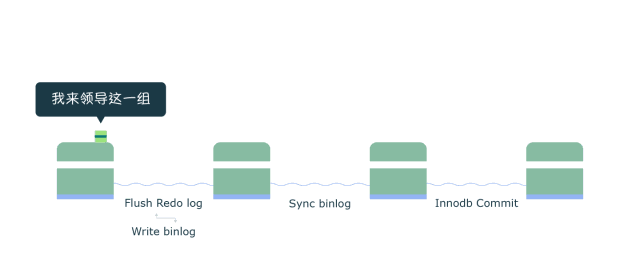
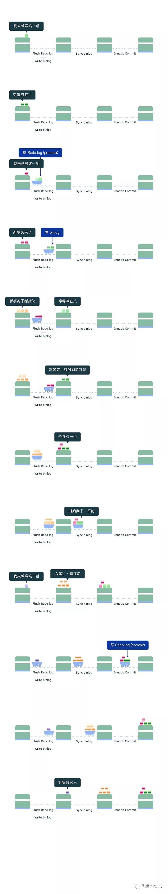

​                                                                                                         

**前提：**

- 以下讨论的前提 是设置MySQL的crash safe相关参数为双1：

sync_binlog=1

innodb_flush_log_at_trx_commit=1

**背景说明：**

- WAL机制 (Write Ahead Log)定义:

  WAL指的是对数据文件进行修改前，必须将修改先记录日志。MySQL为了保证ACID中的一致性和持久性，使用了WAL。

- Redo log的作用:

  Redo log就是一种WAL的应用。当数据库忽然掉电，再重新启动时，MySQL可以通过Redo  log还原数据。也就是说，每次事务提交时，不用同步刷新磁盘数据文件，只需要同步刷新Redo  log就足够了。相比写数据文件时的随机IO，写Redo log时的顺序IO能够提高事务提交速度。

- 组提交的作用:

  - 在没有开启binlog时

Redo log的刷盘操作将会是最终影响MySQL TPS的瓶颈所在。为了缓解这一问题，MySQL使用了组提交，将多个刷盘操作合并成一个，如果说10个事务依次排队刷盘的时间成本是10，那么将这10个事务一次性一起刷盘的时间成本则近似于1。

- 当开启binlog时

为了保证Redo log和binlog的数据一致性，MySQL使用了二阶段提交，由binlog作为事务的协调者。而 引入二阶段提交  使得binlog又成为了性能瓶颈，先前的Redo log 组提交  也成了摆设。为了再次缓解这一问题，MySQL增加了binlog的组提交，目的同样是将binlog的多个刷盘操作合并成一个，结合Redo  log本身已经实现的 组提交，分为三个阶段(Flush 阶段、Sync 阶段、Commit 阶段)完成binlog 组提交，最大化每次刷盘的收益，弱化磁盘瓶颈，提高性能。

​    

**图解：**

下图我们假借“渡口运输”的例子来看看binlog 组提交三个阶段的流程：

在MySQL中每个阶段都有一个队列，每个队列都有一把锁保护，第一个进入队列的事务会成为leader，leader领导所在队列的所有事务，全权负责整队的操作，完成后通知队内其他事务操作结束。

**Flush 阶段 (图中第一个渡口)**

- 首先获取队列中的事务组
- 将Redo log中prepare阶段的数据刷盘(图中Flush Redo log)
- 将binlog数据写入文件，当然此时只是写入文件系统的缓冲，并不能保证数据库崩溃时binlog不丢失 (图中Write binlog)
- Flush阶段队列的作用是提供了Redo log的组提交
- 如果在这一步完成后数据库崩溃，由于协调者binlog中不保证有该组事务的记录，所以MySQL可能会在重启后回滚该组事务

**Sync 阶段 \**(图中第二个渡口)\****

- 这里为了增加一组事务中的事务数量，提高刷盘收益，MySQL使用两个参数控制获取队列事务组的时机：**
  **

​    binlog_group_commit_sync_delay=N：在等待N μs后，开始事务刷盘(图中Sync binlog)

​    binlog_group_commit_sync_no_delay_count=N：如果队列中的事务数达到N个，就忽视binlog_group_commit_sync_delay的设置，直接开始刷盘(图中Sync binlog)

- Sync阶段队列的作用是支持binlog的组提交
- 如果在这一步完成后数据库崩溃，由于协调者binlog中已经有了事务记录，MySQL会在重启后通过Flush 阶段中Redo log刷盘的数据继续进行事务的提交

**Commit 阶段 \**(图中第三个渡口)\****

- 首先获取队列中的事务组
- 依次将Redo log中已经prepare的事务在引擎层提交(图中InnoDB Commit)
- Commit阶段不用刷盘，如上所述，Flush阶段中的Redo log刷盘已经足够保证数据库崩溃时的数据安全了
- Commit阶段队列的作用是承接Sync阶段的事务，完成最后的引擎提交，使得Sync可以尽早的处理下一组事务，最大化组提交的效率

**缺陷分析：**

本文最后要讨论的bug(可通过阅读原文查看)就是来源于Sync 阶段中的那个binlog参数binlog_group_commit_sync_delay，在MySQL 5.7.19中，如果该参数不为10的倍数，则会导致事务在Sync  阶段等待极大的时间，表现出来的现象就是执行的sql长时间无法返回。该bug已在MySQL 5.7.24和8.0.13被修复。