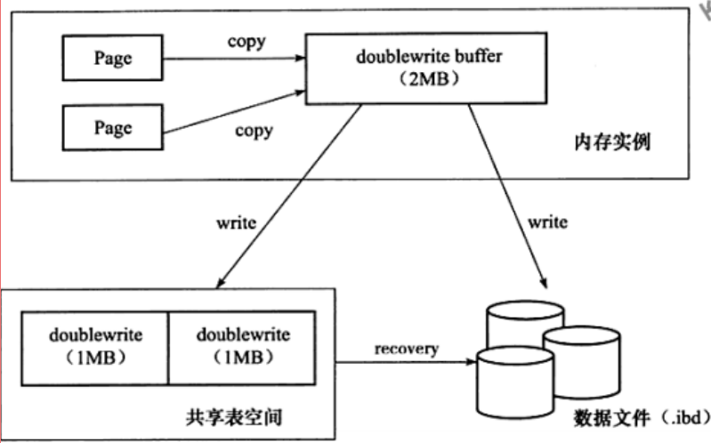

# 			 [     innodb引擎的4大特性        ](https://www.cnblogs.com/zhs0/p/10528520.html) 		

一：插入缓冲

二：二次写

三：自适应哈希

四：预读

**1.插入缓冲（insert buffer)**
插入缓冲（Insert Buffer/Change Buffer）：提升插入性能，change buffering是insert  buffer的加强，insert buffer只针对insert有效，change  buffering对insert、delete、update(delete+insert)、purge都有效

只对于非聚集索引（非唯一）的插入和更新有效，对于每一次的插入不是写到索引页中，而是先判断插入的非聚集索引页是否在缓冲池中，如果在则直接插入；若不在，则先放到Insert Buffer 中，再按照一定的频率进行合并操作，再写回disk。这样通常能将多个插入合并到一个操作中，目的还是为了减少随机IO带来性能损耗。

使用插入缓冲的条件：
\* 非聚集索引
\* 非唯一索引

Change buffer是作为buffer pool中的一部分存在。*Innodb_change_buffering参数缓存所对应的操作：(update会被认为是delete+insert)*

innodb_change_buffering，设置的值有：inserts、deletes、purges、changes（inserts和deletes）、all（默认）、none。

all: 默认值，缓存insert, delete, purges操作
none: 不缓存
inserts: 缓存insert操作
deletes: 缓存delete操作
changes: 缓存insert和delete操作
purges: 缓存后台执行的物理删除操作

可以通过参数控制其使用的大小：
innodb_change_buffer_max_size，默认是25%，即缓冲池的1/4。最大可设置为50%。*当MySQL实例中有大量的修改操作时，要考虑增大***innodb_change_buffer_max_size**

 

上面提过在一定频率下进行合并，那所谓的频率是什么条件？

1）辅助索引页被读取到缓冲池中。正常的select先检查Insert Buffer是否有该非聚集索引页存在，若有则合并插入。

2）辅助索引页没有可用空间。空间小于1/32页的大小，则会强制合并操作。

3）Master Thread 每秒和每10秒的合并操作。

**2.二次写(double write)**

Doublewrite缓存是位于系统表空间的存储区域，用来缓存InnoDB的数据页从innodb buffer  pool中flush之后并写入到数据文件之前，所以当操作系统或者数据库进程在数据页写磁盘的过程中崩溃，Innodb可以在doublewrite缓存中找到数据页的备份而用来执行crash恢复。数据页写入到doublewrite缓存的动作所需要的IO消耗要小于写入到数据文件的消耗，因为此写入操作会以一次大的连续块的方式写入

在应用（apply）重做日志前，用户需要一个页的副本，当写入失效发生时，先通过页的副本来还原该页，再进行重做，这就是double write 
doublewrite组成：
内存中的doublewrite buffer,大小2M。
物理磁盘上共享表空间中连续的128个页，即2个区（extend），大小同样为2M。
对缓冲池的脏页进行刷新时，不是直接写磁盘，而是会通过memcpy()函数将脏页先复制到内存中的doublewrite buffer，之后通过doublewrite 再分两次，每次1M顺序地写入共享表空间的物理磁盘上，在这个过程中，因为doublewrite页是连续的，因此这个过程是顺序写的，开销并不是很大。在完成doublewrite页的写入后，再将doublewrite buffer 中的页写入各个 表空间文件中，此时的写入则是离散的。如果操作系统在将页写入磁盘的过程中发生了崩溃，在恢复过程中，innodb可以从共享表空间中的doublewrite中找到该页的一个副本，将其复制到表空间文件，再应用重做日志。

 

**3.自适应哈希索引(ahi)**

Adaptive Hash index属性使得InnoDB更像是内存数据库。该属性通过innodb_adapitve_hash_index开启，也可以通过—skip-innodb_adaptive_hash_index参数
关闭

Innodb存储引擎会监控对表上二级索引的查找，如果发现某二级索引被频繁访问，二级索引成为热数据，建立哈希索引可以带来速度的提升

经常访问的二级索引数据会自动被生成到hash索引里面去(最近连续被访问三次的数据)，自适应哈希索引通过缓冲池的B+树构造而来，因此建立的速度很快。
哈希（hash）是一种非常快的等值查找方法，在一般情况下这种查找的时间复杂度为O(1),即一般仅需要一次查找就能定位数据。而B+树的查找次数，取决于B+树的高度，在生产环境中，B+树的高度一般3-4层，故需要3-4次的查询。

innodb会监控对表上个索引页的查询。如果观察到建立哈希索引可以带来速度提升，则自动建立哈希索引，称之为自适应哈希索引（Adaptive Hash Index，AHI）。
AHI有一个要求，就是对这个页的连续访问模式必须是一样的。
例如对于（a,b）访问模式情况：
where a = xxx
where a = xxx and b = xxx

特点
　　1、无序，没有树高
　　2、降低对二级索引树的频繁访问资源，索引树高<=4，访问索引：访问树、根节点、叶子节点
　　3、自适应
3、缺陷
　　1、hash自适应索引会占用innodb buffer pool；
　　2、自适应hash索引只适合搜索等值的查询，如select * from table where index_col='xxx'，而对于其他查找类型，如范围查找，是不能使用的；
　　3、极端情况下，自适应hash索引才有比较大的意义，可以降低逻辑读。

 

**4.预读(read ahead)**
InnoDB使用两种预读算法来提高I/O性能：线性预读（linear read-ahead）和随机预读（randomread-ahead）
为了区分这两种预读的方式，我们可以把线性预读放到以extent为单位，而随机预读放到以extent中的page为单位。线性预读着眼于将下一个extent提前读取到buffer pool中，而随机预读着眼于将当前extent中的剩余的page提前读取到buffer pool中。

线性预读（linear read-ahead）

方式有一个很重要的变量控制是否将下一个extent预读到buffer  pool中，通过使用配置参数innodb_read_ahead_threshold，可以控制Innodb执行预读操作的时间。如果一个extent中的被顺序读取的page超过或者等于该参数变量时，Innodb将会异步的将下一个extent读取到buffer pool中，innodb_read_ahead_threshold可以设置为0-64的任何值，默认值为56，值越高，访问模式检查越严格
例如，如果将值设置为48，则InnoDB只有在顺序访问当前extent中的48个pages时才触发线性预读请求，将下一个extent读到内存中。如果值为8，InnoDB触发异步预读，即使程序段中只有8页被顺序访问。你可以在MySQL配置文件中设置此参数的值，或者使用SET GLOBAL需要该SUPER权限的命令动态更改该参数。
在没有该变量之前，当访问到extent的最后一个page的时候，Innodb会决定是否将下一个extent放入到buffer pool中。

随机预读（randomread-ahead）

随机预读方式则是表示当同一个extent中的一些page在buffer pool中发现时，Innodb会将该extent中的剩余page一并读到buffer pool中，由于随机预读方式给Innodb  code带来了一些不必要的复杂性，同时在性能也存在不稳定性，在5.5中已经将这种预读方式废弃。要启用此功能，请将配置变量设置innodb_random_read_ahead为ON。