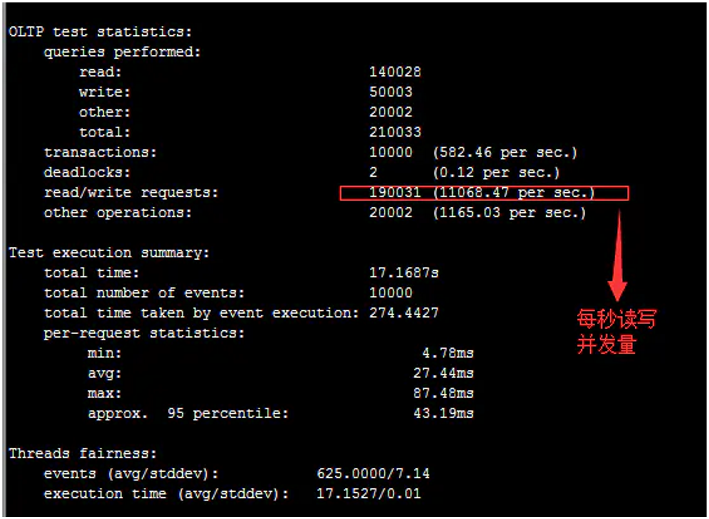

已剪辑自: https://www.jianshu.com/p/59c9dcaf0a25

##### sysbench是什么

sysbench是一款开源的多线程性能测试工具，可以执行CPU/内存/线程/IO/数据库等方面的性能测试.本身支持mysql数据库的压测。每一个后端开发者或者运维人员需要对自己的程序运行环境有一个基本了解才可以针对实际情况进行程序设计或者环境优化。

##### sysbench安装

开发环境是ubuntu，

apt-get install sysbench
 //版本信息查看
 sysbench --version

默认安装版本0.4

##### 数据库测试数据准备

sysbench --test=oltp --mysql-table-engine=innodb --mysql-host=192.168.x.x --mysql-db=testdb --oltp-table-size=500000 --mysql-user=root --mysql-password=123456 prepare

其中testdb 是数据库名字，生成500000条数据

##### 数据库测试

sysbench --num-threads=16 --test=oltp --mysql-table-engine=innodb --mysql-host=192.168.x.x --mysql-db=testdb --oltp-table-size=500000 --mysql-user=root --mysql-password=123456 run

##### 分析结果

