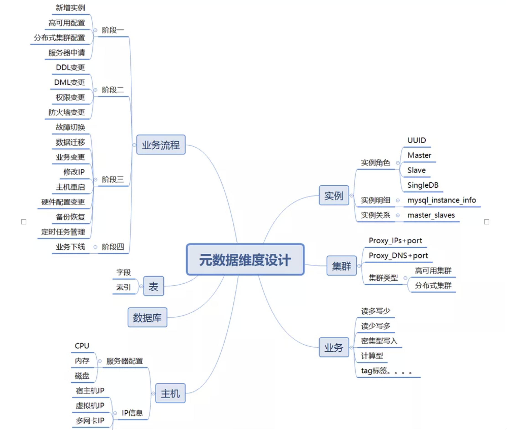
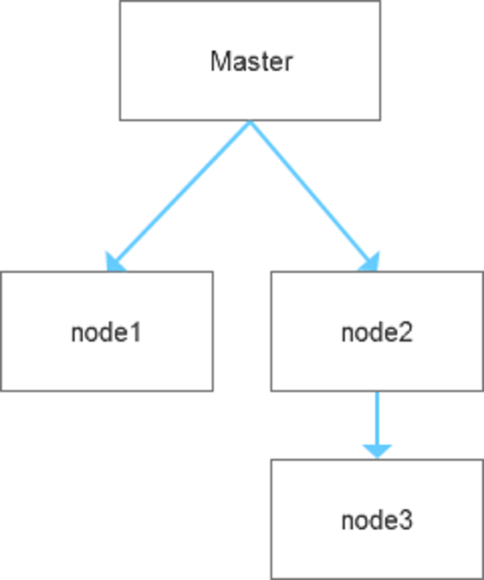
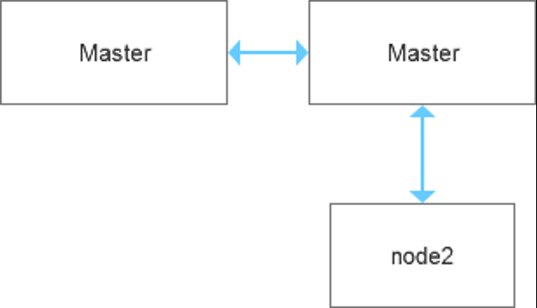
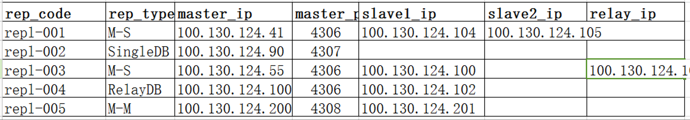
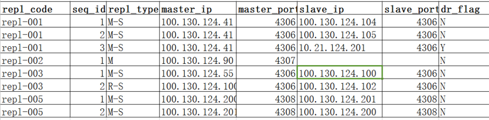

 关于MySQL拓扑关系的梳理

 原创 杨建荣 [杨建荣的学习笔记](javascript:void(0);) 昨天

 这是学习笔记的第 **2227** 篇文章

 关于MySQL的拓扑关系，最近是比较困扰我的，主要是因为最近在思考重构元数据层面的一些东西，发现原来的一些设计方式已经不能够支持现在的业务特点了。

 如果从一个更整体的角度来看待数据库的元数据，其实它是有一个生命周期管理的模型，而在这个模型中，我们势必会有所侧重。

 

  

 在做后面的说明之前，先说下元数据的维度设计。

 我把当前的现状做了下梳理，发现问题还真不少，而且都是硬伤。

 **l** **元数据遗漏和不一致**：对于ORM层的操作直接暴露，导致元数据会有手工变更的情况，出现数据和变更混乱

  

 **l** **元数据关联关系维护**：多表关联的配置关系在功能扩展时难以维护，需要统一开放相关的API

  

 **l** **元数据流程维护**：缺少相关的流程维护，应该基于业务场景驱动，需要设计相关的元数据流程

  

 **l** **元数据维度建设**：元数据维度建设单一，目前主要为实例和部分集群和数据库，缺少主机，应用层信息，集群和实例层信息没有关联起来

  

 **l** **元数据查询维度**：元数据查询的维度单一，信息可以更加全面，参考维度为：主机，实例，集群，应用，数据库

 对于复制拓扑的部分，在早期的时候使用了master-slaves的模式，即所有的复制关系都是一组一组的，类似下面的方式。

  

 | 100.130.124.41  | 4306 | 100.130.124.104 | 4306 |
  | --------------- | ---- | --------------- | ---- |
  | 100.130.124.90  | 4307 | 100.130.124.86  | 4307 |
  | 100.130.124.55  | 4306 | 100.130.124.100 | 4306 |
  | 100.130.124.100 | 4306 | 100.130.124.102 | 4306 |

 这种模式带来了一些明显的问题：

 1. 不支持域名
  2. 一主多从的关系不够清晰
  3. 级联实例的关系不好体现
  4. 基于双主模式的复制拓扑难以体现
  5. 读写分离的关系不好体现
  6. 不支持跨机房容灾的复制关系

 所以这些问题抛出来，也算是自我革命，整体上来看这种关系的维护是比较复杂的，如果碰到一些略微复杂的场景，总是会有一种无力感。

 比如这种复制关系，正常的一主一从做高可用，流转节点支撑后面的数据业务，这种通过单纯的主从模式无法体现。

  

 

 比如这种烟囱架构，不说它好与不好，但就从复制拓扑关系层面，单纯的主从模式也是难以支撑的。

 

 所以进一步拆分，可以提炼下，我们常见的数据库的使用形式大体有如下的几类：

 l 单实例（SingleDB） 

 l 主从实例（Master-Slaves） 

 l 高可用集群（HA_cluster） 

 l 分布式集群（Proxy_Cluster）

  

 对于这种模式，我们先从表格化的关系梳理开始，先不考虑数据库层的实现。 

  

 如果是这种复制拓扑关系，基本上能够解决我们所说的拓扑关系。

 

 MySQL 8.0有个特性叫做replicaSet,这个特性的名字给了我新的启发，那就是我们可以按照复制集的角度去重新看待原来的拓扑关系。

 比如复制集repl-001,包含一主两从，repl-003复制集，它是一主一从，同时包含一套级联复制环境，可以从repl-004得到明细的复制关系,repl-002是单实例环境，没有从库。

 这种设计能够基本上解决我们的一些理解上面的偏差，但是在设计层面其实是不够好的。一方面是这种关系的维护比较生硬，如果是一主多从的环境，单纯字段的扩展是不可行的，同时对于slave1,slave2,slave3等的逻辑判断简直会让人疯掉。

 所以在这个基础上可以再做一些改进，改进为如下的形式，我们把复制类型做了简化，同时对复制集做了进一步的标识，在末尾补充一个字段为dr_flag是标识是否为跨机房容灾。从这个复制关系来看，整体上是OK的，能够基本实现我们所说的那几个问题。

 

 我补充一些说明：

 单实例：repl_type为“M”,slave_ip为空

 一主一从：repl_type为“M-S”,master_ip，slave_ip不为空

 一主多从：repl_type为“M-S”,master_ip有多个slave_ip，分为多行存储，repl_code不变

 级联从库：repl_type为“R-S”,master_ip,slave_ip不为空，dr_flag为N,和上游的主从配置共享repl_code

 双主模式：repl_type为“M-S”,分两行存储，master_ip,slave_ip交叉，repl_code共享

  

 在这个基础上，我们来重新审视下原来提出的问题。

 1. 不支持域名
  2. 一主多从的关系不够清晰
  3. 级联实例的关系不好体现
  4. 基于双主模式的复制拓扑难以体现
  5. 读写分离的关系不好体现
  6. 不支持跨机房容灾的复制关系

  

 其实2，3，4，6是可以支持的，而对于域名服务的部分，目前看和复制拓扑没有直接的关系，因为域名的模式本质上提供的是高可用服务，这个在高可用层可以补充。 

 高可用层和集群层的整理差不多了，稍后发送出来。

  

  

  

 来自 <https://mp.weixin.qq.com/s/L64HWc3h7aqz9kcBGaKzow> 