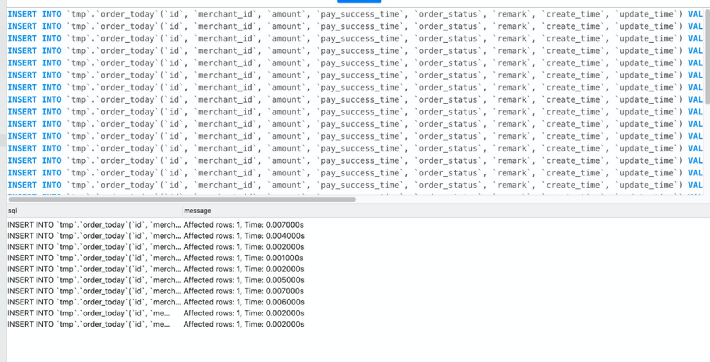
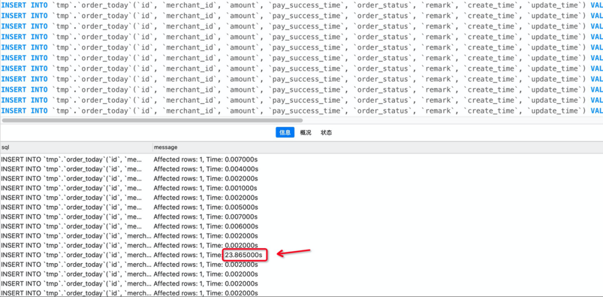
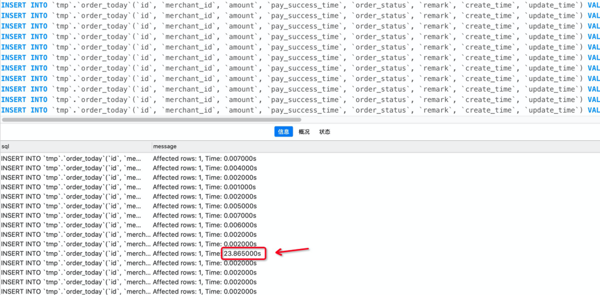

- 同事给我埋了个坑：Insert into select语句把生产服务器炸了

- 

- **# 前言**

-  

- Insert into select请慎用。这天xxx接到一个需求，需要将表A的数据迁移到表B中去做一个备份。本想通过程序先查询查出来然后批量插入。但xxx觉得这样有点慢，需要耗费大量的网络I/O，决定采取别的方法进行实现。通过在Baidu的海洋里遨游，他发现了可以使用insert into select实现，这样就可以避免使用网络I/O，直接使用SQL依靠数据库I/O完成，这样简直不要太棒了。然后他就被开除了。

-  

- 事故发生的经过。

-  

- 由于数据数据库中order_today数据量过大，当时好像有700W了并且每天在以30W的速度增加。所以上司命令xxx将order_today内的部分数据迁移到order_record中，并将order_today中的数据删除。这样来降低order_today表中的数据量。

-  

- 由于考虑到会占用数据库I/O，为了不影响业务，计划是9:00以后开始迁移，但是xxx在8:00的时候，尝试迁移了少部分数据(1000条)，觉得没啥问题，就开始考虑大批量迁移。

- - 在迁移的过程中，应急群是先反应有小部分用户出现支付失败，随后反应大批用户出现支付失败的情况，以及初始化订单失败的情况，同时腾讯也开始报警。

-  

- - 然后xxx就慌了，立即停止了迁移。

-  

- 本以为停止迁移就就可以恢复了，但是并没有。后面发生的你们可以脑补一下。

-  

- **# 事故还原**

-  

- 在本地建立一个精简版的数据库，并生成了100w的数据。模拟线上发生的情况。

-  

- **# 建立表结构**

-  

- 订单表

- CREATE TABLE `order_today` (`id` varchar(32) NOT NULL COMMENT '主键',`merchant_id` varchar(32) CHARACTER SET utf8 COLLATE utf8_general_ci NOT NULL COMMENT '商户编号',`amount` decimal(15,2) NOT NULL COMMENT '订单金额',`pay_success_time` datetime NOT NULL COMMENT '支付成功时间',`order_status` varchar(10) CHARACTER SET utf8 COLLATE utf8_general_ci NOT NULL COMMENT '支付状态 S：支付成功、F：订单支付失败',`remark` varchar(100) CHARACTER SET utf8 COLLATE utf8_general_ci DEFAULT NULL COMMENT '备注',`create_time` timestamp NOT NULL DEFAULT CURRENT_TIMESTAMP COMMENT '创建时间',`update_time` timestamp NOT NULL DEFAULT CURRENT_TIMESTAMP ON UPDATE CURRENT_TIMESTAMP COMMENT '修改时间 -- 修改时自动更新', PRIMARY KEY (`id`) USING BTREE,KEY `idx_merchant_id` (`merchant_id`) USING BTREE COMMENT '商户编号') ENGINE=InnoDB DEFAULT CHARSET=utf8;

- 订单记录表

- CREATE TABLE order_record like order_today;

- 今日订单表数据

- 

-  

- **# 模拟迁移**

-  

- 把8号之前的数据都迁移到order_record表中去。

- INSERT INTO order_record SELECT  * FROM  order_today WHERE  pay_success_time < '2020-03-08 00:00:00';

- 在navicat中运行迁移的sql,同时开另个一个窗口插入数据，模拟下单。

- 

-  

- 

-  

- 

- 从上面可以发现一开始能正常插入，但是后面突然就卡住了，并且耗费了23s才成功，然后才能继续插入。这个时候已经迁移成功了，所以能正常插入了。

-  

- **# 出现的原因**

-  

- 在默认的事务隔离级别下：insert into order_record select * from order_today 加锁规则是：order_record表锁，order_today逐步锁（扫描一个锁一个）。

-  

- 分析执行过程。

- 

- 通过观察迁移sql的执行情况你会发现order_today是全表扫描，也就意味着在执行insert into select from 语句时，mysql会从上到下扫描order_today内的记录并且加锁，这样一来不就和直接锁表是一样了。

-  

- 这也就可以解释，为什么一开始只有少量用户出现支付失败，后续大量用户出现支付失败，初始化订单失败等情况，因为一开始只锁定了少部分数据，没有被锁定的数据还是可以正常被修改为正常状态。由于锁定的数据越来越多，就导致出现了大量支付失败。最后全部锁住，导致无法插入订单，而出现初始化订单失败。

-  

- **# 解决方案**

-  

- 由于查询条件会导致order_today全表扫描，什么能避免全表扫描呢，很简单嘛，给pay_success_time字段添加一个idx_pay_suc_time索引就可以了，由于走索引查询，就不会出现扫描全表的情况而锁表了，只会锁定符合条件的记录。

-  

- 最终的sql

- INSERT INTO order_record SELECT  * FROM  order_today FORCE INDEX (idx_pay_suc_time)WHERE   pay_success_time <= '2020-03-08 00:00:00';

- 执行过程

- 

-  

- **# 总结**

-  

- 使用insert into tablA select * from tableB语句时，一定要确保tableB后面的where，order或者其他条件，都需要有对应的索引，来避免出现tableB全部记录被锁定的情况。

-  

- **# 参考**

- - https://blog.csdn.net/asdfsadfasdfsa/article/details/83030011

-  

- 来自 <https://mp.weixin.qq.com/s?__biz=MzA5Nzk3NzI1MQ==&mid=2247484116&idx=1&sn=0a527cecf1ee54d6d26ba635f22c9c23&chksm=9099d418a7ee5d0eb1079627a7b1b7f36e608827523da915fe2720ad7cc70c83f1e70091190a&mpshare=1&scene=1&srcid=0407S1LUuJ7YIEsxbJw2ignu&sharer_sharetime=1586226083746&sharer_shareid=4ccc32335c079a86eae33281fea18c34#rd> 