已剪辑自: https://mp.weixin.qq.com/s/-ZZZfXQ_W6jJutthFr7NmQ

 

- 这篇文章翻译了3篇blog：

https://www.percona.com/blog/2020/04/03/18-things-you-can-do-to-remove-mysql-   bottlenecks-caused-by-high-traffic-part-one/https://www.percona.com/blog/2020/04/06/18-things-you-can-do-to-remove-mysql-bottlenecks-caused-by-high-traffic-part-two/https://www.percona.com/blog/2020/04/07/18-things-you-can-do-to-remove-mysql-bottlenecks-caused-by-high-traffic-part-three/

- 毫无征兆的，但是系统的负载增加了100%，300%，500%，并且您的数据库必须承载这些请求。这是当今许多在线系统必须处理的情况。本文专注于处理意外的大流量事件。
- 你可以事先主动做很多事情，在“为应对黑色星期五的大流量，您数据库应该准备什么”一文中介绍了这些内容。
- 首先，让我们看看流量高峰时会对数据库产生什么影响---您的应用工程团队可能会遇到哪些问题？

 

- 查询响应事件变长
- 错误率变高（连接到数据库并执行查询）
- 数据库已宕机（不可用）
- 由于复制延时或者批处理任务无法完成，导致数据不准确（过期）

 

- 解决流量高峰的当前目标是尽快消除这些问题，这对大多数团队来说意味着专注于“容易实现的目标”----可以在几小时或几天内部署的解决方案，并且不需要进行大规模的应用程序或者架构的更改。
- 好消息是，对大多数应用程序，您可以通过一些简单的操作获得数据库性能的几倍提升：

 

1.对您的云数据库的规格进行扩容
 

复杂性：低

潜在影响：高

- 如果您的数据库运行在云环境（或者一些虚拟化环境中），使用更高的实例规格通常是最简单的方法（也就是俗称的“钞能力调优”）。这是解决方案中最贵的方法之一，但这是您在继续进行其他性能优化操作之前时可以采取的短期维护操作。
- 注意：数据库不会线性扩展，所以不要产生错误的安全感---如果您的云数据库供应商有10倍大的可用实例，不要期望它能承载10倍的流量。根据负载可能会少很多。

## 2.部署更多的从节点

复杂性：中等 潜在影响：高

- 如果您的负载是读多写少，那么部署更多的从节点可能是提高性能的好方法。不知道您的负载是什么类型？重温“您的负载是读多写少还是读少写多”可以帮助您找到答案。
- 部署从节点是不够的；您需要确保您的应用程序能够将流量路由到它们。一些应用程序在应用层实现此功能很容易。对其他应用来说，部署ProxySQL并使用它的读写分离的功能可能是更好的选择。
- 在很多场景下，您甚至可以使得整个应用程序只使用从节点：如报表类应用程序或者使用MySQL全文检索类的应用程序。
- 请注意，MySQL复制是异步的， 这意味着从节点会有数据延时的情况（有时延时很高），因此，查询要路由到最新数据的从节点，并确保监控复制延时和复制是否中断。

## 3.部署ProxySQL进行连接管理和缓存

复杂性：中等 潜在影响：高

- ProxySQL是管理MySQL 流量的一个很有用的工具，特别是在流量高峰期。ProxySQL 有连接池功能，这样应用程序不会耗尽连接，也不会因为有太多的并发连接导致MySQL超载。
- 如果您在使用Percona版MySQL或者MariaDB，您还可以启用线程池功能，它可以使得MySQL直接处理100000以上的连接。
- 在流量高峰时，ProxySQL另一个更有帮助的功能是ProxySQL 查询缓存，它允许您将查询结果缓存一段时间。
- 在一些场景下您不需要最新的数据结果时，将这些流量路由到从节点，并缓存相同的查询，可以带来一些性能提升。

## 4.停掉重任务的应用程序功能

复杂性：中等 潜在影响：中等

- 管理和开发团队常常讨厌这样的想法，但是这是一个很好的方法。并不是所有的应用程序功能都会有相同的作用或者调用频率相同，很少用到的程序功能通常负载是占据最高的，因为没有花费很多时间来优化它们。在您经历流量高峰或找时间优化它们时，禁用它们（或者短时间禁用）通常是一个很好的做法。

## 5.检查资源瓶颈

复杂性：低 潜在影响：高

- 数据库硬件层面的瓶颈可能有一个或者多个——CPU，内存，磁盘或者网络。如果您使用PMM监控，您可以在MySQL Instance Summary     Dashboard的Node Summary章节看到这一内容。 

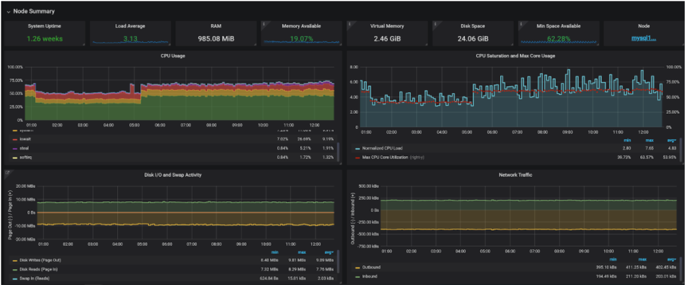

- 如果某个资源已经饱和，通常可以通过增加该资源获得更好的性能，不过要考虑的一件事是优化减少该资源的占用。例如，CPU使用率过高通常可以通过优化查询来解决，而不是通过获得更快的CPU来解决。

## 6.获得更多的CPU核数或者更快的CPU核心

复杂性：低 潜在影响：中

- 关于MySQL需要了解的一个重要的事情是，它只能使用一个CPU核心来完成运行单个查询的大部分工作，这意味着更多的CPU核心并不会让您的慢查询或者批量作业任务执行的更快。如果说这是您遇到的问题，您需要获得更快的CPU核心，或者您可能需要获得更多的CPU核数。
- 但是如何确认您现在的负载是什么类型的呢？
- 在PMM（或者您喜欢的监控中）的Node Summary Dashboard中查看CPU使用量，CPU饱和度和最大核心使用数量。
             

- 如果CPU使用量很高（不包括IOwait）,标准化的负载平均值为2或者更高，您的系统如果有更多可用CPU核数性能会更好。
             
- 但是，如果最大CPU内核利用率接近100%，并且CPU使用率不高，那么您应该需要更快的CPU核心。
             
- 例如，假设您使用了AWS，于通用的M5实例类型相比，Cloud C5实例提供了更好的CPU性能。
             
- 当涉及到CPU时，特别是在云环境和虚拟化环境中，需要注意的另一件是“CPU Stealing”——它是指MySQL实例的CPU资源比表明的CPU频率和CPU核数要少的多。
             

## 7.增大内存

复杂性：低 潜在影响：高

- 如果数据不能很好的加载到内存，MySQL的性能可能会严重受到限制。如果您的数据已经加载到内存中，那么即使添加更多的内存也不会对性能有任何提升。
- 即使运行在非常快的存储上，例如Inter Optane或者NVMe的存储，访问内存中的数据仍然要快一个数量级。
- 如何知道您有足够的内存？查看内存利用率和I/O。 

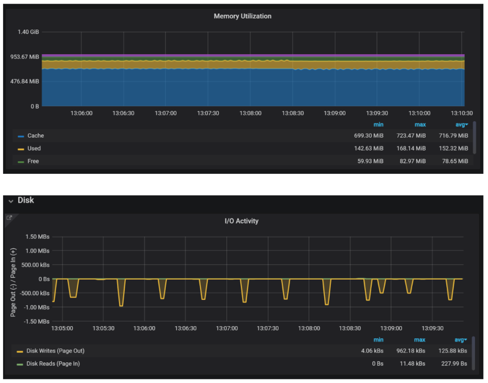

- I/O实际上是我要首先查看的。例如本例，您没有读IO，那么所有的数据都在缓存中——MySQL的数据缓存或者操作系统的文件缓存。然而，即使所有的数据都被缓存，写操作也无法避免，因为数据库的修改总需要落盘。
- 通常情况下，您不会希望完全消除读IO——大多数情况下，它需要太多的内存，而且这也不是必要的。但是您需要确保读IO不会对性能产生实质性的影响。您可以通过确保磁盘负载是否可控来做到这一点，或者，如果您安装了PMM，您可以在Query Analytics的Dashboard查看磁盘读对特定的查询性能影响有多大。 

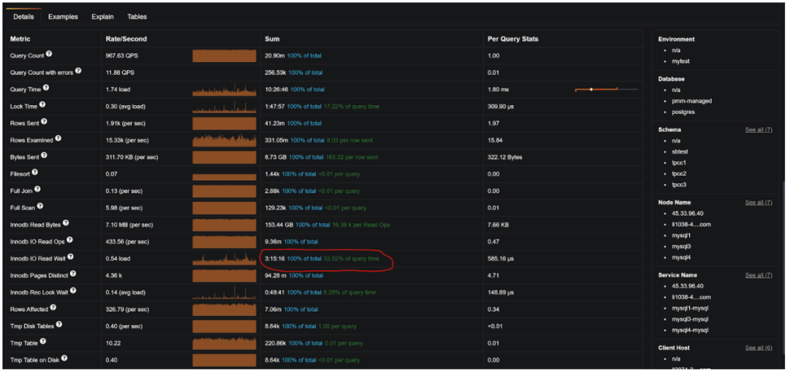

- 注意：虽然您可以通过简单地添加内存来获得一些性能提升，因为操作系统会将其用做缓存，但是为了获得大部分的新可用内存，您应该配置MySQL的一些参数。 Innodb_buffer_pool_size是需要考虑的最重要的参数。内存的80%经常被用做经验法则，但除此以外还有更多。
- 在配置MySQL 以利用所有内存时，您应该注意一件事是确保您不会过度使用内存，MySQL也不会耗尽虚拟内存（因为它可能会崩溃或者内存不足OOM）。 

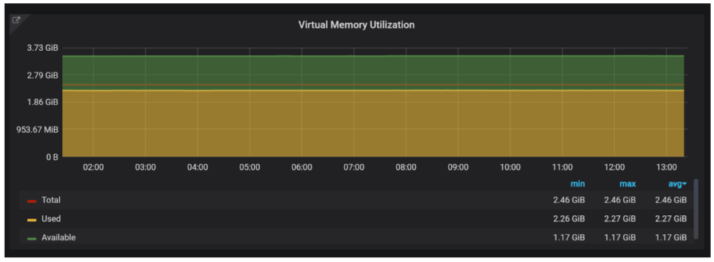

- 您还需要确保没有显著的swap交换（1MB/秒或者更多），但是一些swap空间的使用是可以接受的。更多细节查看“为swap辩护：常见的误解”。 

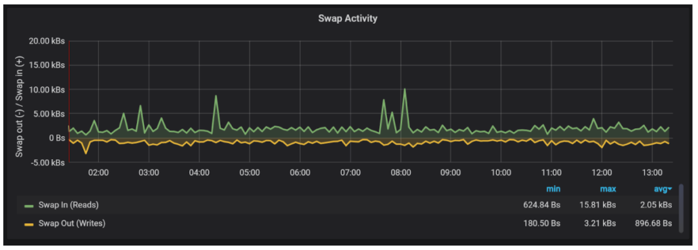

## 8.迁移到更快的存储

复杂性：中 潜在影响：高

- 当数据量很小时，将其缓存在内存中是扩展读取的最好的方法。如果您的数据库很大，这时更快的存储可能是更好的选择。另外，即使您有足够大的内存，也需要处理写操作。这篇古老仍然有效的文章详细地讨论了这个主题。
- 对于CPU，您需要知道何时需要更多或者更快的核，而存储的情况则更加复杂。您需要了解吞吐量（IOPS）与延迟之间的差异，以及读写性能之间的区别。
- 查看IO性能的一种方法是查看存储的IOPS或者IO的带宽。 

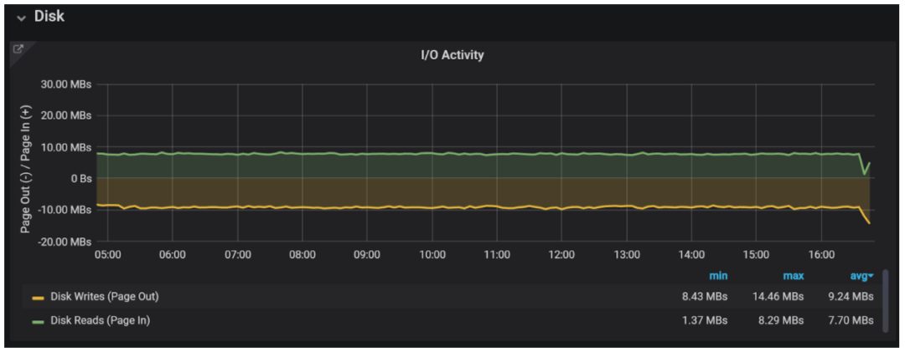

- 它可以帮助您查看您是否接近或者遇到存储的限制。您可能不知道存储的具体性能。在这种情况下，最好看一下磁盘IO负载，它大致显示了当时有多少IO操作在运行。 

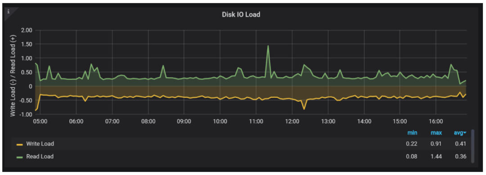

- 如果这个数字是数十甚至数百，您的磁盘很可能已经超载了。与CPU不同，存储的问题在于我们无法知道什么是“天然并发级别”，何时可以并行处理请求，何时需要排队。 

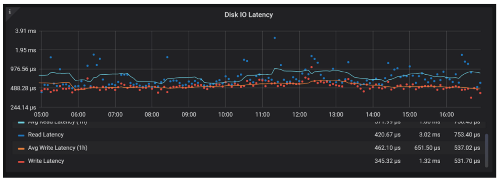

 

- 查看读和写的请求延时，看看它们与流量峰值之前是否有什么不同。另外，读写延时可能会各自受到影响，应该分开查看。
- 更快的存储能在多大程度上影响查询的性能？从读取的角度来看，您可以如第7章节所示使用PMM的Query Analytics。但是对于写入而言，它更复杂。
- 写InnoDB Redo Log，或者更具体的说，通过 fsync()将日志持久化到磁盘是一个非常常见的瓶颈。通过查看MySQL Innodb Details的Dashboard中 Innodb Disk IO 章节中的被阻塞的fsync数量，来判断系统是否发生了这种情况。 

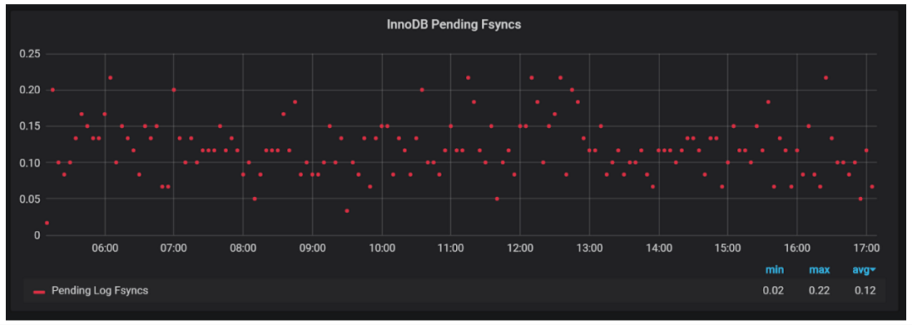

- 如果始终接近1，则可能出现磁盘刷新瓶颈。为了改善这种情况，您需要更低的写（fsync()）延时的存储。您可以调整MySQL的配置降低持久化保证（双1），或者调整工作负载将查询分组到更少的事务中。
- 有哪些更快的存储可以选用？Intel Optane SSD 或者 NVMe存储往往提供最佳性能和最快和最可预测的延时。但是，如果您使用这些解决方案，尤其是云环境中，请确保使用某种形式的复制来实现数据冗余。
- 如果您需要使用网络存储，请使用已经对吞吐量优化的存储类型，例如AWS EBS io1类型卷。传统的“通用”gp2卷可能更划算，但是他们的性能峰值更低。

## 9.检查您的网络

复杂性：低 潜在影响：高

- 当在流量高峰期检查网络是否是瓶颈的时候，您需要查看带宽，延时和Errors。
- 网络往往比其他资源更加复杂，因为所有这些都必须分别针对不同的客户端进行测量。例如，运行在“本机”上的客户端通常不会出现问题，但是，在世界其他地方运行的客户端与数据库通信将会有问题。
- 网络带宽，至少在本地节点上，很少是问题。 

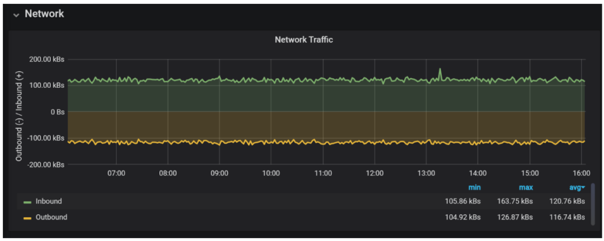

- 很少有应用程序检索大量结果集能将网络打满。网络备份和其他大量数据传输可能会将网络打满，导致其他用户的事务处理变慢。
- 客户端和数据库服务器之间的延迟可以通过“ping”或者“mtr”工具粗略的衡量。如果您有一个万兆网络，那么在同一数据中心的延时期望值是0.2ms。在云厂商的同一可用区域中，该值通常会高一些。不同的高可用区域具有更高的延时，较远区域的延时可能达100ms，与本地网络相比，它们的差异可能非常大。 

![My traceroute [ VO ， 92 ]  lientl （ 17 2 ． 10 5 ． 158 ． 2 2 6 ）  Display mode  eys ： Help  Host  1 ． 23 ． 92 ． 2 8 ． 2  2 ． 172 ． 10 5 ． 152 ． 2 51  Restart statistics  Packets  2020 一 03 一 26T21 ： 4 9 ： 3 8 + 0 0 0 0  Order Of fields quit  Loss  0 ． 0  0 ． 0  Snt  681  680  Last  0 ． 6  1 ， 1  Pings  Avg Be s t  0 ． 4  0 ． 2  Wrst St Dev  12 · 4  4 2 ． 4 ](clip_image012.png)

 

- 在这个场景下，我们看到客户端和服务器之间的通信仅通过一个路由器（可能还有几个交换机），平均延时为1.5ms，没有丢包。
- 您应该尽可能的将应用程序和数据库部署在一个可用区域（如果可能的话），但是对于延迟敏感的应用程序，必须要将应用程序和数据库部署在同一区域。
- 当有errors时，TCP重传是您最大的敌人，因为它会显著地增加延时。 

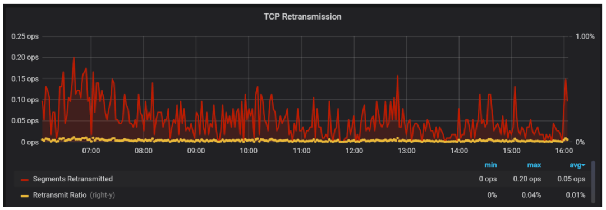

- 如果您在流量高峰期间看到重传的速度在增加，则在网络层可能存在需要解决的问题。

## 10.定位并优化导致负载的查询

复杂性：低 潜在影响：高

- 定位和优化慢查询是您可以做的最有价值的活动之一，因为它带来了长期的收益。与提升硬件不同，它不需要额外的投资（除了时间）。
- 如果您正在运行PMM，那么您应该查看Query Analytics Dashboard，该工具默认情况下根据产生的负载对查询进行排序。 

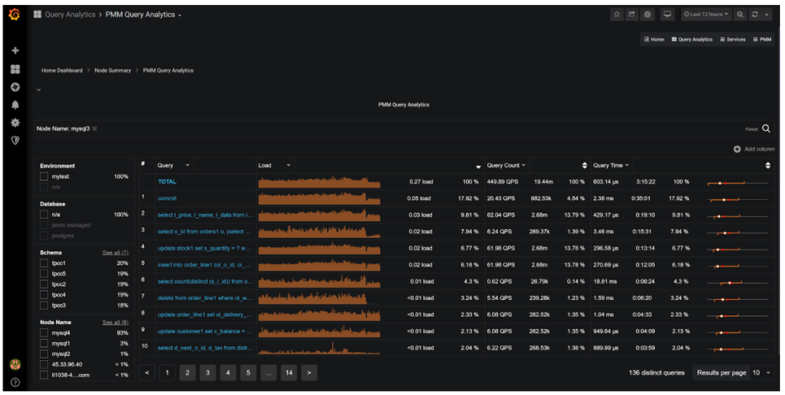

- 按照这个顺序检查和优化查询是使系统运行得更快的绝妙方法。在某些情况下，类似 commit，您不能优化SQL，但是您可以通过提升硬件或者更改MySQL配置来加速查询。
- 查看查询的执行详细信息： 

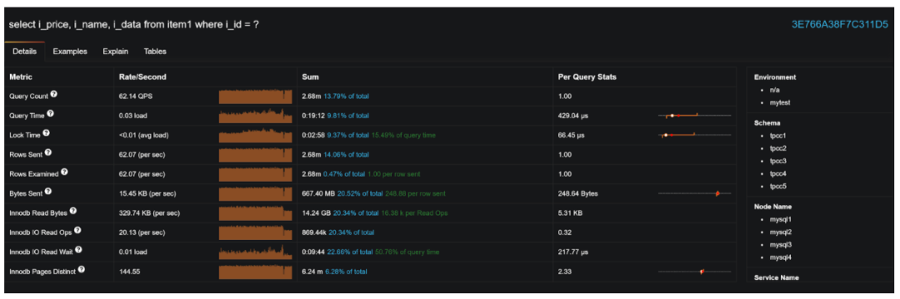

- 查看执行计划，看看该查询是否可以优化及如何去优化： 

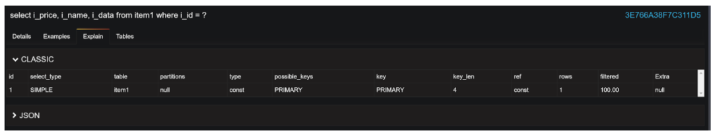

- MySQL SQL优化是一个非常复杂的主题，不可能在一篇博客中完全覆盖。

## 11.添加缺失索引

复杂性：低 潜在影响：高

- 完整的优化SQL可能需要改写SQL，这需要开发和测试时间，而这很难做到。这也就是为什么作为第一步，您可能希望只是添加缺失的索引。这并不需要更改应用程序，而且相当安全（极少数例外），并且不会更改查询的结果。

## 12.删除无用的索引

复杂性：中 潜在影响：中

- 随着时间的推移，数据库schema通常会累积重复、冗余或者未使用的索引。有些是由于错误或者误解而添加的，有些是在过去是有用的，但是随着应用程序的更改而不在有用。
- 您可以在这篇博客中了解更多关于冗余和重复索引的信息。Percona Toolkit中的 pt-duplicate-key-checker也是查找它们的好工具。
- 未使用的索引比较复杂，也有一定的风险——仅仅因为上周没有查询需要该索引，并不意味着这个月或者这个季度的查询不会使用该索引。
- 这篇名为《MySQL索引的基本管理》的博客提供了如何找到这些索引的方法。如果您正在使用MySQL8，您可以考虑在删除它之前先将其置为不可见索引一段时间。

## 13.正确配置MySQL服务器

复杂性：中 潜在影响：高

- 配置不当的MySQL服务器可能会导致严重的问题，特别是在流量高峰的高负载情况下，但是正确的基础配置并不难。虽然MySQL服务有400个参数可以调优，但您只需要更改其中的10-20个，就可以为您的工作负载获得95%的可用性能。
- 这篇博文涵盖了最重要的基础知识。

## 14.删除不需要的数据

复杂性：中 潜在影响：中

- 在所有条件相同的情况下，数据越多，数据库的运行速度就越慢，删除（或者归档）不需要的在线数据是提升性能的好方法。
- 在许多场景下，您会发现应用程序在数据库保存的各种日志几乎追溯到许多年前，除了几周或者几个月的数据之外它们几乎没有什么用处。
- Percona Toolkit中的 pt-archiver是一个很好的归档旧数据的工具。
- 注意：尽管在清理完成之后，您的数据库变得更加精简、更快，但是该过程本身会占用额外的资源，而且在数据库已经超载时不应该这样做。

## 15.维护数据库统计信息

复杂性：中 潜在影响：中

- 在一切都很平静时，您可以不用维护数据库的统计信息。但是这样一来，数据库统计信息可能会过时，您的表可能因为碎片，并不处在最佳状态。
- 在您的表上执行 OPTIMIZE TABLE，重建这些表提高它们的效率并更新统计信息。
- 要对所有的表进行优化，可以运行 mysqlcheck-optimization-A。
- 请记住，优化可能比清理旧数据对系统的影响更大，因此不希望您在负载高峰期间进行优化。一个好的方法是将副本（从节点）的应用流量移除，滚动对从节点执行优化，然后再提升一个从节点为主节点。

## 16.检查您的后台任务

复杂性：中 潜在影响：中

- 备份、收集统计信息、报表生成和大数据负载等后台作业通常没有得到很好的优化——它们可以在业务低峰期运行，MySQL服务器可以处理这些额外的负载。在流量高峰期，它们可能会导致数据库超载和宕机。
- 在流量高峰期间后台任务带来的另一个问题是重叠或者雪崩效应。如果您的后台任务通常运行15分钟，您将其中两个任务安排在凌晨2点和3点，通常一次只运行其中一个任务。但是，由于额外的负载，现在可能任务需要2个小时才能完成，这可能导致在同时运行多个后台任务，从而导致额外的负载并带来数据损坏。
- 检查您的后台任务，并依次核对以下问题：

 

- 我需要这个后台任务吗？可以将这个任务推后吗？
- 可以在从节点上运行这个任务吗？在不同的从节点运行不同的任务可能是一个很好的解决方案！
- 您是否调度了任务以确保它们不会重叠？
- 有优化的后台任务吗？优化这些查询，或者如果您使用 mysqldump备份，则应改用Percona的 Xtrabackup，这样效率更高。
- 您会限制这些任务使用的资源吗？例如，限制批处理任务的并发数（并行连接的数量）。或者，如果使用Percona的Xtrabackup会影响您服务器的性能，那么可以使用 ThrottleBackups。

## 17.检查热点数据

复杂性：高 潜在影响：高

- 有些应用程序通过硬件扩展可以很好地进行扩展，而另一些则不能。通常区别在于，应用程序依赖于“热点”时，需要频繁更新的数据就会成为瓶颈。例如，如果在数据库创建一个计数器，每个事务都需要对其进行更新，那么它无法很好地进行扩展。
- 热点种类很多，其中一些很难查找和诊断。最常见的一种类似于上述内容，并显示为很多行锁等待（和高死锁率）。
- 通过PMM的**MySQL InnoDB     Details** dashboard，可以查看整体上等待行级锁的时间： 

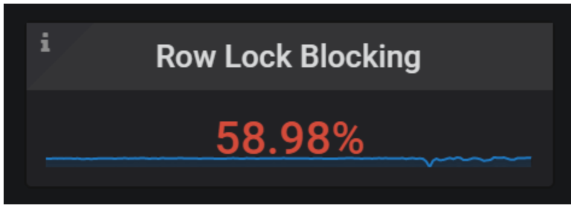

- 或者查看回滚率： 

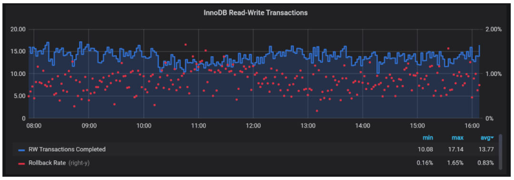

- 请注意，如果您在流量高峰期看到的应用程序超出正常范围，不同的应用程序有不同的正常值。
- 您还可以查看哪些特定的查询有长的行锁等待： 

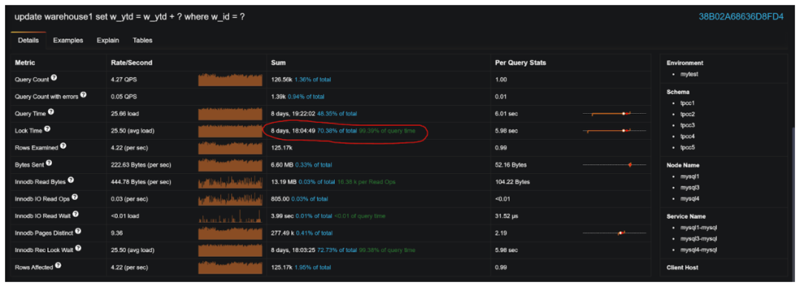

- 减少热点可能与添加更好的索引一样容易，也可能更加困难，需要重新设计应用程序。无论如何，我在这里引入这部分内容，因为如果您设计了一个具有非常糟糕的有数据热点的应用程序，上面涉及的简单的优化技术可能对您不起作用。

## 18.正确配置您的应用程序服务器

复杂性：中 潜在影响：中

- 在配置MySQL服务器时，在应用服务器端使用正确的设置是非常重要的。它需要确保您在使用长连接，而不是为每个小事务使用短连接，特别是您在使用TLS/SSL连接数据库的时候。如果您使用连接池，请确保其配置正确，特别是在您不使用ProxySQL或者线程池的情况下。具体的优化建议需要您根据编程语言、ORM框架或者连接池有所不同而一一谷歌！

## 总结

- 这有许多建议，实际上，在流量高峰期，您可以做很多事情来控制一切。好消息是您不需要遵循所有这些建议即可获得性能提升，并最终以出色的应用程序性能赢得客户青睐（或者让开发团队不再为数据库问题烦心），将这些建议看作一个菜单——查看最适合您的环境的建议以及可能带来最大收益的建议，然后使用这些建议指导下一步操作！