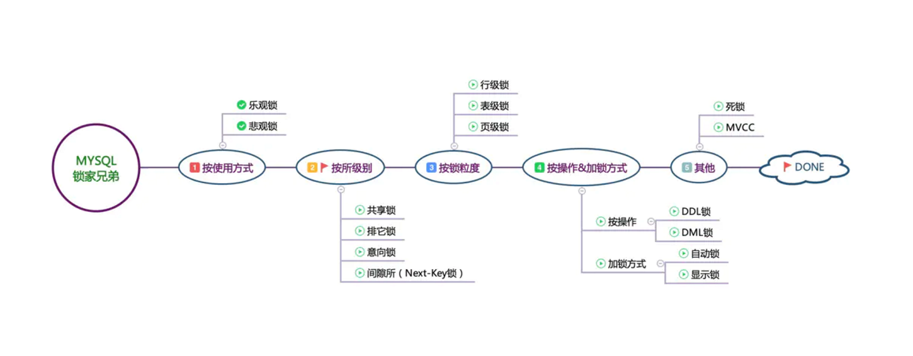
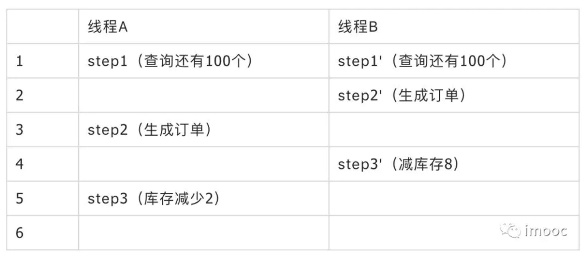

已剪辑自: https://www.jianshu.com/p/ed896335b3b4

# Milestone

本文需要阅读时间大约在1小时，请抽出完整的时间来阅读，一目十行，真心没用

后面会按照下图，分批次对Mysql的锁和大家一起分享

image.png

# 前言

数据库的锁机制是并发控制的重要内容，是对程序控制数据一致性的补充，更细粒度的保障数据的一致性，而使各种共享资源在被并发访问变得有序所设计的一种规则。下面主要针对我们常见的InnoDB和Myisam进行解析。

注：下文提到的分库分表、fail-fast理念如果有需要，可以给大家分享下，在我厂内部应用场景。

*🌺🌺🌺听着《嘴巴嘟嘟》，写着文章，有种初念的感觉。*

# 花絮

小明是一家小作坊的屌丝程序员，工作3年，无房无车，有个女朋友叫"清风"，一天一天又一天，过着无欲无求的屌丝生活，突然下雪的那天，听说大厂某宝在招人：钱多事少妹纸穿的少、年终6月起步、有股票、上班不打卡、食堂超好、大神超多、可以直接对话18罗汉、老肖，甚至还可以撩马爸爸！于是乎，小明血脉膨胀，气血翻涌，热泪盈眶，竟不能自已！闭关，苦练杀敌本领，2个月后，成功进入阿里，成为屌丝中的王者！于是乎，翻出祖传宝典《程序员活下去的200个本事》之MYSQL篇。

**有想来阿里的，可以联系我，内推你哦~**

# 乐观锁&悲观锁

乐观并发控制和悲观并发控制是并发控制采用的主要方法。乐观锁和悲观锁不仅在关系数据库里应用，在Hibernate、Memcache等等也有相关概念。

## 1. 悲观锁

**现在互联网高并发的架构中，受到fail-fast思路的影响，悲观锁已经非常少见了。**

悲观锁(Pessimistic Locking)，悲观锁是指在数据处理过程，使数据处于锁定状态，一般使用数据库的锁机制实现。

### 1.1 数据表中的实现

在MySQL中使用悲观锁，必须关闭MySQL的自动提交，set autocommit=0，MySQL默认使用自动提交autocommit模式，也即你执行一个更新操作，MySQL会自动将结果提交。

set autocommit=0

举个🌰栗子：
 假设商品表中有一个字段quantity表示当前该商品的库存量。假设有一件Dulex套套，其id为100，quantity=8个；如果不使用锁，那么操作方法

**如下：**

//step1: 查出商品剩余量
 select quantity from items where id=100;
 //step2: 如果剩余量大于0，则根据商品信息生成订单
 insert into orders(id,item_id) values(null,100);
 //step3: 修改商品的库存
 update Items set quantity=quantity-1 where id=100;

这样子的写法，在小作坊真的很正常，No Problems，但是在高并发环境下可能出现问题。

如下:

 

image.png

其实在①或者②环节，已经有人下单并且减完库存了，这个时候仍然去执行step3，就造成了**超卖**。

但是使用悲观锁，就可以解决这个问题，在上面的场景中，商品信息从查询出来到修改，中间有一个生成订单的过程，使用悲观锁的原理就是，当我们在查询出items信息后就把当前的数据锁定，直到我们修改完毕后再解锁。那么在这个过程中，因为数据被锁定了，就不会出现有第三者来对其进行修改了。而这样做的前提是需要将要执行的SQL语句放在同一个事物中，否则达不到锁定数据行的目的。

如下：

//step1: 查出商品状态
 select quantity from items where id=100 for update;
 //step2: 根据商品信息生成订单
 insert into orders(id,item_id) values(null,100);
 //step3: 修改商品的库存
 update Items set quantity=quantity-2 where id=100;

**select...for update**是MySQL提供的实现悲观锁的方式。此时在items表中，id为100的那条数据就被我们锁定了，其它的要执行select quantity from items where id=100 for update的事务必须等本次事务提交之后才能执行。这样我们可以保证当前的数据不会被其它事务修改。

### 1.2 扩展思考

需要注意的是，当我执行select quantity from items where id=100 for update后。如果我是在第二个事务中执行select quantity from items where id=100（不带for update）仍能正常查询出数据，不会受第一个事务的影响。另外，MySQL还有个问题是select...for update语句执行中所有扫描过的行都会被锁上，因此**在MySQL中用悲观锁务必须确定走了索引，而不是全表扫描，否则将会将整个数据表锁住**。

悲观锁并不是适用于任何场景，它也存在一些不足，因为悲观锁大多数情况下依靠数据库的锁机制实现，以保证操作最大程度的独占性。如果加锁的时间过长，其他用户长时间无法访问，影响了程序的并发访问性，同时这样对数据库性能开销影响也很大，特别是对长事务而言，这样的开销往往无法承受，这时就需要乐观锁。

在此和大家分享一下，在Oracle中，也存在select ... for update，和mysql一样，但是Oracle还存在了select ... for update nowait，即发现被锁后不等待，立刻报错。

## 2. 乐观锁

乐观锁相对悲观锁而言，它认为数据一般情况下不会造成冲突，所以在数据进行提交更新的时候，才会正式对数据的冲突与否进行检测，如果发现冲突了，则让返回错误信息，让用户决定如何去做。接下来我们看一下乐观锁在数据表和缓存中的实现。

### 2.1 数据表中的实现

利用数据版本号（**version**）机制是乐观锁最常用的一种实现方式。一般通过为数据库表增加一个数字类型的 “version” 字段，当读取数据时，将version字段的值一同读出，数据每更新一次，对此**version值+1**。当我们提交更新的时候，判断数据库表对应记录的当前版本信息与第一次取出来的version值进行比对，如果数据库表当前版本号与第一次取出来的version值相等，则予以更新，否则认为是过期数据，返回更新失败。

放个被用烂了的图

image.png

**举个栗子🌰：**

//step1: 查询出商品信息
 select (quantity,version) from items where id=100;
 //step2: 根据商品信息生成订单
 insert into orders(id,item_id) values(null,100);
 //step3: 修改商品的库存
 update items set quantity=quantity-1,version=version+1 where id=100 and version=#{version};

既然可以用**version**，那还可以使用**时间戳**字段，该方法同样是在表中增加一个时间戳字段，和上面的version类似，也是在更新提交的时候检查当前数据库中数据的时间戳和自己更新前取到的时间戳进行对比，如果一致则OK，否则就是版本冲突。

需要注意的是，如果你的数据表是读写分离的表，当master表中写入的数据没有及时同步到slave表中时会造成更新一直失败的问题。此时，需要强制读取master表中的数据（将select语句放在事物中）。

即：**把select语句放在事务中，查询的就是master主库了！**

### 2.2 乐观锁的锁粒度

乐观锁在**我鸟系统**中广泛用于状态同步，我们经常会遇到并发对一条物流订单修改状态的场景，所以此时乐观锁就发挥了巨大作用。

分享一个精心挑选乐观锁，以此缩小锁范围的case

商品库存扣减时，尤其是在秒杀、聚划算这种高并发的场景下，若采用version号作为乐观锁，则每次只有一个事务能更新成功，业务感知上就是大量操作失败。

// 仍挑选以库存数作为乐观锁
 //step1: 查询出商品信息
 select (inventory) from items where id=100;
 //step2: 根据商品信息生成订单
 insert into orders(id,item_id) values(null,100);
 //step3: 修改商品的库存
 update items set inventory=inventory-1 where id=100 and inventory-1>0;

没错！**你参加过的天猫、淘宝秒杀、聚划算，跑的就是这条SQL**，通过挑选乐观锁，可以减小锁力度，从而提升吞吐～

乐观锁需要灵活运用

现在互联网高并发的架构中，受到fail-fast思路的影响，悲观锁已经非常少见了。

### 2.3 扩展训练

在阿里很多系统中都能看到常用的features、params等字段，这些字段如果不进行版本控制，在并发场景下非常容易出现信息覆盖的问题。

比如：

线程 原始features 目标features 

|      |      |          |
| ---- | ---- | -------- |
| T-A  | a=1; | a=1;b=1; |
| T-B  | a=1; | a=1;c=1; |

我们期望最终更新的结果为:

a=1;b=1;c=1;

此时若SQL写成了

update  
   lg_order
 set  
   features=#features#
 where  
   order_id=#order_id#

那么随着T-A和T-B的先后顺序不同，我们得到的结果有可能会是a=1;b=1;或a=1;c=1;

若此时采用乐观锁，利用全局字段version进行处理，则会发现与lg_order的其他字段变更有非常高的冲突率，因为version字段是全局的

update  
   lg_order
 set  
   features=#features#,  
   version=version+1
 where  
   order_id=#order_id#  
   and version=#ori_version#

**这种SQL会因为version的失败而导致非常高的失败率**，当然咯，我其他字段也在并发变更呀～

## 怎么办？

**聪明的你**会发现一般设计库表的时，凡事拥有features类似字段的，都会有一个features_cc与之成对出现，很多厂内年轻一辈的程序员很少注意到这个字段，我们努力纠正过很久，现在应该好很多了。

features_cc的作用就是features的乐观锁版本的控制，这样就规避了使用version与整个字段冲突的尴尬。

update  
   lg_order
 set  
   features=#features#,  
   features_cc= features_cc +1
 where  
   order_id=#order_id#  
   and features_cc =#ori_ features_cc#

这里需要注意的是，需要应用owner仔细review自己相关表的SQL，要求所有涉及到这个表features字段的变更都必须加上features_cc= features_cc +1进行计算，否则会引起并发冲突，**平时要做好保护措施，不然很中意中标**。

在实际的环境中，这种高并发的场景中尤其多，大家思考一下是否自觉的加上了对features字段的乐观锁保护。

**不过需要提出的是，做这种字段的精耕细作控制，是以提高维护成本作为代价的。**

features、attribute这两个字段我们花费了很长时间才BU同学达成共识和review代码，要求用_cc来做版本控制。

若变更太频繁，可以提出来单独维护，做到冷热数据分离。

**今天就到这里吧，有些读者说我写的东西偏简单，写技术类的文章也是循序渐进的过程，后面会逐渐加深技术难度和广度，并且把在大厂中是遇到的坑分享给大家。**

喜欢的同学可以献花了~

image.png