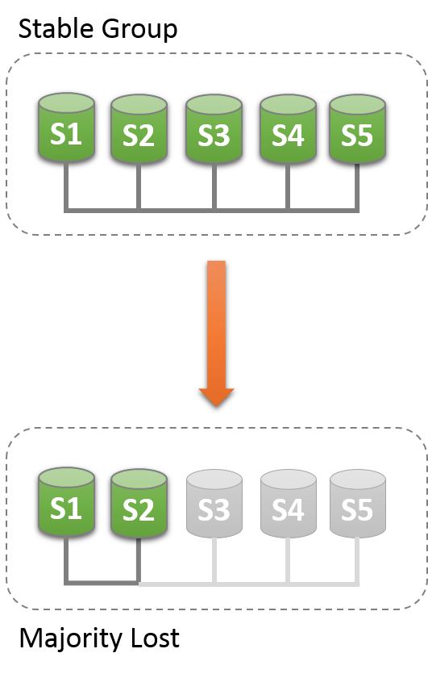
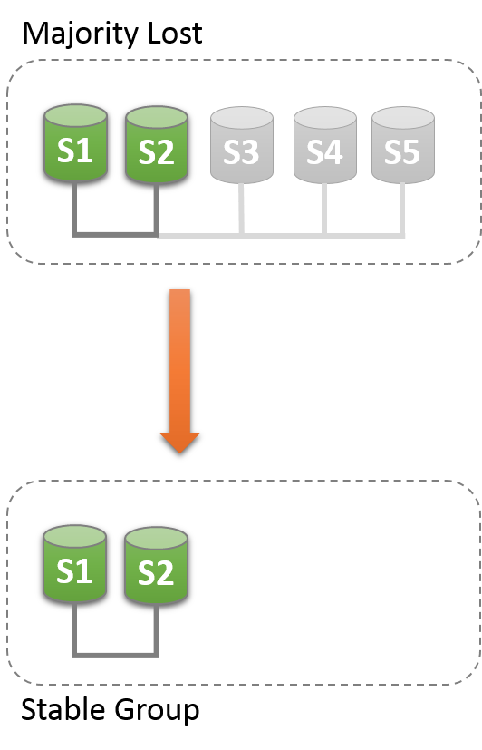

- ## 组复制常规操作-网络分区&混合使用IPV6与IPV4 | 全方位认识 MySQL 8.0 Group Replication

**网络分区**

#### 对于常规事务而言，每当组内有事务数据需要被复制时，组内的成员需要达成共识（要么都提交，要么都回滚）。对于组成员资格的变更也和保持组数据一致性的内部消息传递一样，也需要组内的成员达成共识。共识要求多数组成员同意一个给定决策。当组中的大多数成员失联时，由于无法确保多数或足够的仲裁人数（需要多数仲裁人数才能够确保执行有效的仲裁决议），组将无法接收新的写请求（发生写阻塞，因为此时组内无法达成共识）。

#### 当组中的多个成员出现意外失联(Unreachable)时，组可能会失去足够的仲裁人数（失联的成员数量超过组总成员的半数）。例如，在一个由5个成员组成的组中，如果其中3个成员同时处于静默状态（无任何响应），则此时就无法实现仲裁。因为剩下的两个成员无法判断其他3个成员是否崩溃了，或者是否发生了网络分区导致这2个成员被单独隔离了，因此不能自动执行重新配置组。

#### 另一方面，如果成员自愿退出组（正常退出），则它会告知组执行重新配置。在实践中，这意味着正在离开组的成员会通知组内的其他成员它正在离开组。这样其他成员就可以正确地重新配置组，以维护成员的一致性，并重新计算大多数成员（仲裁人数）。例如，在上面的场景中5个成员的组有3个成员离开组，如果3个成员是一个接一个（非同时）且正常离开组的，则每一个成员离开组时都会通知组，这种情况下，组成员资格能够将自己从5调整到2，同时，能够确保足够的仲裁人数。

- #### 注意：为避免失去足够的仲裁人数而带来的副作用。需要为组规划好合适的组成员数量，以便确定能容忍的合适的故障成员数量（不管这些成员是连续故障、还是同时故障、还是零星发生的故障）。

#### 下面将介绍针对发生网络分区，且组中的剩余活跃成员无法实现自动仲裁时，应该如何解决。

- #### 提示：如果组中的主要节点因为缺失多数仲裁成员而被踢出组之后，再重新加入组时，它可能包含了一些当前组中不存在的额外事务（例如：被踢出组时还未来得及同步到组中的事务）。如果发生这种情况，则在尝试将其重新加入组时，会发生报错：This member has more executed transactions than those present in the group.

#### 检测分区

- #### performance_schema.replication_group_members表中记录了每一个成员从它的视角来看当前组视图的状态。大多数情况下，系统不会遇到分区，因此该表在组中所有成员中显示的状态信息都是一致的。换句话说，当前组视图中的所有成员认同该表上每个成员的状态。但是，如果存在网络分区，并且失去仲裁能力时，那么该表将显示组无法联系的那些成员的状态为  UNREACHABLE。此信息由内置于组复制中的本地故障检测器提供。下图表示组中从5个活跃成员变成2个活跃成员，少于仲裁所需的超过半数成员时（少于3个成员），对于2个成员的分区来说，它就失去了仲裁能力。



上图中，"Stable Group" 部分表示一个具有5个成员的稳定组（基于S1、S2、S3、S4、S5这5个数据库Server部署了一个相互连接的组）。假设这5个成员的成员标识符信息如下。

```
# 这里说的成员标识符为每个组成员自身数据库Server的UUID
S1：199b2df7-4aaf-11e6-bb16-28b2bd168d07
S2：199bb88e-4aaf-11e6-babe-28b2bd168d07
S3：1999b9fb-4aaf-11e6-bb54-28b2bd168d07
S4：19ab72fc-4aaf-11e6-bb51-28b2bd168d07
S5：19b33846-4aaf-11e6-ba81-28b2bd168d07
```

为了理解这种类型的网络分区，下文中将描述一个场景，在这个场景中，最初有5个成员在线（在一起正确地工作），而当只有2个组成员在线时（S1和S2在线，S3、S4、S5三个成员失联），组将发生变化。该场景如上图的Majority Lost部分所示。

一开始，这个组运行状态良好，成员之间通讯正常。通过performance_schema.replication_group_members表可以查看到各个组成员的状态，如下：

```
# 任意登录到一个在线的成员执行查询即可，假设这里从S1成员上查看
mysql> SELECT MEMBER_ID,MEMBER_STATE, MEMBER_ROLE FROM performance_schema.replication_group_members;
+--------------------------------------+--------------+-------------+
| MEMBER_ID | MEMBER_STATE |-MEMBER_ROLE |
+--------------------------------------+--------------+-------------+
| 1999b9fb-4aaf-11e6-bb54-28b2bd168d07 | ONLINE | SECONDARY |
| 199b2df7-4aaf-11e6-bb16-28b2bd168d07 | ONLINE | PRIMARY |
| 199bb88e-4aaf-11e6-babe-28b2bd168d07 | ONLINE | SECONDARY |
| 19ab72fc-4aaf-11e6-bb51-28b2bd168d07 | ONLINE | SECONDARY |
| 19b33846-4aaf-11e6-ba81-28b2bd168d07 | ONLINE | SECONDARY |
+--------------------------------------+--------------+-------------+
```

当成员S3、S4、S5意外失联几秒种后，再次查看S1上的performance_schema.replication_group_members表，会发现S1和S2仍然处于ONLINE状态，但是成员S3、S4、S5处于UNREACHABLE状态（如下所示）。此时，组由于与大多数成员失联，导致系统无法重新配置自己来调整新的组成员资格。

```
mysql> SELECT MEMBER_ID,MEMBER_STATE FROM performance_schema.replication_group_members;
+--------------------------------------+--------------+
| MEMBER_ID | MEMBER_STATE |
+--------------------------------------+--------------+
| 1999b9fb-4aaf-11e6-bb54-28b2bd168d07 | UNREACHABLE |
| 199b2df7-4aaf-11e6-bb16-28b2bd168d07 | ONLINE |
| 199bb88e-4aaf-11e6-babe-28b2bd168d07 | ONLINE |
| 19ab72fc-4aaf-11e6-bb51-28b2bd168d07 | UNREACHABLE |
| 19b33846-4aaf-11e6-ba81-28b2bd168d07 | UNREACHABLE |
+--------------------------------------+--------------+
```

从performance_schema.replication_group_members表中的信息可以看出，此时组在没有外部干预的情况下无法继续对外提供服务，因为此时大多数成员不可访问，组变为只读，需要重置组成员资格列表对系统进行恢复。在重置组成员资格之前，建议先收集S3、S4、S5中的相关的日志，以便后续排查。然后，停止S1和S2上的组复制，然后，针对S1和S2两个组成员重新启动组复制，等待 S3、S4、S5 恢复正常之后，可以陆续将其加入到组中。

疏通分区

- 组复制能够通过强制执行指定的配置来重置组成员资格列表。例如，在上面的例子中，S1和S2是惟一在线的成员，您可以选择强制使用仅由S1和S2组成的成员资格配置。这需要检查关于S1和S2的一些信息，然后使用系统变量group_replication_force_members进行设置。下图是强制调整组成员资格的示意图。



警告：使用系统变量group_replication_force_members调整组成员资格是最后的补救方法。使用需要非常谨慎，通常仅用于仲裁人数不足时需要快速恢复组到能够正常对外提供读写服务的状态。如果使用不当，它可能会造成一个人为的脑裂场景，或者造成整个系统被完全阻塞。

要重置组成员资格配置，首先，登录到S1和S2的数据库中，查看他们的系统变量group_replication_local_address设置的地址（这被称为组通讯标识符），如下：

```
mysql> SELECT @@group_replication_local_address;
```

假设通过上述语句，查看到S1的组通信地址为127.0.0.1:10000，S2的组通信地址为127.0.0.1:10001，然后，就可以通过系统变量group_replication_local_address，在S1和S2中任意一个成员上执行如下语句，以注入一个新的组成员资格配置，从而覆盖已经失去的仲裁能力的现有组成员资格配置。

```
# 这里假设登录到S1中执行
mysql> SET GLOBAL group_replication_force_members="127.0.0.1:10000,127.0.0.1:10001";
```

执行上述语句之后，通过强制不同的组成员资格配置来解除组的阻塞状态。此时，再次登录S1、S2中，查看performance_schema.replication_group_members表。

```
# 在S1中查看，发现只剩下S1和S2两个成员，且都处于ONLINE状态
mysql> SELECT MEMBER_ID,MEMBER_STATE FROM performance_schema.replication_group_members;
+--------------------------------------+--------------+
| MEMBER_ID | MEMBER_STATE |
+--------------------------------------+--------------+
| b5ffe505-4ab6-11e6-b04b-28b2bd168d07 | ONLINE |
| b60907e7-4ab6-11e6-afb7-28b2bd168d07 | ONLINE |
+--------------------------------------+--------------+
# 在S2中查看，发现只剩下S1和S2两个成员，且都处于ONLINE状态
mysql> SELECT * FROM performance_schema.replication_group_members;
+--------------------------------------+--------------+
| MEMBER_ID | MEMBER_STATE |
+--------------------------------------+--------------+
| b5ffe505-4ab6-11e6-b04b-28b2bd168d07 | ONLINE |
| b60907e7-4ab6-11e6-afb7-28b2bd168d07 | ONLINE |
+--------------------------------------+--------------+
```

在强制执行新的组成员资格配置时，需要确保被强制驱逐的所有组成员是否都被驱逐成功，然后将其停止。因为，在上面描述的场景中，如果S3、S4、S5并不是真的不可访问，而是处于ONLINE状态，则，在针对S1和S2执行强制重新配置组成员资格配置时，剩余的S3、S4、S5成员由于它们3个占原组5成员资格数量的多数，它们3个会通过仲裁能力形成新的组成员资格配置。在这种情况下，强制使用S1和S2的组成员资格列表配置新组，可能会造成人为的裂脑情况。因此，在强制执行新组成员资格配置之前，务必确保将被驱逐的成员发生故障问题的真实性，并将其关闭（关闭数据库进程）。

在使用系统变量group_replication_force_members成功强制创建新的组成员资格并解除组阻塞之后，需要将该变量的值清空，否则无法执行START GROUP_REPLICATION语句（系统变量group_replication_force_members必须为空时，START  GROUP_REPLICATION语句才能执行）。

**配置支持IPv6和混合IPv6与IPv4地址的组**

从MySQL 8.0.14开始，组成员可以使用IPv6地址替代VPv4地址进行组内通信。要正确使用IPv6地址，需要在各个组成员的主机操作系统和MySQL Server上都配置为支持IPv6。有关为设置IPv6支持的详细说明，请参考链接：

https://dev.mysql.com/doc/refman/8.0/en/ipv6-support.html

#### 

#### 要为组复制配置使用IPv6地址，需要使用系统变量group_replication_local_address指定IPV6地址，以便使用IPV6地址来与其他成员进行通讯。不过，要注意，在配置该系统变量时，IPV6的地址串需要使用方括号，以便与组成员之间通讯使用的端口号隔离，例如：

```
group_replication_local_address= "[2001:db8:85a3:8d3:1319:8a2e:370:7348]:33061"
```

#### 组复制使用系统变量group_replication_local_address中指定的网络地址或主机名作为复制组中组成员的惟一标识符（是每一个组成员用于与组中其他成员之间通讯的地址）。如果为组复制指定的组通讯地址是主机名，且主机名同时可以解析为IPv4和IPv6地址，则IPv4地址将始终用于组复制连接。系统变量group_replication_local_address指定的地址和端口不同于MySQL Server的SQL协议的地址和端口，并且不在系统变量bind_address中指定。

#### 系统变量group_replication_ip_whitelist指定的白名单网络地址，必须要包含每一个组成员的系统变量group_replication_local_address中指定的网络地址，否则白名单不允许的成员地址将被拒绝加入组。白名单中的网络地址串可同时指定IPv4和IPv6地址，以及主机名，例如：group_replication_ip_whitelist="192.0.2.21/24,198.51.100.44,203.0.113.0/24,2001:db8:85a3:8d3:1319:8a2e:370:7348,example.org,www.example.com/24"

#### 复制组中允许混合使用IPv6本地地址的成员和IPv4本地地址的成员。当某个数据库Server申请加入这样一个混合地址的组时：

- #### 对于系统变量group_replication_group_seeds的设置，joiner节点（申请加入组的Server）需要指定在种子成员的系统变量group_replication_group_seeds中公布的协议地址（例如：种子成员在系统变量group_replication_group_seeds中指定了IPV4地址，joiner节点的系统变量group_replication_group_seeds也需要指定IPV4，同理，种子成员使用IPV6，joiner节点也需要使用IPV6，当然，由于该系统变量可以同时指定多个地址，如果种子成员的系统变量group_replication_group_seeds同时指定了IPV4和IPV6协议地址。一个种子成员使用IPV4，另一个使用IPV6，那么joiner节点两种协议地址都可以使用）和种子成员进行连接初始化。

- #### 对于系统变量group_replication_local_address，由于只能指定一个地址作为成员的本地地址，所以，它可以指定IPV4、IPV6、主机名地址（需要能够正常解析为IPV4或者IPV6的网络地址）中的任意一个，但是，在种子成员的系统变量group_replication_ip_whitelist中必须要包含该协议地址（即，joiner节点的本地地址，必须要在种子成员中配置好白名单），否则，joiner节点将会被拒绝加入组。

- #### 对于系统变量group_replication_ip_whitelist，建议在组中的所有成员及其待加入组的Server中，将所有可能的备用协议地址、主机名地址及其对应的网段都配置上去，以避免为后续组内成员的维护造成麻烦

例如，Server A是一个组的种子成员，假设它的组复制配置设置如下：

```
# Server A启用系统变量group_replication_bootstrap_group，表示用它来引导组
group_replication_bootstrap_group=on
group_replication_local_address= "[2001:db8:85a3:8d3:1319:8a2e:370:7348]:33061"
# 它在系统变量group_replication_group_seeds中公布了IPv6地址
group_replication_group_seeds= "[2001:db8:85a3:8d3:1319:8a2e:370:7348]:33061"
```

Server B是joiner节点，假设它的组复制配置设置如下：

```
# Server B关闭系统变量group_replication_bootstrap_group，表示它不需要引导组，只需要向系统变量 
group_replication_group_seeds指定的种子成员请求加入组即可
group_replication_bootstrap_group=off
# 它有一个IPv4组复制本地地址
group_replication_local_address= "203.0.113.21:33061"
group_replication_group_seeds= "[2001:db8:85a3:8d3:1319:8a2e:370:7348]:33061"
```

假设Server B有一个备选的IPv6地址2001:db8:8b0:40:3d9c:cc43:e006:19e8。为确保Server B成功加入这个组，它的IPv4本地地址和备用的IPv6本地地址都必须在Server A的白名单中列出，如下所示：

```
# 作为组复制 IP白名单的最佳实践，Server B（和所有其他组成员）应该与Server A具有相同的白名单配置，除非有特殊的安全需求，否则建议保持一致
group_replication_ip_whitelist="203.0.113.0/24,2001:db8:85a3:8d3:1319:8a2e:370:7348, 2001:db8:8b0:40:3d9c:cc43:e006:19e8"
```

如果组中存在任何一个成员或所有的现有成员使用的是不支持IPV6地址的老MySQL Server版本，则joiner节点不能使用IPV6地址作为本地地址加入组，这适用于如下两种情况。

- 组中至少一个现有成员使用了IPv6地址，但是一个不支持IPV6地址的Server正在申请加入组。
- 组中至少有一个现有成员不支持IPV6地址，但是joiner节点使用了IPV6地址。

PS：

- 如果要使用IPV6地址，请先将不支持IPV6地址的Server版本升级到支持IPV6的Server版本，然后，将所有组成员的系统变量group_replication_local_address的值设置为IPV6地址，或者配置您的DNS以解析IPv6地址。注意：修改系统变量group_replication_local_address的值需要重启组复制才会生效。
- 通常情况下，建议组中使用同一种通讯协议地址，例如，都使用IPV4或者都使用IPV6，不要混合使用，除非必须（例如：在滚动升级期间的一种折中）。


**| 作者简介**

### **罗小波·数据库技术专家**

《千金良方——MySQL性能优化金字塔法则》作者之一。熟悉MySQL体系结构，擅长数据库的整体调优，喜好专研开源技术，并热衷于开源技术的推广，在线上线下做过多次公开的数据库专题分享，发表过近100篇数据库相关的研究文章。