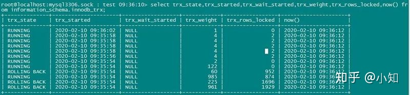
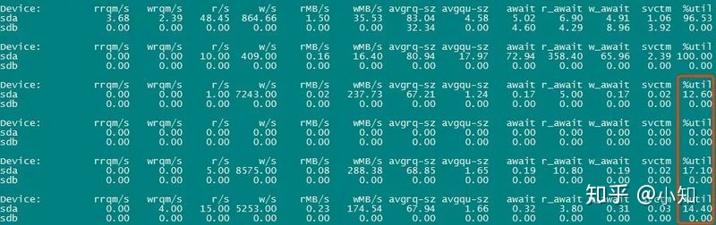

已剪辑自: https://zhuanlan.zhihu.com/p/108304756

作者：叶金荣，知数堂联合创始人，3306pai社区联合创始人

## 前言

是什么原因导致线上数据库服务器磁盘I/O的util和iowait持续飚高？

## 1. 问题描述

朋友小明的线上数据库突发严重告警，业务方反馈写入数据一直堵住，很多锁超时回滚了，不知道怎么回事，就找到我了。

不管3721，先采集现场的必要信息再说。

**a. 系统负载，主要是磁盘I/O的负载数据** 

 

 

该服务器的磁盘是由6块2T SSD硬盘组成的RAID-5阵列。从上面的截图来看，I/O %util已经基本跑满了，iowait也非常高，很明显磁盘I/O压力太大了。那就再查查什么原因导致的这么高压力。

**b. 活跃事务列表**

 

 

可以看到，有几个活跃的事务代价很高，锁定了很多行。其中有两个因为太久超时被回滚了。

 

 

再看一次活跃事务列表，发现有个事务锁定的行更多了，说明活跃业务SQL的效率不太好，需要进行优化。这个算是原因之一，先记下。

**c.** **查看****InnoDB****状态****
** **执行** SHOW ENGINE INNODB STATUS\G 查看InnoDB状态，这里只展示了几个比较关键的地方：

...
 0x7f8f700e9700 INNODB MONITOR OUTPUT
 ...
 LATEST DETECTED DEADLOCK
 \------------------------
 ...
 *** (2) TRANSACTION:
 TRANSACTION 52970892097, ACTIVE 1 sec starting index read
 mysql tables in use 2, locked 2
 80249 lock struct(s), heap size 9691344, 351414 row lock(s),
 undo log entries 30005
 \### 这里很明显，发生死锁的事务之一持有很多行锁，需要优化SQL
 ...
 update a inner join b on a.uid=b.uid set a.kid=if(b.okid=0,b.kid,b.okid),a.aid=b.aid where a.date='2020-02-10'
 ...
 TRANSACTIONS
 \------------
 Trx id counter 52971738624
 Purge done for trx's n:o < 52971738461 undo n:o < 0
 state: running but idle
 History list length 81
 ...
 ---TRANSACTION 52971738602, ACTIVE 0 sec inserting
 mysql tables in use 1, locked 1
 1 lock struct(s), heap size 1136, 0 row lock(s), 
 undo log entries 348
 \### 同样滴，也是有很多行锁
 ...
 LOG
 \---
 Log sequence number 565123876918590
 Log flushed up to  565123858946703
 Pages flushed up to 565121518602442
 Last checkpoint at 565121518602442
 ...
 \### 注意到Last checkpoint和LSN之间的差距非常大，约为2249MB
 \### 说明redo log的checkpoint有延迟比较厉害，有可能是因为磁盘I/O太慢，
 \### 也有可能是因为产生的脏页太多太快，来不及刷新
 \----------------------
 BUFFER POOL AND MEMORY
 \----------------------
 Total large memory allocated 201200762880
 Dictionary memory allocated 130361859
 Internal hash tables (constant factor + variable factor)    Adaptive hash index 3930999872   (3059599552 + 871400320)  
   Page hash      23903912 (buffer pool 0 only)  
   Dictionary cache  895261747    (764899888 + 130361859)  
   File system     16261960    (812272 + 15449688)  
   Lock system     478143288    (478120568 + 22720)  
   Recovery system   0    (0 + 0)
 Buffer pool size  11795040
 Buffer pool size, bytes 193249935360
 Free buffers    7035886
 Database pages   4705977O
 ld database pages 1737005
 Modified db pages 238613
 \### 脏页比例约为2%，看着还好嘛，而且还有挺多free page的
 ...

**d. 查看MySQL的线程状态***

+---------+------+--------------+---------------------
 | Command | Time | State    | Info                                                 |
 +---------+------+--------------+---------------------
 | Query  |  1 | update    | insert xxx
 | Query  |  0 | updating   | update xxx
 | Query  |  0 | updating   | update xxx
 | Query  |  0 | updating   | update xxx
 | Query  |  0 | updating   | update xxx
 +---------+------+--------------+---------------------

可以看到几个事务都处于updating状态。意思是**正在扫描数据并准备更新**，肉眼可见这些事务状态时，一般是因为系统负载比较高，所以事务执行起来慢；或者该事务正等待行锁释放。

## 2. 问题分析及优化工作

分析上面的各种现场信息，我们可以得到以下几点结论：

a. 磁盘I/O压力很大。先把阵列卡的cache策略改成WB，不过由于已经是SSD盘，这个作用并不大，只能申请更换成RAID-10阵列的新机器了，还需等待资源调配。

b. 需要优化活跃SQL，降低加锁代价

[[root@yejr.me](mailto:root@yejr.me)]> desc select * from a inner join b on a.uid=b.uid where a.date='2020-02-10';
 +-------+--------+------+---------+----------+-------+----------+-----------------------+
 | table | type  | key | key_len | ref   | rows | filtered | Extra         |
 +-------+--------+------+---------+----------+-------+----------+-----------------------+
 | a   | ref  | date | 3    | const  | 95890 |  100.00 | NULL         |
 | b   | eq_ref | uid | 4    | db.a.uid |   1 |  100.00 | Using index condition |
 +-------+--------+------+---------+----------+-------+----------+-----------------------+
 [[root@yejr.me](mailto:root@yejr.me)]> select count(*) from a inner join b on a.uid=b.uid where a.date='2020-02-10';
 +----------+
 | count(*) |
 +----------+
 |  40435 |
 +----------+
 1 row in set (0.22 sec)

执行计划看起来虽然能用到索引，但效率还是不高。检查了下，发现a表的uid列竟然没加索引，我汗。。。

c. InnoDB的redo log checkpoint延迟比较大，有2249MB之巨。先检查redo log的设置：

innodb_log_file_size = 2G
 innodb_log_files_in_group = 2

这个问题就大了，redo log明显太小，等待被checkpoint的redo都超过2G了，那肯定要疯狂刷脏页，所以磁盘I/O的写入才那么高，I/O %util和iowait也很高。

建议把redo log size调整成4G、3组。

innodb_log_file_size = 4Ginnodb_log_files_in_group = 2

此外，也顺便检查了InnoDB其他几个重要选项

innodb_thread_concurrency = 0
 \# 建议维持设置0不变
 innodb_max_dirty_pages_pct = 50
 \# 由于这个实例每秒写入量较大，建议先调整到75，降低刷脏页的频率，
 \# 顺便缓解redo log checkpoint的压力。
 \# 在本案例，最后我们把这个值调整到了90。

**特别提醒
 从MySQL 5.6版本起，修改redo log设置后，实例重启时会自动完成redo log的再次初始化，不过前提是要先干净关闭实例**。因此建议在第一次关闭时，修改以下两个选项：

innodb_max_dirty_pages_pct = 0
 innodb_fast_shutdown = 0

并且，再加上一个新选项，防止实例启动后，会有外部应用连接进来继续写数据：

skip-networking

在确保所有脏页（上面看到的**Modified db pages**为0）都刷盘完毕后，并且redo log也都checkpoint完毕（上面看到的**Log sequence number和**Last checkpoint at**值相等），此时才能放心的修改 **innodb_log_file_size** 选项配置并重启。确认生效后再关闭 **skip-networking** 选项对业务提供服务。

经过一番优化调整后，再来看下服务器和数据库的负载。 

 

 

可以看到，服务器的磁盘I/O压力再也不会那么大了，数据库中也不会频繁出现大量行锁等待或回滚的事务了。

[[root@yejr.me](mailto:root@yejr.me)]> SHOW ENGINE INNODB STATUS\g
 Log sequence number 565749866400449
 Log flushed up to  565749866400449
 Pages flushed up to 565749866318224
 Last checkpoint at 565749866315740
 [[root@yejr.me](mailto:root@yejr.me)]> SHOW ENGINE INNODB STATUS\g
 Log sequence number 565749866414660
 Log flushed up to  565749866400449
 Pages flushed up to 565749866320827
 Last checkpoint at 565749866315740
 [[root@yejr.me](mailto:root@yejr.me)]> SHOW ENGINE INNODB STATUS\g
 Log sequence number 565749866414660
 Log flushed up to  565749866414660
 Pages flushed up to 565749866322135
 Last checkpoint at 565749866315740
 [[root@yejr.me](mailto:root@yejr.me)]> select (565749866400449-565749866315740)/1024;
 +----------------------------------------+
 | (565749866400449-565749866315740)/1024 |
 +----------------------------------------+
 |                82.7236 |
 +----------------------------------------+
 1 row in set (0.00 sec)
 [[root@yejr.me](mailto:root@yejr.me)]> select (565749866414660-565749866315740)/1024;
 +----------------------------------------+
 | (565749866414660-565749866315740)/1024 |
 +----------------------------------------+
 |                96.6016 |
 +----------------------------------------+

很明显，redo log checkpoint lag几乎没有了。

完美搞定！

## 写在最后

遇到数据库性能瓶颈，负载飚高这类问题，我们只需要根据一套完整的方法论 [**优化系列：实例解析****MySQL****性能瓶颈排查定位**](https://link.zhihu.com/?target=https%3A//mp.weixin.qq.com/s%3F__biz%3DMjM5NzAzMTY4NQ%3D%3D%26mid%3D404363049%26idx%3D1%26sn%3Ddaa7355c46d0bc98bb5f0f8589ac20fe%26scene%3D21%23wechat_redirect)**，根据现场的各种蛛丝马迹，逐一进行分析，基本上都是能找出来问题的原因的。本案其实并不难，就是按照这套方法来做的，最后连****perf top****都没用上就很快能大致确定问题原因了。**