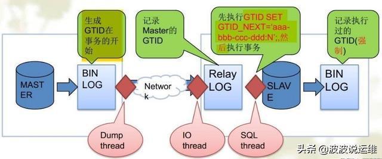
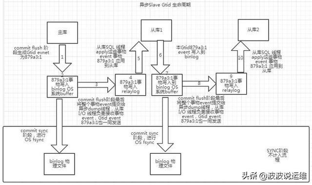

###  超详细的mysql数据库GTID介绍—概念、优缺点、原理、生命周期等 

​                        [  ](javascript:;)                         2020-06-09 09:18  | [程序员](http://www.chinaoc.com.cn/list/cls/13887.html)|浏览(22)                    


# 概述

这几天就简单介绍一下GTID好了~这篇是概念篇..

从MySQL 5.6.5 开始新增了一种基于 GTID 的复制方式。通过 GTID 保证了每个在主库上提交的事务在集群中有一个唯一的ID。这种方式强化了数据库的主备一致性，故障恢复以及容错能力。

​    

> 官网：https://dev.mysql.com/doc/refman/5.7/en/replication-gtids-lifecycle.html

# 一、初识概念

GTID (Global Transaction ID)是全局事务ID,由主库上生成的与事务绑定的唯一标识，这个标识不仅在主库上是唯一的，在MySQL集群内也是唯一的。

**GTID = server_uuid:transaction_id**

示例：3E11FA47-71CA-11E1-9E33-C80AA9429562:1

GTID实际上是由UUID+TID组成的。其中UUID是一个MySQL实例的唯一标识。TID代表了该实例上已经提交的事务数量，并且随着事务提交单调递增。server_uuid 一般是发起事务的uuid, 标识了该事务执行的源节点，存储在数据目录中的auto.cnf文件中，transaction_id  是在该主库上生成的事务序列号，从1开始，1-2代表第二个事务；第1-n代表n个事务。
 

​    

示例中 3E11FA47-71CA-11E1-9E33-C80AA9429562  是这个节点的server_uuid，1为这个节点上提交的第1个事务的事务号，如果提交了10个事务，GTID会是这样：  3E11FA47-71CA-11E1-9E33-C80AA9429562:1-10 


当在主库上提交事务或者被从库应用时，可以定位和追踪每一个事务，对DBA来说意义就很大了，我们可以适当的解放出来，不用手工去可以找偏移量的值了，而是通过CHANGE MASTER TO MASTER_HOST='xxx',  MASTER_AUTO_POSITION=1的即可方便的搭建从库，在故障修复中也可以采用MASTER_AUTO_POSITION=‘X’的方式。

# 二、为什么要有GTID?

在主从复制中，尤其是半同步复制中， 由于Master  的dump进程一边要发送binlog给Slave，一边要等待Slave的ACK消息，这个过程是串行的，即前一个事物的ACK没有收到消息，那么后一个事物只能排队候着； 这样将会极大地影响性能；有了GTID后，SLAVE就直接可以通过数据流获得GTID信息，而且可以同步；

​    

另外，主从故障切换中，如果一台MASTER  down，需要提取拥有最新日志的SLAVE做MASTER，这个是很好判断，而有了GTID，就只要以GTID为准即可方便判断；而有了GTID后，SLAVE就不需要一直保存这bin-log 的文件名和Position了；只要启用MASTER_AUTO_POSITION即可。

当MASTER crash的时候，GTID有助于保证数据一致性，因为每个事物都对应唯一GTID，如果在恢复的时候某事物被重复提交，SLAVE会直接忽略；

从架构设计的角度，GTID是一种很好的分布式ID实践方式，通常来说，分布式ID有两个基本要求：

1）全局唯一性

2）趋势递增

这个ID因为是全局唯一，所以在分布式环境中很容易识别，因为趋势递增，所以ID是具有相应的趋势规律，在必要的时候方便进行顺序提取，行业内适用较多的是基于Twitter的ID生成算法snowflake,所以换一个角度来理解GTID，其实是一种优雅的分布式设计。

​    


# 三、GTID有什么优缺点

一般在主从复制的场景下，如果只有单台就没必要使用GTID了。

...  

**1、优点**

GTID相对于行复制数据安全性更高，故障切换更简单。

1) 根据 GTID 可以快速的确定事务最初是在哪个实例上提交的。

2) 简单的实现 failover，不用以前那样在需要找 log_file 和 log_pos。

3) 更简单的搭建主从复制，确保每个事务只会被执行一次。

4) 比传统的复制更加安全，一个 GTID 在一个服务器上只执行一次，避免重复执行导致数据混乱或者主从不一致。

5）GTID是连续的没有空洞的，保证数据的一致性，零丢失

6）GTID 用来代替classic的复制方法，不再使用 binlog+pos 打开复制。而是使用 master_auto_postion=1 的方式自动匹配 GTID 断点进行复制。

​    

7) GTID 的引入，让每一个事务在集群事务的海洋中有了秩序，使得 DBA 在运维中做集群变迁时更加方便


**2、缺点**

1）主从库的表存储引擎必须是一致的

主从库的表存储引擎不一致，就会导致数据不一致。如果主从库的存储引擎不一致，例如一个是事务存储引擎，一个是非事务存储引擎，则会导致事务和 GTID 之间一对一的关系被破坏，结果就会导致基于 GTID 的复制不能正确运行；

master：对一个innodb表做一个多sql更新的事物，效果是产生一个GTID。
 slave：假设对应的表是MYISAM引擎，执行这个GTID的第一个语句后就会报错，因为非事务引擎一个sql就是一个事务。

当从库报错时简单的stop slave; start slave;就能够忽略错误。但是这个时候主从的一致性已经出现问题,需要手工的把slave差的数据补上,这里要将引擎调整为一样的，slave也改为事务引擎。

2）不允许一个SQL同时更新一个事务引擎和非事务引擎的表

​    

事务中混合多个存储引擎，就会产生多个 GTID。当使用 GTID 时，如果在同一个事务中，更新包括了非事务引擎（如 MyISAM）和事务引擎（如 InnoDB）表的操作，就会导致多个 GTID 分配给了同一个事务。

3）在一个复制组中，必须要求统一打开GTID或是关闭GTID;

4）不支持create table….select 语句复制（主库直接报错）;

create table xxx as select的语句，其实会被拆分为两部分，create语句和insert语句，但是如果想一次搞定，MySQL会抛出如下的错误。

```
 ERROR 1786 (HY000): Statement violates GTID consistency: CREATE TABLE ... SELECT.
```

create table xxx as select 的方式可以拆分成两部分，如下。

```
create table xxxx like data_mgr; insert into xxxx select *from data_mgr;
```

​    


5）对于create temporary table 和 drop temporary table语句不支持;

使用GTID复制模式时，不支持create temporary table 和 drop temporary  table。但是在autocommit=1的情况下可以创建临时表，Master端创建临时表不产生GTID信息，所以不会同步到slave，但是在删除临时表的时候会产生GTID会导致，主从中断.

6）不支持sal_slave_skip_counter.

mysql在主从复制时如果要跳过报错，可以采取以下方式跳过SQL（event）组成的事务，但GTID不支持以下方式。

```
set global SQL_SLAVE_SKIP_COUNTER=1; start slave sql_thread;
```


# 四、GTID 主从复制原理

...  

1) 当一个事务在主库端执行并提交时，产生 GTID，一同记录到 binlog 日志中。

2) binlog 传输到 slave,并存储到 slave 的 relaylog 后，读取这个 GTID 的这个值设置 gtid_next 变量，即告诉 Slave，下一个要执行的 GTID 值。
 3) sql 线程从 relay log 中获取 GTID，然后对比 slave 端的 binlog 是否有该 GTID。
 4) 如果有记录，说明该 GTID 的事务已经执行，slave 会忽略。
 5) 如果没有记录，slave 就会执行该 GTID 事务，并记录该 GTID 到自身的 binlog;
 6) 在解析过程中会判断是否有主键，如果没有就用二级索引，如果没有就用全部扫描。

# 五、GTID生命周期

...  

1、当事务于主库执行时，系统会为事务分配一个由server uuid加序列号组成的GTID（当然读事务或者被主动过滤掉的事务不会被分配GTID），写binlog日志时此GTID标志着一个事务的开始。

2、binlog中写GTID的event被称作Gtid_log_event，当binlog切换或者mysql服务关闭时，之前binlog中的所有gtid都会被加入mysql.gtid_executed表中。此表内容如下（slave中此表记录数会有多条，取决于主从个数）：

```
 mysql> select * from mysql.gtid_executed;
```

  3、当GTID被分配且事务被提交后，他会被迅速的以一种外部的、非原子性的方式加入@@GLOBAL.gtid_executed参数中，这个参数包含了所有被提交的GTID事务（其实它是一个GTID范围值，例如71cf4b9d-8343-11e8-97f1-a0d3c1f25190:1-10），@@GLOBAL.gtid_executed也被用于主从复制，表示数据库当前已经执行到了哪个事务。相比之下mysql.gtid_executed不能用于标识主库当前事务进度，因为有部分gtid还在binlog中，需要等到binlog轮转或者MySQL Server关闭时才会写入到mysql.gtid_executed表中。

4、 在主从首次同步时（master_auto_position=1），slave会通过gtid协议将自己已经执行的gtid  set（@@global.gtid_executed）发给master，master比较后从首个未被执行的GTID事务开始主从同步。

5、 主库上的binlog通过主从复制协议传送到从库，并写入到从库的relay log，从库读取relay log中的gtid和对应的事务信息，把gtid_next设置为该gtid值，使得从库使用该gtid值应用其对应的事务。

需要注意的是这里的gtid_next是在复制进程的session context中自动设置的（由binlog提供的语句），不同于show  variables like  'gtid_next';这里看到的结果默认为AUTOMATIC，是当前会话本身的gtid_next，这是个session级别的参数。

6、当打开并行复制时，slave会读取并检查事务的GTID确保当前GTID事务未被在slave执行过，且没有并行进程在读取并执行此事务，如果有并行复制进程正在应用此事务那么slave server只会允许一个进程继续执行，@@GLOBAL.gtid_owned参数展示了当前哪个并行复制进程在执行什么事务。

7、同样的，在slave上如果打开了binlog，GTID也会以Gtid_log_event事件写入binlog，同时binlog切换或者mysql服务关闭时，当前binlog中的所有gtid都会被加入mysql.gtid_executed表中。

  8、在备库上如果未打开binlog，那么GTID会被直接持久化到mysql.gtid_executed表中，在这种情况下slave的mysql.gtid_executed表包含了所有已经被执行的事务。需要注意的是在mysql5.7中，向mysql.gtid_executed表插入GTID的操作与DML操作是原子性的，对于DDL操作则不是，因此如果slave在执行DDL操作的过程中异常中断那么GTID机制可能会失效。在mysql8.0中这个问题已经得到解决，DDL操作的GTID插入也是原子性的。

  9、同第3条中所说的一样，slave上的事务被执行后GTID也会被迅速的以一种外部的、非原子性的方式加入@@GLOBAL.gtid_executed参数中，在slave的binlog未打开时mysql.gtid_executed中记载的已提交事务事实上与@@GLOBAL.gtid_executed记载的是一致的，如果slave的binlog已打开那么mysql.gtid_executed的GTID事务集就没有@@GLOBAL.gtid_executed全了。

10、如果多个线程并发地应用同一个事务，比如多个线程设置gtid_next为同一个值，MySQL Server只允许其中一个线程执行，gtid_owned系统变量记录着谁拥有该GTID。

觉得有用的朋友多帮忙转发哦！后面会分享更多devops和DBA方面的内容，感兴趣的朋友可以关注下~