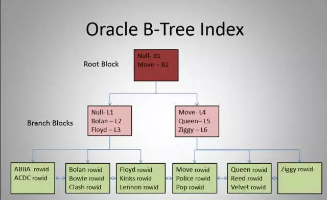
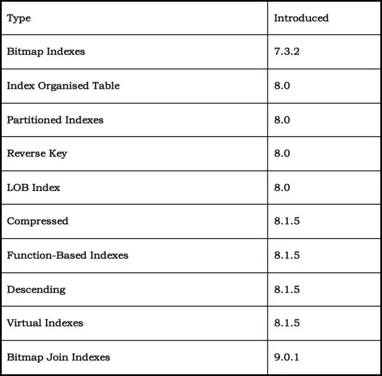
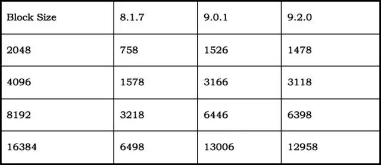
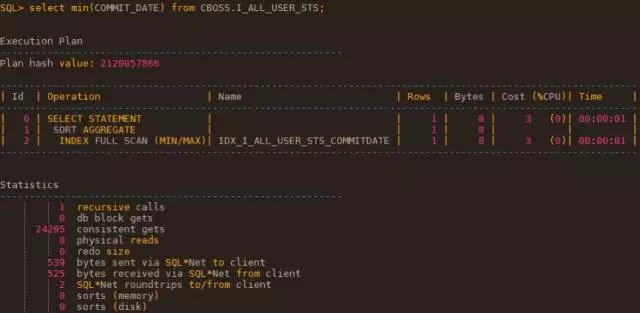
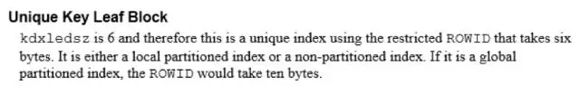

> *大家好，我是云和恩墨的技术专家李翔宇，今天要为大家分享的主题是《轻轻揭开b\*tree索引结构的神秘面纱》。*

说到索引，大家应该都或多或少的了解甚至熟悉它，它是在各种数据库中都会被提及的一种对象，主要用于加速查询的速度（当然，对于 update 或者 delete  时的查找数据也同样有效），所以我们一提到性能优化，往往就会想到索引。不过索引如何帮助查询提高性能的，可能很多人就不是很清楚了。

我今天要分享的，其实并不是索引是如何提升查询效率的，但今天所讲的内容，却对深入研究索引与性能的关系至关重要，只有清楚了索引的结构与原理，才能真正理解索引，进而用好它。

当然，对 Oracle 索引了解的人都知道，索引有很多种，时间有限，所以我在这里将以最为常见的 B*tree 索引为例，来简单介绍 b*tree 索引的一些特点、使用限制和结构构成。

首先大家还是先来熟悉一下典型 B*tree 索引的结构图：

很明显，从图中我们可以看到：

\1. 整个索引结构由root,branch,leafblock构成。

\2. 从root block到每一个leaf block的高度都是一样的。

\3. 索引条目总是是唯一的且在逻辑上是有序的。

\4. 索引的扫描除了iffs(索引快速全扫描)总是单块读的形式。

 

在这里也简单提一句索引类型，虽然我们本次只介绍 B*tree 索引，但也可以简单了解一下索引类型以及相对应的数据库版本演进：

B*tree 索引在使用时也是有一些限制的：

\1. B*tree 的 level 最多为24。

\2. 从 8i 以后 B*tree 索引的字段最多为32。

\3. B*tree 索引的键值（关键字）在不同版本的长度限制（字节）

在了解了 B*tree 的一些特点与限制之后，我们来开始我们真正的内容，通过解剖 B*tree 的具体结构来揭开索引的面纱。

回想刚才的结构图，可以看到整个 B*tree 索引由 root block，branch block，leaf block 组成，那么我们来看看这几种块的描述：

**root block**

\1. Every index has one root block

\2. May be a leaf block or a branch block

\3. Can be an empty leaf block

\4. Always the next block after the segment header in thefirst extent

总结翻译一下就是所有索引都有且只有1个 root block，它可以是分支块也可以是叶子块，甚至可以是个空的叶子快 (比如一个新建的空表上的索引)，并且总是位于第一个 extent 的段头块后的第一个块，即 (HEADER_BLOCK+1)。

下面是一个新建的表的索引树 dump.

----- begin tree dump leaf: 0x408921 4229409 (0: nrow: 0 rrow: 0) -- 这就是一个空的叶子块，也是该索引的 root block ----- end tree dump

**branch block**

\1. Indexes may contain branch blocks

\2. Branch blocks point to other branch blocks or leafblocks

\3. Branch blocks contain 0 or more rows

\4. Each row has a suffix compressed key and a pointer tothe next block

\5. Compressed rows are terminated with 0xFE byte

\6. Each block has a pointer to the left hand side of thetree. This is part of the header

\7. A branch block containing N rows points to N+1 blocks.

 

总结翻译一下就是分支块包含的每一行都有指向叶子块/分支块地址的指针，加上 lmc（后面介绍） 指向的块就是如果分支块包含N行则会指向 N+1个快 (N>=0)，分支块每一行里存储的索引键值可能是完整键值也可能是前缀 （后面介绍）。

 

**leaf block**

\1. Every index has a least one leaf block

\2. Each leaf block contains 0 or more rows

\3. Each row contains a key and data

\4. Indexes can be unique or non-unique

\5. Leaf row formats differ for unique and non-uniqueindexes

 

总结翻译一下就是所有索引必须至少有1个叶子块，且每一行包含索引键值和 DATA（如果是唯一索引就是 rowid，非唯一索引为null），所以说唯一索引和非唯一索引的叶子块在结构上是不同的。

 

上面都是些描述，空口白牙的一点都不直观，那么下面我们通过 dump 块结构的方法，具体来看看这些 block 到底有什么联系和不同。

测试步骤：

SQL> drop table lxy purge; Table dropped. SQL> create table lxy (a char(2000)); Table created. SQL> create index idx_lxy_a on lxy(a); Index created. SQL> insert into lxy select rownum from dual  connect by rownum<=1000; 1000 rows created. SQL> / 1000 rows created. SQL> commit; Commit complete. SQL> select object_id from dba_objects where  object_name='IDX_LXY_A'; OBJECT_ID ----------   14328 --dump index tree SQL> alter session set events 'immediate trace  name treedump level 14328';  Session altered.

 

在做完上面的 event 之后，我们可以从产生出的用户进程跟踪文件中看到 dump 出的索引树信息：

> ----- begin tree dump branch: 0x4087b9 4229049 (0: nrow: 3,  level: 2)      --root block  branch: 0x408d67 4230503 (-1: nrow: 379, level: 1)   --branch block    leaf:  0x4087ba 4229050 (-1: nrow: 2 rrow: 2)      --leaf block    leaf:  0x408af3 4229875 (0: nrow: 2 rrow: 2)    leaf:  0x408aea 4229866 (1: nrow: 2 rrow: 2)    leaf:  0x408eec 4230892 (2: nrow: 2 rrow: 2)    ...    leaf:  0x4089a0 4229536 (376: nrow: 2 rrow: 2)    leaf:  0x408d13 4230419 (377: nrow: 2 rrow: 2)   branch: 0x408d68 4230504 (0: nrow: 620, level: 1)    --branch block    leaf:  0x408999 4229529 (-1: nrow: 2 rrow: 2)    leaf:  0x408d14 4230420 (0: nrow: 2 rrow: 2)    leaf:  0x408b92 4230034 (1: nrow: 2 rrow: 2)    ...    leaf:  0x408ee8 4230888 (617: nrow: 2 rrow: 2)    leaf:  0x408ae9 4229865 (618: nrow: 3 rrow: 3)  branch: 0x408eeb 4230891 (1: nrow: 1, level: 1)     --branch block    leaf:  0x408eea 4230890 (-1: nrow: 1 rrow: 1) ----- end tree dump

 

通过该 dump 我们可以得到下列信息：

**root block：**

\1. dba=4229049 表示 root block 的数据块地址，该块为段头块后的第一个块

> SELECT header_block,    header_file,    DBMS_UTILITY.DATA_BLOCK_ADDRESS_FILE  (4229049) root_fno,    DBMS_UTILITY.DATA_BLOCK_ADDRESS_BLOCK  (4229049) root_bno  FROM dba_segments WHERE segment_name = 'IDX_LXY_A';  HEADER_BLOCK  HEADER_FILE  ROOT_FNO  ROOT_BNO ------------ -----------  ---------- ----------    34744      1     1     34745   --ROOT_BNO=HEADER_BLOCK+1

\2. level=2 表示索引层级号 (leafblock的level为0)

\3. nrow=3 表示该 root block 下有3个 branch block

\4. leaf block 的 nrow 表示 index entries；rrow 表示 non-deleted entris

 

接着是 root block 的详细信息：

> Branch block dump ================= header address 140112751121988=0x7f6e8ac25644 kdxcolev 2 KDXCOLEV Flags = - - - kdxcolok 1 kdxcoopc 0x81: opcode=1: iot flags=--- is  converted=Y kdxconco 2  kdxcosdc 2 kdxconro 2 kdxcofbo 32=0x20 kdxcofeo 6038=0x1796 kdxcoavs 6006 kdxbrlmc 4230503=0x408d67 kdxbrsno 1 kdxbrbksz 8056 kdxbr2urrc 0 row#0[8048] dba: 4230504=0x408d68 col 0; len 2; (2): 34 34     col 1; TERM           row#1[6038] dba: 4230891=0x408eeb col 0; len 2000; (2000): 39 39 39  20...20 col 1; len 3; (3): 00 40 8f

我们重点关注其中标红的地方。

kdxbrlmc: block address if index value is less thanthe first (row#0) value

对于该 root block 的例子意思就是如果索引键值小于 row#0 的 col 0，就指向在 kdxbrlmc 对应的 branch block 上，这里即 dba=4230503。

> 对于该 root block 的例子(索引字段类型为char(2000)):
>  row#0[8048] dba: 4230504=0x408d68
>  col 0; len 2; (2):  34 34 –- 通过 len=2 判断明显是索引键值前缀,转化为实际值则是'44',说明该 root block 的 lmc 指向的 branch block 的最后一个 leaf block 的最后一个索引条目的索引键值一定<'44'
>  col 1; TERM        -- 这里无需使用 ROWID 来保证索引逻辑的顺序，所以为 TERM
>  row#1[6038] dba: 4230891=0x408eeb
>  col 0; len 2000; (2000): 39 39 39 20...20 -- 通过 len=2000 判断为完整索引键值，转化为实际值则是rtrim(col 0)='999'，上一个 branch block 即 row#0  对应的 branch block 的最后一个 leafblock 的最后一条索引条目的索引键值一定等于'999'
>  col 1; len 3; (3):  00 40 8f  -- len(3) 这里是 rowid 前缀,且上一个 branch block(row#0) 的最后一个 leaf block 的最后一条索引条目的索引键值的 ROWID 一定前两位是'0040'后1位小于'8f'

下面验证一下刚才的结论。

> 该 root block 的 lmc 指向的 branchblock(dba=4230503) 的最后一个 leafblock (通过 dump 块 4230503 得到 dba=4230419) 的最后一条索引条目的索引键值为：
>  row#1[6021] flag: ------,lock: 2, len=2011
>  col 0; len 2000; (2000): 34 33 39 20...20 -- 转化为实际值为'439'后面补位的 null 省略，'439'<'44'
>  col 1; len 6; (6):  0040 8c 60 00 01
> row#0 对应的 branchblock(dba=4230504) 的最后一个 leaf block(dba=4229865) 的最后一条索引条目的索引键值为:
>  row#2[6021] flag: ----S-,lock: 2, len=2011
>  col 0; len 2000; (2000): 39 39 39 20...20 -- 转化为实际值为'999'后面补位的 null 省略，'999'='999'
>  col 1; len 6; (6):  00 40 8b 4d 00 02 -- 前两位是'00 40'，第三位是'8b'<'8f'

和之前的结论是一致的。

 

其余那些trace中的缩写单词的含义参考如下:

> kdxcolev: index level (0 represents leaf blocks)
>
> kdxcolok: denotes whether structural block transactionis occurring
>
> kdxcoopc: internal operation code
>
> kdxconco: index column count
>
> kdxcosdc: count of index structural changes involvingblock
>
> kdxconro: number of index entries (does not includekdxbrlmc pointer)
>
> kdxcofbo: offset to beginning of free space withinblock
>
> kdxcofeo: offset to the end of free space (i.e.. firstportion of block containing index data)
>
> kdxcoavs: available space in block (effectively areabetween kdxcofbo and kdxcofeo)
>
> kdxbrsno: last index entry to be modified
>
> kdxbrbksz: size of usable block space

 

针对本例子根据上面的分析和结论对 root block 的总结如下：

\1. 该root block分别有3个branch block,顺序为kdxbrlmc,row#0,row#1指向的块。

\2. 每个root block都只有一个lmc,这个lmc指向的branchblock的最后一个leaf  block的最后一条索引条目的索引键值一定小于等于row#0指向的branch block的第一个leaf  block的第一条索引条目的索引键值,row#0与row#1同上

\3. root block的行记录所对应的存储格式为:行头 + branch block的DBA+ col 0 + col 1,其中col  0为该行行头branchblock对应的kdxbrlmc所指向的leaf block的第一条索引条目的索引键值或索引键值前缀

 

col 1这里分两种情况：

1) 当行头对应的 branch block 的对应的 kdxbrlmc 所指向的 leaf block 的第一条索引条目的索引键值>上一个  branch block 对应的最后一个 leaf block 的最后一条索引条目的索引键值时，此时 col 0 为该行行头  branchblock 对应的 kdxbrlmc 所指向的 leaf block 的第一条索引条目的索引键值前缀，因为不需要再用 rowid  来保证索引逻辑的顺序，所以此时 col 1为固定值 TERM;

2) 当行头对应的 branch block 的对应的 kdxbrlmc 所指向的 leaf block 的第一条索引条目的索引键值=上一个  branch block 对应的最后一个 leaf block 的最后一条索引条目的索引键值时，此时 col 0 为该行行头  branchblock 对应的 kdxbrlmc 所指向的 leaf block 的第一条索引条目的完整索引键值，且需要用 rowid  来保证索引逻辑的顺序，此时 col 1为对应 ROWID 或 ROWID 前缀。

 

接下来我们看看分支块：

root block 下共有3个 branch block：

branch: 0x408d67 4230503 (-1:nrow: 379, level: 1) --- 1表示是 root block 的 lmc 所指向的分支块

branch: 0x408d68 4230504 (0: nrow: 620, level: 1) -- 对应 root block 的 row#0

branch: 0x408eeb 4230891 (1: nrow: 1, level: 1)   -- 对应 root block 的 row#1

 

下面是分支块的 trace 部分，注意看里面的描述信息：

> Branch block dump ================= header address 140186507995716=0x7f7fb702ea44 kdxcolev 1 KDXCOLEV Flags = - - - kdxcolok 1 kdxcoopc 0x85: opcode=5: iot flags=--- is  converted=Y kdxconco 2 kdxcosdc 1 kdxconro 619 kdxcofbo 1266=0x4f2 kdxcofeo 2550=0x9f6 kdxcoavs 1284 kdxbrlmc 4229529=0x408999 kdxbrsno 616 kdxbrbksz 8056 kdxbr2urrc 0 row#0[4863] dba: 4230420=0x408d14 -- leaf block的dba col 0; len 3; (3): 34 34 30     --该 leaf block 的第一条索引条目的索引键值或前缀 col 1; TERM           --当 col 0 为索引键值前缀时，col 1 为 TERM；当 col 0 为完整索引键值时 col 1 为该 leaf block 的第一条索引条目的 ROWID 或前缀 row#1[4872] dba: 4230034=0x408b92 col 0; len 3; (3): 34 34 31 col 1; TERM row#2[4881] dba: 4229537=0x4089a1 col 0; len 3; (3): 34 34 32 col 1; TERM row#3[4890] dba: 4230422=0x408d16 col 0; len 3; (3): 34 34 33 col 1; TERM ... row#617[2559] dba: 4230888=0x408ee8 col 0; len 3; (3): 39 39 37 col 1; TERM row#618[8047] dba: 4229865=0x408ae9 col 0; len 3; (3): 39 39 38 col 1; TERM

 

根据上面的 trace 内容，我们可以总结一下 branch block (index 的 height=3)：

\1. 该 branch block 分别有620个 leaf block

\2. 每个 branch block 都只有一个 lmc，这个 lmc 指向的 leafblock 的最后一条索引条目的索引键值一定小于等于 row#0 指向的 leaf block 的第一条索引条目的索引键值

\3. branch block 的行记录所对应的存储格式为:行头 + leaf block 的 DBA+ col 0 + col 1，其中 col 0 为该行行头 leafblock 对应的的第一条索引条目的索引键值或索引键值前缀

col 1这里也分两种情况：

1) 当行头对应的 leaf block 的对应的 leaf block 的第一条索引条目的索引键值>该 leaf block 对应  kdxleprv 所指向的 leaf block 的最后一条索引条目的索引键值时，此时 col 0 为该行行头 leaf block  的第一条索引条目的索引键值前缀，因为不需要再用 rowid 来保证索引逻辑的顺序，所以此时 col 1 为固定值 TERM;

2) 当行头对应的 leaf block 的对应的 leaf block 的第一条索引条目的索引键值=该 leaf block 对应  kdxleprv 所指向的 leaf block 的最后一条索引条目的索引键值时，此时 col 0 为该行行头 leaf block  的第一条索引条目的完整索引键值,且需要用 rowid 来保证索引逻辑的顺序，此时 col 1 为对应 ROWID 或 ROWID 前缀,只要能和 kdxleprv 所指向的叶子块的最后一行索引行所对应的数据行的 ROWID 区分开就行，可以不是完整的 ROWID。

 

可以看出 branch block 和 root block 在结构上几乎是一样的。

 

最后是 Leaf block 的 trace 信息：

> --row#3[4890] dba: 4230422=0x408d16 Leaf block dump =============== header address 140186507995740=0x7f7fb702ea5c kdxcolev 0 KDXCOLEV Flags = - - - kdxcolok 1 kdxcoopc 0x87: opcode=7: iot flags=--- is  converted=Y kdxconco 2 kdxcosdc 1 kdxconro 2 kdxcofbo 40=0x28 kdxcofeo 4010=0xfaa kdxcoavs 3970 kdxlespl 0 kdxlende 0 kdxlenxt 4230421=0x408d15 --指向下一个leaf block kdxleprv 4229537=0x4089a1 --指向上一个leaf block kdxledsz 0 kdxlebksz 8032 row#0[4010] flag: ----S-, lock: 2, len=2011 col 0; len 2000; (2000): 34 34 33 20 ... 20 col 1; len 6; (6): 00 40 8a 14 00 01 row#1[6021] flag: ------, lock: 2, len=2011 col 0; len 2000; (2000): 34 34 33 20 ... 20 col 1; len 6; (6): 00 40 8c 61 00 02

上面那些 trace 中的缩写单词的含义参考如下:

\1. kdxlespl: bytes of uncommitted data at time of blocksplit that have been cleaned out

\2. kdxlende: number of deleted entries

\3. kdxlenxt: pointer to the next leaf block in the indexstructure via corresponding rba

\4. kdxleprv: pointer to the previous leaf block in theindex structure via corresponding rba

\5. Kdxledsz: deleted space

\6. kdxlebksz: usable block space (by default less thanbranch due to the additional ITL entry)

 

我们可以总结一下 leaf block:

\1. leaf block 是没有 lmc 的，所有的叶子块由 kdxleprv 和 kdxlenxt  串联起来形成一个链表。所以才有索引范围扫描一说。如果 kdxlenxt=0 则说明该叶子块为最后一个叶子块，如果 kdxleprv=0  则说明该叶子块为第一个叶子块。

\2. 叶子块的每一行对应一个索引条目，包含了索引键值和 rowid (其中唯一索引和非唯一索引有一些区别)。

\3. 如果一条 row 被删除，记录将会从 leaf block 去删去，flag 标记为D，如：

> row#0[2205] flag: ---D--,  lock: 44, len=17 D：表示该条索引条目已经被删除 col 0; len 7; (7):  78 74 04 08 11 07 35  col 1; len 6; (6):  1f 62 38 b2 00 2f  

如果一个 leaf block 被完全清空，该块会被放到 freelist 里，已供重新使用。可以通过10224事件去验证。

\4.  即使一个分支块下的叶子块的记录被完全清空，分支块并不会更新或者做任何标记来说明该叶子块里的记录被完全删除，下次定位时仍然会扫描这些空的叶子块。如对一个高度为3的索引做一个min/max操作，在索引没有任何碎片的情况下，只需要3次逻辑读即可完成，分别为1个root，1个branch，1个 leaf。

但是当索引将左边大部分的叶子块的记录全部删除后，只有最右边的叶子块存在记录，这时去做min操作会出现下面的情况(仍然会读取空的叶子块，定位路线为root block的lmc定位到branch block，再由branch  block的lmc定位到leafblock，之后进行范围扫描一直到找到第一条记录后为止)。

逻辑读高达 24295。

 

好了，到目前为止，我们已经把索引的基本结构摸清楚了，那么在这个基础上，让我们再多看一些，多想一些。比如：唯一索引和非唯一索引在结构上有什么区别呢？

其实唯一索引和非唯一索引的 root block 和 branchblock 结构基本是一样的,例如，我们来借用引用之前 dump 出的非唯一索引 trace 来进行分析。

非唯一索引的 branch block 如下：

> Branch block dump ================= header address 140186507995716=0x7f7fb702ea44 kdxcolev 1 KDXCOLEV Flags = - - - kdxcolok 1 kdxcoopc 0x85: opcode=5: iot flags=--- is  converted=Y kdxconco 2 kdxcosdc 1 kdxconro 619 kdxcofbo 1266=0x4f2 kdxcofeo 2550=0x9f6 kdxcoavs 1284 kdxbrlmc 4229529=0x408999 kdxbrsno 616 kdxbrbksz 8056 kdxbr2urrc 0 row#0[4863] dba: 4230420=0x408d14 col 0; len 3; (3): 34 34 30 col 1; TERM row#1[4872] dba: 4230034=0x408b92 col 0; len 3; (3): 34 34 31 col 1; TERM row#2[4881] dba: 4229537=0x4089a1 col 0; len 3; (3): 34 34 32 col 1; TERM row#3[4890] dba: 4230422=0x408d16 col 0; len 3; (3): 34 34 33 col 1; TERM ... row#617[2559] dba: 4230888=0x408ee8 col 0; len 3; (3): 39 39 37 col 1; TERM row#618[8047] dba: 4229865=0x408ae9 col 0; len 3; (3): 39 39 38 col 1; TERM

 

而唯一索引的 branch block 如下：

> Branch block dump ================= header address  140045722856004=0x7f5eef902a44 kdxcolev 1 KDXCOLEV Flags = -  - - kdxcolok 0 kdxcoopc 0x80:  opcode=0: iot flags=--- is converted=Y kdxconco 1 kdxcosdc 0 kdxconro 33 kdxcofbo 94=0x5e kdxcofeo  7828=0x1e94 kdxcoavs 7734 kdxbrlmc  4229050=0x4087ba kdxbrsno 0 kdxbrbksz 8056 kdxbr2urrc 0 row#0[8049] dba:  4229051=0x4087bb col 0; len 2; (2):  31 31 row#1[8042] dba:  4229052=0x4087bc col 0; len 2; (2):  31 34 row#2[8035] dba:  4229053=0x4087bd col 0; len 2; (2):  31 37 row#3[8029] dba:  4229054=0x4087be col 0; len 1; (1):  32 ... col 0; len 2; (2):  39 33 row#31[7835] dba:  4229106=0x4087f2 col 0; len 2; (2):  39 36 row#32[7828] dba:  4229107=0x4087f3 col 0; len 2; (2):  39 39

 

通过对比不难发现：

唯一索引的 root block 和 branch block 的 kdxconco 总比非唯一索引的 root block 和 branch block 的 kdxconco 少1，因为唯一索引的 root block 和 branchblock 不需要存储 rowid 或 rowid 前缀。

 

那么进一步来看看 leaf block 会不会不同。

非唯一索引的 leaf block 如下：

> Leaf block dump =============== header address 140186507995740=0x7f7fb702ea5c kdxcolev 0 KDXCOLEV Flags = - - - kdxcolok 1 kdxcoopc 0x87: opcode=7: iot flags=--- is  converted=Y kdxconco 2 kdxcosdc 1 kdxconro 2 kdxcofbo 40=0x28 kdxcofeo 4010=0xfaa kdxcoavs 3970 kdxlespl 0 kdxlende 0 kdxlenxt 4230421=0x408d15 kdxleprv 4229537=0x4089a1 kdxledsz 0  --bytes in ROWID data kdxlebksz 8032 row#0[4010] flag: ----S-, lock: 2, len=2011 col 0; len 2000; (2000): 34 34 33 20 ... 20 col 1; len 6; (6): 00 40 8a 14 00 01 row#1[6021] flag: ------, lock: 2, len=2011 col 0; len 2000; (2000): 34 34 33 20 ... 20 col 1; len 6; (6): 00 40 8c 61 00 02

唯一索引的 leaf block 如下:

> Leaf block dump =============== header address 140045722856028=0x7f5eef902a5c kdxcolev 0 KDXCOLEV Flags = - - - kdxcolok 0 kdxcoopc 0x80: opcode=0: iot flags=--- is  converted=Y kdxconco 1 kdxcosdc 0 kdxconro 3 kdxcofbo 42=0x2a kdxcofeo 2002=0x7d2 kdxcoavs 1960 kdxlespl 0 kdxlende 0 kdxlenxt 4229104=0x4087f0 kdxleprv 4229094=0x4087e6 kdxledsz 6  --bytes in ROWID data kdxlebksz 8032 row#0[6022] flag: ------, lock: 0, len=2010, data:(6): 00 40 87 ee 00 00 –rowid col 0; len 2000; (2000): 38 38 20..20 row#1[4012] flag: ------, lock: 0, len=2010,  data:(6): 00 40 87 ee 00 01 col 0; len 2000; (2000): 38 39 20..20 row#2[2002] flag: ------, lock: 0, len=2010,  data:(6): 00 40 87 b3 00 02 col 0; len 2000; (2000): 39 20 20 20

通过对比可以清楚的看到：

\1. 唯一索引的 leaf block 的 kdxconco 总比非唯一索引的 leaf block 的 kdxconco  少1，因为索引条目必须是唯一的，所以对于非唯一索引的索引条目=索引键值 +rowid，需要多加一列 rowid  才能保证索引条目唯一；而唯一索引的索引条目=索引键值，ROWID 是存储在DATA里的。

\2. 唯一索引的每一行总比非唯一索引少1个字节，所以唯一索引会比非唯一索引更节约存储空间，但是节约得很少很少。

 

今天的分享就到这里，希望通过对这次分享能让大家更加了解 B*tree 索引，从而在 SQL 优化中能更灵活的使用它。谢谢。

**问题**：btree b+tree b*tree 有什么区别么？以前看资料说 b+是叶子结点多了指向其他节点的指针，b*是不仅叶子结点，分支结点也多了指针，不知道是不是这么简单。

**回复**：b tree 是2叉树，比如我们的排序使用的就是2叉树，所以这种结构是有序的。但是不平衡。后来有了 b-tree 这里是平衡树的意思，这种结构是有序且平衡的，但是叶子块并没有如 kdxleprv 和 kdxlenxt 这样的指针。b+tree 是在 b-tree 的基础上为叶子块之间增加了链表指针如 kdxleprv 和 kdxlenxt双向的链表指针。b*tree 是在 b+tree 的基础上为分支块之间也增加了链表指针。

文章转自数据和云公众号，[原文链接](https://yq.aliyun.com/go/articleRenderRedirect?url=https%3A%2F%2Fmp.weixin.qq.com%2Fs%3F__biz%3DMjM5MDAxOTk2MQ%3D%3D%26amp%3Bmid%3D2650272735%26amp%3Bidx%3D5%26amp%3Bsn%3D041c190f6d10658a5ca18c4c73bd5ad8%26amp%3Bscene%3D19%23wechat_redirect)