String类型的内存空间消耗问题，以及选择节省内存开销的数据类型的解决方案。

先跟你分享一个我曾经遇到的需求。

当时，我们要开发一个图片存储系统，要求这个系统能快速地记录图片ID和图片在存储系统中保存时的ID（可以直接叫作图片存储对象ID）。同时，还要能够根据图片ID快速查找到图片存储对象ID。

因为图片数量巨大，所以我们就用10位数来表示图片ID和图片存储对象ID，例如，图片ID为1101000051，它在存储系统中对应的ID号是3301000051。

```
photo_id: 1101000051
photo_obj_id: 3301000051
```

可以看到，图片ID和图片存储对象ID正好一一对应，是典型的“键-单值”模式。所谓的“单值”，就是指键值对中的值就是一个值，而不是一个集合，这和String类型提供的“一个键对应一个值的数据”的保存形式刚好契合。

而且，String类型可以保存二进制字节流，就像“万金油”一样，只要把数据转成二进制字节数组，就可以保存了。

所以，我们的第一个方案就是用String保存数据。我们把图片ID和图片存储对象ID分别作为键值对的key和value来保存，其中，图片存储对象ID用了String类型。

刚开始，我们保存了1亿张图片，大约用了6.4GB的内存。但是，随着图片数据量的不断增加，我们的Redis内存使用量也在增加，结果就遇到了大内存Redis实例因为生成RDB而响应变慢的问题。很显然，String类型并不是一种好的选择，我们还需要进一步寻找能节省内存开销的数据类型方案。

String类型并不是适用于所有场合的，它有一个明显的短板，就是它保存数据时所消耗的内存空间较多。

集合类型有非常节省内存空间的底层实现结构，但是，集合类型保存的数据模式，是一个键对应一系列值，并不适合直接保存单值的键值对。所以，我们就使用二级编码的方法，实现了用集合类型保存单值键值对，Redis实例的内存空间消耗明显下降了。

- String类型的内存空间消耗在哪儿了
- 用什么数据结构可以节省内存
- 如何用集合类型保存单值键值对


## 为什么String类型内存开销大？

在刚才的案例中，我们保存了1亿张图片的信息，用了约6.4GB的内存，一个图片ID和图片存储对象ID的记录平均用了64字节。

但问题是，一组图片ID及其存储对象ID的记录，实际只需要16字节就可以了。

我们来分析一下。图片ID和图片存储对象ID都是10位数，我们可以用两个8字节的Long类型表示这两个ID。因为8字节的Long类型最大可以表示2的64次方的数值，所以肯定可以表示10位数。但是，为什么String类型却用了64字节呢？

其实，除了记录实际数据，String类型还需要额外的内存空间记录数据长度、空间使用等信息，这些信息也叫作元数据。当实际保存的数据较小时，元数据的空间开销就显得比较大了，有点“喧宾夺主”的意思。

那么，String类型具体是怎么保存数据的呢？我来解释一下。

当你保存64位有符号整数时，String类型会把它保存为一个8字节的Long类型整数，这种保存方式通常也叫作int编码方式。

但是，当你保存的数据中包含字符时，String类型就会用简单动态字符串（Simple Dynamic String，SDS）结构体来保存，如下图所示：

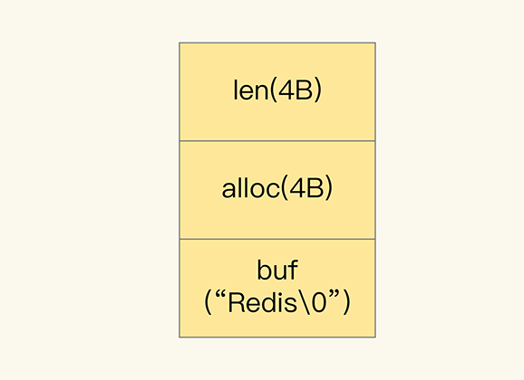

- **buf**：字节数组，保存实际数据。为了表示字节数组的结束，Redis会自动在数组最后加一个“\0”，这就会额外占用1个字节的开销。
- **len**：占4个字节，表示buf的已用长度。
- **alloc**：也占个4字节，表示buf的实际分配长度，一般大于len。

可以看到，在SDS中，buf保存实际数据，而len和alloc本身其实是SDS结构体的额外开销。

另外，对于String类型来说，除了SDS的额外开销，还有一个来自于RedisObject结构体的开销。

因为Redis的数据类型有很多，而且，不同数据类型都有些相同的元数据要记录（比如最后一次访问的时间、被引用的次数等），所以，Redis会用一个RedisObject结构体来统一记录这些元数据，同时指向实际数据。

一个RedisObject包含了8字节的元数据和一个8字节指针，这个指针再进一步指向具体数据类型的实际数据所在，例如指向String类型的SDS结构所在的内存地址，可以看一下下面的示意图。关于RedisObject的具体结构细节，我会在后面的课程中详细介绍，现在你只要了解它的基本结构和元数据开销就行了。

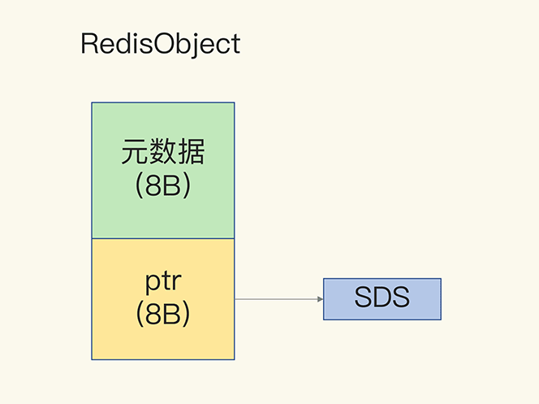

为了节省内存空间，Redis还对Long类型整数和SDS的内存布局做了专门的设计。

一方面，当保存的是Long类型整数时，RedisObject中的指针就直接赋值为整数数据了，这样就不用额外的指针再指向整数了，节省了指针的空间开销。

另一方面，当保存的是字符串数据，并且字符串小于等于44字节时，RedisObject中的元数据、指针和SDS是一块连续的内存区域，这样就可以避免内存碎片。这种布局方式也被称为embstr编码方式。

当然，当字符串大于44字节时，SDS的数据量就开始变多了，Redis就不再把SDS和RedisObject布局在一起了，而是会给SDS分配独立的空间，并用指针指向SDS结构。这种布局方式被称为raw编码模式。

为了帮助你理解int、embstr和raw这三种编码模式，我画了一张示意图，如下所示：

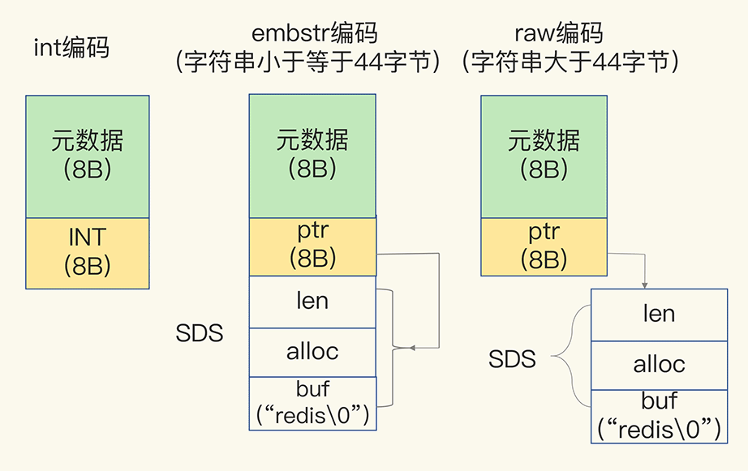

好了，知道了RedisObject所包含的额外元数据开销，现在，我们就可以计算String类型的内存使用量了。

因为10位数的图片ID和图片存储对象ID是Long类型整数，所以可以直接用int编码的RedisObject保存。每个int编码的RedisObject元数据部分占8字节，指针部分被直接赋值为8字节的整数了。此时，每个ID会使用16字节，加起来一共是32字节。但是，另外的32字节去哪儿了呢？

我在[第2讲](https://time.geekbang.org/column/article/268253)中说过，Redis会使用一个全局哈希表保存所有键值对，哈希表的每一项是一个dictEntry的结构体，用来指向一个键值对。dictEntry结构中有三个8字节的指针，分别指向key、value以及下一个dictEntry，三个指针共24字节，如下图所示：

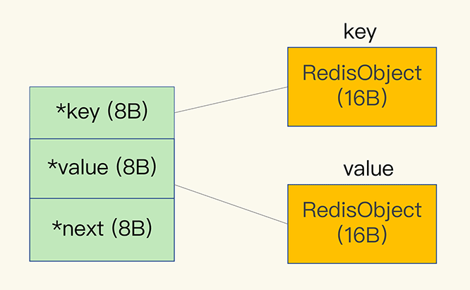

但是，这三个指针只有24字节，为什么会占用了32字节呢？这就要提到Redis使用的内存分配库jemalloc了。

jemalloc在分配内存时，会根据我们申请的字节数N，找一个比N大，但是最接近N的2的幂次数作为分配的空间，这样可以减少频繁分配的次数。

举个例子。如果你申请6字节空间，jemalloc实际会分配8字节空间；如果你申请24字节空间，jemalloc则会分配32字节。所以，在我们刚刚说的场景里，dictEntry结构就占用了32字节。

好了，到这儿，你应该就能理解，为什么用String类型保存图片ID和图片存储对象ID时需要用64个字节了。

你看，明明有效信息只有16字节，使用String类型保存时，却需要64字节的内存空间，有48字节都没有用于保存实际的数据。我们来换算下，如果要保存的图片有1亿张，那么1亿条的图片ID记录就需要6.4GB内存空间，其中有4.8GB的内存空间都用来保存元数据了，额外的内存空间开销很大。那么，有没有更加节省内存的方法呢？

## 用什么数据结构可以节省内存？

Redis有一种底层数据结构，叫压缩列表（ziplist），这是一种非常节省内存的结构。

我们先回顾下压缩列表的构成。表头有三个字段zlbytes、zltail和zllen，分别表示列表长度、列表尾的偏移量，以及列表中的entry个数。压缩列表尾还有一个zlend，表示列表结束。

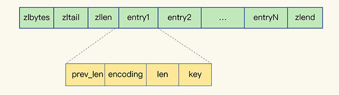

压缩列表之所以能节省内存，就在于它是用一系列连续的entry保存数据。每个entry的元数据包括下面几部分。

- **prev_len**，表示前一个entry的长度。prev_len有两种取值情况：1字节或5字节。取值1字节时，表示上一个entry的长度小于254字节。虽然1字节的值能表示的数值范围是0到255，但是压缩列表中zlend的取值默认是255，因此，就默认用255表示整个压缩列表的结束，其他表示长度的地方就不能再用255这个值了。所以，当上一个entry长度小于254字节时，prev_len取值为1字节，否则，就取值为5字节。
- ~~**len**：表示自身长度，4字节；~~
- **encoding**：表示编码方式，1字节；
- **content**：保存实际数据。

这些entry会挨个儿放置在内存中，不需要再用额外的指针进行连接，这样就可以节省指针所占用的空间。

我们以保存图片存储对象ID为例，来分析一下压缩列表是如何节省内存空间的。

每个entry保存一个图片存储对象ID（8字节），此时，每个entry的prev_len只需要1个字节就行，因为每个entry的前一个entry长度都只有8字节，小于254字节。这样一来，一个图片的存储对象ID所占用的内存大小是14字节~~（1+4+1+8=14）~~，实际分配16字节。

Redis基于压缩列表实现了List、Hash和Sorted Set这样的集合类型，这样做的最大好处就是节省了dictEntry的开销。当你用String类型时，一个键值对就有一个dictEntry，要用32字节空间。但采用集合类型时，一个key就对应一个集合的数据，能保存的数据多了很多，但也只用了一个dictEntry，这样就节省了内存。

这个方案听起来很好，但还存在一个问题：在用集合类型保存键值对时，一个键对应了一个集合的数据，但是在我们的场景中，一个图片ID只对应一个图片的存储对象ID，我们该怎么用集合类型呢？换句话说，在一个键对应一个值（也就是单值键值对）的情况下，我们该怎么用集合类型来保存这种单值键值对呢？

## 如何用集合类型保存单值的键值对？

在保存单值的键值对时，可以采用基于Hash类型的二级编码方法。这里说的二级编码，就是把一个单值的数据拆分成两部分，前一部分作为Hash集合的key，后一部分作为Hash集合的value，这样一来，我们就可以把单值数据保存到Hash集合中了。

以图片ID 1101000060和图片存储对象ID 3302000080为例，我们可以把图片ID的前7位（1101000）作为Hash类型的键，把图片ID的最后3位（060）和图片存储对象ID分别作为Hash类型值中的field和value。

按照这种设计方法，我在Redis中插入了一组图片ID及其存储对象ID的记录，并且用info命令查看了内存开销，我发现，增加一条记录后，内存占用只增加了16字节，如下所示：

```
127.0.0.1:6379> info memory
# Memory
used_memory:1039120
127.0.0.1:6379> hset 1101000 060 3302000080 // hset key field value [field value ...]
(integer) 1
127.0.0.1:6379> info memory
# Memory
used_memory:1039136
```

在使用String类型时，每个记录需要消耗64字节，这种方式却只用了16字节，所使用的内存空间是原来的1/4，满足了我们节省内存空间的需求。

> hset 1101000 060 3302000080 操作为何只占用16字节？哈希键（060）、值（3302000080）两者各占用一个entry，按文中介绍，应该至少占用28字节。
>
> 其中原因，我认为很可能是文中对ziplist entry的介绍有误，参考下面GitHub文章，entry中并没有len字段，entry长度由encoding表示。所以例子中虽然创建两个entry，但总长度是小于16的。(1+1+1Byte，1+1+10位数字的所占的bytes<8Bytes) << 14bytes
>
> 参考：[见文末引用](https://github.com/zpoint/Redis-Internals/blob/5.0/Object/hash/hash_cn.md)

不过，你可能也会有疑惑：“二级编码一定要把图片ID的前7位作为Hash类型的键，把最后3位作为Hash类型值中的key吗？”**其实，二级编码方法中采用的ID长度是有讲究的**。

在[第2讲](https://time.geekbang.org/column/article/268253)中，我介绍过Redis Hash类型的两种底层实现结构，分别是**压缩列表**和**哈希表**。

那么，Hash类型底层结构什么时候使用压缩列表，什么时候使用哈希表呢？其实，Hash类型设置了用压缩列表保存数据时的两个阈值，一旦超过了阈值，Hash类型就会用哈希表来保存数据了。

这两个阈值分别对应以下两个配置项：

- hash-max-ziplist-entries：表示用压缩列表保存时哈希集合中的最大元素个数。
- hash-max-ziplist-value：表示用压缩列表保存时哈希集合中单个元素的最大长度。

如果我们往Hash集合中写入的元素个数超过了hash-max-ziplist-entries，或者写入的单个元素大小超过了hash-max-ziplist-value，Redis就会自动把Hash类型的实现结构由压缩列表转为哈希表。

**一旦从压缩列表转为了哈希表，Hash类型就会一直用哈希表进行保存，而不会再转回压缩列表了。在节省内存空间方面，哈希表就没有压缩列表那么高效了。**

**为了能充分使用压缩列表的精简内存布局，我们一般要控制保存在Hash集合中的元素个数**。所以，在刚才的二级编码中，我们只用图片ID最后3位作为Hash集合的key，也就保证了Hash集合的元素个数不超过1000，同时，我们把hash-max-ziplist-entries设置为1000，这样一来，Hash集合就可以一直使用压缩列表来节省内存空间了。

> ```
> 127.0.0.1:6379> config get hash*
> 1) "hash-max-ziplist-entries"
> 2) "512"
> 3) "hash-max-ziplist-value"
> 4) "64"
> ```

## 小结

如果你想知道键值对采用不同类型保存时的内存开销，可以在[这个网址](http://www.redis.cn/redis_memory/)里输入你的键值对长度和使用的数据类型，这样就能知道实际消耗的内存大小了。建议你把这个小工具用起来，它可以帮助你充分地节省内存。

## 每课一问

- 除了String类型和Hash类型，还有其他合适的类型可以应用在这节课所说的保存图片的例子吗？

> 保存图片的例子，除了用String和Hash存储之外，还可以用Sorted Set存储（勉强）。
>
> Sorted Set与Hash类似，当元素数量少于zset-max-ziplist-entries，并且每个元素内存占用小于zset-max-ziplist-value时，默认也采用ziplist结构存储。我们可以把zset-max-ziplist-entries参数设置为1000，这样Sorted Set默认就会使用ziplist存储了，member和score也会紧凑排列存储，可以节省内存空间。
>
> 使用zadd 1101000 3302000080 060命令存储图片ID和对象ID的映射关系，查询时使用zscore 1101000 060获取结果。
>
> 但是Sorted Set使用ziplist存储时的缺点是，这个ziplist是需要按照score排序的（为了方便zrange和zrevrange命令的使用），所以在插入一个元素时，需要先根据score找到对应的位置，然后把member和score插入进去，这也意味着Sorted Set插入元素的性能没有Hash高（这也是前面说勉强能用Sorte Set存储的原因）。而Hash在插入元素时，只需要将新的元素插入到ziplist的尾部即可，不需要定位到指定位置。
>
> **不管是使用Hash还是Sorted Set，当采用ziplist方式存储时，虽然可以节省内存空间，但是在查询指定元素时，都要遍历整个ziplist，找到指定的元素。所以使用ziplist方式存储时，虽然可以利用CPU高速缓存，但也不适合存储过多的数据（hash-max-ziplist-entries和zset-max-ziplist-entries不宜设置过大），否则查询性能就会下降比较厉害。整体来说，这样的方案就是时间换空间，我们需要权衡使用。**
>
> **当使用ziplist存储时，我们尽量存储int数据**，ziplist在设计时每个entry都进行了优化，针对要存储的数据，会尽量选择占用内存小的方式存储（整数比字符串在存储时占用内存更小），这也有利于我们节省Redis的内存。还有，因为ziplist是每个元素紧凑排列，而且**每个元素存储了上一个元素的长度，所以当修改其中一个元素超过一定大小时，会引发多个元素的级联调整**（前面一个元素发生大的变动，后面的元素都要重新排列位置，重新分配内存），这也会引发性能问题，需要注意。
>
> 另外，**使用Hash和Sorted Set存储时，虽然节省了内存空间，但是设置过期变得困难（无法控制每个元素的过期，只能整个key设置过期，或者业务层单独维护每个元素过期删除的逻辑，但比较复杂）**。而使用String虽然占用内存多，但是每个key都可以单独设置过期时间，还可以设置maxmemory和淘汰策略，以这种方式控制整个实例的内存上限。
>
> 所以在**选用Hash和Sorted Set存储时，意味着把Redis当做数据库使用**，这样就需要务必保证Redis的可靠性（做好备份、主从副本），防止实例宕机引发数据丢失的风险。而**采用String存储时，可以把Redis当做缓存使用**，每个key设置过期时间，同时设置maxmemory和淘汰策略，控制整个实例的内存上限，这种方案需要在数据库层（例如MySQL）也存储一份映射关系，当Redis中的缓存过期或被淘汰时，需要从数据库中重新查询重建缓存，同时需要保证数据库和缓存的一致性，这些逻辑也需要编写业务代码实现。
>
> 总之，各有利弊，我们需要根据实际场景进行选择。


>
>
># hash
>
># 目录
>
>- [相关位置文件](https://github.com/zpoint/Redis-Internals/blob/5.0/Object/hash/hash_cn.md#相关位置文件)
>- encoding
>  - OBJ_ENCODING_ZIPLIST
>    - entry
>      - [prevlen](https://github.com/zpoint/Redis-Internals/blob/5.0/Object/hash/hash_cn.md#prevlen)
>      - [encoding](https://github.com/zpoint/Redis-Internals/blob/5.0/Object/hash/hash_cn.md#encoding)
>      - [entry data](https://github.com/zpoint/Redis-Internals/blob/5.0/Object/hash/hash_cn.md#entry-data)
>    - 增删改查
>      - [创建](https://github.com/zpoint/Redis-Internals/blob/5.0/Object/hash/hash_cn.md#创建)
>      - [读取](https://github.com/zpoint/Redis-Internals/blob/5.0/Object/hash/hash_cn.md#读取)
>      - [修改](https://github.com/zpoint/Redis-Internals/blob/5.0/Object/hash/hash_cn.md#修改)
>      - [删除](https://github.com/zpoint/Redis-Internals/blob/5.0/Object/hash/hash_cn.md#删除)
>    - [升级](https://github.com/zpoint/Redis-Internals/blob/5.0/Object/hash/hash_cn.md#升级)
>  - OBJ_ENCODING_HT
>    - [哈希碰撞](https://github.com/zpoint/Redis-Internals/blob/5.0/Object/hash/hash_cn.md#哈希碰撞)
>    - [resize](https://github.com/zpoint/Redis-Internals/blob/5.0/Object/hash/hash_cn.md#resize)
>    - [activerehashing](https://github.com/zpoint/Redis-Internals/blob/5.0/Object/hash/hash_cn.md#activerehashing)
>
># 相关位置文件
>
>- redis/src/ziplist.h
>- redis/src/ziplist.c
>- redis/src/dict.h
>- redis/src/dict.c
>
># encoding
>
>## OBJ_ENCODING_ZIPLIST
>
>> ziplist 是一种特殊的双端链表, 它能最大程度地节省内存空间. 它可以存储字符串和整型值, 整型的存储方式是真正的整数, 而不是一串整数的字符串表示, 它也可以在任意一端进行压入/弹出操作, 并且该操作的时间复杂度为 O(1). 但是每一个操作都需要对这个 ziplist 的空间进行重新分配, 实际上真正的复杂度是和 ziplist 使用到的空间相关的
>
>翻译自 `redis/src/ziplist.c`
>
>这是 **ziplist** 的内存构造
>
>[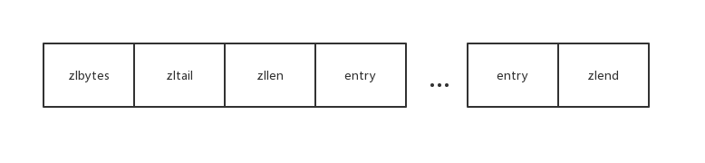](https://github.com/zpoint/Redis-Internals/blob/5.0/Object/hash/ziplist_overall_layout.png)
>
>我们来看一个简单的示例
>
>```
>127.0.0.1:6379> HSET AA key1 33
>(integer) 1
>127.0.0.1:6379> OBJECT ENCODING AA
>"ziplist"
>```
>
>[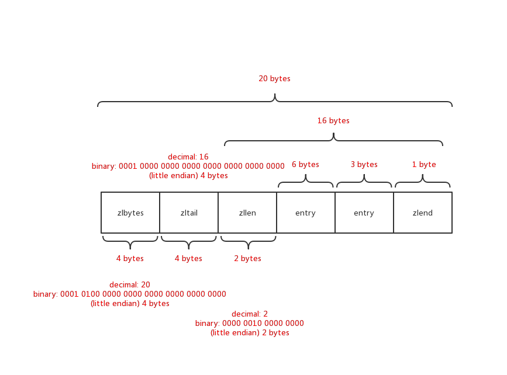](https://github.com/zpoint/Redis-Internals/blob/5.0/Object/hash/simple_hash.png)
>
>从上图我们可以看出
>
>`zlbytes` 表示当前这个 **ziplist** 总共占用的字节数
>
>`zltail` 是从当前位置到达 `zlend` 的字节偏移量
>
>`zllen` 表示当前这个 **ziplist** 有多少个 entries
>
>`zlend` 是一个长度为一字节的结束标记, 表示 **ziplist** 的尾端
>
>这是上面插入过后的内存构造
>
>[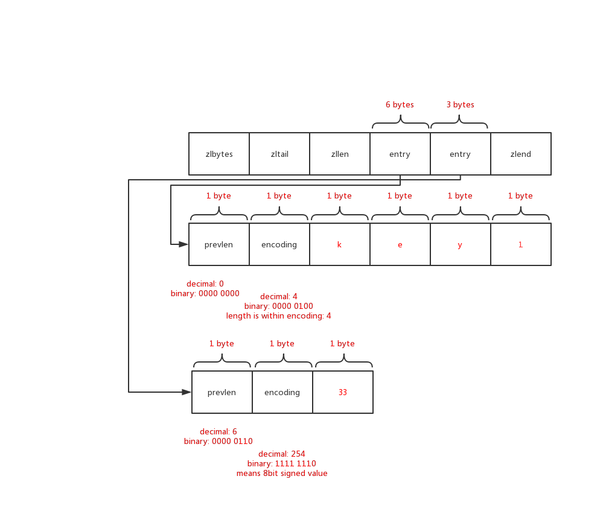](https://github.com/zpoint/Redis-Internals/blob/5.0/Object/hash/simple_hash_two_entry.png)
>
>`prevlen` 存储的是前一个 entry 占用的字节长度, 通过这个字段你可以反方向遍历这个双端链表, 这个字段本身的长度要么就是一个 1 字节长的 `uint8_t` 表示前一个 entry 的长度在 254 bytes 以下, 要么是一个 5 字节长的数, 第一个字节用来作为标记区分前一种表示方法, 后面的 4 个字节可以作为 `uint32_t` 表示前一个 entry 占用的字节数
>
>`encoding` 表示的是 entry 中的内容是如何进行编码的, 当前存在好几种不同的 `encoding`, 我们后面会看到
>
>### entry
>
>我们现在知道了 entry 包含了 3 个部分
>
>#### prevlen
>
>`prevlen` 要么是 1 字节长, 要么是 5 字节长, 如果 `prevlen` 的第一个字节值为 254, 那么接下来的 4 个字节一起作为一个无符号整数表示前一个 entry 的长度
>
>[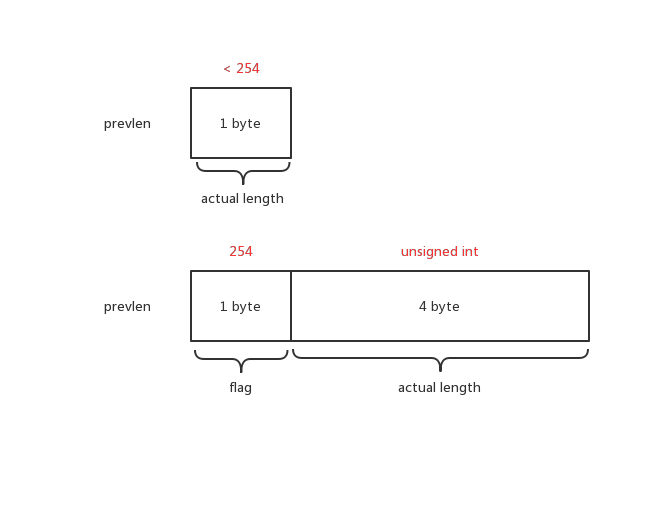](https://github.com/zpoint/Redis-Internals/blob/5.0/Object/hash/prevlen.png)
>
>#### encoding
>
>```
>entry data` 中内容的实际存储方式取决于 `encoding`, 总共有以下几种 `encoding
>```
>
>[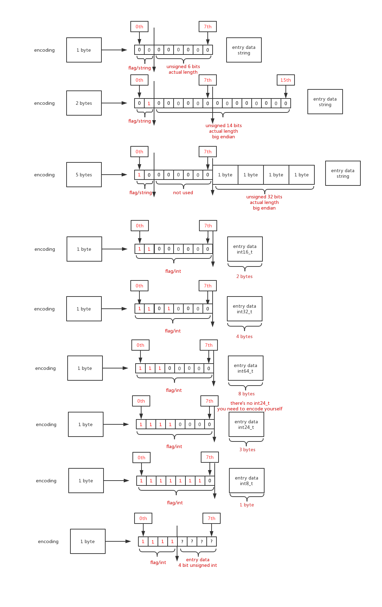](https://github.com/zpoint/Redis-Internals/blob/5.0/Object/hash/encoding.png)
>
>#### entry data
>
>`entry data` 存储了实际的内容, `entry data` 中的内容要么就是 byte 数组, 要么就是整型, 你需要根据 `encoding` 来获取 `entry data` 中的内容
>
>### 增删改查
>
>#### 创建
>
>你第一次输入 `hset` 某个键时, 会首先创建一个空的 `ziplist`, 然后再把键对值插进去
>
>[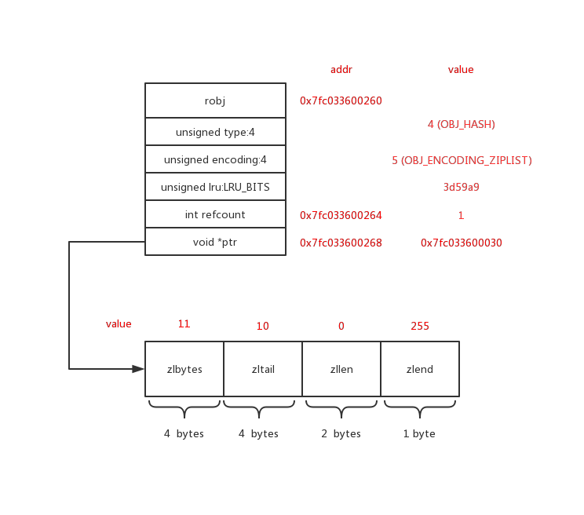](https://github.com/zpoint/Redis-Internals/blob/5.0/Object/hash/empty_ziplist.png)
>
>```
>127.0.0.1:6379> HSET AA key1 val1
>(integer) 1
>127.0.0.1:6379> HSET AA key2 123
>(integer) 1
>```
>
>[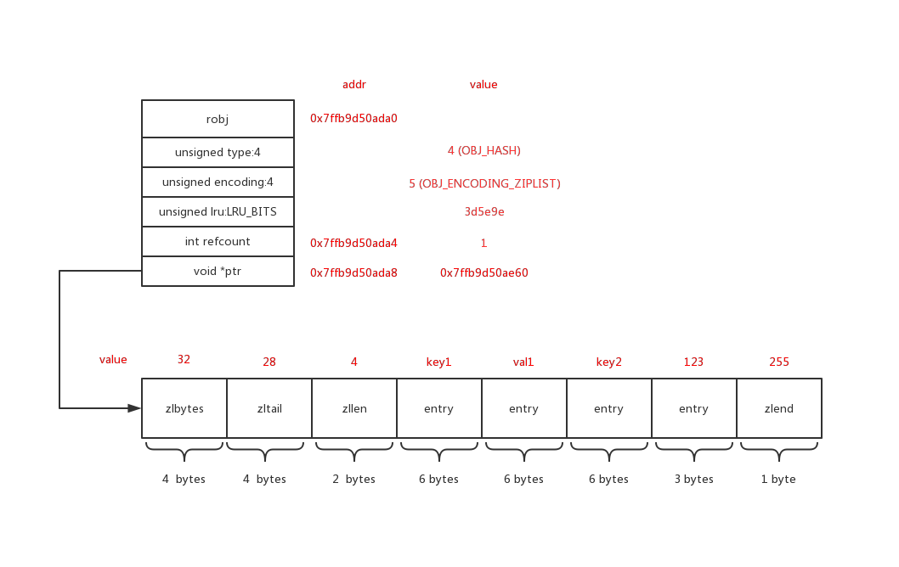](https://github.com/zpoint/Redis-Internals/blob/5.0/Object/hash/two_value_ziplist.png)
>
>#### 读取
>
>```
>127.0.0.1:6379> HGET AA key2
>"123"
>```
>
>`hget` 命令会遍历这个 `ziplist`, 根据 `encoding` 提取出 `entry data` 中的内容, 之后检查内容是否匹配, 它是一个 O(n) 的线性搜索
>
>#### 修改
>
>这是更新键值的代码片段
>
>```
>/* redis/src/t_hash.c */
>/* Delete value */
>zl = ziplistDelete(zl, &vptr);
>
>/* Insert new value */
>zl = ziplistInsert(zl, vptr, (unsigned char*)value, sdslen(value));
>```
>
>我们来看一个示例
>
>```
>127.0.0.1:6379> HSET AA key1 val_new
>(integer) 0
>```
>
>首先是删除旧的值
>
>[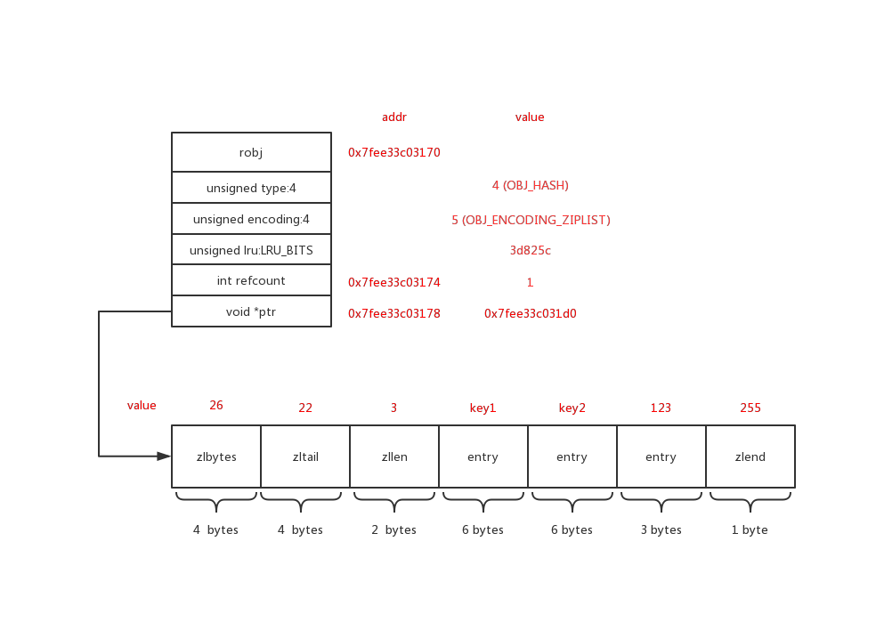](https://github.com/zpoint/Redis-Internals/blob/5.0/Object/hash/delete_ziplist.png)
>
>之后是插入新的值
>
>插入的时候会调用 `realloc` 来扩展 `ziplist` 的空间, 并且把所有的待插入位置之后的 `entry` 后移, 然后插入到这个对应的位置上
>
>`realloc` 会调用到 `redis/src/zmalloc.h` 中的 `zrealloc` 函数, 我们会在其他的文章学习到这部分内容
>
>[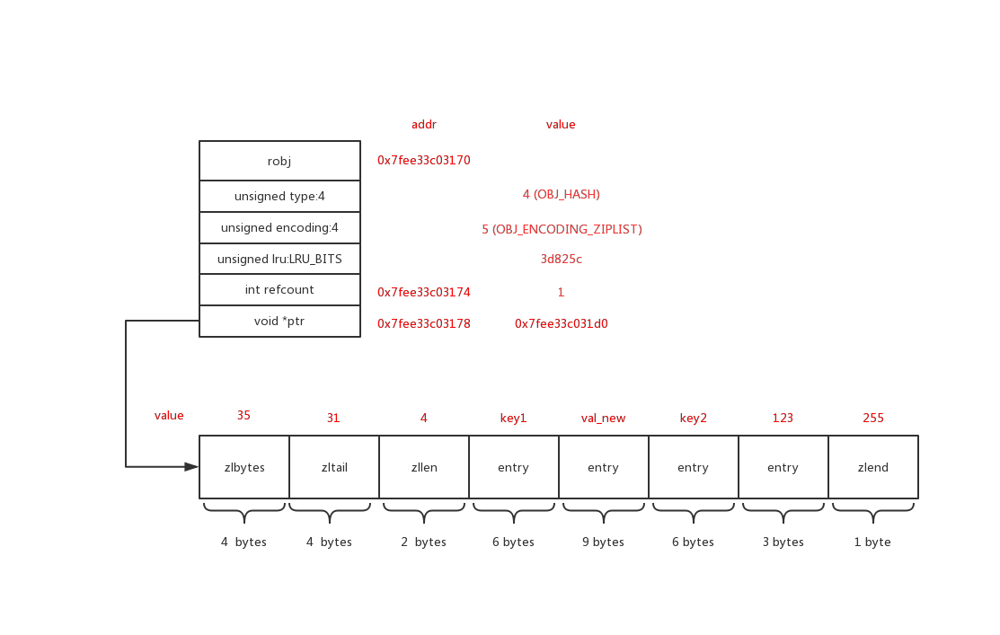](https://github.com/zpoint/Redis-Internals/blob/5.0/Object/hash/update_ziplist.png)
>
>#### 删除
>
>删除操作会把所有当前准备删除的 `entry` 后面的全部数据前移, 由于 `prevlen` 的大小要么是 1 字节 要么是 5 字节, 在以下情况有可能发生 `CascadeUpdate` 现象
>
>比如当前删除的 `entry` 的前一个 `entry` 大小超过 254, 1 个字节无法存储, 但是当前的 `entry` 的长度又小于 254, 也就意味着下一个 `entry` 的 `prevlen` 字段是用 1 个字节存储的, 如果删除了当前的 `entry`, 下一个 `entry` 也需要做扩展, 对于再之后的 `entry` 也都要做相同的检查
>
>假设我们正在删除下图的第二个 `entry`
>
>[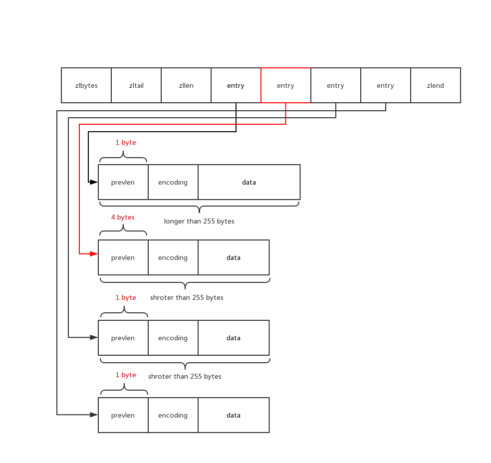](https://github.com/zpoint/Redis-Internals/blob/5.0/Object/hash/cascad.png)
>
>在删除并把后面的全部数据前移之后
>
>[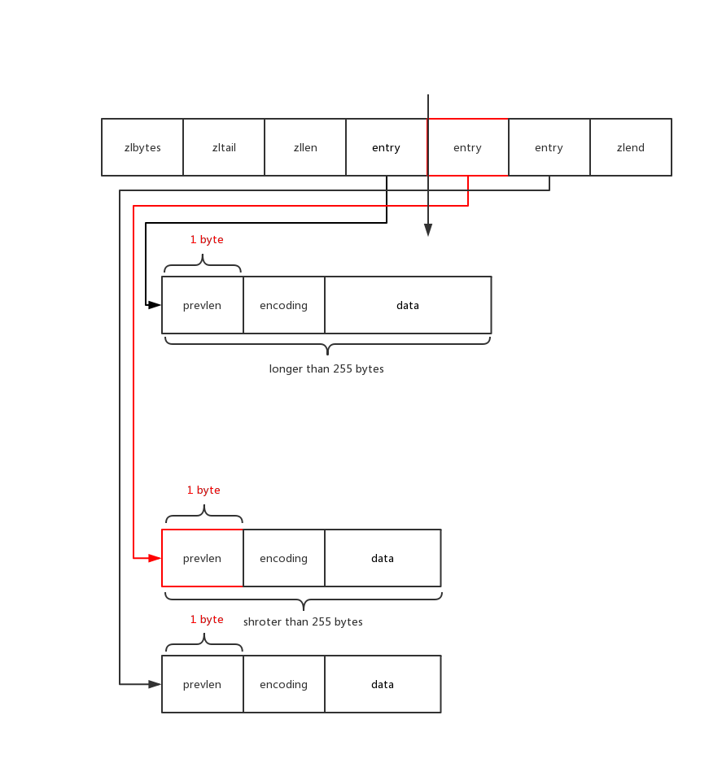](https://github.com/zpoint/Redis-Internals/blob/5.0/Object/hash/cascad_promotion1.png)
>
>此时下一个 `entry` 的 `prevlen` 本身为 1 个字节, `ziplist` 需要调用 `realloc` 来扩展下一个 `entry` 的 `prevlen`
>
>[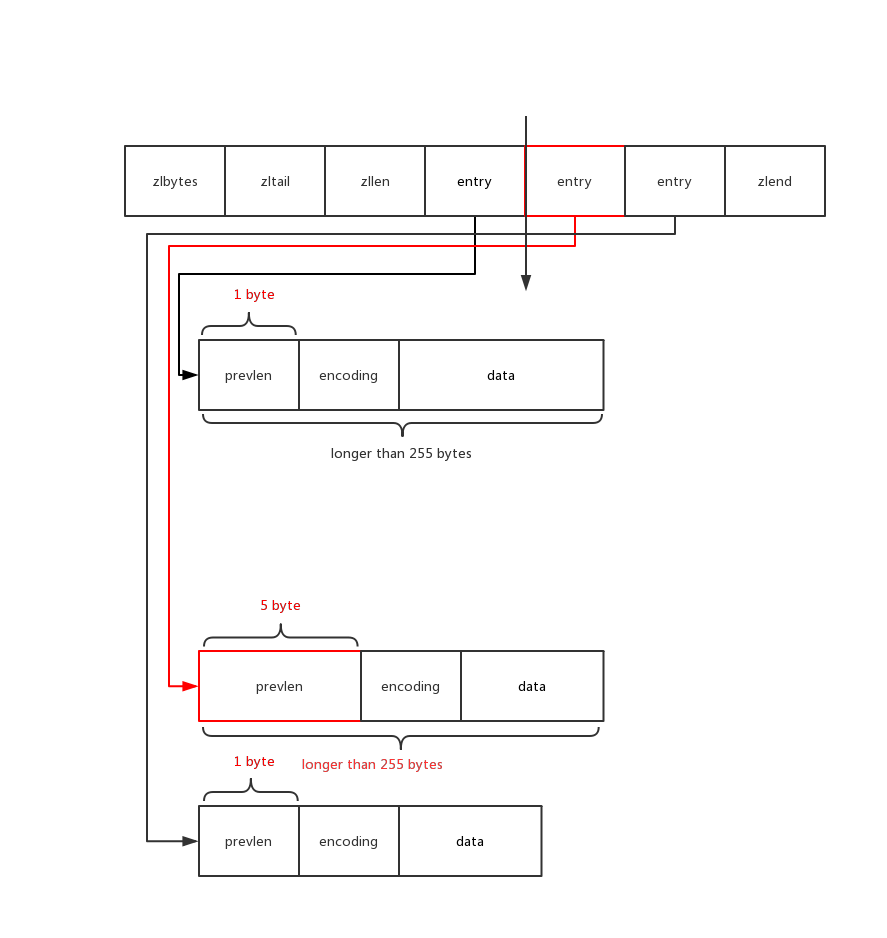](https://github.com/zpoint/Redis-Internals/blob/5.0/Object/hash/cascad_promotion2.png)
>
>如果这个 `entry` 在扩展之后长度超过了 255 字节 ? 再下一个 `entry` 的 `prevlen` 此时又无法存下前一个 `entry` 的长度, 我们需要再次执行 `realloc`
>
>[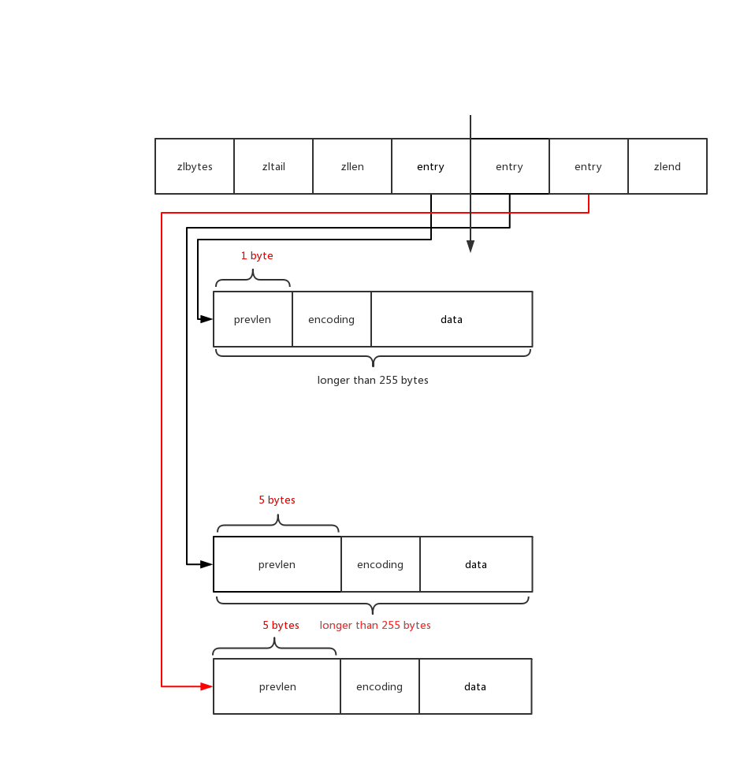](https://github.com/zpoint/Redis-Internals/blob/5.0/Object/hash/cascad_promotion3.png)
>
>如果你有一个拥有 N 个 `entry` 的 `ziplist`, 并且执行了删除操作, 那么每一个被删除的 `entry` 之后的 `entry` 都需要按顺序进行上面的检查, 看是否需要被扩展
>
>这就是所谓的 **cascad update**
>
>### 升级
>
>```
>/* redis/src/t_hash.c */
>/* 在 hset 中执行 */
>for (i = start; i <= end; i++) {
>    if (sdsEncodedObject(argv[i]) &&
>        sdslen(argv[i]->ptr) > server.hash_max_ziplist_value)
>    {
>        hashTypeConvert(o, OBJ_ENCODING_HT);
>        break;
>    }
>}
>/* ... */
>/* 检查 ziplist 是否需要被转换为 hash table */
>if (hashTypeLength(o) > server.hash_max_ziplist_entries)
>    hashTypeConvert(o, OBJ_ENCODING_HT);
>```
>
>如果插入的对象类型为 [sds](https://github.com/zpoint/Redis-Internals/blob/5.0/Object/sds/sds_cn.md) 并且 sds 长度大于 `hash-max-ziplist-value` (你可以在配置文件中进行设置, 默认值为64), 当前的 `ziplist` 就会被转换为 hash table(`OBJ_ENCODING_HT`)
>
>或者 `ziplist` 的长度在插入后超过了 `hash-max-ziplist-entries`(默认值为 512), 它也同样会被转换为 hash table
>
>## OBJ_ENCODING_HT
>
>我在配置文件配置了如下这行 `hash-max-ziplist-entries 0`
>
>```
>hset AA key1 12
>```
>
>这是设置了一个键对值之后的构造
>
>[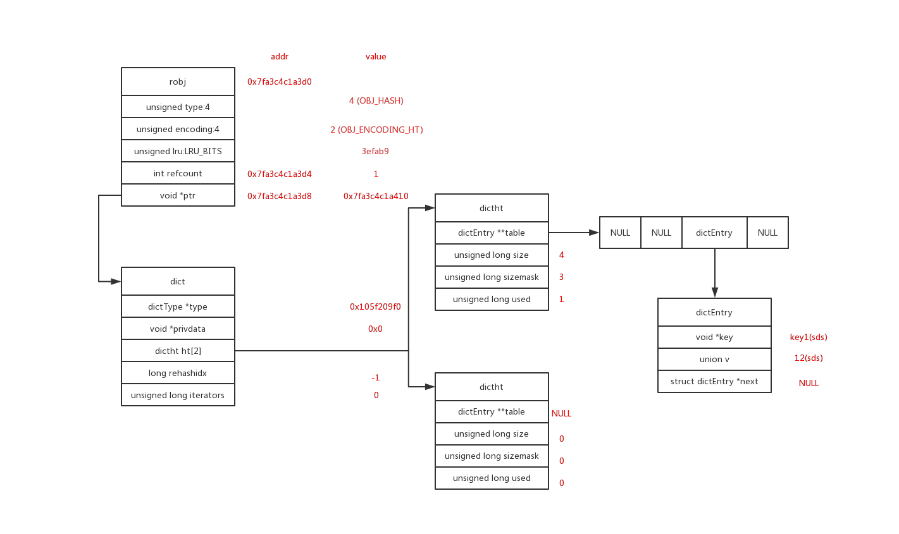](https://github.com/zpoint/Redis-Internals/blob/5.0/Object/hash/dict_layout.png)
>
>### 哈希碰撞
>
>redis 目前使用 [SipHash 1-2](https://en.wikipedia.org/wiki/SipHash)(文件位置 `redis/src/siphash.c`) 作为哈希函数, 抛弃了在先前版本中使用的 [murmurhash](https://en.wikipedia.org/wiki/MurmurHash)
>
>根据代码注释等信息, **SipHash 1-2** 的速度和 **Murmurhash2** 基本相同, 但是 **SipHash 2-4** 会大概拖慢 4% 左右的运行速度
>
>并且哈希函数的 seed 是在 redis 服务启动时初始化的
>
>```
>/* redis/src/server.c */
>char hashseed[16];
>getRandomHexChars(hashseed,sizeof(hashseed));
>dictSetHashFunctionSeed((uint8_t*)hashseed);
>```
>
>由于 **hashseed** 是随机生成的, 在不同的 redis 实例之间, 或者同个 redis 实例重启之后, 即使是相同的 key 哈希的结果也是不同的, 你无法预测这个 key 会被哈希到表的哪一个桶上
>
>```
>hset AA zzz val2
>```
>
>CPython 使用了 [一个探针算法处理哈希碰撞](https://github.com/zpoint/CPython-Internals/blob/master/BasicObject/dict/dict_cn.md#哈希碰撞与删除), redis 使用的是单向链表
>
>如果两个 key 的哈希取模后的值相同, 他们会被存储到同一个单向链表中, 并且新插入的对象会在前面
>
>[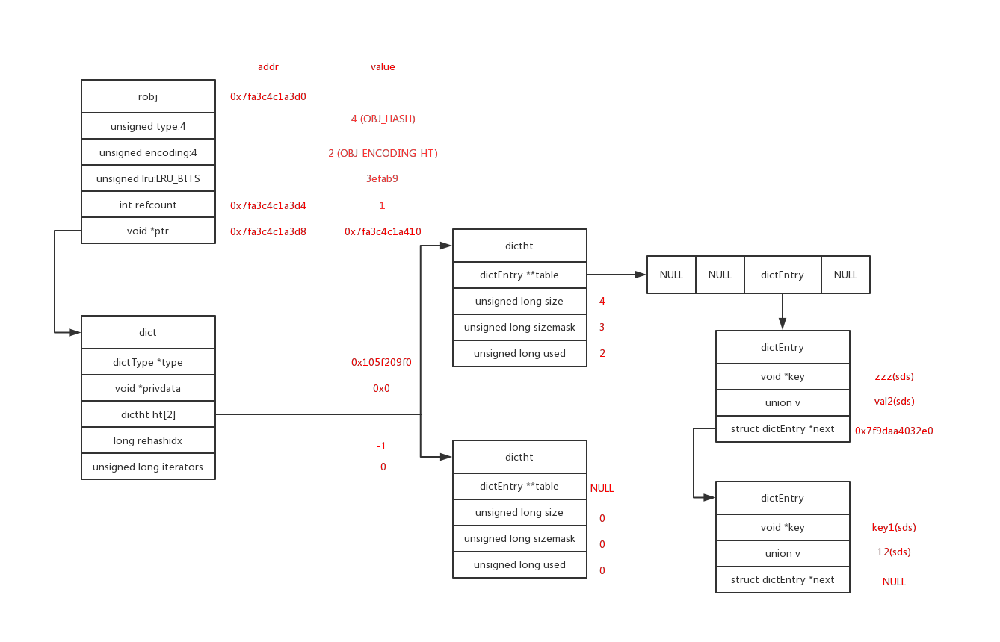](https://github.com/zpoint/Redis-Internals/blob/5.0/Object/hash/dict_collision.png)
>
>```
>hdel AA zzz
>```
>
>删除操作会找到对应的键对值删除, 并且在必要时调整哈希表的大小
>
>[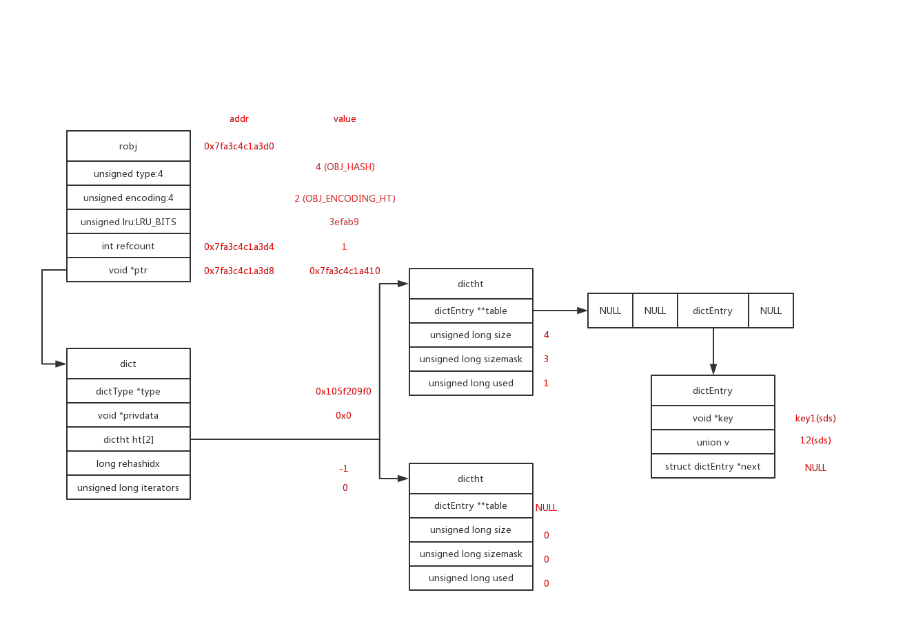](https://github.com/zpoint/Redis-Internals/blob/5.0/Object/hash/dict_delete.png)
>
>### resize
>
>在每一次字典插入时, 函数 `_dictExpandIfNeeded` 都会被调用
>
>```
>/* redis/src/dict.c */
>/* 需要时扩展哈希表 */
>static int _dictExpandIfNeeded(dict *d)
>{
>    /* 渐进式 rehash 正在进行中, 直接返回 */
>    if (dictIsRehashing(d)) return DICT_OK;
>
>    /* 如果哈希表为空, 把它初始化为默认大小. */
>    if (d->ht[0].size == 0) return dictExpand(d, DICT_HT_INITIAL_SIZE);
>    /* 如果达到了 1:1 的比例, 并且我们可以调整哈希表的大小,
>       或者当前的负载比例已经超过了设定的安全范围, 我们就会把哈希表的大小调整为原先的 2 倍 */
>    if (d->ht[0].used >= d->ht[0].size &&
>        (dict_can_resize ||
>         d->ht[0].used/d->ht[0].size > dict_force_resize_ratio))
>    {
>        return dictExpand(d, d->ht[0].used*2);
>    }
>    return DICT_OK;
>}
>```
>
>为了最大程序提高服务性能, 降低响应延时, **redis** 在字典中实现了 [渐进式 resizing](https://en.wikipedia.org/wiki/Hash_table#Incremental_resizing) 策略, 整个调整的过程并不是一次请求或者一次函数调用就完成的, 而是在每一次增删改查操作中一点一点完成的
>
>我们来看个示例
>
>```
>127.0.0.1:6379> del AA
>(integer) 1
>127.0.0.1:6379> hset AA 1 2
>(integer) 1
>127.0.0.1:6379> hset AA 2 2
>(integer) 1
>127.0.0.1:6379> hset AA 3 2
>(integer) 1
>127.0.0.1:6379> hset AA 4 2
>(integer) 1
>```
>
>[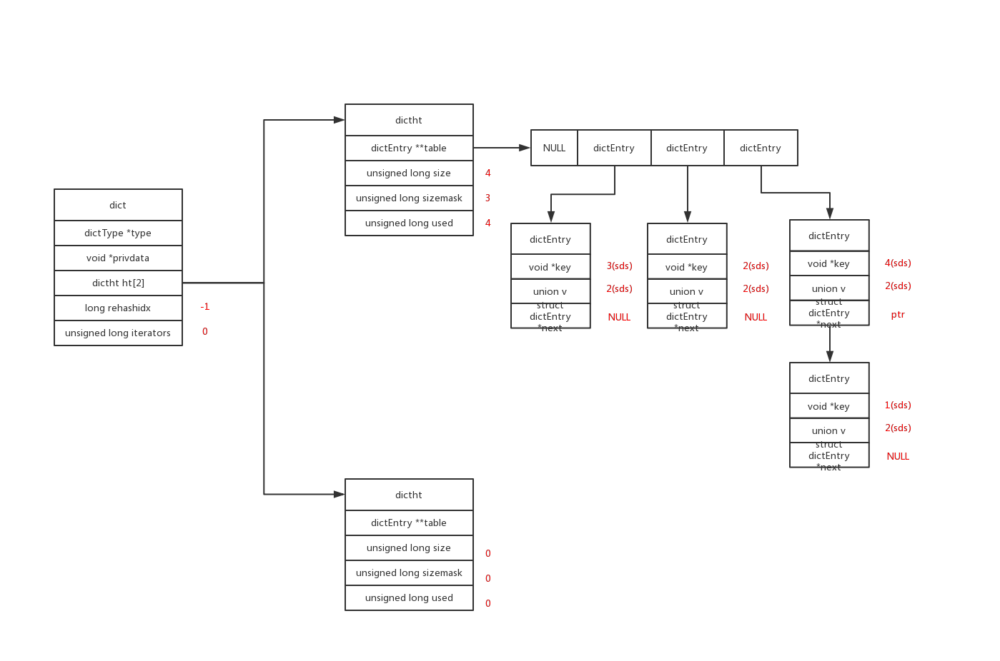](https://github.com/zpoint/Redis-Internals/blob/5.0/Object/hash/resize_before.png)
>
>```
>127.0.0.1:6379> hset AA 5 2
>(integer) 1
>```
>
>这一次我们插入新的 entry 时, `_dictExpandIfNeeded` 同样会被调用, 并且此时 `d->ht[0].used >= d->ht[0].size` 的判断为真, `dictExpand` 会新建一个 2 倍大小的哈希表, 并且把这张表存储到 `d->ht[1]` 中
>
>```
>/* redis/src/dict.c */
>/* 扩展或创建哈希表 */
>int dictExpand(dict *d, unsigned long size)
>{
>    / * 如果 size 比哈希表中存储的元素还要小, 那么这个 size 是非法的 */
>    if (dictIsRehashing(d) || d->ht[0].used > size)
>        return DICT_ERR;
>
>    dictht n; /* 新的哈希表 */
>    unsigned long realsize = _dictNextPower(size);
>
>    /* Rehash 到的新表的大小不能和旧表大小一样 */
>    if (realsize == d->ht[0].size) return DICT_ERR;
>
>    /* 为新的哈希表分配空间, 并且把所有的指针初始化为空指针 */
>    n.size = realsize;
>    n.sizemask = realsize-1;
>    n.table = zcalloc(realsize*sizeof(dictEntry*));
>    n.used = 0;
>
>    /* 如果是第一次调用这个函数分配表空间, 严格意义上这不是 rehash, 只用把表设置到 ht[0] 上即可 */
>    if (d->ht[0].table == NULL) {
>        d->ht[0] = n;
>        return DICT_OK;
>    }
>
>    /* 把创建的表设置到 ht[1] 上这样可以进行渐进式 rehash */
>    d->ht[1] = n;
>    d->rehashidx = 0;
>    return DICT_OK;
>}
>```
>
>因为 `rehashidx` 的值不是 -1, 新的 `entry` 插入到 `ht[1]` 中
>
>[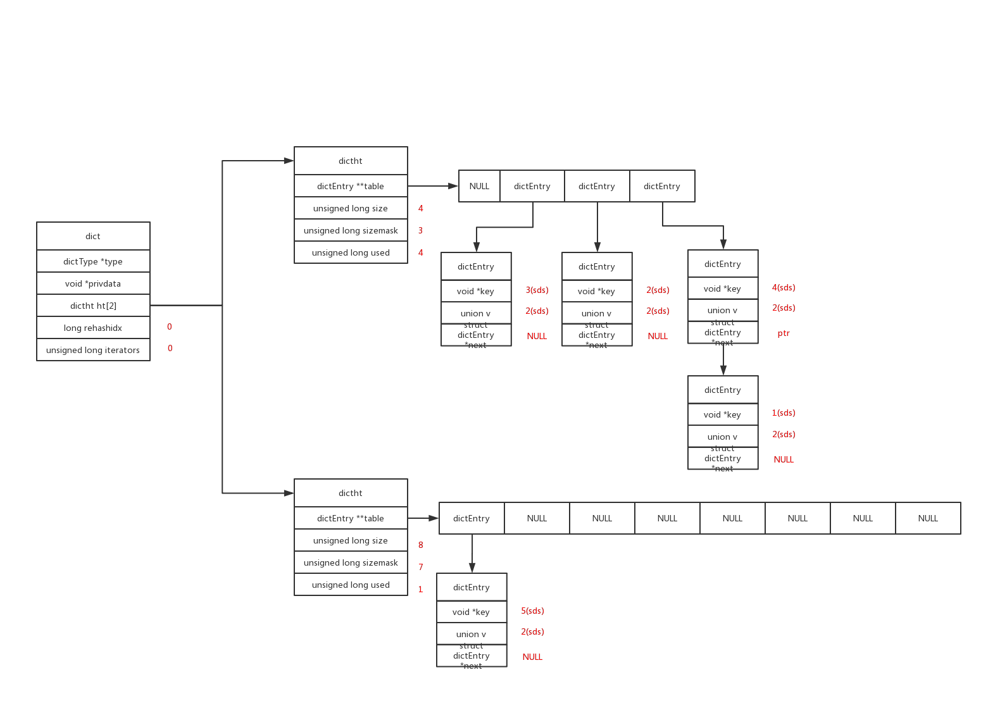](https://github.com/zpoint/Redis-Internals/blob/5.0/Object/hash/resize_middle.png)
>
>当 `rehashidx` 的值不是 -1 时, 每一个增删改查操作都会调用一次 `rehash` 函数
>
>```
>127.0.0.1:6379> hget AA 5
>"2"
>```
>
>你可以发现 `rehashidx` 变成了 1, 并且在哈希表中的 index[1] 上的整个桶都被移到了第二张表中
>
>[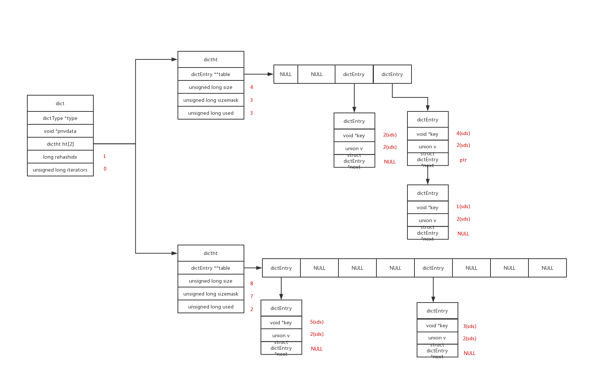](https://github.com/zpoint/Redis-Internals/blob/5.0/Object/hash/resize_middle2.png)
>
>```
>127.0.0.1:6379> hget AA not_exist
>(nil)
>```
>
>`rehashidx` 现在变成了 3
>
>[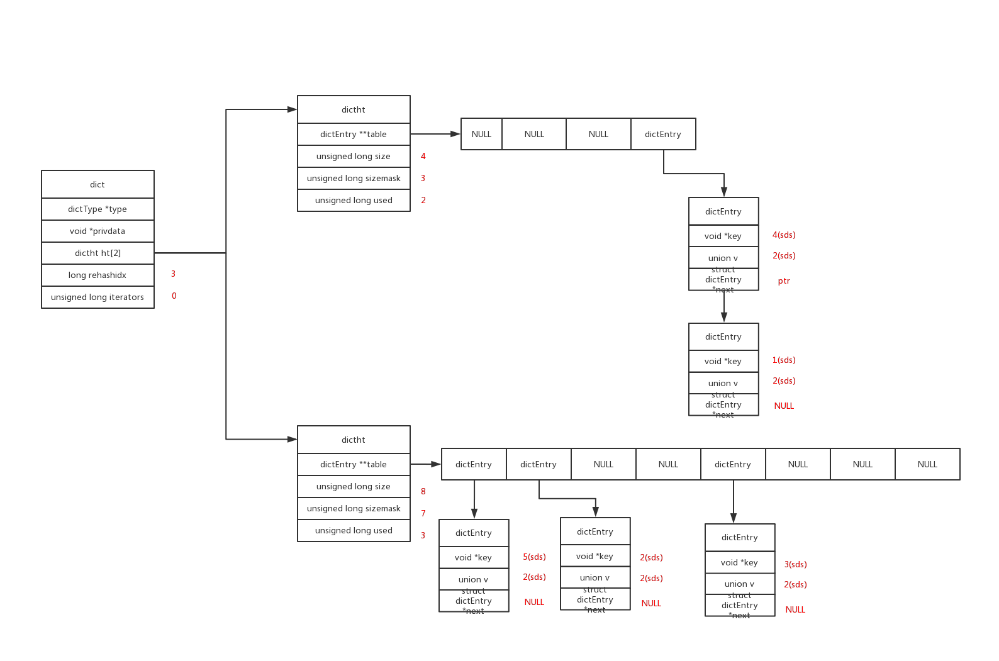](https://github.com/zpoint/Redis-Internals/blob/5.0/Object/hash/resize_middle3.png)
>
>```
>127.0.0.1:6379> hget AA 5
>"2"
>```
>
>当哈希表中 index[3] 上的整个桶都迁移完成时, 这个哈希表也完整的迁移过去了, `rehashidx` 再次设置为 -1, 并且旧的表会被释放
>
>[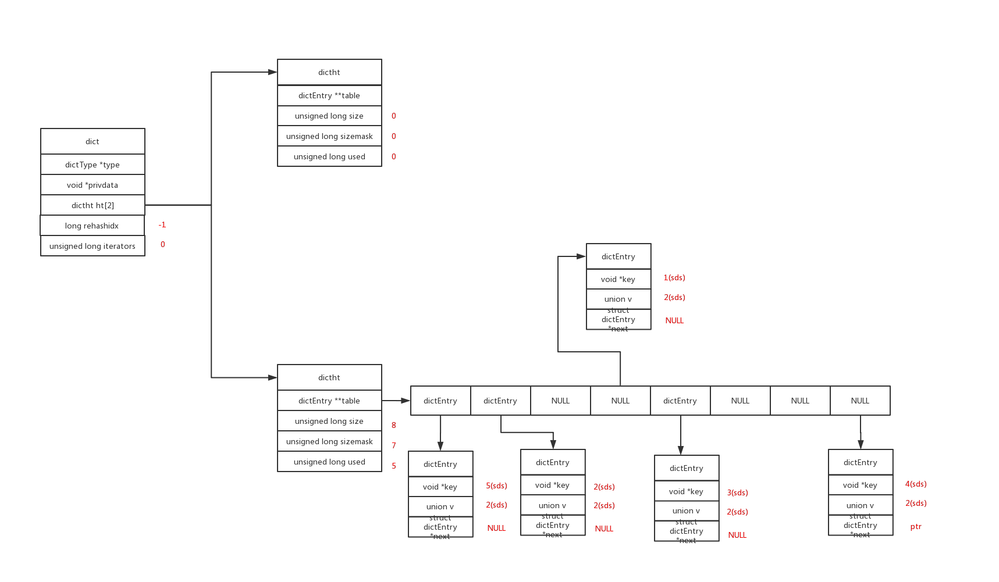](https://github.com/zpoint/Redis-Internals/blob/5.0/Object/hash/resize_done.png)
>
>并且新的表会变成 `ht[0]`, 两个表的位置会互相交换
>
>[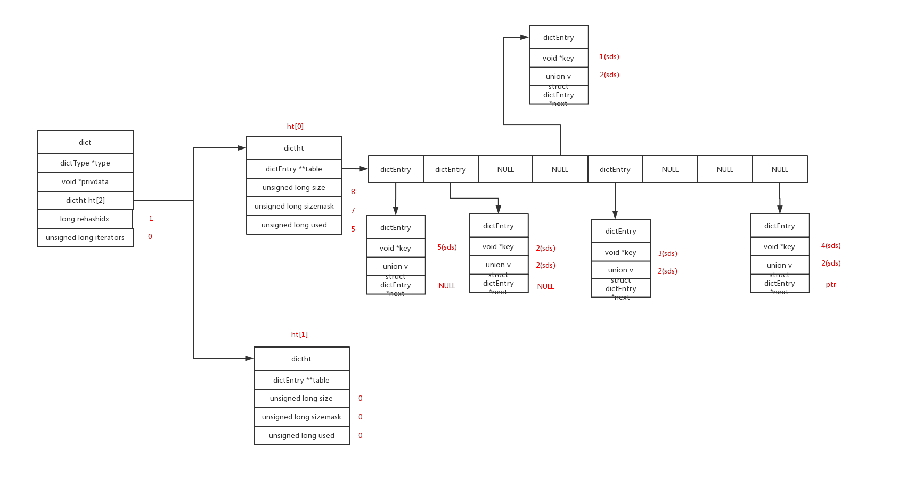](https://github.com/zpoint/Redis-Internals/blob/5.0/Object/hash/resize_done_reverse.png)
>
>```
>/* redis/src/dict.c */
>int dictRehash(dict *d, int n) {
>    /* 每次执行 HGET 命令时, n 为 1 */
>    int empty_visits = n*10; /* 最多只会处理这么多个哈希表上的空桶 */
>    if (!dictIsRehashing(d)) return 0;
>
>    while(n-- && d->ht[0].used != 0) {
>        /* rehash n 个桶 */
>        dictEntry *de, *nextde;
>        /* 注意, rehashidx 不能溢出 */
>        assert(d->ht[0].size > (unsigned long)d->rehashidx);
>        while(d->ht[0].table[d->rehashidx] == NULL) {
>            /* 这个桶是空的的话, 跳过它 */
>            d->rehashidx++;
>            if (--empty_visits == 0) return 1;
>        }
>        de = d->ht[0].table[d->rehashidx];
>        /* 把这个桶上的所有的元素都移动到新的哈希表上 */
>        while(de) {
>            uint64_t h;
>
>            nextde = de->next;
>            /* 计算一下在新的表上的哈希值 */
>            h = dictHashKey(d, de->key) & d->ht[1].sizemask;
>            de->next = d->ht[1].table[h];
>            d->ht[1].table[h] = de;
>            d->ht[0].used--;
>            d->ht[1].used++;
>            de = nextde;
>        }
>        d->ht[0].table[d->rehashidx] = NULL;
>        d->rehashidx++;
>    }
>
>    /* 检查是否 rehash 已经完成(是否整张表都迁移完成) */
>    if (d->ht[0].used == 0) {
>        zfree(d->ht[0].table);
>        d->ht[0] = d->ht[1];
>        _dictReset(&d->ht[1]);
>        d->rehashidx = -1;
>        return 0;
>    }
>
>    /* 本次处理完成, 但是还有待迁移的元素 */
>    return 1;
>}
>```
>
>### activerehashing
>
>如配置文件的注释所说
>
>> Active rehashing 会在每 100 毫秒的间隔中(CPU 时间)拿出额外的 1 毫秒来处理 redis 服务的主哈希表的 rehash 操作(用来存储最顶层 db 的键对值的那张表) redis 中的哈希表使用的是 lazy rehashing 策略(参考 dict.c), 在一张正在 rehash 的表中, 你越频繁的操作这张表, rehash 就会越快的在这张表上转移旧元素到新表中, 所以如果你的 redis 服务处于闲置状态的话, 可能你的主表的 rehash 永远也不会完成, 一直处于 rehash 的状态之中, 会占用额外的内存空间
>
>> 默认情况下在主表中每秒钟会处理 10 次持续 1 毫秒左右的 rehash, 并且在必要的时候释放空间 如果你无法忍受超过 2 毫秒的响应延时, 使用 "activerehashing no" 这个配置 如果你没有那么高的响应要求, 则用默认的 "activerehashing yes" 即可
>
>redis 服务主表使用哈希表结构存储你设置的所有键对值, 如我们上面所了解的, 哈希表并不会在达到某个阈值之后一次性的扩容完成, 而是在你搜索/更改这张表的时候渐进式的完成扩容, `activerehashing` 这个配置会在主循环中用到, 用来处理闲置的 redis 服务无法完成 rehash 的情况。
>
>```
>/* redis/src/server.c */
>/* Rehash */
>if (server.activerehashing) {
>    for (j = 0; j < dbs_per_call; j++) {
>        /* 每次调用这个函数的时候, 尝试使用 1 毫秒(CPU 时间) 来处理 rehah */
>        int work_done = incrementallyRehash(rehash_db);
>        if (work_done) {
>            /* 如果当前的 rehash_db 处理了 1 毫秒的 rehash, 跳出, 下次主循环(100ms后)再来处理
>            break;
>        } else {
>            /* 如果这个 rehash_db 不需要进行 rehash, 我们会尝试下一个 rehash_db */
>            rehash_db++;
>            rehash_db %= server.dbnum;
>        }
>    }
>}
>```