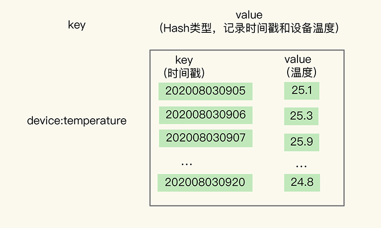
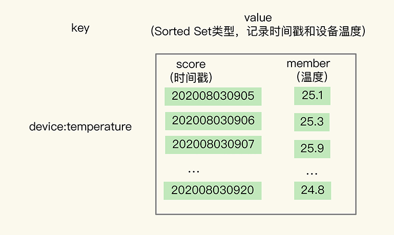
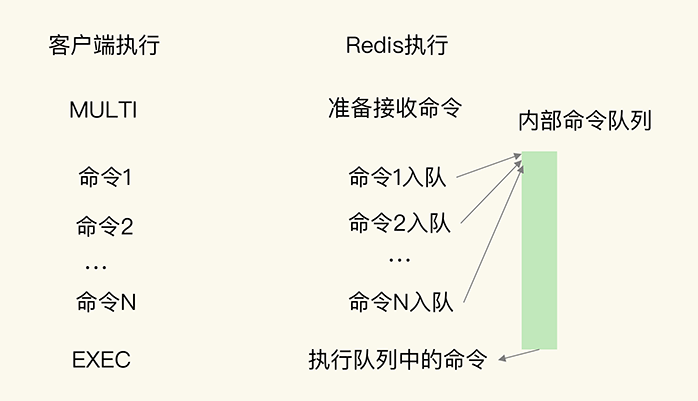

我们现在做互联网产品的时候，都有这么一个需求：记录用户在网站或者App上的点击行为数据，来分析用户行为。这里的数据一般包括用户ID、行为类型（例如浏览、登录、下单等）、行为发生的时间戳：

```
UserID, Type, TimeStamp
```

我之前做过的一个物联网项目的数据存取需求，和这个很相似。我们需要周期性地统计近万台设备的实时状态，包括设备ID、压力、温度、湿度，以及对应的时间戳：

```
DeviceID, Pressure, Temperature, Humidity, TimeStamp
```

这些与发生时间相关的一组数据，就是时间序列数据。**这些数据的特点是没有严格的关系模型，记录的信息可以表示成键和值的关系**（例如，一个设备ID对应一条记录），所以，并不需要专门用关系型数据库（例如MySQL）来保存。而Redis的键值数据模型，正好可以满足这里的数据存取需求。Redis基于自身数据结构以及扩展模块，提供了两种解决方案。

这节课，我就以物联网场景中统计设备状态指标值为例，和你聊聊不同解决方案的做法和优缺点。

俗话说，“知己知彼，百战百胜”，我们就先从时间序列数据的读写特点开始，看看到底应该采用什么样的数据类型来保存吧。

## 时间序列数据的读写特点

在实际应用中，时间序列数据通常是持续高并发写入的，例如，需要连续记录数万个设备的实时状态值。同时，时间序列数据的写入主要就是插入新数据，而不是更新一个已存在的数据，也就是说，一个时间序列数据被记录后通常就不会变了，因为它就代表了一个设备在某个时刻的状态值（例如，一个设备在某个时刻的温度测量值，一旦记录下来，这个值本身就不会再变了）。

所以，**这种数据的写入特点很简单，就是插入数据快，这就要求我们选择的数据类型，在进行数据插入时，复杂度要低，尽量不要阻塞**。看到这儿，你可能第一时间会想到用Redis的String、Hash类型来保存，因为它们的插入复杂度都是O(1)，是个不错的选择。但是，我在[第11讲](https://time.geekbang.org/column/article/279649)中说过，String类型在记录小数据时（例如刚才例子中的设备温度值），元数据的内存开销比较大，不太适合保存大量数据。

那我们再看看，时间序列数据的“读”操作有什么特点。

我们在查询时间序列数据时，既有对单条记录的查询（例如查询某个设备在某一个时刻的运行状态信息，对应的就是这个设备的一条记录），也有对某个时间范围内的数据的查询（例如每天早上8点到10点的所有设备的状态信息）。

除此之外，还有一些更复杂的查询，比如对某个时间范围内的数据做聚合计算。这里的聚合计算，就是对符合查询条件的所有数据做计算，包括计算均值、最大/最小值、求和等。例如，我们要计算某个时间段内的设备压力的最大值，来判断是否有故障发生。

那用一个词概括时间序列数据的“读”，就是查询模式多。

弄清楚了时间序列数据的读写特点，接下来我们就看看如何在Redis中保存这些数据。我们来分析下：针对时间序列数据的“写要快”，Redis的高性能写特性直接就可以满足了；而针对“查询模式多”，也就是要支持单点查询、范围查询和聚合计算，Redis提供了保存时间序列数据的两种方案，分别可以基于Hash和Sorted Set实现，以及基于RedisTimeSeries模块实现。

接下来，我们先学习下第一种方案。

## 基于Hash和Sorted Set保存时间序列数据

Hash和Sorted Set组合的方式有一个明显的好处：它们是Redis内在的数据类型，代码成熟和性能稳定。所以，基于这两个数据类型保存时间序列数据，系统稳定性是可以预期的。

不过，在前面学习的场景中，我们都是使用一个数据类型来存取数据，那么，**为什么保存时间序列数据，要同时使用这两种类型？这是我们要回答的第一个问题。**

关于Hash类型，我们都知道，它有一个特点是，可以实现对单键的快速查询。这就满足了时间序列数据的单键查询需求。我们可以把时间戳作为Hash集合的key，把记录的设备状态值作为Hash集合的value。

可以看下用Hash集合记录设备的温度值的示意图：



当我们想要查询某个时间点或者是多个时间点上的温度数据时，直接使用HGET命令或者HMGET命令，就可以分别获得Hash集合中的一个key和多个key的value值了。

举个例子。我们用HGET命令查询202008030905这个时刻的温度值，使用HMGET查询202008030905、202008030907、202008030908这三个时刻的温度值，如下所示：

```
HGET device:temperature 202008030905
"25.1"

HMGET device:temperature 202008030905 202008030907 202008030908
1) "25.1"
2) "25.9"
3) "24.9"
```

你看，用Hash类型来实现单键的查询很简单。但是，**Hash类型有个短板：它并不支持对数据进行范围查询。**

虽然时间序列数据是按时间递增顺序插入Hash集合中的，但Hash类型的底层结构是哈希表，并没有对数据进行有序索引。所以，如果要对Hash类型进行范围查询的话，就需要扫描Hash集合中的所有数据，再把这些数据取回到客户端进行排序，然后，才能在客户端得到所查询范围内的数据。显然，查询效率很低。

为了能同时支持按时间戳范围的查询，可以用Sorted Set来保存时间序列数据，因为它能够根据元素的权重分数来排序。我们可以把时间戳作为Sorted Set集合的元素分数，把时间点上记录的数据作为元素本身。

我还是以保存设备温度的时间序列数据为例，进行解释。下图显示了用Sorted Set集合保存的结果。



使用Sorted Set保存数据后，我们就可以使用ZRANGEBYSCORE命令，按照输入的最大时间戳和最小时间戳来查询这个时间范围内的温度值了。如下所示，我们来查询一下在2020年8月3日9点7分到9点10分间的所有温度值：

```
ZRANGEBYSCORE device:temperature 202008030907 202008030910
1) "25.9"
2) "24.9"
3) "25.3"
4) "25.2"
```

现在我们知道了，同时使用Hash和Sorted Set，可以满足单个时间点和一个时间范围内的数据查询需求了，但是我们又会面临一个新的问题，**也就是我们要解答的第二个问题：如何保证写入Hash和Sorted Set是一个原子性的操作呢？**

所谓“原子性的操作”，就是指我们执行多个写命令操作时（例如用HSET命令和ZADD命令分别把数据写入Hash和Sorted Set），这些命令操作要么全部完成，要么都不完成。

只有保证了写操作的原子性，才能保证同一个时间序列数据，在Hash和Sorted Set中，要么都保存了，要么都没保存。否则，就可能出现Hash集合中有时间序列数据，而Sorted Set中没有，那么，在进行范围查询时，就没有办法满足查询需求了。

那Redis是怎么保证原子性操作的呢？这里就涉及到了Redis用来实现简单的事务的MULTI和EXEC命令。当多个命令及其参数本身无误时，MULTI和EXEC命令可以保证执行这些命令时的原子性。关于Redis的事务支持和原子性保证的异常情况，我会在第30讲中向你介绍，这节课，我们只要了解一下MULTI和EXEC这两个命令的使用方法就行了。

- MULTI命令：表示一系列原子性操作的开始。收到这个命令后，Redis就知道，接下来再收到的命令需要放到一个内部队列中，后续一起执行，保证原子性。
- EXEC命令：表示一系列原子性操作的结束。一旦Redis收到了这个命令，就表示所有要保证原子性的命令操作都已经发送完成了。此时，Redis开始执行刚才放到内部队列中的所有命令操作。

你可以看下下面这张示意图，命令1到命令N是在MULTI命令后、EXEC命令前发送的，它们会被一起执行，保证原子性。



以保存设备状态信息的需求为例，我们执行下面的代码，把设备在2020年8月3日9时5分的温度，分别用HSET命令和ZADD命令写入Hash集合和Sorted Set集合。

```
127.0.0.1:6379> MULTI
OK

127.0.0.1:6379> HSET device:temperature 202008030911 26.8
QUEUED

127.0.0.1:6379> ZADD device:temperature 202008030911 26.8
QUEUED

127.0.0.1:6379> EXEC
1) (integer) 1
2) (integer) 1
```

可以看到，首先，Redis收到了客户端执行的MULTI命令。然后，客户端再执行HSET和ZADD命令后，Redis返回的结果为“QUEUED”，表示这两个命令暂时入队，先不执行；执行了EXEC命令后，HSET命令和ZADD命令才真正执行，并返回成功结果（结果值为1）。

到这里，我们就解决了时间序列数据的单点查询、范围查询问题，并使用MUTLI和EXEC命令保证了Redis能原子性地把数据保存到Hash和Sorted Set中。**接下来，我们需要继续解决第三个问题：如何对时间序列数据进行聚合计算？**

聚合计算一般被用来周期性地统计时间窗口内的数据汇总状态，在实时监控与预警等场景下会频繁执行。

因为Sorted Set只支持范围查询，无法直接进行聚合计算，所以，我们只能先把时间范围内的数据取回到客户端，然后在客户端自行完成聚合计算。这个方法虽然能完成聚合计算，但是会带来一定的潜在风险，也就是**大量数据在Redis实例和客户端间频繁传输，这会和其他操作命令竞争网络资源，导致其他操作变慢。**

在我们这个物联网项目中，就需要每3分钟统计一下各个设备的温度状态，一旦设备温度超出了设定的阈值，就要进行报警。这是一个典型的聚合计算场景，我们可以来看看这个过程中的数据体量。

假设我们需要每3分钟计算一次的所有设备各指标的最大值，每个设备每15秒记录一个指标值，1分钟就会记录4个值，3分钟就会有12个值。我们要统计的设备指标数量有33个，所以，单个设备每3分钟记录的指标数据有将近400个（33 * 12 = 396），而设备总数量有1万台，这样一来，每3分钟就有将近400万条（396 * 1万 = 396万）数据需要在客户端和Redis实例间进行传输。

为了避免客户端和Redis实例间频繁的大量数据传输，我们可以使用RedisTimeSeries来保存时间序列数据。

RedisTimeSeries支持直接在Redis实例上进行聚合计算。还是以刚才每3分钟算一次最大值为例。在Redis实例上直接聚合计算，那么，对于单个设备的一个指标值来说，每3分钟记录的12条数据可以聚合计算成一个值，单个设备每3分钟也就只有33个聚合值需要传输，1万台设备也只有33万条数据。数据量大约是在客户端做聚合计算的十分之一，很显然，可以减少大量数据传输对Redis实例网络的性能影响。

所以，如果我们只需要进行单个时间点查询或是对某个时间范围查询的话，适合使用Hash和Sorted Set的组合，它们都是Redis的内在数据结构，性能好，稳定性高。但是，如果我们需要进行大量的聚合计算，同时网络带宽条件不是太好时，Hash和Sorted Set的组合就不太适合了。此时，使用RedisTimeSeries就更加合适一些。

好了，接下来，我们就来具体学习下RedisTimeSeries。

## 基于RedisTimeSeries模块保存时间序列数据

RedisTimeSeries是Redis的一个扩展模块。它专门面向时间序列数据提供了数据类型和访问接口，并且支持在Redis实例上直接对数据进行按时间范围的聚合计算。

因为RedisTimeSeries不属于Redis的内建功能模块，在使用时，我们需要先把它的源码单独编译成动态链接库redistimeseries.so，再使用loadmodule命令进行加载，如下所示：

```
loadmodule redistimeseries.so
```

当用于时间序列数据存取时，RedisTimeSeries的操作主要有5个：

- 用TS.CREATE命令创建时间序列数据集合；
- 用TS.ADD命令插入数据；
- 用TS.GET命令读取最新数据；
- 用TS.MGET命令按标签过滤查询数据集合；
- 用TS.RANGE支持聚合计算的范围查询。

下面，我来介绍一下如何使用这5个操作。

**1.用TS.CREATE命令创建一个时间序列数据集合**

在TS.CREATE命令中，我们需要设置时间序列数据集合的key和数据的过期时间（以毫秒为单位）。此外，我们还可以为数据集合设置标签，来表示数据集合的属性。

例如，我们执行下面的命令，创建一个key为device:temperature、数据有效期为600s的时间序列数据集合。也就是说，这个集合中的数据创建了600s后，就会被自动删除。最后，我们给这个集合设置了一个标签属性{device_id:1}，表明这个数据集合中记录的是属于设备ID号为1的数据。

```
TS.CREATE device:temperature RETENTION 600000 LABELS device_id 1
OK
```

**2.用TS.ADD命令插入数据，用TS.GET命令读取最新数据**

我们可以用TS.ADD命令往时间序列集合中插入数据，包括时间戳和具体的数值，并使用TS.GET命令读取数据集合中的最新一条数据。

例如，我们执行下列TS.ADD命令时，就往device:temperature集合中插入了一条数据，记录的是设备在2020年8月3日9时5分的设备温度；再执行TS.GET命令时，就会把刚刚插入的最新数据读取出来。

```
TS.ADD device:temperature 1596416700 25.1
1596416700

TS.GET device:temperature 
25.1
```

**3.用TS.MGET命令按标签过滤查询数据集合**

在保存多个设备的时间序列数据时，我们通常会把不同设备的数据保存到不同集合中。此时，我们就可以使用TS.MGET命令，按照标签查询部分集合中的最新数据。在使用TS.CREATE创建数据集合时，我们可以给集合设置标签属性。当我们进行查询时，就可以在查询条件中对集合标签属性进行匹配，最后的查询结果里只返回匹配上的集合中的最新数据。

举个例子。假设我们一共用4个集合为4个设备保存时间序列数据，设备的ID号是1、2、3、4，我们在创建数据集合时，把device_id设置为每个集合的标签。此时，我们就可以使用下列TS.MGET命令，以及FILTER设置（这个配置项用来设置集合标签的过滤条件），查询device_id不等于2的所有其他设备的数据集合，并返回各自集合中的最新的一条数据。

```
TS.MGET FILTER device_id!=2 
1) 1) "device:temperature:1"
   2) (empty list or set)
   3) 1) (integer) 1596417000
      2) "25.3"
2) 1) "device:temperature:3"
   2) (empty list or set)
   3) 1) (integer) 1596417000
      2) "29.5"
3) 1) "device:temperature:4"
   2) (empty list or set)
   3) 1) (integer) 1596417000
      2) "30.1"
```

**4.用TS.RANGE支持需要聚合计算的范围查询**

最后，在对时间序列数据进行聚合计算时，我们可以使用TS.RANGE命令指定要查询的数据的时间范围，同时用AGGREGATION参数指定要执行的聚合计算类型。RedisTimeSeries支持的聚合计算类型很丰富，包括求均值（avg）、求最大/最小值（max/min），求和（sum）等。

例如，在执行下列命令时，我们就可以按照每180s的时间窗口，对2020年8月3日9时5分和2020年8月3日9时12分这段时间内的数据进行均值计算了。

```
TS.RANGE device:temperature 1596416700 1596417120 AGGREGATION avg 180000
1) 1) (integer) 1596416700
   2) "25.6"
2) 1) (integer) 1596416880
   2) "25.8"
3) 1) (integer) 1596417060
   2) "26.1"
```

与使用Hash和Sorted Set来保存时间序列数据相比，RedisTimeSeries是专门为时间序列数据访问设计的扩展模块，能支持在Redis实例上直接进行聚合计算，以及按标签属性过滤查询数据集合，当我们需要频繁进行聚合计算，以及从大量集合中筛选出特定设备或用户的数据集合时，RedisTimeSeries就可以发挥优势了。

## 小结

在这节课，我们一起学习了如何用Redis保存时间序列数据。时间序列数据的写入特点是要能快速写入，而查询的特点有三个：

- 点查询，根据一个时间戳，查询相应时间的数据；
- 范围查询，查询起始和截止时间戳范围内的数据；
- 聚合计算，针对起始和截止时间戳范围内的所有数据进行计算，例如求最大/最小值，求均值等。

关于快速写入的要求，Redis的高性能写特性足以应对了；而针对多样化的查询需求，Redis提供了两种方案。

第一种方案是，组合使用Redis内置的Hash和Sorted Set类型，把数据同时保存在Hash集合和Sorted Set集合中。这种方案既可以利用Hash类型实现对单键的快速查询，还能利用Sorted Set实现对范围查询的高效支持，一下子满足了时间序列数据的两大查询需求。

不过，第一种方案也有两个不足：一个是，在执行聚合计算时，我们需要把数据读取到客户端再进行聚合，当有大量数据要聚合时，数据传输开销大；另一个是，所有的数据会在两个数据类型中各保存一份，内存开销不小。不过，我们可以通过设置适当的数据过期时间，释放内存，减小内存压力。

我们学习的第二种实现方案是使用RedisTimeSeries模块。这是专门为存取时间序列数据而设计的扩展模块。和第一种方案相比，RedisTimeSeries能支持直接在Redis实例上进行多种数据聚合计算，避免了大量数据在实例和客户端间传输。不过，RedisTimeSeries的底层数据结构使用了链表，它的范围查询的复杂度是O(N)级别的，同时，它的TS.GET查询只能返回最新的数据，没有办法像第一种方案的Hash类型一样，可以返回任一时间点的数据。

所以，组合使用Hash和Sorted Set，或者使用RedisTimeSeries，在支持时间序列数据存取上各有优劣势。我给你的建议是：

- 如果你的部署环境中网络带宽高、Redis实例内存大，可以优先考虑第一种方案；
- 如果你的部署环境中网络、内存资源有限，而且数据量大，聚合计算频繁，需要按数据集合属性查询，可以优先考虑第二种方案。

## 每课一问

按照惯例，我给你提个小问题。

在这节课上，我提到，我们可以使用Sorted Set保存时间序列数据，把时间戳作为score，把实际的数据作为member，你觉得这样保存数据有没有潜在的风险？另外，如果你是Redis的开发维护者，你会把聚合计算也设计为Sorted Set的一个内在功能吗？

好了，这节课就到这里，如果你觉得有所收获，欢迎你把今天的内容分享给你的朋友或同事，我们下节课见。