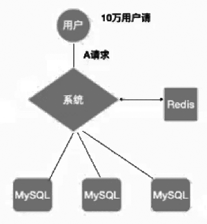
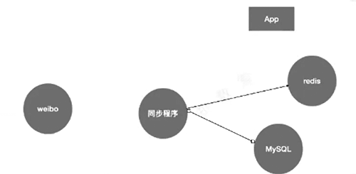
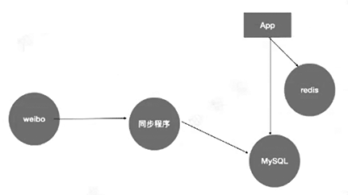
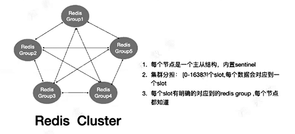
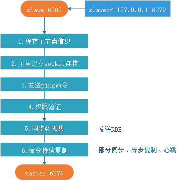
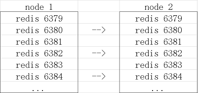

利用redis给MySQL加速

1. MySQL和Redis结合使用
2. 整体认识Redis高可用架构
3. Redis复制原理，cluster原理
4. 环境搭建

[TOC]

# MySQL和Redis结合

- Redis出现的原因
  - 性能
  - 并发
- Redis单进程为什么会快
  - epoll
  - kquue
  - 基于IO的多路复用

- Redis目前只能用到一个cpu core
- 将多个请求合并成一个key，直接去redis搜索value
- 低并发或数据量很大的场景下，redis加速效果不明显

## Redis比较常见的使用场景

- 缓存
- 排行榜
- 计数器，发放自增ID、限速器等
- 好友关系、点赞
- 简单的消息队列
- session服务器

## Redis支持的数据类型

> 所有的类型都有唯一key的约束

- string --> set/get --> KV -->计数器，v存放序列化后的object
- hash --> V是结合化对象，可以理解为必须有主键的一个row，存储：session，cookie做key
- list --> 类似于array队列，利用lrange，range实现一些分页操作
- set --> 无重复值se。去重，两个set进行交集、并集、差集运算
- 有序set，基于score，可以用于排行榜，top N类的操作
- pub/sub 发布、定于 /GEO/Bitmaps/HyperLoglog

## MySQL和Redis数据同步

- 应用来做
- 先写redis还是先写MySQL？——先写MySQL，再写Redis。
- 对脏读敏感的，不要使用redis

- 缓存和持久化一定要分开，不要一股脑的放一起。

> insert -> mysql
>
> update -> mysql -> delete redis (set redis)
>
> insert -> mysql -> insert redis

### 场景：

- redis命中率低，发现redis有大量insert，没多少读取

- 当用户访问数据时，再从MySQL加载数据到redis，以替代insert redis。
- 让用户的访问来触发缓存，而不是程序上直接insert redis

改进后

# Redis 高可用架构

哨兵可以放任何角色上，哨兵的资源消耗非常小。

计算key放到哪个slot： crc16(key) % slot -> N

# Redis 原理

- 复制架构原理

  - Redis持久化存储上分为RDB、AOF

    - RDB，全量写入，不支持增量

      > RDB是内存中压缩拷贝的，不支持增量，就是全量写入/因此写入开销非常非常昂贵。（fork一次内存，用了多少就再fork多少，再压缩写入文件。）一般生产会禁用自动写RDB（即：save '' '')

      - save '' '', save '10' '60'

      - bagsave

        > 10 60 ， 意思是写10个变更或到达60秒，做一次bgsave

    - AOF，相当于Redis的变更日志

      > AOF是append only file，可以理解为redis的变更日志，可以每天做一次重写。

      - bgrewriteaof

        > AOF中保存了redis的变更信息，当实例崩溃时通过AOF恢复实例数据。变更信息可能会非常巨大。当执行bgrewriteaof后，则记录当前数据状态到文件（此时文件就很小了），这样在重载时便可以快速加载数据状态。不过这会导致状态前的历史变更丢失。（相当于写完的文件就是将变更压缩成一个版本，丢弃历史版本记录，类似redo和dump的区别）
        >
        > 因此建议每天做一次AOF重写。
        >
        > 举个栗子：
        >
        > 一个业务从1增长到2000w，实例崩溃时会从日志恢复数据，由1增长回2000w。如果执行bgrewriteaof，那么就记录为：xxid-> 2000w。  这时如果重载数据，则直接载入为2000w。 速度很快，但是期间的历史状态就没了。

    - 配置

      - min-slaves-to-write 1
      - min-salves-max-lag 10

- 复制原理

  - 复制过程
  - 数据间的同步
  - 全量复制
  - 部分复制（psync）
  - 心跳
  - 异步复制

  redis本身是异步复制，没必要要求一定不能丢失数据

1. 从数据库向主数据库发送sync命令
2. 主数据库接收sync命令后，执行bgsave命令保存快照，创建一个RDB文件。在创建RDB文件期间的命令将保存在缓冲区中。
3. 当主数据库执行完bgsave时，会向从数据库发送RDB文件，而从数据库会接收并载入该文件
4. 主数据库将缓冲区的所有写命令发送给从服务器执行
5. 处理完以上后，之后主数据库每执行一个写命令，都会将被执行的写命令发送给从数据库

有多个从库情况下，如（2个机器跑10多个redis实例），重新初始化主从时（多个实例向一个实例发起请求slaveof），会生成多个RDB、消耗N倍内存吗？ 一般只会生成一份RDB，不至于那么智障。

这个两个机器要做主从结构，如果启动后直接change到主库，那么可能会拉胯网络，彼此不通——导致重新选举，重新slaveof——导致数据被清空。

- sentinel 原理

  1. sentinel集群通过配置文件发现master并监控master。通过向master发送info信息获得该服务器下面的所有从服务器。
  2. sentinel集群通过命令连接，每秒一次向被监视的主从服务器发送hello信息，该信息包括sentinel本身的ip、端口、id等内容，以此来向其他sentinel宣告自己的存在。
  3. sentinel集群通过订阅连接，接收其他sentinel发送的hello信息，以此来发现监视同一个主服务器的其他的sentinel；集群之间会互相创建命令连接用于通信，因为已经有主从服务器作为发送和接收hello信息的中介，sentinel之间不会创建订阅连接。
  4. sentinel集群使用ping命令来检测实例的状态，如果在指定额时间内（down-after-milliseconds）没有回复或返回错误的回复，那么该实例被判定为下线。
  5. 当failover准备切换被触发后，failover并不会马上进行，还需要sentinel中的大多数sentinel授权后才可以进行failover。即：进行failover的sentinel会去获得指定quorum个的sentinel的授权，成功后进入odown状态。如在5个sentinel中配置了2个quorum，等到2个sentinel认为master死掉，就执行failover。
  6. sentinel向宣威master的slave发送slaveof no one命令，选择slave的条件是sentinel首先会根据slaves的优先级来进行排序徐，优先级越小排名越靠前。如果优先级相同，则查看复制的下标，哪个从master接收的复制数据多，哪个就靠前。如果优先级和下标都一致，就选择进程id较小的。
  7. sentinel被授权后，它将会获得down掉的master的一份最新配置版本号（config-epoch），当failover执行结束以后，这个版本号将会被用于最新的配置，铜鼓广播形式通知其他sentinel，其他的sentinel则更新对应master的配置。

  一般推荐3-5个sentinel，要保持可以出现多数派

  - 以10秒一次的频率向被监视的master发送info命令，根据回复获取master当前信息。
  - 以1秒一次的频率向所有redis服务器、包含sentinel在内发送ping命令，通过回复判断服务器是否在线。
  - 以2秒一次的频率，通过向所有被监视的master、slave服务器发送当前sentinel，master信息的消息。

- cluster 原理
  - 数据分片
    1. Redis cluster中每个group可以理解为一个机遇sentinel的主从架构，所有节点都可以做sentinel。
    2. Redis cluster引入了数据分片，slot的概念，每一个key进行crc16运算后对16384取模，决定放入哪个slot中
    3. slot可以在不同的redis中移动，为添加收缩Redis做了很好的准备
  - Redis cluster通信
    1. 服务端口
    2. redis cluster间点间通信端口（gossip）

