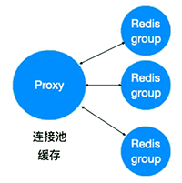
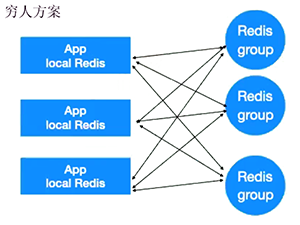

[TOC]

# 搞死Redis的几种方法

- Redis也是一个服务，不合理的使用会让Redis崩溃

  - 超级大Key

    - Redis是单线程、Step-by-step的无锁设计，完成一个再处理另一个。所以超级大key会阻塞。
    - 大key会造成网络压力，timeout
    - 建议kv控制在10KB内，hash,list,set,zset不超过5000，适当对values进行压缩

  - 不适合的操作

    - 复杂操作，一次全量处理set,list,hash
    - keys,flushall,flushdb（直接挂掉）

  - 复杂运算使用Lua的节点，要和其他存储节点拆分

  - 进行性能监控

    - show log, info commandstats,client list引起阻塞

    

- 注意事项

  - 不要过分相信Redis的list，把Redis作为重度的消息队列使用
    - Redis的消息队列比较菜，可以用kafka，或者MQ
  - 大量使用Redis的事务
    - Redis的事务是不安全的事务，不支持回滚。
  - 没有配置LRU，引发OOM
    - 根据需求，选择合适的LRU

## Redis 的LRU策略简介

- LRU策略一览

  1. allkeys-lru
  2. allkeys-random
  3. ***volatile-lru*** (default)
  4. volatile-random
  5. volatile-ttl
  6. noeviction

- 策略简介

  | LRU              | detail                                                       |
  | ---------------- | ------------------------------------------------------------ |
  | allkeys-lru      | 根据LRU算法删除键，不管数据有没有设置超时属性。直到腾出足够空间为止。 |
  | allkeys-random   | 随机删除<font color=red>所有键</font>，直到腾出足够空间为止。 |
  | **volatile-lru** | 默认策略。<br>超过最大内存后，在过期键中使用LRU算法进行key的剔除，保证不过期的数据不会被删除。 |
  | volatile-random  | 随机删除<font color=red>过期键</font>，直到腾出足够空间为止。 |
  | volatile-ttl     | 根据键值对象的ttl属性，删除最近将要过期的数据。如果没有，回退到noeviction策略。 |
  | noeviction       | 不会剔除任何数据，拒绝所有写入操作，病返回客户端错误信息：<br>`"(error) OOM command not allowed when used memory"`，此时Redis只响应读操作。 |


# Redis网卡被打满了如何处理

- 云上的处理办法

  在Redis groups前加Proxy，做连接池缓存角色。

  如果Proxy被打满，则继续增加硬件、Proxy



- 廉价处理办法

  增加本地缓存，先从本地缓存，再到Redis groups，以缓解对Redis group的压力，从而降低网卡占用




- 无效请求（请求的key不存在），设计不当被攻击时可能打挂DB
  - local Redis(miss) --> Redis(miss) --> DB(miss)
  - 防守方法
    - DB中请求到不存在的key时，在Redis也缓存该key 15秒，i.e. ： k1:404


# 如何查找Redis中的大key

```
redis-cli -p 6379 --bigkeys
```

[解析RDB，报告前100个大key](https://github.com/erpeng/godis-cli-bigkey)


# Redis中的Cache和存储混合使用会有什么问题

- 不要在主库上开任何持久化的东西（rdb快照、aof日志，bgsave操作）
- 如果数据比较重要，某个slave开启AOF备份数据，策略设置为每秒同步一次
- 为了主从复制的速度和连接的稳定性，master和slave最好在同一个局域网内
- 尽量避免在压力很大的主库上增加从库


- 缓存和存储共同存在于一个Redis时，不方便管理
  - 缓存可以配置LRU
  - 存储不能开LRU

# Redis监控

- info
- cluster info

## info

> https://redis.io/commands/info

```
 INFO [section]

Available since 1.0.0.

The INFO command returns information and statistics about the server in a format that is simple to parse by computers and easy to read by humans.

The optional parameter can be used to select a specific section of information:

    server: General information about the Redis server
    clients: Client connections section
    memory: Memory consumption related information
    persistence: RDB and AOF related information
    stats: General statistics
    replication: Master/replica replication information
    cpu: CPU consumption statistics
    commandstats: Redis command statistics
    cluster: Redis Cluster section
    modules: Modules section
    keyspace: Database related statistics
    modules: Module related sections

It can also take the following values:

    all: Return all sections (excluding module generated ones)
    default: Return only the default set of sections
    everything: Includes all and modules

When no parameter is provided, the default option is assumed.                              
```

> ## Notes
>
> Please note depending on the version of Redis some of the fields have been              added or removed. A robust client application should therefore parse the              result of this command by skipping unknown properties, and gracefully handle              missing fields.
>
> Here is the description of fields for Redis >= 2.4.
>
> Here is the meaning of all fields in the **server** section:
>
> -   `redis_version`: Version of the Redis server
> -   `redis_git_sha1`:  Git SHA1
> -   `redis_git_dirty`: Git dirty flag
> -   `redis_build_id`: The build id
> -   `redis_mode`: The server's mode ("standalone", "sentinel" or "cluster")
> -   `os`: Operating system hosting the Redis server
> -   `arch_bits`: Architecture (32 or 64 bits)
> -   `multiplexing_api`: Event loop mechanism used by Redis
> -   `atomicvar_api`: Atomicvar API used by Redis
> -   `gcc_version`: Version of the GCC compiler used to compile the Redis server
> -   `process_id`: PID of the server process
> -   `run_id`: Random value identifying the Redis server (to be used by Sentinel               and Cluster)
> -   `tcp_port`: TCP/IP listen port
> -   `uptime_in_seconds`: Number of seconds since Redis server start
> -   `uptime_in_days`: Same value expressed in days
> -   `hz`: The server's current frequency setting
> -   `configured_hz`: The server's configured frequency setting
> -   `lru_clock`: Clock incrementing every minute, for LRU management
> -   `executable`: The path to the server's executable
> -   `config_file`: The path to the config file
>
> Here is the meaning of all fields in the **clients** section:
>
> -   `connected_clients`: Number of client connections (excluding connections               from replicas)
> -   `client_longest_output_list`: Longest output list among current client               connections
> -   `client_biggest_input_buf`: Biggest input buffer among current client               connections
> -   `blocked_clients`: Number of clients pending on a blocking call ([BLPOP](https://redis.io/commands/blpop),               [BRPOP](https://redis.io/commands/brpop), [BRPOPLPUSH](https://redis.io/commands/brpoplpush), [BLMOVE](https://redis.io/commands/blmove), [BZPOPMIN](https://redis.io/commands/bzpopmin), [BZPOPMAX](https://redis.io/commands/bzpopmax))
> -   `tracking_clients`: Number of clients being tracked ([CLIENT TRACKING](https://redis.io/commands/client-tracking))
> -   `clients_in_timeout_table`: Number of clients in the clients timeout table
> -    `io_threads_active`: Flag indicating if I/O threads are active
>
> Here is the meaning of all fields in the **memory** section:
>
> -   `used_memory`: Total number of bytes allocated by Redis using its               allocator (either standard **libc**, **jemalloc**, or an alternative               allocator such as [**tcmalloc**](http://code.google.com/p/google-perftools/))
> -   `used_memory_human`: Human readable representation of previous value
> -   `used_memory_rss`: Number of bytes that Redis allocated as seen by the               operating system (a.k.a resident set size). This is the number reported by               tools such as `top(1)` and `ps(1)`
> -   `used_memory_rss_human`: Human readable representation of previous value
> -   `used_memory_peak`: Peak memory consumed by Redis (in bytes)
> -   `used_memory_peak_human`: Human readable representation of previous value
> -   `used_memory_peak_perc`: The percentage of `used_memory_peak` out of               `used_memory`
> -   `used_memory_overhead`: The sum in bytes of all overheads that the server               allocated for managing its internal data structures
> -   `used_memory_startup`: Initial amount of memory consumed by Redis at startup               in bytes
> -   `used_memory_dataset`: The size in bytes of the dataset               (`used_memory_overhead` subtracted from `used_memory`)
> -   `used_memory_dataset_perc`: The percentage of `used_memory_dataset` out of               the net memory usage (`used_memory` minus `used_memory_startup`)
> -   `total_system_memory`: The total amount of memory that the Redis host has
> -   `total_system_memory_human`: Human readable representation of previous value
> -   `used_memory_lua`: Number of bytes used by the Lua engine
> -   `used_memory_lua_human`: Human readable representation of previous value
> -   `used_memory_scripts`: Number of bytes used by cached Lua scripts
> -   `used_memory_scripts_human`: Human readable representation of previous value
> -   `maxmemory`: The value of the `maxmemory` configuration directive
> -   `maxmemory_human`: Human readable representation of previous value
> -   `maxmemory_policy`: The value of the `maxmemory-policy` configuration               directive
> -   `mem_fragmentation_ratio`: Ratio between `used_memory_rss` and `used_memory`
> -   `mem_allocator`: Memory allocator, chosen at compile time
> -   `active_defrag_running`: Flag indicating if active defragmentation is active
> -   `lazyfree_pending_objects`: The number of objects waiting to be freed (as a               result of calling [UNLINK](https://redis.io/commands/unlink), or [FLUSHDB](https://redis.io/commands/flushdb) and [FLUSHALL](https://redis.io/commands/flushall) with the **ASYNC**               option)
>
> Ideally, the `used_memory_rss` value should be only slightly higher than              `used_memory`.              When rss >> used, a large difference means there is memory fragmentation              (internal or external), which can be evaluated by checking              `mem_fragmentation_ratio`.              When used >> rss, it means part of Redis memory has been swapped off by the              operating system: expect some significant latencies.
>
> Because Redis does not have control over how its allocations are mapped to              memory pages, high `used_memory_rss` is often the result of a spike in memory              usage.
>
> When Redis frees memory, the memory is given back to the allocator, and the              allocator may or may not give the memory back to the system. There may be              a discrepancy between the `used_memory` value and memory consumption as              reported by the operating system. It may be due to the fact memory has been              used and released by Redis, but not given back to the system. The              `used_memory_peak` value is generally useful to check this point.
>
> Additional introspective information about the server's memory can be obtained              by referring to the [MEMORY STATS](https://redis.io/commands/memory-stats) command and the [MEMORY DOCTOR](https://redis.io/commands/memory-doctor).
>
> Here is the meaning of all fields in the **persistence** section:
>
> -   `loading`: Flag indicating if the load of a dump file is on-going
> -   `rdb_changes_since_last_save`: Number of changes since the last dump
> -   `rdb_bgsave_in_progress`: Flag indicating a RDB save is on-going
> -   `rdb_last_save_time`: Epoch-based timestamp of last successful RDB save
> -   `rdb_last_bgsave_status`: Status of the last RDB save operation
> -   `rdb_last_bgsave_time_sec`: Duration of the last RDB save operation in               seconds
> -   `rdb_current_bgsave_time_sec`: Duration of the on-going RDB save operation               if any
> -   `rdb_last_cow_size`: The size in bytes of copy-on-write allocations during               the last RDB save operation
> -   `aof_enabled`: Flag indicating AOF logging is activated
> -   `aof_rewrite_in_progress`: Flag indicating a AOF rewrite operation is               on-going
> -   `aof_rewrite_scheduled`: Flag indicating an AOF rewrite operation               will be scheduled once the on-going RDB save is complete.
> -   `aof_last_rewrite_time_sec`: Duration of the last AOF rewrite operation in               seconds
> -   `aof_current_rewrite_time_sec`: Duration of the on-going AOF rewrite               operation if any
> -   `aof_last_bgrewrite_status`: Status of the last AOF rewrite operation
> -   `aof_last_write_status`: Status of the last write operation to the AOF
> -   `aof_last_cow_size`: The size in bytes of copy-on-write allocations during               the last AOF rewrite operation
> -   `module_fork_in_progress`: Flag indicating a module fork is on-going
> -   `module_fork_last_cow_size`: The size in bytes of copy-on-write allocations               during the last module fork operation
>
> `rdb_changes_since_last_save` refers to the number of operations that produced              some kind of changes in the dataset since the last time either [SAVE](https://redis.io/commands/save) or              [BGSAVE](https://redis.io/commands/bgsave) was called.
>
> If AOF is activated, these additional fields will be added:
>
> -   `aof_current_size`: AOF current file size
> -   `aof_base_size`: AOF file size on latest startup or rewrite
> -   `aof_pending_rewrite`: Flag indicating an AOF rewrite operation               will be scheduled once the on-going RDB save is complete.
> -   `aof_buffer_length`: Size of the AOF buffer
> -   `aof_rewrite_buffer_length`: Size of the AOF rewrite buffer
> -   `aof_pending_bio_fsync`: Number of fsync pending jobs in background I/O               queue
> -   `aof_delayed_fsync`: Delayed fsync counter
>
> If a load operation is on-going, these additional fields will be added:
>
> -   `loading_start_time`: Epoch-based timestamp of the start of the load               operation
> -   `loading_total_bytes`: Total file size
> -   `loading_loaded_bytes`: Number of bytes already loaded
> -   `loading_loaded_perc`: Same value expressed as a percentage
> -   `loading_eta_seconds`: ETA in seconds for the load to be complete
>
> Here is the meaning of all fields in the **stats** section:
>
> -   `total_connections_received`: Total number of connections accepted by the               server
> -   `total_commands_processed`: Total number of commands processed by the server
> -   `instantaneous_ops_per_sec`: Number of commands processed per second
> -   `total_net_input_bytes`: The total number of bytes read from the network
> -   `total_net_output_bytes`: The total number of bytes written to the network
> -   `instantaneous_input_kbps`: The network's read rate per second in KB/sec
> -   `instantaneous_output_kbps`: The network's write rate per second in KB/sec
> -   `rejected_connections`: Number of connections rejected because of               `maxclients` limit
> -   `sync_full`: The number of full resyncs with replicas
> -   `sync_partial_ok`: The number of accepted partial resync requests
> -   `sync_partial_err`: The number of denied partial resync requests
> -   `expired_keys`: Total number of key expiration events
> -   `expired_stale_perc`: The percentage of keys probably expired
> -   `expired_time_cap_reached_count`: The count of times that active expiry cycles have stopped early
> -   `expire_cycle_cpu_milliseconds`: The cumulative amount of time spend on active expiry cycles
> -   `evicted_keys`: Number of evicted keys due to `maxmemory` limit
> -   `keyspace_hits`: Number of successful lookup of keys in the main dictionary
> -   `keyspace_misses`: Number of failed lookup of keys in the main dictionary
> -   `pubsub_channels`: Global number of pub/sub channels with client               subscriptions
> -   `pubsub_patterns`: Global number of pub/sub pattern with client               subscriptions
> -   `latest_fork_usec`: Duration of the latest fork operation in microseconds
> -   `migrate_cached_sockets`: The number of sockets open for [MIGRATE](https://redis.io/commands/migrate) purposes
> -   `slave_expires_tracked_keys`: The number of keys tracked for expiry purposes               (applicable only to writable replicas)
> -   `active_defrag_hits`: Number of value reallocations performed by active the               defragmentation process
> -   `active_defrag_misses`: Number of aborted value reallocations started by the               active defragmentation process
> -   `active_defrag_key_hits`: Number of keys that were actively defragmented
> -   `active_defrag_key_misses`: Number of keys that were skipped by the active               defragmentation process
> -   `tracking_total_keys`: Number of keys being tracked by the server
> -   `tracking_total_items`: Number of items, that is the sum of clients number for               each key, that are being tracked
> -   `tracking_total_prefixes`: Number of tracked prefixes in server's prefix table              (only applicable for broadcast mode)
> -   `unexpected_error_replies`: Number of unexpected error replies, that are types              of errors from an AOF load or replication
> -    `total_reads_processed`: Total number of read events processed
> -    `total_writes_processed`: Total number of write events processed
> -    `io_threaded_reads_processed`: Number of read events processed by the main and I/O threads
> -    `io_threaded_writes_processed`: Number of write events processed by the main and I/O threads
>
> Here is the meaning of all fields in the **replication** section:
>
> -   `role`: Value is "master" if the instance is replica of no one, or "slave" if the instance is a replica of some master instance.               Note that a replica can be master of another replica (chained replication).
> -   `master_replid`: The replication ID of the Redis server.
> -   `master_replid2`: The secondary replication ID, used for PSYNC after a failover.
> -   `master_repl_offset`: The server's current replication offset
> -   `second_repl_offset`: The offset up to which replication IDs are accepted
> -   `repl_backlog_active`: Flag indicating replication backlog is active
> -   `repl_backlog_size`: Total size in bytes of the replication backlog buffer
> -   `repl_backlog_first_byte_offset`: The master offset of the replication               backlog buffer
> -   `repl_backlog_histlen`: Size in bytes of the data in the replication backlog               buffer
>
> If the instance is a replica, these additional fields are provided:
>
> -   `master_host`: Host or IP address of the master
> -   `master_port`: Master listening TCP port
> -   `master_link_status`: Status of the link (up/down)
> -   `master_last_io_seconds_ago`: Number of seconds since the last interaction               with master
> -   `master_sync_in_progress`: Indicate the master is syncing to the replica
> -   `slave_repl_offset`: The replication offset of the replica instance
> -   `slave_priority`: The priority of the instance as a candidate for failover
> -   `slave_read_only`: Flag indicating if the replica is read-only
>
> If a SYNC operation is on-going, these additional fields are provided:
>
> -   `master_sync_left_bytes`: Number of bytes left before syncing is complete
> -   `master_sync_last_io_seconds_ago`: Number of seconds since last transfer I/O               during a SYNC operation
>
> If the link between master and replica is down, an additional field is provided:
>
> -   `master_link_down_since_seconds`: Number of seconds since the link is down
>
> The following field is always provided:
>
> -   `connected_slaves`: Number of connected replicas
>
> If the server is configured with the `min-slaves-to-write` (or starting with Redis 5 with the `min-replicas-to-write`) directive, an additional field is provided:
>
> -   `min_slaves_good_slaves`: Number of replicas currently considered good
>
> For each replica, the following line is added:
>
> -   `slaveXXX`: id, IP address, port, state, offset, lag
>
> Here is the meaning of all fields in the **cpu** section:
>
> -   `used_cpu_sys`: System CPU consumed by the Redis server
> -   `used_cpu_user`:User CPU consumed by the Redis server
> -   `used_cpu_sys_children`: System CPU consumed by the background processes
> -   `used_cpu_user_children`: User CPU consumed by the background processes
>
> The **commandstats** section provides statistics based on the command type,              including the number of calls, the total CPU time consumed by these commands,              and the average CPU consumed per command execution.
>
> For each command type, the following line is added:
>
> -   `cmdstat_XXX`: `calls=XXX,usec=XXX,usec_per_call=XXX`
>
> The **cluster** section currently only contains a unique field:
>
> -   `cluster_enabled`: Indicate Redis cluster is enabled
>
> The **modules** section contains  additional information about loaded modules if the modules provide it.  The field part of properties lines in this section is always prefixed  with the module's name.
>
> The **keyspace** section provides statistics on the main dictionary of each              database.              The statistics are the number of keys, and the number of keys with an expiration.
>
> For each database, the following line is added:
>
> -   `dbXXX`: `keys=XXX,expires=XXX`
>
> **A note about the word slave used in this man page**: Starting with Redis 5, if not for backward compatibility, the Redis  project no longer uses the word slave. Unfortunately in this command the word slave is part of the protocol, so we'll be able to remove such  occurrences only when this API will be naturally deprecated.
>
> **Modules generated sections**: Starting with Redis 6, modules can inject their info into the [INFO](https://redis.io/commands/info) command, these are excluded by default even when the `all` argument is provided (it will include a list of loaded modules but not  their generated info fields). To get these you must use either the `modules` argument or `everything`.,


## cluster-info

> https://redis.io/commands/cluster-info

> #             CLUSTER INFO          
>
> **Available since 3.0.0.**
>
> **Time complexity:** O(1)
>
> [CLUSTER INFO](https://redis.io/commands/cluster-info) provides [INFO](https://redis.io/commands/info) style information about Redis Cluster              vital parameters. The following is a sample output, followed by the              description of each field reported.
>
> ```
> cluster_state:ok
> cluster_slots_assigned:16384
> cluster_slots_ok:16384
> cluster_slots_pfail:0
> cluster_slots_fail:0
> cluster_known_nodes:6
> cluster_size:3
> cluster_current_epoch:6
> cluster_my_epoch:2
> cluster_stats_messages_sent:1483972
> cluster_stats_messages_received:1483968
> ```
>
> - `cluster_state`: State is `ok` if the node is able to receive queries. `fail` if there is at least one hash slot which is unbound (no node  associated), in error state (node serving it is flagged with FAIL flag), or if the majority of masters can't be reached by this node.
> - `cluster_slots_assigned`: Number of slots  which are associated to some node (not unbound). This number should be  16384 for the node to work properly, which means that each hash slot  should be mapped to a node.
> - `cluster_slots_ok`: Number of hash slots mapping to a node not in `FAIL` or `PFAIL` state.
> - `cluster_slots_pfail`: Number of hash slots mapping to a node in `PFAIL` state. Note that those hash slots still work correctly, as long as the `PFAIL` state is not promoted to `FAIL` by the failure detection algorithm. `PFAIL` only means that we are currently not able to talk with the node, but may be just a transient error.
> - `cluster_slots_fail`: Number of hash slots mapping to a node in `FAIL` state. If this number is not zero the node is not able to serve queries unless `cluster-require-full-coverage` is set to `no` in the configuration.
> - `cluster_known_nodes`: The total number of known nodes in the cluster, including nodes in `HANDSHAKE` state that may not currently be proper members of the cluster.
> - `cluster_size`: The number of master nodes serving at least one hash slot in the cluster.
> - `cluster_current_epoch`: The local `Current Epoch` variable. This is used in order to create unique increasing version numbers during fail overs.
> - `cluster_my_epoch`: The `Config Epoch` of the node we are talking with. This is the current configuration version assigned to this node.
> - `cluster_stats_messages_sent`: Number of messages sent via the cluster node-to-node binary bus.
> - `cluster_stats_messages_received`: Number of messages received via the cluster node-to-node binary bus.
>
> More information about the Current Epoch and Config Epoch variables are available in the Redis Cluster specification document.
>
> 
>
> ## Return value
>
> [Bulk string reply](https://redis.io/topics/protocol#bulk-string-reply): A map between named fields and values in the form of `<field>:<value>` lines separated by newlines composed by the two bytes `CRLF`.


# 常见工具推荐

## 腾讯云 redis-port

> https://cloud.tencent.com/document/product/239/33786

- redis-sync:	支持在Redis实例之间进行数据迁移
- redis-restore: 支持将Redis的备份文件（RDB）导入到指定Redis实例
- redis-dump: 支持将Redis的数据备份为RDB格式文件
- redis-decode: 支持将Redis备份文件（RDB）解析为可读的文件


## 阿里 Redis-shake

> https://github.com/alibaba/RedisShake
>
> Redis-shake是一个用于在两个redis之间同步数据的工具，满足用户非常灵活的同步、迁移需求。


## B站 overlord

> https://github.com/bilibili/overlord
>
> Overlord是哔哩哔哩基于Go语言编写的memcache和redis&cluster的代理及集群管理功能，致力于提供自动化高可用的缓存服务解决方案。Overlord已被哔哩哔哩用于生产环境。

- 主要包括以下组件:
  1. proxy：轻量高可用的缓存代理模块，支持memcache和redis的代理，相当于twemproxy，不同在于支持redis-cluster及能将自己伪装为cluster模式。
  2. platform：包含apiserver、mesos framework&executor、集群节点任务管理job等。
  3. GUI：web管理界面，通过dashboard可视化方便用于集群管理，包括创建删除、扩缩容、加减节点等。
  4. anzi：redis-cluster的数据同步工具，可服务化与apiserver进行配合工作。
  5. enri：redis-cluster的集群管理工具，可灵活的创建集群、迁移slot等。