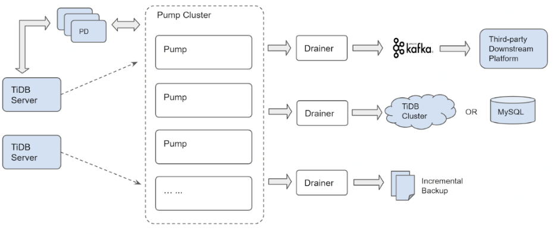
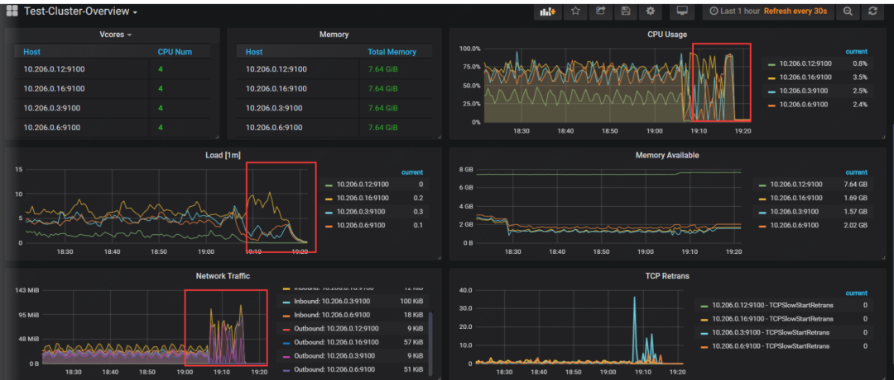
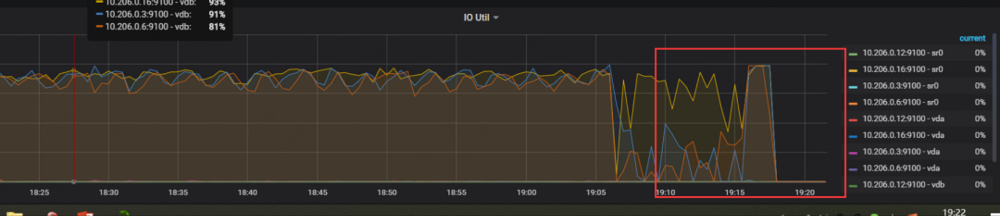

## TiDB备份恢复方式你知多少？ 

**背景**

学习一款数据库，要学会备份和恢复。备份是一个严谨的工作，作为一个dba，掌握数据库备份、恢复的各种手段。

下面让我们一起来看看TiDB的备份恢复有那些手段吧。

**基于MVCC的恢复方式**

相关原理已经在上一篇文章写过了，这里就不在做过多的描述了。

[**TiDB用什么保证备份的一致性？

** ](http://mp.weixin.qq.com/s?__biz=MzI1NjkzNDU4OQ==&mid=2247485636&idx=1&sn=fdc0cf69c4d84159ed2400214d7c4a4d&chksm=ea1e5f16dd69d6002ec401c122019bbb199794bea1e9a2edbc6e903279e3b39f6bad7b2a01e9&scene=21#wechat_redirect) 

简单的回顾一下，TiDB的TiKV里面的MVCC的格式是基于时间戳的。

(key-versionT（SO全局唯一递增时间戳)-->vlues）

会有定时GC来清理过期的版本(数据)。

下面的工具都是基于MVCC的方式，假设数据以及被GC清理掉了，那么数据就不能恢复过来。

**第一款工具 snapshot**

TiDB自带工具，可以针对当前会话读到指定的历史版本。

UPDATE mysql.tidb SET VARIABLE_VALUE = '80h' WHERE VARIABLE_NAME = 'tikv_gc_life_time';

\#更改GC时间

sql="SET SESSION tidb_snapshot = '415599012634951683'"。

\#跳转GC时间

\#微信公众号只能传3个视频，我把不能传的视频发百度云盘了

链接：https://pan.baidu.com/s/1QDmFk-9-N-gcNMJr5ZqXzQ

提取码：anxp

工具说明：只能恢复dml，不能恢复ddl。

 

**第二款工具 Recover**TiDB自带工具，可以针对drop  table 语句进行恢复。

drop table t2;#删除表

recover table t2; #恢复表

\#微信公众号只能传3个视频，我把不能传的视频发百度云盘了

链接：https://pan.baidu.com/s/1QDmFk-9-N-gcNMJr5ZqXzQ

提取码：anxp

工具限制：只能恢复drop table的操作，不能恢复truncate table，delete操作。未来可能会被 Flashback取代。

**第三款工具 Flashback**

TiDB自带工具，可以针对truncate操作。

工具限制：只能恢复truncate，drop等ddl的操作，没有办法恢复dml操作。**工具总结：**

1. 如果使用上述三种工具 要保证误操作的范围在GC清理之前。如果数据以及被GC清理了，则无法使用。
2. 目前推荐大家要了解掌握上述三种工具的基础的操作，避免在真正的误操作发生的时候，能快速恢复。
             
              

**基于文件的恢复方式**所谓基于文件的恢复方式，指备份的结果集存储在文件中，例如全备份，增量备份等。
 第一款工具mydumper/l**oader**TiDB官方推荐的备份工具**mydumper**，经过官方的修改和优化。在备份的时候，去除了FTWRL锁等待，而且支持并行备份，大幅提升了备份效率。

./bin/mydumper -h 127.0.0.1 -u root -P 4000 #执行备份

./bin/loader -d 备份路径 -h 127.0.0.1 -u root -P 4000 #恢复备份

\#微信公众号只能传3个视频，我把不能传的视频发百度云盘了

链接：https://pan.baidu.com/s/1QDmFk-9-N-gcNMJr5ZqXzQ

提取码：anxp

如果大家嫌弃导入慢，可以用TiDB官方推荐的生态工具**TiDB Lightning** 。能给提升TiDB的导入效率。

 **第二款工具TiDB binlog**

TiDB binlog，可以用于增量恢复TiDB集群。还可以适用于 TiDB同步下游TiDB集群、MySQL、Kafka。TiDB binlog分为2个组件Pump和Drainer 两个组件，先给大家介绍一下。Pump组件：

1. 用于实时记录TiDB产生的Binlog。
2. 将binlog按照时间提交时间进行排序。
3. 在提个给Drainer组件进行消费。

Drainer组件：

1. 收集各个Pump中收集的Binlog进行归并。
2. 将Binlog转行成SQL或者指定格式的数据。

\#感觉好像MySQL的io thread和sql thread。

增量恢复的方法我已经传到视频中了，大家可以看看。

 第三款工具BR

TiDB最近提供的一款分布式备份恢复工具BR，可以针对TiDB集群进行备份和恢复。

使用限制：

1. 只支持TiDBv3.1及以上版本
2. 目前需要nfs作为共享磁盘
              

备份原理：

1. 从pd中获取当前的TSO作为备份快照的时间点。
2. 当前集群的TiKV节点信息。

下面的br在执行的日志。也可以大概的看出相关的内容。

 

[2020/04/04 17:16:37.610 +08:00] [INFO] [log-file=/tmp/br.log.2020-04-04T17:16:37+08:00] [pd="[10.206.0.3:2379]"] [storage=local:///export/backup] [timeago=0s]

\#说明备份日志输出位置，pd节点，备份结果集

[2020/04/04 17:16:37.612 +08:00] [INFO] [base_client.go:226] ["[pd] update member urls"] [old-urls="[http://10.206.0.3:2379]"] [new-urls="[http://10.206.0.16:2379,http://10.206.0.3:2379,http://10.206.0.6:2379]"]

\#获取整个pd集群

[2020/04/04 17:16:37.622 +08:00] [INFO] [ddl.go:321] ["[ddl] start DDL"] [ID=b823eca8-e3e5-4969-a67f-5ff3b6210d1d] [runWorker=false]

[2020/04/04 17:16:37.647 +08:00] [INFO] [domain.go:144] ["full load InfoSchema success"] [usedSchemaVersion=0] [neededSchemaVersion=87] ["start time"=5.263313ms]

[2020/04/04 17:16:37.648 +08:00] [INFO] [domain.go:368] ["full load and reset schema validator"]

\#获取对应的表结构

[2020/04/04 17:16:37.650 +08:00] [INFO] [client.go:112] ["backup encode timestamp"] [BackupTS=415758233800278018]

\#获取备份的时间点tso

[2020/04/04 17:16:37.657 +08:00] [INFO] [client.go:222] ["change table AutoIncID"] [db=tian] [table=t1] [AutoIncID=2000001]

\#开始执行db为tian,table为t1的备份

此时根据备份子命令，会有两种备份逻辑：

- 全量备份：BR 遍历全部库表，并且根据每一张表构建需要备份的 KV Range
- 单表备份：BR 根据该表构建需要备份的 KV Range

最后，BR 将需要备份的 KV Range 收集后，构造完整的备份请求分发给集群内的 TiKV 节点。

https://pingcap.com/docs-cn/dev/reference/tools/br/br/

 这段话来自官方文档，我简单的描述，大家会更好的理解。

1. 每个Region都有Region Leader，每个Region Leader都分布在不同的TiKV上。
2. BR     首先知道备份哪些KV Range，然后把备份的KV Range收集后。构建一个完整的备份请求，下发给所有的TiKV节点。
3. TiKV收到这些备份请求，开始执行备份命令。

备份文件类型  sst文件：存储TiKV备份下来的数据信息。
   backupmeta文件：存储本次备份的元信息。
 实际操作
 实验环境：腾讯云
 机器配置：4C8G
 数据大小：57G
 备份耗时：大于9分钟小于10分钟TIKV数量：3个
 备份大小：50G（官方好像没做压缩啊，期待GR版本在此处能够完善改进）[2020/04/04 19:17:30.808 +08:00] [INFO] ["Full backup Success summary: total backup ranges: 15,total success: 15, total failed: 0, total take(s): 544.32, total kv: 285323076, total size(MB): 58774.74, avg speed(MB/s): 107.98"]["backup checksum"=1m51.113016071s]["backup fast checksum"=59.215757ms]["backup total regions"=699]备份时性能影响：

br备份影响相对较小，因为备份指令都下发到不同的TiKV节点，TiKV会承担备份压力。

**总结
 相信大家看了这么多内容，大家应该会TiDB备份恢复方式有了一定的了解。**可以对集群设置N个小时的GC超时时间：没超过这N个小时的误操作，可以通过基于MVCC的方式进行恢复。可以根据不同的语句来，选择不同的恢复方式。如果超过了N个小时，可以选择binlog的方式进行增量恢复。mydumper和br工具，我个人感觉更适合

1. 灾难式恢复（整个集群都挂了，例如所有磁盘坏了，机柜宕机。但TiDB本身就是分布式，所以这个可能性不大。
2. 构建新的集群，做集群之间的同步。

安利一下：官方推出了增量同步工具**CDC** ，一句话描述他的有点：基于“redo log” 同步。

