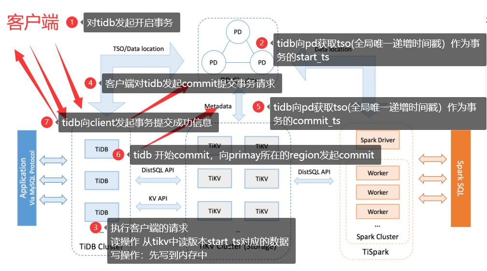
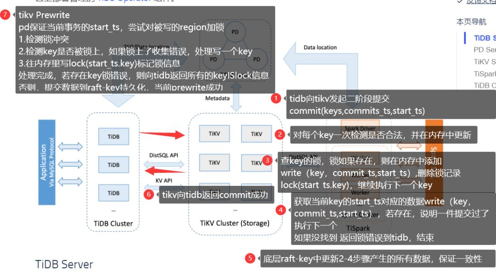

## 浅析TiDB二阶段提交 

关键内容说明：

1. TiDB 对于每个事务，会涉及改动的所有key中，选择出一个作为当前事务的Primary     Key，其他的则为Secondary keys。
2. 当Primary     Key提交成功，标识整个事务提交成功，否则失败。
3. Secondary     keys，则是等Primary Key提交成功后，异步并行提。
4. pd     会产生全局唯一递增时间戳tso 

**TiDB二阶段提交简图

** 

（图1,底图选用tidb官方）

细节描述

在图中④之前还有几部操作：

\1. tidb 开始prewrite操作：向所有涉及改动的 region 并发执行 prewrite 请求，如果某个prewrite失败了。

如果报错为 **keylslook**和**WriteConfict，** 都会重新获取tso，重新启动2pc。其他错误则会报错。

2.在tidb 开始commit 也就是图⑥的时候会执行，

tidb向primay所在的region发起commit。

如果失败 先执行回滚操作，然后根据错误判断是否重试:

**lockNotEXist**重新获取tso作为start_ts 启动2pc提交。

这几步操作，我简单描述一下 在tidb开始写key的操作，如果遇到锁相关的错误，都会进行一个重新获取tso，重新启动2pc的提交。

**TiKV二阶段提交简图**

（图2,底图选用tidb官方，图中的⑦应该是TiKV的准备操作）

TiDB的二阶段提交，还应该包含TiDB对TiKV的二阶段提交，下面用问答的形式来简单说明一下。

问：那么什么时候 TiDB会对TiKV发起二阶段提交？

答：在图1中⑥操作成功之后，TiDB向客户端返回事务成功之前，TiDB会对TiKV发起二阶段提交。

问: TiKV在二阶段提交中如何保证key的一致性？

答：图2中的⑦就是TiKV准备的操作，先对被操作的key进行锁冲突检测，然后对被操作的key进行加锁的一个操作。

在图2中的 ③和④其实为了保证，key已经在TiKV的准备工作中，已经被锁住。然后在内存中循环添加key的信息**write(key,start_ts,commit_ts)**写入一条，和删除锁住key的信息lock(key,start_ts)。当数据没有问题 在写入底层的raft-key中，从而保证了一致性。

从此整个TiDB二阶段提交提交大体完成。

**总结**，在二阶段提交中

PD 提供：提供全局唯一递增时间戳 tso发放。管理 raft-kv 集群

TiKV提供：分布式 kv 存储引擎，提供了 mvcc 功能。可以读取到历史版本数据。

TiDB提供：MySQL协议的解析，相对TiKV而已TiDB是客户端。

参考文章：

https://andremouche.github.io/tidb/transaction_in_tidb.html

