# explain

> [04.explain执行计划解读.](../DB.MYSQL/9.MySQL性能优化/0.性能优化总览/04.explain执行计划解读.md)

| explain       |                        |
| ------------- | ---------------------- |
| ID            | 编号                   |
| select_type   | 查询类型               |
| table         | 表                     |
| type          | 类型                   |
| possible_keys | 预测用到的索引         |
| key           | 实际使用的索引         |
| key_len       | 实际使用索引的长度     |
| ref           | 表之间的引用           |
| rows          | 通过索引查询到的数据量 |
| Extra         | 额外的信息             |

## ID

- 同级关联，id值相同时，从上往下执行。上下的顺序一般为数据大小排序。

- id值不同时，值越大优先级越高。

  > 包含嵌套查询的关联，一般id同时有相同和不同的情况，先执行内层。id值不同时，值越大优先级越高。

- 同级join 有索引

  1->1->1->1

  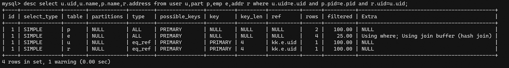

- 同级join无索引

  1->1->1->1

  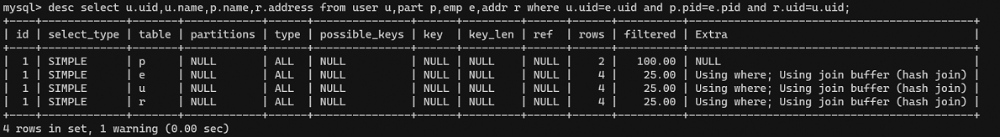

- 嵌套，无索引

  3->2->1

  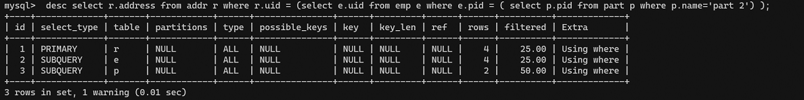

  


## select_type 查询类型

### simple:简单查询（不包含子查询(不一定)、union）

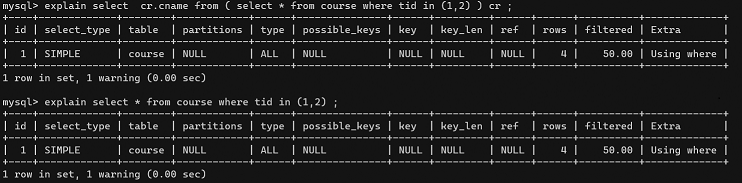


### PRIMARY:包含子查询SQL中的 主查询 （最外层）

### SUBQUERY：包含子查询SQL中的 子查询 （非最外层）

### derived:衍生查询(使用到了临时表)

> 在from子查询中， 如果有table1 union table2 ，则table1 就是derived,table2就是union

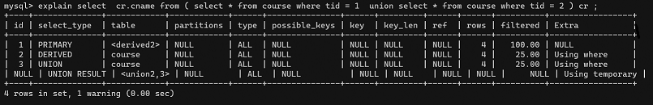


### union:上例

### union result :告知开发人员，那些表之间存在union查询


## type:索引类型、类型

> system > const > eq_ref > ref > fulltext > ref_or_null > index_merge > unique_subquery > index_subquery > range > index > ALL
>
> **system>const>eq_ref>ref>range>index>all**   
>
> - 要对type进行优化的前提：有索引
>
> - system,const只是理想情况，实际能达到 ref>range
>
> system/const: 结果只有一条数据
> eq_ref:结果多条；但是每条数据是唯一的 ；
> ref：结果多条；但是每条数据是是0或多条 ；


### system（忽略）: 只有一条数据的系统表 ；或 衍生表只有一条数据的主查询	

### const：仅仅能查到一条数据的SQL ,用于Primary key 或unique索引  （类型 与索引类型有关）

> ```
> create table test01(tid int(3),tname varchar(20),primary key(tid) );
> insert into test01 values(1,'a') ;
> ```
>
> 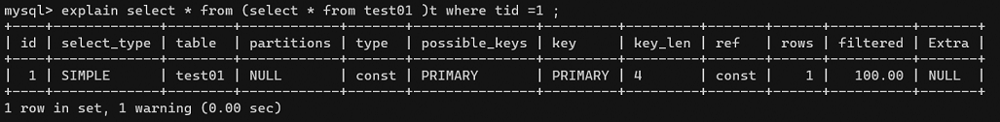
>
> 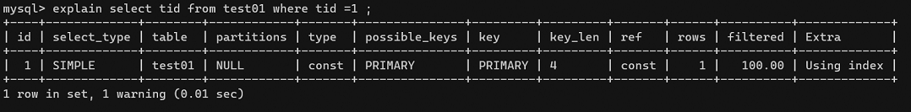
>
> 删除主键索引，改为二级索引，type便不再是const了
>
> 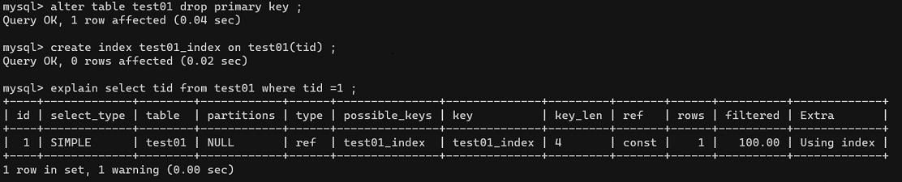


### eq_ref：唯一性索引：对于每个索引键的查询，返回匹配唯一行数据（有且只有1个，不能多 、不能0个）

> > select ... from ..where name = ... .常见于唯一索引 和主键索引。
>
> 查看数据
>
> 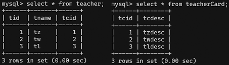
>
> 创建索引前的执行计划
>
> 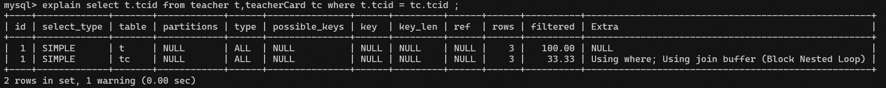
>
> 创建pk或uk
>
> ```
> alter table teacherCard add constraint pk_tcid primary key(tcid);
> alter table teacher add constraint uk_tcid unique index(tcid) ;
> ```
>
> 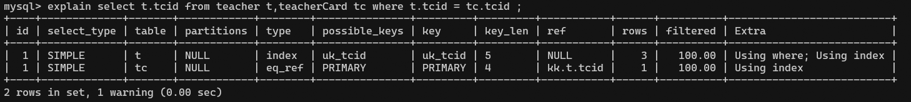
>
> 以上SQL，用到的索引是 t.tcid,即teacher表中的tcid字段；
> 如果teacher表的数据个数 和 连接查询的数据个数一致（都是3条数据），则有可能满足eq_ref级别；否则无法满足。
>
> **测试一下0个的情况**
>
> 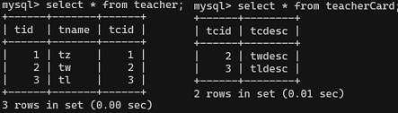
>
> 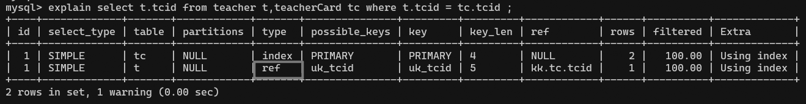
>
> 见：ref
>
> 


### ref：非唯一性索引，对于每个索引键的查询，返回匹配的所有行（0，多）

> 唯一索引的0个匹配行，以及非唯一索引的匹配所有行。


### range：检索指定范围的行 ,where后面是一个范围查询(between   ,> < >=,     **特殊:in有时候会失效 ，从而转为 无索引all**)

> ```
> alter table teacher add index tid_index (tid) ;
> ```
>
> 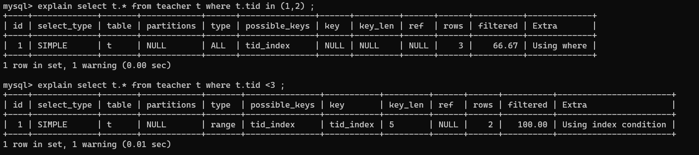


### index：查询全部索引中数据

> tid 是索引列， 只需要扫描索引表，不需要所有表中的所有数据
>
> 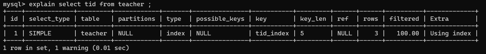


### all：查询全部表中的数据

> cid不是索引，需要全表所有，即需要所有表中的所有数据
>
> 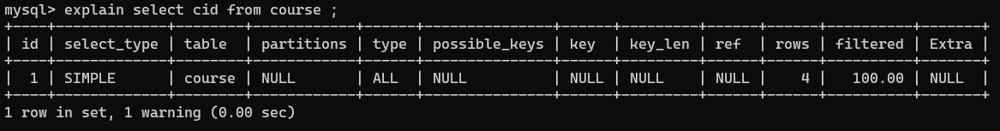


## possible_keys ：可能用到的索引

是一种预测，不准。

```
explain select t.tname ,tc.tcdesc from teacher t,teacherCard tc where t.tcid= tc.tcid and t.tid = (select c.tid from course c where cname = 'sql') ;
```

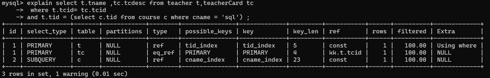


如果 possible_key/key是NULL，则说明没用索引


## key ：实际使用到的索引

如果 possible_key/key是NULL，则说明没用索引


## key_len ：使用了索引的长度 

- 用于判断复合索引是否被完全使用

  > ```
  > create table test_kl(name char(20) not null default '');
  > alter table test_kl add index index_name(name) ;
  > ```
  >
  > 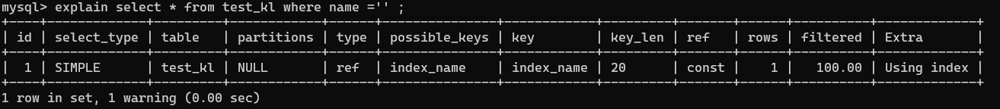
  >
  > 古老版本是key_len是按照字节计算，5.7以后按照字符计算。
  >
  > 
  >
  > - 对于nullable类型
  >
  > ```
  > -- name1可以为null
  > alter table test_kl add column name1 char(20) ;
  > alter table test_kl add index index_name1(name1) ;
  > -- 如果索引字段可以为Null,则会使用1个字节用于标识。
  > ```
  >
  > 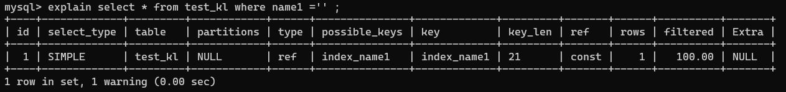
  >
  > 
  >
  > 删除索引，增加一个复合索引 
  >
  > ```
  > drop index index_name on test_kl ;
  > drop index index_name1 on test_kl ;
  > alter table test_kl add index name_name1_index (name,name1) ; 
  > ```
  >
  > 可以看出key_len长度区别，前者由于表只有2列且都属于索引字段，便扫描了整个索引，后者最左匹配原则条件，因此用了前20个字符的长度即可。
  >
  > 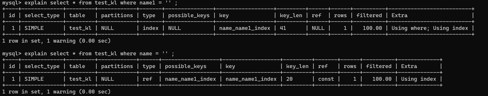
  >
  > 
  >
  > - 对于varchar类型
  >
  > ```
  > alter table test_kl add column name2 varchar(20) ; 
  > alter table test_kl add index name2_index (name2) ;
  > ```
  >
  > 20+null(1)+可变长(2)==23
  >
  > 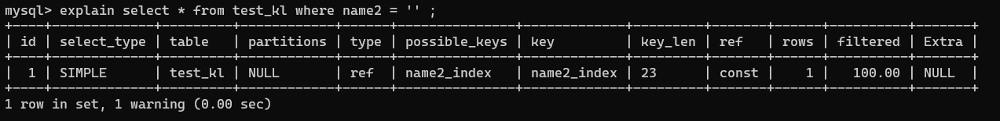

  

## ref :指明当前表所 参照的 字段

 注意与type中的ref值区分。

- 作用： 指明当前表所 参照的 字段。

> - select ....where a.c = b.x ;(其中b.x可以是常量，const)
>
> ```
> alter table course add index tid_index (tid) ;
> ```
>
> c.tid参照自t.tid
>
> 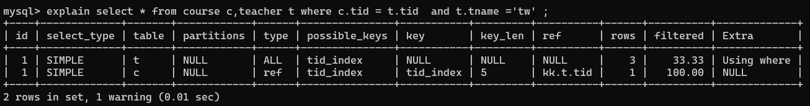


## rows: 被索引优化查询的 数据个数

 (实际通过索引而查询到的 数据个数)


## Extra：

| Extra             | meanings                                                     |
| ----------------- | ------------------------------------------------------------ |
| Using filesort    | 没有办法利用现有索引进行排序，需要额外排序。<br>建议<font color=red>根据排序需要创建相应合适的索引</font>。<br/>order by 。 |
| Using temporary   | 需要用临时表存储结果集。<font color=red>通常是因为group by的列没有索引</font>。<br><font color=red>也可能是因为同时有group by和order by，但group by和order by的列又不一样</font>。<br/>超过temp table size后还会用到磁盘临时表。<br>组合查询返回的数据量太大需要建立一个临时表存储数据,出现这个sql应该优化。 |
| Using Join Buffer | 多表join，但无索引（效率很低），需要用到join buffer，需要优化SQL。 |
| Using where       | 表示是从索引中根据where条件进行检索。<br/>如果连Using where也没有的话，表示本次查询可以从索引中直接取得结果，就是Using index时的情况，不过并不是用于检索（看type列释义：index）。<br/>如果select中的where条件包含了聚集索引列的话，又是可以利用索引进行扫描的，这是有可能并不出现using index字样。 |
| Using index       | 利用覆盖索引，无需回表即可取得结果数据。                     |

- join列有一个列没索引，或者两个列都有索引，但是排序列却不属于驱动表，也会产生临时表。
- using join buffer 通常需要BNL快连接，多表join但是没有索引，或者效率很低。
- 出现joinbuffer通常意味着SQL效率较低
- using where 中性。
- using index 好事儿。


1. using filesort 

   - 性能消耗大；需要“额外”的一次排序（查询）  。
   - 常见于 order by 语句中。
   -  **where哪些字段，就order by那些字段**
     - **对于单索引， 如果排序和查找是同一个字段，则不会出现using filesort；**
     - **如果排序和查找不是同一个字段，则会出现using filesort；**
   -  **where和order by 按照复合索引的顺序使用，不要跨列或无序使用。**

   > - 根据年龄排序：单索引
   >
   > ```
   > -- a1:姓名  a2：年龄
   > create table test02 (a1 char(3), a2 char(3), a3 char(3), index idx_a1(a1), index idx_a2(a2), index idx_a3(a3) );
   > ```
   >
   > - 无事发生：排序和查找字段相同
   >
   >   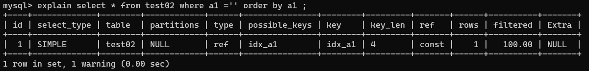
   >
   > - using filesort：排序和查找的字段不同
   >
   >   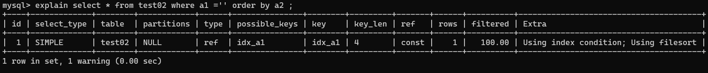
   >
   > - **对于单索引， 如果排序和查找是同一个字段，则不会出现using filesort；如果排序和查找不是同一个字段，则会出现using filesort；**
   >
   > -  **where哪些字段，就order by那些字段**
   >
   >   
   >
   > - 复合索引
   >
   >   ```
   >   drop index idx_a1 on test02;
   >   drop index idx_a2 on test02;
   >   drop index idx_a3 on test02;
   >   
   >   alter table test02 add index idx_a1_a2_a3 (a1,a2,a3) ;
   >   ```
   >
   > - where和order在索引声明时跨列，部分列满足最左匹配原则
   >
   >   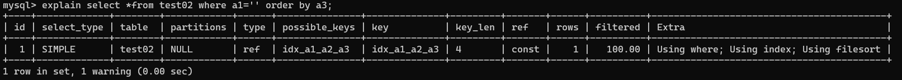
   >
   > - where和order不满足最左匹配原则
   >
   >   注意看key_len，3+3+3+1*3=12，全索引都用上了
   >
   >   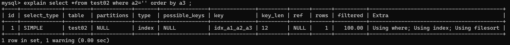
   >
   > - where和order满足最左匹配原则
   >
   >   注意看key_len
   >
   >   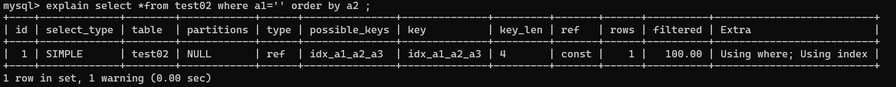
   >
   > - where和order在sql解析层面的顺序上不满足最左匹配原则（倒叙使用了排序和where条件）
   >
   >   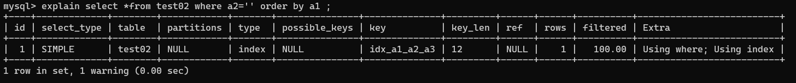
   >
   > -  **where和order by 按照复合索引的顺序使用，不要跨列或无序使用。**


2. using temporary:性能损耗大 ，用到了临时表。一般出现在group by 语句中。

   - **查询那些列，就根据那些列的顺序做 group by**

     > - 根据条件列的顺序去orderby
     >
     >   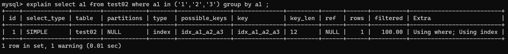
     >
     > - 按照复合索引的声明顺序去group by
     >
     >   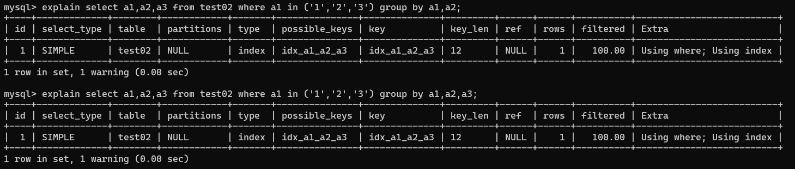
     >
     > - 不按照复合索引的声明顺序，或使用查询列之外的字段做group by
     >
     >   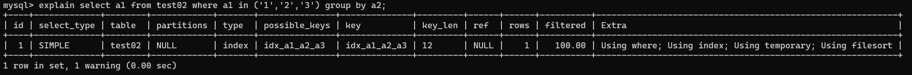
     >
     >   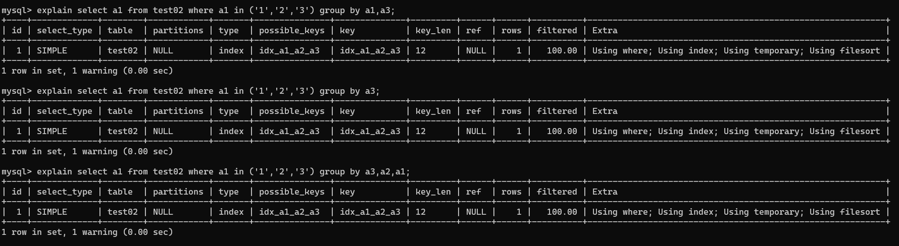
     >
     >   ```
     >   alter table test02 drop index idx_a1_a2_a3;
     >   alter table test02 add index (a1);
     >   alter table test02 add index (a2);
     >   alter table test02 add index (a3,a1);
     >   ```
     >
     >   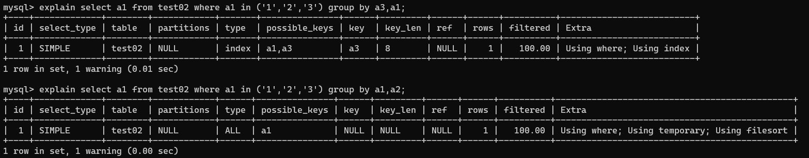
     >
     >   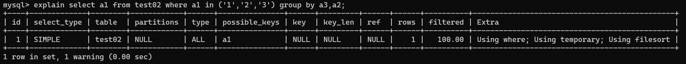


3.  using index

   - 性能提升; 索引覆盖（覆盖索引）。
   - 原因：不读取原文件，只从索引文件中获取数据 （不需要回表查询）
   - 只要使用到的列 全部都在索引中，就是索引覆盖using index
   - 如果用到了索引覆盖(using index时)，会对 possible_keys和key造成影响：
     - 如果没有where，则索引只出现在key中；
     - 如果有where，则索引 出现在key和possible_keys中。

   > - test02表有一个复合索引  (a1,a2,a3)
   >
   >   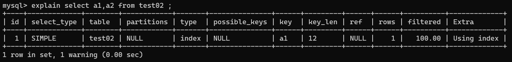
   >
   >   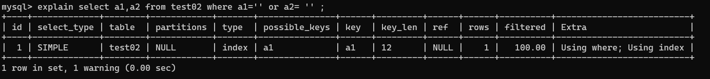
   >
   >   ```
   >   alter table test02 drop index a1;
   >   ```
   >
   >   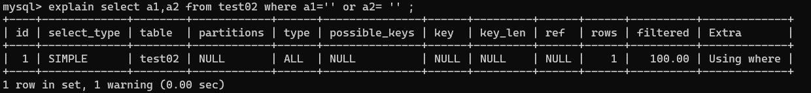
   >
   > - 如果用到了索引覆盖(using index时)，会对 possible_keys和key造成影响：
   >   - 如果没有where，则索引只出现在key中；
   >   - 如果有where，则索引 出现在key和possible_keys中。

   

4. using where 

   - 表示是从索引中根据where条件进行检索。

     > ```
     > CREATE TABLE `test02` ( `a1` char(3), `a2` char(3),`a3` char(3) ,KEY `a1` (`a1`));
     > - a3 需要进一步根据索引a1来检索。
     > ```
     >
     > 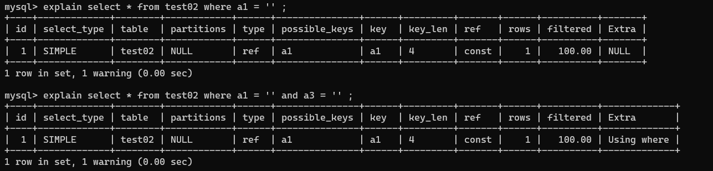


​		
5. impossible where

   -  where子句永远为false
     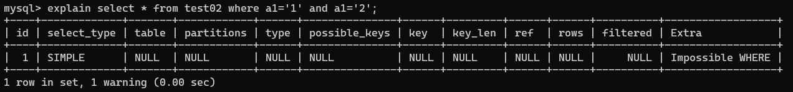