# 单表查询优化

```
create table book( bid int(4) primary key,name varchar(20) not null,authorid int(4) not null,publicid int(4) not null,typeid int(4) not null );
 
insert into book values(1,'tjava',1,1,2),(2,'tc',2,1,2),(3,'wx',3,2,1),(4,'math',4,2,3) ;
```

- 无索引情况下的查询

  > explain select bid from book where typeid in(2,3) and authorid=1  order by typeid desc ;

  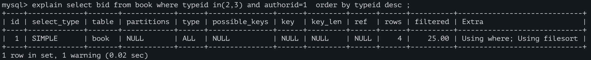

- 创建索引

  > alter table book add index idx_ta (typeid,authorid);

  - 因为bid是主键，二级索引末尾是有隐藏包含主键的，因此创建索引时可以利用这个特性。

  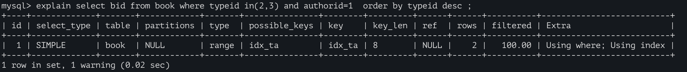

  - 要确保最左匹配原则

  - 有时in条件会导致索引失效，因此可以将in条件改写，或将in条件滞后一些优先满足最左匹配。

    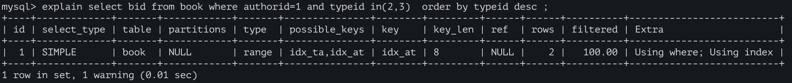

    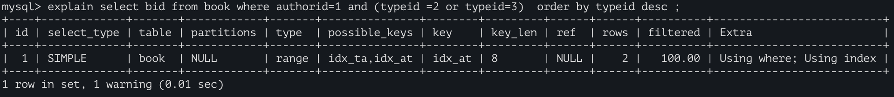


> 本例中同时出现了Using where; Using index：
>
> 原因是 where  authorid=1 and  typeid in(2,3)中，authorid在索引(authorid,typeid)中，直接在索引表中能查到；
>
> 而typeid虽然也在索引(authorid,typeid)中，但是含in的范围查询需要进一步去server筛选，所以（using where）；
> 如没有了in，则不会出现using where，因为直接从索引中命中，无需进一步筛选。[原理：SQL 执行过程和where条件提取过程](../DB.MySQL/5.MySQL体系结构/1.MySQL体系结构/2.server层服务层SQL层/4.0.SQL 执行过程和where条件提取过程.md	)
>
> ```
> explain select bid from book where  authorid=1 and  typeid =3 order by typeid desc ;
> ```
>
> 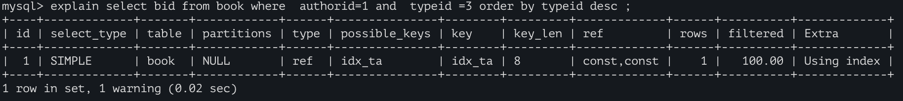
>
> 不过当in必选时，某些情况下可以这样改写，但需要额外的一次排序的话，可能代价会更大。
>
> ```
>  explain select bid from book where authorid=1 and typeid =2 
>  union all select bid from book where authorid=1 and typeid =3 ;
> ```
>
> 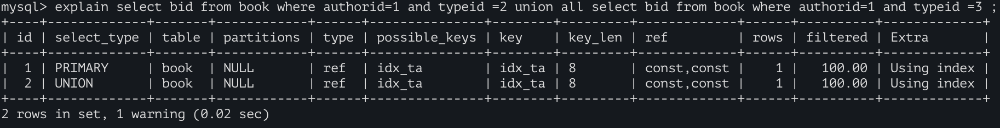

```
create table test03(
	a1 int(4) not null,
	a2 int(4) not null,
 	a3 int(4) not null,
	a4 int(4) not null
);
alter table test03 add index idx_a1_a2_a3_4(a1,a2,a3,a4) ;
```

- 使用了全部的复合索引

  > - 推荐写法，因为 索引的使用顺序（where后面的顺序） 和 复合索引的顺序一致
  >
  >   explain select a1,a2,a3,a4 from test03 where a1=1 and a2=2 and a3=3 and a4 =4 ; 
  >
  >   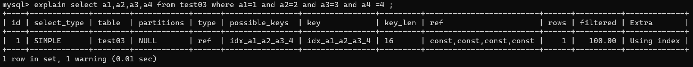

  > - 虽然编写的顺序 和索引顺序不一致，但是 sql在真正执行前 经过了SQL优化器的调整，结果与上条SQL是一致的。（keylen=16）
  >
  >   explain select a1,a2,a3,a4 from test03 where a4=1 and a3=2 and a2=3 and a1 =4 ; 
  >
  >   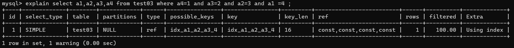

- 跨列导致索引部分失效

  > - SQL用到了a1 a2两个索引，该两个字段 不需要回表查询using index ;而a4因为跨列使用，造成了该索引失效，需要回表查询 因此是using where；以上可以通过 key_len进行验证。（keylen=8）
  >
  >   explain select a1,a2,a3,a4 from test03 where a1=1 and a2=2 and a4=4 order by a3; 
  >   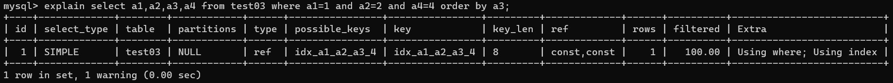

- 跨列导致索引部分失效，请求多一次查找/排序。

  > - SQL出现了 using filesort(文件内排序，“多了一次额外的查找/排序”) ：不要跨列使用( where和order by 拼起来，不要跨列使用)
  >
  >   explain select a1,a2,a3,a4 from test03 where a1=1 and a4=4 order by a3; 
  >
  >   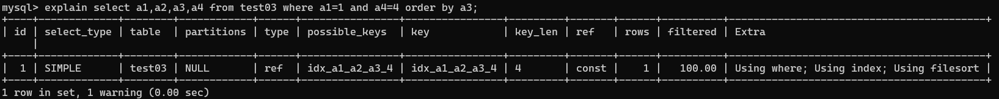

  > - order by 与 where 拼合起来利用了覆盖索引，便不会using filesort.(keylen=4)
  >
  >   explain select a1,a2,a3,a4 from test03 where a1=1 and a4=4 order by a2 , a3; 
  >
  >   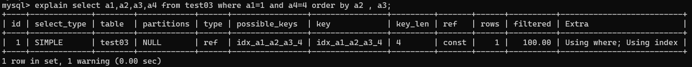

- 总结

  > 总结：i.如果 (a,b,c,d)复合索引  和使用的顺序全部一致(且不跨列使用)，则复合索引全部使用。如果部分一致(且不跨列使用)，则使用部分索引。
  > 	select a,c where  a = and b= and d= 
  > 		ii.where和order by 拼起来，不要跨列使用 
  >
  > using temporary:需要额外再多使用一张表. 一般出现在group by语句中；已经有表了，但不适用，必须再来一张表。
  >
  > 解析过程：			
  > from .. on.. join ..where ..group by ....having ...select dinstinct ..order by limit ...
  > 	a.
  > 		explain select * from test03 where a2=2 and a4=4 group by a2,a4 ;--没有using temporary
  > 	b.
  > 		explain select * from test03 where a2=2 and a4=4 group by a3 ;