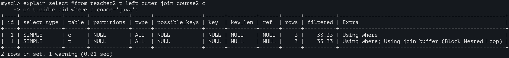
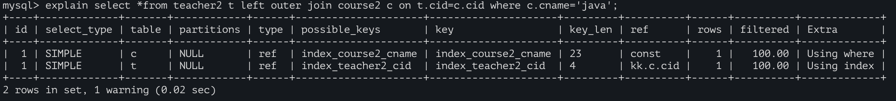

# 两表关联查询优化

```
create table teacher2(tid int(4) primary key,cid int(4) not null);
insert into teacher2 values(1,2),(2,1),(3,3);

create table course2(cid int(4) ,cname varchar(20));
insert into course2 values(1,'java'),(2,'python'),(3,'kotlin');
```

- 小表驱动大表
  
  - 对于双层循环来说：一般建议 将数据小的循环放外层；数据大的循环放内层。

- 索引建立经常使用的字段上
- 一般情况下，对于**左外连接，给左表条件列加索引，右表对应列适当索引；右外连接，反之**

## 驱动表

> - 小表:10 大表:300
>
> ```
> select ...where 小表.x10=大表.x300 ;	--循环了几次？10
> for(int i=0;i<小表.length10;i++) {
> 	for(int j=0;j<大表.length300;j++) {
> 		...
> 	}
> }
> ```
>
> ```
> select ...where 大表.x300=小表.x10 ;	--循环了300次
> for(int i=0;i<大表.length300;i++) {
> 	for(int j=0;j<小表.length10;j++) {
> 		...
> 	}
> }
> ```
>
> - 以上2个循环，最终都会循环3000次；但是 对于双层循环来说：一般建议将数据小的循环放外层；数据大的循环放内层。


## 左连接

```
explain select * from teacher2 t left outer join course2 c
	on t.cid=c.cid where c.cname='java';
```



> [BNL](../DB.MYSQL/5.MySQL体系结构/1.MySQL体系结构/2.server层服务层SQL层/4.2.BKA特性.md),将外层循环的行/结果集存入join buffer，内层循环的每一行与整个buffer中的记录做比较，从而减少内层循环的次数。

- 当编写 ..on t.cid=c.cid 时，将数据量小的表 放左边（假设此时t表数据量小）

  ```
  --对于左外连接，给左表加索引--> t.cid
  alter table teacher2 add index index_teacher2_cid(cid) ;
  
  alter table course2 add index index_course2_cname(cname);
  ```

  

