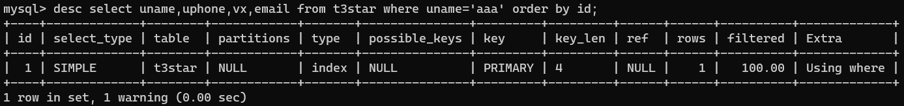
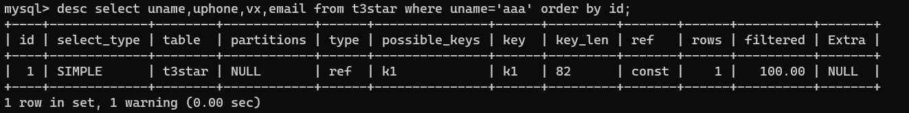
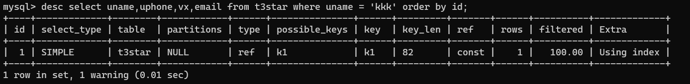

[TOC]

# 三星索引 ☆☆☆

第一颗星：与查询相关的索引行是相邻的，也就是where后面的等值谓词，可以匹配索引列顺序

第二颗星：索引行的顺序与查询语句需求一致，也就是order by 中的排序和索引顺序是否一致

第三颗星：索引行包含查询语句中所有的列


第一颗星：索引中包含了where条件所有的列，即：<font color=red>不再需要“table filter”</font>

第二颗星：可以利用索引完成排序，即：<font color=red>不再需要额外的“using filesort”</font>

第三颗星：索引中的列包含了查询中需要的全部列，无需再回表查询，即：<font color=red>满足“覆盖索引 using indexes”</font>

 

## using filesort

- 模式1

  sort的item仅包括排序列，待排序完成后，根据rowid回表查询所需要的列，4.1以前

  

- 模式2

  sort的item包括全部列，排序完成后，无需再回表，MySQL 4.1~5.6


第二种可以明显减少额外I/O，但需要更多内存

 

5.7后新增优化模式：更紧凑格式数据排序模式，排序更高效

sort仅用于单表排序，<u>若多表join时有排序，则走temporary</u>，再基于temp table再进行filesort

 

## using temporary

- 外部临时表，CREATE TEMPORARY TABLE，只对当前session可见，关闭连接后删除
- 内部临时表，SQL运行时using temporary

 

- 先创建MEMORY表（8.0以前），当数据超过max_heap_table_size时，自动转换成disk temp table
- 5.7起新增internal_tmp_disk_storage_engine选项，可设置为InnoDB，以前默认是MylSAM。但该选项8.0.16后消失，因为只能使用InnoDB引擎
- 8.0后，temp table默认引擎改为TempTable，意欲取代MEMORY引擎，新增选项internal_tmp_mem_storage_engine(TempTable)、temptable_max_ram(1GB)

 

### 几种需要temporary的常见情况

- 表Join时使用BNL/BKA
- 表Join时，GROUP BY/ORDER BY的列不属于驱动表
- GROUP BY和ORDER BY的列不同
- UNION (合并结果后去重)
- 多表关联查询后update
- 聚合查询中包含distinct、group_concat

 

## 实践理解：

### 没有星

- 只有主键索引

- 只能根据主键索引进行全主键索引的扫描，而主键索引包含了全表数据，所以相当于全表扫描。

  ```
  CREATE TABLE `t3star` (
    `id` int(10) unsigned NOT NULL AUTO_INCREMENT,
    `uname` varchar(20) NOT NULL DEFAULT '',
    `uphone` bigint(20) unsigned NOT NULL DEFAULT '0',
    `vx` varchar(20) NOT NULL DEFAULT '',
    `email` varchar(30) NOT NULL DEFAULT '',
    `company` varchar(30) NOT NULL DEFAULT '',
    `job` varchar(20) NOT NULL DEFAULT '',
    PRIMARY KEY (`id`)
  ) ENGINE=InnoDB DEFAULT CHARSET=utf8mb4
  ```

  - 只能根据主键进行全索引扫描，而对主键的全索引扫描等同于全表扫描。Using where 表示要做table filter。
  
    
  
   

### 两颗星☆☆

- <font color=red>通过索引筛选，消除table filter(using where)</font>

- <font color=red>通过索引排序，消除filesort (using filesort)</font>

- 索引覆盖了where条件，<u>但是其他查询列不在索引中，所以还是需要回表（回主键索引）查询</u>到其他列的数据。

  ```
  # 新建辅助索引以满足对where条件的覆盖
  # k1(uname) == (uname,id) --index extensions 特性
  
  mysql> alter table t3star add index k1(uname);
  Query OK, 0 rows affected (0.57 sec)
  Records: 0  Duplicates: 0  Warnings: 0
  ```

  - 索引覆盖了where条件，但其他查询列并不在索引中，因此还需要回表。type=ref 表示基于辅助索引的等值查询。
  
    
  
  

 

### 三颗星☆☆☆

- 通过索引筛选，消除table filter(using where)

- 通过索引排序，消除filesort (using filesort)

- <font color=red>通过索引覆盖，消除回表读，实现 using index</font>（索引行包含查询语句中所有的列）

  ```
  # 重建辅助索引，以覆盖所有查询列
  # 将所有查询列建立索引，由于条件是uname 和order by id，所以把id列放在uname列的后面，就满足了覆盖索引的特性。
  
  mysql> alter table t3star drop index k1;
  Query OK, 0 rows affected (0.55 sec)
  Records: 0  Duplicates: 0  Warnings: 0
  
  mysql> alter table t3star add index k1(uname,id,uphone,vx,email);
  Query OK, 0 rows affected (0.38 sec)
  Records: 0  Duplicates: 0  Warnings: 0
  ```

  - 8.0里就只有Using index
  
    
  
  
  
  因此重新了解了下三星理论，三颗星只需覆盖全部查询列就ok，因此虽然又出现了Using where ，并不影响结论——**消除回表读**。
  
  
