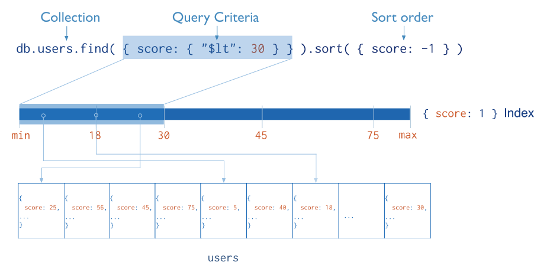
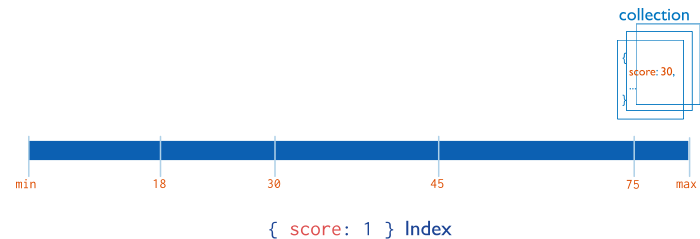
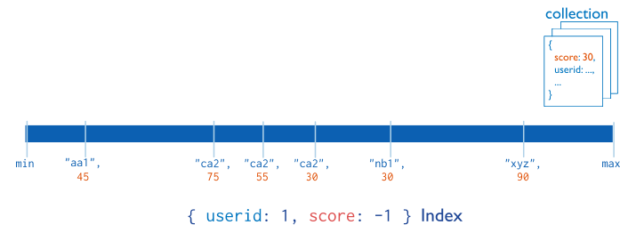
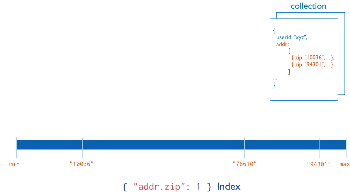

# 索引

- MongoDB索引是B-Tree结构

  

# 索引类型

## 默认id索引

- 创建集合时，mongo自动在_id 字段上创建的唯一索引。
- 不能删除_id 索引
- 在分片集群中，如果不使用`_id`字段作为分片键，那么应用必须确保`_id`字段中值的唯一性。通常通过使用标准的ObjectId来完成。

## 单字段索引

- 对单个字段索引和排序操作，索引键的排序并不重要，MongoDB可在任何方向上遍历索引

## 复合索引

- 多个字段的索引
- 复合索引中列出的字段顺序比较重要。

## 多键索引

MongoDB使用多键索引来索引存储在数组中的内容。

如果索引包含数组值的字段，MongoDB为数组的每个元素创建单独的索引项。

这些多键索引允许查询通过匹配数组的一个或多个元素来选择包含数组的文档。

MongoDB自动决定是否创建一个多键索引，如果索引字段包含数组值;

您不需要显式地指定多键类型。

## 其他索引

### 地理空间索引

- 返回结果时使用平面几何的二维索引
- 返回结果时使用球面几何的二维球面索引

### 文本索引

- 支持在几何中搜索字符串内容

### 哈希索引

- 为了支持基于hash的分片
- hash只支持等值匹配，不支持范围查询。