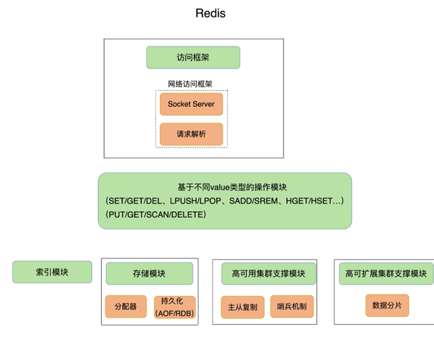

- Redis主要通过网络框架进行访问，而不再是动态库了，这也使得Redis可以作为一个基础性的网络服务进行访问，扩大了Redis的应用范围。
- Redis数据模型中的value类型很丰富，因此也带来了更多的操作接口，例如面向列表的LPUSH/LPOP，面向集合的SADD/SREM等。在下节课，我将和你聊聊这些value模型背后的数据结构和操作效率，以及它们对Redis性能的影响。
- Redis的持久化模块能支持两种方式：日志（AOF）和快照（RDB），这两种持久化方式具有不同的优劣势，影响到Redis的访问性能和可靠性。
- Redis支持高可靠集群和高可扩展集群，因此，Redis中包含了相应的集群功能支撑模块。

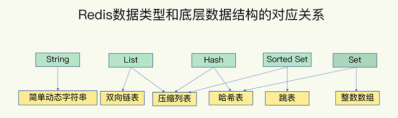

## 键和值用什么结构组织？

为了实现从键到值的快速访问，Redis使用了一个哈希表来保存所有键值对。

一个哈希表，其实就是一个数组，数组的每个元素称为一个哈希桶。所以，我们常说，一个哈希表是由多个哈希桶组成的，每个哈希桶中保存了键值对数据。

看到这里，你可能会问了：“如果值是集合类型的话，作为数组元素的哈希桶怎么来保存呢？”其实，哈希桶中的元素保存的并不是值本身，而是指向具体值的指针。这也就是说，不管值是String，还是集合类型，哈希桶中的元素都是指向它们的指针。

在下图中，可以看到，哈希桶中的entry元素中保存了`*key`和`*value`指针，分别指向了实际的键和值，这样一来，即使值是一个集合，也可以通过`*value`指针被查找到。

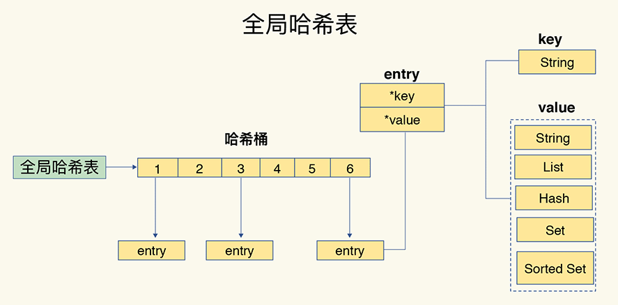

因为这个哈希表保存了所有的键值对，所以，我也把它称为**全局哈希表**。哈希表的最大好处很明显，就是让我们可以用O(1)的时间复杂度来快速查找到键值对——我们只需要计算键的哈希值，就可以知道它所对应的哈希桶位置，然后就可以访问相应的entry元素。

你看，这个查找过程主要依赖于哈希计算，和数据量的多少并没有直接关系。也就是说，不管哈希表里有10万个键还是100万个键，我们只需要一次计算就能找到相应的键。

但是，如果你只是了解了哈希表的O(1)复杂度和快速查找特性，那么，当你往Redis中写入大量数据后，就可能发现操作有时候会突然变慢了。这其实是因为你忽略了一个潜在的风险点，那就是**哈希表的冲突问题和rehash可能带来的操作阻塞。**

### 为什么哈希表操作变慢了？

当你往哈希表中写入更多数据时，哈希冲突是不可避免的问题。这里的哈希冲突，也就是指，两个key的哈希值和哈希桶计算对应关系时，正好落在了同一个哈希桶中。

毕竟，哈希桶的个数通常要少于key的数量，这也就是说，难免会有一些key的哈希值对应到了同一个哈希桶中。

Redis解决哈希冲突的方式，就是链式哈希。链式哈希也很容易理解，就是指**同一个哈希桶中的多个元素用一个链表来保存，它们之间依次用指针连接**。

如下图所示：entry1、entry2和entry3都需要保存在哈希桶3中，导致了哈希冲突。此时，entry1元素会通过一个`*next`指针指向entry2，同样，entry2也会通过`*next`指针指向entry3。这样一来，即使哈希桶3中的元素有100个，我们也可以通过entry元素中的指针，把它们连起来。这就形成了一个链表，也叫作哈希冲突链。

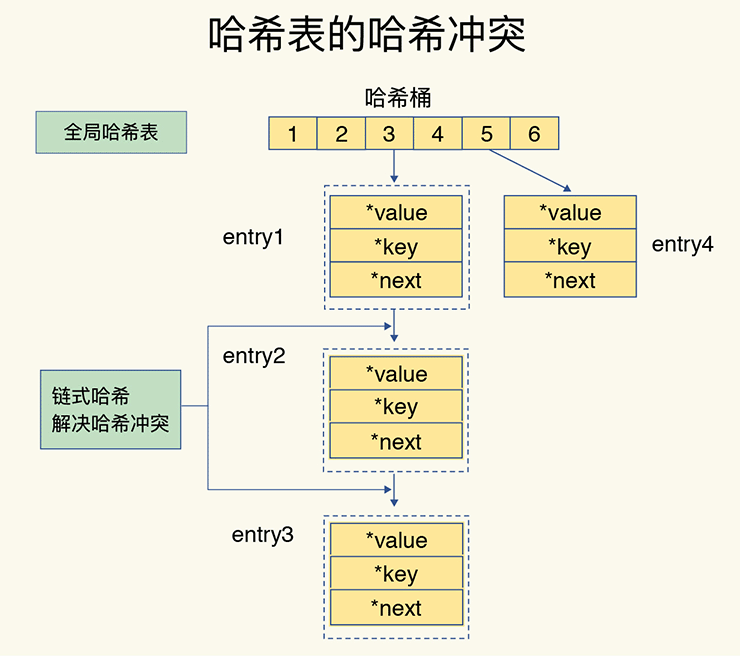

但是，这里依然存在一个问题，哈希冲突链上的元素只能通过指针逐一查找再操作。如果哈希表里写入的数据越来越多，哈希冲突可能也会越来越多，这就会导致某些哈希冲突链过长，进而导致这个链上的元素查找耗时长，效率降低。对于追求“快”的Redis来说，这是不太能接受的。

所以，Redis会对哈希表做rehash操作。rehash也就是增加现有的哈希桶数量，让逐渐增多的entry元素能在更多的桶之间分散保存，减少单个桶中的元素数量，从而减少单个桶中的冲突。那具体怎么做呢？

其实，为了使rehash操作更高效，Redis默认使用了两个全局哈希表：哈希表1和哈希表2。一开始，当你刚插入数据时，默认使用哈希表1，此时的哈希表2并没有被分配空间。随着数据逐步增多，Redis开始执行rehash，这个过程分为三步：

1. 给哈希表2分配更大的空间，例如是当前哈希表1大小的两倍；
2. 把哈希表1中的数据重新映射并拷贝到哈希表2中；
3. 释放哈希表1的空间。

到此，我们就可以从哈希表1切换到哈希表2，用增大的哈希表2保存更多数据，而原来的哈希表1留作下一次rehash扩容备用。

这个过程看似简单，但是第二步涉及大量的数据拷贝，如果一次性把哈希表1中的数据都迁移完，会造成Redis线程阻塞，无法服务其他请求。此时，Redis就无法快速访问数据了。

为了避免这个问题，Redis采用了**渐进式rehash**。

简单来说就是在第二步拷贝数据时，Redis仍然正常处理客户端请求，每处理一个请求时，从哈希表1中的第一个索引位置开始，顺带着将这个索引位置上的所有entries拷贝到哈希表2中；等处理下一个请求时，再顺带拷贝哈希表1中的下一个索引位置的entries。如下图所示：

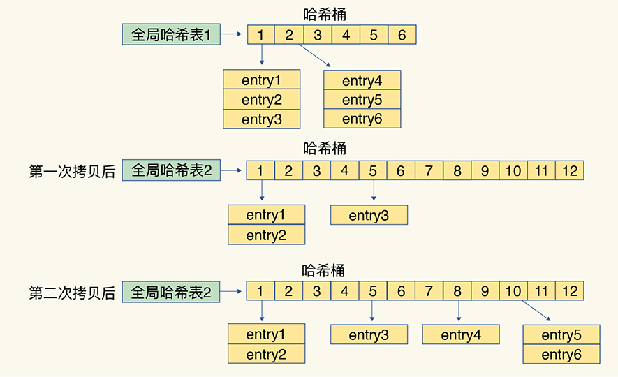

这样就巧妙地把一次性大量拷贝的开销，分摊到了多次处理请求的过程中，避免了耗时操作，保证了数据的快速访问。

> 渐进式rehash执行时，除了根据键值对的操作来进行数据迁移，Redis本身还会有一个定时任务在执行rehash，如果没有键值对操作时，这个定时任务会周期性地（例如每100ms一次）搬移一些数据到新的哈希表中，这样可以缩短整个rehash的过程。

好了，到这里，你应该就能理解，Redis的键和值是怎么通过哈希表组织的了。对于String类型来说，找到哈希桶就能直接增删改查了，所以，哈希表的O(1)操作复杂度也就是它的复杂度了。

但是，对于集合类型来说，即使找到哈希桶了，还要在集合中再进一步操作。接下来，我们来看集合类型的操作效率又是怎样的。

## 集合数据操作效率

和String类型不同，一个集合类型的值，第一步是通过全局哈希表找到对应的哈希桶位置，第二步是在集合中再增删改查。那么，集合的操作效率和哪些因素相关呢？

首先，与集合的底层数据结构有关。例如，使用哈希表实现的集合，要比使用链表实现的集合访问效率更高。其次，操作效率和这些操作本身的执行特点有关，比如读写一个元素的操作要比读写所有元素的效率高。

接下来，我们就分别聊聊集合类型的底层数据结构和操作复杂度。

### 有哪些底层数据结构？

刚才，我也和你介绍过，集合类型的底层数据结构主要有5种：整数数组、双向链表、哈希表、压缩列表和跳表。

其中，哈希表的操作特点我们刚刚已经学过了；**整数数组和双向链表也很常见，它们的操作特征都是顺序读写，也就是通过数组下标或者链表的指针逐个元素访问**，操作复杂度基本是O(N)，**操作效率比较低**；压缩列表和跳表我们平时接触得可能不多，但它们也是Redis重要的数据结构，所以我来重点解释一下。

压缩列表实际上类似于一个数组，数组中的每一个元素都对应保存一个数据。和数组不同的是，压缩列表在表头有三个字段zlbytes、zltail和zllen，分别表示列表长度、列表尾的偏移量和列表中的entry个数；压缩列表在表尾还有一个zlend，表示列表结束。

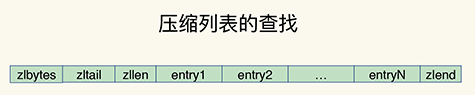

在压缩列表中，如果我们要查找定位第一个元素和最后一个元素，可以通过表头三个字段的长度直接定位，复杂度是O(1)。而查找其他元素时，就没有这么高效了，只能逐个查找，此时的复杂度就是O(N)了。

我们再来看下跳表。

有序链表只能逐一查找元素，导致操作起来非常缓慢，于是就出现了跳表。具体来说，跳表在链表的基础上，**增加了多级索引，通过索引位置的几个跳转，实现数据的快速定位**，如下图所示：

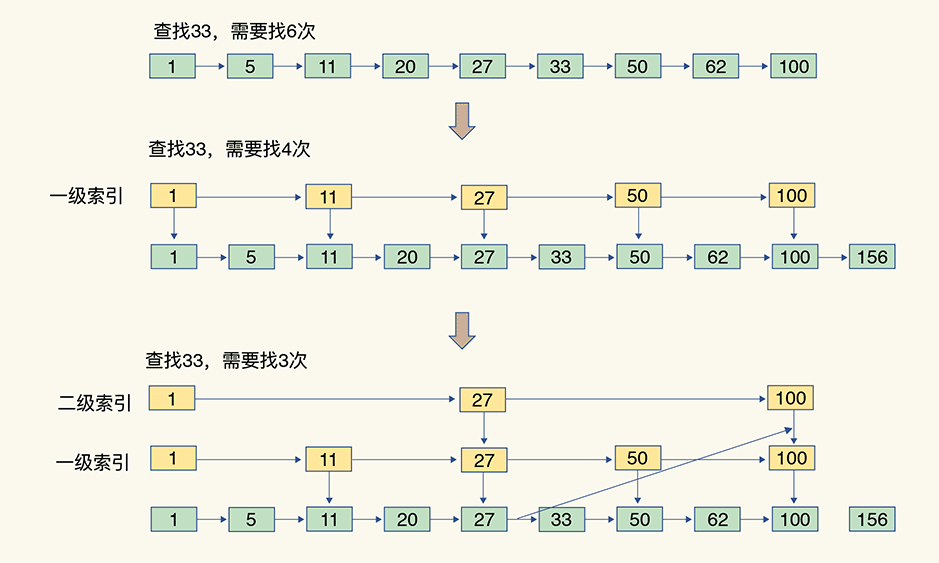

如果我们要在链表中查找33这个元素，只能从头开始遍历链表，查找6次，直到找到33为止。此时，复杂度是O(N)，查找效率很低。

为了提高查找速度，我们来增加一级索引：从第一个元素开始，每两个元素选一个出来作为索引。这些索引再通过指针指向原始的链表。例如，从前两个元素中抽取元素1作为一级索引，从第三、四个元素中抽取元素11作为一级索引。此时，我们只需要4次查找就能定位到元素33了。

如果我们还想再快，可以再增加二级索引：从一级索引中，再抽取部分元素作为二级索引。例如，从一级索引中抽取1、27、100作为二级索引，二级索引指向一级索引。这样，我们只需要3次查找，就能定位到元素33了。

可以看到，这个查找过程就是在多级索引上跳来跳去，最后定位到元素。这也正好符合“跳”表的叫法。当数据量很大时，跳表的查找复杂度就是O(logN)。

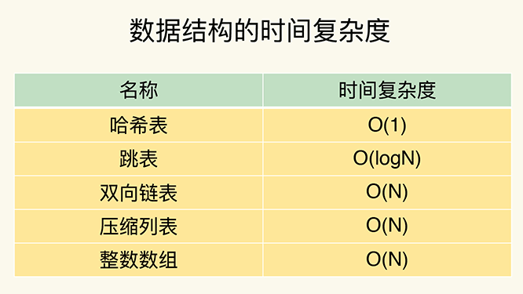

### 不同操作的复杂度

集合类型的操作类型很多，有读写单个集合元素的，例如HGET、HSET，也有操作多个元素的，例如SADD，还有对整个集合进行遍历操作的，例如SMEMBERS。这么多操作，它们的复杂度也各不相同。而复杂度的高低又是我们选择集合类型的重要依据。

我总结了一个“四句口诀”，希望能帮助你快速记住集合常见操作的复杂度。这样你在使用过程中，就可以提前规避高复杂度操作了。

- 单元素操作是基础；
- 范围操作非常耗时；
- 统计操作通常高效；
- 例外情况只有几个。

第一，**单元素操作，是指每一种集合类型对单个数据实现的增删改查操作**。例如，Hash类型的HGET、HSET和HDEL，Set类型的SADD、SREM、SRANDMEMBER等。这些操作的复杂度由集合采用的数据结构决定，例如，HGET、HSET和HDEL是对哈希表做操作，所以它们的复杂度都是O(1)；Set类型用哈希表作为底层数据结构时，它的SADD、SREM、SRANDMEMBER复杂度也是O(1)。

这里，有个地方你需要注意一下，集合类型支持同时对多个元素进行增删改查，例如Hash类型的HMGET和HMSET，Set类型的SADD也支持同时增加多个元素。此时，这些操作的复杂度，就是由单个元素操作复杂度和元素个数决定的。例如，HMSET增加M个元素时，复杂度就从O(1)变成O(M)了。

第二，**范围操作，是指集合类型中的遍历操作，可以返回集合中的所有数据**，比如Hash类型的HGETALL和Set类型的SMEMBERS，或者返回一个范围内的部分数据，比如List类型的LRANGE和ZSet类型的ZRANGE。**这类操作的复杂度一般是O(N)，比较耗时，我们应该尽量避免**。

不过，Redis从2.8版本开始提供了SCAN系列操作（包括HSCAN，SSCAN和ZSCAN），这类操作实现了渐进式遍历，每次只返回有限数量的数据。这样一来，相比于HGETALL、SMEMBERS这类操作来说，就避免了一次性返回所有元素而导致的Redis阻塞。

第三，统计操作，是指**集合类型对集合中所有元素个数的记录**，例如LLEN和SCARD。这类操作复杂度只有O(1)，这是因为当集合类型采用压缩列表、双向链表、整数数组这些数据结构时，这些结构中专门记录了元素的个数统计，因此可以高效地完成相关操作。

第四，例外情况，是指某些数据结构的特殊记录，例如**压缩列表和双向链表都会记录表头和表尾的偏移量**。这样一来，对于List类型的LPOP、RPOP、LPUSH、RPUSH这四个操作来说，它们是在列表的头尾增删元素，这就可以通过偏移量直接定位，所以它们的复杂度也只有O(1)，可以实现快速操作。

## 小结

这节课，我们学习了Redis的底层数据结构，这既包括了Redis中用来保存每个键和值的全局哈希表结构，也包括了支持集合类型实现的双向链表、压缩列表、整数数组、哈希表和跳表这五大底层结构。

Redis之所以能快速操作键值对，一方面是因为O(1)复杂度的哈希表被广泛使用，包括String、Hash和Set，它们的操作复杂度基本由哈希表决定，另一方面，Sorted Set也采用了O(logN)复杂度的跳表。不过，集合类型的范围操作，因为要遍历底层数据结构，复杂度通常是O(N)。这里，我的建议是：**用其他命令来替代**，例如可以用SCAN来代替，避免在Redis内部产生费时的全集合遍历操作。

当然，我们不能忘了复杂度较高的List类型，它的两种底层实现结构：双向链表和压缩列表的操作复杂度都是O(N)。因此，我的建议是：**因地制宜地使用List类型**。例如，既然它的POP/PUSH效率很高，那么就将它主要用于FIFO队列场景，而不是作为一个可以随机读写的集合。

Redis数据类型丰富，每个类型的操作繁多，我们通常无法一下子记住所有操作的复杂度。所以，最好的办法就是**掌握原理，以不变应万变**。这里，你可以看到，一旦掌握了数据结构基本原理，你可以从原理上推断不同操作的复杂度，即使这个操作你不一定熟悉。这样一来，你不用死记硬背，也能快速合理地做出选择了。

## 每课一问

整数数组和压缩列表在查找时间复杂度方面并没有很大的优势，那为什么Redis还会把它们作为底层数据结构呢？

> 1、内存利用率，数组和压缩列表都是非常紧凑的数据结构，它比链表占用的内存要更少。Redis是内存数据库，大量数据存到内存中，此时需要做尽可能的优化，提高内存的利用率。
>
> 2、数组对CPU高速缓存支持更友好，所以Redis在设计时，集合数据元素较少情况下，默认采用内存紧凑排列的方式存储，同时利用CPU高速缓存不会降低访问速度。当数据元素超过设定阈值后，避免查询时间复杂度太高，转为哈希和跳表数据结构存储，保证查询效率。
>
> Redis的List底层使用压缩列表本质上是将所有元素紧挨着存储，所以分配的是一块连续的内存空间，虽然数据结构本身没有时间复杂度的优势，但是这样节省空间而且也能避免一些内存碎片；

今天，我们来探讨一个很多人都很关心的问题：“为什么单线程的Redis能那么快？”

首先，我要和你厘清一个事实，我们通常说，Redis是单线程，主要是指**Redis的网络IO和键值对读写是由一个线程来完成的，这也是Redis对外提供键值存储服务的主要流程**。但Redis的其他功能，比如持久化、异步删除、集群数据同步等，其实是由额外的线程执行的。

所以，严格来说，Redis并不是单线程，但是我们一般把Redis称为单线程高性能，这样显得“酷”些。接下来，我也会把Redis称为单线程模式。而且，这也会促使你紧接着提问：“为什么用单线程？为什么单线程能这么快？”

要弄明白这个问题，我们就要深入地学习下Redis的单线程设计机制以及多路复用机制。之后你在调优Redis性能时，也能更有针对性地避免会导致Redis单线程阻塞的操作，例如执行复杂度高的命令。

好了，话不多说，接下来，我们就先来学习下Redis采用单线程的原因。

## Redis为什么用单线程？

要更好地理解Redis为什么用单线程，我们就要先了解多线程的开销。

### 多线程的开销

日常写程序时，我们经常会听到一种说法：“使用多线程，可以增加系统吞吐率，或是可以增加系统扩展性。”的确，对于一个多线程的系统来说，在有合理的资源分配的情况下，可以增加系统中处理请求操作的资源实体，进而提升系统能够同时处理的请求数，即吞吐率。下面的左图是我们采用多线程时所期待的结果。

但是，请你注意，通常情况下，在我们采用多线程后，如果没有良好的系统设计，实际得到的结果，其实是右图所展示的那样。我们刚开始增加线程数时，系统吞吐率会增加，但是，再进一步增加线程时，系统吞吐率就增长迟缓了，有时甚至还会出现下降的情况。

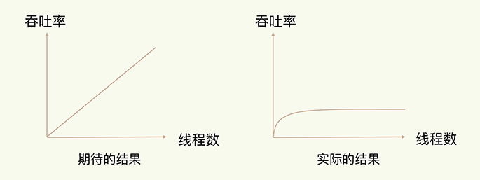

为什么会出现这种情况呢？一个关键的瓶颈在于，系统中通常会存在被多线程同时访问的共享资源，比如一个共享的数据结构。当有多个线程要修改这个共享资源时，为了保证共享资源的正确性，就需要有额外的机制进行保证，而这个额外的机制，就会带来额外的开销。

拿Redis来说，在上节课中，我提到过，Redis有List的数据类型，并提供出队（LPOP）和入队（LPUSH）操作。假设Redis采用多线程设计，如下图所示，现在有两个线程A和B，线程A对一个List做LPUSH操作，并对队列长度加1。同时，线程B对该List执行LPOP操作，并对队列长度减1。为了保证队列长度的正确性，Redis需要让线程A和B的LPUSH和LPOP串行执行，这样一来，Redis可以无误地记录它们对List长度的修改。否则，我们可能就会得到错误的长度结果。这就是**多线程编程模式面临的共享资源的并发访问控制问题**。

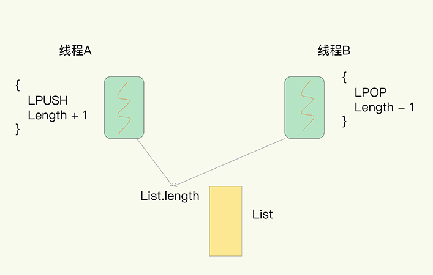

并发访问控制一直是多线程开发中的一个难点问题，如果没有精细的设计，比如说，只是简单地采用一个粗粒度互斥锁，就会出现不理想的结果：即使增加了线程，大部分线程也在等待获取访问共享资源的互斥锁，并行变串行，系统吞吐率并没有随着线程的增加而增加。

而且，采用多线程开发一般会引入同步原语来保护共享资源的并发访问，这也会降低系统代码的易调试性和可维护性。为了避免这些问题，Redis直接采用了单线程模式。

讲到这里，你应该已经明白了“Redis为什么用单线程”，那么，接下来，我们就来看看，为什么单线程Redis能获得高性能。

## 单线程Redis为什么那么快？

通常来说，单线程的处理能力要比多线程差很多，但是Redis却能使用单线程模型达到每秒数十万级别的处理能力，这是为什么呢？其实，这是Redis多方面设计选择的一个综合结果。

一方面，Redis的大部分操作在内存上完成，再加上它采用了高效的数据结构，例如哈希表和跳表，这是它实现高性能的一个重要原因。另一方面，就是Redis采用了**多路复用机制**，使其在网络IO操作中能并发处理大量的客户端请求，实现高吞吐率。接下来，我们就重点学习下多路复用机制。

首先，我们要弄明白网络操作的基本IO模型和潜在的阻塞点。毕竟，Redis采用单线程进行IO，如果线程被阻塞了，就无法进行多路复用了。

### 基本IO模型与阻塞点

你还记得我在[第一节课](https://time.geekbang.org/column/article/268262)介绍的具有网络框架的SimpleKV吗？

以Get请求为例，SimpleKV为了处理一个Get请求，需要监听客户端请求（bind/listen），和客户端建立连接（accept），从socket中读取请求（recv），解析客户端发送请求（parse），根据请求类型读取键值数据（get），最后给客户端返回结果，即向socket中写回数据（send）。

下图显示了这一过程，其中，bind/listen、accept、recv、parse和send属于网络IO处理，而get属于键值数据操作。既然Redis是单线程，那么，最基本的一种实现是在一个线程中依次执行上面说的这些操作。

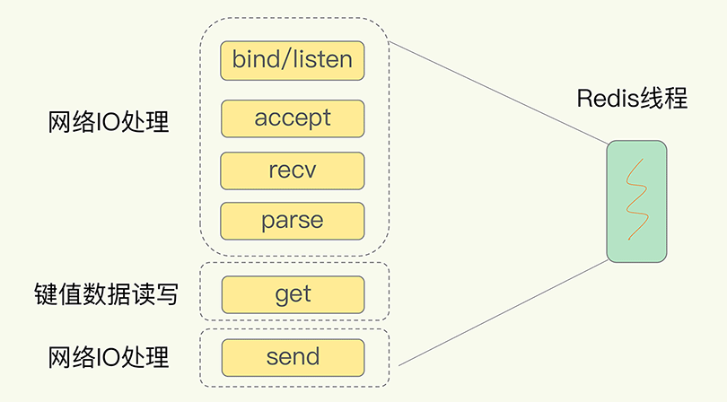

但是，在这里的网络IO操作中，有潜在的阻塞点，分别是accept()和recv()。当Redis监听到一个客户端有连接请求，但一直未能成功建立起连接时，会阻塞在accept()函数这里，导致其他客户端无法和Redis建立连接。类似的，当Redis通过recv()从一个客户端读取数据时，如果数据一直没有到达，Redis也会一直阻塞在recv()。

这就导致Redis整个线程阻塞，无法处理其他客户端请求，效率很低。不过，幸运的是，socket网络模型本身支持非阻塞模式。

### 非阻塞模式

Socket网络模型的非阻塞模式设置，主要体现在三个关键的函数调用上，如果想要使用socket非阻塞模式，就必须要了解这三个函数的调用返回类型和设置模式。接下来，我们就重点学习下它们。

在socket模型中，不同操作调用后会返回不同的套接字类型。socket()方法会返回主动套接字，然后调用listen()方法，将主动套接字转化为监听套接字，此时，可以监听来自客户端的连接请求。最后，调用accept()方法接收到达的客户端连接，并返回已连接套接字。

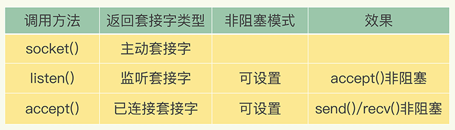

针对监听套接字，我们可以设置非阻塞模式：当Redis调用accept()但一直未有连接请求到达时，Redis线程可以返回处理其他操作，而不用一直等待。但是，你要注意的是，调用accept()时，已经存在监听套接字了。

虽然Redis线程可以不用继续等待，但是总得有机制继续在监听套接字上等待后续连接请求，并在有请求时通知Redis。

类似的，我们也可以针对已连接套接字设置非阻塞模式：Redis调用recv()后，如果已连接套接字上一直没有数据到达，Redis线程同样可以返回处理其他操作。我们也需要有机制继续监听该已连接套接字，并在有数据达到时通知Redis。

这样才能保证Redis线程，既不会像基本IO模型中一直在阻塞点等待，也不会导致Redis无法处理实际到达的连接请求或数据。

到此，Linux中的IO多路复用机制就要登场了。

### 基于多路复用的高性能I/O模型

Linux中的IO多路复用机制是指一个线程处理多个IO流，就是我们经常听到的select/epoll机制。简单来说，在Redis只运行单线程的情况下，**该机制允许内核中，同时存在多个监听套接字和已连接套接字**。内核会一直监听这些套接字上的连接请求或数据请求。一旦有请求到达，就会交给Redis线程处理，这就实现了一个Redis线程处理多个IO流的效果。

下图就是基于多路复用的Redis IO模型。图中的多个FD就是刚才所说的多个套接字。Redis网络框架调用epoll机制，让内核监听这些套接字。此时，Redis线程不会阻塞在某一个特定的监听或已连接套接字上，也就是说，不会阻塞在某一个特定的客户端请求处理上。正因为此，Redis可以同时和多个客户端连接并处理请求，从而提升并发性。

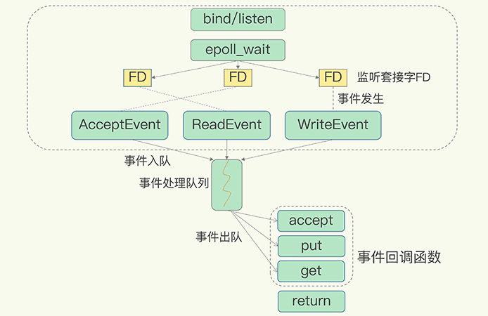

为了在请求到达时能通知到Redis线程，select/epoll提供了**基于事件的回调机制**，即**针对不同事件的发生，调用相应的处理函数**。

那么，回调机制是怎么工作的呢？其实，select/epoll一旦监测到FD上有请求到达时，就会触发相应的事件。

这些事件会被放进一个事件队列，Redis单线程对该事件队列不断进行处理。这样一来，Redis无需一直轮询是否有请求实际发生，这就可以避免造成CPU资源浪费。同时，Redis在对事件队列中的事件进行处理时，会调用相应的处理函数，这就实现了基于事件的回调。因为Redis一直在对事件队列进行处理，所以能及时响应客户端请求，提升Redis的响应性能。

为了方便你理解，我再以连接请求和读数据请求为例，具体解释一下。

这两个请求分别对应Accept事件和Read事件，Redis分别对这两个事件注册accept和get回调函数。当Linux内核监听到有连接请求或读数据请求时，就会触发Accept事件和Read事件，此时，内核就会回调Redis相应的accept和get函数进行处理。

这就像病人去医院瞧病。在医生实际诊断前，每个病人（等同于请求）都需要先分诊、测体温、登记等。如果这些工作都由医生来完成，医生的工作效率就会很低。所以，医院都设置了分诊台，分诊台会一直处理这些诊断前的工作（类似于Linux内核监听请求），然后再转交给医生做实际诊断。这样即使一个医生（相当于Redis单线程），效率也能提升。

不过，需要注意的是，即使你的应用场景中部署了不同的操作系统，多路复用机制也是适用的。因为这个机制的实现有很多种，既有基于Linux系统下的select和epoll实现，也有基于FreeBSD的kqueue实现，以及基于Solaris的evport实现，这样，你可以根据Redis实际运行的操作系统，选择相应的多路复用实现。

## 小结

今天，我们重点学习了Redis线程的三个问题：“Redis真的只有单线程吗？”“为什么用单线程？”“单线程为什么这么快？”

现在，我们知道了，Redis单线程是指它对网络IO和数据读写的操作采用了一个线程，而采用单线程的一个核心原因是避免多线程开发的并发控制问题。单线程的Redis也能获得高性能，跟多路复用的IO模型密切相关，因为这避免了accept()和send()/recv()潜在的网络IO操作阻塞点。

搞懂了这些，你就走在了很多人的前面。如果你身边还有不清楚这几个问题的朋友，欢迎你分享给他/她，解决他们的困惑。

另外，我也剧透下，可能你也注意到了，2020年5月，Redis 6.0的稳定版发布了，Redis 6.0中提出了多线程模型。那么，这个多线程模型和这节课所说的IO模型有什么关联？会引入复杂的并发控制问题吗？会给Redis 6.0带来多大提升？关于这些问题，我会在后面的课程中和你具体介绍。

## 每课一问

这节课，我给你提个小问题，在“Redis基本IO模型”图中，你觉得还有哪些潜在的性能瓶颈吗？欢迎在留言区写下你的思考和答案，我们一起交流讨论。

> Redis单线程处理IO请求性能瓶颈主要包括2个方面：
>
> 1、任意一个请求在server中一旦发生耗时，都会影响整个server的性能，也就是说后面的请求都要等前面这个耗时请求处理完成，自己才能被处理到。耗时的操作包括以下几种：
> 	a、操作bigkey：写入一个bigkey在分配内存时需要消耗更多的时间，同样，删除bigkey释放内存同样会产生耗时；
> 	b、使用复杂度过高的命令：例如SORT/SUNION/ZUNIONSTORE，或者O(N)命令，但是N很大，例如lrange key 0 -1一次查询全量数据；
> 	c、大量key集中过期：Redis的过期机制也是在主线程中执行的，大量key集中过期会导致处理一个请求时，耗时都在删除过期key，耗时变长；
> 	d、淘汰策略：淘汰策略也是在主线程执行的，当内存超过Redis内存上限后，每次写入都需要淘汰一些key，也会造成耗时变长；
> 	e、AOF刷盘开启always机制：每次写入都需要把这个操作刷到磁盘，写磁盘的速度远比写内存慢，会拖慢Redis的性能；
> 	f、主从全量同步生成RDB：虽然采用fork子进程生成数据快照，但fork这一瞬间也是会阻塞整个线程的，实例越大，阻塞时间越久；
> 2、并发量非常大时，单线程读写客户端IO数据存在性能瓶颈，虽然采用IO多路复用机制，但是读写客户端数据依旧是同步IO，只能单线程依次读取客户端的数据，无法利用到CPU多核。
>
> 针对问题1，一方面需要业务人员去规避，一方面Redis在4.0推出了lazy-free机制，把bigkey释放内存的耗时操作放在了异步线程中执行，降低对主线程的影响。
>
> 针对问题2，Redis在6.0推出了多线程，可以在高并发场景下利用CPU多核多线程读写客户端数据，进一步提升server性能，当然，只是针对客户端的读写是并行的，每个命令的真正操作依旧是单线程的。

Redis 的单线程指 Redis 的网络 IO 和键值对读写由一个线程来完成的（这是 Redis 对外提供键值对存储服务的主要流程）
Redis 的持久化、异步删除、集群数据同步等功能是由其他线程而不是主线程来执行的，所以严格来说，Redis 并不是单线程

为什么用单线程？
多线程会有共享资源的并发访问控制问题，为了避免这些问题，Redis 采用了单线程的模式，而且采用单线程对于 Redis 的内部实现的复杂度大大降低

为什么单线程就挺快？
1.Redis 大部分操作是在内存上完成，并且采用了高效的数据结构如哈希表和跳表
2.Redis 采用多路复用，能保证在网络 IO 中可以并发处理大量的客户端请求，实现高吞吐率

Redis 6.0 版本为什么又引入了多线程？
Redis 的瓶颈不在 CPU ，而在内存和网络，内存不够可以增加内存或通过数据结构等进行优化
但 Redis 的网络 IO 的读写占用了发部分 CPU 的时间，如果可以把网络处理改成多线程的方式，性能会有很大提升
所以总结下 Redis 6.0 版本引入多线程有两个原因
1.充分利用服务器的多核资源
2.多线程分摊 Redis 同步 IO 读写负荷

执行命令还是由单线程顺序执行，只是处理网络数据读写采用了多线程，而且 IO 线程要么同时读 Socket ，要么同时写 Socket ，不会同时读写