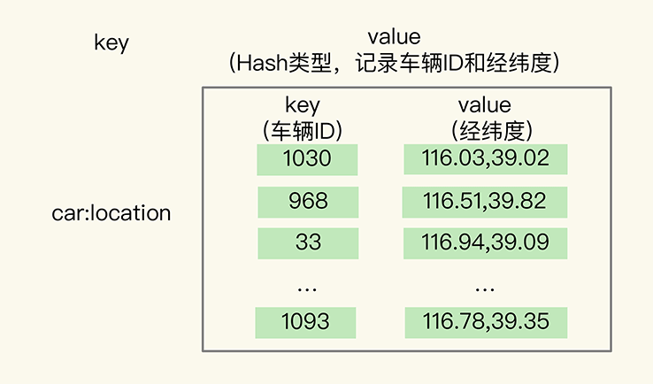
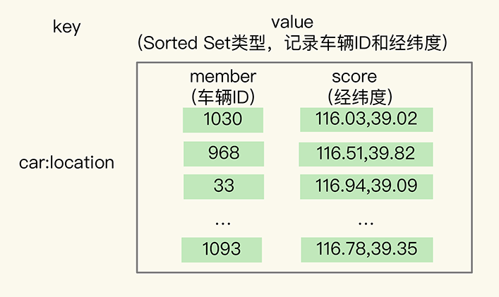
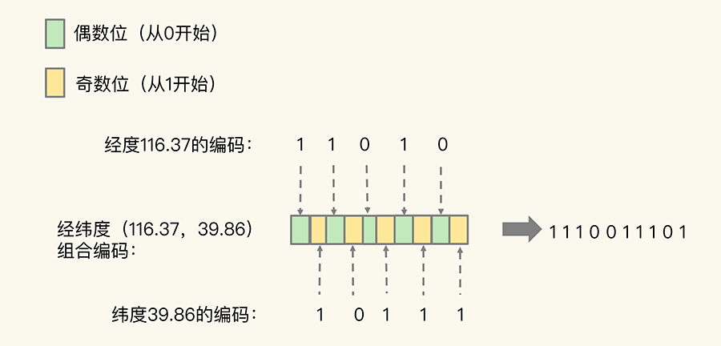
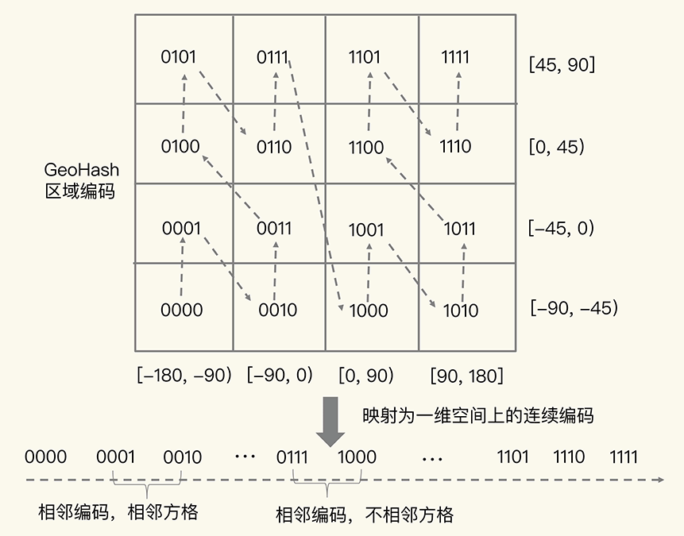

你好，我是蒋德钧。

在[第2讲](https://time.geekbang.org/column/article/268253)中，我们学习了Redis的5大基本数据类型：String、List、Hash、Set和Sorted Set，它们可以满足大多数的数据存储需求，但是在面对海量数据统计时，它们的内存开销很大，而且对于一些特殊的场景，它们是无法支持的。所以，Redis还提供了3种扩展数据类型，分别是Bitmap、HyperLogLog和GEO。前两种我在上节课已经重点介绍过了，今天，我再具体讲一讲GEO。

另外，我还会给你介绍开发自定义的新数据类型的基本步骤。掌握了自定义数据类型的开发方法，当你面临一些复杂的场景时，就不用受基本数据类型的限制，可以直接在Redis中增加定制化的数据类型，来满足你的特殊需求。

接下来，我们就先来了解下扩展数据类型GEO的实现原理和使用方法。

## 面向LBS应用的GEO数据类型

在日常生活中，我们越来越依赖搜索“附近的餐馆”、在打车软件上叫车，这些都离不开基于位置信息服务（Location-Based Service，LBS）的应用。LBS应用访问的数据是和人或物关联的一组经纬度信息，而且要能查询相邻的经纬度范围，GEO就非常适合应用在LBS服务的场景中，我们来看一下它的底层结构。

### GEO的底层结构

**一般来说，在设计一个数据类型的底层结构时，我们首先需要知道，要处理的数据有什么访问特点**。所以，我们需要先搞清楚位置信息到底是怎么被存取的。

我以叫车服务为例，来分析下LBS应用中经纬度的存取特点。

1. 每一辆网约车都有一个编号（例如33），网约车需要将自己的经度信息（例如116.034579）和纬度信息（例如39.000452 ）发给叫车应用。
2. 用户在叫车的时候，叫车应用会根据用户的经纬度位置（例如经度116.054579，纬度39.030452），查找用户的附近车辆，并进行匹配。
3. 等把位置相近的用户和车辆匹配上以后，叫车应用就会根据车辆的编号，获取车辆的信息，并返回给用户。

可以看到，一辆车（或一个用户）对应一组经纬度，并且随着车（或用户）的位置移动，相应的经纬度也会变化。

这种数据记录模式属于一个key（例如车ID）对应一个value（一组经纬度）。当有很多车辆信息要保存时，就需要有一个集合来保存一系列的key和value。Hash集合类型可以快速存取一系列的key和value，正好可以用来记录一系列车辆ID和经纬度的对应关系，所以，我们可以把不同车辆的ID和它们对应的经纬度信息存在Hash集合中，如下图所示：



同时，Hash类型的HSET操作命令，会根据key来设置相应的value值，所以，我们可以用它来快速地更新车辆变化的经纬度信息。

到这里，Hash类型看起来是一个不错的选择。但问题是，对于一个LBS应用来说，除了记录经纬度信息，还需要根据用户的经纬度信息在车辆的Hash集合中进行范围查询。一旦涉及到范围查询，就意味着集合中的元素需要有序，但Hash类型的元素是无序的，显然不能满足我们的要求。

我们再来看看使用**Sorted Set类型**是不是合适。

Sorted Set类型也支持一个key对应一个value的记录模式，其中，key就是Sorted Set中的元素，而value则是元素的权重分数。更重要的是，Sorted Set可以根据元素的权重分数排序，支持范围查询。这就能满足LBS服务中查找相邻位置的需求了。

实际上，GEO类型的底层数据结构就是用Sorted Set来实现的。咱们还是借着叫车应用的例子来加深下理解。

用Sorted Set来保存车辆的经纬度信息时，Sorted Set的元素是车辆ID，元素的权重分数是经纬度信息，如下图所示：



这时问题来了，Sorted Set元素的权重分数是一个浮点数（float类型），而一组经纬度包含的是经度和纬度两个值，是没法直接保存为一个浮点数的，那具体该怎么进行保存呢？

这就要用到GEO类型中的GeoHash编码了。

### GeoHash的编码方法

为了能高效地对经纬度进行比较，Redis采用了业界广泛使用的GeoHash编码方法，这个方法的基本原理就是“二分区间，区间编码”。

当我们要对一组经纬度进行GeoHash编码时，我们要先对经度和纬度分别编码，然后再把经纬度各自的编码组合成一个最终编码。

首先，我们来看下经度和纬度的单独编码过程。

对于一个地理位置信息来说，它的经度范围是[-180,180]。GeoHash编码会把一个经度值编码成一个N位的二进制值，我们来对经度范围[-180,180]做N次的二分区操作，其中N可以自定义。

在进行第一次二分区时，经度范围[-180,180]会被分成两个子区间：[-180,0)和[0,180]（我称之为左、右分区）。此时，我们可以查看一下要编码的经度值落在了左分区还是右分区。如果是落在左分区，我们就用0表示；如果落在右分区，就用1表示。这样一来，每做完一次二分区，我们就可以得到1位编码值。

然后，我们再对经度值所属的分区再做一次二分区，同时再次查看经度值落在了二分区后的左分区还是右分区，按照刚才的规则再做1位编码。当做完N次的二分区后，经度值就可以用一个N bit的数来表示了。

举个例子，假设我们要编码的经度值是116.37，我们用5位编码值（也就是N=5，做5次分区）。

我们先做第一次二分区操作，把经度区间[-180,180]分成了左分区[-180,0)和右分区[0,180]，此时，经度值116.37是属于右分区[0,180]，所以，我们用1表示第一次二分区后的编码值。

接下来，我们做第二次二分区：把经度值116.37所属的[0,180]区间，分成[0,90)和[90, 180]。此时，经度值116.37还是属于右分区[90,180]，所以，第二次分区后的编码值仍然为1。等到第三次对[90,180]进行二分区，经度值116.37落在了分区后的左分区[90, 135)中，所以，第三次分区后的编码值就是0。

按照这种方法，做完5次分区后，我们把经度值116.37定位在[112.5, 123.75]这个区间，并且得到了经度值的5位编码值，即11010。这个编码过程如下表所示：


对纬度的编码方式，和对经度的一样，只是纬度的范围是[-90，90]，下面这张表显示了对纬度值39.86的编码过程。


当一组经纬度值都编完码后，我们再把它们的各自编码值组合在一起，组合的规则是：最终编码值的偶数位上依次是经度的编码值，奇数位上依次是纬度的编码值，其中，偶数位从0开始，奇数位从1开始。

我们刚刚计算的经纬度（116.37，39.86）的各自编码值是11010和10111，组合之后，第0位是经度的第0位1，第1位是纬度的第0位1，第2位是经度的第1位1，第3位是纬度的第1位0，以此类推，就能得到最终编码值1110011101，如下图所示：



用了GeoHash编码后，原来无法用一个权重分数表示的一组经纬度（116.37，39.86）就可以用1110011101这一个值来表示，就可以保存为Sorted Set的权重分数了。

当然，使用GeoHash编码后，我们相当于把整个地理空间划分成了一个个方格，每个方格对应了GeoHash中的一个分区。

举个例子。我们把经度区间[-180,180]做一次二分区，把纬度区间[-90,90]做一次二分区，就会得到4个分区。我们来看下它们的经度和纬度范围以及对应的GeoHash组合编码。

- 分区一：[-180,0)和[-90,0)，编码00；
- 分区二：[-180,0)和[0,90]，编码01；
- 分区三：[0,180]和[-90,0)，编码10；
- 分区四：[0,180]和[0,90]，编码11。

这4个分区对应了4个方格，每个方格覆盖了一定范围内的经纬度值，分区越多，每个方格能覆盖到的地理空间就越小，也就越精准。我们把所有方格的编码值映射到一维空间时，相邻方格的GeoHash编码值基本也是接近的，如下图所示：


所以，我们使用Sorted Set范围查询得到的相近编码值，在实际的地理空间上，也是相邻的方格，这就可以实现LBS应用“搜索附近的人或物”的功能了。

不过，我要提醒你一句，有的编码值虽然在大小上接近，但实际对应的方格却距离比较远。例如，我们用4位来做GeoHash编码，把经度区间[-180,180]和纬度区间[-90,90]各分成了4个分区，一共16个分区，对应了16个方格。编码值为0111和1000的两个方格就离得比较远，如下图所示：



所以，为了避免查询不准确问题，我们可以同时查询给定经纬度所在的方格周围的4个或8个方格。

好了，到这里，我们就知道了，GEO类型是把经纬度所在的区间编码作为Sorted Set中元素的权重分数，把和经纬度相关的车辆ID作为Sorted Set中元素本身的值保存下来，这样相邻经纬度的查询就可以通过编码值的大小范围查询来实现了。接下来，我们再来聊聊具体如何操作GEO类型。

### 如何操作GEO类型？

在使用GEO类型时，我们经常会用到两个命令，分别是GEOADD和GEORADIUS。

- GEOADD命令：用于把一组经纬度信息和相对应的一个ID记录到GEO类型集合中；
- GEORADIUS命令：会根据输入的经纬度位置，查找以这个经纬度为中心的一定范围内的其他元素。当然，我们可以自己定义这个范围。

我还是以叫车应用的车辆匹配场景为例，介绍下具体如何使用这两个命令。

假设车辆ID是33，经纬度位置是（116.034579，39.030452），我们可以用一个GEO集合保存所有车辆的经纬度，集合key是cars:locations。执行下面的这个命令，就可以把ID号为33的车辆的当前经纬度位置存入GEO集合中：

```
GEOADD cars:locations 116.034579 39.030452 33
```

当用户想要寻找自己附近的网约车时，LBS应用就可以使用GEORADIUS命令。

例如，LBS应用执行下面的命令时，Redis会根据输入的用户的经纬度信息（116.054579，39.030452 ），查找以这个经纬度为中心的5公里内的车辆信息，并返回给LBS应用。当然， 你可以修改“5”这个参数，来返回更大或更小范围内的车辆信息。

```
GEORADIUS cars:locations 116.054579 39.030452 5 km ASC COUNT 10
```

另外，我们还可以进一步限定返回的车辆信息。

比如，我们可以使用ASC选项，让返回的车辆信息按照距离这个中心位置从近到远的方式来排序，以方便选择最近的车辆；还可以使用COUNT选项，指定返回的车辆信息的数量。毕竟，5公里范围内的车辆可能有很多，如果返回全部信息，会占用比较多的数据带宽，这个选项可以帮助控制返回的数据量，节省带宽。

可以看到，使用GEO数据类型可以非常轻松地操作经纬度这种信息。

虽然我们有了5种基本类型和3种扩展数据类型，但是有些场景下，我们对数据类型会有特殊需求，例如，我们需要一个数据类型既能像Hash那样支持快速的单键查询，又能像Sorted Set那样支持范围查询，此时，我们之前学习的这些数据类型就无法满足需求了。那么，接下来，我就再向你介绍下Redis扩展数据类型的终极版——自定义的数据类型。这样，你就可以定制符合自己需求的数据类型了，不管你的应用场景怎么变化，你都不用担心没有合适的数据类型。

## 如何自定义数据类型？

为了实现自定义数据类型，首先，我们需要了解Redis的基本对象结构RedisObject，因为Redis键值对中的每一个值都是用RedisObject保存的。

我在[第11讲](https://time.geekbang.org/column/article/279649)中说过，RedisObject包括元数据和指针。其中，元数据的一个功能就是用来区分不同的数据类型，指针用来指向具体的数据类型的值。所以，要想开发新数据类型，我们就先来了解下RedisObject的元数据和指针。

### Redis的基本对象结构

RedisObject的内部组成包括了type、encoding、lru和refcount 4个元数据，以及1个`*ptr`指针。

- type：表示值的类型，涵盖了我们前面学习的五大基本类型；
- encoding：是值的编码方式，用来表示Redis中实现各个基本类型的底层数据结构，例如SDS、压缩列表、哈希表、跳表等；
- lru：记录了这个对象最后一次被访问的时间，用于淘汰过期的键值对；
- refcount：记录了对象的引用计数；
- *ptr：是指向数据的指针。


RedisObject结构借助`*ptr`指针，就可以指向不同的数据类型，例如，`*ptr`指向一个SDS或一个跳表，就表示键值对中的值是String类型或Sorted Set类型。所以，我们在定义了新的数据类型后，也只要在RedisObject中设置好新类型的type和encoding，再用`*ptr`指向新类型的实现，就行了。

### 开发一个新的数据类型

了解了RedisObject结构后，定义一个新的数据类型也就不难了。首先，我们需要为新数据类型定义好它的底层结构、type和encoding属性值，然后再实现新数据类型的创建、释放函数和基本命令。

接下来，我以开发一个名字叫作NewTypeObject的新数据类型为例，来解释下具体的4个操作步骤。


**第一步：定义新数据类型的底层结构**

我们用newtype.h文件来保存这个新类型的定义，具体定义的代码如下所示：

```
struct NewTypeObject {
    struct NewTypeNode *head; 
    size_t len; 
}NewTypeObject;
```

其中，NewTypeNode结构就是我们自定义的新类型的底层结构。我们为底层结构设计两个成员变量：一个是Long类型的value值，用来保存实际数据；一个是`*next`指针，指向下一个NewTypeNode结构。

```
struct NewTypeNode {
    long value;
    struct NewTypeNode *next;
};
```

从代码中可以看到，NewTypeObject类型的底层结构其实就是一个Long类型的单向链表。当然，你还可以根据自己的需求，把NewTypeObject的底层结构定义为其他类型。例如，如果我们想要NewTypeObject的查询效率比链表高，就可以把它的底层结构设计成一颗B+树。

**第二步：在RedisObject的type属性中，增加这个新类型的定义**

这个定义是在Redis的server.h文件中。比如，我们增加一个叫作OBJ_NEWTYPE的宏定义，用来在代码中指代NewTypeObject这个新类型。

```
#define OBJ_STRING 0    /* String object. */
#define OBJ_LIST 1      /* List object. */
#define OBJ_SET 2       /* Set object. */
#define OBJ_ZSET 3      /* Sorted set object. */
…
#define OBJ_NEWTYPE 7
```

**第三步：开发新类型的创建和释放函数**

Redis把数据类型的创建和释放函数都定义在了object.c文件中。所以，我们可以在这个文件中增加NewTypeObject的创建函数createNewTypeObject，如下所示：

```
robj *createNewTypeObject(void){
   NewTypeObject *h = newtypeNew(); 
   robj *o = createObject(OBJ_NEWTYPE,h);
   return o;
}
```

createNewTypeObject分别调用了newtypeNew和createObject两个函数，我分别来介绍下。

先说newtypeNew函数。它是用来为新数据类型初始化内存结构的。这个初始化过程主要是用zmalloc做底层结构分配空间，以便写入数据。

```
NewTypeObject *newtypeNew(void){
    NewTypeObject *n = zmalloc(sizeof(*n));
    n->head = NULL;
    n->len = 0;
    return n;
}
```

newtypeNew函数涉及到新数据类型的具体创建，而Redis默认会为每个数据类型定义一个单独文件，实现这个类型的创建和命令操作，例如，t_string.c和t_list.c分别对应String和List类型。按照Redis的惯例，我们就把newtypeNew函数定义在名为t_newtype.c的文件中。

createObject是Redis本身提供的RedisObject创建函数，它的参数是数据类型的type和指向数据类型实现的指针`*ptr`。

我们给createObject函数中传入了两个参数，分别是新类型的type值OBJ_NEWTYPE，以及指向一个初始化过的NewTypeObjec的指针。这样一来，创建的RedisObject就能指向我们自定义的新数据类型了。

```
robj *createObject(int type, void *ptr) {
    robj *o = zmalloc(sizeof(*o));
    o->type = type;
    o->ptr = ptr;
    ...
    return o;
}
```

对于释放函数来说，它是创建函数的反过程，是用zfree命令把新结构的内存空间释放掉。

**第四步：开发新类型的命令操作**

简单来说，增加相应的命令操作的过程可以分成三小步：

1.在t_newtype.c文件中增加命令操作的实现。比如说，我们定义ntinsertCommand函数，由它实现对NewTypeObject单向链表的插入操作：

```
void ntinsertCommand(client *c){
  //基于客户端传递的参数，实现在NewTypeObject链表头插入元素
}
```

2.在server.h文件中，声明我们已经实现的命令，以便在server.c文件引用这个命令，例如：

```
void ntinsertCommand(client *c)
```

3.在server.c文件中的redisCommandTable里面，把新增命令和实现函数关联起来。例如，新增的ntinsert命令由ntinsertCommand函数实现，我们就可以用ntinsert命令给NewTypeObject数据类型插入元素了。

```
struct redisCommand redisCommandTable[] = { 
...
{"ntinsert",ntinsertCommand,2,"m",...}
}
```

此时，我们就完成了一个自定义的NewTypeObject数据类型，可以实现基本的命令操作了。当然，如果你还希望新的数据类型能被持久化保存，我们还需要在Redis的RDB和AOF模块中增加对新数据类型进行持久化保存的代码，我会在后面的加餐中再和你分享。

## 小结

这节课，我们学习了Redis的扩展数据类型GEO。GEO可以记录经纬度形式的地理位置信息，被广泛地应用在LBS服务中。GEO本身并没有设计新的底层数据结构，而是直接使用了Sorted Set集合类型。

GEO类型使用GeoHash编码方法实现了经纬度到Sorted Set中元素权重分数的转换，这其中的两个关键机制就是对二维地图做区间划分，以及对区间进行编码。一组经纬度落在某个区间后，就用区间的编码值来表示，并把编码值作为Sorted Set元素的权重分数。这样一来，我们就可以把经纬度保存到Sorted Set中，利用Sorted Set提供的“按权重进行有序范围查找”的特性，实现LBS服务中频繁使用的“搜索附近”的需求。

GEO属于Redis提供的扩展数据类型。扩展数据类型有两种实现途径：一种是基于现有的数据类型，通过数据编码或是实现新的操作的方式，来实现扩展数据类型，例如基于Sorted Set和GeoHash编码实现GEO，以及基于String和位操作实现Bitmap；另一种就是开发自定义的数据类型，具体的操作是增加新数据类型的定义，实现创建和释放函数，实现新数据类型支持的命令操作，建议你尝试着把今天学到的内容灵活地应用到你的工作场景中。

## 每课一问

到今天为止，我们已经学习Redis的5大基本数据类型和3个扩展数据类型，我想请你来聊一聊，你在日常的实践过程中，还用过Redis的其他数据类型吗？

欢迎在留言区分享你使用过的其他数据类型，我们一起来交流学习。如果你身边还有想要自己开发Redis的新数据类型的朋友，也希望你帮我把今天的内容分享给他/她。我们下节课见。

- 