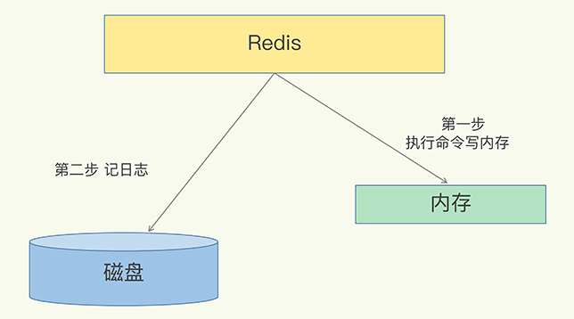
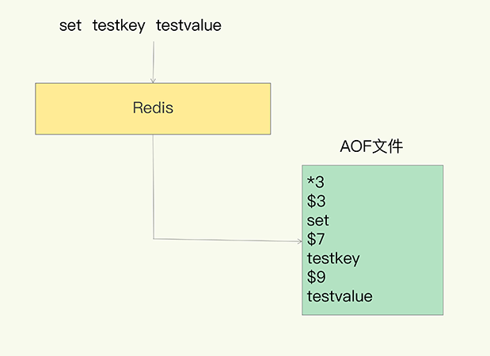
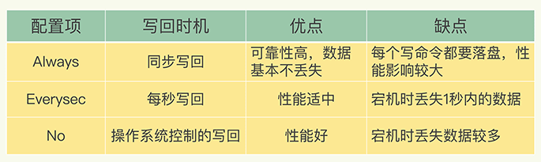
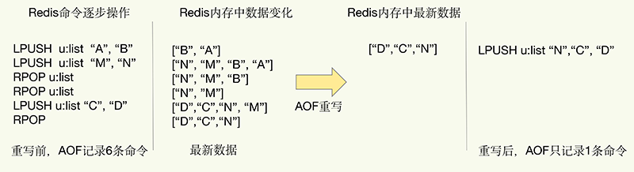
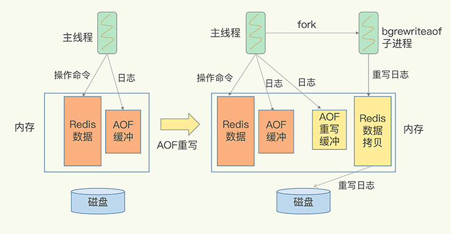
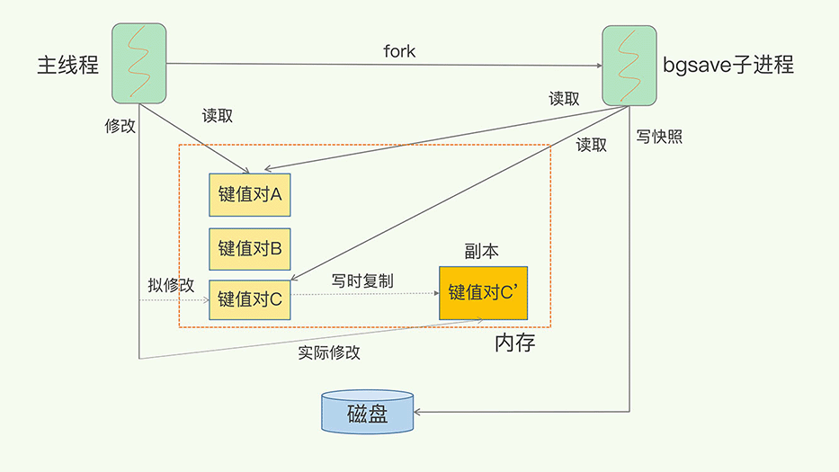
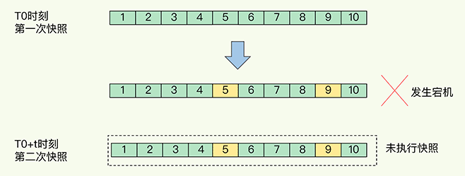
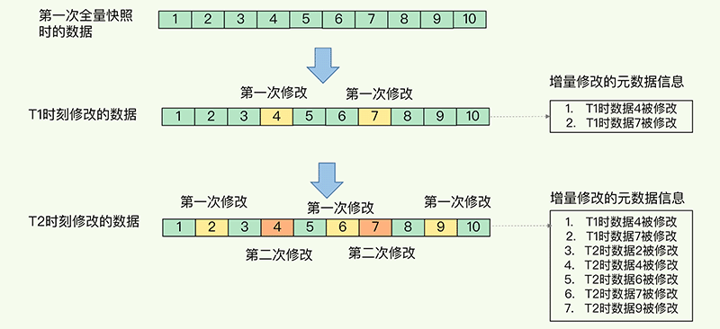
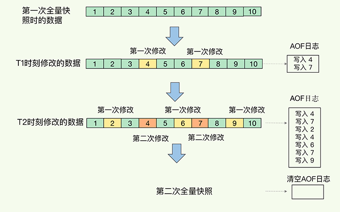

目前，Redis的持久化主要有两大机制，即AOF（Append Only File）日志和RDB快照。

# AOF

## AOF日志是如何实现的？

说到日志，我们比较熟悉的是数据库的写前日志（Write Ahead Log, WAL），也就是说，在实际写数据前，先把修改的数据记到日志文件中，以便故障时进行恢复。不过，AOF日志正好相反，它是写后日志，“写后”的意思是Redis是先执行命令，把数据写入内存，然后才记录日志，如下图所示：

那AOF为什么要先执行命令再记日志呢？要回答这个问题，我们要先知道AOF里记录了什么内容。

传统数据库的日志，例如redo log（重做日志），记录的是修改后的数据，而AOF里记录的是Redis收到的每一条命令，这些命令是以文本形式保存的。

我们以Redis收到“set testkey testvalue”命令后记录的日志为例，看看AOF日志的内容。其中，“`*3`”表示当前命令有三个部分，每部分都是由“`$+数字`”开头，后面紧跟着具体的命令、键或值。这里，“数字”表示这部分中的命令、键或值一共有多少字节。例如，“`$3 set`”表示这部分有3个字节，也就是“set”命令。

但是，为了避免额外的检查开销，Redis在向AOF里面记录日志的时候，并不会先去对这些命令进行语法检查。所以，如果先记日志再执行命令的话，日志中就有可能记录了错误的命令，Redis在使用日志恢复数据时，就可能会出错。

而写后日志这种方式，就是先让系统执行命令，只有命令能执行成功，才会被记录到日志中，否则，系统就会直接向客户端报错。所以，Redis使用写后日志这一方式的一大好处是，可以避免出现记录错误命令的情况。

除此之外，AOF还有一个好处：它是在命令执行后才记录日志，所以**不会阻塞当前的写操作**。

不过，AOF也有两个潜在的风险。

首先，如果刚执行完一个命令，还没有来得及记日志就宕机了，那么这个命令和相应的数据就有丢失的风险。如果此时Redis是用作缓存，还可以从后端数据库重新读入数据进行恢复，但是，如果Redis是直接用作数据库的话，此时，因为命令没有记入日志，所以就无法用日志进行恢复了。

其次，AOF虽然避免了对当前命令的阻塞，但可能会给下一个操作带来阻塞风险。这是因为，AOF日志也是在主线程中执行的，如果在把日志文件写入磁盘时，磁盘写压力大，就会导致写盘很慢，进而导致后续的操作也无法执行了。

仔细分析的话，你就会发现，这两个风险都是和AOF写回磁盘的时机相关的。这也就意味着，如果我们能够控制一个写命令执行完后AOF日志写回磁盘的时机，这两个风险就解除了。

## 三种写回策略

其实，对于这个问题，AOF机制给我们提供了三个选择，也就是AOF配置项appendfsync的三个可选值。

- **Always**，同步写回：每个写命令执行完，立马同步地将日志写回磁盘；
- **Everysec**，每秒写回：每个写命令执行完，只是先把日志写到AOF文件的内存缓冲区，每隔一秒把缓冲区中的内容写入磁盘；
- **No**，操作系统控制的写回：每个写命令执行完，只是先把日志写到AOF文件的内存缓冲区，由操作系统决定何时将缓冲区内容写回磁盘。

针对避免主线程阻塞和减少数据丢失问题，这三种写回策略都无法做到两全其美。我们来分析下其中的原因。

- “同步写回”可以做到基本不丢数据，但是它在每一个写命令后都有一个慢速的落盘操作，不可避免地会影响主线程性能；
- 虽然“操作系统控制的写回”在写完缓冲区后，就可以继续执行后续的命令，但是落盘的时机已经不在Redis手中了，只要AOF记录没有写回磁盘，一旦宕机对应的数据就丢失了；
- “每秒写回”采用一秒写回一次的频率，避免了“同步写回”的性能开销，虽然减少了对系统性能的影响，但是如果发生宕机，上一秒内未落盘的命令操作仍然会丢失。所以，这只能算是，在避免影响主线程性能和避免数据丢失两者间取了个折中。

我把这三种策略的写回时机，以及优缺点汇总在了一张表格里，以方便你随时查看。

到这里，我们就可以根据系统对高性能和高可靠性的要求，来选择使用哪种写回策略了。总结一下就是：想要获得高性能，就选择No策略；如果想要得到高可靠性保证，就选择Always策略；如果允许数据有一点丢失，又希望性能别受太大影响的话，那么就选择Everysec策略。

但是，按照系统的性能需求选定了写回策略，并不是“高枕无忧”了。毕竟，AOF是以文件的形式在记录接收到的所有写命令。随着接收的写命令越来越多，AOF文件会越来越大。这也就意味着，我们一定要小心AOF文件过大带来的性能问题。

这里的“性能问题”，主要在于以下三个方面：一是，文件系统本身对文件大小有限制，无法保存过大的文件；二是，如果文件太大，之后再往里面追加命令记录的话，效率也会变低；三是，如果发生宕机，AOF中记录的命令要一个个被重新执行，用于故障恢复，如果日志文件太大，整个恢复过程就会非常缓慢，这就会影响到Redis的正常使用。

所以，我们就要采取一定的控制手段，这个时候，**AOF重写机制**就登场了。

## 日志文件太大了怎么办？

简单来说，AOF重写机制就是在重写时，Redis根据数据库的现状创建一个新的AOF文件，也就是说，读取数据库中的所有键值对，然后对每一个键值对用一条命令记录它的写入。比如说，当读取了键值对“testkey”: “testvalue”之后，重写机制会记录set testkey testvalue这条命令。这样，当需要恢复时，可以重新执行该命令，实现“testkey”: “testvalue”的写入。

为什么重写机制可以把日志文件变小呢? 实际上，重写机制具有“多变一”功能。所谓的“多变一”，也就是说，旧日志文件中的多条命令，在重写后的新日志中变成了一条命令。

我们知道，AOF文件是以追加的方式，逐一记录接收到的写命令的。当一个键值对被多条写命令反复修改时，AOF文件会记录相应的多条命令。但是，在重写的时候，是根据这个键值对当前的最新状态，为它生成对应的写入命令。这样一来，一个键值对在重写日志中只用一条命令就行了，而且，在日志恢复时，只用执行这条命令，就可以直接完成这个键值对的写入了。

下面这张图就是一个例子：

当我们对一个列表先后做了6次修改操作后，列表的最后状态是[“D”, “C”, “N”]，此时，只用LPUSH u:list “N”, “C”, "D"这一条命令就能实现该数据的恢复，这就节省了五条命令的空间。对于被修改过成百上千次的键值对来说，重写能节省的空间当然就更大了。

不过，虽然AOF重写后，日志文件会缩小，但是，要把整个数据库的最新数据的操作日志都写回磁盘，仍然是一个非常耗时的过程。这时，我们就要继续关注另一个问题了：重写会不会阻塞主线程？

## AOF重写会阻塞吗?

和AOF日志由主线程写回不同，重写过程是由后台子进程bgrewriteaof来完成的，这也是为了避免阻塞主线程，导致数据库性能下降。

我把重写的过程总结为“**一个拷贝，两处日志**”。

“一个拷贝”就是指，每次执行重写时，主线程fork出后台的bgrewriteaof子进程。此时，fork会把主线程的内存拷贝一份给bgrewriteaof子进程，这里面就包含了数据库的最新数据。然后，bgrewriteaof子进程就可以在不影响主线程的情况下，逐一把拷贝的数据写成操作，记入重写日志。

“两处日志”又是什么呢？

因为主线程未阻塞，仍然可以处理新来的操作。此时，如果有写操作，第一处日志就是指正在使用的AOF日志，Redis会把这个操作写到它的缓冲区。这样一来，即使宕机了，这个AOF日志的操作仍然是齐全的，可以用于恢复。

而第二处日志，就是指新的AOF重写日志。这个操作也会被写到重写日志的缓冲区。这样，重写日志也不会丢失最新的操作。等到拷贝数据的所有操作记录重写完成后，重写日志记录的这些最新操作也会写入新的AOF文件，以保证数据库最新状态的记录。此时，我们就可以用新的AOF文件替代旧文件了。

总结来说，每次AOF重写时，Redis会先执行一个内存拷贝，用于重写；然后，使用两个日志保证在重写过程中，新写入的数据不会丢失。而且，因为Redis采用额外的线程进行数据重写，所以，这个过程并不会阻塞主线程。

## 小结

这节课，我向你介绍了Redis用于避免数据丢失的AOF方法。这个方法通过逐一记录操作命令，在恢复时再逐一执行命令的方式，保证了数据的可靠性。

这个方法看似“简单”，但也是充分考虑了对Redis性能的影响。总结来说，它提供了AOF日志的三种写回策略，分别是Always、Everysec和No，这三种策略在可靠性上是从高到低，而在性能上则是从低到高。

此外，为了避免日志文件过大，Redis还提供了AOF重写机制，直接根据数据库里数据的最新状态，生成这些数据的插入命令，作为新日志。这个过程通过后台线程完成，避免了对主线程的阻塞。

其中，三种写回策略体现了系统设计中的一个重要原则 ，即trade-off，或者称为“取舍”，指的就是在性能和可靠性保证之间做取舍。我认为，这是做系统设计和开发的一个关键哲学，我也非常希望，你能充分地理解这个原则，并在日常开发中加以应用。

不过，你可能也注意到了，落盘时机和重写机制都是在“记日志”这一过程中发挥作用的。例如，落盘时机的选择可以避免记日志时阻塞主线程，重写可以避免日志文件过大。但是，在“用日志”的过程中，也就是使用AOF进行故障恢复时，我们仍然需要把所有的操作记录都运行一遍。再加上Redis的单线程设计，这些命令操作只能一条一条按顺序执行，这个“重放”的过程就会很慢了。

那么，有没有既能避免数据丢失，又能更快地恢复的方法呢？当然有，那就是RDB快照了。下节课，我们就一起学习一下，敬请期待。

## 每课一问

这节课，我给你提两个小问题：

1. AOF日志重写的时候，是由bgrewriteaof子进程来完成的，不用主线程参与，我们今天说的非阻塞也是指子进程的执行不阻塞主线程。但是，你觉得，这个重写过程有没有其他潜在的阻塞风险呢？如果有的话，会在哪里阻塞？
2. AOF重写也有一个重写日志，为什么它不共享使用AOF本身的日志呢？

> 问题1，Redis采用fork子进程重写AOF文件时，潜在的阻塞风险包括：fork子进程 和 AOF重写过程中父进程产生写入的场景，下面依次介绍。
>
> a、fork子进程，fork这个瞬间一定是会阻塞主线程的（注意，fork时并不会一次性拷贝所有内存数据给子进程，老师文章写的是拷贝所有内存数据给子进程，我个人认为是有歧义的），fork采用操作系统提供的写实复制(Copy On Write)机制，就是为了避免一次性拷贝大量内存数据给子进程造成的长时间阻塞问题，但fork子进程需要拷贝进程必要的数据结构，其中有一项就是拷贝内存页表（虚拟内存和物理内存的映射索引表），这个拷贝过程会消耗大量CPU资源，拷贝完成之前整个进程是会阻塞的，阻塞时间取决于整个实例的内存大小，实例越大，内存页表越大，fork阻塞时间越久。拷贝内存页表完成后，子进程与父进程指向相同的内存地址空间，也就是说此时虽然产生了子进程，但是并没有申请与父进程相同的内存大小。那什么时候父子进程才会真正内存分离呢？“写实复制”顾名思义，就是在写发生时，才真正拷贝内存真正的数据，这个过程中，父进程也可能会产生阻塞的风险，就是下面介绍的场景。
>
> b、fork出的子进程指向与父进程相同的内存地址空间，此时子进程就可以执行AOF重写，把内存中的所有数据写入到AOF文件中。但是此时父进程依旧是会有流量写入的，如果父进程操作的是一个已经存在的key，那么这个时候父进程就会真正拷贝这个key对应的内存数据，申请新的内存空间，这样逐渐地，父子进程内存数据开始分离，父子进程逐渐拥有各自独立的内存空间。因为内存分配是以页为单位进行分配的，默认4k，如果父进程此时操作的是一个bigkey，重新申请大块内存耗时会变长，可能会产阻塞风险。另外，如果操作系统开启了内存大页机制(Huge Page，页面大小2M)，那么父进程申请内存时阻塞的概率将会大大提高，所以在Redis机器上需要关闭Huge Page机制。Redis每次fork生成RDB或AOF重写完成后，都可以在Redis log中看到父进程重新申请了多大的内存空间。
>
> 问题2，AOF重写不复用AOF本身的日志，一个原因是父子进程写同一个文件必然会产生竞争问题，控制竞争就意味着会影响父进程的性能。二是如果AOF重写过程中失败了，那么原本的AOF文件相当于被污染了，无法做恢复使用。所以Redis AOF重写一个新文件，重写失败的话，直接删除这个文件就好了，不会对原先的AOF文件产生影响。等重写完成之后，直接替换旧文件即可。
>
> 作者回复: 非常赞！这个回答一定要置顶！
>
> 而且Kaito同学的不少问题回答都非常仔细和精彩，非常值得一读！
>
> 这里要谢谢Kaito同学指出的文章中的歧义：fork子进程时，子进程是会拷贝父进程的页表，即虚实映射关系，而不会拷贝物理内存。子进程复制了父进程页表，也能共享访问父进程的内存数据了，此时，类似于有了父进程的所有内存数据。我的描述不太严谨了，非常感谢指出！
>
> Kaito同学还提到了Huge page。这个特性大家在使用Redis也要注意。Huge page对提升TLB命中率比较友好，因为在相同的内存容量下，使用huge page可以减少页表项，TLB就可以缓存更多的页表项，能减少TLB miss的开销。
>
> 但是，这个机制对于Redis这种喜欢用fork的系统来说，的确不太友好，尤其是在Redis的写入请求比较多的情况下。因为fork后，父进程修改数据采用写时复制，复制的粒度为一个内存页。如果只是修改一个256B的数据，父进程需要读原来的内存页，然后再映射到新的物理地址写入。一读一写会造成读写放大。如果内存页越大（例如2MB的大页），那么读写放大也就越严重，对Redis性能造成影响。
>
> Huge page在实际使用Redis时是建议关掉的。

# RDB

Redis避免数据丢失的AOF方法。这个方法的好处，是每次执行只需要记录操作命令，需要持久化的数据量不大。一般而言，只要你采用的不是always的持久化策略，就不会对性能造成太大影响。

但是，也正因为记录的是操作命令，而不是实际的数据，所以，用AOF方法进行故障恢复的时候，需要逐一把操作日志都执行一遍。如果操作日志非常多，Redis就会恢复得很缓慢，影响到正常使用。这当然不是理想的结果。那么，还有没有既可以保证可靠性，还能在宕机时实现快速恢复的其他方法呢？

当然有了，这就是我们今天要一起学习的另一种持久化方法：**内存快照**。所谓内存快照，就是指内存中的数据在某一个时刻的状态记录。这就类似于照片，当你给朋友拍照时，一张照片就能把朋友一瞬间的形象完全记下来。

对Redis来说，它实现类似照片记录效果的方式，就是把某一时刻的状态以文件的形式写到磁盘上，也就是快照。这样一来，即使宕机，快照文件也不会丢失，数据的可靠性也就得到了保证。这个快照文件就称为RDB文件，其中，RDB就是Redis DataBase的缩写。

和AOF相比，RDB记录的是某一时刻的数据，并不是操作，所以，在做数据恢复时，我们可以直接把RDB文件读入内存，很快地完成恢复。听起来好像很不错，但内存快照也并不是最优选项。为什么这么说呢？

我们还要考虑两个关键问题：

- 对哪些数据做快照？这关系到快照的执行效率问题；
- 做快照时，数据还能被增删改吗？这关系到Redis是否被阻塞，能否同时正常处理请求。

这么说可能你还不太好理解，我还是拿拍照片来举例子。我们在拍照时，通常要关注两个问题：

- 如何取景？也就是说，我们打算把哪些人、哪些物拍到照片中；
- 在按快门前，要记着提醒朋友不要乱动，否则拍出来的照片就模糊了。

你看，这两个问题是不是非常重要呢？那么，接下来，我们就来具体地聊一聊。先说“取景”问题，也就是我们对哪些数据做快照。

## 给哪些内存数据做快照？

Redis的数据都在内存中，为了提供所有数据的可靠性保证，它执行的是**全量快照**，也就是说，把内存中的所有数据都记录到磁盘中，这就类似于给100个人拍合影，把每一个人都拍进照片里。这样做的好处是，一次性记录了所有数据，一个都不少。

当你给一个人拍照时，只用协调一个人就够了，但是，拍100人的大合影，却需要协调100个人的位置、状态，等等，这当然会更费时费力。同样，给内存的全量数据做快照，把它们全部写入磁盘也会花费很多时间。而且，全量数据越多，RDB文件就越大，往磁盘上写数据的时间开销就越大。

对于Redis而言，它的单线程模型就决定了，我们要尽量避免所有会阻塞主线程的操作，所以，针对任何操作，我们都会提一个灵魂之问：“它会阻塞主线程吗?”RDB文件的生成是否会阻塞主线程，这就关系到是否会降低Redis的性能。

Redis提供了两个命令来生成RDB文件，分别是save和bgsave。

- save：在主线程中执行，会导致阻塞；
- bgsave：创建一个子进程，专门用于写入RDB文件，避免了主线程的阻塞，这也是Redis RDB文件生成的默认配置。

好了，这个时候，我们就可以通过bgsave命令来执行全量快照，这既提供了数据的可靠性保证，也避免了对Redis的性能影响。

接下来，我们要关注的问题就是，在对内存数据做快照时，这些数据还能“动”吗? 也就是说，这些数据还能被修改吗？ 这个问题非常重要，这是因为，如果数据能被修改，那就意味着Redis还能正常处理写操作。否则，所有写操作都得等到快照完了才能执行，性能一下子就降低了。

## 快照时数据能修改吗?

在给别人拍照时，一旦对方动了，那么这张照片就拍糊了，我们就需要重拍，所以我们当然希望对方保持不动。对于内存快照而言，我们也不希望数据“动”。

举个例子。我们在时刻t给内存做快照，假设内存数据量是4GB，磁盘的写入带宽是0.2GB/s，简单来说，至少需要20s（4/0.2 = 20）才能做完。如果在时刻t+5s时，一个还没有被写入磁盘的内存数据A，被修改成了A’，那么就会破坏快照的完整性，因为A’不是时刻t时的状态。因此，和拍照类似，我们在做快照时也不希望数据“动”，也就是不能被修改。

但是，如果快照执行期间数据不能被修改，是会有潜在问题的。对于刚刚的例子来说，在做快照的20s时间里，如果这4GB的数据都不能被修改，Redis就不能处理对这些数据的写操作，那无疑就会给业务服务造成巨大的影响。

你可能会想到，可以用bgsave避免阻塞啊。这里我就要说到一个常见的误区了，**避免阻塞和正常处理写操作并不是一回事**。此时，主线程的确没有阻塞，可以正常接收请求，但是，为了保证快照完整性，它只能处理读操作，因为不能修改正在执行快照的数据。

为了快照而暂停写操作，肯定是不能接受的。所以这个时候，Redis就会借助操作系统提供的写时复制技术（Copy-On-Write, COW），在执行快照的同时，正常处理写操作。

简单来说，bgsave子进程是由主线程fork生成的，可以共享主线程的所有内存数据。bgsave子进程运行后，开始读取主线程的内存数据，并把它们写入RDB文件。

此时，如果主线程对这些数据也都是读操作（例如图中的键值对A），那么，主线程和bgsave子进程相互不影响。但是，如果主线程要修改一块数据（例如图中的键值对C），那么，这块数据就会被复制一份，生成该数据的副本（键值对C’）。然后，主线程在这个数据副本上进行修改。同时，bgsave子进程可以继续把原来的数据（键值对C）写入RDB文件。

这既保证了快照的完整性，也允许主线程同时对数据进行修改，避免了对正常业务的影响。

到这里，我们就解决了对“哪些数据做快照”以及“做快照时数据能否修改”这两大问题：Redis会使用bgsave对当前内存中的所有数据做快照，这个操作是子进程在后台完成的，这就允许主线程同时可以修改数据。

现在，我们再来看另一个问题：多久做一次快照？我们在拍照的时候，还有项技术叫“连拍”，可以记录人或物连续多个瞬间的状态。那么，快照也适合“连拍”吗？

## 可以每秒做一次快照吗？

对于快照来说，所谓“连拍”就是指连续地做快照。这样一来，快照的间隔时间变得很短，即使某一时刻发生宕机了，因为上一时刻快照刚执行，丢失的数据也不会太多。但是，这其中的快照间隔时间就很关键了。

如下图所示，我们先在T0时刻做了一次快照，然后又在T0+t时刻做了一次快照，在这期间，数据块5和9被修改了。如果在t这段时间内，机器宕机了，那么，只能按照T0时刻的快照进行恢复。此时，数据块5和9的修改值因为没有快照记录，就无法恢复了。

所以，要想尽可能恢复数据，t值就要尽可能小，t越小，就越像“连拍”。那么，t值可以小到什么程度呢，比如说是不是可以每秒做一次快照？毕竟，每次快照都是由bgsave子进程在后台执行，也不会阻塞主线程。

这种想法其实是错误的。虽然bgsave执行时不阻塞主线程，但是，**如果频繁地执行全量快照，也会带来两方面的开销**。

一方面，频繁将全量数据写入磁盘，会给磁盘带来很大压力，多个快照竞争有限的磁盘带宽，前一个快照还没有做完，后一个又开始做了，容易造成恶性循环。

另一方面，bgsave子进程需要通过fork操作从主线程创建出来。虽然，子进程在创建后不会再阻塞主线程，但是，fork这个创建过程本身会阻塞主线程，而且主线程的内存越大，阻塞时间越长。如果频繁fork出bgsave子进程，这就会频繁阻塞主线程了（所以，在Redis中如果有一个bgsave在运行，就不会再启动第二个bgsave子进程）。那么，有什么其他好方法吗？

此时，我们可以做增量快照，所谓增量快照，就是指，做了一次全量快照后，后续的快照只对修改的数据进行快照记录，这样可以避免每次全量快照的开销。

在第一次做完全量快照后，T1和T2时刻如果再做快照，我们只需要将被修改的数据写入快照文件就行。但是，这么做的前提是，**我们需要记住哪些数据被修改了**。你可不要小瞧这个“记住”功能，它需要我们使用额外的元数据信息去记录哪些数据被修改了，这会带来额外的空间开销问题。如下图所示：

如果我们对每一个键值对的修改，都做个记录，那么，如果有1万个被修改的键值对，我们就需要有1万条额外的记录。而且，有的时候，键值对非常小，比如只有32字节，而记录它被修改的元数据信息，可能就需要8字节，这样的画，为了“记住”修改，引入的额外空间开销比较大。这对于内存资源宝贵的Redis来说，有些得不偿失。

到这里，你可以发现，虽然跟AOF相比，快照的恢复速度快，但是，快照的频率不好把握，如果频率太低，两次快照间一旦宕机，就可能有比较多的数据丢失。如果频率太高，又会产生额外开销，那么，还有什么方法既能利用RDB的快速恢复，又能以较小的开销做到尽量少丢数据呢？

Redis 4.0中提出了一个**混合使用AOF日志和内存快照**的方法。简单来说，内存快照以一定的频率执行，在两次快照之间，使用AOF日志记录这期间的所有命令操作。

这样一来，快照不用很频繁地执行，这就避免了频繁fork对主线程的影响。而且，AOF日志也只用记录两次快照间的操作，也就是说，不需要记录所有操作了，因此，就不会出现文件过大的情况了，也可以避免重写开销。

如下图所示，T1和T2时刻的修改，用AOF日志记录，等到第二次做全量快照时，就可以清空AOF日志，因为此时的修改都已经记录到快照中了，恢复时就不再用日志了。

这个方法既能享受到RDB文件快速恢复的好处，又能享受到AOF只记录操作命令的简单优势，颇有点“鱼和熊掌可以兼得”的感觉，建议你在实践中用起来。

## 小结

这节课，我们学习了Redis用于避免数据丢失的内存快照方法。这个方法的优势在于，可以快速恢复数据库，也就是只需要把RDB文件直接读入内存，这就避免了AOF需要顺序、逐一重新执行操作命令带来的低效性能问题。

不过，内存快照也有它的局限性。它拍的是一张内存的“大合影”，不可避免地会耗时耗力。虽然，Redis设计了bgsave和写时复制方式，尽可能减少了内存快照对正常读写的影响，但是，频繁快照仍然是不太能接受的。而混合使用RDB和AOF，正好可以取两者之长，避两者之短，以较小的性能开销保证数据可靠性和性能。

最后，关于AOF和RDB的选择问题，我想再给你提三点建议：

- 数据不能丢失时，内存快照和AOF的混合使用是一个很好的选择；
- 如果允许分钟级别的数据丢失，可以只使用RDB；
- 如果只用AOF，优先使用everysec的配置选项，因为它在可靠性和性能之间取了一个平衡。

## 每课一问

我曾碰到过这么一个场景：我们使用一个2核CPU、4GB内存、500GB磁盘的云主机运行Redis，Redis数据库的数据量大小差不多是2GB，我们使用了RDB做持久化保证。当时Redis的运行负载以修改操作为主，写读比例差不多在8:2左右，也就是说，如果有100个请求，80个请求执行的是修改操作。你觉得，在这个场景下，用RDB做持久化有什么风险吗？你能帮着一起分析分析吗？

> 2核CPU、4GB内存、500G磁盘，Redis实例占用2GB，写读比例为8:2，此时做RDB持久化，产生的风险主要在于 CPU资源 和 内存资源 这2方面：
>
> a、内存资源风险：Redis fork子进程做RDB持久化，由于写的比例为80%，那么在持久化过程中，“写实复制”会重新分配整个实例80%的内存副本，大约需要重新分配1.6GB内存空间，这样整个系统的内存使用接近饱和，如果此时父进程又有大量新key写入，很快机器内存就会被吃光，如果机器开启了Swap机制，那么Redis会有一部分数据被换到磁盘上，当Redis访问这部分在磁盘上的数据时，性能会急剧下降，已经达不到高性能的标准（可以理解为武功被废）。如果机器没有开启Swap，会直接触发OOM，父子进程会面临被系统kill掉的风险。
>
> b、CPU资源风险：虽然子进程在做RDB持久化，但生成RDB快照过程会消耗大量的CPU资源，虽然Redis处理处理请求是单线程的，但Redis Server还有其他线程在后台工作，例如AOF每秒刷盘、异步关闭文件描述符这些操作。由于机器只有2核CPU，这也就意味着父进程占用了超过一半的CPU资源，此时子进程做RDB持久化，可能会产生CPU竞争，导致的结果就是父进程处理请求延迟增大，子进程生成RDB快照的时间也会变长，整个Redis Server性能下降。
>
> c、另外，可以再延伸一下，老师的问题没有提到Redis进程是否绑定了CPU，如果绑定了CPU，那么子进程会继承父进程的CPU亲和性属性，子进程必然会与父进程争夺同一个CPU资源，整个Redis Server的性能必然会受到影响！所以如果Redis需要开启定时RDB和AOF重写，进程一定不要绑定CPU。
>
> 作者回复: 除了考虑了内存风险，还考虑了CPU风险。赞！先置个顶 :D
>
> 关于绑核的操作，后面再和Kaito同学聊聊，绑核也有些值得探讨的地方的。

> 老师全文中都是使用的“主线程”而不是“主进程”，评论中大家有的用的是“主线程”有的是“主进程”。请问下老师为啥不是用的“主进程”？
>
> 作者回复: Redis启动后本身是一个进程，它的主体工作（接收请求、服务请求读写数据）也是在这个进程中完成的，咱们有些同学称Redis为主进程是可以的。
>
> 同时，Redis这个进程属于单线程的进程，也就是说进程主体工作没有用多个线程来运行，所以我一般把它也称为主线程，突显它的单线程模式。
>
> 有的程序启动后，会在进程中启动多个线程来处理工作，这个时候我就不会称它为主线程了，因为没有一个线程是单独做主要工作的。
>
> 希望能解答了你的问题。