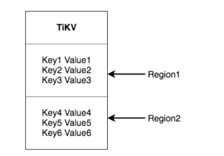
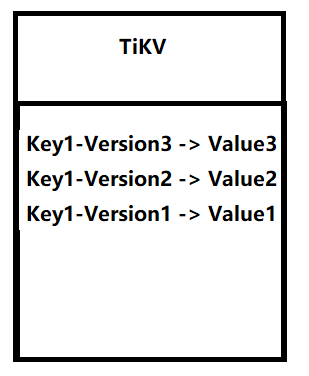
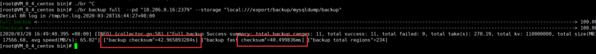
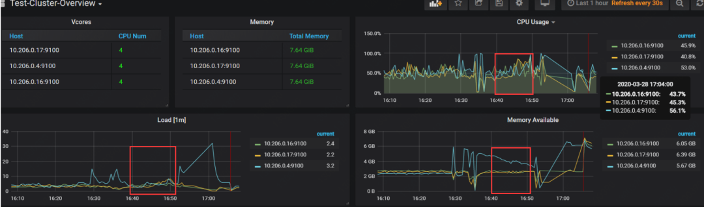
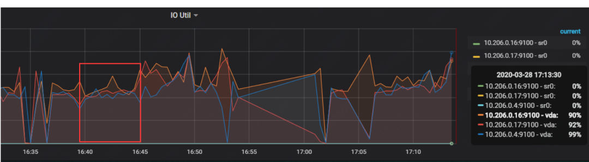
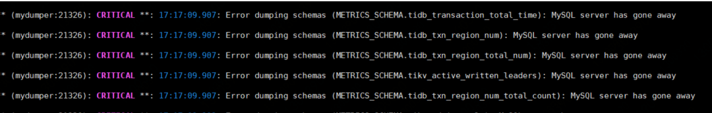
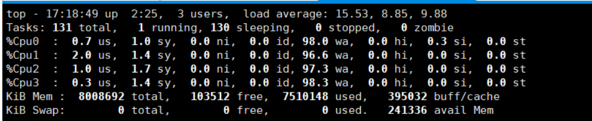

## TiDB用什么保证备份的一致性？ 

**背景**作为一名MySQL DBA，就应该了解MySQL备份无论是逻辑备份还是物理备份，都会使用FLUSH TABLES WITH READ LOCK（下面简称FTWRL）锁来保证数据库备份的一致性。
 描述FTWRL锁对一致性的影响先拿，MySQL逻辑备份MySQLDump举例。MySQLDump，为了保证备份一致性，需要添加2个参数    --single-transaction  --master-data=2 。在开启--single-transaction后，MySQLDump的备份流程大概就是，在MySQL中会执行如下操作。

1. 刷新表flush tables 用来防止DDL操作。

2. 执行FTWRL锁，这个时候整个数据库整体被锁住，让数据库处于一个一致性的状态。
3. 设置当前session（回话）事务的隔离级别为RR。
4. 记录当前的MySQLbinlog的位置，或者GTID信息。
5. 解锁。#从加锁到解锁执行速度会很快，前提是没有锁冲突，如果有锁冲突，就会到锁等待的一个状态。

物理备份xtrabackup，物理备份执行FTWRL锁的时间相对较长，下面来看一下xtrabackup对FTWRL锁的流程。

1. 执行FTWRL锁。
2. 拷贝frm、MYD、MYI、etc拷贝。
3. 等待redo的拷贝完成。
4. 记录当前的MySQLbinlog的位置，或者GTID信息。

5. 解锁。

xtrabackup加锁是为了保证在数据库中如果有MyiSAM表，尽量保证MyiSAM表的备份一致性。
 \#之前有个同学说。物理备份加FTWRL锁会比逻辑备份加锁时间短，这个结论其实是错误的。物理备份加锁的时间完全取决一下当前数据库里有没有MyiSAM表，MyiSAM表的大小。
 TiDB是用什么保证数据库一致性的先说TiDB官方推荐的逻辑备份mydumper， 一开始我以为mydumper也是用FTWRL锁来保证备份的一致性。结果我今天在看文档的时候发现，这个结论是错误的。官方对mydumper进行了优化和修改。先看一下官方的描述。下面内容来自TiDB官方文档。

1. 对于 TiDB 可以设置 tidb_snapshot 的值指定备份数据的时间点，从而保证备份的一致性，而不是通过     FLUSH TABLES WITH READ LOCK 来保证备份一致性。
2. 使用 TiDB     的隐藏列 _tidb_rowid 优化了单表内数据的并发导出性能。

大家先记住 TiDB 是通过 tidb_snapshot，来实现备份，而不是FTWRL锁来保证。这么设计会有什么问题？能保证数据备份的一致性吗？要解答这个问题，要简单说一下TiDB的架构设计。TiDB的存储节点是TiKV，下面主要针对TiKV来说。先把TiKV，理解为很大的一个Key-value的存储器。

（图1选自TiDB官方文档）
 这块跟备份其实没有什么关系，先让大家大概了解一下TiKV存什么。下面的内容就跟备份有关系了，TiDB 的MVCC(多版本控制器）实现是在TiKV中。TiKV中加了MVCC，key和value这样的。

我认为version就是TSO（全局唯一递增时间戳），我是通过TiDB二阶段提交中发现的。如果不是的话version的版本信息就会存在PD里面，这样设计的话会增加PD的压力，感觉不现实。**针对上面描述有一个小的结论TiKV里面会存储历史key的信息。
 下面还是来一个问答来解答上面的疑问。

 问：TiDB是通过什么来保证数据的一致性的？
 答：是基于TiKV里面的MVCC来保证的，根据当前的的时间戳信息，来下发命令** sql="SET SESSION tidb_snapshot = '415599012634951683'"。这个session就会读到这个时间点的历史版本的数据。
 下一步的操作，只要把所有的表和里面的数据扫出来就可以了。
 问：通过MVCC实现的备份，能达到一致性吗？(因为没有锁)
 答：是可以的，大家可以看一下我之前写的《浅析TiDB二阶段提交》那篇文章中里面有写到，只有事务成功提交才能会写入到TiKV中，才会有TSO(全局唯一递增时间戳)。也就是TiKV中里面的key都是成功提交的。那么在备份的过程中提交的成功的事务是不会被扫到的。因为备份过程中提交的事务的tso(全局唯一递增时间戳)会大于当前的备份发起的tso(全局唯一递增时间戳)。
 问: 使用了MVCC的备份方式，会有那些问题?
 答：我认为最大的问题就是 在备份的过程中老的key被GC(垃圾清理)掉，解决这个问题的最好的办法，可以把GC(垃圾清理)时间设置的长一点。
 UPDATE mysql.tidb SET VARIABLE_VALUE = '800h' WHERE VARIABLE_NAME = 'tikv_gc_life_time';可以设置为800h（根据时间情况而定），备份结束后要修改回来，否则会浪费存储空间。
 通过上面的描述，大家应该会了解到TiDB对备份的一致性处理的相关细节。在TiDB4.0的分布式备份恢复工具br，在这块处理是类似的。也是利用MVCC的方式来实现的。
 最后在安利一下TiDB4.0的备份工具br。备份的速度快，消耗资源相对较低。下面的案例**仅供参考**大家感兴趣的话 我可以做一下详细的测试，**留言刷起来**。机器描述：三台腾讯云4C8G SSD50G，Sysbench 压力10张表每张表1千万条数据。

整体大概5分钟左右，brlog里面会记录相关信息。
 开始时间16:44:27.009 结束时间16:49:40.395

相同环境我用mydumper测，mydumper运行在tidb的节点上。mydumper是4个线程数(默认线程数)他备份的过程中把tidb压的OOM了。#可以用-r参数控制每个并发处理的数据量来避免。

大概是我的机器配置低，而且mydumper和tidb-server是同一台机器，这块只是给大家提供一个参考。这块我在后续测一下吧，会有一个完整的测试例子，目前备份工具还是推荐**mydumper**。
 