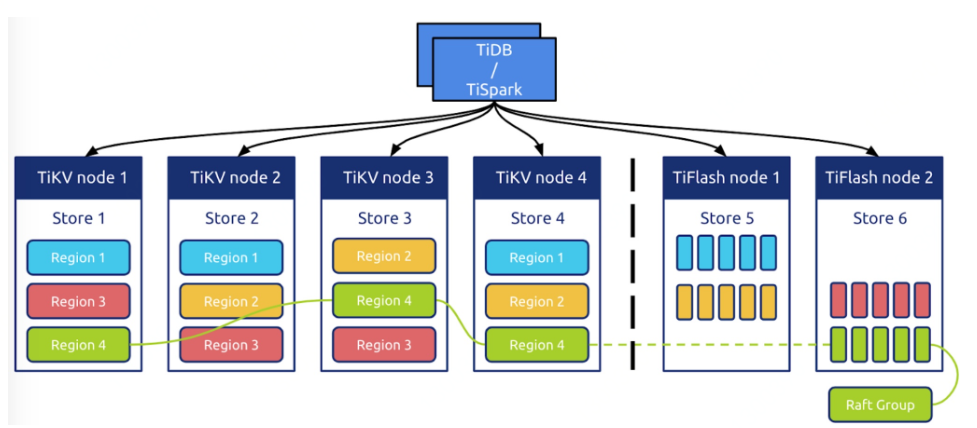
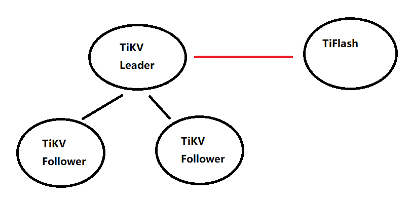
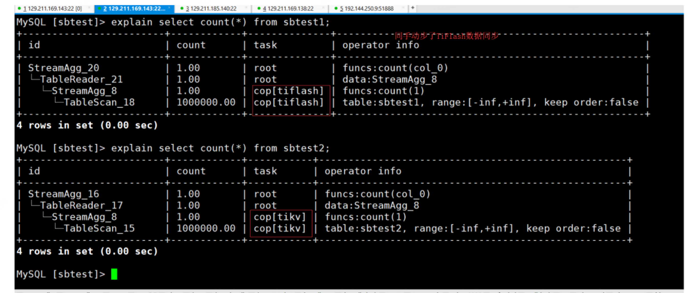
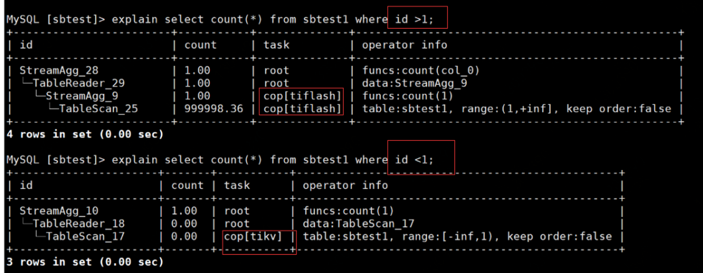

## 初探TiDB-TiFlash 

**简介TiFlash**

TiFlash是TiDB生态组件之一，专门解决OLAP场景。借助ClickHouse实现高效的列式计算。

**介绍TiFlash架构**

一开始，我个人以为他会是用binlog或其他方式把数据同步到TiFlash中，读取数据有专门的接口，结果我的理解是错误的。

如图，TiFlash是通过TiKV把数据同步到TiFlash。大家都知道TiKV中的Region是分leader和Follower。

TiFlash通过Region的leader节点进行数据全量和增量同步。增量同步是通过Raft Log异步复制，相当于MySQL的redo log同步。
 我这里就好奇，为啥不通过TiKV Follower 节点进行全量和增量的同步呢？
 因为本身TiKV的数据就是强一致的，并且TiKV的Leader节点还要承担日常的读写压力。**答：**这个是因为 Raft 协议实现的问题，目前都是以 leader 为准的。（来自神秘好友的解答）目前TiKV应该不支持读写分离，如果把同步的节点改完TiKV的Follower节点，也不会影响数据的一致性，并且能分担Leader节点的压力。**答：**这个的话，现在有 Follower Read 的功能，可以理解为读写分离，但是目前读是强一致性的，后续会允许异步读取数据，也就是从 follower 上读到一段时间之前的数据（来自神秘好友的解答）

**核心特性**

**异步复制**

TiFlash节点和TiKV节点进行复制同步期间，发生网络延迟或者网络抖动，不会影响到TiKV的运行。如果TiFlash节点宕机了，也不会影响TiKV的运行。只要TiKV的数据不丢失，TiFlash的数据就可以通过TiKV进行恢复。

简单来说 你可以把TiFlash和TiKV的关系理解为MySQL的主从架构。MySQL主库和从库之间发生网络抖动，或者MySQL从库挂了。

并不会影响MySQL主库的写入和读取（这里说的是MySQL异步复制）。

**智能选择

** 

TiDB可以自动选择使用 TiFlash 列存或者TiKV行存。不需要通过其他接口访问TiFlash 。其实在这里就实现了一个入口根据实际SQL选择列存或者行存。

实验环境：2张表一个是sbtest1、sbtest2有相同的数据。但sbtest1做了TiFlash同步，sbtest2还是保留TiKV存储。

当sbtest1和sbtest2同时执行count的操作，二个表的执行计划就不同了。

发现sbtest1表走了TiFlash列存储，而sbtest2表则走了TiKV行存储。

实验2：sbtest1表执行不同的SQL，选择行存或者列存就会发生转变。

**计算加速

** 

通过列式引擎来提升TiDB读取的效率的提升。

TiDB架构中本身就实现了计算下推，把计算任务推给了存储引擎层也就是TiKV。

在新增列式存储TiFlash环境中，TiFlash也承担计算任务。

**一致性

** 

TiFlash和TiKV一样提供快照隔离的支持，并且保证读取数据最新。这个一致性是通过复制进度校验来实现的。

每次接收到读取请求，TiFlash 会向 Leader 发起进度校对。

只有当进度确保至少所包含读取请求时间戳所覆盖的数据之后才响应读取。

**部署TiFlash**

TiDB版本大于TiDB3.1和TiDB4.0 。在tidb-ansible找到

[tiflash_servers] 填写主机名和data目录。

其他操作和部署TiDB无异，目前官方推荐使用TiUP进行部署，可以参考官方。

需要注意的是 不建议TiFlash和TiKV混合部署，不建议部署多实例。

个人建议TiFlash的配置比TiKV的配置要高一点。

因为毕竟TiFlash要跑OLAP业务，消耗资源可能会多一点。

**使用TiFlash

** 

TiFlash接入后，默认不会进行数据同步。可以针对表来进行TiFlash副本。

按照表构建TiFlash。

ALTER TABLE table_name SET TIFLASH REPLICA count

\#count表示副本数 ALTER TABLE table_name SET TIFLASH REPLICA 1 

查看表的同步进度

SELECT * FROM information_schema.tiflash_replica WHERE TABLE_SCHEMA = '<db_name>' and TABLE_NAME = '<table_name>'TiSpark可以直接读取TiFlash中的数据。
 优点
 业务可以通过TiDB直接跑OLAP场景的SQL。减少维护成本 数据库（MySQL）到分析类型的数据库（例如hadoop）之间的链路同步工具。减少分析数据库（例如hadoop）的维护成本。
 美中不足
 资源隔离和资源调度虽然TiFlash和TiKV中有资源隔离。TiFlash不会影响到TiKV的性能。但我想说的是TiFlash里的资源调度。如果大量的消耗资源的SQL在TiFlash中运行，TiFlash会不会把整个系统的资源跑满？导致重要的其他SQL无法运行。可以把一些慢的 不重要的SQL分配较少的系统资源。重要的SQL分配更多的系统资源。

 总结
 TiFlash还是一款非常不错的组件，能够解决一些痛点，满足一些场景的需求，在官方持续维护下TiFlash的未来还是非常可期的。
 其实我和叶老师非常好奇TiFlash VS ClickHouse 谁的性能更好，查询的SQL更快。一直想让我出一篇测试类的文章。其实我一直没写测试类型的文章。主要的原因：没有合适的机器。相对TiFlash 的测试方式，我也没有想好，应该不能用Sysbench去压测。小调查：大家对TiDB基础类型的文章有兴趣吗？如果有可以留言。

