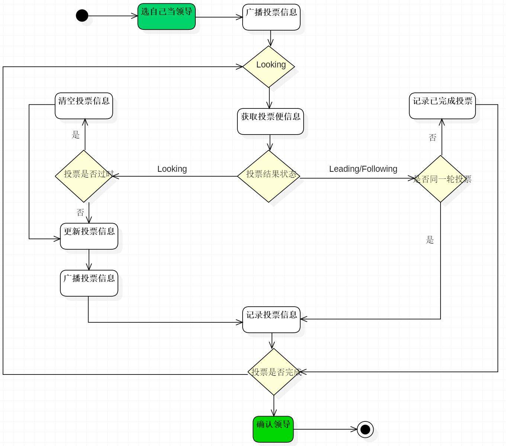
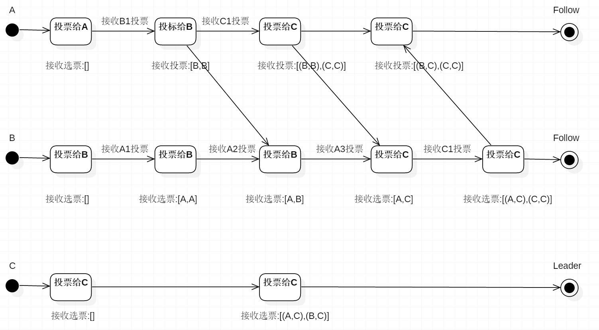
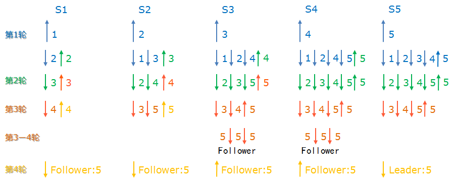

# ZooKeeper选举制度

> https://blog.csdn.net/bocai8058/article/details/82663330

[GSpinach](https://blog.csdn.net/bocai8058) 2018-09-12 16:12:31 

分类专栏： [ZooKeeper](https://blog.csdn.net/bocai8058/category_7912437.html) 文章标签： [zk](https://www.csdn.net/tags/MtzaMg1sMTA1NjMtYmxvZwO0O0OO0O0O.html) [zookeeper](https://www.csdn.net/tags/MtTaEgxsMDI5NTUtYmxvZwO0O0OO0O0O.html) [zk选举机制](https://www.csdn.net/tags/MtTacgwsOTMxMTItYmxvZwO0O0OO0O0O.html) [zookeeper选举机制](https://www.csdn.net/tags/MtTaEgxsMDE0MjMtYmxvZwO0O0OO0O0O.html)

版权

```
@Author  : Spinach | GHB
@Link    : http://blog.csdn.net/bocai805812
```

------


- - 概念
    - [1.leader的选举机制，zookeeper提供了三种方式](https://blog.csdn.net/bocai8058/article/details/82663330?ops_request_misc=%7B%22request%5Fid%22%3A%22160456922719725255526233%22%2C%22scm%22%3A%2220140713.130102334.pc%5Fall.%22%7D&request_id=160456922719725255526233&biz_id=0&utm_medium=distribute.pc_search_result.none-task-blog-2~all~first_rank_v2~rank_v28-2-82663330.first_rank_ecpm_v3_pc_rank_v2&utm_term=zookeeper作用和选举制度&spm=1018.2118.3001.4449#1leader的选举机制zookeeper提供了三种方式)
    - 2.选举机制中的概念
      - [2.1 服务器ID](https://blog.csdn.net/bocai8058/article/details/82663330?ops_request_misc=%7B%22request%5Fid%22%3A%22160456922719725255526233%22%2C%22scm%22%3A%2220140713.130102334.pc%5Fall.%22%7D&request_id=160456922719725255526233&biz_id=0&utm_medium=distribute.pc_search_result.none-task-blog-2~all~first_rank_v2~rank_v28-2-82663330.first_rank_ecpm_v3_pc_rank_v2&utm_term=zookeeper作用和选举制度&spm=1018.2118.3001.4449#21-服务器id)
      - [2.2 数据ID](https://blog.csdn.net/bocai8058/article/details/82663330?ops_request_misc=%7B%22request%5Fid%22%3A%22160456922719725255526233%22%2C%22scm%22%3A%2220140713.130102334.pc%5Fall.%22%7D&request_id=160456922719725255526233&biz_id=0&utm_medium=distribute.pc_search_result.none-task-blog-2~all~first_rank_v2~rank_v28-2-82663330.first_rank_ecpm_v3_pc_rank_v2&utm_term=zookeeper作用和选举制度&spm=1018.2118.3001.4449#22-数据id)
      - [2.3 逻辑是种](https://blog.csdn.net/bocai8058/article/details/82663330?ops_request_misc=%7B%22request%5Fid%22%3A%22160456922719725255526233%22%2C%22scm%22%3A%2220140713.130102334.pc%5Fall.%22%7D&request_id=160456922719725255526233&biz_id=0&utm_medium=distribute.pc_search_result.none-task-blog-2~all~first_rank_v2~rank_v28-2-82663330.first_rank_ecpm_v3_pc_rank_v2&utm_term=zookeeper作用和选举制度&spm=1018.2118.3001.4449#23-逻辑是种)
      - [2.4 选举状态](https://blog.csdn.net/bocai8058/article/details/82663330?ops_request_misc=%7B%22request%5Fid%22%3A%22160456922719725255526233%22%2C%22scm%22%3A%2220140713.130102334.pc%5Fall.%22%7D&request_id=160456922719725255526233&biz_id=0&utm_medium=distribute.pc_search_result.none-task-blog-2~all~first_rank_v2~rank_v28-2-82663330.first_rank_ecpm_v3_pc_rank_v2&utm_term=zookeeper作用和选举制度&spm=1018.2118.3001.4449#24-选举状态)
      - [2.5 选举消息内容](https://blog.csdn.net/bocai8058/article/details/82663330?ops_request_misc=%7B%22request%5Fid%22%3A%22160456922719725255526233%22%2C%22scm%22%3A%2220140713.130102334.pc%5Fall.%22%7D&request_id=160456922719725255526233&biz_id=0&utm_medium=distribute.pc_search_result.none-task-blog-2~all~first_rank_v2~rank_v28-2-82663330.first_rank_ecpm_v3_pc_rank_v2&utm_term=zookeeper作用和选举制度&spm=1018.2118.3001.4449#25-选举消息内容)
  - 选举流程
    - [1.zk的选举机制(zk的数据一致性核心算法paxos)](https://blog.csdn.net/bocai8058/article/details/82663330?ops_request_misc=%7B%22request%5Fid%22%3A%22160456922719725255526233%22%2C%22scm%22%3A%2220140713.130102334.pc%5Fall.%22%7D&request_id=160456922719725255526233&biz_id=0&utm_medium=distribute.pc_search_result.none-task-blog-2~all~first_rank_v2~rank_v28-2-82663330.first_rank_ecpm_v3_pc_rank_v2&utm_term=zookeeper作用和选举制度&spm=1018.2118.3001.4449#1zk的选举机制zk的数据一致性核心算法paxos)
    - [2.非全新集群的选举机制(数据恢复)](https://blog.csdn.net/bocai8058/article/details/82663330?ops_request_misc=%7B%22request%5Fid%22%3A%22160456922719725255526233%22%2C%22scm%22%3A%2220140713.130102334.pc%5Fall.%22%7D&request_id=160456922719725255526233&biz_id=0&utm_medium=distribute.pc_search_result.none-task-blog-2~all~first_rank_v2~rank_v28-2-82663330.first_rank_ecpm_v3_pc_rank_v2&utm_term=zookeeper作用和选举制度&spm=1018.2118.3001.4449#2非全新集群的选举机制数据恢复)


### 概念

#### 1.leader的选举机制，zookeeper提供了三种方式

- LeaderElection
- AuthFastLeaderElection
- FastLeaderElection

默认的算法是FastLeaderElection，下面主要分析默认算法的选举机制。

#### 2.选举机制中的概念

##### 2.1 服务器ID

> 比如有三台服务器，编号分别是1,2,3。

```
编号越大在选择算法中的权重越大。
```

##### 2.2 数据ID

> 服务器中存放的最大数据ID。

```
值越大说明数据越新，在选举算法中数据越新权重越大。
```

##### 2.3 逻辑时钟

```
又称叫投票的次数，同一轮投票过程中的逻辑时钟值是相同的。
每投完一次票这个数据就会增加，然后与接收到的其它服务器返回的投票信息中的数值相比，根据不同的值做出不同的判断。
```

##### 2.4 选举状态

```
LOOKING：竞选状态。
FOLLOWING：随从状态，同步leader状态，参与投票。
OBSERVING：观察状态,同步leader状态，不参与投票。
LEADING：领导者状态。
```

##### 2.5 选举消息内容

```
服务器ID
数据ID
逻辑时钟
选举状态
```

### 选举流程

#### 1.zk的选举机制(zk的数据一致性核心算法paxos)

- 选举流程图

  > 因为每个服务器都是独立的，在启动时均从初始状态开始参与选举





- 选举状态图

  > 描述Leader选择过程中的状态变化，这是假设全部实例中均没有数据，假设服务器启动顺序分别为：A,B,C。




默认是采用投票数大于半数则胜出的逻辑。

> 假设在选举的过程中，“S1”,“S2”两个节点出现了宕机的情况(或网络延迟，或网络物理层断开等)，如下图所示：



- 在第一轮中，按照“我最牛逼，我怕谁”的原则，每个节点都推荐它自己为集群的leader节点。
- 按照我们假设的理想条件，节点S1首先收到了S2发送来的推荐者“2”，节点S1发现“2”要比它之前推荐的“1”（也就是它自己）牛。根据谁牛推荐谁的原则，S1清空自己的票箱，重新选举“2”（注意，此时“S1”的新票箱中已经有两票选举“2”了，一票是它自己，另外一票是S2，并且所有节点都是Looking状态）
- 同样的事情发生在S2身上：S2收到了S3发过来的推荐信息，发现“3”这个被推举者比之前自己推举的“2”要牛，于是也清空自己的票箱，发起一轮新的投票，此时S2选举“3”。依次类推S3、S4。
- 这里要注意S5这个节点，在第一轮接受到了来源于S1——S4的推举者（一定注意，每一次接受信息，都会广播一次“我坚持推举的人”），发现“还是推荐的5最牛”，于是“我继续推举S5吧”。
- 以上这个过程在整个理想的网络环境上一直持续。到了第四轮，S1收到了S2发送来的推举者“5”，发现“5”要比当前S1推荐的“4”要牛。所以S1清空了自己的票箱，重新推举“5”（发送给其他所有节点）。
- 上图所示，在第三轮的选举过程后，S1,S2两个节点就断开了，他们的投票信息根本没有发送出去。这样一来，S3收到了S4，S5发来的投票信息，这时S3的票箱处于第3轮，并且发现了占大多数的投票结果：大家选举S5为Leader节点。
- 同样的事情也发生在S4身上。这样S3，S4两个节点率先知道了投票结果，在最后一次询问Leader节点是否能正常工作，并得到了肯定的ACK之后，S3，S4两个节点变成了Follower状态。之后，无论S3，S4两个节点收到了任何节点的投票信息，都直接向源节点反馈投票结果，不会再进行投票了。
- 这样一来，在投票完成后，S1，S2重新连入后，虽然他们发起了投票，但是不会再收到投票反馈了。直接根据S3或者S4发来的结果状态，变成Follower状态。
- 于是，节点X，收到了大于N/2+1的选举“5”的投票，且都是第五轮投票。这样每个节点就都知道了自己的角色。选举结束。所有将成为Follower状态的节点，向将要成为Leader的节点发起最后一次“工作是否正常”的询问。得到肯定的ack后，整个集群的工作状态就确认了。

#### 2.非全新集群的选举机制(数据恢复)

那么，初始化的时候，是按照上述的说明进行选举的，但是当zookeeper运行了一段时间之后，有机器down掉，重新选举时，选举过程就相对复杂了。

> 需要加入数据version、leader id和逻辑时钟。

```
数据version：数据新的version就大，数据每次更新都会更新version。
Leader id：就是我们配置的myid中的值，每个机器一个。
逻辑时钟：这个值从0开始递增，每次选举对应一个值，也就是说：如果在同一次选举中，那么这个值应该是一致的;逻辑时钟值越大，说明这一次选举leader的进程更新。
```

选举的标准就变成：

```
1、逻辑时钟小的选举结果被忽略，重新投票
2、统一逻辑时钟后，数据id大的胜出
3、数据id相同的情况下，leaderid大的胜出
```

根据这个规则选出leader。